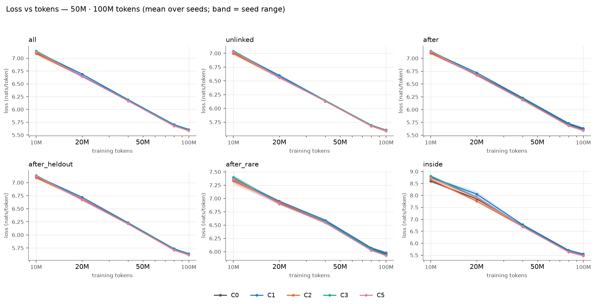
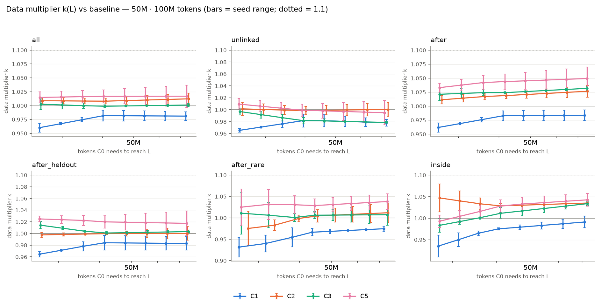

# S0 sanity pilot (50M from scratch, 100M tokens)

10 runs found, 10 complete. Baseline **C0** (a cohort without it uses C0'). Paired differences are condition − reference at the final evaluation (negative = lower loss), token-weighted; CIs are 95% cluster bootstraps over evaluation windows (10000 resamples; each window carries every seed) when `eval_windows.npz` exists, else seed-level t intervals. `*` = significant after Holm correction over the condition grid within the stratum. Final-loss cells are mean ± half-width of the seed-level 95% t interval.

## Runs

| Cohort | Condition | Seed | Status | Final tokens | Windows saved | Probes | Parameters | Channel | tokens/s |
|---|---|---:|---|---:|---|---|---:|---:|---:|
| 50M · 100M tokens | C0 | 1 | complete | 99.9M | yes | yes | 51,475,968 | 0 | 66,729 |
| 50M · 100M tokens | C0 | 2 | complete | 99.9M | yes | yes | 51,475,968 | 0 | 67,464 |
| 50M · 100M tokens | C1 | 1 | complete | 99.9M | yes | no | 51,476,995 | 1,027 | 69,395 |
| 50M · 100M tokens | C1 | 2 | complete | 99.9M | yes | no | 51,476,995 | 1,027 | 69,566 |
| 50M · 100M tokens | C2 | 1 | complete | 99.9M | yes | no | 53,721,258 | 2,245,290 | 69,526 |
| 50M · 100M tokens | C2 | 2 | complete | 99.9M | yes | no | 53,721,258 | 2,245,290 | 69,437 |
| 50M · 100M tokens | C3 | 1 | complete | 99.9M | yes | no | 53,709,314 | 2,233,346 | 69,067 |
| 50M · 100M tokens | C3 | 2 | complete | 99.9M | yes | no | 53,709,314 | 2,233,346 | 69,187 |
| 50M · 100M tokens | C5 | 1 | complete | 99.9M | yes | no | 53,717,699 | 2,237,635 | 68,251 |
| 50M · 100M tokens | C5 | 2 | complete | 99.9M | yes | no | 53,717,699 | 2,237,635 | 68,239 |

## 50M · 100M tokens

> Exploratory: the pre-registered gate is defined at 125M × 500M tokens; 2 seeds (the gate needs 3). Gate verdicts below are computed mechanically, not as a gate.

Conditions and seeds: C0 [1, 2]; C1 [1, 2]; C2 [1, 2]; C3 [1, 2]; C5 [1, 2].

### Final loss per stratum

| Stratum | Targets | C0 | C1 | C2 | C3 | C5 |
|---|---:|---:|---:|---:|---:|---:|
| all | 523,776 | 5.5942 ± 0.0259 | 5.6100 ± 0.0206 | 5.5853 ± 0.1312 | 5.5947 ± 0.0044 | 5.5853 ± 0.2632 |
| unlinked | 327,905 | 5.5901 ± 0.0288 | 5.6071 ± 0.0056 | 5.5896 ± 0.1380 | 5.6057 ± 0.0139 | 5.5967 ± 0.2625 |
| inside | 32,729 | 5.5455 ± 0.0421 | 5.5499 ± 0.3899 | 5.4970 ± 0.0300 | 5.4903 ± 0.1764 | 5.4725 ± 0.1906 |
| after | 175,271 | 5.6210 ± 0.0214 | 5.6354 ± 0.0258 | 5.6010 ± 0.1369 | 5.5990 ± 0.0087 | 5.5897 ± 0.2734 |
| after_heldout | 26,855 | 5.6244 ± 0.0484 | 5.6402 ± 0.0146 | 5.6233 ± 0.1719 | 5.6219 ± 0.0261 | 5.6160 ± 0.3025 |
| after_rare | 335 | 5.9569 ± 0.2846 | 5.9805 ± 0.2377 | 5.9344 ± 0.2557 | 5.9350 ± 0.0267 | 5.9255 ± 0.0096 |
| after_mid | 4,405 | 5.8610 ± 0.0948 | 5.8790 ± 0.1191 | 5.8473 ± 0.0168 | 5.8394 ± 0.0014 | 5.8283 ± 0.1791 |
| after_frequent | 151,951 | 5.6142 ± 0.0203 | 5.6284 ± 0.0233 | 5.5913 ± 0.1372 | 5.5881 ± 0.0062 | 5.5782 ± 0.2709 |
| after_len1 | 0 | – | – | – | – | – |
| after_len2 | 144,240 | 5.6088 ± 0.0249 | 5.6233 ± 0.0227 | 5.5897 ± 0.1408 | 5.5893 ± 0.0059 | 5.5797 ± 0.2699 |
| after_len3plus | 44,782 | 5.6914 ± 0.0097 | 5.7041 ± 0.0333 | 5.6632 ± 0.1184 | 5.6494 ± 0.0050 | 5.6402 ± 0.2719 |

### Relative difference vs C0 (condition − C0) / C0

| Stratum | C1 | C2 | C3 | C5 |
|---|---:|---:|---:|---:|
| all | +0.28% [+0.27, +0.30]* | -0.16% [-0.18, -0.14]* | +0.01% [-0.01, +0.03] | -0.16% [-0.18, -0.14]* |
| unlinked | +0.30% [+0.29, +0.32]* | -0.01% [-0.03, +0.01] | +0.28% [+0.25, +0.30]* | +0.12% [+0.10, +0.14]* |
| inside | +0.08% [+0.01, +0.15]* | -0.87% [-0.95, -0.80]* | -1.00% [-1.11, -0.88]* | -1.32% [-1.45, -1.19]* |
| after | +0.26% [+0.23, +0.28]* | -0.35% [-0.39, -0.32]* | -0.39% [-0.43, -0.35]* | -0.56% [-0.60, -0.51]* |
| after_heldout | +0.28% [+0.23, +0.33]* | -0.02% [-0.08, +0.04] | -0.04% [-0.14, +0.06] | -0.15% [-0.26, -0.04]* |
| after_rare | +0.40% [+0.05, +0.81] | -0.38% [-1.34, +0.54] | -0.37% [-1.15, +0.63] | -0.53% [-1.45, +0.40] |
| after_mid | +0.31% [+0.20, +0.42]* | -0.23% [-0.38, -0.08]* | -0.37% [-0.60, -0.12]* | -0.56% [-0.80, -0.32]* |
| after_frequent | +0.25% [+0.23, +0.28]* | -0.41% [-0.44, -0.37]* | -0.46% [-0.51, -0.42]* | -0.64% [-0.69, -0.60]* |
| after_len1 | – | – | – | – |
| after_len2 | +0.26% [+0.24, +0.28]* | -0.34% [-0.37, -0.31]* | -0.35% [-0.39, -0.30]* | -0.52% [-0.57, -0.47]* |
| after_len3plus | +0.22% [+0.17, +0.27]* | -0.49% [-0.57, -0.42]* | -0.74% [-0.83, -0.64]* | -0.90% [-0.99, -0.80]* |

Method: window bootstrap.

### Relative difference vs C1 (condition − C1) / C1

| Stratum | C2 | C3 | C5 |
|---|---:|---:|---:|
| all | -0.44% [-0.46, -0.42]* | -0.27% [-0.29, -0.25]* | -0.44% [-0.46, -0.42]* |
| unlinked | -0.31% [-0.33, -0.29]* | -0.03% [-0.05, -0.01]* | -0.19% [-0.21, -0.17]* |
| inside | -0.95% [-1.03, -0.87]* | -1.07% [-1.19, -0.96]* | -1.39% [-1.52, -1.27]* |
| after | -0.61% [-0.64, -0.58]* | -0.65% [-0.69, -0.60]* | -0.81% [-0.86, -0.77]* |
| after_heldout | -0.30% [-0.36, -0.24]* | -0.32% [-0.43, -0.22]* | -0.43% [-0.54, -0.32]* |
| after_rare | -0.77% [-1.68, +0.12] | -0.76% [-1.49, +0.15] | -0.92% [-1.88, -0.05] |
| after_mid | -0.54% [-0.70, -0.37]* | -0.67% [-0.91, -0.42]* | -0.86% [-1.10, -0.62]* |
| after_frequent | -0.66% [-0.69, -0.62]* | -0.71% [-0.76, -0.67]* | -0.89% [-0.94, -0.84]* |
| after_len1 | – | – | – |
| after_len2 | -0.60% [-0.64, -0.56]* | -0.60% [-0.65, -0.56]* | -0.77% [-0.82, -0.73]* |
| after_len3plus | -0.72% [-0.78, -0.65]* | -0.96% [-1.05, -0.87]* | -1.12% [-1.21, -1.03]* |

Method: window bootstrap.

### Relative difference vs C2 (condition − C2) / C2

| Stratum | C3 | C5 |
|---|---:|---:|
| all | +0.17% [+0.15, +0.19]* | -0.00% [-0.02, +0.02] |
| unlinked | +0.29% [+0.27, +0.31]* | +0.13% [+0.11, +0.14]* |
| inside | -0.12% [-0.24, -0.01]* | -0.45% [-0.57, -0.32]* |
| after | -0.04% [-0.07, +0.00] | -0.20% [-0.24, -0.16]* |
| after_heldout | -0.02% [-0.13, +0.09] | -0.13% [-0.24, -0.02] |
| after_rare | +0.01% [-0.80, +0.82] | -0.15% [-1.16, +0.87] |
| after_mid | -0.14% [-0.34, +0.08] | -0.33% [-0.53, -0.12]* |
| after_frequent | -0.06% [-0.09, -0.02]* | -0.23% [-0.27, -0.19]* |
| after_len1 | – | – |
| after_len2 | -0.01% [-0.05, +0.03] | -0.18% [-0.22, -0.14]* |
| after_len3plus | -0.24% [-0.32, -0.16]* | -0.41% [-0.48, -0.33]* |

Method: window bootstrap.

### E4 gate items

| Candidate | 1 held-out vs C2 | 2 linked vs C1 | 3 locality | 4 probes | Overall |
|---|---|---|---|---|---|
| C5 | fail | fail | pass | not available | **fail** |

- C5 item 1: held-out Δ -0.0073 [-0.0138, -0.0009]; rare relative upper bound +0.87% (margin +0.50%); channel parameters 2,237,635 vs C2 2,245,290
- C5 item 2: better than C1 on 7/8; not on after_rare
- C5 item 3: unlinked +0.12% vs C0, upper bound +0.14% (margin +0.50%)
- C5 item 4: no probes.json for the candidate and the baseline

### Convergence

Data multiplier `k = D_C0(L) / D_cond(L)` at the lowest common loss target (the one the escalation rule uses), with the seed-level CI; gaps are baseline − condition (positive = condition better), projected with per-seed power-law fits.

| Stratum | Condition | Target L | k [95% CI] | Final gap | Projected gap @ 2.5B | Projected gap @ 7B |
|---|---|---:|---|---|---|---|
| all | C1 | 5.7576 | +0.981 [+0.882, +1.080] | -0.0158 [-0.0624, +0.0308] | -0.0086 [-0.2995, +0.2823] | -0.0069 [-0.3330, +0.3192] |
| all | C2 | 5.7424 | +1.012 [+0.881, +1.144] | +0.0089 [-0.0964, +0.1142] | -0.0009 [-0.1062, +0.1044] | -0.0024 [-0.1090, +0.1042] |
| all | C3 | 5.7438 | +1.001 [+0.970, +1.033] | -0.0005 [-0.0220, +0.0210] | +0.0246 [-0.2462, +0.2954] | +0.0281 [-0.2830, +0.3392] |
| all | C5 | 5.7526 | +1.017 [+0.762, +1.272] | +0.0089 [-0.2284, +0.2462] | +0.0300 [-0.1312, +0.1911] | +0.0325 [-0.1216, +0.1866] |
| unlinked | C1 | 5.7446 | +0.978 [+0.906, +1.051] | -0.0170 [-0.0403, +0.0062] | -0.0177 [-0.2261, +0.1907] | -0.0175 [-0.2509, +0.2158] |
| unlinked | C2 | 5.7366 | +1.000 [+0.855, +1.146] | +0.0005 [-0.1086, +0.1096] | -0.0196 [-0.1170, +0.0778] | -0.0227 [-0.1196, +0.0742] |
| unlinked | C3 | 5.7439 | +0.979 [+0.959, +0.998] | -0.0156 [-0.0305, -0.0006] | -0.0414 [-0.1639, +0.0811] | -0.0549 [-0.3146, +0.2047] |
| unlinked | C5 | 5.7534 | +0.995 [+0.734, +1.256] | -0.0066 [-0.2402, +0.2271] | -0.0597 [-0.8701, +0.7507] | -0.0844 [-1.1937, +1.0248] |
| inside | C1 | 5.8754 | +0.991 [+0.819, +1.163] | -0.0044 [-0.4363, +0.4275] | +0.0814 [-0.9958, +1.1586] | +0.0885 [-1.0219, +1.1989] |
| inside | C2 | 5.8468 | +1.035 [+1.017, +1.053] | +0.0485 [-0.0236, +0.1206] | +0.0936 [-0.0188, +0.2060] | +0.0914 [-0.0112, +0.1939] |
| inside | C3 | 5.8468 | +1.034 [+0.975, +1.092] | +0.0552 [-0.1632, +0.2737] | +0.1823 [-0.1557, +0.5202] | +0.1852 [-0.1662, +0.5366] |
| inside | C5 | 5.8468 | +1.043 [+0.856, +1.229] | +0.0730 [-0.0756, +0.2215] | +0.1611 [-0.3042, +0.6265] | +0.1617 [-0.2853, +0.6086] |
| after | C1 | 5.7823 | +0.984 [+0.863, +1.104] | -0.0145 [-0.0617, +0.0327] | -0.0095 [-0.2957, +0.2767] | -0.0082 [-0.3289, +0.3125] |
| after | C2 | 5.7673 | +1.027 [+0.893, +1.160] | +0.0199 [-0.0955, +0.1354] | +0.0186 [-0.1211, +0.1582] | +0.0185 [-0.1257, +0.1626] |
| after | C3 | 5.7690 | +1.032 [+0.991, +1.073] | +0.0219 [+0.0092, +0.0346] | +0.0592 [-0.1637, +0.2820] | +0.0644 [-0.1934, +0.3221] |
| after | C5 | 5.7690 | +1.049 [+0.790, +1.309] | +0.0313 [-0.2207, +0.2832] | +0.0696 [-0.1515, +0.2908] | +0.0745 [-0.1461, +0.2951] |
| after_heldout | C1 | 5.7850 | +0.983 [+0.837, +1.129] | -0.0158 [-0.0788, +0.0471] | -0.0125 [-0.3378, +0.3127] | -0.0116 [-0.3738, +0.3505] |
| after_heldout | C2 | 5.7794 | +1.000 [+0.852, +1.148] | +0.0011 [-0.1225, +0.1246] | -0.0148 [-0.1566, +0.1271] | -0.0170 [-0.1656, +0.1316] |
| after_heldout | C3 | 5.7731 | +1.003 [+0.967, +1.039] | +0.0025 [-0.0198, +0.0248] | +0.0209 [-0.2426, +0.2844] | +0.0234 [-0.2780, +0.3249] |
| after_heldout | C5 | 5.7836 | +1.017 [+0.747, +1.288] | +0.0084 [-0.2457, +0.2625] | +0.0277 [-0.1826, +0.2380] | +0.0297 [-0.1808, +0.2403] |
| after_rare | C1 | 6.1285 | +0.975 [+0.900, +1.049] | -0.0236 [-0.0704, +0.0233] | -0.0283 [-0.0677, +0.0110] | -0.0285 [-0.0797, +0.0226] |
| after_rare | C2 | 6.1066 | +1.012 [+0.723, +1.301] | +0.0226 [-0.0063, +0.0514] | +0.0103 [-0.2023, +0.2228] | +0.0105 [-0.2345, +0.2556] |
| after_rare | C3 | 6.1106 | +1.007 [+0.690, +1.325] | +0.0219 [-0.2893, +0.3332] | +0.0570 [-0.2051, +0.3192] | +0.0641 [-0.1924, +0.3207] |
| after_rare | C5 | 6.1106 | +1.038 [+0.806, +1.270] | +0.0314 [-0.2436, +0.3064] | +0.0610 [-0.2129, +0.3349] | +0.0662 [-0.2100, +0.3424] |

Power-law fits `L(D) = E + B·(D/D₀)^(−β)` (mean over seeds):

| Stratum | Condition | E | B | β | RMSE |
|---|---|---:|---:|---:|---:|
| all | C0 | 0.0000 | 7.1332 | 0.106 | 0.0231 |
| all | C1 | 0.0000 | 7.1562 | 0.106 | 0.0292 |
| all | C2 | 0.0000 | 7.1182 | 0.106 | 0.0264 |
| all | C3 | 0.0000 | 7.1537 | 0.108 | 0.0177 |
| all | C5 | 0.0000 | 7.1402 | 0.108 | 0.0199 |
| unlinked | C0 | 0.0000 | 7.0297 | 0.100 | 0.0155 |
| unlinked | C1 | 0.0000 | 7.0438 | 0.100 | 0.0192 |
| unlinked | C2 | 0.0000 | 7.0124 | 0.099 | 0.0191 |
| unlinked | C3 | 0.4194 | 6.6252 | 0.108 | 0.0141 |
| unlinked | C5 | 0.6864 | 6.3468 | 0.114 | 0.0152 |
| after | C0 | 0.0000 | 7.1505 | 0.105 | 0.0289 |
| after | C1 | 0.0000 | 7.1705 | 0.105 | 0.0357 |
| after | C2 | 0.0000 | 7.1369 | 0.105 | 0.0345 |
| after | C3 | 0.0000 | 7.1654 | 0.108 | 0.0233 |
| after | C5 | 0.0000 | 7.1556 | 0.108 | 0.0252 |
| after_heldout | C0 | 0.0000 | 7.1460 | 0.104 | 0.0313 |
| after_heldout | C1 | 0.0000 | 7.1638 | 0.104 | 0.0374 |
| after_heldout | C2 | 0.0000 | 7.1331 | 0.103 | 0.0364 |
| after_heldout | C3 | 0.0000 | 7.1573 | 0.105 | 0.0239 |
| after_heldout | C5 | 0.0000 | 7.1481 | 0.105 | 0.0251 |
| after_rare | C0 | 0.0000 | 7.3727 | 0.092 | 0.0390 |
| after_rare | C1 | 0.0000 | 7.3929 | 0.091 | 0.0435 |
| after_rare | C2 | 0.0000 | 7.3667 | 0.092 | 0.0537 |
| after_rare | C3 | 0.0000 | 7.3996 | 0.095 | 0.0402 |
| after_rare | C5 | 0.0000 | 7.3777 | 0.095 | 0.0396 |
| inside | C0 | 0.0000 | 8.7433 | 0.196 | 0.1338 |
| inside | C1 | 0.0000 | 8.9422 | 0.205 | 0.1699 |
| inside | C2 | 0.0000 | 8.7604 | 0.202 | 0.1009 |
| inside | C3 | 0.0000 | 8.9403 | 0.211 | 0.1247 |
| inside | C5 | 0.0000 | 8.8753 | 0.209 | 0.1366 |

Escalation rule (§0.13; rule ii against C1/C2/C1h, rule iii projection or size trend):

| Candidate | Stratum | k mean | k CI low | (i) k_low > 1.1 | (ii) controls | (iii) projection / size trend | Escalate |
|---|---|---:|---:|---|---|---|---|
| C3 | after_heldout | 1.003 | 0.967 | False | C1 not beaten, C2 not beaten | False / False | **False** |
| C3 | after_rare | 1.007 | 0.690 | False | C1 not beaten, C2 not beaten | False / False | **False** |
| C5 | after_heldout | 1.017 | 0.747 | False | C1 not beaten, C2 not beaten | False / False | **False** |
| C5 | after_rare | 1.038 | 0.806 | False | C1 not beaten, C2 not beaten | False / False | **False** |

### Throughput and parameters

| Condition | tokens/s | Overhead vs C0 | Parameters | Channel parameters | Channel bytes fp32 / fp16 |
|---|---:|---:|---:|---:|---:|
| C0 | 67,097 | +0.0% | 51,475,968 | 0 | 0.0 / 0.0 MiB |
| C1 | 69,480 | -3.4% | 51,476,995 | 1,027 | 0.0 / 0.0 MiB |
| C2 | 69,481 | -3.4% | 53,721,258 | 2,245,290 | 8.6 / 4.3 MiB |
| C3 | 69,127 | -2.9% | 53,709,314 | 2,233,346 | 8.5 / 4.3 MiB |
| C5 | 68,245 | -1.7% | 53,717,699 | 2,237,635 | 8.5 / 4.3 MiB |

Throughput is the median logged training rate per run (evaluation intervals included in a few log windows); the GPU is shared, so treat overheads as indicative.

### Figures

