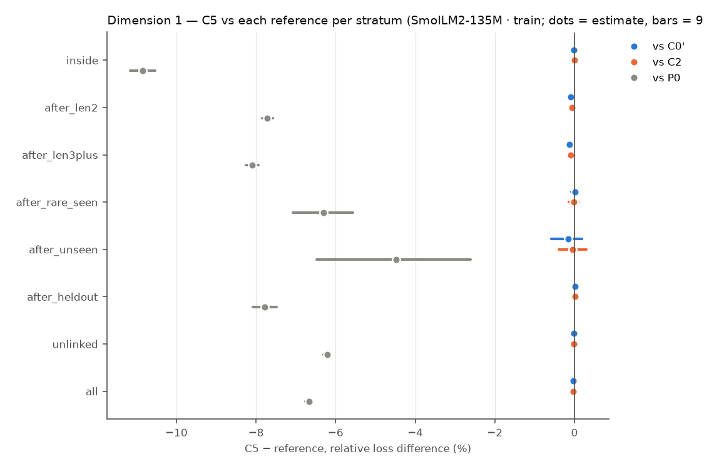
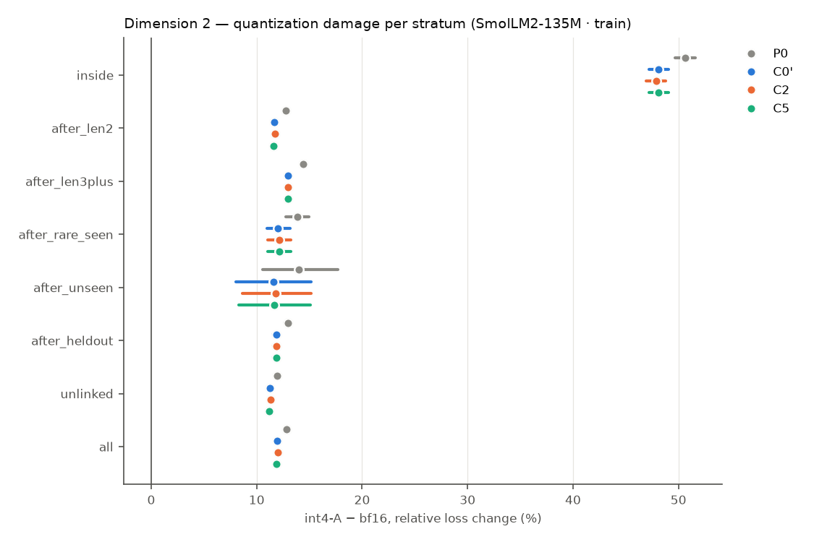
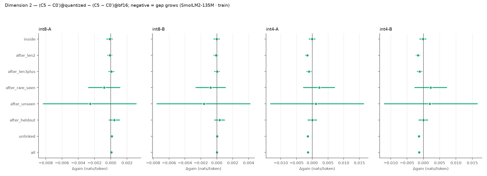
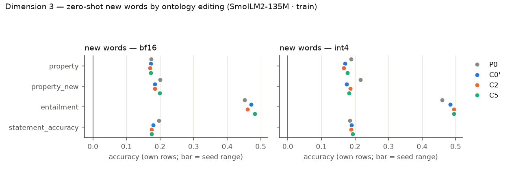
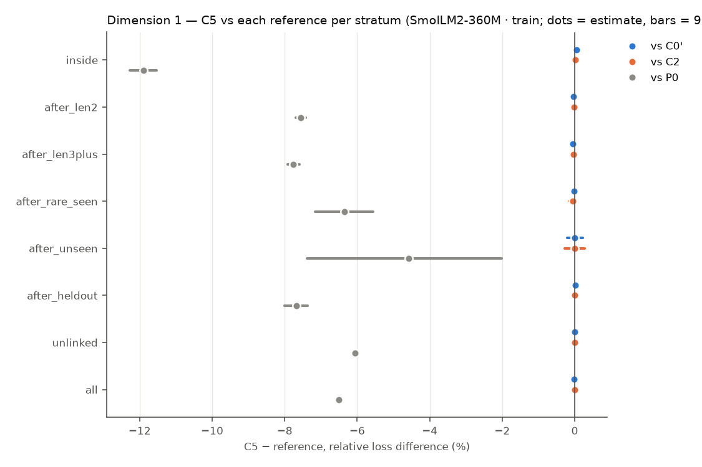
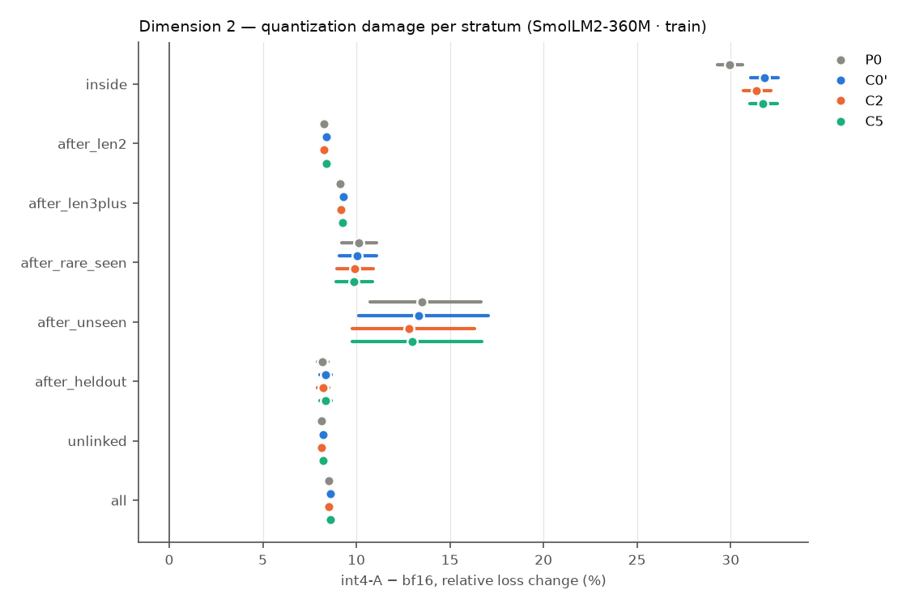
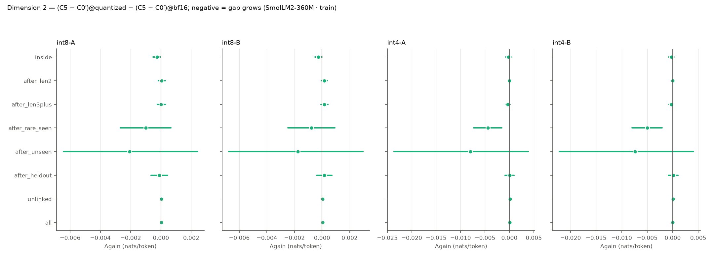
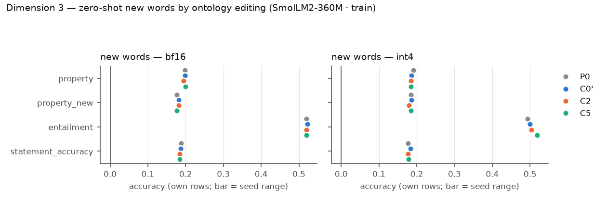

# R9 — retrofit × quantization (E9)

E9 asks three questions on pretrained hosts, all on one fixed test set: (1) does a VSA ontology channel trained jointly with the host improve it on long-token, rare and out-of-distribution words; (2) is the gap larger under weight quantization; (3) after training, can the model learn new or changed words zero-shot by editing the ontology alone? Models: **P0** the original host (evaluation only), **C0′** continued training without the channel, **C2** the same with a capacity-matched free per-concept table, **C5** the same with the attentive VSA channel. Loss differences are condition − reference (negative = lower loss), token-weighted and pooled over common seeds, with 95% cluster bootstraps over evaluation windows (10000 resamples); `*` = Holm-adjusted p < 0.05 within the family named in each table. P0 has no training randomness and pairs with every seed.

## SmolLM2-135M · train

Seeds: P0 [1]; C0' [1]; C2 [1]; C5 [1].

### Dimension 1 — C5 vs C0′, C2 and P0 (bf16)

> single seed: CIs cover evaluation windows or items only, not seed variance.

Relative loss difference [95% CI] (Holm over the three references within each stratum):

| Stratum | Targets | C5 − C0′ | C5 − C2 | C5 − P0 | C2 − C0′ | C0′ − P0 |
|---|---:|---|---|---|---|---|
| inside (long-token words) | 122901 | -0.02% [-0.08, +0.04] | +0.01% [-0.05, +0.06] | -10.85% [-11.16, -10.54]* | -0.03% [-0.06, +0.01] | -10.83% [-11.13, -10.53] |
| after_len2 (long-token words) | 317433 | -0.09% [-0.11, -0.08]* | -0.07% [-0.08, -0.05]* | -7.71% [-7.85, -7.58]* | -0.02% [-0.03, -0.01] | -7.63% [-7.76, -7.49] |
| after_len3plus (long-token words) | 228560 | -0.13% [-0.15, -0.11]* | -0.10% [-0.12, -0.08]* | -8.10% [-8.26, -7.94]* | -0.04% [-0.05, -0.02] | -7.98% [-8.14, -7.82] |
| after_rare_seen (rare words) | 6341 | +0.02% [-0.08, +0.12] | -0.02% [-0.14, +0.09] | -6.31% [-7.08, -5.56]* | +0.04% [-0.03, +0.12] | -6.33% [-7.08, -5.59] |
| after_unseen (out of distribution) | 664 | -0.15% [-0.59, +0.19] | -0.05% [-0.39, +0.29] | -4.49% [-6.47, -2.61]* | -0.10% [-0.72, +0.33] | -4.34% [-6.39, -2.38] |
| after_heldout (out of distribution) | 50222 | +0.01% [-0.02, +0.04] | +0.02% [-0.01, +0.05] | -7.78% [-8.08, -7.48]* | -0.01% [-0.03, +0.01] | -7.78% [-8.09, -7.48] |
| unlinked (locality) | 1504189 | -0.01% [-0.02, -0.01]* | -0.01% [-0.01, -0.01]* | -6.21% [-6.30, -6.12]* | -0.00% [-0.01, +0.00] | -6.20% [-6.29, -6.11] |
| all (locality) | 2095104 | -0.03% [-0.04, -0.03]* | -0.03% [-0.03, -0.02]* | -6.67% [-6.76, -6.58]* | -0.01% [-0.01, -0.00] | -6.64% [-6.73, -6.55] |

Absolute differences (nats/token):

| Stratum | C5 − C0′ | C5 − C2 | C5 − P0 |
|---|---|---|---|
| inside | -0.0002 [-0.0006, +0.0003] | +0.0000 [-0.0004, +0.0005] | -0.1015 [-0.1048, -0.0983]* |
| after_len2 | -0.0023 [-0.0027, -0.0019]* | -0.0017 [-0.0020, -0.0013]* | -0.2093 [-0.2129, -0.2058]* |
| after_len3plus | -0.0032 [-0.0036, -0.0027]* | -0.0023 [-0.0028, -0.0019]* | -0.2105 [-0.2146, -0.2064]* |
| after_rare_seen | +0.0005 [-0.0020, +0.0030] | -0.0005 [-0.0035, +0.0024] | -0.1697 [-0.1902, -0.1496]* |
| after_unseen | -0.0041 [-0.0162, +0.0049] | -0.0013 [-0.0104, +0.0078] | -0.1259 [-0.1749, -0.0751]* |
| after_heldout | +0.0002 [-0.0006, +0.0010] | +0.0005 [-0.0002, +0.0013] | -0.2076 [-0.2157, -0.1994]* |
| unlinked | -0.0003 [-0.0004, -0.0002]* | -0.0002 [-0.0003, -0.0002]* | -0.1668 [-0.1691, -0.1644]* |
| all | -0.0008 [-0.0009, -0.0007]* | -0.0006 [-0.0007, -0.0005]* | -0.1742 [-0.1763, -0.1721]* |

Probe differences (bf16): C5 − reference per subset, per seed (paired bootstrap over items):

| Reference | Seed | Probe | all | heldout | seen | unlinked |
|---|---:|---|---|---|---|---|
| C0' | 1 | lambada/accuracy | +0.003 [-0.000, +0.006] (n 5153) | +0.000 [+0.000, +0.000] (n 7) | +0.026 [+0.000, +0.079] (n 38) | +0.003 [-0.000, +0.006] (n 5108) |
| C0' | 1 | wic/probe_accuracy | +0.006 [-0.005, +0.017] (n 638) | — | +0.083 [+0.000, +0.250] (n 12) | +0.005 [-0.006, +0.014] (n 626) |
| C0' | 1 | card660/spearman_tied | +0.001 [-0.003, +0.004] (n 660) | +0.000 [+0.000, +0.000] (n 4) | +0.003 [-0.027, +0.032] (n 68) | +0.001 [-0.002, +0.003] (n 588) |
| C0' | 1 | rare_words/spearman_tied | +0.002 [+0.000, +0.003] (n 2034) | +0.000 [+0.000, +0.000] (n 5) | +0.009 [-0.027, +0.048] (n 63) | +0.001 [+0.000, +0.002] (n 1966) |
| C0' | 1 | wsd/probe_f1 | -0.000 [-0.002, +0.002] (n 7253) | +0.000 [+0.000, +0.000] (n 25) | +0.000 [+0.000, +0.000] (n 167) | -0.000 [-0.002, +0.002] (n 7061) |
| C0' | 1 | bless/pair_probe_macro_f1 | +0.001 [-0.002, +0.003] (n 4310) | +0.000 [+0.000, +0.000] (n 82) | -0.007 [-0.020, +0.000] (n 361) | +0.001 [-0.002, +0.004] (n 3867) |
| C0' | 1 | bless/prompt_auc | -0.002 [-0.003, -0.002] (n 14547) | -0.004 [-0.014, +0.004] (n 111) | -0.003 [-0.004, -0.001] (n 855) | -0.002 [-0.002, -0.001] (n 13581) |
| C0' | 1 | hyperlex/cosine_spearman | +0.000 [-0.001, +0.002] (n 2616) | -0.024 [-0.268, +0.252] (n 10) | +0.002 [-0.034, +0.038] (n 78) | +0.001 [-0.000, +0.002] (n 2528) |
| C2 | 1 | lambada/accuracy | +0.001 [-0.001, +0.004] (n 5153) | +0.000 [+0.000, +0.000] (n 7) | +0.000 [+0.000, +0.000] (n 38) | +0.001 [-0.001, +0.004] (n 5108) |
| C2 | 1 | wic/probe_accuracy | +0.006 [-0.005, +0.019] (n 638) | — | +0.000 [+0.000, +0.000] (n 12) | +0.006 [-0.006, +0.019] (n 626) |
| C2 | 1 | card660/spearman_tied | -0.000 [-0.003, +0.003] (n 660) | +0.000 [+0.000, +0.000] (n 4) | -0.010 [-0.042, +0.018] (n 68) | +0.001 [-0.002, +0.003] (n 588) |
| C2 | 1 | rare_words/spearman_tied | +0.001 [-0.000, +0.002] (n 2034) | +0.000 [+0.000, +0.000] (n 5) | +0.005 [-0.033, +0.041] (n 63) | +0.001 [-0.001, +0.002] (n 1966) |
| C2 | 1 | wsd/probe_f1 | -0.002 [-0.003, +0.000] (n 7253) | +0.000 [+0.000, +0.000] (n 25) | +0.000 [+0.000, +0.000] (n 167) | -0.002 [-0.003, -0.000] (n 7061) |
| C2 | 1 | bless/pair_probe_macro_f1 | +0.002 [-0.000, +0.005] (n 4310) | +0.000 [+0.000, +0.000] (n 82) | +0.002 [+0.000, +0.007] (n 361) | +0.002 [-0.000, +0.005] (n 3867) |
| C2 | 1 | bless/prompt_auc | -0.000 [-0.000, +0.000] (n 14547) | -0.005 [-0.016, +0.000] (n 111) | -0.001 [-0.002, +0.001] (n 855) | +0.000 [-0.000, +0.001] (n 13581) |
| C2 | 1 | hyperlex/cosine_spearman | -0.000 [-0.002, +0.001] (n 2616) | -0.024 [-0.268, +0.252] (n 10) | -0.004 [-0.059, +0.051] (n 78) | +0.000 [-0.001, +0.001] (n 2528) |
| P0 | 1 | lambada/accuracy | +0.007 [+0.001, +0.013] (n 5153) | +0.000 [+0.000, +0.000] (n 7) | +0.026 [+0.000, +0.079] (n 38) | +0.007 [+0.001, +0.013] (n 5108) |
| P0 | 1 | wic/probe_accuracy | +0.020 [-0.011, +0.052] (n 638) | — | +0.083 [+0.000, +0.250] (n 12) | +0.019 [-0.013, +0.053] (n 626) |
| P0 | 1 | card660/spearman_tied | -0.005 [-0.018, +0.008] (n 660) | +0.000 [+0.000, +0.000] (n 4) | +0.028 [-0.024, +0.083] (n 68) | -0.007 [-0.020, +0.006] (n 588) |
| P0 | 1 | rare_words/spearman_tied | -0.000 [-0.009, +0.008] (n 2034) | +0.000 [+0.000, +0.000] (n 5) | +0.018 [-0.058, +0.092] (n 63) | -0.001 [-0.010, +0.008] (n 1966) |
| P0 | 1 | wsd/probe_f1 | -0.001 [-0.004, +0.003] (n 7253) | +0.040 [+0.000, +0.120] (n 25) | +0.012 [+0.000, +0.030] (n 167) | -0.001 [-0.005, +0.003] (n 7061) |
| P0 | 1 | bless/pair_probe_macro_f1 | -0.002 [-0.008, +0.004] (n 4310) | +0.000 [+0.000, +0.000] (n 82) | +0.000 [-0.021, +0.021] (n 361) | -0.002 [-0.008, +0.005] (n 3867) |
| P0 | 1 | bless/prompt_auc | +0.026 [+0.024, +0.027] (n 14547) | +0.008 [-0.011, +0.034] (n 111) | +0.035 [+0.029, +0.042] (n 855) | +0.023 [+0.021, +0.025] (n 13581) |
| P0 | 1 | hyperlex/cosine_spearman | -0.000 [-0.006, +0.006] (n 2616) | +0.012 [+0.000, +0.132] (n 10) | +0.040 [-0.016, +0.101] (n 78) | -0.001 [-0.007, +0.005] (n 2528) |

### Dimension 2 — quantization damage and the gap under quantization

Quantization damage `variant − bf16`, relative [95% CI] (A = channel FP16, B = channel quantized; models without a channel have B = A):

| Stratum | Model | int8-A | int8-B | int4-A | int4-B |
|---|---|---|---|---|---|
| inside | P0 | +0.48% [+0.43, +0.54] | +0.48% [+0.43, +0.54] | +50.63% [+49.70, +51.59] | +50.63% [+49.70, +51.59] |
| inside | C0' | +0.56% [+0.50, +0.62] | +0.56% [+0.50, +0.62] | +48.12% [+47.18, +49.09] | +48.12% [+47.18, +49.09] |
| inside | C2 | +0.54% [+0.47, +0.60] | +0.53% [+0.46, +0.59] | +47.86% [+46.92, +48.81] | +47.86% [+46.92, +48.82] |
| inside | C5 | +0.54% [+0.48, +0.60] | +0.56% [+0.49, +0.62] | +48.13% [+47.18, +49.08] | +48.12% [+47.17, +49.07] |
| after_len2 | P0 | +0.11% [+0.10, +0.12] | +0.11% [+0.10, +0.12] | +12.74% [+12.60, +12.88] | +12.74% [+12.60, +12.88] |
| after_len2 | C0' | +0.11% [+0.10, +0.13] | +0.11% [+0.10, +0.13] | +11.68% [+11.53, +11.82] | +11.68% [+11.53, +11.82] |
| after_len2 | C2 | +0.11% [+0.10, +0.13] | +0.11% [+0.10, +0.12] | +11.71% [+11.56, +11.85] | +11.71% [+11.57, +11.86] |
| after_len2 | C5 | +0.11% [+0.10, +0.12] | +0.11% [+0.10, +0.12] | +11.63% [+11.48, +11.77] | +11.63% [+11.48, +11.77] |
| after_len3plus | P0 | +0.10% [+0.09, +0.12] | +0.10% [+0.09, +0.12] | +14.41% [+14.21, +14.60] | +14.41% [+14.21, +14.60] |
| after_len3plus | C0' | +0.11% [+0.10, +0.13] | +0.11% [+0.10, +0.13] | +12.96% [+12.77, +13.15] | +12.96% [+12.77, +13.15] |
| after_len3plus | C2 | +0.11% [+0.09, +0.12] | +0.10% [+0.09, +0.12] | +12.99% [+12.80, +13.18] | +12.99% [+12.80, +13.18] |
| after_len3plus | C5 | +0.12% [+0.10, +0.13] | +0.11% [+0.10, +0.13] | +12.93% [+12.75, +13.13] | +12.93% [+12.74, +13.12] |
| after_rare_seen | P0 | +0.16% [+0.07, +0.26] | +0.16% [+0.07, +0.26] | +13.84% [+12.77, +14.98] | +13.84% [+12.77, +14.98] |
| after_rare_seen | C0' | +0.17% [+0.07, +0.26] | +0.17% [+0.07, +0.26] | +12.04% [+10.96, +13.16] | +12.04% [+10.96, +13.16] |
| after_rare_seen | C2 | +0.14% [+0.04, +0.24] | +0.11% [+0.01, +0.20] | +12.15% [+11.08, +13.28] | +12.17% [+11.10, +13.29] |
| after_rare_seen | C5 | +0.13% [+0.04, +0.23] | +0.13% [+0.04, +0.23] | +12.12% [+11.04, +13.27] | +12.12% [+11.04, +13.27] |
| after_unseen | P0 | +0.13% [-0.25, +0.57] | +0.13% [-0.25, +0.57] | +14.00% [+10.56, +17.70] | +14.00% [+10.56, +17.70] |
| after_unseen | C0' | +0.21% [-0.10, +0.56] | +0.21% [-0.10, +0.56] | +11.58% [+8.04, +15.15] | +11.58% [+8.04, +15.15] |
| after_unseen | C2 | +0.20% [-0.24, +0.76] | +0.22% [-0.21, +0.76] | +11.83% [+8.65, +15.19] | +11.91% [+8.74, +15.25] |
| after_unseen | C5 | +0.12% [-0.21, +0.48] | +0.15% [-0.19, +0.52] | +11.64% [+8.32, +15.07] | +11.67% [+8.37, +15.08] |
| after_heldout | P0 | +0.09% [+0.06, +0.12] | +0.09% [+0.06, +0.12] | +12.94% [+12.59, +13.29] | +12.94% [+12.59, +13.29] |
| after_heldout | C0' | +0.09% [+0.06, +0.13] | +0.09% [+0.06, +0.13] | +11.85% [+11.50, +12.21] | +11.85% [+11.50, +12.21] |
| after_heldout | C2 | +0.10% [+0.06, +0.13] | +0.10% [+0.07, +0.13] | +11.87% [+11.52, +12.23] | +11.89% [+11.54, +12.25] |
| after_heldout | C5 | +0.11% [+0.08, +0.14] | +0.11% [+0.08, +0.14] | +11.85% [+11.50, +12.21] | +11.85% [+11.50, +12.21] |
| unlinked | P0 | +0.14% [+0.13, +0.14] | +0.14% [+0.13, +0.14] | +11.95% [+11.88, +12.02] | +11.95% [+11.88, +12.02] |
| unlinked | C0' | +0.11% [+0.11, +0.12] | +0.11% [+0.11, +0.12] | +11.25% [+11.18, +11.33] | +11.25% [+11.18, +11.33] |
| unlinked | C2 | +0.12% [+0.11, +0.12] | +0.11% [+0.11, +0.12] | +11.31% [+11.24, +11.38] | +11.31% [+11.24, +11.38] |
| unlinked | C5 | +0.12% [+0.11, +0.13] | +0.12% [+0.11, +0.12] | +11.20% [+11.12, +11.27] | +11.20% [+11.13, +11.27] |
| all | P0 | +0.14% [+0.13, +0.14] | +0.14% [+0.13, +0.14] | +12.82% [+12.75, +12.90] | +12.82% [+12.75, +12.90] |
| all | C0' | +0.12% [+0.11, +0.12] | +0.12% [+0.11, +0.12] | +11.95% [+11.88, +12.03] | +11.95% [+11.88, +12.03] |
| all | C2 | +0.12% [+0.12, +0.13] | +0.12% [+0.11, +0.12] | +12.00% [+11.93, +12.07] | +12.00% [+11.93, +12.07] |
| all | C5 | +0.12% [+0.12, +0.13] | +0.12% [+0.11, +0.13] | +11.90% [+11.83, +11.98] | +11.90% [+11.83, +11.98] |

Gap under quantization vs C0': gain = C5 − C0' at bf16 and quantized, `Δgain` = difference in differences (negative = the channel's advantage grows under quantization; Holm over references × variants within each stratum), retained = gain_q / gain_bf16:

| Stratum | Variant | gain bf16 | gain quantized | Δgain [95% CI] | retained |
|---|---|---|---|---|---|
| inside | int8-A | -0.0002 [-0.0007, +0.0003] | -0.0004 [-0.0008, +0.0001] | -0.0002 [-0.0005, +0.0002] | 1.74 |
| inside | int8-B | -0.0002 [-0.0007, +0.0003] | -0.0002 [-0.0007, +0.0003] | -0.0000 [-0.0004, +0.0003] | 1.12 |
| inside | int4-A | -0.0002 [-0.0007, +0.0003] | -0.0003 [-0.0012, +0.0007] | -0.0001 [-0.0010, +0.0009] | 1.25 |
| inside | int4-B | -0.0002 [-0.0007, +0.0003] | -0.0003 [-0.0013, +0.0006] | -0.0001 [-0.0011, +0.0008] | 1.67 |
| after_len2 | int8-A | -0.0023 [-0.0027, -0.0019] | -0.0024 [-0.0028, -0.0020] | -0.0001 [-0.0004, +0.0001] | 1.05 |
| after_len2 | int8-B | -0.0023 [-0.0027, -0.0019] | -0.0024 [-0.0028, -0.0020] | -0.0001 [-0.0004, +0.0001] | 1.05 |
| after_len2 | int4-A | -0.0023 [-0.0027, -0.0019] | -0.0039 [-0.0045, -0.0033] | -0.0016 [-0.0022, -0.0011]* | 1.71 |
| after_len2 | int4-B | -0.0023 [-0.0027, -0.0019] | -0.0039 [-0.0044, -0.0033] | -0.0016 [-0.0022, -0.0011]* | 1.70 |
| after_len3plus | int8-A | -0.0032 [-0.0037, -0.0027] | -0.0031 [-0.0036, -0.0027] | +0.0001 [-0.0002, +0.0004] | 0.98 |
| after_len3plus | int8-B | -0.0032 [-0.0037, -0.0027] | -0.0032 [-0.0036, -0.0027] | +0.0000 [-0.0003, +0.0003] | 0.99 |
| after_len3plus | int4-A | -0.0032 [-0.0037, -0.0027] | -0.0042 [-0.0050, -0.0035] | -0.0011 [-0.0017, -0.0004]* | 1.33 |
| after_len3plus | int4-B | -0.0032 [-0.0037, -0.0027] | -0.0043 [-0.0051, -0.0036] | -0.0011 [-0.0018, -0.0005]* | 1.36 |
| after_rare_seen | int8-A | +0.0006 [-0.0019, +0.0031] | -0.0002 [-0.0028, +0.0025] | -0.0008 [-0.0027, +0.0011] | -0.34 |
| after_rare_seen | int8-B | +0.0006 [-0.0019, +0.0031] | -0.0002 [-0.0028, +0.0025] | -0.0008 [-0.0026, +0.0011] | -0.32 |
| after_rare_seen | int4-A | +0.0006 [-0.0019, +0.0031] | +0.0028 [-0.0021, +0.0078] | +0.0022 [-0.0028, +0.0071] | 4.72 |
| after_rare_seen | int4-B | +0.0006 [-0.0019, +0.0031] | +0.0028 [-0.0020, +0.0078] | +0.0023 [-0.0026, +0.0071] | 4.79 |
| after_unseen | int8-A | -0.0043 [-0.0165, +0.0047] | -0.0068 [-0.0174, +0.0015] | -0.0025 [-0.0083, +0.0031] | 1.59 |
| after_unseen | int8-B | -0.0043 [-0.0165, +0.0047] | -0.0059 [-0.0159, +0.0018] | -0.0016 [-0.0075, +0.0042] | 1.37 |
| after_unseen | int4-A | -0.0043 [-0.0165, +0.0047] | -0.0032 [-0.0153, +0.0089] | +0.0011 [-0.0132, +0.0163] | 0.74 |
| after_unseen | int4-B | -0.0043 [-0.0165, +0.0047] | -0.0023 [-0.0140, +0.0093] | +0.0020 [-0.0120, +0.0165] | 0.54 |
| after_heldout | int8-A | +0.0003 [-0.0006, +0.0011] | +0.0007 [-0.0001, +0.0016] | +0.0004 [-0.0002, +0.0011] | 2.70 |
| after_heldout | int8-B | +0.0003 [-0.0006, +0.0011] | +0.0006 [-0.0002, +0.0015] | +0.0004 [-0.0003, +0.0010] | 2.35 |
| after_heldout | int4-A | +0.0003 [-0.0006, +0.0011] | +0.0003 [-0.0011, +0.0017] | +0.0000 [-0.0013, +0.0014] | 1.10 |
| after_heldout | int4-B | +0.0003 [-0.0006, +0.0011] | +0.0003 [-0.0011, +0.0017] | +0.0000 [-0.0013, +0.0013] | 1.08 |
| unlinked | int8-A | -0.0003 [-0.0004, -0.0002] | -0.0002 [-0.0002, -0.0000] | +0.0001 [+0.0000, +0.0003] | 0.52 |
| unlinked | int8-B | -0.0003 [-0.0004, -0.0002] | -0.0002 [-0.0003, -0.0001] | +0.0000 [-0.0001, +0.0002] | 0.84 |
| unlinked | int4-A | -0.0003 [-0.0004, -0.0002] | -0.0017 [-0.0019, -0.0015] | -0.0014 [-0.0016, -0.0012]* | 5.90 |
| unlinked | int4-B | -0.0003 [-0.0004, -0.0002] | -0.0016 [-0.0018, -0.0014] | -0.0014 [-0.0016, -0.0011]* | 5.63 |
| all | int8-A | -0.0008 [-0.0009, -0.0007] | -0.0007 [-0.0008, -0.0006] | +0.0001 [-0.0000, +0.0002] | 0.90 |
| all | int8-B | -0.0008 [-0.0009, -0.0007] | -0.0008 [-0.0009, -0.0007] | +0.0000 [-0.0001, +0.0001] | 0.98 |
| all | int4-A | -0.0008 [-0.0009, -0.0007] | -0.0021 [-0.0023, -0.0019] | -0.0013 [-0.0015, -0.0011]* | 2.71 |
| all | int4-B | -0.0008 [-0.0009, -0.0007] | -0.0021 [-0.0023, -0.0019] | -0.0013 [-0.0015, -0.0011]* | 2.65 |

Gap under quantization vs C2: gain = C5 − C2 at bf16 and quantized, `Δgain` = difference in differences (negative = the channel's advantage grows under quantization; Holm over references × variants within each stratum), retained = gain_q / gain_bf16:

| Stratum | Variant | gain bf16 | gain quantized | Δgain [95% CI] | retained |
|---|---|---|---|---|---|
| inside | int8-A | +0.0000 [-0.0004, +0.0004] | +0.0001 [-0.0004, +0.0005] | +0.0000 [-0.0003, +0.0004] | 4.19 |
| inside | int8-B | +0.0000 [-0.0004, +0.0004] | +0.0003 [-0.0002, +0.0007] | +0.0003 [-0.0001, +0.0006] | 19.08 |
| inside | int4-A | +0.0000 [-0.0004, +0.0004] | +0.0023 [+0.0013, +0.0032] | +0.0022 [+0.0013, +0.0032]* | 155.80 |
| inside | int4-B | +0.0000 [-0.0004, +0.0004] | +0.0022 [+0.0012, +0.0032] | +0.0022 [+0.0012, +0.0031]* | 150.91 |
| after_len2 | int8-A | -0.0017 [-0.0020, -0.0013] | -0.0018 [-0.0022, -0.0014] | -0.0001 [-0.0004, +0.0001] | 1.08 |
| after_len2 | int8-B | -0.0017 [-0.0020, -0.0013] | -0.0017 [-0.0021, -0.0013] | -0.0001 [-0.0003, +0.0002] | 1.03 |
| after_len2 | int4-A | -0.0017 [-0.0020, -0.0013] | -0.0039 [-0.0045, -0.0033] | -0.0022 [-0.0028, -0.0017]* | 2.35 |
| after_len2 | int4-B | -0.0017 [-0.0020, -0.0013] | -0.0040 [-0.0046, -0.0034] | -0.0023 [-0.0029, -0.0018]* | 2.41 |
| after_len3plus | int8-A | -0.0023 [-0.0028, -0.0019] | -0.0022 [-0.0026, -0.0017] | +0.0002 [-0.0001, +0.0004] | 0.93 |
| after_len3plus | int8-B | -0.0023 [-0.0028, -0.0019] | -0.0021 [-0.0026, -0.0017] | +0.0002 [-0.0001, +0.0005] | 0.90 |
| after_len3plus | int4-A | -0.0023 [-0.0028, -0.0019] | -0.0039 [-0.0046, -0.0031] | -0.0015 [-0.0023, -0.0008]* | 1.66 |
| after_len3plus | int4-B | -0.0023 [-0.0028, -0.0019] | -0.0040 [-0.0048, -0.0033] | -0.0017 [-0.0024, -0.0009]* | 1.72 |
| after_rare_seen | int8-A | -0.0004 [-0.0034, +0.0025] | -0.0006 [-0.0035, +0.0023] | -0.0001 [-0.0021, +0.0017] | 1.35 |
| after_rare_seen | int8-B | -0.0004 [-0.0034, +0.0025] | +0.0003 [-0.0027, +0.0032] | +0.0007 [-0.0013, +0.0026] | -0.65 |
| after_rare_seen | int4-A | -0.0004 [-0.0034, +0.0025] | -0.0012 [-0.0066, +0.0046] | -0.0008 [-0.0059, +0.0047] | 2.92 |
| after_rare_seen | int4-B | -0.0004 [-0.0034, +0.0025] | -0.0015 [-0.0066, +0.0040] | -0.0011 [-0.0060, +0.0043] | 3.61 |
| after_unseen | int8-A | -0.0015 [-0.0109, +0.0078] | -0.0036 [-0.0133, +0.0056] | -0.0021 [-0.0107, +0.0049] | 2.36 |
| after_unseen | int8-B | -0.0015 [-0.0109, +0.0078] | -0.0032 [-0.0131, +0.0059] | -0.0017 [-0.0094, +0.0046] | 2.11 |
| after_unseen | int4-A | -0.0015 [-0.0109, +0.0078] | -0.0070 [-0.0201, +0.0075] | -0.0055 [-0.0201, +0.0092] | 4.64 |
| after_unseen | int4-B | -0.0015 [-0.0109, +0.0078] | -0.0081 [-0.0232, +0.0077] | -0.0066 [-0.0217, +0.0086] | 5.39 |
| after_heldout | int8-A | +0.0006 [-0.0002, +0.0014] | +0.0010 [+0.0002, +0.0018] | +0.0004 [-0.0002, +0.0010] | 1.67 |
| after_heldout | int8-B | +0.0006 [-0.0002, +0.0014] | +0.0008 [-0.0000, +0.0016] | +0.0002 [-0.0004, +0.0008] | 1.31 |
| after_heldout | int4-A | +0.0006 [-0.0002, +0.0014] | +0.0002 [-0.0012, +0.0016] | -0.0004 [-0.0018, +0.0010] | 0.31 |
| after_heldout | int4-B | +0.0006 [-0.0002, +0.0014] | -0.0003 [-0.0016, +0.0011] | -0.0009 [-0.0022, +0.0005] | -0.49 |
| unlinked | int8-A | -0.0002 [-0.0003, -0.0002] | -0.0002 [-0.0003, -0.0001] | +0.0000 [-0.0001, +0.0001] | 0.93 |
| unlinked | int8-B | -0.0002 [-0.0003, -0.0002] | -0.0002 [-0.0003, -0.0001] | +0.0000 [-0.0001, +0.0001] | 0.92 |
| unlinked | int4-A | -0.0002 [-0.0003, -0.0002] | -0.0031 [-0.0033, -0.0029] | -0.0028 [-0.0031, -0.0026]* | 12.37 |
| unlinked | int4-B | -0.0002 [-0.0003, -0.0002] | -0.0030 [-0.0032, -0.0028] | -0.0027 [-0.0030, -0.0025]* | 12.00 |
| all | int8-A | -0.0006 [-0.0007, -0.0005] | -0.0006 [-0.0007, -0.0005] | +0.0000 [-0.0001, +0.0001] | 0.98 |
| all | int8-B | -0.0006 [-0.0007, -0.0005] | -0.0006 [-0.0007, -0.0005] | +0.0000 [-0.0001, +0.0001] | 0.95 |
| all | int4-A | -0.0006 [-0.0007, -0.0005] | -0.0030 [-0.0032, -0.0028] | -0.0024 [-0.0026, -0.0022]* | 4.97 |
| all | int4-B | -0.0006 [-0.0007, -0.0005] | -0.0030 [-0.0032, -0.0028] | -0.0024 [-0.0026, -0.0022]* | 4.91 |

Gap under quantization vs P0: gain = C5 − P0 at bf16 and quantized, `Δgain` = difference in differences (negative = the channel's advantage grows under quantization; Holm over references × variants within each stratum), retained = gain_q / gain_bf16:

| Stratum | Variant | gain bf16 | gain quantized | Δgain [95% CI] | retained |
|---|---|---|---|---|---|
| inside | int8-A | -0.1015 [-0.1048, -0.0984] | -0.1015 [-0.1049, -0.0983] | +0.0000 [-0.0006, +0.0006] | 1.00 |
| inside | int8-B | -0.1015 [-0.1048, -0.0984] | -0.1014 [-0.1047, -0.0982] | +0.0001 [-0.0004, +0.0007] | 1.00 |
| inside | int4-A | -0.1015 [-0.1048, -0.0984] | -0.1738 [-0.1786, -0.1692] | -0.0723 [-0.0759, -0.0688]* | 1.71 |
| inside | int4-B | -0.1015 [-0.1048, -0.0984] | -0.1739 [-0.1787, -0.1693] | -0.0724 [-0.0759, -0.0689]* | 1.71 |
| after_len2 | int8-A | -0.2093 [-0.2129, -0.2057] | -0.2096 [-0.2132, -0.2060] | -0.0003 [-0.0007, +0.0001] | 1.00 |
| after_len2 | int8-B | -0.2093 [-0.2129, -0.2057] | -0.2096 [-0.2132, -0.2060] | -0.0003 [-0.0007, +0.0001] | 1.00 |
| after_len2 | int4-A | -0.2093 [-0.2129, -0.2057] | -0.2640 [-0.2682, -0.2598] | -0.0547 [-0.0567, -0.0527]* | 1.26 |
| after_len2 | int4-B | -0.2093 [-0.2129, -0.2057] | -0.2640 [-0.2682, -0.2598] | -0.0547 [-0.0567, -0.0526]* | 1.26 |
| after_len3plus | int8-A | -0.2105 [-0.2146, -0.2064] | -0.2104 [-0.2145, -0.2063] | +0.0001 [-0.0004, +0.0005] | 1.00 |
| after_len3plus | int8-B | -0.2105 [-0.2146, -0.2064] | -0.2104 [-0.2145, -0.2063] | +0.0000 [-0.0004, +0.0005] | 1.00 |
| after_len3plus | int4-A | -0.2105 [-0.2146, -0.2064] | -0.2760 [-0.2809, -0.2711] | -0.0655 [-0.0680, -0.0628]* | 1.31 |
| after_len3plus | int4-B | -0.2105 [-0.2146, -0.2064] | -0.2760 [-0.2811, -0.2712] | -0.0656 [-0.0681, -0.0629]* | 1.31 |
| after_rare_seen | int8-A | -0.1696 [-0.1901, -0.1495] | -0.1706 [-0.1911, -0.1507] | -0.0010 [-0.0039, +0.0018] | 1.01 |
| after_rare_seen | int8-B | -0.1696 [-0.1901, -0.1495] | -0.1706 [-0.1913, -0.1505] | -0.0010 [-0.0039, +0.0019] | 1.01 |
| after_rare_seen | int4-A | -0.1696 [-0.1901, -0.1495] | -0.2364 [-0.2637, -0.2102] | -0.0668 [-0.0823, -0.0512]* | 1.39 |
| after_rare_seen | int4-B | -0.1696 [-0.1901, -0.1495] | -0.2363 [-0.2636, -0.2102] | -0.0667 [-0.0823, -0.0512]* | 1.39 |
| after_unseen | int8-A | -0.1261 [-0.1747, -0.0755] | -0.1266 [-0.1780, -0.0749] | -0.0005 [-0.0111, +0.0099] | 1.00 |
| after_unseen | int8-B | -0.1261 [-0.1747, -0.0755] | -0.1257 [-0.1776, -0.0737] | +0.0004 [-0.0104, +0.0114] | 1.00 |
| after_unseen | int4-A | -0.1261 [-0.1747, -0.0755] | -0.2071 [-0.2768, -0.1388] | -0.0810 [-0.1334, -0.0293]* | 1.64 |
| after_unseen | int4-B | -0.1261 [-0.1747, -0.0755] | -0.2063 [-0.2762, -0.1377] | -0.0802 [-0.1318, -0.0297]* | 1.64 |
| after_heldout | int8-A | -0.2075 [-0.2157, -0.1993] | -0.2071 [-0.2153, -0.1989] | +0.0004 [-0.0006, +0.0014] | 1.00 |
| after_heldout | int8-B | -0.2075 [-0.2157, -0.1993] | -0.2072 [-0.2154, -0.1990] | +0.0003 [-0.0006, +0.0013] | 1.00 |
| after_heldout | int4-A | -0.2075 [-0.2157, -0.1993] | -0.2611 [-0.2705, -0.2518] | -0.0536 [-0.0587, -0.0483]* | 1.26 |
| after_heldout | int4-B | -0.2075 [-0.2157, -0.1993] | -0.2611 [-0.2705, -0.2518] | -0.0536 [-0.0587, -0.0484]* | 1.26 |
| unlinked | int8-A | -0.1668 [-0.1692, -0.1644] | -0.1675 [-0.1699, -0.1651] | -0.0007 [-0.0009, -0.0005]* | 1.00 |
| unlinked | int8-B | -0.1668 [-0.1692, -0.1644] | -0.1676 [-0.1700, -0.1652] | -0.0008 [-0.0010, -0.0006]* | 1.00 |
| unlinked | int4-A | -0.1668 [-0.1692, -0.1644] | -0.2057 [-0.2083, -0.2031] | -0.0389 [-0.0399, -0.0379]* | 1.23 |
| unlinked | int4-B | -0.1668 [-0.1692, -0.1644] | -0.2056 [-0.2082, -0.2031] | -0.0388 [-0.0398, -0.0378]* | 1.23 |
| all | int8-A | -0.1742 [-0.1763, -0.1721] | -0.1748 [-0.1769, -0.1726] | -0.0006 [-0.0007, -0.0004]* | 1.00 |
| all | int8-B | -0.1742 [-0.1763, -0.1721] | -0.1748 [-0.1770, -0.1727] | -0.0006 [-0.0008, -0.0005]* | 1.00 |
| all | int4-A | -0.1742 [-0.1763, -0.1721] | -0.2190 [-0.2214, -0.2167] | -0.0448 [-0.0457, -0.0439]* | 1.26 |
| all | int4-B | -0.1742 [-0.1763, -0.1721] | -0.2190 [-0.2214, -0.2166] | -0.0448 [-0.0457, -0.0439]* | 1.26 |

> Single seed in at least one model: CIs cover evaluation windows only.

Probe damage int4 − bf16 per model (paired over items; all items / held-out / seen):

| Model | Seed | Probe | all | heldout | seen |
|---|---:|---|---|---|---|
| P0 | 1 | lambada/accuracy | -0.038 [-0.049, -0.027] | -0.143 [-0.429, +0.000] | -0.079 [-0.211, +0.053] |
| P0 | 1 | wic/probe_accuracy | +0.039 [-0.002, +0.080] | — | -0.083 [-0.333, +0.167] |
| P0 | 1 | card660/spearman_tied | +0.018 [-0.022, +0.056] | +0.000 [+0.000, +0.000] | +0.075 [-0.034, +0.190] |
| P0 | 1 | rare_words/spearman_tied | -0.051 [-0.076, -0.029] | +0.000 [-1.333, +1.750] | -0.027 [-0.150, +0.093] |
| P0 | 1 | wsd/probe_f1 | -0.005 [-0.010, +0.001] | +0.040 [+0.000, +0.120] | +0.012 [-0.012, +0.036] |
| P0 | 1 | bless/pair_probe_macro_f1 | -0.020 [-0.030, -0.010] | -0.086 [-0.178, -0.023] | -0.029 [-0.064, +0.004] |
| P0 | 1 | bless/prompt_auc | -0.034 [-0.038, -0.029] | -0.003 [-0.045, +0.040] | -0.085 [-0.100, -0.070] |
| P0 | 1 | hyperlex/cosine_spearman | -0.019 [-0.038, -0.001] | -0.018 [-0.377, +0.341] | -0.112 [-0.268, +0.039] |
| C0' | 1 | lambada/accuracy | -0.026 [-0.037, -0.015] | -0.429 [-0.714, -0.143] | -0.079 [-0.211, +0.026] |
| C0' | 1 | wic/probe_accuracy | -0.003 [-0.045, +0.038] | — | -0.167 [-0.417, +0.000] |
| C0' | 1 | card660/spearman_tied | -0.001 [-0.040, +0.035] | +0.000 [+0.000, +0.000] | +0.030 [-0.082, +0.137] |
| C0' | 1 | rare_words/spearman_tied | -0.027 [-0.047, -0.007] | +0.200 [-1.333, +1.750] | -0.012 [-0.122, +0.101] |
| C0' | 1 | wsd/probe_f1 | -0.002 [-0.008, +0.004] | +0.000 [+0.000, +0.000] | -0.006 [-0.018, +0.000] |
| C0' | 1 | bless/pair_probe_macro_f1 | -0.021 [-0.032, -0.010] | -0.054 [-0.110, -0.012] | -0.034 [-0.069, -0.003] |
| C0' | 1 | bless/prompt_auc | -0.006 [-0.011, -0.001] | -0.006 [-0.082, +0.063] | -0.109 [-0.126, -0.093] |
| C0' | 1 | hyperlex/cosine_spearman | -0.017 [-0.034, -0.001] | -0.159 [-0.785, +0.489] | -0.100 [-0.237, +0.032] |
| C2 | 1 | lambada/accuracy | -0.024 [-0.034, -0.012] | -0.429 [-0.714, -0.143] | -0.079 [-0.211, +0.053] |
| C2 | 1 | wic/probe_accuracy | +0.000 [-0.041, +0.041] | — | -0.250 [-0.500, +0.000] |
| C2 | 1 | card660/spearman_tied | +0.001 [-0.036, +0.037] | +0.000 [+0.000, +0.000] | +0.011 [-0.107, +0.120] |
| C2 | 1 | rare_words/spearman_tied | -0.030 [-0.050, -0.010] | +0.200 [-1.333, +1.750] | -0.045 [-0.156, +0.075] |
| C2 | 1 | wsd/probe_f1 | -0.005 [-0.010, +0.001] | +0.000 [+0.000, +0.000] | +0.000 [-0.018, +0.018] |
| C2 | 1 | bless/pair_probe_macro_f1 | -0.017 [-0.027, -0.006] | -0.054 [-0.110, -0.012] | -0.026 [-0.060, +0.008] |
| C2 | 1 | bless/prompt_auc | -0.008 [-0.012, -0.003] | -0.011 [-0.081, +0.048] | -0.106 [-0.123, -0.090] |
| C2 | 1 | hyperlex/cosine_spearman | -0.018 [-0.036, -0.002] | -0.213 [-0.742, +0.150] | -0.088 [-0.236, +0.061] |
| C5 | 1 | lambada/accuracy | -0.027 [-0.037, -0.016] | -0.429 [-0.714, -0.143] | -0.079 [-0.211, +0.053] |
| C5 | 1 | wic/probe_accuracy | -0.013 [-0.053, +0.028] | — | -0.250 [-0.500, +0.000] |
| C5 | 1 | card660/spearman_tied | +0.000 [-0.037, +0.035] | +0.200 [+0.000, +2.000] | +0.001 [-0.110, +0.107] |
| C5 | 1 | rare_words/spearman_tied | -0.024 [-0.044, -0.005] | +0.200 [-1.333, +1.750] | -0.029 [-0.163, +0.099] |
| C5 | 1 | wsd/probe_f1 | -0.003 [-0.008, +0.003] | +0.000 [+0.000, +0.000] | -0.006 [-0.018, +0.000] |
| C5 | 1 | bless/pair_probe_macro_f1 | -0.019 [-0.030, -0.008] | -0.070 [-0.150, -0.013] | -0.031 [-0.066, +0.000] |
| C5 | 1 | bless/prompt_auc | -0.004 [-0.009, +0.001] | -0.026 [-0.088, +0.022] | -0.112 [-0.129, -0.096] |
| C5 | 1 | hyperlex/cosine_spearman | -0.012 [-0.029, +0.004] | -0.244 [-0.684, +0.000] | -0.063 [-0.188, +0.066] |

Probe differences at int4 (variant A): C5 − reference per subset, per seed (paired bootstrap over items):

| Reference | Seed | Probe | all | heldout | seen | unlinked |
|---|---:|---|---|---|---|---|
| C0' | 1 | lambada/accuracy | +0.002 [-0.002, +0.005] (n 5153) | +0.000 [+0.000, +0.000] (n 7) | +0.026 [+0.000, +0.079] (n 38) | +0.001 [-0.002, +0.005] (n 5108) |
| C0' | 1 | wic/probe_accuracy | -0.003 [-0.019, +0.013] (n 638) | — | +0.000 [+0.000, +0.000] (n 12) | -0.003 [-0.019, +0.014] (n 626) |
| C0' | 1 | card660/spearman_tied | +0.002 [-0.006, +0.010] (n 660) | +0.200 [+0.000, +2.000] (n 4) | -0.026 [-0.088, +0.024] (n 68) | +0.004 [-0.003, +0.013] (n 588) |
| C0' | 1 | rare_words/spearman_tied | +0.004 [-0.001, +0.009] (n 2034) | +0.000 [+0.000, +0.000] (n 5) | -0.008 [-0.059, +0.036] (n 63) | +0.004 [-0.001, +0.009] (n 1966) |
| C0' | 1 | wsd/probe_f1 | -0.001 [-0.003, +0.002] (n 7253) | +0.000 [+0.000, +0.000] (n 25) | +0.000 [+0.000, +0.000] (n 167) | -0.001 [-0.004, +0.002] (n 7061) |
| C0' | 1 | bless/pair_probe_macro_f1 | +0.003 [-0.003, +0.009] (n 4310) | -0.017 [-0.086, +0.024] (n 82) | -0.004 [-0.024, +0.015] (n 361) | +0.004 [-0.002, +0.010] (n 3867) |
| C0' | 1 | bless/prompt_auc | -0.000 [-0.001, +0.001] (n 14547) | -0.024 [-0.059, +0.000] (n 111) | -0.005 [-0.008, -0.002] (n 855) | +0.001 [-0.000, +0.002] (n 13581) |
| C0' | 1 | hyperlex/cosine_spearman | +0.005 [+0.001, +0.009] (n 2616) | -0.110 [-0.462, +0.000] (n 10) | +0.039 [-0.024, +0.110] (n 78) | +0.005 [+0.001, +0.009] (n 2528) |
| C2 | 1 | lambada/accuracy | -0.002 [-0.006, +0.002] (n 5153) | +0.000 [+0.000, +0.000] (n 7) | +0.000 [+0.000, +0.000] (n 38) | -0.002 [-0.006, +0.002] (n 5108) |
| C2 | 1 | wic/probe_accuracy | -0.006 [-0.024, +0.011] (n 638) | — | +0.000 [+0.000, +0.000] (n 12) | -0.006 [-0.026, +0.013] (n 626) |
| C2 | 1 | card660/spearman_tied | -0.001 [-0.009, +0.007] (n 660) | +0.200 [+0.000, +2.000] (n 4) | -0.021 [-0.087, +0.034] (n 68) | +0.002 [-0.006, +0.010] (n 588) |
| C2 | 1 | rare_words/spearman_tied | +0.006 [+0.001, +0.011] (n 2034) | +0.000 [+0.000, +0.000] (n 5) | +0.020 [-0.031, +0.079] (n 63) | +0.006 [+0.000, +0.011] (n 1966) |
| C2 | 1 | wsd/probe_f1 | +0.000 [-0.002, +0.003] (n 7253) | +0.000 [+0.000, +0.000] (n 25) | -0.006 [-0.018, +0.000] (n 167) | +0.000 [-0.002, +0.003] (n 7061) |
| C2 | 1 | bless/pair_probe_macro_f1 | +0.000 [-0.006, +0.006] (n 4310) | -0.017 [-0.086, +0.024] (n 82) | -0.003 [-0.023, +0.016] (n 361) | +0.001 [-0.005, +0.008] (n 3867) |
| C2 | 1 | bless/prompt_auc | +0.003 [+0.002, +0.004] (n 14547) | -0.021 [-0.042, -0.006] (n 111) | -0.006 [-0.010, -0.002] (n 855) | +0.005 [+0.004, +0.006] (n 13581) |
| C2 | 1 | hyperlex/cosine_spearman | +0.006 [+0.002, +0.010] (n 2616) | -0.055 [-0.365, +0.194] (n 10) | +0.021 [-0.046, +0.092] (n 78) | +0.006 [+0.003, +0.010] (n 2528) |
| P0 | 1 | lambada/accuracy | +0.019 [+0.011, +0.027] (n 5153) | -0.286 [-0.571, +0.000] (n 7) | +0.026 [-0.053, +0.132] (n 38) | +0.019 [+0.011, +0.028] (n 5108) |
| P0 | 1 | wic/probe_accuracy | -0.031 [-0.066, +0.002] (n 638) | — | -0.083 [-0.250, +0.000] (n 12) | -0.030 [-0.067, +0.005] (n 626) |
| P0 | 1 | card660/spearman_tied | -0.023 [-0.049, +0.002] (n 660) | +0.200 [+0.000, +2.000] (n 4) | -0.046 [-0.131, +0.036] (n 68) | -0.021 [-0.047, +0.007] (n 588) |
| P0 | 1 | rare_words/spearman_tied | +0.027 [+0.010, +0.044] (n 2034) | +0.200 [+0.000, +1.125] (n 5) | +0.016 [-0.087, +0.127] (n 63) | +0.025 [+0.007, +0.042] (n 1966) |
| P0 | 1 | wsd/probe_f1 | +0.001 [-0.003, +0.006] (n 7253) | +0.000 [+0.000, +0.000] (n 25) | -0.006 [-0.030, +0.012] (n 167) | +0.002 [-0.003, +0.006] (n 7061) |
| P0 | 1 | bless/pair_probe_macro_f1 | -0.001 [-0.010, +0.009] (n 4310) | +0.016 [-0.016, +0.059] (n 82) | -0.003 [-0.037, +0.032] (n 361) | +0.000 [-0.010, +0.012] (n 3867) |
| P0 | 1 | bless/prompt_auc | +0.055 [+0.051, +0.059] (n 14547) | -0.015 [-0.043, +0.010] (n 111) | +0.009 [+0.001, +0.017] (n 855) | +0.063 [+0.058, +0.067] (n 13581) |
| P0 | 1 | hyperlex/cosine_spearman | +0.007 [-0.007, +0.020] (n 2616) | -0.213 [-0.586, +0.000] (n 10) | +0.089 [-0.009, +0.208] (n 78) | +0.005 [-0.008, +0.018] (n 2528) |

### General text (the track's `eval-general`: locality and general-text quantization damage)

C5 − reference at bf16 (locality, nats/token; positive = worse on general text) and its change under quantization (Δgain; negative = the gap grows; Holm over references × variants):

| Stratum | Reference | Variant | gain bf16 [95% CI] | Δgain [95% CI] |
|---|---|---|---|---|
| all | C0' | int8-A | +0.0001 [+0.0001, +0.0002] | -0.0000 [-0.0001, +0.0001] |
| unlinked | C0' | int8-A | +0.0000 [-0.0001, +0.0001] | -0.0000 [-0.0001, +0.0001] |
| all | C0' | int8-B | +0.0001 [+0.0001, +0.0002] | -0.0001 [-0.0002, +0.0000] |
| unlinked | C0' | int8-B | +0.0000 [-0.0001, +0.0001] | -0.0001 [-0.0002, +0.0000] |
| all | C0' | int4-A | +0.0001 [+0.0001, +0.0002] | -0.0011 [-0.0013, -0.0009]* |
| unlinked | C0' | int4-A | +0.0000 [-0.0001, +0.0001] | -0.0011 [-0.0013, -0.0009]* |
| all | C0' | int4-B | +0.0001 [+0.0001, +0.0002] | -0.0011 [-0.0013, -0.0009]* |
| unlinked | C0' | int4-B | +0.0000 [-0.0001, +0.0001] | -0.0011 [-0.0013, -0.0009]* |
| all | C2 | int8-A | +0.0001 [+0.0000, +0.0002] | +0.0000 [-0.0001, +0.0001] |
| unlinked | C2 | int8-A | +0.0000 [-0.0001, +0.0001] | +0.0000 [-0.0001, +0.0001] |
| all | C2 | int8-B | +0.0001 [+0.0000, +0.0002] | -0.0000 [-0.0001, +0.0001] |
| unlinked | C2 | int8-B | +0.0000 [-0.0001, +0.0001] | -0.0000 [-0.0001, +0.0001] |
| all | C2 | int4-A | +0.0001 [+0.0000, +0.0002] | -0.0035 [-0.0037, -0.0033]* |
| unlinked | C2 | int4-A | +0.0000 [-0.0001, +0.0001] | -0.0036 [-0.0038, -0.0034]* |
| all | C2 | int4-B | +0.0001 [+0.0000, +0.0002] | -0.0035 [-0.0037, -0.0033]* |
| unlinked | C2 | int4-B | +0.0000 [-0.0001, +0.0001] | -0.0036 [-0.0038, -0.0033]* |
| all | P0 | int8-A | -0.0006 [-0.0011, -0.0002] | +0.0001 [-0.0001, +0.0002] |
| unlinked | P0 | int8-A | -0.0009 [-0.0014, -0.0005] | +0.0000 [-0.0001, +0.0002] |
| all | P0 | int8-B | -0.0006 [-0.0011, -0.0002] | +0.0000 [-0.0001, +0.0002] |
| unlinked | P0 | int8-B | -0.0009 [-0.0014, -0.0005] | +0.0000 [-0.0001, +0.0002] |
| all | P0 | int4-A | -0.0006 [-0.0011, -0.0002] | -0.0106 [-0.0114, -0.0099]* |
| unlinked | P0 | int4-A | -0.0009 [-0.0014, -0.0005] | -0.0100 [-0.0108, -0.0093]* |
| all | P0 | int4-B | -0.0006 [-0.0011, -0.0002] | -0.0106 [-0.0113, -0.0099]* |
| unlinked | P0 | int4-B | -0.0009 [-0.0014, -0.0005] | -0.0100 [-0.0108, -0.0092]* |

Quantization damage on general text (relative):

| Model | int8-A | int8-B | int4-A | int4-B |
|---|---|---|---|---|
| P0 | +0.12% [+0.11, +0.12] | +0.12% [+0.11, +0.12] | +10.62% [+10.54, +10.70] | +10.62% [+10.54, +10.70] |
| C0' | +0.12% [+0.11, +0.12] | +0.12% [+0.11, +0.12] | +10.28% [+10.21, +10.36] | +10.28% [+10.21, +10.36] |
| C2 | +0.12% [+0.11, +0.12] | +0.12% [+0.11, +0.12] | +10.37% [+10.29, +10.45] | +10.37% [+10.29, +10.45] |
| C5 | +0.12% [+0.11, +0.12] | +0.12% [+0.11, +0.12] | +10.24% [+10.16, +10.32] | +10.24% [+10.17, +10.32] |

### Dimension 3 — zero-shot learning by ontology editing (no weight update)

> Single seed: intervals cover items only, not seed variance.

**bf16** — new words (mean over linked items; `own` = the model's own rows: frame composed for C5, fallback row for C2, nothing for C0′/P0):

| Model | Seed | Source | property | property_new | entailment | paraphrase | statement_accuracy | statement_loss |
|---|---:|---|---:|---:|---:|---:|---:|---:|
| P0 | 1 | own | 0.173 | 0.200 | 0.452 | 0.353 | 0.196 | 6.052 |
| C0' | 1 | own | 0.172 | 0.184 | 0.472 | 0.350 | 0.180 | 5.814 |
| C2 | 1 | own | 0.170 | 0.184 | 0.460 | 0.337 | 0.175 | 5.822 |
| C2 | 1 | none | 0.176 | 0.192 | 0.472 | 0.340 | 0.172 | 5.822 |
| C2 | 1 | mean_row | 0.171 | 0.186 | 0.470 | 0.332 | 0.172 | 5.824 |
| C5 | 1 | own | 0.172 | 0.199 | 0.482 | 0.333 | 0.175 | 5.808 |
| C5 | 1 | none | 0.174 | 0.194 | 0.470 | 0.343 | 0.178 | 5.811 |
| C5 | 1 | mean_row | 0.172 | 0.189 | 0.478 | 0.348 | 0.176 | 5.812 |
| C5 | 1 | random_frame | 0.172 | 0.186 | 0.473 | 0.340 | 0.172 | 5.812 |

C5 own − C0' own (new words; paired over items, seed-averaged; Holm over tests):

| Test | Difference [95% CI] | n | p (Holm) |
|---|---|---:|---:|
| property | +0.000 [-0.010, +0.010] | 612 | 1.0000 |
| property_new | +0.014 [+0.002, +0.029] | 312 | 0.2448 |
| property_category | -0.015 [-0.030, -0.002] | 300 | 0.2448 |
| entailment | +0.010 [-0.008, +0.028] | 600 | 0.7047 |
| paraphrase | -0.016 [-0.039, +0.007] | 612 | 0.7047 |
| statement_accuracy | -0.005 [-0.013, +0.002] | 612 | 0.7047 |
| statement_margin | +0.010 [+0.004, +0.016]* | 612 | 0.0128 |
| statement_loss | -0.006 [-0.011, -0.001] | 612 | 0.1022 |

C5 own − C2 own (new words; paired over items, seed-averaged; Holm over tests):

| Test | Difference [95% CI] | n | p (Holm) |
|---|---|---:|---:|
| property | +0.002 [-0.007, +0.011] | 612 | 1.0000 |
| property_new | +0.014 [+0.003, +0.027] | 312 | 0.1080 |
| property_category | -0.010 [-0.023, +0.002] | 300 | 0.6399 |
| entailment | +0.022 [+0.003, +0.040] | 600 | 0.1080 |
| paraphrase | -0.003 [-0.028, +0.020] | 612 | 1.0000 |
| statement_accuracy | +0.000 [-0.005, +0.005] | 612 | 1.0000 |
| statement_margin | +0.013 [+0.006, +0.019]* | 612 | 0.0016 |
| statement_loss | -0.014 [-0.019, -0.009]* | 612 | 0.0016 |

C5 own − P0 own (new words; paired over items, seed-averaged; Holm over tests):

| Test | Difference [95% CI] | n | p (Holm) |
|---|---|---:|---:|
| property | -0.001 [-0.020, +0.018] | 612 | 1.0000 |
| property_new | -0.002 [-0.030, +0.027] | 312 | 1.0000 |
| property_category | +0.000 [-0.023, +0.022] | 300 | 1.0000 |
| entailment | +0.030 [-0.002, +0.063] | 600 | 0.3800 |
| paraphrase | -0.020 [-0.060, +0.021] | 612 | 1.0000 |
| statement_accuracy | -0.021 [-0.039, -0.003] | 612 | 0.1526 |
| statement_margin | -0.036 [-0.073, +0.000] | 612 | 0.3132 |
| statement_loss | -0.243 [-0.273, -0.213]* | 612 | 0.0016 |

**bf16** — edits (ES/PS/NS after the edit; EM = change of log p(new) − log p(old)):

| Model | Seed | Subset | edits | ES before → after | EM [95% CI] | EM − control [95% CI] | PS | NS | score |
|---|---:|---|---:|---|---|---|---:|---:|---:|
| P0 (not editable) | 1 | all | 200 | 0.242 → 0.242 | +0.000 [+0.000, +0.000] | +0.000 [+0.000, +0.000] | 0.215 | 0.740 | 0.296 |
| P0 (not editable) | 1 | seen | 100 | 0.250 → 0.250 | +0.000 [+0.000, +0.000] | +0.000 [+0.000, +0.000] | 0.220 | 0.749 | 0.304 |
| P0 (not editable) | 1 | heldout | 100 | 0.235 → 0.235 | +0.000 [+0.000, +0.000] | +0.000 [+0.000, +0.000] | 0.210 | 0.731 | 0.289 |
| C0' (not editable) | 1 | all | 200 | 0.237 → 0.237 | +0.000 [+0.000, +0.000] | +0.000 [+0.000, +0.000] | 0.230 | 0.749 | 0.303 |
| C0' (not editable) | 1 | seen | 100 | 0.235 → 0.235 | +0.000 [+0.000, +0.000] | +0.000 [+0.000, +0.000] | 0.200 | 0.759 | 0.284 |
| C0' (not editable) | 1 | heldout | 100 | 0.240 → 0.240 | +0.000 [+0.000, +0.000] | +0.000 [+0.000, +0.000] | 0.260 | 0.739 | 0.320 |
| C2 (not editable) | 1 | all | 200 | 0.240 → 0.240 | +0.000 [+0.000, +0.000] | +0.000 [+0.000, +0.000] | 0.230 | 0.750 | 0.305 |
| C2 (not editable) | 1 | seen | 100 | 0.240 → 0.240 | +0.000 [+0.000, +0.000] | +0.000 [+0.000, +0.000] | 0.200 | 0.764 | 0.286 |
| C2 (not editable) | 1 | heldout | 100 | 0.240 → 0.240 | +0.000 [+0.000, +0.000] | +0.000 [+0.000, +0.000] | 0.260 | 0.736 | 0.320 |
| C5 | 1 | all | 200 | 0.240 → 0.240 | -0.016 [-0.061, +0.028] | -0.019 [-0.053, +0.018] | 0.230 | 0.747 | 0.304 |
| C5 | 1 | seen | 100 | 0.235 → 0.235 | -0.013 [-0.077, +0.051] | -0.017 [-0.070, +0.039] | 0.200 | 0.756 | 0.284 |
| C5 | 1 | heldout | 100 | 0.245 → 0.245 | -0.019 [-0.087, +0.043] | -0.020 [-0.070, +0.027] | 0.260 | 0.739 | 0.323 |

**int4** — new words (mean over linked items; `own` = the model's own rows: frame composed for C5, fallback row for C2, nothing for C0′/P0):

| Model | Seed | Source | property | property_new | entailment | paraphrase | statement_accuracy | statement_loss |
|---|---:|---|---:|---:|---:|---:|---:|---:|
| P0 | 1 | own | 0.189 | 0.216 | 0.460 | 0.374 | 0.185 | 6.707 |
| C0' | 1 | own | 0.171 | 0.175 | 0.483 | 0.356 | 0.190 | 6.179 |
| C2 | 1 | own | 0.167 | 0.186 | 0.495 | 0.364 | 0.188 | 6.169 |
| C2 | 1 | none | 0.172 | 0.189 | 0.490 | 0.348 | 0.193 | 6.168 |
| C2 | 1 | mean_row | 0.172 | 0.188 | 0.495 | 0.351 | 0.196 | 6.169 |
| C5 | 1 | own | 0.177 | 0.183 | 0.495 | 0.366 | 0.193 | 6.123 |
| C5 | 1 | none | 0.177 | 0.179 | 0.493 | 0.358 | 0.191 | 6.130 |
| C5 | 1 | mean_row | 0.172 | 0.175 | 0.493 | 0.368 | 0.191 | 6.130 |
| C5 | 1 | random_frame | 0.175 | 0.181 | 0.483 | 0.369 | 0.190 | 6.127 |

C5 own − C0' own (new words; paired over items, seed-averaged; Holm over tests):

| Test | Difference [95% CI] | n | p (Holm) |
|---|---|---:|---:|
| property | +0.007 [-0.006, +0.019] | 612 | 1.0000 |
| property_new | +0.008 [-0.010, +0.026] | 312 | 1.0000 |
| property_category | +0.005 [-0.013, +0.023] | 300 | 1.0000 |
| entailment | +0.012 [-0.007, +0.030] | 600 | 1.0000 |
| paraphrase | +0.010 [-0.021, +0.041] | 612 | 1.0000 |
| statement_accuracy | +0.003 [-0.005, +0.013] | 612 | 1.0000 |
| statement_margin | +0.015 [+0.003, +0.027] | 612 | 0.0756 |
| statement_loss | -0.056 [-0.065, -0.047]* | 612 | 0.0016 |

C5 own − C2 own (new words; paired over items, seed-averaged; Holm over tests):

| Test | Difference [95% CI] | n | p (Holm) |
|---|---|---:|---:|
| property | +0.011 [-0.002, +0.023] | 612 | 0.5747 |
| property_new | -0.003 [-0.021, +0.016] | 312 | 1.0000 |
| property_category | +0.025 [+0.010, +0.040]* | 300 | 0.0070 |
| entailment | +0.000 [-0.018, +0.018] | 600 | 1.0000 |
| paraphrase | +0.002 [-0.029, +0.033] | 612 | 1.0000 |
| statement_accuracy | +0.005 [-0.007, +0.016] | 612 | 1.0000 |
| statement_margin | +0.010 [-0.002, +0.020] | 612 | 0.5747 |
| statement_loss | -0.046 [-0.054, -0.037]* | 612 | 0.0016 |

C5 own − P0 own (new words; paired over items, seed-averaged; Holm over tests):

| Test | Difference [95% CI] | n | p (Holm) |
|---|---|---:|---:|
| property | -0.011 [-0.034, +0.011] | 612 | 1.0000 |
| property_new | -0.034 [-0.067, +0.000] | 312 | 0.3962 |
| property_category | +0.012 [-0.018, +0.042] | 300 | 1.0000 |
| entailment | +0.035 [+0.000, +0.070] | 600 | 0.3962 |
| paraphrase | -0.008 [-0.054, +0.039] | 612 | 1.0000 |
| statement_accuracy | +0.008 [-0.015, +0.031] | 612 | 1.0000 |
| statement_margin | +0.016 [-0.039, +0.071] | 612 | 1.0000 |
| statement_loss | -0.584 [-0.626, -0.542]* | 612 | 0.0016 |

**int4** — edits (ES/PS/NS after the edit; EM = change of log p(new) − log p(old)):

| Model | Seed | Subset | edits | ES before → after | EM [95% CI] | EM − control [95% CI] | PS | NS | score |
|---|---:|---|---:|---|---|---|---:|---:|---:|
| P0 (not editable) | 1 | all | 200 | 0.265 → 0.265 | +0.000 [+0.000, +0.000] | +0.000 [+0.000, +0.000] | 0.270 | 0.717 | 0.338 |
| P0 (not editable) | 1 | seen | 100 | 0.275 → 0.275 | +0.000 [+0.000, +0.000] | +0.000 [+0.000, +0.000] | 0.250 | 0.709 | 0.332 |
| P0 (not editable) | 1 | heldout | 100 | 0.255 → 0.255 | +0.000 [+0.000, +0.000] | +0.000 [+0.000, +0.000] | 0.290 | 0.726 | 0.343 |
| C0' (not editable) | 1 | all | 200 | 0.260 → 0.260 | +0.000 [+0.000, +0.000] | +0.000 [+0.000, +0.000] | 0.265 | 0.726 | 0.333 |
| C0' (not editable) | 1 | seen | 100 | 0.260 → 0.260 | +0.000 [+0.000, +0.000] | +0.000 [+0.000, +0.000] | 0.240 | 0.734 | 0.320 |
| C0' (not editable) | 1 | heldout | 100 | 0.260 → 0.260 | +0.000 [+0.000, +0.000] | +0.000 [+0.000, +0.000] | 0.290 | 0.719 | 0.345 |
| C2 (not editable) | 1 | all | 200 | 0.258 → 0.258 | +0.000 [+0.000, +0.000] | +0.000 [+0.000, +0.000] | 0.260 | 0.724 | 0.329 |
| C2 (not editable) | 1 | seen | 100 | 0.270 → 0.270 | +0.000 [+0.000, +0.000] | +0.000 [+0.000, +0.000] | 0.240 | 0.726 | 0.324 |
| C2 (not editable) | 1 | heldout | 100 | 0.245 → 0.245 | +0.000 [+0.000, +0.000] | +0.000 [+0.000, +0.000] | 0.280 | 0.721 | 0.332 |
| C5 | 1 | all | 200 | 0.265 → 0.265 | -0.041 [-0.087, +0.007] | -0.034 [-0.077, +0.010] | 0.270 | 0.730 | 0.339 |
| C5 | 1 | seen | 100 | 0.270 → 0.270 | -0.055 [-0.124, +0.009] | -0.046 [-0.105, +0.011] | 0.250 | 0.734 | 0.331 |
| C5 | 1 | heldout | 100 | 0.260 → 0.260 | -0.028 [-0.099, +0.040] | -0.021 [-0.096, +0.047] | 0.290 | 0.726 | 0.346 |

### Figures

## SmolLM2-360M · train

Seeds: P0 [1]; C0' [1]; C2 [1]; C5 [1].

### Dimension 1 — C5 vs C0′, C2 and P0 (bf16)

> single seed: CIs cover evaluation windows or items only, not seed variance.

Relative loss difference [95% CI] (Holm over the three references within each stratum):

| Stratum | Targets | C5 − C0′ | C5 − C2 | C5 − P0 | C2 − C0′ | C0′ − P0 |
|---|---:|---|---|---|---|---|
| inside (long-token words) | 122901 | +0.05% [+0.01, +0.10]* | +0.01% [-0.03, +0.05] | -11.89% [-12.27, -11.53]* | +0.04% [+0.01, +0.08] | -11.94% [-12.32, -11.58] |
| after_len2 (long-token words) | 317433 | -0.03% [-0.04, -0.02]* | -0.02% [-0.03, -0.01]* | -7.55% [-7.69, -7.41]* | -0.01% [-0.02, -0.00] | -7.52% [-7.66, -7.38] |
| after_len3plus (long-token words) | 228560 | -0.05% [-0.06, -0.03]* | -0.04% [-0.05, -0.03]* | -7.76% [-7.92, -7.60]* | -0.01% [-0.02, +0.00] | -7.71% [-7.88, -7.55] |
| after_rare_seen (rare words) | 6341 | -0.01% [-0.10, +0.08] | -0.06% [-0.15, +0.04] | -6.36% [-7.16, -5.56]* | +0.04% [-0.02, +0.11] | -6.35% [-7.14, -5.56] |
| after_unseen (out of distribution) | 664 | +0.00% [-0.20, +0.22] | -0.01% [-0.28, +0.27] | -4.57% [-7.39, -2.01]* | +0.01% [-0.15, +0.18] | -4.58% [-7.39, -2.05] |
| after_heldout (out of distribution) | 50222 | +0.02% [-0.01, +0.04] | -0.00% [-0.03, +0.02] | -7.68% [-8.00, -7.36]* | +0.02% [+0.00, +0.04] | -7.69% [-8.01, -7.38] |
| unlinked (locality) | 1504189 | -0.00% [-0.01, +0.00] | -0.00% [-0.01, +0.00] | -6.06% [-6.15, -5.97]* | -0.00% [-0.00, +0.00] | -6.06% [-6.15, -5.96] |
| all (locality) | 2095104 | -0.01% [-0.01, -0.01]* | -0.01% [-0.01, -0.01]* | -6.51% [-6.60, -6.42]* | -0.00% [-0.00, +0.00] | -6.50% [-6.58, -6.41] |

Absolute differences (nats/token):

| Stratum | C5 − C0′ | C5 − C2 | C5 − P0 |
|---|---|---|---|
| inside | +0.0004 [+0.0001, +0.0007]* | +0.0001 [-0.0002, +0.0004] | -0.0908 [-0.0940, -0.0878]* |
| after_len2 | -0.0008 [-0.0010, -0.0005]* | -0.0005 [-0.0008, -0.0003]* | -0.1854 [-0.1887, -0.1820]* |
| after_len3plus | -0.0010 [-0.0013, -0.0007]* | -0.0009 [-0.0011, -0.0005]* | -0.1805 [-0.1843, -0.1769]* |
| after_rare_seen | -0.0003 [-0.0021, +0.0017] | -0.0013 [-0.0033, +0.0009] | -0.1520 [-0.1713, -0.1328]* |
| after_unseen | +0.0001 [-0.0047, +0.0050] | -0.0002 [-0.0066, +0.0061] | -0.1125 [-0.1757, -0.0506]* |
| after_heldout | +0.0004 [-0.0002, +0.0010] | -0.0000 [-0.0006, +0.0005] | -0.1849 [-0.1927, -0.1771]* |
| unlinked | -0.0001 [-0.0002, +0.0000] | -0.0001 [-0.0001, +0.0000] | -0.1469 [-0.1491, -0.1448]* |
| all | -0.0002 [-0.0003, -0.0002]* | -0.0002 [-0.0003, -0.0001]* | -0.1532 [-0.1551, -0.1513]* |

Probe differences (bf16): C5 − reference per subset, per seed (paired bootstrap over items):

| Reference | Seed | Probe | all | heldout | seen | unlinked |
|---|---:|---|---|---|---|---|
| C0' | 1 | lambada/accuracy | -0.001 [-0.003, +0.002] (n 5153) | +0.000 [+0.000, +0.000] (n 7) | +0.000 [+0.000, +0.000] (n 38) | -0.001 [-0.003, +0.002] (n 5108) |
| C0' | 1 | wic/probe_accuracy | -0.006 [-0.016, +0.002] (n 638) | — | +0.000 [+0.000, +0.000] (n 12) | -0.006 [-0.016, +0.002] (n 626) |
| C0' | 1 | card660/spearman_tied | -0.001 [-0.004, +0.001] (n 660) | +0.000 [+0.000, +0.000] (n 4) | +0.003 [-0.022, +0.028] (n 68) | -0.002 [-0.004, +0.000] (n 588) |
| C0' | 1 | rare_words/spearman_tied | +0.000 [-0.001, +0.002] (n 2034) | +0.000 [+0.000, +0.000] (n 5) | +0.011 [-0.036, +0.059] (n 63) | +0.000 [-0.001, +0.001] (n 1966) |
| C0' | 1 | wsd/probe_f1 | +0.000 [-0.002, +0.002] (n 7253) | +0.000 [+0.000, +0.000] (n 25) | +0.000 [+0.000, +0.000] (n 167) | +0.000 [-0.002, +0.002] (n 7061) |
| C0' | 1 | bless/pair_probe_macro_f1 | -0.000 [-0.002, +0.002] (n 4310) | +0.000 [+0.000, +0.000] (n 82) | -0.003 [-0.018, +0.010] (n 361) | -0.000 [-0.002, +0.002] (n 3867) |
| C0' | 1 | bless/prompt_auc | -0.000 [-0.001, -0.000] (n 14547) | -0.003 [-0.010, +0.002] (n 111) | +0.000 [-0.000, +0.001] (n 855) | -0.001 [-0.001, -0.000] (n 13581) |
| C0' | 1 | hyperlex/cosine_spearman | +0.001 [-0.000, +0.002] (n 2616) | -0.085 [-0.457, +0.000] (n 10) | +0.027 [+0.005, +0.054] (n 78) | +0.000 [-0.001, +0.001] (n 2528) |
| C2 | 1 | lambada/accuracy | -0.002 [-0.004, +0.000] (n 5153) | +0.000 [+0.000, +0.000] (n 7) | +0.000 [+0.000, +0.000] (n 38) | -0.002 [-0.004, +0.000] (n 5108) |
| C2 | 1 | wic/probe_accuracy | -0.005 [-0.013, +0.002] (n 638) | — | +0.000 [+0.000, +0.000] (n 12) | -0.005 [-0.013, +0.002] (n 626) |
| C2 | 1 | card660/spearman_tied | +0.000 [-0.003, +0.004] (n 660) | +0.000 [+0.000, +0.000] (n 4) | +0.017 [-0.017, +0.054] (n 68) | -0.001 [-0.003, +0.001] (n 588) |
| C2 | 1 | rare_words/spearman_tied | +0.001 [-0.000, +0.003] (n 2034) | +0.000 [+0.000, +0.000] (n 5) | +0.036 [-0.025, +0.110] (n 63) | +0.001 [-0.000, +0.002] (n 1966) |
| C2 | 1 | wsd/probe_f1 | +0.000 [-0.001, +0.002] (n 7253) | +0.000 [+0.000, +0.000] (n 25) | +0.000 [+0.000, +0.000] (n 167) | +0.000 [-0.001, +0.002] (n 7061) |
| C2 | 1 | bless/pair_probe_macro_f1 | -0.001 [-0.003, +0.001] (n 4310) | +0.000 [+0.000, +0.000] (n 82) | +0.002 [-0.006, +0.010] (n 361) | -0.001 [-0.003, +0.001] (n 3867) |
| C2 | 1 | bless/prompt_auc | +0.001 [+0.000, +0.001] (n 14547) | -0.004 [-0.011, +0.000] (n 111) | +0.001 [+0.000, +0.002] (n 855) | +0.001 [+0.000, +0.001] (n 13581) |
| C2 | 1 | hyperlex/cosine_spearman | +0.001 [-0.000, +0.002] (n 2616) | +0.018 [-0.456, +0.397] (n 10) | +0.031 [+0.001, +0.069] (n 78) | +0.000 [-0.001, +0.001] (n 2528) |
| P0 | 1 | lambada/accuracy | +0.001 [-0.004, +0.006] (n 5153) | +0.000 [+0.000, +0.000] (n 7) | +0.026 [-0.053, +0.132] (n 38) | +0.001 [-0.005, +0.006] (n 5108) |
| P0 | 1 | wic/probe_accuracy | -0.002 [-0.028, +0.024] (n 638) | — | +0.083 [+0.000, +0.250] (n 12) | -0.003 [-0.027, +0.024] (n 626) |
| P0 | 1 | card660/spearman_tied | -0.003 [-0.018, +0.012] (n 660) | +0.000 [+0.000, +0.000] (n 4) | -0.019 [-0.073, +0.038] (n 68) | -0.002 [-0.018, +0.013] (n 588) |
| P0 | 1 | rare_words/spearman_tied | -0.004 [-0.011, +0.004] (n 2034) | +0.000 [+0.000, +0.000] (n 5) | +0.024 [-0.048, +0.105] (n 63) | -0.005 [-0.012, +0.003] (n 1966) |
| P0 | 1 | wsd/probe_f1 | +0.000 [-0.003, +0.004] (n 7253) | +0.000 [+0.000, +0.000] (n 25) | -0.006 [-0.018, +0.000] (n 167) | +0.000 [-0.003, +0.004] (n 7061) |
| P0 | 1 | bless/pair_probe_macro_f1 | -0.003 [-0.011, +0.003] (n 4310) | +0.046 [+0.000, +0.107] (n 82) | -0.014 [-0.035, +0.004] (n 361) | -0.003 [-0.011, +0.004] (n 3867) |
| P0 | 1 | bless/prompt_auc | +0.008 [+0.006, +0.010] (n 14547) | -0.005 [-0.019, +0.008] (n 111) | +0.008 [+0.003, +0.012] (n 855) | +0.009 [+0.007, +0.010] (n 13581) |
| P0 | 1 | hyperlex/cosine_spearman | -0.003 [-0.009, +0.003] (n 2616) | +0.018 [-0.204, +0.264] (n 10) | +0.019 [-0.028, +0.069] (n 78) | -0.003 [-0.010, +0.003] (n 2528) |

### Dimension 2 — quantization damage and the gap under quantization

Quantization damage `variant − bf16`, relative [95% CI] (A = channel FP16, B = channel quantized; models without a channel have B = A):

| Stratum | Model | int8-A | int8-B | int4-A | int4-B |
|---|---|---|---|---|---|
| inside | P0 | +0.08% [+0.03, +0.13] | +0.08% [+0.03, +0.13] | +29.96% [+29.30, +30.64] | +29.96% [+29.30, +30.64] |
| inside | C0' | +0.12% [+0.06, +0.19] | +0.12% [+0.06, +0.19] | +31.79% [+31.05, +32.54] | +31.79% [+31.05, +32.54] |
| inside | C2 | +0.09% [+0.03, +0.15] | +0.10% [+0.04, +0.17] | +31.39% [+30.67, +32.13] | +31.39% [+30.67, +32.13] |
| inside | C5 | +0.08% [+0.02, +0.15] | +0.08% [+0.02, +0.15] | +31.74% [+31.01, +32.48] | +31.73% [+31.00, +32.47] |
| after_len2 | P0 | +0.08% [+0.07, +0.09] | +0.08% [+0.07, +0.09] | +8.27% [+8.16, +8.39] | +8.27% [+8.16, +8.39] |
| after_len2 | C0' | +0.08% [+0.07, +0.09] | +0.08% [+0.07, +0.09] | +8.38% [+8.25, +8.50] | +8.38% [+8.25, +8.50] |
| after_len2 | C2 | +0.08% [+0.07, +0.09] | +0.08% [+0.07, +0.09] | +8.28% [+8.16, +8.40] | +8.28% [+8.15, +8.40] |
| after_len2 | C5 | +0.08% [+0.07, +0.10] | +0.09% [+0.07, +0.10] | +8.38% [+8.25, +8.50] | +8.38% [+8.26, +8.50] |
| after_len3plus | P0 | +0.09% [+0.08, +0.11] | +0.09% [+0.08, +0.11] | +9.13% [+8.98, +9.28] | +9.13% [+8.98, +9.28] |
| after_len3plus | C0' | +0.09% [+0.08, +0.11] | +0.09% [+0.08, +0.11] | +9.29% [+9.13, +9.45] | +9.29% [+9.13, +9.45] |
| after_len3plus | C2 | +0.09% [+0.07, +0.10] | +0.08% [+0.07, +0.10] | +9.16% [+9.00, +9.32] | +9.17% [+9.01, +9.32] |
| after_len3plus | C5 | +0.09% [+0.08, +0.11] | +0.10% [+0.08, +0.11] | +9.28% [+9.12, +9.43] | +9.28% [+9.12, +9.44] |
| after_rare_seen | P0 | +0.12% [+0.03, +0.21] | +0.12% [+0.03, +0.21] | +10.11% [+9.21, +11.06] | +10.11% [+9.21, +11.06] |
| after_rare_seen | C0' | +0.15% [+0.06, +0.24] | +0.15% [+0.06, +0.24] | +10.06% [+9.10, +11.06] | +10.06% [+9.10, +11.06] |
| after_rare_seen | C2 | +0.13% [+0.05, +0.22] | +0.12% [+0.04, +0.21] | +9.90% [+8.95, +10.89] | +9.89% [+8.94, +10.88] |
| after_rare_seen | C5 | +0.11% [+0.02, +0.20] | +0.12% [+0.02, +0.21] | +9.87% [+8.91, +10.85] | +9.84% [+8.89, +10.83] |
| after_unseen | P0 | -0.04% [-0.34, +0.26] | -0.04% [-0.34, +0.26] | +13.52% [+10.72, +16.67] | +13.52% [+10.72, +16.67] |
| after_unseen | C0' | -0.03% [-0.30, +0.22] | -0.03% [-0.30, +0.22] | +13.34% [+10.13, +17.04] | +13.34% [+10.13, +17.04] |
| after_unseen | C2 | +0.15% [-0.17, +0.45] | +0.02% [-0.31, +0.33] | +12.79% [+9.76, +16.31] | +12.83% [+9.80, +16.36] |
| after_unseen | C5 | -0.12% [-0.43, +0.18] | -0.11% [-0.43, +0.20] | +13.00% [+9.77, +16.72] | +13.03% [+9.80, +16.77] |
| after_heldout | P0 | +0.09% [+0.06, +0.12] | +0.09% [+0.06, +0.12] | +8.20% [+7.92, +8.48] | +8.20% [+7.92, +8.48] |
| after_heldout | C0' | +0.08% [+0.05, +0.11] | +0.08% [+0.05, +0.11] | +8.34% [+8.04, +8.64] | +8.34% [+8.04, +8.64] |
| after_heldout | C2 | +0.06% [+0.03, +0.09] | +0.06% [+0.03, +0.09] | +8.22% [+7.92, +8.51] | +8.22% [+7.92, +8.52] |
| after_heldout | C5 | +0.08% [+0.04, +0.11] | +0.09% [+0.06, +0.12] | +8.34% [+8.04, +8.64] | +8.34% [+8.05, +8.64] |
| unlinked | P0 | +0.08% [+0.08, +0.09] | +0.08% [+0.08, +0.09] | +8.13% [+8.07, +8.19] | +8.13% [+8.07, +8.19] |
| unlinked | C0' | +0.11% [+0.10, +0.11] | +0.11% [+0.10, +0.11] | +8.23% [+8.17, +8.30] | +8.23% [+8.17, +8.30] |
| unlinked | C2 | +0.11% [+0.10, +0.11] | +0.11% [+0.10, +0.11] | +8.15% [+8.08, +8.21] | +8.15% [+8.08, +8.21] |
| unlinked | C5 | +0.11% [+0.10, +0.11] | +0.11% [+0.10, +0.11] | +8.24% [+8.18, +8.31] | +8.24% [+8.17, +8.30] |
| all | P0 | +0.08% [+0.08, +0.09] | +0.08% [+0.08, +0.09] | +8.51% [+8.45, +8.56] | +8.51% [+8.45, +8.56] |
| all | C0' | +0.10% [+0.10, +0.11] | +0.10% [+0.10, +0.11] | +8.61% [+8.55, +8.67] | +8.61% [+8.55, +8.67] |
| all | C2 | +0.10% [+0.10, +0.11] | +0.10% [+0.10, +0.11] | +8.52% [+8.45, +8.58] | +8.52% [+8.45, +8.58] |
| all | C5 | +0.10% [+0.10, +0.11] | +0.10% [+0.10, +0.11] | +8.62% [+8.55, +8.68] | +8.61% [+8.55, +8.68] |

Gap under quantization vs C0': gain = C5 − C0' at bf16 and quantized, `Δgain` = difference in differences (negative = the channel's advantage grows under quantization; Holm over references × variants within each stratum), retained = gain_q / gain_bf16:

| Stratum | Variant | gain bf16 | gain quantized | Δgain [95% CI] | retained |
|---|---|---|---|---|---|
| inside | int8-A | +0.0004 [+0.0001, +0.0007] | +0.0001 [-0.0002, +0.0004] | -0.0003 [-0.0005, -0.0000] | 0.31 |
| inside | int8-B | +0.0004 [+0.0001, +0.0007] | +0.0001 [-0.0002, +0.0004] | -0.0003 [-0.0005, -0.0000] | 0.33 |
| inside | int4-A | +0.0004 [+0.0001, +0.0007] | +0.0002 [-0.0004, +0.0007] | -0.0002 [-0.0007, +0.0003] | 0.50 |
| inside | int4-B | +0.0004 [+0.0001, +0.0007] | +0.0001 [-0.0004, +0.0007] | -0.0003 [-0.0008, +0.0003] | 0.31 |
| after_len2 | int8-A | -0.0008 [-0.0010, -0.0005] | -0.0007 [-0.0010, -0.0004] | +0.0001 [-0.0002, +0.0003] | 0.93 |
| after_len2 | int8-B | -0.0008 [-0.0010, -0.0005] | -0.0006 [-0.0009, -0.0003] | +0.0002 [-0.0001, +0.0004] | 0.79 |
| after_len2 | int4-A | -0.0008 [-0.0010, -0.0005] | -0.0008 [-0.0011, -0.0004] | +0.0000 [-0.0004, +0.0004] | 0.98 |
| after_len2 | int4-B | -0.0008 [-0.0010, -0.0005] | -0.0007 [-0.0011, -0.0004] | +0.0000 [-0.0004, +0.0004] | 0.97 |
| after_len3plus | int8-A | -0.0010 [-0.0013, -0.0007] | -0.0010 [-0.0013, -0.0007] | +0.0000 [-0.0002, +0.0003] | 0.99 |
| after_len3plus | int8-B | -0.0010 [-0.0013, -0.0007] | -0.0009 [-0.0012, -0.0006] | +0.0002 [-0.0001, +0.0004] | 0.84 |
| after_len3plus | int4-A | -0.0010 [-0.0013, -0.0007] | -0.0014 [-0.0018, -0.0009] | -0.0003 [-0.0008, +0.0001] | 1.33 |
| after_len3plus | int4-B | -0.0010 [-0.0013, -0.0007] | -0.0013 [-0.0018, -0.0009] | -0.0003 [-0.0007, +0.0002] | 1.28 |
| after_rare_seen | int8-A | -0.0003 [-0.0021, +0.0017] | -0.0013 [-0.0032, +0.0006] | -0.0010 [-0.0027, +0.0007] | 4.63 |
| after_rare_seen | int8-B | -0.0003 [-0.0021, +0.0017] | -0.0010 [-0.0030, +0.0009] | -0.0008 [-0.0025, +0.0009] | 3.77 |
| after_rare_seen | int4-A | -0.0003 [-0.0021, +0.0017] | -0.0046 [-0.0075, -0.0019] | -0.0044 [-0.0073, -0.0016]* | 16.78 |
| after_rare_seen | int4-B | -0.0003 [-0.0021, +0.0017] | -0.0053 [-0.0081, -0.0025] | -0.0050 [-0.0079, -0.0021]* | 18.99 |
| after_unseen | int8-A | -0.0002 [-0.0050, +0.0046] | -0.0023 [-0.0060, +0.0018] | -0.0021 [-0.0064, +0.0024] | 9.78 |
| after_unseen | int8-B | -0.0002 [-0.0050, +0.0046] | -0.0020 [-0.0072, +0.0032] | -0.0017 [-0.0068, +0.0030] | 8.37 |
| after_unseen | int4-A | -0.0002 [-0.0050, +0.0046] | -0.0082 [-0.0236, +0.0039] | -0.0080 [-0.0236, +0.0039] | 34.65 |
| after_unseen | int4-B | -0.0002 [-0.0050, +0.0046] | -0.0076 [-0.0219, +0.0037] | -0.0074 [-0.0222, +0.0041] | 32.09 |
| after_heldout | int8-A | +0.0004 [-0.0002, +0.0010] | +0.0003 [-0.0003, +0.0009] | -0.0001 [-0.0007, +0.0004] | 0.76 |
| after_heldout | int8-B | +0.0004 [-0.0002, +0.0010] | +0.0006 [-0.0000, +0.0012] | +0.0002 [-0.0004, +0.0007] | 1.40 |
| after_heldout | int4-A | +0.0004 [-0.0002, +0.0010] | +0.0005 [-0.0004, +0.0014] | +0.0000 [-0.0009, +0.0010] | 1.10 |
| after_heldout | int4-B | +0.0004 [-0.0002, +0.0010] | +0.0005 [-0.0004, +0.0014] | +0.0001 [-0.0009, +0.0010] | 1.25 |
| unlinked | int8-A | -0.0001 [-0.0002, -0.0000] | -0.0001 [-0.0001, +0.0000] | +0.0000 [-0.0001, +0.0001] | 0.62 |
| unlinked | int8-B | -0.0001 [-0.0002, -0.0000] | -0.0001 [-0.0001, +0.0000] | +0.0000 [-0.0001, +0.0001] | 0.64 |
| unlinked | int4-A | -0.0001 [-0.0002, -0.0000] | +0.0001 [-0.0001, +0.0002] | +0.0001 [-0.0000, +0.0003] | -0.60 |
| unlinked | int4-B | -0.0001 [-0.0002, -0.0000] | -0.0000 [-0.0001, +0.0001] | +0.0001 [-0.0001, +0.0002] | 0.16 |
| all | int8-A | -0.0002 [-0.0003, -0.0002] | -0.0002 [-0.0003, -0.0001] | +0.0000 [-0.0001, +0.0001] | 0.92 |
| all | int8-B | -0.0002 [-0.0003, -0.0002] | -0.0002 [-0.0003, -0.0001] | +0.0000 [-0.0000, +0.0001] | 0.81 |
| all | int4-A | -0.0002 [-0.0003, -0.0002] | -0.0002 [-0.0003, -0.0001] | +0.0001 [-0.0001, +0.0002] | 0.76 |
| all | int4-B | -0.0002 [-0.0003, -0.0002] | -0.0002 [-0.0004, -0.0001] | +0.0000 [-0.0001, +0.0002] | 0.93 |

Gap under quantization vs C2: gain = C5 − C2 at bf16 and quantized, `Δgain` = difference in differences (negative = the channel's advantage grows under quantization; Holm over references × variants within each stratum), retained = gain_q / gain_bf16:

| Stratum | Variant | gain bf16 | gain quantized | Δgain [95% CI] | retained |
|---|---|---|---|---|---|
| inside | int8-A | +0.0001 [-0.0002, +0.0004] | +0.0000 [-0.0003, +0.0003] | -0.0001 [-0.0003, +0.0002] | 0.38 |
| inside | int8-B | +0.0001 [-0.0002, +0.0004] | -0.0000 [-0.0003, +0.0003] | -0.0001 [-0.0004, +0.0001] | -0.39 |
| inside | int4-A | +0.0001 [-0.0002, +0.0004] | +0.0025 [+0.0019, +0.0031] | +0.0024 [+0.0018, +0.0030]* | 26.98 |
| inside | int4-B | +0.0001 [-0.0002, +0.0004] | +0.0024 [+0.0018, +0.0030] | +0.0023 [+0.0017, +0.0029]* | 26.14 |
| after_len2 | int8-A | -0.0005 [-0.0008, -0.0003] | -0.0005 [-0.0008, -0.0002] | +0.0000 [-0.0002, +0.0003] | 0.93 |
| after_len2 | int8-B | -0.0005 [-0.0008, -0.0003] | -0.0003 [-0.0006, -0.0001] | +0.0002 [-0.0000, +0.0004] | 0.60 |
| after_len2 | int4-A | -0.0005 [-0.0008, -0.0003] | +0.0017 [+0.0013, +0.0021] | +0.0023 [+0.0019, +0.0027]* | -3.20 |
| after_len2 | int4-B | -0.0005 [-0.0008, -0.0003] | +0.0017 [+0.0013, +0.0021] | +0.0023 [+0.0019, +0.0027]* | -3.21 |
| after_len3plus | int8-A | -0.0008 [-0.0011, -0.0005] | -0.0007 [-0.0010, -0.0004] | +0.0001 [-0.0001, +0.0004] | 0.83 |
| after_len3plus | int8-B | -0.0008 [-0.0011, -0.0005] | -0.0005 [-0.0008, -0.0002] | +0.0004 [+0.0001, +0.0006]* | 0.57 |
| after_len3plus | int4-A | -0.0008 [-0.0011, -0.0005] | +0.0015 [+0.0010, +0.0020] | +0.0024 [+0.0019, +0.0029]* | -1.83 |
| after_len3plus | int4-B | -0.0008 [-0.0011, -0.0005] | +0.0015 [+0.0010, +0.0020] | +0.0023 [+0.0019, +0.0028]* | -1.77 |
| after_rare_seen | int8-A | -0.0013 [-0.0033, +0.0009] | -0.0018 [-0.0039, +0.0002] | -0.0006 [-0.0021, +0.0010] | 1.45 |
| after_rare_seen | int8-B | -0.0013 [-0.0033, +0.0009] | -0.0014 [-0.0035, +0.0006] | -0.0001 [-0.0018, +0.0015] | 1.10 |
| after_rare_seen | int4-A | -0.0013 [-0.0033, +0.0009] | -0.0021 [-0.0054, +0.0012] | -0.0008 [-0.0041, +0.0024] | 1.62 |
| after_rare_seen | int4-B | -0.0013 [-0.0033, +0.0009] | -0.0025 [-0.0058, +0.0007] | -0.0013 [-0.0047, +0.0021] | 1.98 |
| after_unseen | int8-A | -0.0005 [-0.0069, +0.0058] | -0.0070 [-0.0131, -0.0006] | -0.0065 [-0.0116, -0.0010] | 13.34 |
| after_unseen | int8-B | -0.0005 [-0.0069, +0.0058] | -0.0036 [-0.0101, +0.0027] | -0.0030 [-0.0082, +0.0020] | 6.79 |
| after_unseen | int4-A | -0.0005 [-0.0069, +0.0058] | +0.0044 [-0.0044, +0.0143] | +0.0049 [-0.0049, +0.0151] | -8.41 |
| after_unseen | int4-B | -0.0005 [-0.0069, +0.0058] | +0.0040 [-0.0041, +0.0128] | +0.0046 [-0.0046, +0.0142] | -7.69 |
| after_heldout | int8-A | -0.0000 [-0.0006, +0.0006] | +0.0004 [-0.0002, +0.0010] | +0.0004 [-0.0002, +0.0009] | -16.88 |
| after_heldout | int8-B | -0.0000 [-0.0006, +0.0006] | +0.0006 [+0.0000, +0.0012] | +0.0006 [+0.0001, +0.0012] | -28.71 |
| after_heldout | int4-A | -0.0000 [-0.0006, +0.0006] | +0.0027 [+0.0017, +0.0037] | +0.0027 [+0.0017, +0.0038]* | -123.21 |
| after_heldout | int4-B | -0.0000 [-0.0006, +0.0006] | +0.0027 [+0.0017, +0.0038] | +0.0028 [+0.0017, +0.0038]* | -124.75 |
| unlinked | int8-A | -0.0001 [-0.0001, +0.0000] | -0.0001 [-0.0001, +0.0000] | +0.0000 [-0.0001, +0.0001] | 0.81 |
| unlinked | int8-B | -0.0001 [-0.0001, +0.0000] | -0.0001 [-0.0002, +0.0000] | -0.0000 [-0.0001, +0.0001] | 1.07 |
| unlinked | int4-A | -0.0001 [-0.0001, +0.0000] | +0.0021 [+0.0020, +0.0023] | +0.0022 [+0.0020, +0.0023]* | -30.86 |
| unlinked | int4-B | -0.0001 [-0.0001, +0.0000] | +0.0021 [+0.0019, +0.0022] | +0.0021 [+0.0020, +0.0023]* | -29.93 |
| all | int8-A | -0.0002 [-0.0003, -0.0001] | -0.0002 [-0.0003, -0.0001] | +0.0000 [-0.0001, +0.0001] | 0.89 |
| all | int8-B | -0.0002 [-0.0003, -0.0001] | -0.0002 [-0.0002, -0.0001] | +0.0000 [-0.0000, +0.0001] | 0.75 |
| all | int4-A | -0.0002 [-0.0003, -0.0001] | +0.0020 [+0.0019, +0.0021] | +0.0022 [+0.0021, +0.0023]* | -10.01 |
| all | int4-B | -0.0002 [-0.0003, -0.0001] | +0.0020 [+0.0018, +0.0021] | +0.0021 [+0.0020, +0.0023]* | -9.76 |

Gap under quantization vs P0: gain = C5 − P0 at bf16 and quantized, `Δgain` = difference in differences (negative = the channel's advantage grows under quantization; Holm over references × variants within each stratum), retained = gain_q / gain_bf16:

| Stratum | Variant | gain bf16 | gain quantized | Δgain [95% CI] | retained |
|---|---|---|---|---|---|
| inside | int8-A | -0.0908 [-0.0939, -0.0877] | -0.0908 [-0.0939, -0.0878] | -0.0000 [-0.0005, +0.0004] | 1.00 |
| inside | int8-B | -0.0908 [-0.0939, -0.0877] | -0.0908 [-0.0940, -0.0878] | -0.0000 [-0.0005, +0.0004] | 1.00 |
| inside | int4-A | -0.0908 [-0.0939, -0.0877] | -0.1060 [-0.1101, -0.1020] | -0.0152 [-0.0177, -0.0128]* | 1.17 |
| inside | int4-B | -0.0908 [-0.0939, -0.0877] | -0.1061 [-0.1102, -0.1021] | -0.0153 [-0.0177, -0.0129]* | 1.17 |
| after_len2 | int8-A | -0.1854 [-0.1887, -0.1820] | -0.1855 [-0.1888, -0.1821] | -0.0001 [-0.0004, +0.0002] | 1.00 |
| after_len2 | int8-B | -0.1854 [-0.1887, -0.1820] | -0.1854 [-0.1888, -0.1820] | -0.0000 [-0.0003, +0.0003] | 1.00 |
| after_len2 | int4-A | -0.1854 [-0.1887, -0.1820] | -0.1984 [-0.2020, -0.1947] | -0.0130 [-0.0145, -0.0114]* | 1.07 |
| after_len2 | int4-B | -0.1854 [-0.1887, -0.1820] | -0.1984 [-0.2020, -0.1947] | -0.0130 [-0.0145, -0.0114]* | 1.07 |
| after_len3plus | int8-A | -0.1805 [-0.1843, -0.1769] | -0.1807 [-0.1844, -0.1770] | -0.0001 [-0.0005, +0.0002] | 1.00 |
| after_len3plus | int8-B | -0.1805 [-0.1843, -0.1769] | -0.1805 [-0.1843, -0.1768] | +0.0000 [-0.0004, +0.0004] | 1.00 |
| after_len3plus | int4-A | -0.1805 [-0.1843, -0.1769] | -0.1940 [-0.1981, -0.1899] | -0.0134 [-0.0152, -0.0117]* | 1.07 |
| after_len3plus | int4-B | -0.1805 [-0.1843, -0.1769] | -0.1939 [-0.1980, -0.1899] | -0.0134 [-0.0152, -0.0116]* | 1.07 |
| after_rare_seen | int8-A | -0.1520 [-0.1712, -0.1329] | -0.1525 [-0.1717, -0.1337] | -0.0005 [-0.0027, +0.0018] | 1.00 |
| after_rare_seen | int8-B | -0.1520 [-0.1712, -0.1329] | -0.1523 [-0.1716, -0.1332] | -0.0002 [-0.0025, +0.0020] | 1.00 |
| after_rare_seen | int4-A | -0.1520 [-0.1712, -0.1329] | -0.1730 [-0.1948, -0.1512] | -0.0210 [-0.0321, -0.0100]* | 1.14 |
| after_rare_seen | int4-B | -0.1520 [-0.1712, -0.1329] | -0.1736 [-0.1955, -0.1518] | -0.0216 [-0.0326, -0.0106]* | 1.14 |
| after_unseen | int8-A | -0.1128 [-0.1760, -0.0511] | -0.1146 [-0.1794, -0.0506] | -0.0018 [-0.0092, +0.0055] | 1.02 |
| after_unseen | int8-B | -0.1128 [-0.1760, -0.0511] | -0.1142 [-0.1793, -0.0498] | -0.0015 [-0.0086, +0.0057] | 1.01 |
| after_unseen | int4-A | -0.1128 [-0.1760, -0.0511] | -0.1401 [-0.2187, -0.0606] | -0.0273 [-0.0640, +0.0138] | 1.24 |
| after_unseen | int4-B | -0.1128 [-0.1760, -0.0511] | -0.1395 [-0.2177, -0.0605] | -0.0267 [-0.0635, +0.0144] | 1.24 |
| after_heldout | int8-A | -0.1849 [-0.1926, -0.1771] | -0.1854 [-0.1932, -0.1776] | -0.0005 [-0.0013, +0.0003] | 1.00 |
| after_heldout | int8-B | -0.1849 [-0.1926, -0.1771] | -0.1851 [-0.1930, -0.1773] | -0.0003 [-0.0011, +0.0006] | 1.00 |
| after_heldout | int4-A | -0.1849 [-0.1926, -0.1771] | -0.1969 [-0.2054, -0.1882] | -0.0121 [-0.0159, -0.0082]* | 1.07 |
| after_heldout | int4-B | -0.1849 [-0.1926, -0.1771] | -0.1969 [-0.2054, -0.1882] | -0.0120 [-0.0158, -0.0081]* | 1.06 |
| unlinked | int8-A | -0.1469 [-0.1491, -0.1448] | -0.1465 [-0.1486, -0.1443] | +0.0005 [+0.0003, +0.0006]* | 1.00 |
| unlinked | int8-B | -0.1469 [-0.1491, -0.1448] | -0.1465 [-0.1486, -0.1443] | +0.0005 [+0.0003, +0.0006]* | 1.00 |
| unlinked | int4-A | -0.1469 [-0.1491, -0.1448] | -0.1563 [-0.1585, -0.1540] | -0.0093 [-0.0100, -0.0086]* | 1.06 |
| unlinked | int4-B | -0.1469 [-0.1491, -0.1448] | -0.1563 [-0.1586, -0.1540] | -0.0094 [-0.0101, -0.0087]* | 1.06 |
| all | int8-A | -0.1532 [-0.1551, -0.1513] | -0.1529 [-0.1549, -0.1510] | +0.0003 [+0.0002, +0.0004]* | 1.00 |
| all | int8-B | -0.1532 [-0.1551, -0.1513] | -0.1529 [-0.1548, -0.1510] | +0.0003 [+0.0002, +0.0004]* | 1.00 |
| all | int4-A | -0.1532 [-0.1551, -0.1513] | -0.1638 [-0.1659, -0.1618] | -0.0106 [-0.0112, -0.0100]* | 1.07 |
| all | int4-B | -0.1532 [-0.1551, -0.1513] | -0.1639 [-0.1659, -0.1618] | -0.0107 [-0.0113, -0.0100]* | 1.07 |

> Single seed in at least one model: CIs cover evaluation windows only.

Probe damage int4 − bf16 per model (paired over items; all items / held-out / seen):

| Model | Seed | Probe | all | heldout | seen |
|---|---:|---|---|---|---|
| P0 | 1 | lambada/accuracy | -0.132 [-0.143, -0.121] | +0.143 [+0.000, +0.429] | -0.158 [-0.289, -0.026] |
| P0 | 1 | wic/probe_accuracy | +0.045 [+0.003, +0.086] | — | +0.000 [-0.333, +0.333] |
| P0 | 1 | card660/spearman_tied | -0.018 [-0.052, +0.014] | -0.600 [-2.000, +0.000] | -0.030 [-0.151, +0.089] |
| P0 | 1 | rare_words/spearman_tied | -0.000 [-0.018, +0.018] | -0.600 [-2.000, +0.000] | +0.154 [-0.000, +0.324] |
| P0 | 1 | wsd/probe_f1 | +0.002 [-0.002, +0.007] | +0.000 [+0.000, +0.000] | +0.000 [+0.000, +0.000] |
| P0 | 1 | bless/pair_probe_macro_f1 | -0.008 [-0.019, +0.002] | +0.013 [-0.052, +0.085] | -0.021 [-0.062, +0.018] |
| P0 | 1 | bless/prompt_auc | +0.042 [+0.038, +0.046] | +0.024 [-0.034, +0.080] | -0.007 [-0.021, +0.007] |
| P0 | 1 | hyperlex/cosine_spearman | +0.014 [-0.001, +0.030] | +0.122 [-0.548, +0.726] | +0.052 [-0.058, +0.155] |
| C0' | 1 | lambada/accuracy | -0.126 [-0.137, -0.114] | -0.143 [-0.429, +0.000] | -0.184 [-0.316, -0.079] |
| C0' | 1 | wic/probe_accuracy | +0.034 [-0.005, +0.074] | — | -0.083 [-0.333, +0.167] |
| C0' | 1 | card660/spearman_tied | -0.030 [-0.063, +0.001] | +0.000 [+0.000, +0.000] | -0.054 [-0.187, +0.062] |
| C0' | 1 | rare_words/spearman_tied | -0.008 [-0.026, +0.010] | -0.400 [-1.875, +0.000] | +0.118 [-0.043, +0.282] |
| C0' | 1 | wsd/probe_f1 | +0.001 [-0.004, +0.005] | +0.000 [+0.000, +0.000] | +0.006 [+0.000, +0.018] |
| C0' | 1 | bless/pair_probe_macro_f1 | -0.006 [-0.017, +0.005] | +0.076 [-0.044, +0.199] | -0.007 [-0.051, +0.036] |
| C0' | 1 | bless/prompt_auc | +0.043 [+0.039, +0.046] | +0.020 [-0.032, +0.070] | +0.029 [+0.018, +0.041] |
| C0' | 1 | hyperlex/cosine_spearman | +0.001 [-0.013, +0.016] | -0.165 [-0.868, +0.399] | +0.031 [-0.067, +0.128] |
| C2 | 1 | lambada/accuracy | -0.124 [-0.135, -0.113] | -0.143 [-0.429, +0.000] | -0.158 [-0.316, -0.026] |
| C2 | 1 | wic/probe_accuracy | +0.022 [-0.020, +0.061] | — | -0.083 [-0.333, +0.167] |
| C2 | 1 | card660/spearman_tied | -0.027 [-0.059, +0.003] | +0.000 [+0.000, +0.000] | -0.046 [-0.180, +0.068] |
| C2 | 1 | rare_words/spearman_tied | -0.004 [-0.021, +0.013] | -0.400 [-1.875, +0.000] | +0.157 [+0.012, +0.308] |
| C2 | 1 | wsd/probe_f1 | +0.000 [-0.005, +0.004] | +0.000 [+0.000, +0.000] | +0.006 [+0.000, +0.018] |
| C2 | 1 | bless/pair_probe_macro_f1 | -0.006 [-0.017, +0.005] | +0.109 [-0.019, +0.229] | +0.004 [-0.038, +0.047] |
| C2 | 1 | bless/prompt_auc | +0.046 [+0.042, +0.049] | +0.019 [-0.034, +0.069] | +0.028 [+0.017, +0.040] |
| C2 | 1 | hyperlex/cosine_spearman | +0.002 [-0.012, +0.017] | -0.061 [-0.863, +0.604] | +0.028 [-0.078, +0.133] |
| C5 | 1 | lambada/accuracy | -0.126 [-0.137, -0.115] | -0.143 [-0.429, +0.000] | -0.184 [-0.316, -0.079] |
| C5 | 1 | wic/probe_accuracy | +0.042 [-0.000, +0.083] | — | -0.083 [-0.333, +0.167] |
| C5 | 1 | card660/spearman_tied | -0.031 [-0.065, +0.000] | +0.000 [+0.000, +0.000] | -0.076 [-0.206, +0.037] |
| C5 | 1 | rare_words/spearman_tied | -0.007 [-0.025, +0.011] | -0.400 [-2.000, +1.125] | +0.092 [-0.068, +0.261] |
| C5 | 1 | wsd/probe_f1 | +0.001 [-0.004, +0.006] | +0.000 [+0.000, +0.000] | +0.006 [+0.000, +0.018] |
| C5 | 1 | bless/pair_probe_macro_f1 | -0.002 [-0.013, +0.009] | +0.109 [-0.019, +0.229] | +0.003 [-0.039, +0.044] |
| C5 | 1 | bless/prompt_auc | +0.048 [+0.045, +0.052] | +0.028 [-0.027, +0.083] | +0.035 [+0.024, +0.047] |
| C5 | 1 | hyperlex/cosine_spearman | +0.000 [-0.014, +0.015] | -0.030 [-0.656, +0.521] | +0.019 [-0.082, +0.119] |

Probe differences at int4 (variant A): C5 − reference per subset, per seed (paired bootstrap over items):

| Reference | Seed | Probe | all | heldout | seen | unlinked |
|---|---:|---|---|---|---|---|
| C0' | 1 | lambada/accuracy | -0.001 [-0.004, +0.003] (n 5153) | +0.000 [+0.000, +0.000] (n 7) | +0.000 [+0.000, +0.000] (n 38) | -0.001 [-0.005, +0.002] (n 5108) |
| C0' | 1 | wic/probe_accuracy | +0.002 [-0.011, +0.014] (n 638) | — | +0.000 [+0.000, +0.000] (n 12) | +0.002 [-0.011, +0.014] (n 626) |
| C0' | 1 | card660/spearman_tied | -0.003 [-0.008, +0.002] (n 660) | +0.000 [+0.000, +0.000] (n 4) | -0.019 [-0.049, +0.010] (n 68) | -0.002 [-0.007, +0.003] (n 588) |
| C0' | 1 | rare_words/spearman_tied | +0.002 [-0.001, +0.004] (n 2034) | +0.000 [-1.333, +1.125] (n 5) | -0.015 [-0.055, +0.024] (n 63) | +0.002 [-0.000, +0.005] (n 1966) |
| C0' | 1 | wsd/probe_f1 | +0.000 [-0.002, +0.002] (n 7253) | +0.000 [+0.000, +0.000] (n 25) | +0.000 [+0.000, +0.000] (n 167) | +0.000 [-0.002, +0.002] (n 7061) |
| C0' | 1 | bless/pair_probe_macro_f1 | +0.003 [-0.001, +0.008] (n 4310) | +0.033 [+0.000, +0.116] (n 82) | +0.007 [-0.008, +0.024] (n 361) | +0.004 [-0.001, +0.008] (n 3867) |
| C0' | 1 | bless/prompt_auc | +0.005 [+0.005, +0.006] (n 14547) | +0.005 [-0.002, +0.018] (n 111) | +0.006 [+0.004, +0.008] (n 855) | +0.005 [+0.005, +0.006] (n 13581) |
| C0' | 1 | hyperlex/cosine_spearman | +0.000 [-0.002, +0.002] (n 2616) | +0.049 [+0.000, +0.264] (n 10) | +0.015 [-0.008, +0.042] (n 78) | -0.000 [-0.002, +0.002] (n 2528) |
| C2 | 1 | lambada/accuracy | -0.004 [-0.008, +0.000] (n 5153) | +0.000 [+0.000, +0.000] (n 7) | -0.026 [-0.079, +0.000] (n 38) | -0.004 [-0.007, +0.000] (n 5108) |
| C2 | 1 | wic/probe_accuracy | +0.016 [+0.000, +0.031] (n 638) | — | +0.000 [+0.000, +0.000] (n 12) | +0.016 [+0.000, +0.032] (n 626) |
| C2 | 1 | card660/spearman_tied | -0.005 [-0.011, +0.002] (n 660) | +0.000 [+0.000, +0.000] (n 4) | -0.013 [-0.052, +0.025] (n 68) | -0.003 [-0.009, +0.003] (n 588) |
| C2 | 1 | rare_words/spearman_tied | -0.002 [-0.005, +0.002] (n 2034) | +0.000 [-1.333, +1.125] (n 5) | -0.029 [-0.078, +0.014] (n 63) | -0.001 [-0.004, +0.002] (n 1966) |
| C2 | 1 | wsd/probe_f1 | +0.001 [-0.000, +0.003] (n 7253) | +0.000 [+0.000, +0.000] (n 25) | +0.000 [+0.000, +0.000] (n 167) | +0.001 [-0.000, +0.003] (n 7061) |
| C2 | 1 | bless/pair_probe_macro_f1 | +0.003 [-0.001, +0.006] (n 4310) | +0.000 [+0.000, +0.000] (n 82) | +0.000 [-0.010, +0.014] (n 361) | +0.003 [-0.001, +0.007] (n 3867) |
| C2 | 1 | bless/prompt_auc | +0.003 [+0.003, +0.004] (n 14547) | +0.005 [+0.000, +0.017] (n 111) | +0.008 [+0.005, +0.010] (n 855) | +0.002 [+0.002, +0.003] (n 13581) |
| C2 | 1 | hyperlex/cosine_spearman | -0.001 [-0.004, +0.002] (n 2616) | +0.049 [+0.000, +0.264] (n 10) | +0.023 [-0.009, +0.058] (n 78) | -0.002 [-0.004, +0.001] (n 2528) |
| P0 | 1 | lambada/accuracy | +0.007 [-0.000, +0.015] (n 5153) | -0.286 [-0.714, +0.000] (n 7) | +0.000 [-0.079, +0.079] (n 38) | +0.008 [+0.000, +0.016] (n 5108) |
| P0 | 1 | wic/probe_accuracy | -0.005 [-0.041, +0.030] (n 638) | — | +0.000 [-0.333, +0.333] (n 12) | -0.005 [-0.040, +0.029] (n 626) |
| P0 | 1 | card660/spearman_tied | -0.017 [-0.041, +0.007] (n 660) | +0.600 [+0.000, +2.000] (n 4) | -0.065 [-0.150, +0.009] (n 68) | -0.013 [-0.038, +0.010] (n 588) |
| P0 | 1 | rare_words/spearman_tied | -0.010 [-0.023, +0.003] (n 2034) | +0.200 [+0.000, +1.125] (n 5) | -0.038 [-0.141, +0.052] (n 63) | -0.008 [-0.022, +0.005] (n 1966) |
| P0 | 1 | wsd/probe_f1 | -0.001 [-0.005, +0.003] (n 7253) | +0.000 [+0.000, +0.000] (n 25) | +0.000 [+0.000, +0.000] (n 167) | -0.001 [-0.005, +0.003] (n 7061) |
| P0 | 1 | bless/pair_probe_macro_f1 | +0.002 [-0.006, +0.010] (n 4310) | +0.141 [+0.018, +0.261] (n 82) | +0.009 [-0.016, +0.038] (n 361) | +0.001 [-0.007, +0.010] (n 3867) |
| P0 | 1 | bless/prompt_auc | +0.015 [+0.012, +0.017] (n 14547) | -0.001 [-0.017, +0.017] (n 111) | +0.049 [+0.039, +0.060] (n 855) | +0.008 [+0.006, +0.010] (n 13581) |
| P0 | 1 | hyperlex/cosine_spearman | -0.017 [-0.028, -0.006] (n 2616) | -0.134 [-0.533, +0.000] (n 10) | -0.014 [-0.075, +0.044] (n 78) | -0.016 [-0.027, -0.006] (n 2528) |

### General text (the track's `eval-general`: locality and general-text quantization damage)

C5 − reference at bf16 (locality, nats/token; positive = worse on general text) and its change under quantization (Δgain; negative = the gap grows; Holm over references × variants):

| Stratum | Reference | Variant | gain bf16 [95% CI] | Δgain [95% CI] |
|---|---|---|---|---|
| all | C0' | int8-A | +0.0000 [-0.0000, +0.0001] | -0.0000 [-0.0001, +0.0001] |
| unlinked | C0' | int8-A | +0.0000 [-0.0001, +0.0001] | -0.0000 [-0.0001, +0.0001] |
| all | C0' | int8-B | +0.0000 [-0.0000, +0.0001] | +0.0000 [-0.0001, +0.0001] |
| unlinked | C0' | int8-B | +0.0000 [-0.0001, +0.0001] | -0.0000 [-0.0001, +0.0001] |
| all | C0' | int4-A | +0.0000 [-0.0000, +0.0001] | -0.0005 [-0.0007, -0.0004]* |
| unlinked | C0' | int4-A | +0.0000 [-0.0001, +0.0001] | -0.0006 [-0.0007, -0.0004]* |
| all | C0' | int4-B | +0.0000 [-0.0000, +0.0001] | -0.0006 [-0.0007, -0.0004]* |
| unlinked | C0' | int4-B | +0.0000 [-0.0001, +0.0001] | -0.0006 [-0.0007, -0.0005]* |
| all | C2 | int8-A | +0.0000 [-0.0001, +0.0001] | +0.0000 [-0.0001, +0.0001] |
| unlinked | C2 | int8-A | -0.0000 [-0.0001, +0.0001] | -0.0000 [-0.0001, +0.0001] |
| all | C2 | int8-B | +0.0000 [-0.0001, +0.0001] | +0.0001 [-0.0000, +0.0002] |
| unlinked | C2 | int8-B | -0.0000 [-0.0001, +0.0001] | +0.0001 [-0.0000, +0.0002] |
| all | C2 | int4-A | +0.0000 [-0.0001, +0.0001] | +0.0011 [+0.0009, +0.0012]* |
| unlinked | C2 | int4-A | -0.0000 [-0.0001, +0.0001] | +0.0010 [+0.0009, +0.0012]* |
| all | C2 | int4-B | +0.0000 [-0.0001, +0.0001] | +0.0011 [+0.0009, +0.0012]* |
| unlinked | C2 | int4-B | -0.0000 [-0.0001, +0.0001] | +0.0010 [+0.0009, +0.0012]* |
| all | P0 | int8-A | -0.0089 [-0.0094, -0.0084] | +0.0000 [-0.0001, +0.0002] |
| unlinked | P0 | int8-A | -0.0091 [-0.0096, -0.0085] | +0.0001 [-0.0001, +0.0002] |
| all | P0 | int8-B | -0.0089 [-0.0094, -0.0084] | +0.0001 [-0.0001, +0.0002] |
| unlinked | P0 | int8-B | -0.0091 [-0.0096, -0.0085] | +0.0001 [-0.0001, +0.0002] |
| all | P0 | int4-A | -0.0089 [-0.0094, -0.0084] | -0.0015 [-0.0020, -0.0010]* |
| unlinked | P0 | int4-A | -0.0091 [-0.0096, -0.0085] | -0.0018 [-0.0023, -0.0013]* |
| all | P0 | int4-B | -0.0089 [-0.0094, -0.0084] | -0.0015 [-0.0020, -0.0010]* |
| unlinked | P0 | int4-B | -0.0091 [-0.0096, -0.0085] | -0.0018 [-0.0024, -0.0013]* |

Quantization damage on general text (relative):

| Model | int8-A | int8-B | int4-A | int4-B |
|---|---|---|---|---|
| P0 | +0.08% [+0.07, +0.08] | +0.08% [+0.07, +0.08] | +7.09% [+7.01, +7.19] | +7.09% [+7.01, +7.19] |
| C0' | +0.08% [+0.08, +0.09] | +0.08% [+0.08, +0.09] | +7.08% [+6.99, +7.18] | +7.08% [+6.99, +7.18] |
| C2 | +0.08% [+0.07, +0.08] | +0.08% [+0.07, +0.08] | +7.02% [+6.93, +7.12] | +7.02% [+6.93, +7.12] |
| C5 | +0.08% [+0.08, +0.09] | +0.08% [+0.08, +0.09] | +7.06% [+6.97, +7.16] | +7.06% [+6.97, +7.16] |

### Dimension 3 — zero-shot learning by ontology editing (no weight update)

> Single seed: intervals cover items only, not seed variance.

**bf16** — new words (mean over linked items; `own` = the model's own rows: frame composed for C5, fallback row for C2, nothing for C0′/P0):

| Model | Seed | Source | property | property_new | entailment | paraphrase | statement_accuracy | statement_loss |
|---|---:|---|---:|---:|---:|---:|---:|---:|
| P0 | 1 | own | 0.198 | 0.176 | 0.520 | 0.343 | 0.188 | 5.821 |
| C0' | 1 | own | 0.199 | 0.181 | 0.522 | 0.327 | 0.186 | 5.695 |
| C2 | 1 | own | 0.194 | 0.181 | 0.520 | 0.319 | 0.185 | 5.696 |
| C2 | 1 | none | 0.198 | 0.183 | 0.517 | 0.324 | 0.188 | 5.697 |
| C2 | 1 | mean_row | 0.200 | 0.186 | 0.520 | 0.340 | 0.186 | 5.697 |
| C5 | 1 | own | 0.200 | 0.176 | 0.520 | 0.342 | 0.185 | 5.691 |
| C5 | 1 | none | 0.200 | 0.176 | 0.525 | 0.332 | 0.183 | 5.694 |
| C5 | 1 | mean_row | 0.196 | 0.176 | 0.522 | 0.335 | 0.185 | 5.692 |
| C5 | 1 | random_frame | 0.203 | 0.179 | 0.523 | 0.332 | 0.183 | 5.694 |

C5 own − C0' own (new words; paired over items, seed-averaged; Holm over tests):

| Test | Difference [95% CI] | n | p (Holm) |
|---|---|---:|---:|
| property | +0.002 [-0.008, +0.012] | 612 | 1.0000 |
| property_new | -0.005 [-0.018, +0.008] | 312 | 1.0000 |
| property_category | +0.008 [-0.007, +0.025] | 300 | 1.0000 |
| entailment | -0.002 [-0.020, +0.017] | 600 | 1.0000 |
| paraphrase | +0.015 [-0.005, +0.034] | 612 | 1.0000 |
| statement_accuracy | -0.002 [-0.008, +0.003] | 612 | 1.0000 |
| statement_margin | +0.003 [-0.002, +0.008] | 612 | 1.0000 |
| statement_loss | -0.004 [-0.008, -0.000] | 612 | 0.2832 |

C5 own − C2 own (new words; paired over items, seed-averaged; Holm over tests):

| Test | Difference [95% CI] | n | p (Holm) |
|---|---|---:|---:|
| property | +0.006 [-0.004, +0.016] | 612 | 1.0000 |
| property_new | -0.005 [-0.018, +0.008] | 312 | 1.0000 |
| property_category | +0.017 [+0.002, +0.032] | 300 | 0.2296 |
| entailment | +0.000 [-0.018, +0.017] | 600 | 1.0000 |
| paraphrase | +0.023 [+0.003, +0.044] | 612 | 0.2296 |
| statement_accuracy | +0.000 [-0.005, +0.005] | 612 | 1.0000 |
| statement_margin | +0.003 [-0.002, +0.008] | 612 | 0.9589 |
| statement_loss | -0.005 [-0.009, -0.001] | 612 | 0.1600 |

C5 own − P0 own (new words; paired over items, seed-averaged; Holm over tests):

| Test | Difference [95% CI] | n | p (Holm) |
|---|---|---:|---:|
| property | +0.002 [-0.016, +0.021] | 612 | 1.0000 |
| property_new | +0.000 [-0.027, +0.027] | 312 | 1.0000 |
| property_category | +0.005 [-0.022, +0.032] | 300 | 1.0000 |
| entailment | +0.000 [-0.033, +0.033] | 600 | 1.0000 |
| paraphrase | -0.002 [-0.044, +0.038] | 612 | 1.0000 |
| statement_accuracy | -0.003 [-0.020, +0.013] | 612 | 1.0000 |
| statement_margin | -0.054 [-0.084, -0.025]* | 612 | 0.0028 |
| statement_loss | -0.130 [-0.155, -0.103]* | 612 | 0.0016 |

**bf16** — edits (ES/PS/NS after the edit; EM = change of log p(new) − log p(old)):

| Model | Seed | Subset | edits | ES before → after | EM [95% CI] | EM − control [95% CI] | PS | NS | score |
|---|---:|---|---:|---|---|---|---:|---:|---:|
| P0 (not editable) | 1 | all | 200 | 0.223 → 0.223 | +0.000 [+0.000, +0.000] | +0.000 [+0.000, +0.000] | 0.225 | 0.791 | 0.294 |
| P0 (not editable) | 1 | seen | 100 | 0.245 → 0.245 | +0.000 [+0.000, +0.000] | +0.000 [+0.000, +0.000] | 0.240 | 0.796 | 0.316 |
| P0 (not editable) | 1 | heldout | 100 | 0.200 → 0.200 | +0.000 [+0.000, +0.000] | +0.000 [+0.000, +0.000] | 0.210 | 0.786 | 0.272 |
| C0' (not editable) | 1 | all | 200 | 0.220 → 0.220 | +0.000 [+0.000, +0.000] | +0.000 [+0.000, +0.000] | 0.200 | 0.788 | 0.277 |
| C0' (not editable) | 1 | seen | 100 | 0.235 → 0.235 | +0.000 [+0.000, +0.000] | +0.000 [+0.000, +0.000] | 0.230 | 0.794 | 0.304 |
| C0' (not editable) | 1 | heldout | 100 | 0.205 → 0.205 | +0.000 [+0.000, +0.000] | +0.000 [+0.000, +0.000] | 0.170 | 0.781 | 0.249 |
| C2 (not editable) | 1 | all | 200 | 0.217 → 0.217 | +0.000 [+0.000, +0.000] | +0.000 [+0.000, +0.000] | 0.200 | 0.790 | 0.276 |
| C2 (not editable) | 1 | seen | 100 | 0.240 → 0.240 | +0.000 [+0.000, +0.000] | +0.000 [+0.000, +0.000] | 0.230 | 0.796 | 0.307 |
| C2 (not editable) | 1 | heldout | 100 | 0.195 → 0.195 | +0.000 [+0.000, +0.000] | +0.000 [+0.000, +0.000] | 0.170 | 0.784 | 0.244 |
| C5 | 1 | all | 200 | 0.220 → 0.215 | -0.010 [-0.048, +0.031] | -0.004 [-0.039, +0.031] | 0.195 | 0.790 | 0.272 |
| C5 | 1 | seen | 100 | 0.240 → 0.235 | -0.036 [-0.097, +0.037] | -0.038 [-0.089, +0.021] | 0.230 | 0.794 | 0.304 |
| C5 | 1 | heldout | 100 | 0.200 → 0.195 | +0.016 [-0.025, +0.056] | +0.029 [-0.015, +0.078] | 0.160 | 0.786 | 0.237 |

**int4** — new words (mean over linked items; `own` = the model's own rows: frame composed for C5, fallback row for C2, nothing for C0′/P0):

| Model | Seed | Source | property | property_new | entailment | paraphrase | statement_accuracy | statement_loss |
|---|---:|---|---:|---:|---:|---:|---:|---:|
| P0 | 1 | own | 0.190 | 0.184 | 0.493 | 0.330 | 0.176 | 6.511 |
| C0' | 1 | own | 0.185 | 0.186 | 0.500 | 0.353 | 0.183 | 6.326 |
| C2 | 1 | own | 0.185 | 0.179 | 0.503 | 0.364 | 0.176 | 6.333 |
| C2 | 1 | none | 0.183 | 0.178 | 0.505 | 0.363 | 0.175 | 6.334 |
| C2 | 1 | mean_row | 0.187 | 0.189 | 0.508 | 0.356 | 0.176 | 6.333 |
| C5 | 1 | own | 0.185 | 0.184 | 0.518 | 0.340 | 0.178 | 6.316 |
| C5 | 1 | none | 0.186 | 0.183 | 0.502 | 0.350 | 0.183 | 6.318 |
| C5 | 1 | mean_row | 0.185 | 0.176 | 0.508 | 0.350 | 0.183 | 6.318 |
| C5 | 1 | random_frame | 0.188 | 0.181 | 0.503 | 0.361 | 0.180 | 6.319 |

C5 own − C0' own (new words; paired over items, seed-averaged; Holm over tests):

| Test | Difference [95% CI] | n | p (Holm) |
|---|---|---:|---:|
| property | -0.001 [-0.011, +0.009] | 612 | 1.0000 |
| property_new | -0.002 [-0.016, +0.013] | 312 | 1.0000 |
| property_category | +0.000 [-0.013, +0.013] | 300 | 1.0000 |
| entailment | +0.018 [+0.000, +0.037] | 600 | 0.3900 |
| paraphrase | -0.013 [-0.036, +0.010] | 612 | 1.0000 |
| statement_accuracy | -0.005 [-0.015, +0.003] | 612 | 1.0000 |
| statement_margin | +0.010 [+0.002, +0.017] | 612 | 0.0868 |
| statement_loss | -0.009 [-0.015, -0.004]* | 612 | 0.0032 |

C5 own − C2 own (new words; paired over items, seed-averaged; Holm over tests):

| Test | Difference [95% CI] | n | p (Holm) |
|---|---|---:|---:|
| property | +0.000 [-0.010, +0.010] | 612 | 1.0000 |
| property_new | +0.005 [-0.008, +0.018] | 312 | 1.0000 |
| property_category | -0.005 [-0.020, +0.008] | 300 | 1.0000 |
| entailment | +0.015 [-0.005, +0.035] | 600 | 0.7399 |
| paraphrase | -0.025 [-0.049, -0.002] | 612 | 0.2784 |
| statement_accuracy | +0.002 [-0.005, +0.010] | 612 | 1.0000 |
| statement_margin | +0.017 [+0.008, +0.026]* | 612 | 0.0016 |
| statement_loss | -0.017 [-0.024, -0.010]* | 612 | 0.0016 |

C5 own − P0 own (new words; paired over items, seed-averaged; Holm over tests):

| Test | Difference [95% CI] | n | p (Holm) |
|---|---|---:|---:|
| property | -0.006 [-0.029, +0.016] | 612 | 1.0000 |
| property_new | +0.000 [-0.034, +0.035] | 312 | 1.0000 |
| property_category | -0.012 [-0.040, +0.017] | 300 | 1.0000 |
| entailment | +0.025 [-0.013, +0.065] | 600 | 1.0000 |
| paraphrase | +0.010 [-0.034, +0.056] | 612 | 1.0000 |
| statement_accuracy | +0.002 [-0.015, +0.020] | 612 | 1.0000 |
| statement_margin | -0.060 [-0.097, -0.023]* | 612 | 0.0182 |
| statement_loss | -0.194 [-0.226, -0.163]* | 612 | 0.0016 |

**int4** — edits (ES/PS/NS after the edit; EM = change of log p(new) − log p(old)):

| Model | Seed | Subset | edits | ES before → after | EM [95% CI] | EM − control [95% CI] | PS | NS | score |
|---|---:|---|---:|---|---|---|---:|---:|---:|
| P0 (not editable) | 1 | all | 200 | 0.242 → 0.242 | +0.000 [+0.000, +0.000] | +0.000 [+0.000, +0.000] | 0.250 | 0.745 | 0.317 |
| P0 (not editable) | 1 | seen | 100 | 0.280 → 0.280 | +0.000 [+0.000, +0.000] | +0.000 [+0.000, +0.000] | 0.260 | 0.724 | 0.341 |
| P0 (not editable) | 1 | heldout | 100 | 0.205 → 0.205 | +0.000 [+0.000, +0.000] | +0.000 [+0.000, +0.000] | 0.240 | 0.766 | 0.290 |
| C0' (not editable) | 1 | all | 200 | 0.247 → 0.247 | +0.000 [+0.000, +0.000] | +0.000 [+0.000, +0.000] | 0.240 | 0.755 | 0.315 |
| C0' (not editable) | 1 | seen | 100 | 0.285 → 0.285 | +0.000 [+0.000, +0.000] | +0.000 [+0.000, +0.000] | 0.270 | 0.744 | 0.351 |
| C0' (not editable) | 1 | heldout | 100 | 0.210 → 0.210 | +0.000 [+0.000, +0.000] | +0.000 [+0.000, +0.000] | 0.210 | 0.766 | 0.277 |
| C2 (not editable) | 1 | all | 200 | 0.245 → 0.245 | +0.000 [+0.000, +0.000] | +0.000 [+0.000, +0.000] | 0.240 | 0.753 | 0.313 |
| C2 (not editable) | 1 | seen | 100 | 0.285 → 0.285 | +0.000 [+0.000, +0.000] | +0.000 [+0.000, +0.000] | 0.270 | 0.736 | 0.350 |
| C2 (not editable) | 1 | heldout | 100 | 0.205 → 0.205 | +0.000 [+0.000, +0.000] | +0.000 [+0.000, +0.000] | 0.210 | 0.769 | 0.274 |
| C5 | 1 | all | 200 | 0.245 → 0.240 | -0.031 [-0.063, +0.001] | -0.004 [-0.040, +0.037] | 0.230 | 0.753 | 0.305 |
| C5 | 1 | seen | 100 | 0.280 → 0.275 | -0.032 [-0.080, +0.016] | -0.001 [-0.058, +0.056] | 0.250 | 0.739 | 0.334 |
| C5 | 1 | heldout | 100 | 0.210 → 0.205 | -0.030 [-0.075, +0.014] | -0.007 [-0.056, +0.042] | 0.210 | 0.766 | 0.274 |

### Figures

