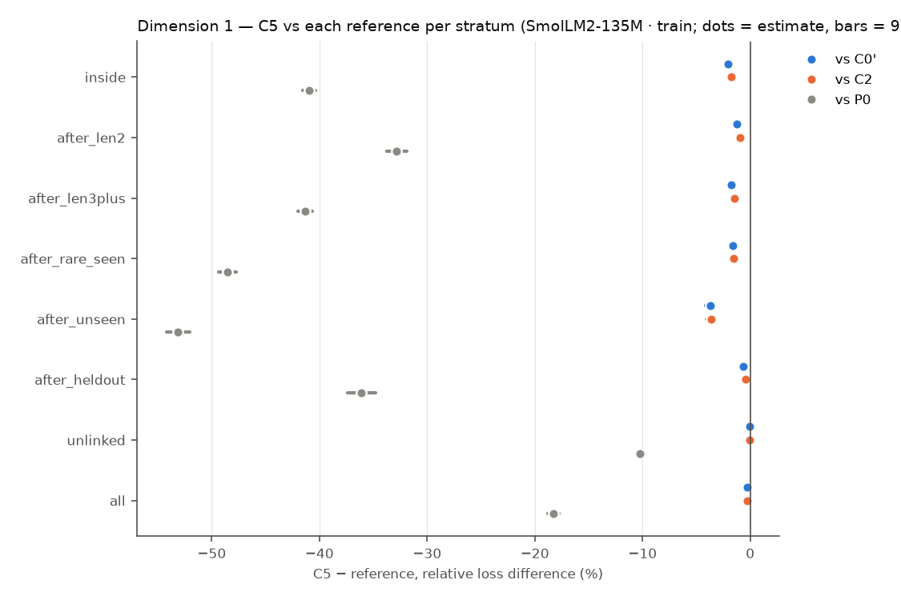
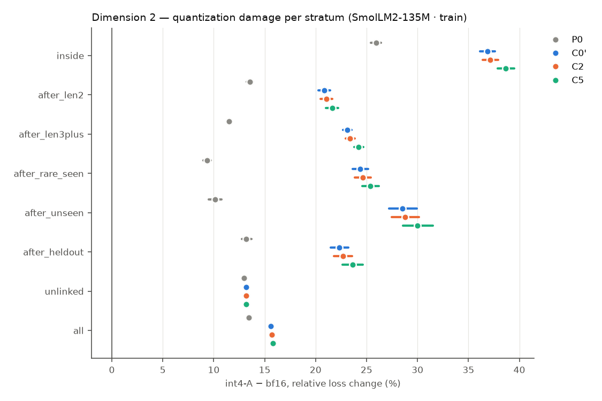
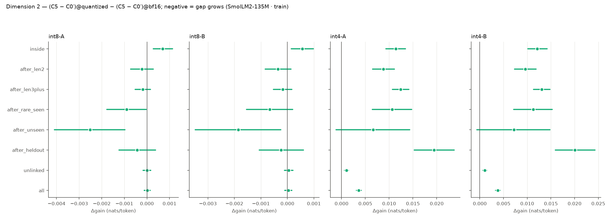
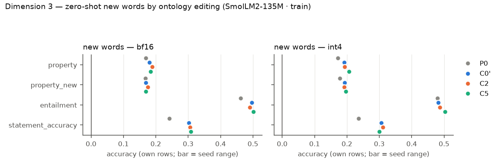
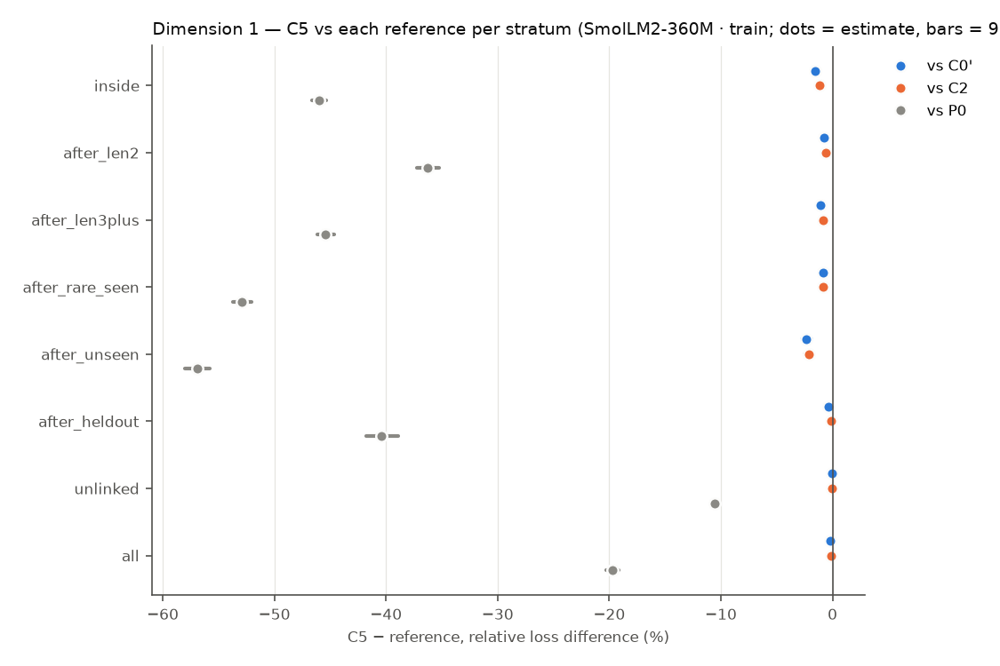
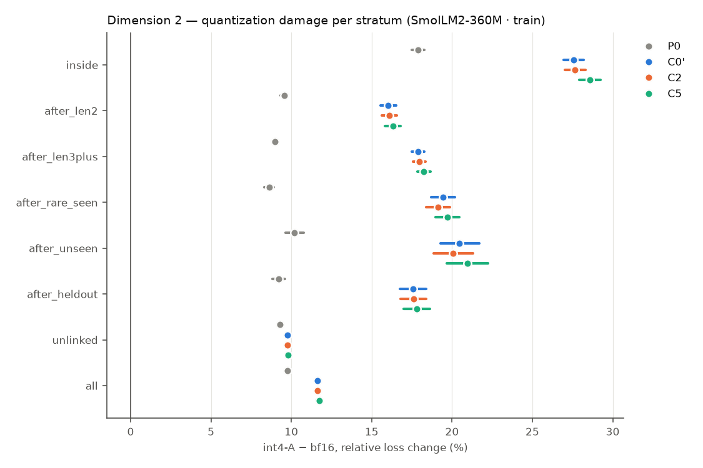
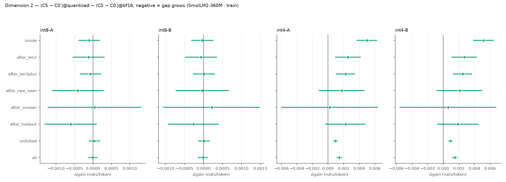
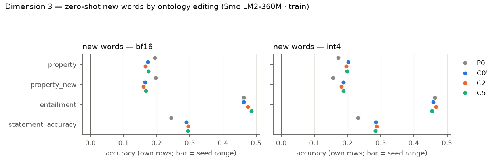

# R9 — retrofit × quantization (E9)

E9 asks three questions on pretrained hosts, all on one fixed test set: (1) does a VSA ontology channel trained jointly with the host improve it on long-token, rare and out-of-distribution words; (2) is the gap larger under weight quantization; (3) after training, can the model learn new or changed words zero-shot by editing the ontology alone? Models: **P0** the original host (evaluation only), **C0′** continued training without the channel, **C2** the same with a capacity-matched free per-concept table, **C5** the same with the attentive VSA channel. Loss differences are condition − reference (negative = lower loss), token-weighted and pooled over common seeds, with 95% cluster bootstraps over evaluation windows (10000 resamples); `*` = Holm-adjusted p < 0.05 within the family named in each table. P0 has no training randomness and pairs with every seed.

## SmolLM2-135M · train

Seeds: P0 [1]; C0' [1]; C2 [1]; C5 [1].

### Dimension 1 — C5 vs C0′, C2 and P0 (bf16)

> single seed: CIs cover evaluation windows or items only, not seed variance.

Relative loss difference [95% CI] (Holm over the three references within each stratum):

| Stratum | Targets | C5 − C0′ | C5 − C2 | C5 − P0 | C2 − C0′ | C0′ − P0 |
|---|---:|---|---|---|---|---|
| inside (long-token words) | 130661 | -2.03% [-2.19, -1.88]* | -1.73% [-1.87, -1.59]* | -40.98% [-41.58, -40.37]* | -0.31% [-0.36, -0.26] | -39.75% [-40.32, -39.16] |
| after_len2 (long-token words) | 87946 | -1.22% [-1.35, -1.10]* | -0.95% [-1.06, -0.85]* | -32.82% [-33.71, -31.91]* | -0.27% [-0.32, -0.22] | -31.99% [-32.85, -31.11] |
| after_len3plus (long-token words) | 185109 | -1.73% [-1.83, -1.62]* | -1.46% [-1.56, -1.37]* | -41.31% [-41.98, -40.63]* | -0.27% [-0.30, -0.24] | -40.28% [-40.93, -39.61] |
| after_rare_seen (rare words) | 31458 | -1.62% [-1.82, -1.43]* | -1.56% [-1.74, -1.39]* | -48.54% [-49.35, -47.74]* | -0.06% [-0.12, +0.00] | -47.69% [-48.49, -46.89] |
| after_unseen (out of distribution) | 9792 | -3.70% [-4.17, -3.23]* | -3.63% [-4.10, -3.16]* | -53.12% [-54.20, -52.04]* | -0.07% [-0.21, +0.07] | -51.32% [-52.38, -50.27] |
| after_heldout (out of distribution) | 35747 | -0.63% [-0.85, -0.41]* | -0.40% [-0.61, -0.19]* | -36.10% [-37.37, -34.75]* | -0.23% [-0.29, -0.17] | -35.69% [-36.93, -34.39] |
| unlinked (locality) | 739780 | -0.03% [-0.03, -0.02]* | -0.02% [-0.03, -0.01]* | -10.27% [-10.52, -10.02]* | -0.00% [-0.01, +0.00] | -10.25% [-10.50, -10.00] |
| all (locality) | 1047552 | -0.30% [-0.32, -0.28]* | -0.26% [-0.28, -0.24]* | -18.26% [-18.76, -17.77]* | -0.05% [-0.05, -0.04] | -18.02% [-18.50, -17.53] |

Absolute differences (nats/token):

| Stratum | C5 − C0′ | C5 − C2 | C5 − P0 |
|---|---|---|---|
| inside | -0.0227 [-0.0244, -0.0210]* | -0.0192 [-0.0208, -0.0178]* | -0.7581 [-0.7724, -0.7436]* |
| after_len2 | -0.0220 [-0.0242, -0.0199]* | -0.0171 [-0.0191, -0.0153]* | -0.8690 [-0.8929, -0.8453]* |
| after_len3plus | -0.0296 [-0.0314, -0.0279]* | -0.0250 [-0.0266, -0.0235]* | -1.1864 [-1.2068, -1.1649]* |
| after_rare_seen | -0.0292 [-0.0327, -0.0258]* | -0.0281 [-0.0315, -0.0249]* | -1.6711 [-1.7034, -1.6389]* |
| after_unseen | -0.0673 [-0.0759, -0.0588]* | -0.0659 [-0.0746, -0.0573]* | -1.9847 [-2.0323, -1.9380]* |
| after_heldout | -0.0105 [-0.0142, -0.0069]* | -0.0067 [-0.0102, -0.0032]* | -0.9412 [-0.9764, -0.9046]* |
| unlinked | -0.0006 [-0.0008, -0.0004]* | -0.0005 [-0.0007, -0.0004]* | -0.2683 [-0.2745, -0.2619]* |
| all | -0.0064 [-0.0069, -0.0060]* | -0.0054 [-0.0058, -0.0051]* | -0.4728 [-0.4852, -0.4602]* |

Probe differences (bf16): C5 − reference per subset, per seed (paired bootstrap over items):

| Reference | Seed | Probe | all | heldout | seen | unlinked |
|---|---:|---|---|---|---|---|
| C0' | 1 | lambada/accuracy | +0.001 [-0.002, +0.003] (n 5153) | — | +0.100 [+0.000, +0.300] (n 10) | +0.000 [-0.002, +0.003] (n 5143) |
| C0' | 1 | wic/probe_accuracy | -0.006 [-0.019, +0.006] (n 638) | +0.000 [+0.000, +0.000] (n 1) | +0.000 [+0.000, +0.000] (n 1) | -0.006 [-0.019, +0.006] (n 636) |
| C0' | 1 | card660/spearman_tied | +0.002 [-0.001, +0.005] (n 660) | — | +0.019 [-0.105, +0.144] (n 18) | +0.001 [-0.002, +0.003] (n 641) |
| C0' | 1 | rare_words/spearman_tied | +0.002 [+0.000, +0.004] (n 2034) | — | +0.024 [-0.430, +0.538] (n 8) | +0.002 [+0.000, +0.003] (n 2026) |
| C0' | 1 | wsd/probe_f1 | -0.001 [-0.002, +0.001] (n 7253) | — | +0.000 [+0.000, +0.000] (n 10) | -0.001 [-0.002, +0.001] (n 7243) |
| C0' | 1 | bless/pair_probe_macro_f1 | -0.003 [-0.006, +0.000] (n 4310) | — | -0.035 [-0.095, +0.005] (n 84) | -0.002 [-0.005, +0.001] (n 4226) |
| C0' | 1 | bless/prompt_auc | -0.002 [-0.003, -0.002] (n 14547) | — | -0.033 [-0.084, +0.012] (n 201) | -0.002 [-0.002, -0.002] (n 14344) |
| C0' | 1 | hyperlex/cosine_spearman | -0.001 [-0.002, +0.001] (n 2616) | — | +0.000 [+0.000, +0.000] (n 7) | -0.001 [-0.002, +0.000] (n 2609) |
| C2 | 1 | lambada/accuracy | +0.000 [-0.003, +0.003] (n 5153) | — | +0.100 [+0.000, +0.300] (n 10) | -0.000 [-0.003, +0.003] (n 5143) |
| C2 | 1 | wic/probe_accuracy | -0.005 [-0.014, +0.005] (n 638) | +0.000 [+0.000, +0.000] (n 1) | +0.000 [+0.000, +0.000] (n 1) | -0.005 [-0.014, +0.005] (n 636) |
| C2 | 1 | card660/spearman_tied | +0.001 [-0.003, +0.004] (n 660) | — | +0.028 [-0.019, +0.115] (n 18) | -0.001 [-0.004, +0.001] (n 641) |
| C2 | 1 | rare_words/spearman_tied | +0.002 [+0.000, +0.003] (n 2034) | — | +0.071 [-0.385, +0.615] (n 8) | +0.002 [+0.000, +0.003] (n 2026) |
| C2 | 1 | wsd/probe_f1 | -0.000 [-0.002, +0.002] (n 7253) | — | +0.000 [+0.000, +0.000] (n 10) | -0.000 [-0.002, +0.001] (n 7243) |
| C2 | 1 | bless/pair_probe_macro_f1 | -0.001 [-0.004, +0.003] (n 4310) | — | -0.035 [-0.095, +0.005] (n 84) | +0.000 [-0.003, +0.003] (n 4226) |
| C2 | 1 | bless/prompt_auc | -0.004 [-0.005, -0.003] (n 14547) | — | -0.033 [-0.081, +0.009] (n 201) | -0.004 [-0.004, -0.003] (n 14344) |
| C2 | 1 | hyperlex/cosine_spearman | +0.000 [-0.001, +0.001] (n 2616) | — | +0.000 [+0.000, +0.000] (n 7) | +0.000 [-0.001, +0.001] (n 2609) |
| P0 | 1 | lambada/accuracy | +0.003 [-0.002, +0.009] (n 5153) | — | +0.100 [+0.000, +0.300] (n 10) | +0.003 [-0.003, +0.009] (n 5143) |
| P0 | 1 | wic/probe_accuracy | +0.011 [-0.022, +0.044] (n 638) | +0.000 [+0.000, +0.000] (n 1) | +0.000 [+0.000, +0.000] (n 1) | +0.011 [-0.022, +0.044] (n 636) |
| P0 | 1 | card660/spearman_tied | -0.006 [-0.020, +0.007] (n 660) | — | +0.118 [-0.044, +0.327] (n 18) | -0.009 [-0.023, +0.003] (n 641) |
| P0 | 1 | rare_words/spearman_tied | -0.002 [-0.010, +0.007] (n 2034) | — | +0.095 [-0.274, +0.586] (n 8) | -0.002 [-0.010, +0.006] (n 2026) |
| P0 | 1 | wsd/probe_f1 | +0.000 [-0.003, +0.003] (n 7253) | — | +0.000 [+0.000, +0.000] (n 10) | +0.000 [-0.003, +0.004] (n 7243) |
| P0 | 1 | bless/pair_probe_macro_f1 | -0.006 [-0.012, -0.000] (n 4310) | — | -0.022 [-0.083, +0.022] (n 84) | -0.006 [-0.012, +0.001] (n 4226) |
| P0 | 1 | bless/prompt_auc | +0.023 [+0.020, +0.026] (n 14547) | — | -0.018 [-0.075, +0.043] (n 201) | +0.024 [+0.021, +0.026] (n 14344) |
| P0 | 1 | hyperlex/cosine_spearman | +0.003 [-0.003, +0.009] (n 2616) | — | +0.000 [+0.000, +0.000] (n 7) | +0.003 [-0.003, +0.010] (n 2609) |

### Dimension 2 — quantization damage and the gap under quantization

Quantization damage `variant − bf16`, relative [95% CI] (A = channel FP16, B = channel quantized; models without a channel have B = A):

| Stratum | Model | int8-A | int8-B | int4-A | int4-B |
|---|---|---|---|---|---|
| inside | P0 | +0.07% [+0.04, +0.10] | +0.07% [+0.04, +0.10] | +25.92% [+25.41, +26.44] | +25.92% [+25.41, +26.44] |
| inside | C0' | +0.11% [+0.06, +0.16] | +0.11% [+0.06, +0.16] | +36.86% [+36.14, +37.63] | +36.86% [+36.14, +37.63] |
| inside | C2 | +0.14% [+0.09, +0.19] | +0.13% [+0.08, +0.18] | +37.16% [+36.42, +37.93] | +37.14% [+36.40, +37.91] |
| inside | C5 | +0.17% [+0.12, +0.22] | +0.16% [+0.11, +0.21] | +38.67% [+37.89, +39.49] | +38.74% [+37.95, +39.56] |
| after_len2 | P0 | +0.03% [+0.00, +0.05] | +0.03% [+0.00, +0.05] | +13.56% [+13.26, +13.85] | +13.56% [+13.26, +13.85] |
| after_len2 | C0' | +0.22% [+0.19, +0.26] | +0.22% [+0.19, +0.26] | +20.86% [+20.29, +21.44] | +20.86% [+20.29, +21.44] |
| after_len2 | C2 | +0.21% [+0.17, +0.24] | +0.20% [+0.17, +0.24] | +21.06% [+20.49, +21.64] | +21.04% [+20.47, +21.62] |
| after_len2 | C5 | +0.21% [+0.17, +0.25] | +0.20% [+0.17, +0.24] | +21.62% [+21.00, +22.22] | +21.66% [+21.05, +22.27] |
| after_len3plus | P0 | -0.08% [-0.10, -0.07] | -0.08% [-0.10, -0.07] | +11.50% [+11.30, +11.71] | +11.50% [+11.30, +11.71] |
| after_len3plus | C0' | +0.20% [+0.17, +0.22] | +0.20% [+0.17, +0.22] | +23.09% [+22.67, +23.51] | +23.09% [+22.67, +23.51] |
| after_len3plus | C2 | +0.20% [+0.18, +0.23] | +0.20% [+0.18, +0.23] | +23.40% [+22.97, +23.83] | +23.40% [+22.98, +23.83] |
| after_len3plus | C5 | +0.19% [+0.16, +0.22] | +0.19% [+0.16, +0.22] | +24.23% [+23.77, +24.69] | +24.27% [+23.81, +24.73] |
| after_rare_seen | P0 | -0.11% [-0.14, -0.07] | -0.11% [-0.14, -0.07] | +9.34% [+8.98, +9.69] | +9.34% [+8.98, +9.69] |
| after_rare_seen | C0' | +0.29% [+0.23, +0.36] | +0.29% [+0.23, +0.36] | +24.39% [+23.63, +25.17] | +24.39% [+23.63, +25.17] |
| after_rare_seen | C2 | +0.28% [+0.22, +0.34] | +0.28% [+0.22, +0.35] | +24.64% [+23.87, +25.43] | +24.64% [+23.87, +25.42] |
| after_rare_seen | C5 | +0.25% [+0.19, +0.31] | +0.26% [+0.20, +0.32] | +25.39% [+24.59, +26.20] | +25.42% [+24.62, +26.24] |
| after_unseen | P0 | -0.20% [-0.25, -0.13] | -0.20% [-0.25, -0.13] | +10.13% [+9.50, +10.77] | +10.13% [+9.50, +10.77] |
| after_unseen | C0' | +0.57% [+0.47, +0.68] | +0.57% [+0.47, +0.68] | +28.53% [+27.21, +29.93] | +28.53% [+27.21, +29.93] |
| after_unseen | C2 | +0.47% [+0.37, +0.58] | +0.48% [+0.38, +0.59] | +28.78% [+27.45, +30.17] | +28.82% [+27.50, +30.20] |
| after_unseen | C5 | +0.45% [+0.34, +0.56] | +0.49% [+0.38, +0.60] | +30.01% [+28.58, +31.53] | +30.04% [+28.61, +31.56] |
| after_heldout | P0 | -0.03% [-0.07, +0.01] | -0.03% [-0.07, +0.01] | +13.20% [+12.74, +13.68] | +13.20% [+12.74, +13.68] |
| after_heldout | C0' | +0.18% [+0.12, +0.24] | +0.18% [+0.12, +0.24] | +22.35% [+21.47, +23.22] | +22.35% [+21.47, +23.22] |
| after_heldout | C2 | +0.17% [+0.12, +0.23] | +0.17% [+0.11, +0.23] | +22.70% [+21.80, +23.59] | +22.70% [+21.79, +23.59] |
| after_heldout | C5 | +0.16% [+0.10, +0.22] | +0.17% [+0.11, +0.23] | +23.65% [+22.66, +24.63] | +23.69% [+22.70, +24.66] |
| unlinked | P0 | +0.14% [+0.13, +0.15] | +0.14% [+0.13, +0.15] | +13.00% [+12.88, +13.11] | +13.00% [+12.88, +13.11] |
| unlinked | C0' | +0.16% [+0.15, +0.17] | +0.16% [+0.15, +0.17] | +13.16% [+13.02, +13.30] | +13.16% [+13.02, +13.30] |
| unlinked | C2 | +0.17% [+0.15, +0.18] | +0.17% [+0.16, +0.18] | +13.20% [+13.07, +13.34] | +13.20% [+13.07, +13.34] |
| unlinked | C5 | +0.16% [+0.15, +0.17] | +0.16% [+0.15, +0.17] | +13.21% [+13.07, +13.35] | +13.21% [+13.07, +13.35] |
| all | P0 | +0.10% [+0.09, +0.11] | +0.10% [+0.09, +0.11] | +13.42% [+13.32, +13.52] | +13.42% [+13.32, +13.52] |
| all | C0' | +0.17% [+0.16, +0.18] | +0.17% [+0.16, +0.18] | +15.62% [+15.43, +15.81] | +15.62% [+15.43, +15.81] |
| all | C2 | +0.17% [+0.16, +0.18] | +0.17% [+0.16, +0.18] | +15.70% [+15.51, +15.90] | +15.70% [+15.51, +15.90] |
| all | C5 | +0.17% [+0.16, +0.18] | +0.17% [+0.16, +0.18] | +15.83% [+15.64, +16.04] | +15.84% [+15.64, +16.05] |

Gap under quantization vs C0': gain = C5 − C0' at bf16 and quantized, `Δgain` = difference in differences (negative = the channel's advantage grows under quantization; Holm over references × variants within each stratum), retained = gain_q / gain_bf16:

| Stratum | Variant | gain bf16 | gain quantized | Δgain [95% CI] | retained |
|---|---|---|---|---|---|
| inside | int8-A | -0.0227 [-0.0245, -0.0211] | -0.0220 [-0.0237, -0.0204] | +0.0007 [+0.0003, +0.0011]* | 0.97 |
| inside | int8-B | -0.0227 [-0.0245, -0.0211] | -0.0222 [-0.0239, -0.0205] | +0.0006 [+0.0001, +0.0010]* | 0.98 |
| inside | int4-A | -0.0227 [-0.0245, -0.0211] | -0.0114 [-0.0138, -0.0089] | +0.0114 [+0.0093, +0.0134]* | 0.50 |
| inside | int4-B | -0.0227 [-0.0245, -0.0211] | -0.0106 [-0.0130, -0.0082] | +0.0121 [+0.0101, +0.0142]* | 0.47 |
| after_len2 | int8-A | -0.0220 [-0.0242, -0.0199] | -0.0222 [-0.0244, -0.0201] | -0.0002 [-0.0007, +0.0003] | 1.01 |
| after_len2 | int8-B | -0.0220 [-0.0242, -0.0199] | -0.0223 [-0.0245, -0.0202] | -0.0004 [-0.0008, +0.0001] | 1.02 |
| after_len2 | int4-A | -0.0220 [-0.0242, -0.0199] | -0.0132 [-0.0160, -0.0105] | +0.0088 [+0.0065, +0.0111]* | 0.60 |
| after_len2 | int4-B | -0.0220 [-0.0242, -0.0199] | -0.0124 [-0.0152, -0.0096] | +0.0096 [+0.0073, +0.0119]* | 0.56 |
| after_len3plus | int8-A | -0.0297 [-0.0314, -0.0280] | -0.0298 [-0.0316, -0.0281] | -0.0002 [-0.0005, +0.0002] | 1.01 |
| after_len3plus | int8-B | -0.0297 [-0.0314, -0.0280] | -0.0298 [-0.0316, -0.0281] | -0.0002 [-0.0005, +0.0002] | 1.01 |
| after_len3plus | int4-A | -0.0297 [-0.0314, -0.0280] | -0.0172 [-0.0193, -0.0152] | +0.0124 [+0.0107, +0.0141]* | 0.58 |
| after_len3plus | int4-B | -0.0297 [-0.0314, -0.0280] | -0.0166 [-0.0186, -0.0146] | +0.0131 [+0.0114, +0.0148]* | 0.56 |
| after_rare_seen | int8-A | -0.0293 [-0.0328, -0.0259] | -0.0302 [-0.0336, -0.0269] | -0.0009 [-0.0018, -0.0000] | 1.03 |
| after_rare_seen | int8-B | -0.0293 [-0.0328, -0.0259] | -0.0300 [-0.0334, -0.0267] | -0.0007 [-0.0015, +0.0002] | 1.02 |
| after_rare_seen | int4-A | -0.0293 [-0.0328, -0.0259] | -0.0187 [-0.0235, -0.0140] | +0.0106 [+0.0064, +0.0147]* | 0.64 |
| after_rare_seen | int4-B | -0.0293 [-0.0328, -0.0259] | -0.0181 [-0.0228, -0.0135] | +0.0112 [+0.0072, +0.0153]* | 0.62 |
| after_unseen | int8-A | -0.0672 [-0.0758, -0.0587] | -0.0697 [-0.0784, -0.0611] | -0.0025 [-0.0041, -0.0010]* | 1.04 |
| after_unseen | int8-B | -0.0672 [-0.0758, -0.0587] | -0.0690 [-0.0777, -0.0604] | -0.0018 [-0.0035, -0.0003] | 1.03 |
| after_unseen | int4-A | -0.0672 [-0.0758, -0.0587] | -0.0605 [-0.0708, -0.0506] | +0.0067 [-0.0011, +0.0143] | 0.90 |
| after_unseen | int4-B | -0.0672 [-0.0758, -0.0587] | -0.0600 [-0.0702, -0.0502] | +0.0072 [-0.0006, +0.0148] | 0.89 |
| after_heldout | int8-A | -0.0105 [-0.0143, -0.0069] | -0.0109 [-0.0147, -0.0073] | -0.0004 [-0.0012, +0.0004] | 1.04 |
| after_heldout | int8-B | -0.0105 [-0.0143, -0.0069] | -0.0108 [-0.0144, -0.0072] | -0.0002 [-0.0011, +0.0006] | 1.02 |
| after_heldout | int4-A | -0.0105 [-0.0143, -0.0069] | +0.0089 [+0.0049, +0.0130] | +0.0195 [+0.0153, +0.0237]* | -0.85 |
| after_heldout | int4-B | -0.0105 [-0.0143, -0.0069] | +0.0096 [+0.0056, +0.0136] | +0.0201 [+0.0159, +0.0243]* | -0.91 |
| unlinked | int8-A | -0.0006 [-0.0008, -0.0004] | -0.0006 [-0.0008, -0.0004] | +0.0000 [-0.0002, +0.0002] | 1.00 |
| unlinked | int8-B | -0.0006 [-0.0008, -0.0004] | -0.0006 [-0.0007, -0.0004] | +0.0000 [-0.0001, +0.0002] | 0.92 |
| unlinked | int4-A | -0.0006 [-0.0008, -0.0004] | +0.0005 [+0.0000, +0.0008] | +0.0011 [+0.0006, +0.0015]* | -0.75 |
| unlinked | int4-B | -0.0006 [-0.0008, -0.0004] | +0.0005 [+0.0001, +0.0009] | +0.0011 [+0.0007, +0.0015]* | -0.77 |
| all | int8-A | -0.0064 [-0.0069, -0.0060] | -0.0064 [-0.0069, -0.0060] | +0.0000 [-0.0001, +0.0001] | 1.00 |
| all | int8-B | -0.0064 [-0.0069, -0.0060] | -0.0064 [-0.0068, -0.0060] | +0.0000 [-0.0001, +0.0002] | 0.99 |
| all | int4-A | -0.0064 [-0.0069, -0.0060] | -0.0028 [-0.0033, -0.0023] | +0.0036 [+0.0031, +0.0041]* | 0.43 |
| all | int4-B | -0.0064 [-0.0069, -0.0060] | -0.0026 [-0.0032, -0.0021] | +0.0038 [+0.0033, +0.0043]* | 0.41 |

Gap under quantization vs C2: gain = C5 − C2 at bf16 and quantized, `Δgain` = difference in differences (negative = the channel's advantage grows under quantization; Holm over references × variants within each stratum), retained = gain_q / gain_bf16:

| Stratum | Variant | gain bf16 | gain quantized | Δgain [95% CI] | retained |
|---|---|---|---|---|---|
| inside | int8-A | -0.0193 [-0.0208, -0.0178] | -0.0189 [-0.0204, -0.0174] | +0.0004 [-0.0001, +0.0008] | 0.98 |
| inside | int8-B | -0.0193 [-0.0208, -0.0178] | -0.0189 [-0.0205, -0.0174] | +0.0004 [-0.0001, +0.0008] | 0.98 |
| inside | int4-A | -0.0193 [-0.0208, -0.0178] | -0.0099 [-0.0122, -0.0076] | +0.0094 [+0.0074, +0.0114]* | 0.51 |
| inside | int4-B | -0.0193 [-0.0208, -0.0178] | -0.0089 [-0.0112, -0.0067] | +0.0103 [+0.0083, +0.0124]* | 0.46 |
| after_len2 | int8-A | -0.0171 [-0.0190, -0.0153] | -0.0171 [-0.0190, -0.0153] | +0.0000 [-0.0005, +0.0005] | 1.00 |
| after_len2 | int8-B | -0.0171 [-0.0190, -0.0153] | -0.0172 [-0.0191, -0.0153] | -0.0001 [-0.0005, +0.0004] | 1.00 |
| after_len2 | int4-A | -0.0171 [-0.0190, -0.0153] | -0.0109 [-0.0136, -0.0082] | +0.0062 [+0.0040, +0.0085]* | 0.64 |
| after_len2 | int4-B | -0.0171 [-0.0190, -0.0153] | -0.0097 [-0.0124, -0.0071] | +0.0074 [+0.0051, +0.0097]* | 0.57 |
| after_len3plus | int8-A | -0.0251 [-0.0266, -0.0235] | -0.0254 [-0.0269, -0.0238] | -0.0003 [-0.0006, +0.0000] | 1.01 |
| after_len3plus | int8-B | -0.0251 [-0.0266, -0.0235] | -0.0254 [-0.0269, -0.0238] | -0.0003 [-0.0006, +0.0000] | 1.01 |
| after_len3plus | int4-A | -0.0251 [-0.0266, -0.0235] | -0.0169 [-0.0188, -0.0149] | +0.0082 [+0.0065, +0.0099]* | 0.67 |
| after_len3plus | int4-B | -0.0251 [-0.0266, -0.0235] | -0.0163 [-0.0182, -0.0144] | +0.0088 [+0.0071, +0.0105]* | 0.65 |
| after_rare_seen | int8-A | -0.0282 [-0.0316, -0.0250] | -0.0289 [-0.0322, -0.0257] | -0.0007 [-0.0015, +0.0002] | 1.02 |
| after_rare_seen | int8-B | -0.0282 [-0.0316, -0.0250] | -0.0288 [-0.0321, -0.0256] | -0.0005 [-0.0014, +0.0003] | 1.02 |
| after_rare_seen | int4-A | -0.0282 [-0.0316, -0.0250] | -0.0220 [-0.0268, -0.0173] | +0.0063 [+0.0021, +0.0104]* | 0.78 |
| after_rare_seen | int4-B | -0.0282 [-0.0316, -0.0250] | -0.0213 [-0.0259, -0.0166] | +0.0070 [+0.0029, +0.0110]* | 0.75 |
| after_unseen | int8-A | -0.0658 [-0.0745, -0.0571] | -0.0666 [-0.0752, -0.0580] | -0.0008 [-0.0022, +0.0008] | 1.01 |
| after_unseen | int8-B | -0.0658 [-0.0745, -0.0571] | -0.0661 [-0.0748, -0.0575] | -0.0003 [-0.0018, +0.0013] | 1.00 |
| after_unseen | int4-A | -0.0658 [-0.0745, -0.0571] | -0.0633 [-0.0740, -0.0529] | +0.0025 [-0.0054, +0.0103] | 0.96 |
| after_unseen | int4-B | -0.0658 [-0.0745, -0.0571] | -0.0634 [-0.0740, -0.0530] | +0.0024 [-0.0055, +0.0102] | 0.96 |
| after_heldout | int8-A | -0.0067 [-0.0102, -0.0033] | -0.0070 [-0.0105, -0.0036] | -0.0003 [-0.0011, +0.0005] | 1.04 |
| after_heldout | int8-B | -0.0067 [-0.0102, -0.0033] | -0.0067 [-0.0101, -0.0034] | +0.0000 [-0.0008, +0.0008] | 1.00 |
| after_heldout | int4-A | -0.0067 [-0.0102, -0.0033] | +0.0078 [+0.0037, +0.0119] | +0.0144 [+0.0103, +0.0186]* | -1.16 |
| after_heldout | int4-B | -0.0067 [-0.0102, -0.0033] | +0.0083 [+0.0044, +0.0123] | +0.0150 [+0.0109, +0.0192]* | -1.25 |
| unlinked | int8-A | -0.0005 [-0.0007, -0.0004] | -0.0007 [-0.0009, -0.0005] | -0.0002 [-0.0003, +0.0000] | 1.29 |
| unlinked | int8-B | -0.0005 [-0.0007, -0.0004] | -0.0006 [-0.0008, -0.0005] | -0.0001 [-0.0003, +0.0001] | 1.22 |
| unlinked | int4-A | -0.0005 [-0.0007, -0.0004] | -0.0005 [-0.0009, -0.0001] | +0.0000 [-0.0004, +0.0005] | 0.94 |
| unlinked | int4-B | -0.0005 [-0.0007, -0.0004] | -0.0005 [-0.0009, -0.0000] | +0.0001 [-0.0004, +0.0005] | 0.87 |
| all | int8-A | -0.0054 [-0.0058, -0.0051] | -0.0056 [-0.0060, -0.0052] | -0.0001 [-0.0003, +0.0000] | 1.02 |
| all | int8-B | -0.0054 [-0.0058, -0.0051] | -0.0055 [-0.0059, -0.0051] | -0.0001 [-0.0002, +0.0001] | 1.02 |
| all | int4-A | -0.0054 [-0.0058, -0.0051] | -0.0035 [-0.0040, -0.0030] | +0.0019 [+0.0015, +0.0025]* | 0.64 |
| all | int4-B | -0.0054 [-0.0058, -0.0051] | -0.0033 [-0.0038, -0.0028] | +0.0022 [+0.0017, +0.0027]* | 0.60 |

Gap under quantization vs P0: gain = C5 − P0 at bf16 and quantized, `Δgain` = difference in differences (negative = the channel's advantage grows under quantization; Holm over references × variants within each stratum), retained = gain_q / gain_bf16:

| Stratum | Variant | gain bf16 | gain quantized | Δgain [95% CI] | retained |
|---|---|---|---|---|---|
| inside | int8-A | -0.7581 [-0.7724, -0.7437] | -0.7575 [-0.7718, -0.7432] | +0.0006 [-0.0001, +0.0013] | 1.00 |
| inside | int8-B | -0.7581 [-0.7724, -0.7437] | -0.7577 [-0.7719, -0.7433] | +0.0005 [-0.0003, +0.0012] | 1.00 |
| inside | int4-A | -0.7581 [-0.7724, -0.7437] | -0.8154 [-0.8295, -0.8010] | -0.0573 [-0.0631, -0.0514]* | 1.08 |
| inside | int4-B | -0.7581 [-0.7724, -0.7437] | -0.8147 [-0.8287, -0.8002] | -0.0565 [-0.0624, -0.0506]* | 1.07 |
| after_len2 | int8-A | -0.8689 [-0.8929, -0.8453] | -0.8659 [-0.8896, -0.8423] | +0.0031 [+0.0022, +0.0039]* | 1.00 |
| after_len2 | int8-B | -0.8689 [-0.8929, -0.8453] | -0.8660 [-0.8897, -0.8425] | +0.0029 [+0.0020, +0.0038]* | 1.00 |
| after_len2 | int4-A | -0.8689 [-0.8929, -0.8453] | -0.8435 [-0.8650, -0.8217] | +0.0255 [+0.0186, +0.0323]* | 0.97 |
| after_len2 | int4-B | -0.8689 [-0.8929, -0.8453] | -0.8427 [-0.8642, -0.8209] | +0.0263 [+0.0194, +0.0332]* | 0.97 |
| after_len3plus | int8-A | -1.1864 [-1.2069, -1.1650] | -1.1808 [-1.2010, -1.1595] | +0.0056 [+0.0050, +0.0062]* | 1.00 |
| after_len3plus | int8-B | -1.1864 [-1.2069, -1.1650] | -1.1808 [-1.2010, -1.1595] | +0.0056 [+0.0050, +0.0062]* | 1.00 |
| after_len3plus | int4-A | -1.1864 [-1.2069, -1.1650] | -1.1083 [-1.1264, -1.0896] | +0.0781 [+0.0725, +0.0836]* | 0.93 |
| after_len3plus | int4-B | -1.1864 [-1.2069, -1.1650] | -1.1077 [-1.1257, -1.0891] | +0.0787 [+0.0732, +0.0842]* | 0.93 |
| after_rare_seen | int8-A | -1.6712 [-1.7035, -1.6390] | -1.6631 [-1.6953, -1.6312] | +0.0081 [+0.0066, +0.0096]* | 1.00 |
| after_rare_seen | int8-B | -1.6712 [-1.7035, -1.6390] | -1.6629 [-1.6951, -1.6308] | +0.0083 [+0.0068, +0.0099]* | 1.00 |
| after_rare_seen | int4-A | -1.6712 [-1.7035, -1.6390] | -1.5430 [-1.5741, -1.5120] | +0.1283 [+0.1159, +0.1404]* | 0.92 |
| after_rare_seen | int4-B | -1.6712 [-1.7035, -1.6390] | -1.5423 [-1.5733, -1.5113] | +0.1289 [+0.1166, +0.1411]* | 0.92 |
| after_unseen | int8-A | -1.9846 [-2.0322, -1.9379] | -1.9694 [-2.0167, -1.9229] | +0.0152 [+0.0125, +0.0178]* | 0.99 |
| after_unseen | int8-B | -1.9846 [-2.0322, -1.9379] | -1.9688 [-2.0160, -1.9221] | +0.0158 [+0.0131, +0.0185]* | 0.99 |
| after_unseen | int4-A | -1.9846 [-2.0322, -1.9379] | -1.8375 [-1.8870, -1.7897] | +0.1471 [+0.1250, +0.1694]* | 0.93 |
| after_unseen | int4-B | -1.9846 [-2.0322, -1.9379] | -1.8370 [-1.8866, -1.7891] | +0.1476 [+0.1256, +0.1700]* | 0.93 |
| after_heldout | int8-A | -0.9412 [-0.9765, -0.9046] | -0.9378 [-0.9727, -0.9012] | +0.0034 [+0.0021, +0.0047]* | 1.00 |
| after_heldout | int8-B | -0.9412 [-0.9765, -0.9046] | -0.9376 [-0.9725, -0.9010] | +0.0036 [+0.0023, +0.0049]* | 1.00 |
| after_heldout | int4-A | -0.9412 [-0.9765, -0.9046] | -0.8913 [-0.9235, -0.8580] | +0.0499 [+0.0383, +0.0615]* | 0.95 |
| after_heldout | int4-B | -0.9412 [-0.9765, -0.9046] | -0.8907 [-0.9230, -0.8573] | +0.0505 [+0.0390, +0.0621]* | 0.95 |
| unlinked | int8-A | -0.2683 [-0.2745, -0.2619] | -0.2682 [-0.2745, -0.2619] | +0.0000 [-0.0002, +0.0003] | 1.00 |
| unlinked | int8-B | -0.2683 [-0.2745, -0.2619] | -0.2682 [-0.2744, -0.2619] | +0.0001 [-0.0002, +0.0004] | 1.00 |
| unlinked | int4-A | -0.2683 [-0.2745, -0.2619] | -0.2982 [-0.3041, -0.2922] | -0.0299 [-0.0318, -0.0281]* | 1.11 |
| unlinked | int4-B | -0.2683 [-0.2745, -0.2619] | -0.2982 [-0.3041, -0.2922] | -0.0299 [-0.0318, -0.0281]* | 1.11 |
| all | int8-A | -0.4728 [-0.4852, -0.4602] | -0.4717 [-0.4841, -0.4592] | +0.0011 [+0.0008, +0.0013]* | 1.00 |
| all | int8-B | -0.4728 [-0.4852, -0.4602] | -0.4717 [-0.4840, -0.4592] | +0.0011 [+0.0008, +0.0014]* | 1.00 |
| all | int4-A | -0.4728 [-0.4852, -0.4602] | -0.4852 [-0.4963, -0.4739] | -0.0124 [-0.0146, -0.0102]* | 1.03 |
| all | int4-B | -0.4728 [-0.4852, -0.4602] | -0.4850 [-0.4962, -0.4738] | -0.0122 [-0.0144, -0.0100]* | 1.03 |

> Single seed in at least one model: CIs cover evaluation windows only.

Probe damage int4 − bf16 per model (paired over items; all items / held-out / seen):

| Model | Seed | Probe | all | heldout | seen |
|---|---:|---|---|---|---|
| P0 | 1 | lambada/accuracy | -0.038 [-0.049, -0.027] | — | +0.100 [-0.200, +0.400] |
| P0 | 1 | wic/probe_accuracy | +0.039 [-0.002, +0.080] | +0.000 [+0.000, +0.000] | -1.000 [-1.000, -1.000] |
| P0 | 1 | card660/spearman_tied | +0.018 [-0.022, +0.056] | — | +0.149 [-0.042, +0.394] |
| P0 | 1 | rare_words/spearman_tied | -0.051 [-0.076, -0.029] | — | +0.429 [-0.051, +0.914] |
| P0 | 1 | wsd/probe_f1 | -0.005 [-0.010, +0.001] | — | +0.000 [+0.000, +0.000] |
| P0 | 1 | bless/pair_probe_macro_f1 | -0.020 [-0.030, -0.010] | — | -0.007 [-0.090, +0.078] |
| P0 | 1 | bless/prompt_auc | -0.034 [-0.038, -0.029] | — | -0.031 [-0.077, +0.011] |
| P0 | 1 | hyperlex/cosine_spearman | -0.019 [-0.038, -0.001] | — | +0.000 [+0.000, +0.000] |
| C0' | 1 | lambada/accuracy | -0.030 [-0.041, -0.019] | — | +0.100 [+0.000, +0.300] |
| C0' | 1 | wic/probe_accuracy | -0.003 [-0.047, +0.039] | +0.000 [+0.000, +0.000] | -1.000 [-1.000, -1.000] |
| C0' | 1 | card660/spearman_tied | +0.017 [-0.023, +0.053] | — | -0.024 [-0.222, +0.153] |
| C0' | 1 | rare_words/spearman_tied | -0.041 [-0.063, -0.020] | — | +0.214 [-0.205, +0.861] |
| C0' | 1 | wsd/probe_f1 | -0.005 [-0.010, +0.001] | — | +0.000 [+0.000, +0.000] |
| C0' | 1 | bless/pair_probe_macro_f1 | -0.027 [-0.038, -0.016] | — | -0.058 [-0.152, +0.018] |
| C0' | 1 | bless/prompt_auc | -0.023 [-0.028, -0.018] | — | +0.000 [-0.037, +0.038] |
| C0' | 1 | hyperlex/cosine_spearman | -0.030 [-0.049, -0.013] | — | +0.220 [+0.000, +0.885] |
| C2 | 1 | lambada/accuracy | -0.027 [-0.038, -0.016] | — | +0.100 [+0.000, +0.300] |
| C2 | 1 | wic/probe_accuracy | +0.002 [-0.042, +0.045] | +0.000 [+0.000, +0.000] | -1.000 [-1.000, -1.000] |
| C2 | 1 | card660/spearman_tied | +0.019 [-0.021, +0.055] | — | -0.012 [-0.213, +0.194] |
| C2 | 1 | rare_words/spearman_tied | -0.043 [-0.065, -0.022] | — | +0.214 [-0.225, +0.844] |
| C2 | 1 | wsd/probe_f1 | -0.006 [-0.011, +0.000] | — | +0.000 [+0.000, +0.000] |
| C2 | 1 | bless/pair_probe_macro_f1 | -0.025 [-0.035, -0.014] | — | -0.042 [-0.130, +0.029] |
| C2 | 1 | bless/prompt_auc | -0.025 [-0.030, -0.020] | — | +0.001 [-0.036, +0.040] |
| C2 | 1 | hyperlex/cosine_spearman | -0.030 [-0.049, -0.012] | — | +0.220 [+0.000, +0.885] |
| C5 | 1 | lambada/accuracy | -0.032 [-0.044, -0.020] | — | +0.100 [+0.000, +0.300] |
| C5 | 1 | wic/probe_accuracy | +0.011 [-0.033, +0.055] | +0.000 [+0.000, +0.000] | -1.000 [-1.000, -1.000] |
| C5 | 1 | card660/spearman_tied | +0.016 [-0.024, +0.052] | — | +0.030 [-0.188, +0.274] |
| C5 | 1 | rare_words/spearman_tied | -0.041 [-0.063, -0.020] | — | +0.143 [-0.370, +0.667] |
| C5 | 1 | wsd/probe_f1 | -0.004 [-0.010, +0.002] | — | +0.000 [+0.000, +0.000] |
| C5 | 1 | bless/pair_probe_macro_f1 | -0.026 [-0.037, -0.015] | — | -0.034 [-0.126, +0.038] |
| C5 | 1 | bless/prompt_auc | -0.022 [-0.027, -0.017] | — | +0.046 [+0.006, +0.092] |
| C5 | 1 | hyperlex/cosine_spearman | -0.025 [-0.043, -0.007] | — | +0.220 [+0.000, +0.885] |

Probe differences at int4 (variant A): C5 − reference per subset, per seed (paired bootstrap over items):

| Reference | Seed | Probe | all | heldout | seen | unlinked |
|---|---:|---|---|---|---|---|
| C0' | 1 | lambada/accuracy | -0.002 [-0.006, +0.003] (n 5153) | — | +0.100 [+0.000, +0.300] (n 10) | -0.002 [-0.006, +0.003] (n 5143) |
| C0' | 1 | wic/probe_accuracy | +0.008 [-0.013, +0.027] (n 638) | +0.000 [+0.000, +0.000] (n 1) | +0.000 [+0.000, +0.000] (n 1) | +0.008 [-0.011, +0.027] (n 636) |
| C0' | 1 | card660/spearman_tied | +0.001 [-0.007, +0.009] (n 660) | — | +0.072 [-0.034, +0.235] (n 18) | -0.000 [-0.008, +0.008] (n 641) |
| C0' | 1 | rare_words/spearman_tied | +0.001 [-0.003, +0.006] (n 2034) | — | -0.048 [-0.304, +0.000] (n 8) | +0.001 [-0.003, +0.006] (n 2026) |
| C0' | 1 | wsd/probe_f1 | +0.000 [-0.002, +0.002] (n 7253) | — | +0.000 [+0.000, +0.000] (n 10) | +0.000 [-0.002, +0.002] (n 7243) |
| C0' | 1 | bless/pair_probe_macro_f1 | -0.001 [-0.007, +0.004] (n 4310) | — | -0.011 [-0.086, +0.048] (n 84) | -0.001 [-0.007, +0.005] (n 4226) |
| C0' | 1 | bless/prompt_auc | -0.001 [-0.002, -0.000] (n 14547) | — | +0.012 [-0.026, +0.053] (n 201) | -0.001 [-0.002, -0.001] (n 14344) |
| C0' | 1 | hyperlex/cosine_spearman | +0.005 [+0.001, +0.008] (n 2616) | — | +0.000 [+0.000, +0.000] (n 7) | +0.005 [+0.001, +0.008] (n 2609) |
| C2 | 1 | lambada/accuracy | -0.005 [-0.009, -0.001] (n 5153) | — | +0.100 [+0.000, +0.300] (n 10) | -0.005 [-0.010, -0.001] (n 5143) |
| C2 | 1 | wic/probe_accuracy | +0.005 [-0.013, +0.024] (n 638) | +0.000 [+0.000, +0.000] (n 1) | +0.000 [+0.000, +0.000] (n 1) | +0.005 [-0.013, +0.022] (n 636) |
| C2 | 1 | card660/spearman_tied | -0.002 [-0.010, +0.005] (n 660) | — | +0.070 [-0.035, +0.232] (n 18) | -0.003 [-0.010, +0.005] (n 641) |
| C2 | 1 | rare_words/spearman_tied | +0.003 [-0.002, +0.008] (n 2034) | — | +0.000 [+0.000, +0.000] (n 8) | +0.004 [-0.001, +0.008] (n 2026) |
| C2 | 1 | wsd/probe_f1 | +0.001 [-0.001, +0.004] (n 7253) | — | +0.000 [+0.000, +0.000] (n 10) | +0.001 [-0.001, +0.004] (n 7243) |
| C2 | 1 | bless/pair_probe_macro_f1 | -0.001 [-0.007, +0.004] (n 4310) | — | -0.027 [-0.094, +0.016] (n 84) | -0.001 [-0.007, +0.005] (n 4226) |
| C2 | 1 | bless/prompt_auc | -0.001 [-0.002, +0.000] (n 14547) | — | +0.012 [-0.028, +0.053] (n 201) | -0.001 [-0.002, +0.000] (n 14344) |
| C2 | 1 | hyperlex/cosine_spearman | +0.005 [+0.001, +0.009] (n 2616) | — | +0.000 [+0.000, +0.000] (n 7) | +0.006 [+0.002, +0.009] (n 2609) |
| P0 | 1 | lambada/accuracy | +0.010 [+0.002, +0.019] (n 5153) | — | +0.100 [+0.000, +0.300] (n 10) | +0.010 [+0.001, +0.018] (n 5143) |
| P0 | 1 | wic/probe_accuracy | -0.017 [-0.055, +0.020] (n 638) | +0.000 [+0.000, +0.000] (n 1) | +0.000 [+0.000, +0.000] (n 1) | -0.017 [-0.057, +0.019] (n 636) |
| P0 | 1 | card660/spearman_tied | -0.009 [-0.035, +0.017] (n 660) | — | -0.001 [-0.175, +0.152] (n 18) | -0.011 [-0.037, +0.016] (n 641) |
| P0 | 1 | rare_words/spearman_tied | +0.009 [-0.005, +0.024] (n 2034) | — | -0.190 [-0.716, +0.000] (n 8) | +0.009 [-0.005, +0.023] (n 2026) |
| P0 | 1 | wsd/probe_f1 | +0.001 [-0.003, +0.006] (n 7253) | — | +0.000 [+0.000, +0.000] (n 10) | +0.001 [-0.003, +0.006] (n 7243) |
| P0 | 1 | bless/pair_probe_macro_f1 | -0.012 [-0.021, -0.003] (n 4310) | — | -0.049 [-0.144, +0.026] (n 84) | -0.011 [-0.020, -0.002] (n 4226) |
| P0 | 1 | bless/prompt_auc | +0.034 [+0.030, +0.039] (n 14547) | — | +0.059 [+0.003, +0.119] (n 201) | +0.034 [+0.030, +0.038] (n 14344) |
| P0 | 1 | hyperlex/cosine_spearman | -0.002 [-0.016, +0.012] (n 2616) | — | +0.220 [+0.000, +0.885] (n 7) | -0.003 [-0.016, +0.010] (n 2609) |

### General text (the track's `eval-general`: locality and general-text quantization damage)

C5 − reference at bf16 (locality, nats/token; positive = worse on general text) and its change under quantization (Δgain; negative = the gap grows; Holm over references × variants):

| Stratum | Reference | Variant | gain bf16 [95% CI] | Δgain [95% CI] |
|---|---|---|---|---|
| all | C0' | int8-A | +0.0001 [+0.0001, +0.0003] | +0.0001 [-0.0001, +0.0002] |
| unlinked | C0' | int8-A | +0.0000 [-0.0001, +0.0001] | +0.0001 [-0.0000, +0.0002] |
| all | C0' | int8-B | +0.0001 [+0.0001, +0.0003] | +0.0000 [-0.0001, +0.0002] |
| unlinked | C0' | int8-B | +0.0000 [-0.0001, +0.0001] | +0.0001 [-0.0001, +0.0002] |
| all | C0' | int4-A | +0.0001 [+0.0001, +0.0003] | -0.0019 [-0.0023, -0.0016]* |
| unlinked | C0' | int4-A | +0.0000 [-0.0001, +0.0001] | -0.0019 [-0.0023, -0.0016]* |
| all | C0' | int4-B | +0.0001 [+0.0001, +0.0003] | -0.0019 [-0.0023, -0.0016]* |
| unlinked | C0' | int4-B | +0.0000 [-0.0001, +0.0001] | -0.0019 [-0.0023, -0.0016]* |
| all | C2 | int8-A | +0.0000 [-0.0001, +0.0001] | +0.0001 [-0.0000, +0.0002] |
| unlinked | C2 | int8-A | -0.0001 [-0.0002, -0.0000] | +0.0001 [-0.0000, +0.0003] |
| all | C2 | int8-B | +0.0000 [-0.0001, +0.0001] | +0.0001 [-0.0001, +0.0002] |
| unlinked | C2 | int8-B | -0.0001 [-0.0002, -0.0000] | +0.0001 [-0.0000, +0.0002] |
| all | C2 | int4-A | +0.0000 [-0.0001, +0.0001] | -0.0031 [-0.0035, -0.0028]* |
| unlinked | C2 | int4-A | -0.0001 [-0.0002, -0.0000] | -0.0031 [-0.0035, -0.0028]* |
| all | C2 | int4-B | +0.0000 [-0.0001, +0.0001] | -0.0031 [-0.0035, -0.0028]* |
| unlinked | C2 | int4-B | -0.0001 [-0.0002, -0.0000] | -0.0031 [-0.0035, -0.0028]* |
| all | P0 | int8-A | -0.0004 [-0.0013, +0.0004] | +0.0005 [+0.0003, +0.0007]* |
| unlinked | P0 | int8-A | -0.0007 [-0.0015, +0.0001] | +0.0005 [+0.0003, +0.0007]* |
| all | P0 | int8-B | -0.0004 [-0.0013, +0.0004] | +0.0004 [+0.0002, +0.0007]* |
| unlinked | P0 | int8-B | -0.0007 [-0.0015, +0.0001] | +0.0005 [+0.0002, +0.0007]* |
| all | P0 | int4-A | -0.0004 [-0.0013, +0.0004] | -0.0096 [-0.0106, -0.0085]* |
| unlinked | P0 | int4-A | -0.0007 [-0.0015, +0.0001] | -0.0095 [-0.0105, -0.0084]* |
| all | P0 | int4-B | -0.0004 [-0.0013, +0.0004] | -0.0096 [-0.0106, -0.0086]* |
| unlinked | P0 | int4-B | -0.0007 [-0.0015, +0.0001] | -0.0095 [-0.0105, -0.0084]* |

Quantization damage on general text (relative):

| Model | int8-A | int8-B | int4-A | int4-B |
|---|---|---|---|---|
| P0 | +0.11% [+0.11, +0.12] | +0.11% [+0.11, +0.12] | +11.20% [+11.08, +11.33] | +11.20% [+11.08, +11.33] |
| C0' | +0.13% [+0.12, +0.14] | +0.13% [+0.12, +0.14] | +10.93% [+10.80, +11.06] | +10.93% [+10.80, +11.06] |
| C2 | +0.13% [+0.12, +0.14] | +0.13% [+0.12, +0.14] | +10.97% [+10.85, +11.10] | +10.97% [+10.85, +11.10] |
| C5 | +0.13% [+0.12, +0.14] | +0.13% [+0.12, +0.14] | +10.86% [+10.73, +10.98] | +10.86% [+10.73, +10.98] |

### Dimension 3 — zero-shot learning by ontology editing (no weight update)

> Single seed: intervals cover items only, not seed variance.

**bf16** — new words (mean over linked items; `own` = the model's own rows: frame composed for C5, fallback row for C2, nothing for C0′/P0):

| Model | Seed | Source | property | property_new | entailment | paraphrase | statement_accuracy | statement_loss |
|---|---:|---|---:|---:|---:|---:|---:|---:|
| P0 | 1 | own | 0.169 | 0.168 | 0.462 | 0.366 | 0.242 | 4.413 |
| C0' | 1 | own | 0.181 | 0.169 | 0.497 | 0.374 | 0.302 | 3.323 |
| C2 | 1 | own | 0.188 | 0.175 | 0.490 | 0.357 | 0.305 | 3.319 |
| C2 | 1 | none | 0.185 | 0.172 | 0.508 | 0.361 | 0.300 | 3.317 |
| C2 | 1 | mean_row | 0.184 | 0.168 | 0.498 | 0.367 | 0.295 | 3.319 |
| C5 | 1 | own | 0.184 | 0.169 | 0.502 | 0.354 | 0.308 | 3.274 |
| C5 | 1 | none | 0.180 | 0.165 | 0.495 | 0.359 | 0.301 | 3.294 |
| C5 | 1 | mean_row | 0.187 | 0.176 | 0.508 | 0.371 | 0.301 | 3.280 |
| C5 | 1 | random_frame | 0.184 | 0.173 | 0.485 | 0.376 | 0.301 | 3.280 |

C5 own − C0' own (new words; paired over items, seed-averaged; Holm over tests):

| Test | Difference [95% CI] | n | p (Holm) |
|---|---|---:|---:|
| property | +0.003 [-0.011, +0.015] | 711 | 1.0000 |
| property_new | +0.000 [-0.018, +0.018] | 411 | 1.0000 |
| property_category | +0.007 [-0.012, +0.025] | 300 | 1.0000 |
| entailment | +0.005 [-0.018, +0.028] | 600 | 1.0000 |
| paraphrase | -0.020 [-0.052, +0.013] | 711 | 1.0000 |
| statement_accuracy | +0.006 [-0.007, +0.018] | 711 | 1.0000 |
| statement_margin | +0.020 [+0.007, +0.034]* | 711 | 0.0266 |
| statement_loss | -0.048 [-0.061, -0.036]* | 711 | 0.0016 |

C5 own − C2 own (new words; paired over items, seed-averaged; Holm over tests):

| Test | Difference [95% CI] | n | p (Holm) |
|---|---|---:|---:|
| property | -0.005 [-0.019, +0.009] | 711 | 1.0000 |
| property_new | -0.006 [-0.026, +0.013] | 411 | 1.0000 |
| property_category | -0.003 [-0.023, +0.017] | 300 | 1.0000 |
| entailment | +0.012 [-0.012, +0.035] | 600 | 1.0000 |
| paraphrase | -0.003 [-0.034, +0.028] | 711 | 1.0000 |
| statement_accuracy | +0.003 [-0.007, +0.013] | 711 | 1.0000 |
| statement_margin | +0.019 [+0.007, +0.032]* | 711 | 0.0280 |
| statement_loss | -0.045 [-0.057, -0.033]* | 711 | 0.0016 |

C5 own − P0 own (new words; paired over items, seed-averaged; Holm over tests):

| Test | Difference [95% CI] | n | p (Holm) |
|---|---|---:|---:|
| property | +0.015 [-0.009, +0.039] | 711 | 0.6893 |
| property_new | +0.001 [-0.030, +0.033] | 411 | 1.0000 |
| property_category | +0.033 [-0.003, +0.072] | 300 | 0.3344 |
| entailment | +0.040 [-0.002, +0.080] | 600 | 0.3060 |
| paraphrase | -0.011 [-0.058, +0.035] | 711 | 1.0000 |
| statement_accuracy | +0.066 [+0.039, +0.093]* | 711 | 0.0016 |
| statement_margin | +0.369 [+0.313, +0.424]* | 711 | 0.0016 |
| statement_loss | -1.139 [-1.191, -1.087]* | 711 | 0.0016 |

**bf16** — edits (ES/PS/NS after the edit; EM = change of log p(new) − log p(old)):

| Model | Seed | Subset | edits | ES before → after | EM [95% CI] | EM − control [95% CI] | PS | NS | score |
|---|---:|---|---:|---|---|---|---:|---:|---:|
| P0 (not editable) | 1 | all | 200 | 0.302 → 0.302 | +0.000 [+0.000, +0.000] | +0.000 [+0.000, +0.000] | 0.340 | 0.700 | 0.391 |
| P0 (not editable) | 1 | seen | 100 | 0.330 → 0.330 | +0.000 [+0.000, +0.000] | +0.000 [+0.000, +0.000] | 0.390 | 0.657 | 0.422 |
| P0 (not editable) | 1 | heldout | 100 | 0.275 → 0.275 | +0.000 [+0.000, +0.000] | +0.000 [+0.000, +0.000] | 0.290 | 0.743 | 0.356 |
| C0' (not editable) | 1 | all | 200 | 0.352 → 0.352 | +0.000 [+0.000, +0.000] | +0.000 [+0.000, +0.000] | 0.335 | 0.689 | 0.412 |
| C0' (not editable) | 1 | seen | 100 | 0.385 → 0.385 | +0.000 [+0.000, +0.000] | +0.000 [+0.000, +0.000] | 0.340 | 0.685 | 0.429 |
| C0' (not editable) | 1 | heldout | 100 | 0.320 → 0.320 | +0.000 [+0.000, +0.000] | +0.000 [+0.000, +0.000] | 0.330 | 0.693 | 0.395 |
| C2 (not editable) | 1 | all | 200 | 0.355 → 0.355 | +0.000 [+0.000, +0.000] | +0.000 [+0.000, +0.000] | 0.350 | 0.685 | 0.421 |
| C2 (not editable) | 1 | seen | 100 | 0.385 → 0.385 | +0.000 [+0.000, +0.000] | +0.000 [+0.000, +0.000] | 0.370 | 0.685 | 0.444 |
| C2 (not editable) | 1 | heldout | 100 | 0.325 → 0.325 | +0.000 [+0.000, +0.000] | +0.000 [+0.000, +0.000] | 0.330 | 0.685 | 0.396 |
| C5 | 1 | all | 200 | 0.360 → 0.362 | +0.050 [-0.026, +0.118] | +0.051 [-0.018, +0.118] | 0.370 | 0.682 | 0.433 |
| C5 | 1 | seen | 100 | 0.390 → 0.395 | +0.074 [-0.022, +0.165] | +0.018 [-0.058, +0.095] | 0.370 | 0.675 | 0.447 |
| C5 | 1 | heldout | 100 | 0.330 → 0.330 | +0.026 [-0.079, +0.126] | +0.083 [-0.032, +0.193] | 0.370 | 0.690 | 0.418 |

**bf16** — E5.4 contamination-free synthetic items (`own` source, linked concepts):

| Model | Seed | property | entailment | paraphrase |
|---|---:|---:|---:|---:|
| P0 | 1 | 0.462 | 0.627 | 0.555 |
| C0' | 1 | 0.575 | 0.746 | 0.704 |
| C2 | 1 | 0.567 | 0.745 | 0.695 |
| C5 | 1 | 0.574 | 0.753 | 0.720 |

C5 own − C0' own (E5.4): property -0.001 [-0.007, +0.006]; entailment +0.007 [-0.003, +0.018]; paraphrase +0.016 [+0.000, +0.032]

C5 own − C2 own (E5.4): property +0.007 [+0.000, +0.014]; entailment +0.009 [-0.002, +0.020]; paraphrase +0.026 [+0.010, +0.042]*

C5 own − P0 own (E5.4): property +0.113 [+0.097, +0.128]*; entailment +0.127 [+0.105, +0.148]*; paraphrase +0.165 [+0.137, +0.193]*

**int4** — new words (mean over linked items; `own` = the model's own rows: frame composed for C5, fallback row for C2, nothing for C0′/P0):

| Model | Seed | Source | property | property_new | entailment | paraphrase | statement_accuracy | statement_loss |
|---|---:|---|---:|---:|---:|---:|---:|---:|
| P0 | 1 | own | 0.172 | 0.178 | 0.480 | 0.373 | 0.236 | 5.252 |
| C0' | 1 | own | 0.191 | 0.193 | 0.482 | 0.342 | 0.307 | 3.955 |
| C2 | 1 | own | 0.193 | 0.192 | 0.487 | 0.335 | 0.311 | 3.966 |
| C2 | 1 | none | 0.192 | 0.195 | 0.485 | 0.328 | 0.307 | 3.965 |
| C2 | 1 | mean_row | 0.190 | 0.192 | 0.482 | 0.336 | 0.309 | 3.966 |
| C5 | 1 | own | 0.206 | 0.197 | 0.503 | 0.345 | 0.300 | 3.922 |
| C5 | 1 | none | 0.197 | 0.196 | 0.483 | 0.333 | 0.297 | 3.943 |
| C5 | 1 | mean_row | 0.199 | 0.195 | 0.495 | 0.342 | 0.295 | 3.929 |
| C5 | 1 | random_frame | 0.199 | 0.195 | 0.495 | 0.340 | 0.294 | 3.926 |

C5 own − C0' own (new words; paired over items, seed-averaged; Holm over tests):

| Test | Difference [95% CI] | n | p (Holm) |
|---|---|---:|---:|
| property | +0.015 [-0.001, +0.031] | 711 | 0.4400 |
| property_new | +0.004 [-0.018, +0.026] | 411 | 1.0000 |
| property_category | +0.030 [+0.005, +0.055] | 300 | 0.1116 |
| entailment | +0.022 [-0.005, +0.048] | 600 | 0.5215 |
| paraphrase | +0.003 [-0.030, +0.035] | 711 | 1.0000 |
| statement_accuracy | -0.007 [-0.021, +0.007] | 711 | 1.0000 |
| statement_margin | +0.023 [+0.006, +0.040]* | 711 | 0.0490 |
| statement_loss | -0.033 [-0.048, -0.018]* | 711 | 0.0016 |

C5 own − C2 own (new words; paired over items, seed-averaged; Holm over tests):

| Test | Difference [95% CI] | n | p (Holm) |
|---|---|---:|---:|
| property | +0.013 [-0.004, +0.029] | 711 | 0.6499 |
| property_new | +0.005 [-0.016, +0.027] | 411 | 1.0000 |
| property_category | +0.023 [+0.000, +0.048] | 300 | 0.4592 |
| entailment | +0.017 [-0.008, +0.042] | 600 | 0.6499 |
| paraphrase | +0.010 [-0.023, +0.042] | 711 | 1.0000 |
| statement_accuracy | -0.011 [-0.025, +0.003] | 711 | 0.6499 |
| statement_margin | +0.015 [-0.001, +0.032] | 711 | 0.4592 |
| statement_loss | -0.044 [-0.059, -0.030]* | 711 | 0.0016 |

C5 own − P0 own (new words; paired over items, seed-averaged; Holm over tests):

| Test | Difference [95% CI] | n | p (Holm) |
|---|---|---:|---:|
| property | +0.034 [+0.008, +0.059]* | 711 | 0.0344 |
| property_new | +0.019 [-0.016, +0.054] | 411 | 0.7037 |
| property_category | +0.053 [+0.017, +0.090]* | 300 | 0.0210 |
| entailment | +0.023 [-0.018, +0.065] | 600 | 0.7037 |
| paraphrase | -0.028 [-0.073, +0.017] | 711 | 0.7037 |
| statement_accuracy | +0.063 [+0.035, +0.093]* | 711 | 0.0016 |
| statement_margin | +0.384 [+0.320, +0.449]* | 711 | 0.0016 |
| statement_loss | -1.329 [-1.391, -1.268]* | 711 | 0.0016 |

**int4** — edits (ES/PS/NS after the edit; EM = change of log p(new) − log p(old)):

| Model | Seed | Subset | edits | ES before → after | EM [95% CI] | EM − control [95% CI] | PS | NS | score |
|---|---:|---|---:|---|---|---|---:|---:|---:|
| P0 (not editable) | 1 | all | 200 | 0.325 → 0.325 | +0.000 [+0.000, +0.000] | +0.000 [+0.000, +0.000] | 0.330 | 0.681 | 0.396 |
| P0 (not editable) | 1 | seen | 100 | 0.370 → 0.370 | +0.000 [+0.000, +0.000] | +0.000 [+0.000, +0.000] | 0.400 | 0.623 | 0.441 |
| P0 (not editable) | 1 | heldout | 100 | 0.280 → 0.280 | +0.000 [+0.000, +0.000] | +0.000 [+0.000, +0.000] | 0.260 | 0.740 | 0.342 |
| C0' (not editable) | 1 | all | 200 | 0.333 → 0.333 | +0.000 [+0.000, +0.000] | +0.000 [+0.000, +0.000] | 0.330 | 0.700 | 0.402 |
| C0' (not editable) | 1 | seen | 100 | 0.355 → 0.355 | +0.000 [+0.000, +0.000] | +0.000 [+0.000, +0.000] | 0.360 | 0.657 | 0.422 |
| C0' (not editable) | 1 | heldout | 100 | 0.310 → 0.310 | +0.000 [+0.000, +0.000] | +0.000 [+0.000, +0.000] | 0.300 | 0.743 | 0.379 |
| C2 (not editable) | 1 | all | 200 | 0.335 → 0.335 | +0.000 [+0.000, +0.000] | +0.000 [+0.000, +0.000] | 0.335 | 0.691 | 0.404 |
| C2 (not editable) | 1 | seen | 100 | 0.370 → 0.370 | +0.000 [+0.000, +0.000] | +0.000 [+0.000, +0.000] | 0.370 | 0.645 | 0.431 |
| C2 (not editable) | 1 | heldout | 100 | 0.300 → 0.300 | +0.000 [+0.000, +0.000] | +0.000 [+0.000, +0.000] | 0.300 | 0.738 | 0.374 |
| C5 | 1 | all | 200 | 0.343 → 0.347 | +0.100 [+0.012, +0.181] | +0.068 [-0.022, +0.157] | 0.330 | 0.700 | 0.409 |
| C5 | 1 | seen | 100 | 0.370 → 0.375 | +0.144 [+0.026, +0.261] | +0.037 [-0.080, +0.148] | 0.350 | 0.657 | 0.426 |
| C5 | 1 | heldout | 100 | 0.315 → 0.320 | +0.057 [-0.075, +0.181] | +0.100 [-0.025, +0.225] | 0.310 | 0.743 | 0.390 |

**int4** — E5.4 contamination-free synthetic items (`own` source, linked concepts):

| Model | Seed | property | entailment | paraphrase |
|---|---:|---:|---:|---:|
| P0 | 1 | 0.366 | 0.568 | 0.485 |
| C0' | 1 | 0.494 | 0.717 | 0.546 |
| C2 | 1 | 0.493 | 0.712 | 0.530 |
| C5 | 1 | 0.509 | 0.715 | 0.559 |

C5 own − C0' own (E5.4): property +0.015 [+0.007, +0.024]*; entailment -0.002 [-0.014, +0.010]; paraphrase +0.013 [-0.005, +0.032]

C5 own − C2 own (E5.4): property +0.016 [+0.008, +0.025]*; entailment +0.003 [-0.010, +0.015]; paraphrase +0.029 [+0.011, +0.047]*

C5 own − P0 own (E5.4): property +0.143 [+0.126, +0.161]*; entailment +0.147 [+0.122, +0.172]*; paraphrase +0.074 [+0.042, +0.106]*

### Figures

## SmolLM2-360M · train

Seeds: P0 [1]; C0' [1]; C2 [1]; C5 [1].

### Dimension 1 — C5 vs C0′, C2 and P0 (bf16)

> single seed: CIs cover evaluation windows or items only, not seed variance.

Relative loss difference [95% CI] (Holm over the three references within each stratum):

| Stratum | Targets | C5 − C0′ | C5 − C2 | C5 − P0 | C2 − C0′ | C0′ − P0 |
|---|---:|---|---|---|---|---|
| inside (long-token words) | 130661 | -1.55% [-1.68, -1.42]* | -1.13% [-1.24, -1.04]* | -46.00% [-46.64, -45.36]* | -0.42% [-0.49, -0.35] | -45.15% [-45.76, -44.53] |
| after_len2 (long-token words) | 87946 | -0.78% [-0.87, -0.68]* | -0.64% [-0.72, -0.56]* | -36.28% [-37.26, -35.27]* | -0.14% [-0.18, -0.09] | -35.78% [-36.74, -34.79] |
| after_len3plus (long-token words) | 185109 | -1.08% [-1.16, -1.00]* | -0.84% [-0.90, -0.77]* | -45.42% [-46.14, -44.67]* | -0.24% [-0.28, -0.21] | -44.82% [-45.53, -44.09] |
| after_rare_seen (rare words) | 31458 | -0.87% [-1.03, -0.72]* | -0.85% [-1.00, -0.70]* | -52.89% [-53.72, -52.06]* | -0.02% [-0.09, +0.04] | -52.47% [-53.30, -51.65] |
| after_unseen (out of distribution) | 9792 | -2.32% [-2.78, -1.90]* | -2.16% [-2.55, -1.78]* | -56.90% [-58.03, -55.77]* | -0.17% [-0.35, +0.00] | -55.88% [-56.98, -54.79] |
| after_heldout (out of distribution) | 35747 | -0.40% [-0.56, -0.24]* | -0.15% [-0.28, -0.02]* | -40.38% [-41.78, -38.90]* | -0.25% [-0.33, -0.16] | -40.15% [-41.53, -38.68] |
| unlinked (locality) | 739780 | -0.01% [-0.02, -0.01]* | -0.01% [-0.02, -0.01]* | -10.55% [-10.82, -10.28]* | +0.00% [-0.00, +0.01] | -10.54% [-10.80, -10.27] |
| all (locality) | 1047552 | -0.18% [-0.20, -0.17]* | -0.15% [-0.16, -0.13]* | -19.73% [-20.29, -19.17]* | -0.03% [-0.04, -0.03] | -19.58% [-20.13, -19.03] |

Absolute differences (nats/token):

| Stratum | C5 − C0′ | C5 − C2 | C5 − P0 |
|---|---|---|---|
| inside | -0.0139 [-0.0151, -0.0128]* | -0.0101 [-0.0110, -0.0093]* | -0.7530 [-0.7676, -0.7380]* |
| after_len2 | -0.0121 [-0.0136, -0.0107]* | -0.0100 [-0.0112, -0.0087]* | -0.8809 [-0.9062, -0.8555]* |
| after_len3plus | -0.0160 [-0.0171, -0.0149]* | -0.0124 [-0.0133, -0.0114]* | -1.2203 [-1.2422, -1.1976]* |
| after_rare_seen | -0.0137 [-0.0162, -0.0113]* | -0.0133 [-0.0157, -0.0110]* | -1.7494 [-1.7837, -1.7152]* |
| after_unseen | -0.0359 [-0.0430, -0.0295]* | -0.0333 [-0.0393, -0.0275]* | -1.9940 [-2.0425, -1.9466]* |
| after_heldout | -0.0057 [-0.0080, -0.0034]* | -0.0022 [-0.0040, -0.0004]* | -0.9678 [-1.0046, -0.9295]* |
| unlinked | -0.0003 [-0.0004, -0.0001]* | -0.0003 [-0.0004, -0.0002]* | -0.2482 [-0.2542, -0.2421]* |
| all | -0.0034 [-0.0037, -0.0032]* | -0.0028 [-0.0030, -0.0026]* | -0.4629 [-0.4758, -0.4501]* |

Probe differences (bf16): C5 − reference per subset, per seed (paired bootstrap over items):

| Reference | Seed | Probe | all | heldout | seen | unlinked |
|---|---:|---|---|---|---|---|
| C0' | 1 | lambada/accuracy | +0.001 [-0.002, +0.003] (n 5153) | — | +0.000 [+0.000, +0.000] (n 10) | +0.001 [-0.002, +0.003] (n 5143) |
| C0' | 1 | wic/probe_accuracy | +0.005 [-0.005, +0.016] (n 638) | +0.000 [+0.000, +0.000] (n 1) | +0.000 [+0.000, +0.000] (n 1) | +0.005 [-0.005, +0.016] (n 636) |
| C0' | 1 | card660/spearman_tied | -0.002 [-0.006, +0.001] (n 660) | — | -0.004 [-0.083, +0.073] (n 18) | -0.001 [-0.003, +0.002] (n 641) |
| C0' | 1 | rare_words/spearman_tied | +0.000 [-0.001, +0.001] (n 2034) | — | +0.000 [+0.000, +0.000] (n 8) | +0.000 [-0.001, +0.001] (n 2026) |
| C0' | 1 | wsd/probe_f1 | -0.002 [-0.003, -0.000] (n 7253) | — | +0.000 [+0.000, +0.000] (n 10) | -0.002 [-0.003, -0.000] (n 7243) |
| C0' | 1 | bless/pair_probe_macro_f1 | -0.004 [-0.007, -0.001] (n 4310) | — | +0.000 [+0.000, +0.000] (n 84) | -0.004 [-0.008, -0.001] (n 4226) |
| C0' | 1 | bless/prompt_auc | +0.001 [+0.001, +0.001] (n 14547) | — | -0.008 [-0.019, +0.002] (n 201) | +0.001 [+0.001, +0.002] (n 14344) |
| C0' | 1 | hyperlex/cosine_spearman | +0.000 [-0.001, +0.001] (n 2616) | — | +0.000 [+0.000, +0.000] (n 7) | +0.000 [-0.001, +0.001] (n 2609) |
| C2 | 1 | lambada/accuracy | +0.000 [-0.002, +0.003] (n 5153) | — | +0.000 [+0.000, +0.000] (n 10) | +0.000 [-0.002, +0.003] (n 5143) |
| C2 | 1 | wic/probe_accuracy | +0.002 [-0.008, +0.011] (n 638) | +0.000 [+0.000, +0.000] (n 1) | +0.000 [+0.000, +0.000] (n 1) | +0.002 [-0.009, +0.011] (n 636) |
| C2 | 1 | card660/spearman_tied | -0.001 [-0.005, +0.002] (n 660) | — | +0.004 [-0.058, +0.075] (n 18) | +0.000 [-0.002, +0.003] (n 641) |
| C2 | 1 | rare_words/spearman_tied | +0.001 [-0.000, +0.002] (n 2034) | — | +0.000 [+0.000, +0.000] (n 8) | +0.001 [-0.000, +0.002] (n 2026) |
| C2 | 1 | wsd/probe_f1 | +0.000 [-0.002, +0.002] (n 7253) | — | +0.000 [+0.000, +0.000] (n 10) | +0.000 [-0.002, +0.002] (n 7243) |
| C2 | 1 | bless/pair_probe_macro_f1 | -0.003 [-0.006, -0.000] (n 4310) | — | +0.000 [+0.000, +0.000] (n 84) | -0.004 [-0.007, -0.000] (n 4226) |
| C2 | 1 | bless/prompt_auc | -0.000 [-0.000, +0.000] (n 14547) | — | -0.005 [-0.017, +0.005] (n 201) | -0.000 [-0.000, +0.000] (n 14344) |
| C2 | 1 | hyperlex/cosine_spearman | -0.001 [-0.002, +0.000] (n 2616) | — | +0.000 [+0.000, +0.000] (n 7) | -0.001 [-0.002, +0.000] (n 2609) |
| P0 | 1 | lambada/accuracy | +0.003 [-0.003, +0.008] (n 5153) | — | +0.000 [+0.000, +0.000] (n 10) | +0.003 [-0.003, +0.007] (n 5143) |
| P0 | 1 | wic/probe_accuracy | +0.017 [-0.013, +0.045] (n 638) | +0.000 [+0.000, +0.000] (n 1) | +0.000 [+0.000, +0.000] (n 1) | +0.017 [-0.009, +0.046] (n 636) |
| P0 | 1 | card660/spearman_tied | -0.005 [-0.019, +0.010] (n 660) | — | -0.021 [-0.207, +0.168] (n 18) | -0.004 [-0.019, +0.011] (n 641) |
| P0 | 1 | rare_words/spearman_tied | -0.009 [-0.016, -0.001] (n 2034) | — | +0.000 [+0.000, +0.000] (n 8) | -0.009 [-0.016, -0.001] (n 2026) |
| P0 | 1 | wsd/probe_f1 | -0.002 [-0.005, +0.002] (n 7253) | — | +0.000 [+0.000, +0.000] (n 10) | -0.002 [-0.005, +0.002] (n 7243) |
| P0 | 1 | bless/pair_probe_macro_f1 | -0.003 [-0.010, +0.004] (n 4310) | — | +0.000 [+0.000, +0.000] (n 84) | -0.003 [-0.010, +0.004] (n 4226) |
| P0 | 1 | bless/prompt_auc | +0.015 [+0.013, +0.017] (n 14547) | — | +0.001 [-0.016, +0.017] (n 201) | +0.016 [+0.014, +0.018] (n 14344) |
| P0 | 1 | hyperlex/cosine_spearman | -0.000 [-0.007, +0.006] (n 2616) | — | +0.000 [+0.000, +0.000] (n 7) | +0.000 [-0.007, +0.007] (n 2609) |

### Dimension 2 — quantization damage and the gap under quantization

Quantization damage `variant − bf16`, relative [95% CI] (A = channel FP16, B = channel quantized; models without a channel have B = A):

| Stratum | Model | int8-A | int8-B | int4-A | int4-B |
|---|---|---|---|---|---|
| inside | P0 | -0.14% [-0.17, -0.11] | -0.14% [-0.17, -0.11] | +17.88% [+17.51, +18.27] | +17.88% [+17.51, +18.27] |
| inside | C0' | +0.17% [+0.12, +0.22] | +0.17% [+0.12, +0.22] | +27.57% [+26.94, +28.20] | +27.57% [+26.94, +28.20] |
| inside | C2 | +0.13% [+0.08, +0.18] | +0.13% [+0.08, +0.18] | +27.66% [+27.04, +28.30] | +27.68% [+27.05, +28.32] |
| inside | C5 | +0.16% [+0.11, +0.21] | +0.16% [+0.11, +0.22] | +28.57% [+27.91, +29.24] | +28.59% [+27.94, +29.26] |
| after_len2 | P0 | -0.04% [-0.06, -0.01] | -0.04% [-0.06, -0.01] | +9.57% [+9.33, +9.81] | +9.57% [+9.33, +9.81] |
| after_len2 | C0' | +0.19% [+0.15, +0.22] | +0.19% [+0.15, +0.22] | +16.03% [+15.55, +16.51] | +16.03% [+15.55, +16.51] |
| after_len2 | C2 | +0.18% [+0.14, +0.21] | +0.18% [+0.14, +0.22] | +16.10% [+15.61, +16.58] | +16.11% [+15.62, +16.59] |
| after_len2 | C5 | +0.18% [+0.14, +0.22] | +0.18% [+0.15, +0.22] | +16.32% [+15.84, +16.81] | +16.33% [+15.84, +16.83] |
| after_len3plus | P0 | -0.04% [-0.06, -0.03] | -0.04% [-0.06, -0.03] | +8.96% [+8.81, +9.11] | +8.96% [+8.81, +9.11] |
| after_len3plus | C0' | +0.19% [+0.17, +0.22] | +0.19% [+0.17, +0.22] | +17.90% [+17.50, +18.29] | +17.90% [+17.50, +18.29] |
| after_len3plus | C2 | +0.19% [+0.17, +0.22] | +0.19% [+0.16, +0.21] | +17.98% [+17.57, +18.36] | +17.99% [+17.59, +18.37] |
| after_len3plus | C5 | +0.19% [+0.17, +0.22] | +0.20% [+0.17, +0.22] | +18.25% [+17.83, +18.65] | +18.27% [+17.85, +18.67] |
| after_rare_seen | P0 | -0.04% [-0.08, -0.01] | -0.04% [-0.08, -0.01] | +8.62% [+8.31, +8.92] | +8.62% [+8.31, +8.92] |
| after_rare_seen | C0' | +0.25% [+0.18, +0.31] | +0.25% [+0.18, +0.31] | +19.44% [+18.70, +20.18] | +19.44% [+18.70, +20.18] |
| after_rare_seen | C2 | +0.24% [+0.17, +0.30] | +0.22% [+0.15, +0.28] | +19.13% [+18.40, +19.86] | +19.15% [+18.41, +19.87] |
| after_rare_seen | C5 | +0.22% [+0.16, +0.29] | +0.25% [+0.18, +0.31] | +19.73% [+18.96, +20.47] | +19.75% [+18.98, +20.49] |
| after_unseen | P0 | +0.18% [+0.12, +0.24] | +0.18% [+0.12, +0.24] | +10.19% [+9.63, +10.76] | +10.19% [+9.63, +10.76] |
| after_unseen | C0' | +0.17% [+0.06, +0.27] | +0.17% [+0.06, +0.27] | +20.44% [+19.27, +21.68] | +20.44% [+19.27, +21.68] |
| after_unseen | C2 | +0.18% [+0.08, +0.29] | +0.20% [+0.09, +0.31] | +20.07% [+18.88, +21.31] | +20.10% [+18.89, +21.34] |
| after_unseen | C5 | +0.17% [+0.07, +0.28] | +0.18% [+0.08, +0.29] | +20.94% [+19.68, +22.26] | +20.97% [+19.71, +22.28] |
| after_heldout | P0 | -0.01% [-0.05, +0.03] | -0.01% [-0.05, +0.03] | +9.22% [+8.84, +9.59] | +9.22% [+8.84, +9.59] |
| after_heldout | C0' | +0.20% [+0.14, +0.26] | +0.20% [+0.14, +0.26] | +17.57% [+16.78, +18.38] | +17.57% [+16.78, +18.38] |
| after_heldout | C2 | +0.18% [+0.12, +0.23] | +0.17% [+0.11, +0.23] | +17.59% [+16.78, +18.41] | +17.60% [+16.79, +18.41] |
| after_heldout | C5 | +0.16% [+0.10, +0.22] | +0.18% [+0.12, +0.25] | +17.80% [+16.97, +18.62] | +17.77% [+16.95, +18.60] |
| unlinked | P0 | +0.06% [+0.05, +0.07] | +0.06% [+0.05, +0.07] | +9.29% [+9.20, +9.39] | +9.29% [+9.20, +9.39] |
| unlinked | C0' | +0.15% [+0.14, +0.16] | +0.15% [+0.14, +0.16] | +9.75% [+9.63, +9.87] | +9.75% [+9.63, +9.87] |
| unlinked | C2 | +0.14% [+0.13, +0.15] | +0.14% [+0.13, +0.15] | +9.75% [+9.63, +9.87] | +9.75% [+9.63, +9.87] |
| unlinked | C5 | +0.15% [+0.14, +0.16] | +0.15% [+0.14, +0.16] | +9.79% [+9.68, +9.92] | +9.79% [+9.67, +9.92] |
| all | P0 | +0.03% [+0.02, +0.04] | +0.03% [+0.02, +0.04] | +9.74% [+9.65, +9.83] | +9.74% [+9.65, +9.83] |
| all | C0' | +0.16% [+0.15, +0.17] | +0.16% [+0.15, +0.17] | +11.63% [+11.46, +11.79] | +11.63% [+11.46, +11.79] |
| all | C2 | +0.15% [+0.14, +0.16] | +0.15% [+0.14, +0.16] | +11.63% [+11.47, +11.79] | +11.63% [+11.47, +11.80] |
| all | C5 | +0.16% [+0.15, +0.17] | +0.16% [+0.15, +0.17] | +11.72% [+11.56, +11.89] | +11.73% [+11.56, +11.89] |

Gap under quantization vs C0': gain = C5 − C0' at bf16 and quantized, `Δgain` = difference in differences (negative = the channel's advantage grows under quantization; Holm over references × variants within each stratum), retained = gain_q / gain_bf16:

| Stratum | Variant | gain bf16 | gain quantized | Δgain [95% CI] | retained |
|---|---|---|---|---|---|
| inside | int8-A | -0.0139 [-0.0151, -0.0128] | -0.0140 [-0.0152, -0.0129] | -0.0001 [-0.0004, +0.0002] | 1.01 |
| inside | int8-B | -0.0139 [-0.0151, -0.0128] | -0.0140 [-0.0151, -0.0128] | -0.0000 [-0.0003, +0.0002] | 1.00 |
| inside | int4-A | -0.0139 [-0.0151, -0.0128] | -0.0089 [-0.0104, -0.0074] | +0.0050 [+0.0037, +0.0063]* | 0.64 |
| inside | int4-B | -0.0139 [-0.0151, -0.0128] | -0.0088 [-0.0103, -0.0073] | +0.0052 [+0.0039, +0.0064]* | 0.63 |
| after_len2 | int8-A | -0.0121 [-0.0136, -0.0107] | -0.0122 [-0.0137, -0.0108] | -0.0001 [-0.0005, +0.0003] | 1.01 |
| after_len2 | int8-B | -0.0121 [-0.0136, -0.0107] | -0.0122 [-0.0137, -0.0107] | -0.0001 [-0.0005, +0.0003] | 1.01 |
| after_len2 | int4-A | -0.0121 [-0.0136, -0.0107] | -0.0096 [-0.0114, -0.0077] | +0.0025 [+0.0010, +0.0042]* | 0.79 |
| after_len2 | int4-B | -0.0121 [-0.0136, -0.0107] | -0.0094 [-0.0113, -0.0076] | +0.0027 [+0.0011, +0.0043]* | 0.78 |
| after_len3plus | int8-A | -0.0160 [-0.0171, -0.0149] | -0.0161 [-0.0172, -0.0149] | -0.0001 [-0.0003, +0.0002] | 1.00 |
| after_len3plus | int8-B | -0.0160 [-0.0171, -0.0149] | -0.0160 [-0.0172, -0.0149] | +0.0000 [-0.0003, +0.0003] | 1.00 |
| after_len3plus | int4-A | -0.0160 [-0.0171, -0.0149] | -0.0138 [-0.0151, -0.0124] | +0.0022 [+0.0010, +0.0034]* | 0.86 |
| after_len3plus | int4-B | -0.0160 [-0.0171, -0.0149] | -0.0135 [-0.0149, -0.0121] | +0.0025 [+0.0013, +0.0037]* | 0.84 |
| after_rare_seen | int8-A | -0.0136 [-0.0161, -0.0112] | -0.0140 [-0.0165, -0.0116] | -0.0004 [-0.0011, +0.0003] | 1.03 |
| after_rare_seen | int8-B | -0.0136 [-0.0161, -0.0112] | -0.0136 [-0.0162, -0.0112] | -0.0000 [-0.0007, +0.0007] | 1.00 |
| after_rare_seen | int4-A | -0.0136 [-0.0161, -0.0112] | -0.0118 [-0.0150, -0.0088] | +0.0018 [-0.0011, +0.0046] | 0.87 |
| after_rare_seen | int4-B | -0.0136 [-0.0161, -0.0112] | -0.0115 [-0.0146, -0.0084] | +0.0021 [-0.0008, +0.0049] | 0.84 |
| after_unseen | int8-A | -0.0359 [-0.0430, -0.0295] | -0.0358 [-0.0429, -0.0293] | +0.0000 [-0.0012, +0.0013] | 1.00 |
| after_unseen | int8-B | -0.0359 [-0.0430, -0.0295] | -0.0357 [-0.0428, -0.0292] | +0.0002 [-0.0011, +0.0015] | 0.99 |
| after_unseen | int4-A | -0.0359 [-0.0430, -0.0295] | -0.0356 [-0.0440, -0.0274] | +0.0002 [-0.0060, +0.0064] | 0.99 |
| after_unseen | int4-B | -0.0359 [-0.0430, -0.0295] | -0.0353 [-0.0434, -0.0272] | +0.0006 [-0.0055, +0.0068] | 0.98 |
| after_heldout | int8-A | -0.0057 [-0.0080, -0.0034] | -0.0063 [-0.0087, -0.0040] | -0.0006 [-0.0013, +0.0001] | 1.11 |
| after_heldout | int8-B | -0.0057 [-0.0080, -0.0034] | -0.0060 [-0.0083, -0.0037] | -0.0003 [-0.0009, +0.0004] | 1.05 |
| after_heldout | int4-A | -0.0057 [-0.0080, -0.0034] | -0.0035 [-0.0064, -0.0005] | +0.0022 [-0.0003, +0.0048] | 0.61 |
| after_heldout | int4-B | -0.0057 [-0.0080, -0.0034] | -0.0038 [-0.0068, -0.0008] | +0.0019 [-0.0007, +0.0045] | 0.67 |
| unlinked | int8-A | -0.0003 [-0.0004, -0.0001] | -0.0002 [-0.0004, -0.0001] | +0.0000 [-0.0001, +0.0002] | 0.84 |
| unlinked | int8-B | -0.0003 [-0.0004, -0.0001] | -0.0003 [-0.0004, -0.0001] | +0.0000 [-0.0001, +0.0002] | 0.97 |
| unlinked | int4-A | -0.0003 [-0.0004, -0.0001] | +0.0007 [+0.0004, +0.0010] | +0.0009 [+0.0006, +0.0012]* | -2.62 |
| unlinked | int4-B | -0.0003 [-0.0004, -0.0001] | +0.0007 [+0.0004, +0.0009] | +0.0009 [+0.0006, +0.0012]* | -2.55 |
| all | int8-A | -0.0034 [-0.0037, -0.0032] | -0.0034 [-0.0037, -0.0032] | -0.0000 [-0.0001, +0.0001] | 1.00 |
| all | int8-B | -0.0034 [-0.0037, -0.0032] | -0.0035 [-0.0037, -0.0032] | -0.0000 [-0.0001, +0.0001] | 1.01 |
| all | int4-A | -0.0034 [-0.0037, -0.0032] | -0.0020 [-0.0024, -0.0016] | +0.0014 [+0.0011, +0.0018]* | 0.58 |
| all | int4-B | -0.0034 [-0.0037, -0.0032] | -0.0019 [-0.0023, -0.0016] | +0.0015 [+0.0012, +0.0018]* | 0.57 |

Gap under quantization vs C2: gain = C5 − C2 at bf16 and quantized, `Δgain` = difference in differences (negative = the channel's advantage grows under quantization; Holm over references × variants within each stratum), retained = gain_q / gain_bf16:

| Stratum | Variant | gain bf16 | gain quantized | Δgain [95% CI] | retained |
|---|---|---|---|---|---|
| inside | int8-A | -0.0101 [-0.0111, -0.0093] | -0.0099 [-0.0108, -0.0090] | +0.0002 [-0.0001, +0.0005] | 0.98 |
| inside | int8-B | -0.0101 [-0.0111, -0.0093] | -0.0099 [-0.0108, -0.0090] | +0.0003 [-0.0000, +0.0006] | 0.97 |
| inside | int4-A | -0.0101 [-0.0111, -0.0093] | -0.0050 [-0.0063, -0.0036] | +0.0052 [+0.0039, +0.0065]* | 0.49 |
| inside | int4-B | -0.0101 [-0.0111, -0.0093] | -0.0049 [-0.0063, -0.0035] | +0.0052 [+0.0039, +0.0065]* | 0.49 |
| after_len2 | int8-A | -0.0100 [-0.0112, -0.0087] | -0.0099 [-0.0112, -0.0087] | +0.0000 [-0.0004, +0.0005] | 1.00 |
| after_len2 | int8-B | -0.0100 [-0.0112, -0.0087] | -0.0099 [-0.0112, -0.0087] | +0.0000 [-0.0004, +0.0005] | 1.00 |
| after_len2 | int4-A | -0.0100 [-0.0112, -0.0087] | -0.0081 [-0.0099, -0.0063] | +0.0018 [+0.0003, +0.0035] | 0.81 |
| after_len2 | int4-B | -0.0100 [-0.0112, -0.0087] | -0.0081 [-0.0098, -0.0064] | +0.0019 [+0.0003, +0.0035] | 0.81 |
| after_len3plus | int8-A | -0.0124 [-0.0133, -0.0114] | -0.0125 [-0.0134, -0.0115] | -0.0001 [-0.0003, +0.0002] | 1.01 |
| after_len3plus | int8-B | -0.0124 [-0.0133, -0.0114] | -0.0123 [-0.0133, -0.0114] | +0.0001 [-0.0002, +0.0004] | 0.99 |
| after_len3plus | int4-A | -0.0124 [-0.0133, -0.0114] | -0.0106 [-0.0119, -0.0092] | +0.0018 [+0.0006, +0.0030]* | 0.85 |
| after_len3plus | int4-B | -0.0124 [-0.0133, -0.0114] | -0.0105 [-0.0118, -0.0091] | +0.0019 [+0.0007, +0.0031]* | 0.84 |
| after_rare_seen | int8-A | -0.0132 [-0.0156, -0.0109] | -0.0135 [-0.0159, -0.0111] | -0.0002 [-0.0010, +0.0005] | 1.02 |
| after_rare_seen | int8-B | -0.0132 [-0.0156, -0.0109] | -0.0128 [-0.0152, -0.0104] | +0.0004 [-0.0003, +0.0012] | 0.97 |
| after_rare_seen | int4-A | -0.0132 [-0.0156, -0.0109] | -0.0065 [-0.0096, -0.0035] | +0.0067 [+0.0039, +0.0095]* | 0.49 |
| after_rare_seen | int4-B | -0.0132 [-0.0156, -0.0109] | -0.0064 [-0.0095, -0.0033] | +0.0068 [+0.0040, +0.0096]* | 0.48 |
| after_unseen | int8-A | -0.0333 [-0.0393, -0.0275] | -0.0335 [-0.0396, -0.0276] | -0.0002 [-0.0015, +0.0011] | 1.01 |
| after_unseen | int8-B | -0.0333 [-0.0393, -0.0275] | -0.0335 [-0.0396, -0.0278] | -0.0003 [-0.0016, +0.0010] | 1.01 |
| after_unseen | int4-A | -0.0333 [-0.0393, -0.0275] | -0.0268 [-0.0341, -0.0195] | +0.0065 [+0.0007, +0.0122] | 0.81 |
| after_unseen | int4-B | -0.0333 [-0.0393, -0.0275] | -0.0269 [-0.0341, -0.0197] | +0.0064 [+0.0006, +0.0123] | 0.81 |
| after_heldout | int8-A | -0.0022 [-0.0040, -0.0004] | -0.0024 [-0.0043, -0.0005] | -0.0002 [-0.0009, +0.0005] | 1.10 |
| after_heldout | int8-B | -0.0022 [-0.0040, -0.0004] | -0.0020 [-0.0039, -0.0001] | +0.0001 [-0.0005, +0.0008] | 0.93 |
| after_heldout | int4-A | -0.0022 [-0.0040, -0.0004] | +0.0003 [-0.0023, +0.0030] | +0.0025 [+0.0001, +0.0050] | -0.15 |
| after_heldout | int4-B | -0.0022 [-0.0040, -0.0004] | -0.0001 [-0.0027, +0.0026] | +0.0021 [-0.0004, +0.0046] | 0.06 |
| unlinked | int8-A | -0.0003 [-0.0004, -0.0002] | -0.0001 [-0.0002, +0.0001] | +0.0002 [+0.0001, +0.0003]* | 0.29 |
| unlinked | int8-B | -0.0003 [-0.0004, -0.0002] | -0.0001 [-0.0002, +0.0000] | +0.0002 [+0.0000, +0.0003]* | 0.36 |
| unlinked | int4-A | -0.0003 [-0.0004, -0.0002] | +0.0007 [+0.0004, +0.0010] | +0.0010 [+0.0007, +0.0013]* | -2.30 |
| unlinked | int4-B | -0.0003 [-0.0004, -0.0002] | +0.0006 [+0.0003, +0.0009] | +0.0009 [+0.0006, +0.0012]* | -2.15 |
| all | int8-A | -0.0028 [-0.0030, -0.0026] | -0.0026 [-0.0029, -0.0024] | +0.0002 [+0.0000, +0.0003]* | 0.94 |
| all | int8-B | -0.0028 [-0.0030, -0.0026] | -0.0026 [-0.0029, -0.0024] | +0.0002 [+0.0000, +0.0003]* | 0.94 |
| all | int4-A | -0.0028 [-0.0030, -0.0026] | -0.0013 [-0.0017, -0.0009] | +0.0015 [+0.0011, +0.0018]* | 0.47 |
| all | int4-B | -0.0028 [-0.0030, -0.0026] | -0.0013 [-0.0017, -0.0009] | +0.0015 [+0.0011, +0.0018]* | 0.47 |

Gap under quantization vs P0: gain = C5 − P0 at bf16 and quantized, `Δgain` = difference in differences (negative = the channel's advantage grows under quantization; Holm over references × variants within each stratum), retained = gain_q / gain_bf16:

| Stratum | Variant | gain bf16 | gain quantized | Δgain [95% CI] | retained |
|---|---|---|---|---|---|
| inside | int8-A | -0.7530 [-0.7676, -0.7380] | -0.7493 [-0.7640, -0.7344] | +0.0037 [+0.0031, +0.0043]* | 1.00 |
| inside | int8-B | -0.7530 [-0.7676, -0.7380] | -0.7492 [-0.7639, -0.7343] | +0.0038 [+0.0032, +0.0044]* | 0.99 |
| inside | int4-A | -0.7530 [-0.7676, -0.7380] | -0.7932 [-0.8080, -0.7780] | -0.0402 [-0.0455, -0.0349]* | 1.05 |
| inside | int4-B | -0.7530 [-0.7676, -0.7380] | -0.7931 [-0.8079, -0.7778] | -0.0401 [-0.0454, -0.0347]* | 1.05 |
| after_len2 | int8-A | -0.8809 [-0.9062, -0.8555] | -0.8772 [-0.9023, -0.8520] | +0.0037 [+0.0030, +0.0045]* | 1.00 |
| after_len2 | int8-B | -0.8809 [-0.9062, -0.8555] | -0.8771 [-0.9023, -0.8519] | +0.0038 [+0.0030, +0.0045]* | 1.00 |
| after_len2 | int4-A | -0.8809 [-0.9062, -0.8555] | -0.8606 [-0.8848, -0.8363] | +0.0203 [+0.0151, +0.0254]* | 0.98 |
| after_len2 | int4-B | -0.8809 [-0.9062, -0.8555] | -0.8605 [-0.8846, -0.8360] | +0.0204 [+0.0153, +0.0256]* | 0.98 |
| after_len3plus | int8-A | -1.2203 [-1.2422, -1.1976] | -1.2163 [-1.2381, -1.1938] | +0.0040 [+0.0034, +0.0045]* | 1.00 |
| after_len3plus | int8-B | -1.2203 [-1.2422, -1.1976] | -1.2162 [-1.2380, -1.1936] | +0.0040 [+0.0035, +0.0046]* | 1.00 |
| after_len3plus | int4-A | -1.2203 [-1.2422, -1.1976] | -1.1934 [-1.2149, -1.1712] | +0.0269 [+0.0226, +0.0311]* | 0.98 |
| after_len3plus | int4-B | -1.2203 [-1.2422, -1.1976] | -1.1932 [-1.2146, -1.1710] | +0.0271 [+0.0229, +0.0314]* | 0.98 |
| after_rare_seen | int8-A | -1.7493 [-1.7836, -1.7151] | -1.7444 [-1.7785, -1.7105] | +0.0049 [+0.0034, +0.0063]* | 1.00 |
| after_rare_seen | int8-B | -1.7493 [-1.7836, -1.7151] | -1.7440 [-1.7782, -1.7100] | +0.0052 [+0.0038, +0.0066]* | 1.00 |
| after_rare_seen | int4-A | -1.7493 [-1.7836, -1.7151] | -1.7269 [-1.7611, -1.6932] | +0.0224 [+0.0116, +0.0334]* | 0.99 |
| after_rare_seen | int4-B | -1.7493 [-1.7836, -1.7151] | -1.7265 [-1.7608, -1.6930] | +0.0228 [+0.0120, +0.0337]* | 0.99 |
| after_unseen | int8-A | -1.9940 [-2.0425, -1.9465] | -1.9977 [-2.0464, -1.9505] | -0.0037 [-0.0061, -0.0013]* | 1.00 |
| after_unseen | int8-B | -1.9940 [-2.0425, -1.9465] | -1.9976 [-2.0464, -1.9503] | -0.0036 [-0.0060, -0.0012]* | 1.00 |
| after_unseen | int4-A | -1.9940 [-2.0425, -1.9465] | -2.0348 [-2.0835, -1.9866] | -0.0408 [-0.0610, -0.0205]* | 1.02 |
| after_unseen | int4-B | -1.9940 [-2.0425, -1.9465] | -2.0344 [-2.0829, -1.9862] | -0.0404 [-0.0605, -0.0200]* | 1.02 |
| after_heldout | int8-A | -0.9678 [-1.0046, -0.9295] | -0.9653 [-1.0019, -0.9272] | +0.0025 [+0.0013, +0.0036]* | 1.00 |
| after_heldout | int8-B | -0.9678 [-1.0046, -0.9295] | -0.9650 [-1.0016, -0.9268] | +0.0028 [+0.0017, +0.0039]* | 1.00 |
| after_heldout | int4-A | -0.9678 [-1.0046, -0.9295] | -0.9344 [-0.9695, -0.8969] | +0.0334 [+0.0252, +0.0419]* | 0.97 |
| after_heldout | int4-B | -0.9678 [-1.0046, -0.9295] | -0.9347 [-0.9700, -0.8971] | +0.0330 [+0.0249, +0.0415]* | 0.97 |
| unlinked | int8-A | -0.2482 [-0.2542, -0.2421] | -0.2464 [-0.2524, -0.2403] | +0.0018 [+0.0016, +0.0020]* | 0.99 |
| unlinked | int8-B | -0.2482 [-0.2542, -0.2421] | -0.2464 [-0.2525, -0.2404] | +0.0018 [+0.0015, +0.0020]* | 0.99 |
| unlinked | int4-A | -0.2482 [-0.2542, -0.2421] | -0.2607 [-0.2667, -0.2547] | -0.0125 [-0.0138, -0.0113]* | 1.05 |
| unlinked | int4-B | -0.2482 [-0.2542, -0.2421] | -0.2607 [-0.2667, -0.2547] | -0.0126 [-0.0138, -0.0113]* | 1.05 |
| all | int8-A | -0.4629 [-0.4758, -0.4500] | -0.4606 [-0.4734, -0.4477] | +0.0024 [+0.0022, +0.0026]* | 0.99 |
| all | int8-B | -0.4629 [-0.4758, -0.4500] | -0.4606 [-0.4734, -0.4477] | +0.0024 [+0.0021, +0.0026]* | 0.99 |
| all | int4-A | -0.4629 [-0.4758, -0.4500] | -0.4707 [-0.4833, -0.4581] | -0.0078 [-0.0092, -0.0064]* | 1.02 |
| all | int4-B | -0.4629 [-0.4758, -0.4500] | -0.4707 [-0.4832, -0.4581] | -0.0077 [-0.0091, -0.0063]* | 1.02 |

> Single seed in at least one model: CIs cover evaluation windows only.

Probe damage int4 − bf16 per model (paired over items; all items / held-out / seen):

| Model | Seed | Probe | all | heldout | seen |
|---|---:|---|---|---|---|
| P0 | 1 | lambada/accuracy | -0.132 [-0.143, -0.121] | — | -0.100 [-0.300, +0.000] |
| P0 | 1 | wic/probe_accuracy | +0.045 [+0.003, +0.086] | +0.000 [+0.000, +0.000] | +0.000 [+0.000, +0.000] |
| P0 | 1 | card660/spearman_tied | -0.018 [-0.052, +0.014] | — | +0.067 [-0.193, +0.366] |
| P0 | 1 | rare_words/spearman_tied | -0.000 [-0.018, +0.018] | — | +0.095 [-0.296, +0.593] |
| P0 | 1 | wsd/probe_f1 | +0.002 [-0.002, +0.007] | — | +0.000 [+0.000, +0.000] |
| P0 | 1 | bless/pair_probe_macro_f1 | -0.008 [-0.019, +0.002] | — | -0.072 [-0.140, -0.022] |
| P0 | 1 | bless/prompt_auc | +0.042 [+0.038, +0.046] | — | +0.066 [+0.028, +0.109] |
| P0 | 1 | hyperlex/cosine_spearman | +0.014 [-0.001, +0.030] | — | +0.000 [-0.832, +0.894] |
| C0' | 1 | lambada/accuracy | -0.124 [-0.134, -0.113] | — | +0.000 [-0.300, +0.300] |
| C0' | 1 | wic/probe_accuracy | +0.025 [-0.016, +0.066] | +0.000 [+0.000, +0.000] | +0.000 [+0.000, +0.000] |
| C0' | 1 | card660/spearman_tied | -0.027 [-0.059, +0.004] | — | +0.042 [-0.265, +0.379] |
| C0' | 1 | rare_words/spearman_tied | -0.000 [-0.018, +0.018] | — | -0.095 [-0.494, +0.000] |
| C0' | 1 | wsd/probe_f1 | +0.003 [-0.001, +0.007] | — | +0.000 [+0.000, +0.000] |
| C0' | 1 | bless/pair_probe_macro_f1 | -0.004 [-0.015, +0.006] | — | -0.061 [-0.134, -0.012] |
| C0' | 1 | bless/prompt_auc | +0.055 [+0.051, +0.059] | — | +0.086 [+0.041, +0.138] |
| C0' | 1 | hyperlex/cosine_spearman | +0.010 [-0.005, +0.025] | — | -0.147 [-0.983, +0.311] |
| C2 | 1 | lambada/accuracy | -0.128 [-0.139, -0.117] | — | -0.100 [-0.300, +0.000] |
| C2 | 1 | wic/probe_accuracy | +0.034 [-0.005, +0.072] | +0.000 [+0.000, +0.000] | +0.000 [+0.000, +0.000] |
| C2 | 1 | card660/spearman_tied | -0.023 [-0.056, +0.008] | — | +0.018 [-0.308, +0.346] |
| C2 | 1 | rare_words/spearman_tied | +0.001 [-0.017, +0.019] | — | -0.095 [-0.494, +0.000] |
| C2 | 1 | wsd/probe_f1 | +0.004 [-0.000, +0.008] | — | +0.000 [+0.000, +0.000] |
| C2 | 1 | bless/pair_probe_macro_f1 | -0.005 [-0.016, +0.005] | — | -0.036 [-0.101, +0.000] |
| C2 | 1 | bless/prompt_auc | +0.060 [+0.057, +0.065] | — | +0.089 [+0.044, +0.142] |
| C2 | 1 | hyperlex/cosine_spearman | +0.009 [-0.007, +0.025] | — | -0.147 [-0.983, +0.311] |
| C5 | 1 | lambada/accuracy | -0.124 [-0.134, -0.113] | — | -0.100 [-0.300, +0.000] |
| C5 | 1 | wic/probe_accuracy | +0.002 [-0.041, +0.042] | +0.000 [+0.000, +0.000] | +0.000 [+0.000, +0.000] |
| C5 | 1 | card660/spearman_tied | -0.018 [-0.049, +0.014] | — | -0.052 [-0.386, +0.284] |
| C5 | 1 | rare_words/spearman_tied | +0.001 [-0.017, +0.020] | — | +0.095 [-0.296, +0.593] |
| C5 | 1 | wsd/probe_f1 | +0.004 [-0.001, +0.008] | — | +0.000 [+0.000, +0.000] |
| C5 | 1 | bless/pair_probe_macro_f1 | -0.001 [-0.011, +0.009] | — | -0.066 [-0.140, -0.015] |
| C5 | 1 | bless/prompt_auc | +0.053 [+0.049, +0.057] | — | +0.071 [+0.032, +0.117] |
| C5 | 1 | hyperlex/cosine_spearman | +0.014 [-0.002, +0.030] | — | +0.000 [+0.000, +0.000] |

Probe differences at int4 (variant A): C5 − reference per subset, per seed (paired bootstrap over items):

| Reference | Seed | Probe | all | heldout | seen | unlinked |
|---|---:|---|---|---|---|---|
| C0' | 1 | lambada/accuracy | +0.001 [-0.003, +0.005] (n 5153) | — | -0.100 [-0.300, +0.000] (n 10) | +0.001 [-0.003, +0.005] (n 5143) |
| C0' | 1 | wic/probe_accuracy | -0.019 [-0.034, -0.003] (n 638) | +0.000 [+0.000, +0.000] (n 1) | +0.000 [+0.000, +0.000] (n 1) | -0.019 [-0.035, -0.003] (n 636) |
| C0' | 1 | card660/spearman_tied | +0.007 [-0.001, +0.016] (n 660) | — | -0.098 [-0.314, +0.027] (n 18) | +0.009 [+0.000, +0.018] (n 641) |
| C0' | 1 | rare_words/spearman_tied | +0.002 [-0.002, +0.006] (n 2034) | — | +0.190 [-0.228, +0.617] (n 8) | +0.002 [-0.002, +0.006] (n 2026) |
| C0' | 1 | wsd/probe_f1 | -0.001 [-0.003, +0.000] (n 7253) | — | +0.000 [+0.000, +0.000] (n 10) | -0.001 [-0.003, +0.000] (n 7243) |
| C0' | 1 | bless/pair_probe_macro_f1 | -0.001 [-0.006, +0.004] (n 4310) | — | -0.006 [-0.044, +0.024] (n 84) | -0.001 [-0.005, +0.004] (n 4226) |
| C0' | 1 | bless/prompt_auc | -0.001 [-0.001, -0.000] (n 14547) | — | -0.022 [-0.040, -0.007] (n 201) | -0.001 [-0.001, -0.000] (n 14344) |
| C0' | 1 | hyperlex/cosine_spearman | +0.004 [+0.001, +0.008] (n 2616) | — | +0.147 [-0.311, +0.983] (n 7) | +0.004 [+0.001, +0.007] (n 2609) |
| C2 | 1 | lambada/accuracy | +0.004 [+0.000, +0.009] (n 5153) | — | +0.000 [+0.000, +0.000] (n 10) | +0.004 [+0.000, +0.009] (n 5143) |
| C2 | 1 | wic/probe_accuracy | -0.031 [-0.052, -0.013] (n 638) | +0.000 [+0.000, +0.000] (n 1) | +0.000 [+0.000, +0.000] (n 1) | -0.031 [-0.050, -0.013] (n 636) |
| C2 | 1 | card660/spearman_tied | +0.004 [-0.003, +0.012] (n 660) | — | -0.065 [-0.248, +0.050] (n 18) | +0.006 [-0.002, +0.013] (n 641) |
| C2 | 1 | rare_words/spearman_tied | +0.001 [-0.002, +0.005] (n 2034) | — | +0.190 [-0.228, +0.617] (n 8) | +0.001 [-0.003, +0.005] (n 2026) |
| C2 | 1 | wsd/probe_f1 | -0.000 [-0.002, +0.002] (n 7253) | — | +0.000 [+0.000, +0.000] (n 10) | -0.000 [-0.002, +0.002] (n 7243) |
| C2 | 1 | bless/pair_probe_macro_f1 | +0.001 [-0.004, +0.005] (n 4310) | — | -0.030 [-0.076, +0.000] (n 84) | +0.001 [-0.004, +0.006] (n 4226) |
| C2 | 1 | bless/prompt_auc | -0.008 [-0.008, -0.007] (n 14547) | — | -0.022 [-0.040, -0.008] (n 201) | -0.008 [-0.008, -0.007] (n 14344) |
| C2 | 1 | hyperlex/cosine_spearman | +0.005 [+0.001, +0.008] (n 2616) | — | +0.147 [-0.311, +0.983] (n 7) | +0.004 [+0.001, +0.008] (n 2609) |
| P0 | 1 | lambada/accuracy | +0.011 [+0.003, +0.019] (n 5153) | — | +0.000 [+0.000, +0.000] (n 10) | +0.011 [+0.003, +0.019] (n 5143) |
| P0 | 1 | wic/probe_accuracy | -0.027 [-0.063, +0.008] (n 638) | +0.000 [+0.000, +0.000] (n 1) | +0.000 [+0.000, +0.000] (n 1) | -0.027 [-0.061, +0.008] (n 636) |
| P0 | 1 | card660/spearman_tied | -0.005 [-0.026, +0.017] (n 660) | — | -0.139 [-0.496, +0.177] (n 18) | -0.004 [-0.027, +0.018] (n 641) |
| P0 | 1 | rare_words/spearman_tied | -0.007 [-0.019, +0.005] (n 2034) | — | +0.000 [+0.000, +0.000] (n 8) | -0.007 [-0.019, +0.006] (n 2026) |
| P0 | 1 | wsd/probe_f1 | -0.000 [-0.004, +0.003] (n 7253) | — | +0.000 [+0.000, +0.000] (n 10) | -0.000 [-0.004, +0.003] (n 7243) |
| P0 | 1 | bless/pair_probe_macro_f1 | +0.004 [-0.004, +0.012] (n 4310) | — | +0.005 [-0.049, +0.055] (n 84) | +0.004 [-0.004, +0.012] (n 4226) |
| P0 | 1 | bless/prompt_auc | +0.026 [+0.023, +0.030] (n 14547) | — | +0.007 [-0.019, +0.037] (n 201) | +0.027 [+0.023, +0.030] (n 14344) |
| P0 | 1 | hyperlex/cosine_spearman | -0.000 [-0.010, +0.010] (n 2616) | — | +0.000 [-0.894, +0.832] (n 7) | -0.000 [-0.010, +0.010] (n 2609) |

### General text (the track's `eval-general`: locality and general-text quantization damage)

C5 − reference at bf16 (locality, nats/token; positive = worse on general text) and its change under quantization (Δgain; negative = the gap grows; Holm over references × variants):

| Stratum | Reference | Variant | gain bf16 [95% CI] | Δgain [95% CI] |
|---|---|---|---|---|
| all | C0' | int8-A | -0.0000 [-0.0001, +0.0001] | +0.0001 [+0.0000, +0.0002] |
| unlinked | C0' | int8-A | -0.0001 [-0.0002, +0.0000] | +0.0001 [-0.0000, +0.0002] |
| all | C0' | int8-B | -0.0000 [-0.0001, +0.0001] | +0.0001 [+0.0000, +0.0003] |
| unlinked | C0' | int8-B | -0.0001 [-0.0002, +0.0000] | +0.0001 [+0.0000, +0.0003] |
| all | C0' | int4-A | -0.0000 [-0.0001, +0.0001] | +0.0010 [+0.0008, +0.0012]* |
| unlinked | C0' | int4-A | -0.0001 [-0.0002, +0.0000] | +0.0010 [+0.0008, +0.0013]* |
| all | C0' | int4-B | -0.0000 [-0.0001, +0.0001] | +0.0010 [+0.0007, +0.0012]* |
| unlinked | C0' | int4-B | -0.0001 [-0.0002, +0.0000] | +0.0010 [+0.0008, +0.0012]* |
| all | C2 | int8-A | -0.0000 [-0.0001, +0.0000] | +0.0001 [-0.0000, +0.0002] |
| unlinked | C2 | int8-A | -0.0001 [-0.0002, +0.0000] | +0.0001 [-0.0000, +0.0002] |
| all | C2 | int8-B | -0.0000 [-0.0001, +0.0000] | +0.0002 [+0.0000, +0.0003]* |
| unlinked | C2 | int8-B | -0.0001 [-0.0002, +0.0000] | +0.0002 [+0.0000, +0.0003] |
| all | C2 | int4-A | -0.0000 [-0.0001, +0.0000] | +0.0013 [+0.0011, +0.0016]* |
| unlinked | C2 | int4-A | -0.0001 [-0.0002, +0.0000] | +0.0014 [+0.0011, +0.0016]* |
| all | C2 | int4-B | -0.0000 [-0.0001, +0.0000] | +0.0013 [+0.0011, +0.0016]* |
| unlinked | C2 | int4-B | -0.0001 [-0.0002, +0.0000] | +0.0013 [+0.0011, +0.0016]* |
| all | P0 | int8-A | -0.0099 [-0.0109, -0.0090] | +0.0005 [+0.0003, +0.0007]* |
| unlinked | P0 | int8-A | -0.0101 [-0.0111, -0.0091] | +0.0005 [+0.0003, +0.0007]* |
| all | P0 | int8-B | -0.0099 [-0.0109, -0.0090] | +0.0005 [+0.0003, +0.0007]* |
| unlinked | P0 | int8-B | -0.0101 [-0.0111, -0.0091] | +0.0005 [+0.0003, +0.0007]* |
| all | P0 | int4-A | -0.0099 [-0.0109, -0.0090] | -0.0020 [-0.0028, -0.0012]* |
| unlinked | P0 | int4-A | -0.0101 [-0.0111, -0.0091] | -0.0020 [-0.0028, -0.0013]* |
| all | P0 | int4-B | -0.0099 [-0.0109, -0.0090] | -0.0020 [-0.0028, -0.0012]* |
| unlinked | P0 | int4-B | -0.0101 [-0.0111, -0.0091] | -0.0021 [-0.0029, -0.0013]* |

Quantization damage on general text (relative):

| Model | int8-A | int8-B | int4-A | int4-B |
|---|---|---|---|---|
| P0 | +0.09% [+0.09, +0.10] | +0.09% [+0.09, +0.10] | +7.68% [+7.57, +7.78] | +7.68% [+7.57, +7.78] |
| C0' | +0.11% [+0.10, +0.12] | +0.11% [+0.10, +0.12] | +7.59% [+7.49, +7.69] | +7.59% [+7.49, +7.69] |
| C2 | +0.11% [+0.10, +0.12] | +0.11% [+0.10, +0.11] | +7.57% [+7.47, +7.68] | +7.57% [+7.47, +7.68] |
| C5 | +0.11% [+0.11, +0.12] | +0.11% [+0.11, +0.12] | +7.63% [+7.52, +7.73] | +7.63% [+7.52, +7.73] |

### Dimension 3 — zero-shot learning by ontology editing (no weight update)

> Single seed: intervals cover items only, not seed variance.

**bf16** — new words (mean over linked items; `own` = the model's own rows: frame composed for C5, fallback row for C2, nothing for C0′/P0):

| Model | Seed | Source | property | property_new | entailment | paraphrase | statement_accuracy | statement_loss |
|---|---:|---|---:|---:|---:|---:|---:|---:|
| P0 | 1 | own | 0.195 | 0.197 | 0.462 | 0.335 | 0.243 | 4.178 |
| C0' | 1 | own | 0.172 | 0.164 | 0.462 | 0.360 | 0.288 | 3.142 |
| C2 | 1 | own | 0.165 | 0.159 | 0.475 | 0.368 | 0.295 | 3.134 |
| C2 | 1 | none | 0.170 | 0.159 | 0.468 | 0.359 | 0.291 | 3.134 |
| C2 | 1 | mean_row | 0.165 | 0.158 | 0.475 | 0.367 | 0.295 | 3.135 |
| C5 | 1 | own | 0.175 | 0.167 | 0.487 | 0.354 | 0.294 | 3.113 |
| C5 | 1 | none | 0.169 | 0.161 | 0.480 | 0.361 | 0.293 | 3.122 |
| C5 | 1 | mean_row | 0.171 | 0.156 | 0.483 | 0.368 | 0.295 | 3.117 |
| C5 | 1 | random_frame | 0.175 | 0.162 | 0.492 | 0.350 | 0.293 | 3.114 |

C5 own − C0' own (new words; paired over items, seed-averaged; Holm over tests):

| Test | Difference [95% CI] | n | p (Holm) |
|---|---|---:|---:|
| property | +0.003 [-0.008, +0.013] | 711 | 1.0000 |
| property_new | +0.002 [-0.012, +0.017] | 411 | 1.0000 |
| property_category | +0.003 [-0.013, +0.020] | 300 | 1.0000 |
| entailment | +0.025 [+0.005, +0.047] | 600 | 0.1452 |
| paraphrase | -0.006 [-0.031, +0.020] | 711 | 1.0000 |
| statement_accuracy | +0.006 [-0.004, +0.015] | 711 | 1.0000 |
| statement_margin | +0.017 [+0.007, +0.027]* | 711 | 0.0028 |
| statement_loss | -0.029 [-0.039, -0.021]* | 711 | 0.0016 |

C5 own − C2 own (new words; paired over items, seed-averaged; Holm over tests):

| Test | Difference [95% CI] | n | p (Holm) |
|---|---|---:|---:|
| property | +0.010 [-0.001, +0.020] | 711 | 0.4572 |
| property_new | +0.007 [-0.007, +0.022] | 411 | 1.0000 |
| property_category | +0.013 [-0.002, +0.030] | 300 | 0.5949 |
| entailment | +0.012 [-0.010, +0.033] | 600 | 1.0000 |
| paraphrase | -0.014 [-0.039, +0.011] | 711 | 1.0000 |
| statement_accuracy | -0.001 [-0.011, +0.008] | 711 | 1.0000 |
| statement_margin | +0.010 [+0.002, +0.018] | 711 | 0.0826 |
| statement_loss | -0.021 [-0.028, -0.014]* | 711 | 0.0016 |

C5 own − P0 own (new words; paired over items, seed-averaged; Holm over tests):

| Test | Difference [95% CI] | n | p (Holm) |
|---|---|---:|---:|
| property | -0.020 [-0.044, +0.004] | 711 | 0.4624 |
| property_new | -0.030 [-0.063, +0.001] | 411 | 0.3570 |
| property_category | -0.005 [-0.043, +0.035] | 300 | 0.9179 |
| entailment | +0.025 [-0.020, +0.070] | 600 | 0.9179 |
| paraphrase | +0.020 [-0.030, +0.068] | 711 | 0.9179 |
| statement_accuracy | +0.051 [+0.024, +0.077]* | 711 | 0.0016 |
| statement_margin | +0.318 [+0.258, +0.378]* | 711 | 0.0016 |
| statement_loss | -1.065 [-1.122, -1.008]* | 711 | 0.0016 |

**bf16** — edits (ES/PS/NS after the edit; EM = change of log p(new) − log p(old)):

| Model | Seed | Subset | edits | ES before → after | EM [95% CI] | EM − control [95% CI] | PS | NS | score |
|---|---:|---|---:|---|---|---|---:|---:|---:|
| P0 (not editable) | 1 | all | 200 | 0.295 → 0.295 | +0.000 [+0.000, +0.000] | +0.000 [+0.000, +0.000] | 0.315 | 0.743 | 0.379 |
| P0 (not editable) | 1 | seen | 100 | 0.325 → 0.325 | +0.000 [+0.000, +0.000] | +0.000 [+0.000, +0.000] | 0.370 | 0.718 | 0.418 |
| P0 (not editable) | 1 | heldout | 100 | 0.265 → 0.265 | +0.000 [+0.000, +0.000] | +0.000 [+0.000, +0.000] | 0.260 | 0.767 | 0.336 |
| C0' (not editable) | 1 | all | 200 | 0.323 → 0.323 | +0.000 [+0.000, +0.000] | +0.000 [+0.000, +0.000] | 0.325 | 0.738 | 0.398 |
| C0' (not editable) | 1 | seen | 100 | 0.315 → 0.315 | +0.000 [+0.000, +0.000] | +0.000 [+0.000, +0.000] | 0.340 | 0.740 | 0.402 |
| C0' (not editable) | 1 | heldout | 100 | 0.330 → 0.330 | +0.000 [+0.000, +0.000] | +0.000 [+0.000, +0.000] | 0.310 | 0.735 | 0.394 |
| C2 (not editable) | 1 | all | 200 | 0.325 → 0.325 | +0.000 [+0.000, +0.000] | +0.000 [+0.000, +0.000] | 0.320 | 0.731 | 0.396 |
| C2 (not editable) | 1 | seen | 100 | 0.315 → 0.315 | +0.000 [+0.000, +0.000] | +0.000 [+0.000, +0.000] | 0.340 | 0.733 | 0.401 |
| C2 (not editable) | 1 | heldout | 100 | 0.335 → 0.335 | +0.000 [+0.000, +0.000] | +0.000 [+0.000, +0.000] | 0.300 | 0.730 | 0.390 |
| C5 | 1 | all | 200 | 0.312 → 0.315 | +0.060 [+0.009, +0.112] | -0.003 [-0.047, +0.039] | 0.325 | 0.736 | 0.394 |
| C5 | 1 | seen | 100 | 0.290 → 0.295 | +0.098 [+0.035, +0.164] | +0.014 [-0.045, +0.069] | 0.320 | 0.745 | 0.382 |
| C5 | 1 | heldout | 100 | 0.335 → 0.335 | +0.022 [-0.057, +0.101] | -0.020 [-0.090, +0.043] | 0.330 | 0.728 | 0.406 |

**bf16** — E5.4 contamination-free synthetic items (`own` source, linked concepts):

| Model | Seed | property | entailment | paraphrase |
|---|---:|---:|---:|---:|
| P0 | 1 | 0.492 | 0.681 | 0.551 |
| C0' | 1 | 0.625 | 0.799 | 0.600 |
| C2 | 1 | 0.622 | 0.792 | 0.602 |
| C5 | 1 | 0.620 | 0.788 | 0.590 |

C5 own − C0' own (E5.4): property -0.005 [-0.011, +0.001]; entailment -0.011 [-0.019, -0.003]*; paraphrase -0.010 [-0.024, +0.003]

C5 own − C2 own (E5.4): property -0.002 [-0.007, +0.004]; entailment -0.003 [-0.011, +0.005]; paraphrase -0.013 [-0.026, +0.000]

C5 own − P0 own (E5.4): property +0.128 [+0.113, +0.143]*; entailment +0.107 [+0.083, +0.131]*; paraphrase +0.038 [+0.005, +0.071]*

**int4** — new words (mean over linked items; `own` = the model's own rows: frame composed for C5, fallback row for C2, nothing for C0′/P0):

| Model | Seed | Source | property | property_new | entailment | paraphrase | statement_accuracy | statement_loss |
|---|---:|---|---:|---:|---:|---:|---:|---:|
| P0 | 1 | own | 0.172 | 0.156 | 0.463 | 0.326 | 0.232 | 4.758 |
| C0' | 1 | own | 0.201 | 0.187 | 0.458 | 0.290 | 0.286 | 3.694 |
| C2 | 1 | own | 0.195 | 0.181 | 0.467 | 0.281 | 0.288 | 3.664 |
| C2 | 1 | none | 0.196 | 0.184 | 0.458 | 0.288 | 0.287 | 3.665 |
| C2 | 1 | mean_row | 0.199 | 0.186 | 0.460 | 0.287 | 0.287 | 3.665 |
| C5 | 1 | own | 0.198 | 0.187 | 0.455 | 0.283 | 0.284 | 3.672 |
| C5 | 1 | none | 0.193 | 0.180 | 0.453 | 0.284 | 0.283 | 3.690 |
| C5 | 1 | mean_row | 0.196 | 0.181 | 0.455 | 0.290 | 0.283 | 3.679 |
| C5 | 1 | random_frame | 0.193 | 0.182 | 0.452 | 0.287 | 0.277 | 3.675 |

C5 own − C0' own (new words; paired over items, seed-averaged; Holm over tests):

| Test | Difference [95% CI] | n | p (Holm) |
|---|---|---:|---:|
| property | -0.004 [-0.018, +0.012] | 711 | 1.0000 |
| property_new | +0.000 [-0.021, +0.021] | 411 | 1.0000 |
| property_category | -0.008 [-0.030, +0.015] | 300 | 1.0000 |
| entailment | -0.003 [-0.027, +0.022] | 600 | 1.0000 |
| paraphrase | -0.007 [-0.041, +0.025] | 711 | 1.0000 |
| statement_accuracy | -0.001 [-0.015, +0.011] | 711 | 1.0000 |
| statement_margin | +0.021 [+0.008, +0.034]* | 711 | 0.0154 |
| statement_loss | -0.022 [-0.034, -0.011]* | 711 | 0.0016 |

C5 own − C2 own (new words; paired over items, seed-averaged; Holm over tests):

| Test | Difference [95% CI] | n | p (Holm) |
|---|---|---:|---:|
| property | +0.002 [-0.013, +0.017] | 711 | 1.0000 |
| property_new | +0.006 [-0.013, +0.026] | 411 | 1.0000 |
| property_category | -0.003 [-0.027, +0.020] | 300 | 1.0000 |
| entailment | -0.012 [-0.035, +0.013] | 600 | 1.0000 |
| paraphrase | +0.001 [-0.031, +0.034] | 711 | 1.0000 |
| statement_accuracy | -0.004 [-0.017, +0.008] | 711 | 1.0000 |
| statement_margin | +0.001 [-0.012, +0.013] | 711 | 1.0000 |
| statement_loss | +0.008 [-0.003, +0.020] | 711 | 1.0000 |

C5 own − P0 own (new words; paired over items, seed-averaged; Holm over tests):

| Test | Difference [95% CI] | n | p (Holm) |
|---|---|---:|---:|
| property | +0.025 [+0.000, +0.050] | 711 | 0.2530 |
| property_new | +0.032 [-0.001, +0.063] | 411 | 0.2648 |
| property_category | +0.017 [-0.023, +0.055] | 300 | 0.8719 |
| entailment | -0.008 [-0.052, +0.035] | 600 | 0.8719 |
| paraphrase | -0.044 [-0.091, +0.003] | 711 | 0.2648 |
| statement_accuracy | +0.052 [+0.027, +0.077]* | 711 | 0.0016 |
| statement_margin | +0.291 [+0.236, +0.345]* | 711 | 0.0016 |
| statement_loss | -1.087 [-1.138, -1.036]* | 711 | 0.0016 |

**int4** — edits (ES/PS/NS after the edit; EM = change of log p(new) − log p(old)):

| Model | Seed | Subset | edits | ES before → after | EM [95% CI] | EM − control [95% CI] | PS | NS | score |
|---|---:|---|---:|---|---|---|---:|---:|---:|
| P0 (not editable) | 1 | all | 200 | 0.305 → 0.305 | +0.000 [+0.000, +0.000] | +0.000 [+0.000, +0.000] | 0.290 | 0.710 | 0.369 |
| P0 (not editable) | 1 | seen | 100 | 0.345 → 0.345 | +0.000 [+0.000, +0.000] | +0.000 [+0.000, +0.000] | 0.320 | 0.672 | 0.399 |
| P0 (not editable) | 1 | heldout | 100 | 0.265 → 0.265 | +0.000 [+0.000, +0.000] | +0.000 [+0.000, +0.000] | 0.260 | 0.748 | 0.335 |
| C0' (not editable) | 1 | all | 200 | 0.323 → 0.323 | +0.000 [+0.000, +0.000] | +0.000 [+0.000, +0.000] | 0.320 | 0.729 | 0.395 |
| C0' (not editable) | 1 | seen | 100 | 0.345 → 0.345 | +0.000 [+0.000, +0.000] | +0.000 [+0.000, +0.000] | 0.360 | 0.710 | 0.423 |
| C0' (not editable) | 1 | heldout | 100 | 0.300 → 0.300 | +0.000 [+0.000, +0.000] | +0.000 [+0.000, +0.000] | 0.280 | 0.748 | 0.364 |
| C2 (not editable) | 1 | all | 200 | 0.325 → 0.325 | +0.000 [+0.000, +0.000] | +0.000 [+0.000, +0.000] | 0.320 | 0.729 | 0.396 |
| C2 (not editable) | 1 | seen | 100 | 0.345 → 0.345 | +0.000 [+0.000, +0.000] | +0.000 [+0.000, +0.000] | 0.360 | 0.715 | 0.424 |
| C2 (not editable) | 1 | heldout | 100 | 0.305 → 0.305 | +0.000 [+0.000, +0.000] | +0.000 [+0.000, +0.000] | 0.280 | 0.743 | 0.366 |
| C5 | 1 | all | 200 | 0.323 → 0.323 | +0.016 [-0.053, +0.080] | -0.010 [-0.075, +0.049] | 0.320 | 0.728 | 0.395 |
| C5 | 1 | seen | 100 | 0.335 → 0.335 | +0.076 [-0.010, +0.160] | +0.042 [-0.050, +0.121] | 0.350 | 0.713 | 0.414 |
| C5 | 1 | heldout | 100 | 0.310 → 0.310 | -0.044 [-0.137, +0.048] | -0.061 [-0.152, +0.027] | 0.290 | 0.743 | 0.374 |

**int4** — E5.4 contamination-free synthetic items (`own` source, linked concepts):

| Model | Seed | property | entailment | paraphrase |
|---|---:|---:|---:|---:|
| P0 | 1 | 0.423 | 0.625 | 0.524 |
| C0' | 1 | 0.562 | 0.799 | 0.512 |
| C2 | 1 | 0.563 | 0.803 | 0.499 |
| C5 | 1 | 0.562 | 0.789 | 0.499 |

C5 own − C0' own (E5.4): property +0.000 [-0.007, +0.008]; entailment -0.010 [-0.022, +0.001]; paraphrase -0.013 [-0.031, +0.003]

C5 own − C2 own (E5.4): property -0.001 [-0.008, +0.007]; entailment -0.013 [-0.025, -0.002]; paraphrase +0.000 [-0.018, +0.017]

C5 own − P0 own (E5.4): property +0.139 [+0.123, +0.155]*; entailment +0.164 [+0.138, +0.189]*; paraphrase -0.025 [-0.059, +0.008]

### Figures

