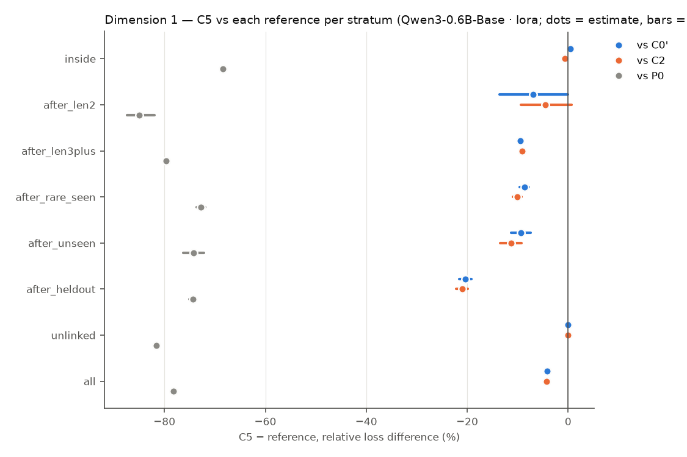
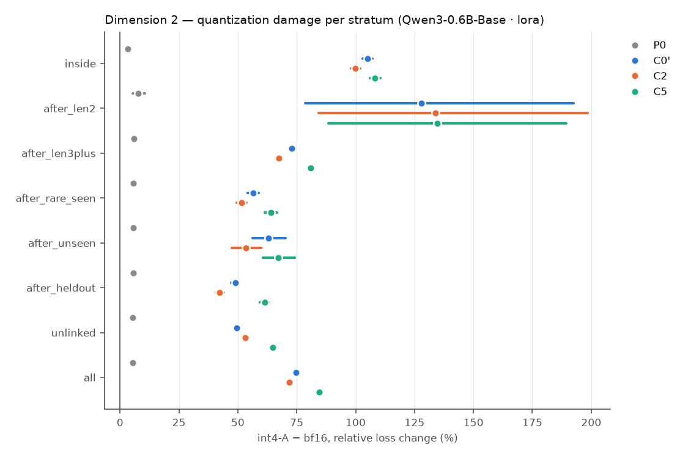
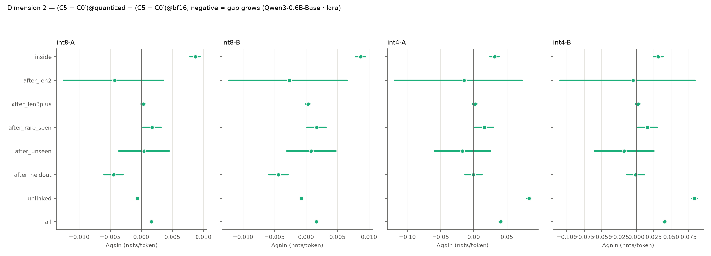
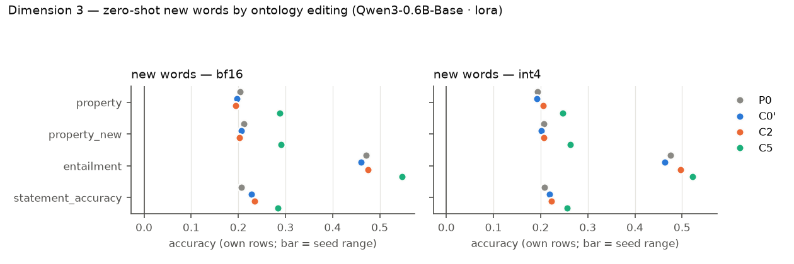
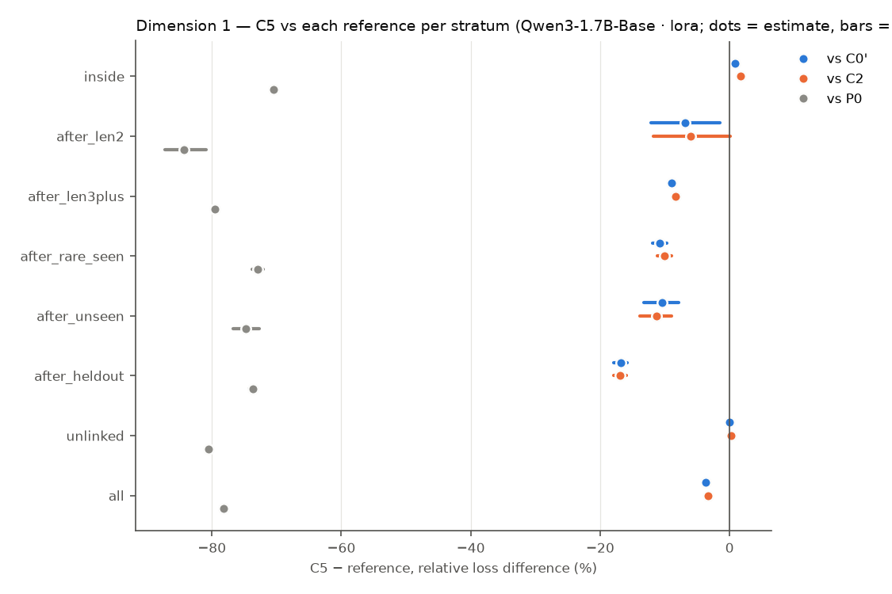
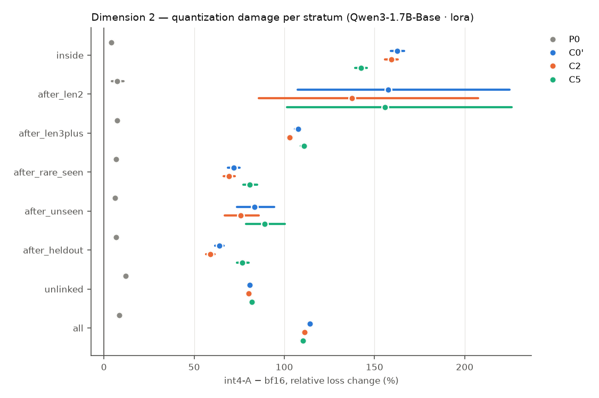
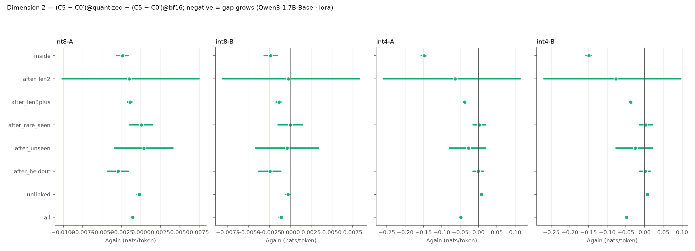
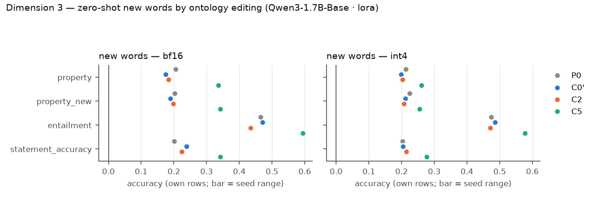

# R9 — retrofit × quantization (E9)

E9 asks three questions on pretrained hosts, all on one fixed test set: (1) does a VSA ontology channel trained jointly with the host improve it on long-token, rare and out-of-distribution words; (2) is the gap larger under weight quantization; (3) after training, can the model learn new or changed words zero-shot by editing the ontology alone? Models: **P0** the original host (evaluation only), **C0′** continued training without the channel, **C2** the same with a capacity-matched free per-concept table, **C5** the same with the attentive VSA channel. Loss differences are condition − reference (negative = lower loss), token-weighted and pooled over common seeds, with 95% cluster bootstraps over evaluation windows (10000 resamples); `*` = Holm-adjusted p < 0.05 within the family named in each table. P0 has no training randomness and pairs with every seed.

## Qwen3-0.6B-Base · lora

Seeds: P0 [1]; C0' [1]; C2 [1]; C5 [1].

### Dimension 1 — C5 vs C0′, C2 and P0 (bf16)

> single seed: CIs cover evaluation windows or items only, not seed variance.

Relative loss difference [95% CI] (Holm over the three references within each stratum):

| Stratum | Targets | C5 − C0′ | C5 − C2 | C5 − P0 | C2 − C0′ | C0′ − P0 |
|---|---:|---|---|---|---|---|
| inside (long-token words) | 295422 | +0.45% [+0.15, +0.75]* | -0.70% [-0.96, -0.45]* | -68.47% [-68.95, -67.99]* | +1.16% [+0.90, +1.43] | -68.61% [-69.08, -68.14] |
| after_len2 (long-token words) | 444 | -6.92% [-13.57, +0.00] | -4.56% [-9.40, +0.65] | -84.95% [-87.43, -81.94]* | -2.48% [-5.49, +0.93] | -83.84% [-86.47, -80.72] |
| after_len3plus (long-token words) | 510793 | -9.47% [-9.78, -9.15]* | -9.07% [-9.37, -8.78]* | -79.61% [-79.85, -79.37]* | -0.43% [-0.61, -0.25] | -77.48% [-77.72, -77.23] |
| after_rare_seen (rare words) | 37756 | -8.67% [-9.54, -7.84]* | -10.06% [-10.96, -9.19]* | -72.72% [-73.59, -71.88]* | +1.54% [+0.96, +2.13] | -70.13% [-70.95, -69.31] |
| after_unseen (out of distribution) | 5271 | -9.35% [-11.32, -7.45]* | -11.26% [-13.42, -9.23]* | -74.27% [-76.26, -72.21]* | +2.15% [+0.96, +3.39] | -71.62% [-73.58, -69.62] |
| after_heldout (out of distribution) | 53785 | -20.35% [-21.55, -19.19]* | -21.02% [-22.19, -19.88]* | -74.37% [-75.01, -73.72]* | +0.84% [+0.35, +1.32] | -67.82% [-68.48, -67.16] |
| unlinked (locality) | 359519 | +0.01% [-0.07, +0.09] | -0.00% [-0.08, +0.07] | -81.56% [-81.68, -81.44]* | +0.02% [-0.05, +0.08] | -81.56% [-81.68, -81.44] |
| all (locality) | 1047552 | -4.13% [-4.29, -3.96]* | -4.33% [-4.48, -4.18]* | -78.26% [-78.45, -78.06]* | +0.21% [+0.09, +0.33] | -77.32% [-77.52, -77.12] |

Absolute differences (nats/token):

| Stratum | C5 − C0′ | C5 − C2 | C5 − P0 |
|---|---|---|---|
| inside | +0.0040 [+0.0013, +0.0066]* | -0.0063 [-0.0086, -0.0040]* | -1.9356 [-1.9545, -1.9167]* |
| after_len2 | -0.0362 [-0.0766, +0.0000] | -0.0233 [-0.0511, +0.0033] | -2.7496 [-3.1618, -2.3367]* |
| after_len3plus | -0.0565 [-0.0585, -0.0546]* | -0.0540 [-0.0559, -0.0521]* | -2.1112 [-2.1221, -2.1001]* |
| after_rare_seen | -0.0735 [-0.0806, -0.0664]* | -0.0865 [-0.0941, -0.0790]* | -2.0625 [-2.1088, -2.0150]* |
| after_unseen | -0.0768 [-0.0921, -0.0617]* | -0.0945 [-0.1122, -0.0776]* | -2.1504 [-2.2791, -2.0221]* |
| after_heldout | -0.1846 [-0.1960, -0.1738]* | -0.1922 [-0.2035, -0.1815]* | -2.0964 [-2.1340, -2.0584]* |
| unlinked | +0.0001 [-0.0004, +0.0005] | -0.0000 [-0.0005, +0.0004] | -2.4257 [-2.4379, -2.4135]* |
| all | -0.0268 [-0.0279, -0.0257]* | -0.0282 [-0.0292, -0.0271]* | -2.2384 [-2.2472, -2.2294]* |

Probe differences (bf16): C5 − reference per subset, per seed (paired bootstrap over items):

| Reference | Seed | Probe | all | heldout | seen | unlinked |
|---|---:|---|---|---|---|---|
| C0' | 1 | lambada/accuracy | -0.003 [-0.008, +0.002] (n 5153) | — | — | -0.003 [-0.008, +0.002] (n 5153) |
| C0' | 1 | wic/probe_accuracy | +0.011 [-0.011, +0.033] (n 638) | — | — | +0.011 [-0.011, +0.033] (n 638) |
| C0' | 1 | card660/spearman_tied | +0.001 [-0.008, +0.010] (n 660) | — | — | +0.001 [-0.008, +0.010] (n 660) |
| C0' | 1 | rare_words/spearman_tied | +0.002 [-0.002, +0.006] (n 2034) | — | — | +0.002 [-0.002, +0.006] (n 2034) |
| C0' | 1 | wsd/probe_f1 | -0.002 [-0.005, +0.001] (n 7253) | — | — | -0.002 [-0.005, +0.001] (n 7253) |
| C0' | 1 | bless/pair_probe_macro_f1 | +0.003 [-0.001, +0.007] (n 4310) | — | — | +0.003 [-0.001, +0.007] (n 4310) |
| C0' | 1 | bless/prompt_auc | +0.003 [+0.002, +0.004] (n 14547) | — | — | +0.003 [+0.002, +0.004] (n 14547) |
| C0' | 1 | hyperlex/cosine_spearman | +0.004 [+0.001, +0.008] (n 2616) | — | — | +0.004 [+0.001, +0.008] (n 2616) |
| C2 | 1 | lambada/accuracy | -0.003 [-0.008, +0.002] (n 5153) | — | — | -0.003 [-0.008, +0.002] (n 5153) |
| C2 | 1 | wic/probe_accuracy | +0.005 [-0.017, +0.025] (n 638) | — | — | +0.005 [-0.017, +0.025] (n 638) |
| C2 | 1 | card660/spearman_tied | -0.000 [-0.009, +0.009] (n 660) | — | — | -0.000 [-0.009, +0.009] (n 660) |
| C2 | 1 | rare_words/spearman_tied | -0.000 [-0.004, +0.004] (n 2034) | — | — | -0.000 [-0.004, +0.004] (n 2034) |
| C2 | 1 | wsd/probe_f1 | -0.001 [-0.004, +0.001] (n 7253) | — | — | -0.001 [-0.004, +0.001] (n 7253) |
| C2 | 1 | bless/pair_probe_macro_f1 | -0.002 [-0.006, +0.003] (n 4310) | — | — | -0.002 [-0.006, +0.003] (n 4310) |
| C2 | 1 | bless/prompt_auc | -0.005 [-0.005, -0.004] (n 14547) | — | — | -0.005 [-0.005, -0.004] (n 14547) |
| C2 | 1 | hyperlex/cosine_spearman | +0.004 [-0.000, +0.007] (n 2616) | — | — | +0.004 [-0.000, +0.007] (n 2616) |
| P0 | 1 | lambada/accuracy | -0.005 [-0.012, +0.003] (n 5153) | — | — | -0.005 [-0.012, +0.003] (n 5153) |
| P0 | 1 | wic/probe_accuracy | +0.013 [-0.024, +0.045] (n 638) | — | — | +0.013 [-0.024, +0.045] (n 638) |
| P0 | 1 | card660/spearman_tied | -0.016 [-0.036, +0.006] (n 660) | — | — | -0.016 [-0.036, +0.006] (n 660) |
| P0 | 1 | rare_words/spearman_tied | -0.032 [-0.044, -0.020] (n 2034) | — | — | -0.032 [-0.044, -0.020] (n 2034) |
| P0 | 1 | wsd/probe_f1 | +0.002 [-0.003, +0.006] (n 7253) | — | — | +0.002 [-0.003, +0.006] (n 7253) |
| P0 | 1 | bless/pair_probe_macro_f1 | -0.006 [-0.013, +0.000] (n 4310) | — | — | -0.006 [-0.013, +0.000] (n 4310) |
| P0 | 1 | bless/prompt_auc | -0.069 [-0.074, -0.064] (n 14547) | — | — | -0.069 [-0.074, -0.064] (n 14547) |
| P0 | 1 | hyperlex/cosine_spearman | +0.003 [-0.009, +0.014] (n 2616) | — | — | +0.003 [-0.009, +0.014] (n 2616) |

### Dimension 2 — quantization damage and the gap under quantization

Quantization damage `variant − bf16`, relative [95% CI] (A = channel FP16, B = channel quantized; models without a channel have B = A):

| Stratum | Model | int8-A | int8-B | int4-A | int4-B |
|---|---|---|---|---|---|
| inside | P0 | +0.06% [+0.05, +0.08] | +0.06% [+0.05, +0.08] | +3.40% [+3.31, +3.49] | +3.40% [+3.31, +3.49] |
| inside | C0' | +0.49% [+0.42, +0.57] | +0.49% [+0.42, +0.57] | +105.15% [+103.10, +107.23] | +105.15% [+103.10, +107.23] |
| inside | C2 | +0.64% [+0.58, +0.71] | +0.65% [+0.58, +0.72] | +99.95% [+98.03, +101.96] | +99.99% [+98.07, +101.99] |
| inside | C5 | +1.47% [+1.40, +1.53] | +1.46% [+1.39, +1.53] | +108.23% [+106.07, +110.41] | +108.17% [+106.01, +110.36] |
| after_len2 | P0 | +0.09% [-0.10, +0.26] | +0.09% [-0.10, +0.26] | +7.75% [+5.26, +10.67] | +7.75% [+5.26, +10.67] |
| after_len2 | C0' | +0.09% [-1.22, +1.36] | +0.09% [-1.22, +1.36] | +127.86% [+78.56, +192.64] | +127.86% [+78.56, +192.64] |
| after_len2 | C2 | +0.00% [-1.13, +1.26] | -0.00% [-1.25, +1.41] | +133.99% [+84.42, +198.45] | +135.10% [+85.65, +199.06] |
| after_len2 | C5 | -0.78% [-1.92, +0.14] | -0.45% [-1.84, +0.80] | +134.65% [+88.57, +189.47] | +136.62% [+89.73, +192.37] |
| after_len3plus | P0 | +0.08% [+0.07, +0.09] | +0.08% [+0.07, +0.09] | +5.98% [+5.91, +6.05] | +5.98% [+5.91, +6.05] |
| after_len3plus | C0' | +0.46% [+0.42, +0.51] | +0.46% [+0.42, +0.51] | +72.95% [+71.91, +74.00] | +72.95% [+71.91, +74.00] |
| after_len3plus | C2 | +0.38% [+0.34, +0.42] | +0.37% [+0.33, +0.42] | +67.38% [+66.41, +68.36] | +67.42% [+66.45, +68.40] |
| after_len3plus | C5 | +0.57% [+0.53, +0.61] | +0.57% [+0.53, +0.62] | +80.91% [+79.77, +82.06] | +80.95% [+79.81, +82.11] |
| after_rare_seen | P0 | +0.07% [+0.05, +0.10] | +0.07% [+0.05, +0.10] | +5.72% [+5.44, +5.99] | +5.72% [+5.44, +5.99] |
| after_rare_seen | C0' | +0.43% [+0.31, +0.55] | +0.43% [+0.31, +0.55] | +56.52% [+54.27, +58.81] | +56.52% [+54.27, +58.81] |
| after_rare_seen | C2 | +0.29% [+0.16, +0.42] | +0.29% [+0.16, +0.41] | +51.59% [+49.50, +53.67] | +51.69% [+49.60, +53.79] |
| after_rare_seen | C5 | +0.69% [+0.56, +0.83] | +0.69% [+0.55, +0.83] | +63.94% [+61.33, +66.64] | +63.96% [+61.35, +66.65] |
| after_unseen | P0 | +0.06% [-0.02, +0.13] | +0.06% [-0.02, +0.13] | +5.62% [+4.90, +6.34] | +5.62% [+4.90, +6.34] |
| after_unseen | C0' | +0.38% [+0.05, +0.72] | +0.38% [+0.05, +0.72] | +62.88% [+56.34, +70.19] | +62.88% [+56.34, +70.19] |
| after_unseen | C2 | +0.42% [+0.08, +0.76] | +0.43% [+0.08, +0.79] | +53.46% [+47.32, +59.95] | +53.59% [+47.36, +60.15] |
| after_unseen | C5 | +0.47% [+0.06, +0.89] | +0.53% [+0.12, +0.95] | +67.05% [+60.75, +74.13] | +67.00% [+60.71, +74.03] |
| after_heldout | P0 | +0.00% [-0.02, +0.03] | +0.00% [-0.02, +0.03] | +5.74% [+5.51, +5.96] | +5.74% [+5.51, +5.96] |
| after_heldout | C0' | +0.98% [+0.83, +1.12] | +0.98% [+0.83, +1.12] | +48.92% [+47.23, +50.60] | +48.92% [+47.23, +50.60] |
| after_heldout | C2 | +0.60% [+0.49, +0.71] | +0.58% [+0.47, +0.70] | +42.35% [+40.59, +44.10] | +42.40% [+40.65, +44.17] |
| after_heldout | C5 | +0.61% [+0.50, +0.72] | +0.62% [+0.51, +0.73] | +61.35% [+59.32, +63.39] | +61.27% [+59.24, +63.32] |
| unlinked | P0 | +0.36% [+0.34, +0.38] | +0.36% [+0.34, +0.38] | +5.45% [+5.35, +5.54] | +5.45% [+5.35, +5.54] |
| unlinked | C0' | +1.34% [+1.25, +1.42] | +1.34% [+1.25, +1.42] | +49.62% [+48.93, +50.31] | +49.62% [+48.93, +50.31] |
| unlinked | C2 | +1.23% [+1.16, +1.31] | +1.22% [+1.15, +1.30] | +53.09% [+52.34, +53.83] | +53.11% [+52.37, +53.86] |
| unlinked | C5 | +1.22% [+1.15, +1.29] | +1.20% [+1.13, +1.27] | +64.83% [+64.00, +65.69] | +64.78% [+63.95, +65.64] |
| all | P0 | +0.19% [+0.18, +0.19] | +0.19% [+0.18, +0.19] | +5.36% [+5.32, +5.41] | +5.36% [+5.32, +5.41] |
| all | C0' | +0.73% [+0.70, +0.78] | +0.73% [+0.70, +0.78] | +74.78% [+73.90, +75.69] | +74.78% [+73.90, +75.69] |
| all | C2 | +0.71% [+0.67, +0.74] | +0.70% [+0.67, +0.73] | +71.78% [+70.95, +72.63] | +71.82% [+70.98, +72.67] |
| all | C5 | +1.03% [+1.00, +1.07] | +1.03% [+0.99, +1.06] | +84.52% [+83.55, +85.47] | +84.51% [+83.54, +85.47] |

Gap under quantization vs C0': gain = C5 − C0' at bf16 and quantized, `Δgain` = difference in differences (negative = the channel's advantage grows under quantization; Holm over references × variants within each stratum), retained = gain_q / gain_bf16:

| Stratum | Variant | gain bf16 | gain quantized | Δgain [95% CI] | retained |
|---|---|---|---|---|---|
| inside | int8-A | +0.0040 [+0.0013, +0.0066] | +0.0127 [+0.0099, +0.0155] | +0.0087 [+0.0079, +0.0095]* | 3.18 |
| inside | int8-B | +0.0040 [+0.0013, +0.0066] | +0.0127 [+0.0099, +0.0154] | +0.0087 [+0.0078, +0.0095]* | 3.18 |
| inside | int4-A | +0.0040 [+0.0013, +0.0066] | +0.0356 [+0.0290, +0.0423] | +0.0316 [+0.0247, +0.0385]* | 8.92 |
| inside | int4-B | +0.0040 [+0.0013, +0.0066] | +0.0351 [+0.0285, +0.0419] | +0.0311 [+0.0243, +0.0380]* | 8.80 |
| after_len2 | int8-A | -0.0372 [-0.0773, -0.0014] | -0.0415 [-0.0805, -0.0046] | -0.0043 [-0.0125, +0.0036] | 1.12 |
| after_len2 | int8-B | -0.0372 [-0.0773, -0.0014] | -0.0399 [-0.0787, -0.0028] | -0.0027 [-0.0123, +0.0065] | 1.07 |
| after_len2 | int4-A | -0.0372 [-0.0773, -0.0014] | -0.0518 [-0.1522, +0.0346] | -0.0146 [-0.1197, +0.0734] | 1.39 |
| after_len2 | int4-B | -0.0372 [-0.0773, -0.0014] | -0.0422 [-0.1426, +0.0471] | -0.0050 [-0.1099, +0.0838] | 1.14 |
| after_len3plus | int8-A | -0.0565 [-0.0585, -0.0546] | -0.0562 [-0.0583, -0.0542] | +0.0003 [-0.0000, +0.0007] | 0.99 |
| after_len3plus | int8-B | -0.0565 [-0.0585, -0.0546] | -0.0562 [-0.0583, -0.0542] | +0.0003 [-0.0000, +0.0007] | 0.99 |
| after_len3plus | int4-A | -0.0565 [-0.0585, -0.0546] | -0.0548 [-0.0586, -0.0509] | +0.0018 [-0.0019, +0.0055] | 0.97 |
| after_len3plus | int4-B | -0.0565 [-0.0585, -0.0546] | -0.0545 [-0.0584, -0.0507] | +0.0020 [-0.0017, +0.0057] | 0.96 |
| after_rare_seen | int8-A | -0.0734 [-0.0806, -0.0663] | -0.0717 [-0.0791, -0.0643] | +0.0017 [+0.0003, +0.0032] | 0.98 |
| after_rare_seen | int8-B | -0.0734 [-0.0806, -0.0663] | -0.0717 [-0.0792, -0.0644] | +0.0017 [+0.0002, +0.0032] | 0.98 |
| after_rare_seen | int4-A | -0.0734 [-0.0806, -0.0663] | -0.0574 [-0.0725, -0.0421] | +0.0159 [+0.0016, +0.0302] | 0.78 |
| after_rare_seen | int4-B | -0.0734 [-0.0806, -0.0663] | -0.0573 [-0.0723, -0.0421] | +0.0161 [+0.0019, +0.0301] | 0.78 |
| after_unseen | int8-A | -0.0767 [-0.0919, -0.0616] | -0.0762 [-0.0922, -0.0609] | +0.0004 [-0.0036, +0.0045] | 0.99 |
| after_unseen | int8-B | -0.0767 [-0.0919, -0.0616] | -0.0758 [-0.0921, -0.0602] | +0.0008 [-0.0031, +0.0048] | 0.99 |
| after_unseen | int4-A | -0.0767 [-0.0919, -0.0616] | -0.0937 [-0.1395, -0.0478] | -0.0171 [-0.0598, +0.0261] | 1.22 |
| after_unseen | int4-B | -0.0767 [-0.0919, -0.0616] | -0.0941 [-0.1396, -0.0487] | -0.0174 [-0.0600, +0.0253] | 1.23 |
| after_heldout | int8-A | -0.1846 [-0.1959, -0.1738] | -0.1890 [-0.2008, -0.1778] | -0.0044 [-0.0060, -0.0029]* | 1.02 |
| after_heldout | int8-B | -0.1846 [-0.1959, -0.1738] | -0.1890 [-0.2008, -0.1777] | -0.0044 [-0.0059, -0.0028]* | 1.02 |
| after_heldout | int4-A | -0.1846 [-0.1959, -0.1738] | -0.1851 [-0.2012, -0.1698] | -0.0005 [-0.0129, +0.0124] | 1.00 |
| after_heldout | int4-B | -0.1846 [-0.1959, -0.1738] | -0.1856 [-0.2017, -0.1704] | -0.0010 [-0.0136, +0.0117] | 1.01 |
| unlinked | int8-A | +0.0001 [-0.0004, +0.0005] | -0.0006 [-0.0011, -0.0001] | -0.0007 [-0.0009, -0.0004]* | -9.91 |
| unlinked | int8-B | +0.0001 [-0.0004, +0.0005] | -0.0007 [-0.0012, -0.0002] | -0.0008 [-0.0010, -0.0005]* | -11.68 |
| unlinked | int4-A | +0.0001 [-0.0004, +0.0005] | +0.0835 [+0.0800, +0.0869] | +0.0835 [+0.0800, +0.0869]* | 1380.08 |
| unlinked | int4-B | +0.0001 [-0.0004, +0.0005] | +0.0833 [+0.0798, +0.0867] | +0.0832 [+0.0798, +0.0866]* | 1375.97 |
| all | int8-A | -0.0268 [-0.0279, -0.0257] | -0.0251 [-0.0263, -0.0239] | +0.0017 [+0.0014, +0.0019]* | 0.94 |
| all | int8-B | -0.0268 [-0.0279, -0.0257] | -0.0252 [-0.0263, -0.0240] | +0.0016 [+0.0013, +0.0019]* | 0.94 |
| all | int4-A | -0.0268 [-0.0279, -0.0257] | +0.0138 [+0.0110, +0.0164] | +0.0406 [+0.0378, +0.0432]* | -0.51 |
| all | int4-B | -0.0268 [-0.0279, -0.0257] | +0.0137 [+0.0110, +0.0164] | +0.0405 [+0.0378, +0.0431]* | -0.51 |

Gap under quantization vs C2: gain = C5 − C2 at bf16 and quantized, `Δgain` = difference in differences (negative = the channel's advantage grows under quantization; Holm over references × variants within each stratum), retained = gain_q / gain_bf16:

| Stratum | Variant | gain bf16 | gain quantized | Δgain [95% CI] | retained |
|---|---|---|---|---|---|
| inside | int8-A | -0.0063 [-0.0086, -0.0040] | +0.0010 [-0.0015, +0.0034] | +0.0073 [+0.0065, +0.0081]* | -0.15 |
| inside | int8-B | -0.0063 [-0.0086, -0.0040] | +0.0009 [-0.0015, +0.0034] | +0.0072 [+0.0064, +0.0080]* | -0.15 |
| inside | int4-A | -0.0063 [-0.0086, -0.0040] | +0.0611 [+0.0545, +0.0678] | +0.0674 [+0.0606, +0.0742]* | -9.67 |
| inside | int4-B | -0.0063 [-0.0086, -0.0040] | +0.0603 [+0.0537, +0.0671] | +0.0666 [+0.0599, +0.0734]* | -9.55 |
| after_len2 | int8-A | -0.0243 [-0.0518, +0.0022] | -0.0281 [-0.0553, -0.0017] | -0.0038 [-0.0135, +0.0044] | 1.16 |
| after_len2 | int8-B | -0.0243 [-0.0518, +0.0022] | -0.0264 [-0.0557, +0.0005] | -0.0022 [-0.0143, +0.0081] | 1.09 |
| after_len2 | int4-A | -0.0243 [-0.0518, +0.0022] | -0.0535 [-0.2065, +0.0711] | -0.0293 [-0.1884, +0.1004] | 2.21 |
| after_len2 | int4-B | -0.0243 [-0.0518, +0.0022] | -0.0497 [-0.2050, +0.0806] | -0.0254 [-0.1891, +0.1095] | 2.05 |
| after_len3plus | int8-A | -0.0539 [-0.0559, -0.0521] | -0.0531 [-0.0551, -0.0512] | +0.0008 [+0.0005, +0.0011]* | 0.99 |
| after_len3plus | int8-B | -0.0539 [-0.0559, -0.0521] | -0.0531 [-0.0551, -0.0512] | +0.0009 [+0.0005, +0.0012]* | 0.98 |
| after_len3plus | int4-A | -0.0539 [-0.0559, -0.0521] | -0.0171 [-0.0211, -0.0133] | +0.0368 [+0.0332, +0.0404]* | 0.32 |
| after_len3plus | int4-B | -0.0539 [-0.0559, -0.0521] | -0.0171 [-0.0211, -0.0133] | +0.0368 [+0.0332, +0.0404]* | 0.32 |
| after_rare_seen | int8-A | -0.0865 [-0.0941, -0.0789] | -0.0836 [-0.0914, -0.0760] | +0.0028 [+0.0012, +0.0044]* | 0.97 |
| after_rare_seen | int8-B | -0.0865 [-0.0941, -0.0789] | -0.0836 [-0.0914, -0.0760] | +0.0028 [+0.0012, +0.0045]* | 0.97 |
| after_rare_seen | int4-A | -0.0865 [-0.0941, -0.0789] | -0.0355 [-0.0511, -0.0197] | +0.0510 [+0.0363, +0.0657]* | 0.41 |
| after_rare_seen | int4-B | -0.0865 [-0.0941, -0.0789] | -0.0362 [-0.0519, -0.0206] | +0.0502 [+0.0355, +0.0649]* | 0.42 |
| after_unseen | int8-A | -0.0944 [-0.1119, -0.0775] | -0.0944 [-0.1131, -0.0764] | +0.0000 [-0.0043, +0.0044] | 1.00 |
| after_unseen | int8-B | -0.0944 [-0.1119, -0.0775] | -0.0941 [-0.1129, -0.0760] | +0.0003 [-0.0040, +0.0047] | 1.00 |
| after_unseen | int4-A | -0.0944 [-0.1119, -0.0775] | -0.0435 [-0.0834, -0.0028] | +0.0508 [+0.0117, +0.0912] | 0.46 |
| after_unseen | int4-B | -0.0944 [-0.1119, -0.0775] | -0.0450 [-0.0851, -0.0040] | +0.0494 [+0.0094, +0.0903] | 0.48 |
| after_heldout | int8-A | -0.1922 [-0.2034, -0.1816] | -0.1933 [-0.2047, -0.1825] | -0.0011 [-0.0023, +0.0001] | 1.01 |
| after_heldout | int8-B | -0.1922 [-0.2034, -0.1816] | -0.1931 [-0.2046, -0.1822] | -0.0009 [-0.0021, +0.0004] | 1.00 |
| after_heldout | int4-A | -0.1922 [-0.2034, -0.1816] | -0.1364 [-0.1504, -0.1230] | +0.0558 [+0.0431, +0.0684]* | 0.71 |
| after_heldout | int4-B | -0.1922 [-0.2034, -0.1816] | -0.1375 [-0.1516, -0.1239] | +0.0548 [+0.0420, +0.0675]* | 0.72 |
| unlinked | int8-A | -0.0000 [-0.0005, +0.0004] | -0.0001 [-0.0006, +0.0004] | -0.0001 [-0.0003, +0.0001] | 4.12 |
| unlinked | int8-B | -0.0000 [-0.0005, +0.0004] | -0.0002 [-0.0007, +0.0003] | -0.0002 [-0.0004, +0.0001] | 5.84 |
| unlinked | int4-A | -0.0000 [-0.0005, +0.0004] | +0.0644 [+0.0612, +0.0676] | +0.0644 [+0.0612, +0.0676]* | -2057.31 |
| unlinked | int4-B | -0.0000 [-0.0005, +0.0004] | +0.0640 [+0.0608, +0.0672] | +0.0640 [+0.0609, +0.0673]* | -2045.88 |
| all | int8-A | -0.0282 [-0.0292, -0.0271] | -0.0263 [-0.0274, -0.0253] | +0.0018 [+0.0016, +0.0021]* | 0.93 |
| all | int8-B | -0.0282 [-0.0292, -0.0271] | -0.0263 [-0.0274, -0.0253] | +0.0018 [+0.0016, +0.0021]* | 0.93 |
| all | int4-A | -0.0282 [-0.0292, -0.0271] | +0.0309 [+0.0282, +0.0335] | +0.0590 [+0.0563, +0.0616]* | -1.10 |
| all | int4-B | -0.0282 [-0.0292, -0.0271] | +0.0306 [+0.0279, +0.0333] | +0.0587 [+0.0561, +0.0613]* | -1.09 |

Gap under quantization vs P0: gain = C5 − P0 at bf16 and quantized, `Δgain` = difference in differences (negative = the channel's advantage grows under quantization; Holm over references × variants within each stratum), retained = gain_q / gain_bf16:

| Stratum | Variant | gain bf16 | gain quantized | Δgain [95% CI] | retained |
|---|---|---|---|---|---|
| inside | int8-A | -1.9356 [-1.9545, -1.9167] | -1.9244 [-1.9433, -1.9054] | +0.0112 [+0.0105, +0.0119]* | 0.99 |
| inside | int8-B | -1.9356 [-1.9545, -1.9167] | -1.9244 [-1.9433, -1.9055] | +0.0112 [+0.0105, +0.0119]* | 0.99 |
| inside | int4-A | -1.9356 [-1.9545, -1.9167] | -1.0673 [-1.0827, -1.0520] | +0.8683 [+0.8563, +0.8803]* | 0.55 |
| inside | int4-B | -1.9356 [-1.9545, -1.9167] | -1.0677 [-1.0832, -1.0524] | +0.8679 [+0.8558, +0.8798]* | 0.55 |
| after_len2 | int8-A | -2.7506 [-3.1634, -2.3383] | -2.7572 [-3.1716, -2.3425] | -0.0066 [-0.0147, +0.0012] | 1.00 |
| after_len2 | int8-B | -2.7506 [-3.1634, -2.3383] | -2.7556 [-3.1708, -2.3408] | -0.0049 [-0.0143, +0.0039] | 1.00 |
| after_len2 | int4-A | -2.7506 [-3.1634, -2.3383] | -2.3472 [-2.7648, -1.9045] | +0.4034 [+0.1416, +0.6942]* | 0.85 |
| after_len2 | int4-B | -2.7506 [-3.1634, -2.3383] | -2.3377 [-2.7539, -1.8956] | +0.4130 [+0.1480, +0.7079]* | 0.85 |
| after_len3plus | int8-A | -2.1112 [-2.1221, -2.1001] | -2.1102 [-2.1210, -2.0990] | +0.0010 [+0.0007, +0.0014]* | 1.00 |
| after_len3plus | int8-B | -2.1112 [-2.1221, -2.1001] | -2.1101 [-2.1210, -2.0990] | +0.0011 [+0.0007, +0.0014]* | 1.00 |
| after_len3plus | int4-A | -2.1112 [-2.1221, -2.1001] | -1.8322 [-1.8424, -1.8218] | +0.2790 [+0.2735, +0.2844]* | 0.87 |
| after_len3plus | int4-B | -2.1112 [-2.1221, -2.1001] | -1.8320 [-1.8422, -1.8216] | +0.2792 [+0.2738, +0.2846]* | 0.87 |
| after_rare_seen | int8-A | -2.0625 [-2.1087, -2.0150] | -2.0592 [-2.1056, -2.0118] | +0.0033 [+0.0020, +0.0046]* | 1.00 |
| after_rare_seen | int8-B | -2.0625 [-2.1087, -2.0150] | -2.0592 [-2.1056, -2.0118] | +0.0033 [+0.0019, +0.0046]* | 1.00 |
| after_rare_seen | int4-A | -2.0625 [-2.1087, -2.0150] | -1.7298 [-1.7712, -1.6874] | +0.3326 [+0.3118, +0.3536]* | 0.84 |
| after_rare_seen | int4-B | -2.0625 [-2.1087, -2.0150] | -1.7297 [-1.7711, -1.6871] | +0.3328 [+0.3119, +0.3539]* | 0.84 |
| after_unseen | int8-A | -2.1502 [-2.2789, -2.0219] | -2.1483 [-2.2774, -2.0201] | +0.0019 [-0.0017, +0.0055] | 1.00 |
| after_unseen | int8-B | -2.1502 [-2.2789, -2.0219] | -2.1479 [-2.2772, -2.0197] | +0.0023 [-0.0013, +0.0059] | 1.00 |
| after_unseen | int4-A | -2.1502 [-2.2789, -2.0219] | -1.8134 [-1.9307, -1.6918] | +0.3368 [+0.2804, +0.3966]* | 0.84 |
| after_unseen | int4-B | -2.1502 [-2.2789, -2.0219] | -1.8138 [-1.9315, -1.6917] | +0.3364 [+0.2802, +0.3965]* | 0.84 |
| after_heldout | int8-A | -2.0964 [-2.1340, -2.0584] | -2.0921 [-2.1297, -2.0542] | +0.0043 [+0.0033, +0.0053]* | 1.00 |
| after_heldout | int8-B | -2.0964 [-2.1340, -2.0584] | -2.0921 [-2.1298, -2.0541] | +0.0043 [+0.0033, +0.0054]* | 1.00 |
| after_heldout | int4-A | -2.0964 [-2.1340, -2.0584] | -1.8150 [-1.8505, -1.7802] | +0.2814 [+0.2669, +0.2962]* | 0.87 |
| after_heldout | int4-B | -2.0964 [-2.1340, -2.0584] | -1.8155 [-1.8510, -1.7809] | +0.2809 [+0.2664, +0.2956]* | 0.87 |
| unlinked | int8-A | -2.4257 [-2.4380, -2.4136] | -2.4296 [-2.4419, -2.4175] | -0.0040 [-0.0045, -0.0035]* | 1.00 |
| unlinked | int8-B | -2.4257 [-2.4380, -2.4136] | -2.4298 [-2.4420, -2.4176] | -0.0041 [-0.0046, -0.0036]* | 1.00 |
| unlinked | int4-A | -2.4257 [-2.4380, -2.4136] | -2.2321 [-2.2444, -2.2198] | +0.1936 [+0.1894, +0.1978]* | 0.92 |
| unlinked | int4-B | -2.4257 [-2.4380, -2.4136] | -2.2323 [-2.2445, -2.2201] | +0.1934 [+0.1892, +0.1976]* | 0.92 |
| all | int8-A | -2.2384 [-2.2472, -2.2294] | -2.2373 [-2.2461, -2.2283] | +0.0011 [+0.0008, +0.0014]* | 1.00 |
| all | int8-B | -2.2384 [-2.2472, -2.2294] | -2.2373 [-2.2461, -2.2283] | +0.0011 [+0.0008, +0.0014]* | 1.00 |
| all | int4-A | -2.2384 [-2.2472, -2.2294] | -1.8662 [-1.8744, -1.8578] | +0.3722 [+0.3676, +0.3770]* | 0.83 |
| all | int4-B | -2.2384 [-2.2472, -2.2294] | -1.8662 [-1.8744, -1.8579] | +0.3722 [+0.3675, +0.3770]* | 0.83 |

> Single seed in at least one model: CIs cover evaluation windows only.

Probe damage int4 − bf16 per model (paired over items; all items / held-out / seen):

| Model | Seed | Probe | all | heldout | seen |
|---|---:|---|---|---|---|
| P0 | 1 | lambada/accuracy | -0.075 [-0.086, -0.063] | — | — |
| P0 | 1 | wic/probe_accuracy | +0.014 [-0.027, +0.053] | — | — |
| P0 | 1 | card660/spearman_tied | -0.052 [-0.088, -0.016] | — | — |
| P0 | 1 | rare_words/spearman_tied | +0.007 [-0.013, +0.026] | — | — |
| P0 | 1 | bless/pair_probe_macro_f1 | -0.027 [-0.037, -0.017] | — | — |
| P0 | 1 | bless/prompt_auc | -0.013 [-0.018, -0.008] | — | — |
| P0 | 1 | hyperlex/cosine_spearman | -0.030 [-0.046, -0.014] | — | — |
| C0' | 1 | lambada/accuracy | -0.091 [-0.103, -0.080] | — | — |
| C0' | 1 | wic/probe_accuracy | +0.044 [+0.005, +0.083] | — | — |
| C0' | 1 | card660/spearman_tied | -0.008 [-0.041, +0.024] | — | — |
| C0' | 1 | rare_words/spearman_tied | +0.015 [-0.003, +0.034] | — | — |
| C0' | 1 | bless/pair_probe_macro_f1 | -0.015 [-0.024, -0.005] | — | — |
| C0' | 1 | bless/prompt_auc | +0.045 [+0.039, +0.051] | — | — |
| C0' | 1 | hyperlex/cosine_spearman | +0.006 [-0.009, +0.021] | — | — |
| C2 | 1 | lambada/accuracy | -0.099 [-0.111, -0.087] | — | — |
| C2 | 1 | wic/probe_accuracy | +0.025 [-0.016, +0.066] | — | — |
| C2 | 1 | card660/spearman_tied | -0.025 [-0.057, +0.009] | — | — |
| C2 | 1 | rare_words/spearman_tied | +0.003 [-0.015, +0.021] | — | — |
| C2 | 1 | bless/pair_probe_macro_f1 | -0.032 [-0.041, -0.021] | — | — |
| C2 | 1 | bless/prompt_auc | +0.005 [+0.001, +0.011] | — | — |
| C2 | 1 | hyperlex/cosine_spearman | -0.018 [-0.033, -0.003] | — | — |
| C5 | 1 | lambada/accuracy | -0.098 [-0.109, -0.086] | — | — |
| C5 | 1 | wic/probe_accuracy | +0.019 [-0.022, +0.058] | — | — |
| C5 | 1 | card660/spearman_tied | -0.041 [-0.076, -0.005] | — | — |
| C5 | 1 | rare_words/spearman_tied | -0.006 [-0.026, +0.013] | — | — |
| C5 | 1 | bless/pair_probe_macro_f1 | -0.018 [-0.028, -0.008] | — | — |
| C5 | 1 | bless/prompt_auc | +0.010 [+0.004, +0.016] | — | — |
| C5 | 1 | hyperlex/cosine_spearman | +0.005 [-0.010, +0.020] | — | — |

Probe differences at int4 (variant A): C5 − reference per subset, per seed (paired bootstrap over items):

| Reference | Seed | Probe | all | heldout | seen | unlinked |
|---|---:|---|---|---|---|---|
| C0' | 1 | lambada/accuracy | -0.010 [-0.020, +0.001] (n 5153) | — | — | -0.010 [-0.020, +0.001] (n 5153) |
| C0' | 1 | wic/probe_accuracy | -0.014 [-0.050, +0.022] (n 638) | — | — | -0.014 [-0.050, +0.022] (n 638) |
| C0' | 1 | card660/spearman_tied | -0.032 [-0.062, -0.002] (n 660) | — | — | -0.032 [-0.062, -0.002] (n 660) |
| C0' | 1 | rare_words/spearman_tied | -0.019 [-0.035, -0.005] (n 2034) | — | — | -0.019 [-0.035, -0.005] (n 2034) |
| C0' | 1 | bless/pair_probe_macro_f1 | -0.001 [-0.010, +0.010] (n 4310) | — | — | -0.001 [-0.010, +0.010] (n 4310) |
| C0' | 1 | bless/prompt_auc | -0.032 [-0.037, -0.028] (n 14547) | — | — | -0.032 [-0.037, -0.028] (n 14547) |
| C0' | 1 | hyperlex/cosine_spearman | +0.002 [-0.010, +0.016] (n 2616) | — | — | +0.002 [-0.010, +0.016] (n 2616) |
| C2 | 1 | lambada/accuracy | -0.002 [-0.012, +0.009] (n 5153) | — | — | -0.002 [-0.012, +0.009] (n 5153) |
| C2 | 1 | wic/probe_accuracy | -0.002 [-0.041, +0.036] (n 638) | — | — | -0.002 [-0.041, +0.036] (n 638) |
| C2 | 1 | card660/spearman_tied | -0.017 [-0.047, +0.013] (n 660) | — | — | -0.017 [-0.047, +0.013] (n 660) |
| C2 | 1 | rare_words/spearman_tied | -0.009 [-0.025, +0.007] (n 2034) | — | — | -0.009 [-0.025, +0.007] (n 2034) |
| C2 | 1 | bless/pair_probe_macro_f1 | +0.012 [+0.002, +0.021] (n 4310) | — | — | +0.012 [+0.002, +0.021] (n 4310) |
| C2 | 1 | bless/prompt_auc | -0.000 [-0.004, +0.003] (n 14547) | — | — | -0.000 [-0.004, +0.003] (n 14547) |
| C2 | 1 | hyperlex/cosine_spearman | +0.026 [+0.013, +0.040] (n 2616) | — | — | +0.026 [+0.013, +0.040] (n 2616) |
| P0 | 1 | lambada/accuracy | -0.028 [-0.037, -0.018] (n 5153) | — | — | -0.028 [-0.037, -0.018] (n 5153) |
| P0 | 1 | wic/probe_accuracy | +0.017 [-0.028, +0.058] (n 638) | — | — | +0.017 [-0.028, +0.058] (n 638) |
| P0 | 1 | card660/spearman_tied | -0.005 [-0.041, +0.033] (n 660) | — | — | -0.005 [-0.041, +0.033] (n 660) |
| P0 | 1 | rare_words/spearman_tied | -0.045 [-0.066, -0.025] (n 2034) | — | — | -0.045 [-0.066, -0.025] (n 2034) |
| P0 | 1 | bless/pair_probe_macro_f1 | +0.003 [-0.008, +0.014] (n 4310) | — | — | +0.003 [-0.008, +0.014] (n 4310) |
| P0 | 1 | bless/prompt_auc | -0.047 [-0.052, -0.041] (n 14547) | — | — | -0.047 [-0.052, -0.041] (n 14547) |
| P0 | 1 | hyperlex/cosine_spearman | +0.038 [+0.020, +0.055] (n 2616) | — | — | +0.038 [+0.020, +0.055] (n 2616) |

### General text (the track's `eval-general`: locality and general-text quantization damage)

C5 − reference at bf16 (locality, nats/token; positive = worse on general text) and its change under quantization (Δgain; negative = the gap grows; Holm over references × variants):

| Stratum | Reference | Variant | gain bf16 [95% CI] | Δgain [95% CI] |
|---|---|---|---|---|
| all | C0' | int8-A | +0.0000 [-0.0002, +0.0003] | -0.0009 [-0.0011, -0.0006]* |
| unlinked | C0' | int8-A | +0.0000 [-0.0002, +0.0003] | -0.0009 [-0.0011, -0.0006]* |
| all | C0' | int8-B | +0.0000 [-0.0002, +0.0003] | -0.0009 [-0.0011, -0.0006]* |
| unlinked | C0' | int8-B | +0.0000 [-0.0002, +0.0003] | -0.0009 [-0.0011, -0.0006]* |
| all | C0' | int4-A | +0.0000 [-0.0002, +0.0003] | -0.0156 [-0.0170, -0.0142]* |
| unlinked | C0' | int4-A | +0.0000 [-0.0002, +0.0003] | -0.0156 [-0.0170, -0.0142]* |
| all | C0' | int4-B | +0.0000 [-0.0002, +0.0003] | -0.0156 [-0.0170, -0.0142]* |
| unlinked | C0' | int4-B | +0.0000 [-0.0002, +0.0003] | -0.0156 [-0.0170, -0.0142]* |
| all | C2 | int8-A | -0.0000 [-0.0003, +0.0002] | -0.0003 [-0.0006, -0.0001] |
| unlinked | C2 | int8-A | -0.0000 [-0.0003, +0.0002] | -0.0003 [-0.0006, -0.0001] |
| all | C2 | int8-B | -0.0000 [-0.0003, +0.0002] | -0.0003 [-0.0006, -0.0001] |
| unlinked | C2 | int8-B | -0.0000 [-0.0003, +0.0002] | -0.0003 [-0.0006, -0.0001] |
| all | C2 | int4-A | -0.0000 [-0.0003, +0.0002] | +0.0057 [+0.0044, +0.0072]* |
| unlinked | C2 | int4-A | -0.0000 [-0.0003, +0.0002] | +0.0057 [+0.0044, +0.0072]* |
| all | C2 | int4-B | -0.0000 [-0.0003, +0.0002] | +0.0057 [+0.0044, +0.0072]* |
| unlinked | C2 | int4-B | -0.0000 [-0.0003, +0.0002] | +0.0057 [+0.0044, +0.0072]* |
| all | P0 | int8-A | -0.0106 [-0.0116, -0.0095] | -0.0017 [-0.0020, -0.0014]* |
| unlinked | P0 | int8-A | -0.0106 [-0.0116, -0.0095] | -0.0017 [-0.0020, -0.0014]* |
| all | P0 | int8-B | -0.0106 [-0.0116, -0.0095] | -0.0017 [-0.0020, -0.0014]* |
| unlinked | P0 | int8-B | -0.0106 [-0.0116, -0.0095] | -0.0017 [-0.0020, -0.0014]* |
| all | P0 | int4-A | -0.0106 [-0.0116, -0.0095] | -0.0013 [-0.0029, +0.0002] |
| unlinked | P0 | int4-A | -0.0106 [-0.0116, -0.0095] | -0.0013 [-0.0029, +0.0002] |
| all | P0 | int4-B | -0.0106 [-0.0116, -0.0095] | -0.0013 [-0.0029, +0.0002] |
| unlinked | P0 | int4-B | -0.0106 [-0.0116, -0.0095] | -0.0013 [-0.0029, +0.0002] |

Quantization damage on general text (relative):

| Model | int8-A | int8-B | int4-A | int4-B |
|---|---|---|---|---|
| P0 | +0.21% [+0.20, +0.22] | +0.21% [+0.20, +0.22] | +11.71% [+11.58, +11.85] | +11.71% [+11.58, +11.85] |
| C0' | +0.18% [+0.17, +0.19] | +0.18% [+0.17, +0.19] | +12.29% [+12.15, +12.43] | +12.29% [+12.15, +12.43] |
| C2 | +0.16% [+0.15, +0.17] | +0.16% [+0.15, +0.17] | +11.49% [+11.36, +11.63] | +11.49% [+11.36, +11.63] |
| C5 | +0.15% [+0.14, +0.16] | +0.15% [+0.14, +0.16] | +11.71% [+11.57, +11.85] | +11.71% [+11.57, +11.85] |

### Dimension 3 — zero-shot learning by ontology editing (no weight update)

> Single seed: intervals cover items only, not seed variance.

**bf16** — new words (mean over linked items; `own` = the model's own rows: frame composed for C5, fallback row for C2, nothing for C0′/P0):

| Model | Seed | Source | property | property_new | entailment | paraphrase | statement_accuracy | statement_loss |
|---|---:|---|---:|---:|---:|---:|---:|---:|
| P0 | 1 | own | 0.204 | 0.211 | 0.472 | 0.419 | 0.206 | 8.819 |
| C0' | 1 | own | 0.197 | 0.206 | 0.460 | 0.372 | 0.228 | 4.593 |
| C2 | 1 | own | 0.195 | 0.203 | 0.475 | 0.375 | 0.234 | 4.624 |
| C2 | 1 | none | 0.196 | 0.204 | 0.478 | 0.375 | 0.232 | 4.625 |
| C2 | 1 | mean_row | 0.198 | 0.205 | 0.478 | 0.372 | 0.232 | 4.623 |
| C5 | 1 | own | 0.288 | 0.291 | 0.547 | 0.457 | 0.284 | 4.209 |
| C5 | 1 | none | 0.200 | 0.206 | 0.488 | 0.336 | 0.231 | 4.913 |
| C5 | 1 | mean_row | 0.201 | 0.213 | 0.488 | 0.452 | 0.226 | 4.521 |
| C5 | 1 | random_frame | 0.209 | 0.210 | 0.490 | 0.451 | 0.239 | 4.594 |

C5 own − C0' own (new words; paired over items, seed-averaged; Holm over tests):

| Test | Difference [95% CI] | n | p (Holm) |
|---|---|---:|---:|
| property | +0.091 [+0.074, +0.109]* | 1529 | 0.0016 |
| property_new | +0.085 [+0.065, +0.105]* | 1229 | 0.0016 |
| property_category | +0.118 [+0.078, +0.160]* | 300 | 0.0016 |
| entailment | +0.087 [+0.040, +0.132]* | 600 | 0.0016 |
| paraphrase | +0.085 [+0.054, +0.116]* | 1529 | 0.0016 |
| statement_accuracy | +0.056 [+0.036, +0.077]* | 1529 | 0.0016 |
| statement_margin | +0.183 [+0.095, +0.270]* | 1529 | 0.0016 |
| statement_loss | -0.384 [-0.478, -0.285]* | 1529 | 0.0016 |

C5 own − C2 own (new words; paired over items, seed-averaged; Holm over tests):

| Test | Difference [95% CI] | n | p (Holm) |
|---|---|---:|---:|
| property | +0.094 [+0.077, +0.112]* | 1529 | 0.0016 |
| property_new | +0.088 [+0.069, +0.107]* | 1229 | 0.0016 |
| property_category | +0.117 [+0.077, +0.157]* | 300 | 0.0016 |
| entailment | +0.072 [+0.028, +0.117]* | 600 | 0.0016 |
| paraphrase | +0.082 [+0.052, +0.114]* | 1529 | 0.0016 |
| statement_accuracy | +0.050 [+0.029, +0.070]* | 1529 | 0.0016 |
| statement_margin | +0.161 [+0.074, +0.249]* | 1529 | 0.0016 |
| statement_loss | -0.415 [-0.510, -0.317]* | 1529 | 0.0016 |

C5 own − P0 own (new words; paired over items, seed-averaged; Holm over tests):

| Test | Difference [95% CI] | n | p (Holm) |
|---|---|---:|---:|
| property | +0.085 [+0.061, +0.109]* | 1529 | 0.0016 |
| property_new | +0.080 [+0.053, +0.107]* | 1229 | 0.0016 |
| property_category | +0.105 [+0.058, +0.153]* | 300 | 0.0016 |
| entailment | +0.075 [+0.018, +0.132]* | 600 | 0.0408 |
| paraphrase | +0.038 [+0.004, +0.073]* | 1529 | 0.0408 |
| statement_accuracy | +0.078 [+0.050, +0.106]* | 1529 | 0.0016 |
| statement_margin | +0.148 [+0.031, +0.265]* | 1529 | 0.0408 |
| statement_loss | -4.610 [-4.747, -4.470]* | 1529 | 0.0016 |

**bf16** — edits (ES/PS/NS after the edit; EM = change of log p(new) − log p(old)):

| Model | Seed | Subset | edits | ES before → after | EM [95% CI] | EM − control [95% CI] | PS | NS | score |
|---|---:|---|---:|---|---|---|---:|---:|---:|
| P0 (not editable) | 1 | all | 200 | 0.507 → 0.507 | +0.000 [+0.000, +0.000] | +0.000 [+0.000, +0.000] | 0.520 | 0.479 | 0.501 |
| P0 (not editable) | 1 | seen | 100 | 0.505 → 0.505 | +0.000 [+0.000, +0.000] | +0.000 [+0.000, +0.000] | 0.490 | 0.450 | 0.481 |
| P0 (not editable) | 1 | heldout | 100 | 0.510 → 0.510 | +0.000 [+0.000, +0.000] | +0.000 [+0.000, +0.000] | 0.550 | 0.507 | 0.522 |
| C0' (not editable) | 1 | all | 200 | 0.480 → 0.480 | +0.000 [+0.000, +0.000] | +0.000 [+0.000, +0.000] | 0.490 | 0.562 | 0.508 |
| C0' (not editable) | 1 | seen | 100 | 0.510 → 0.510 | +0.000 [+0.000, +0.000] | +0.000 [+0.000, +0.000] | 0.530 | 0.557 | 0.532 |
| C0' (not editable) | 1 | heldout | 100 | 0.450 → 0.450 | +0.000 [+0.000, +0.000] | +0.000 [+0.000, +0.000] | 0.450 | 0.568 | 0.483 |
| C2 (not editable) | 1 | all | 200 | 0.470 → 0.470 | +0.000 [+0.000, +0.000] | +0.000 [+0.000, +0.000] | 0.470 | 0.566 | 0.498 |
| C2 (not editable) | 1 | seen | 100 | 0.485 → 0.485 | +0.000 [+0.000, +0.000] | +0.000 [+0.000, +0.000] | 0.480 | 0.560 | 0.506 |
| C2 (not editable) | 1 | heldout | 100 | 0.455 → 0.455 | +0.000 [+0.000, +0.000] | +0.000 [+0.000, +0.000] | 0.460 | 0.573 | 0.490 |
| C5 | 1 | all | 200 | 0.417 → 0.465 | +0.476 [+0.188, +0.853] | +0.213 [+0.059, +0.412] | 0.440 | 0.566 | 0.485 |
| C5 | 1 | seen | 100 | 0.435 → 0.505 | +0.961 [+0.365, +1.656] | +0.433 [+0.128, +0.798] | 0.480 | 0.550 | 0.510 |
| C5 | 1 | heldout | 100 | 0.400 → 0.425 | -0.009 [-0.078, +0.057] | -0.007 [-0.070, +0.056] | 0.400 | 0.583 | 0.457 |

**bf16** — E5.4 contamination-free synthetic items (`own` source, linked concepts):

| Model | Seed | property | entailment | paraphrase |
|---|---:|---:|---:|---:|
| P0 | 1 | 0.317 | 0.545 | 0.299 |
| C0' | 1 | 0.290 | 0.535 | 0.287 |
| C2 | 1 | 0.303 | 0.520 | 0.277 |
| C5 | 1 | 0.423 | 0.665 | 0.302 |

C5 own − C0' own (E5.4): property +0.133 [+0.116, +0.149]*; entailment +0.130 [+0.105, +0.154]*; paraphrase +0.015 [-0.013, +0.043]

C5 own − C2 own (E5.4): property +0.119 [+0.102, +0.136]*; entailment +0.145 [+0.121, +0.170]*; paraphrase +0.026 [-0.002, +0.054]

C5 own − P0 own (E5.4): property +0.106 [+0.083, +0.129]*; entailment +0.120 [+0.088, +0.151]*; paraphrase +0.003 [-0.027, +0.035]

**int4** — new words (mean over linked items; `own` = the model's own rows: frame composed for C5, fallback row for C2, nothing for C0′/P0):

| Model | Seed | Source | property | property_new | entailment | paraphrase | statement_accuracy | statement_loss |
|---|---:|---|---:|---:|---:|---:|---:|---:|
| P0 | 1 | own | 0.193 | 0.207 | 0.475 | 0.428 | 0.209 | 9.128 |
| C0' | 1 | own | 0.192 | 0.201 | 0.463 | 0.271 | 0.219 | 6.256 |
| C2 | 1 | own | 0.205 | 0.207 | 0.497 | 0.308 | 0.223 | 6.339 |
| C2 | 1 | none | 0.208 | 0.210 | 0.495 | 0.310 | 0.220 | 6.340 |
| C2 | 1 | mean_row | 0.208 | 0.210 | 0.490 | 0.309 | 0.221 | 6.338 |
| C5 | 1 | own | 0.247 | 0.263 | 0.522 | 0.415 | 0.256 | 6.021 |
| C5 | 1 | none | 0.194 | 0.199 | 0.482 | 0.288 | 0.229 | 6.712 |
| C5 | 1 | mean_row | 0.191 | 0.203 | 0.468 | 0.417 | 0.212 | 6.360 |
| C5 | 1 | random_frame | 0.196 | 0.207 | 0.490 | 0.411 | 0.220 | 6.294 |

C5 own − C0' own (new words; paired over items, seed-averaged; Holm over tests):

| Test | Difference [95% CI] | n | p (Holm) |
|---|---|---:|---:|
| property | +0.055 [+0.035, +0.075]* | 1529 | 0.0016 |
| property_new | +0.062 [+0.039, +0.085]* | 1229 | 0.0016 |
| property_category | +0.027 [-0.010, +0.063] | 300 | 0.1700 |
| entailment | +0.058 [+0.010, +0.107] | 600 | 0.0564 |
| paraphrase | +0.144 [+0.111, +0.177]* | 1529 | 0.0016 |
| statement_accuracy | +0.037 [+0.014, +0.060]* | 1529 | 0.0040 |
| statement_margin | -0.096 [-0.190, -0.004] | 1529 | 0.0828 |
| statement_loss | -0.235 [-0.328, -0.141]* | 1529 | 0.0016 |

C5 own − C2 own (new words; paired over items, seed-averaged; Holm over tests):

| Test | Difference [95% CI] | n | p (Holm) |
|---|---|---:|---:|
| property | +0.042 [+0.021, +0.062]* | 1529 | 0.0016 |
| property_new | +0.056 [+0.033, +0.079]* | 1229 | 0.0016 |
| property_category | -0.017 [-0.057, +0.022] | 300 | 0.6803 |
| entailment | +0.025 [-0.025, +0.073] | 600 | 0.6803 |
| paraphrase | +0.107 [+0.074, +0.140]* | 1529 | 0.0016 |
| statement_accuracy | +0.033 [+0.010, +0.054]* | 1529 | 0.0096 |
| statement_margin | -0.159 [-0.256, -0.062]* | 1529 | 0.0080 |
| statement_loss | -0.318 [-0.414, -0.219]* | 1529 | 0.0016 |

C5 own − P0 own (new words; paired over items, seed-averaged; Holm over tests):

| Test | Difference [95% CI] | n | p (Holm) |
|---|---|---:|---:|
| property | +0.054 [+0.031, +0.077]* | 1529 | 0.0016 |
| property_new | +0.057 [+0.029, +0.083]* | 1229 | 0.0016 |
| property_category | +0.043 [+0.002, +0.087] | 300 | 0.1488 |
| entailment | +0.047 [-0.012, +0.105] | 600 | 0.2504 |
| paraphrase | -0.013 [-0.048, +0.022] | 1529 | 0.4834 |
| statement_accuracy | +0.047 [+0.020, +0.074]* | 1529 | 0.0024 |
| statement_margin | -0.455 [-0.579, -0.333]* | 1529 | 0.0016 |
| statement_loss | -3.107 [-3.228, -2.984]* | 1529 | 0.0016 |

**int4** — edits (ES/PS/NS after the edit; EM = change of log p(new) − log p(old)):

| Model | Seed | Subset | edits | ES before → after | EM [95% CI] | EM − control [95% CI] | PS | NS | score |
|---|---:|---|---:|---|---|---|---:|---:|---:|
| P0 (not editable) | 1 | all | 200 | 0.495 → 0.495 | +0.000 [+0.000, +0.000] | +0.000 [+0.000, +0.000] | 0.505 | 0.465 | 0.488 |
| P0 (not editable) | 1 | seen | 100 | 0.480 → 0.480 | +0.000 [+0.000, +0.000] | +0.000 [+0.000, +0.000] | 0.490 | 0.435 | 0.467 |
| P0 (not editable) | 1 | heldout | 100 | 0.510 → 0.510 | +0.000 [+0.000, +0.000] | +0.000 [+0.000, +0.000] | 0.520 | 0.495 | 0.508 |
| C0' (not editable) | 1 | all | 200 | 0.505 → 0.505 | +0.000 [+0.000, +0.000] | +0.000 [+0.000, +0.000] | 0.480 | 0.516 | 0.500 |
| C0' (not editable) | 1 | seen | 100 | 0.525 → 0.525 | +0.000 [+0.000, +0.000] | +0.000 [+0.000, +0.000] | 0.480 | 0.502 | 0.502 |
| C0' (not editable) | 1 | heldout | 100 | 0.485 → 0.485 | +0.000 [+0.000, +0.000] | +0.000 [+0.000, +0.000] | 0.480 | 0.530 | 0.497 |
| C2 (not editable) | 1 | all | 200 | 0.510 → 0.510 | +0.000 [+0.000, +0.000] | +0.000 [+0.000, +0.000] | 0.510 | 0.512 | 0.511 |
| C2 (not editable) | 1 | seen | 100 | 0.540 → 0.540 | +0.000 [+0.000, +0.000] | +0.000 [+0.000, +0.000] | 0.550 | 0.470 | 0.517 |
| C2 (not editable) | 1 | heldout | 100 | 0.480 → 0.480 | +0.000 [+0.000, +0.000] | +0.000 [+0.000, +0.000] | 0.470 | 0.555 | 0.499 |
| C5 | 1 | all | 200 | 0.468 → 0.485 | +0.437 [+0.198, +0.746] | +0.205 [+0.046, +0.397] | 0.475 | 0.527 | 0.495 |
| C5 | 1 | seen | 100 | 0.490 → 0.530 | +0.812 [+0.343, +1.375] | +0.408 [+0.124, +0.749] | 0.520 | 0.500 | 0.516 |
| C5 | 1 | heldout | 100 | 0.445 → 0.440 | +0.061 [-0.051, +0.177] | +0.003 [-0.113, +0.118] | 0.430 | 0.555 | 0.469 |

**int4** — E5.4 contamination-free synthetic items (`own` source, linked concepts):

| Model | Seed | property | entailment | paraphrase |
|---|---:|---:|---:|---:|
| P0 | 1 | 0.309 | 0.543 | 0.308 |
| C0' | 1 | 0.300 | 0.558 | 0.222 |
| C2 | 1 | 0.309 | 0.530 | 0.255 |
| C5 | 1 | 0.378 | 0.651 | 0.268 |

C5 own − C0' own (E5.4): property +0.079 [+0.061, +0.097]*; entailment +0.093 [+0.065, +0.120]*; paraphrase +0.046 [+0.017, +0.074]*

C5 own − C2 own (E5.4): property +0.070 [+0.051, +0.088]*; entailment +0.121 [+0.091, +0.151]*; paraphrase +0.013 [-0.017, +0.042]

C5 own − P0 own (E5.4): property +0.070 [+0.047, +0.093]*; entailment +0.108 [+0.077, +0.140]*; paraphrase -0.041 [-0.072, -0.011]*

### Figures

## Qwen3-1.7B-Base · lora

Seeds: P0 [1]; C0' [1]; C2 [1]; C5 [1].

### Dimension 1 — C5 vs C0′, C2 and P0 (bf16)

> single seed: CIs cover evaluation windows or items only, not seed variance.

Relative loss difference [95% CI] (Holm over the three references within each stratum):

| Stratum | Targets | C5 − C0′ | C5 − C2 | C5 − P0 | C2 − C0′ | C0′ − P0 |
|---|---:|---|---|---|---|---|
| inside (long-token words) | 295422 | +0.89% [+0.53, +1.25]* | +1.68% [+1.36, +2.00]* | -70.53% [-70.99, -70.06]* | -0.78% [-1.10, -0.44] | -70.79% [-71.26, -70.32] |
| after_len2 (long-token words) | 444 | -6.84% [-12.18, -1.52]* | -6.03% [-11.83, +0.10] | -84.33% [-87.28, -80.93]* | -0.86% [-5.93, +4.72] | -83.18% [-86.28, -79.50] |
| after_len3plus (long-token words) | 510793 | -9.00% [-9.31, -8.69]* | -8.42% [-8.71, -8.12]* | -79.55% [-79.78, -79.32]* | -0.64% [-0.83, -0.44] | -77.52% [-77.77, -77.28] |
| after_rare_seen (rare words) | 37756 | -10.77% [-11.88, -9.68]* | -10.04% [-11.13, -8.97]* | -72.96% [-73.82, -72.11]* | -0.81% [-1.49, -0.11] | -69.70% [-70.55, -68.86] |
| after_unseen (out of distribution) | 5271 | -10.46% [-13.24, -7.84]* | -11.32% [-13.86, -8.91]* | -74.74% [-76.73, -72.69]* | +0.97% [-0.50, +2.47] | -71.79% [-73.73, -69.82] |
| after_heldout (out of distribution) | 53785 | -16.87% [-17.88, -15.87]* | -16.91% [-17.96, -15.90]* | -73.65% [-74.28, -73.01]* | +0.05% [-0.53, +0.64] | -68.30% [-68.96, -67.63] |
| unlinked (locality) | 359519 | +0.02% [-0.06, +0.11] | +0.18% [+0.10, +0.26]* | -80.54% [-80.67, -80.41]* | -0.16% [-0.23, -0.09] | -80.54% [-80.67, -80.42] |
| all (locality) | 1047552 | -3.74% [-3.91, -3.57]* | -3.30% [-3.46, -3.13]* | -78.21% [-78.39, -78.02]* | -0.46% [-0.60, -0.32] | -77.36% [-77.55, -77.16] |

Absolute differences (nats/token):

| Stratum | C5 − C0′ | C5 − C2 | C5 − P0 |
|---|---|---|---|
| inside | +0.0070 [+0.0042, +0.0099]* | +0.0132 [+0.0106, +0.0157]* | -1.9058 [-1.9240, -1.8875]* |
| after_len2 | -0.0358 [-0.0661, -0.0076]* | -0.0313 [-0.0664, +0.0004] | -2.6245 [-3.0463, -2.2054]* |
| after_len3plus | -0.0507 [-0.0526, -0.0489]* | -0.0471 [-0.0489, -0.0454]* | -1.9952 [-2.0059, -1.9848]* |
| after_rare_seen | -0.0875 [-0.0964, -0.0788]* | -0.0808 [-0.0895, -0.0723]* | -1.9545 [-1.9990, -1.9088]* |
| after_unseen | -0.0811 [-0.1015, -0.0610]* | -0.0886 [-0.1079, -0.0702]* | -2.0529 [-2.1813, -1.9265]* |
| after_heldout | -0.1420 [-0.1511, -0.1331]* | -0.1425 [-0.1516, -0.1337]* | -1.9565 [-1.9926, -1.9195]* |
| unlinked | +0.0001 [-0.0003, +0.0006] | +0.0010 [+0.0006, +0.0014]* | -2.2436 [-2.2553, -2.2320]* |
| all | -0.0229 [-0.0240, -0.0218]* | -0.0201 [-0.0211, -0.0190]* | -2.1133 [-2.1218, -2.1046]* |

Probe differences (bf16): C5 − reference per subset, per seed (paired bootstrap over items):

| Reference | Seed | Probe | all | heldout | seen | unlinked |
|---|---:|---|---|---|---|---|
| C0' | 1 | lambada/accuracy | +0.002 [-0.002, +0.006] (n 5153) | — | — | +0.002 [-0.002, +0.006] (n 5153) |
| C0' | 1 | wic/probe_accuracy | -0.020 [-0.041, -0.002] (n 638) | — | — | -0.020 [-0.041, -0.002] (n 638) |
| C0' | 1 | card660/spearman_tied | -0.004 [-0.012, +0.003] (n 660) | — | — | -0.004 [-0.012, +0.003] (n 660) |
| C0' | 1 | rare_words/spearman_tied | +0.003 [-0.000, +0.006] (n 2034) | — | — | +0.003 [-0.000, +0.006] (n 2034) |
| C0' | 1 | wsd/probe_f1 | +0.001 [-0.001, +0.003] (n 7253) | — | — | +0.001 [-0.001, +0.003] (n 7253) |
| C0' | 1 | bless/pair_probe_macro_f1 | -0.002 [-0.005, +0.002] (n 4310) | — | — | -0.002 [-0.005, +0.002] (n 4310) |
| C0' | 1 | bless/prompt_auc | -0.004 [-0.005, -0.003] (n 14547) | — | — | -0.004 [-0.005, -0.003] (n 14547) |
| C0' | 1 | hyperlex/cosine_spearman | +0.001 [-0.002, +0.004] (n 2616) | — | — | +0.001 [-0.002, +0.004] (n 2616) |
| C2 | 1 | lambada/accuracy | +0.003 [-0.002, +0.007] (n 5153) | — | — | +0.003 [-0.002, +0.007] (n 5153) |
| C2 | 1 | wic/probe_accuracy | -0.014 [-0.031, +0.003] (n 638) | — | — | -0.014 [-0.031, +0.003] (n 638) |
| C2 | 1 | card660/spearman_tied | -0.000 [-0.007, +0.006] (n 660) | — | — | -0.000 [-0.007, +0.006] (n 660) |
| C2 | 1 | rare_words/spearman_tied | +0.002 [-0.000, +0.005] (n 2034) | — | — | +0.002 [-0.000, +0.005] (n 2034) |
| C2 | 1 | wsd/probe_f1 | +0.002 [-0.000, +0.005] (n 7253) | — | — | +0.002 [-0.000, +0.005] (n 7253) |
| C2 | 1 | bless/pair_probe_macro_f1 | +0.000 [-0.003, +0.004] (n 4310) | — | — | +0.000 [-0.003, +0.004] (n 4310) |
| C2 | 1 | bless/prompt_auc | -0.003 [-0.005, -0.002] (n 14547) | — | — | -0.003 [-0.005, -0.002] (n 14547) |
| C2 | 1 | hyperlex/cosine_spearman | -0.003 [-0.005, -0.000] (n 2616) | — | — | -0.003 [-0.005, -0.000] (n 2616) |
| P0 | 1 | lambada/accuracy | +0.005 [-0.001, +0.012] (n 5153) | — | — | +0.005 [-0.001, +0.012] (n 5153) |
| P0 | 1 | wic/probe_accuracy | -0.011 [-0.050, +0.027] (n 638) | — | — | -0.011 [-0.050, +0.027] (n 638) |
| P0 | 1 | card660/spearman_tied | -0.001 [-0.023, +0.022] (n 660) | — | — | -0.001 [-0.023, +0.022] (n 660) |
| P0 | 1 | rare_words/spearman_tied | -0.014 [-0.026, -0.002] (n 2034) | — | — | -0.014 [-0.026, -0.002] (n 2034) |
| P0 | 1 | wsd/probe_f1 | +0.001 [-0.003, +0.005] (n 7253) | — | — | +0.001 [-0.003, +0.005] (n 7253) |
| P0 | 1 | bless/pair_probe_macro_f1 | -0.002 [-0.007, +0.004] (n 4310) | — | — | -0.002 [-0.007, +0.004] (n 4310) |
| P0 | 1 | bless/prompt_auc | -0.088 [-0.093, -0.083] (n 14547) | — | — | -0.088 [-0.093, -0.083] (n 14547) |
| P0 | 1 | hyperlex/cosine_spearman | -0.010 [-0.021, +0.001] (n 2616) | — | — | -0.010 [-0.021, +0.001] (n 2616) |

### Dimension 2 — quantization damage and the gap under quantization

Quantization damage `variant − bf16`, relative [95% CI] (A = channel FP16, B = channel quantized; models without a channel have B = A):

| Stratum | Model | int8-A | int8-B | int4-A | int4-B |
|---|---|---|---|---|---|
| inside | P0 | +0.25% [+0.24, +0.26] | +0.25% [+0.24, +0.26] | +4.21% [+4.09, +4.33] | +4.21% [+4.09, +4.33] |
| inside | C0' | -0.01% [-0.09, +0.07] | -0.01% [-0.09, +0.07] | +162.68% [+159.08, +166.29] | +162.68% [+159.08, +166.29] |
| inside | C2 | +0.03% [-0.06, +0.11] | +0.02% [-0.07, +0.11] | +159.33% [+155.82, +162.86] | +159.32% [+155.81, +162.85] |
| inside | C5 | -0.31% [-0.39, -0.23] | -0.31% [-0.39, -0.23] | +142.55% [+139.31, +145.85] | +142.48% [+139.23, +145.79] |
| after_len2 | P0 | +0.07% [-0.23, +0.29] | +0.07% [-0.23, +0.29] | +7.23% [+4.45, +10.95] | +7.23% [+4.45, +10.95] |
| after_len2 | C0' | -0.53% [-1.49, +0.33] | -0.53% [-1.49, +0.33] | +157.62% [+107.30, +224.87] | +157.62% [+107.30, +224.87] |
| after_len2 | C2 | -0.10% [-1.82, +1.63] | +0.23% [-1.26, +1.87] | +137.54% [+85.96, +207.55] | +138.52% [+86.65, +209.27] |
| after_len2 | C5 | -0.88% [-2.17, +0.63] | -0.62% [-2.01, +0.94] | +155.88% [+101.43, +226.00] | +153.31% [+99.60, +221.79] |
| after_len3plus | P0 | +0.06% [+0.05, +0.07] | +0.06% [+0.05, +0.07] | +7.39% [+7.29, +7.48] | +7.39% [+7.29, +7.48] |
| after_len3plus | C0' | +0.20% [+0.15, +0.25] | +0.20% [+0.15, +0.25] | +107.59% [+105.94, +109.29] | +107.59% [+105.94, +109.29] |
| after_len3plus | C2 | -0.00% [-0.05, +0.05] | -0.00% [-0.05, +0.04] | +103.10% [+101.49, +104.76] | +103.08% [+101.46, +104.73] |
| after_len3plus | C5 | -0.06% [-0.11, -0.01] | -0.05% [-0.10, +0.00] | +110.82% [+109.05, +112.65] | +110.93% [+109.16, +112.76] |
| after_rare_seen | P0 | +0.08% [+0.05, +0.11] | +0.08% [+0.05, +0.11] | +6.81% [+6.51, +7.11] | +6.81% [+6.51, +7.11] |
| after_rare_seen | C0' | +0.03% [-0.13, +0.19] | +0.03% [-0.13, +0.19] | +71.94% [+68.67, +75.23] | +71.94% [+68.67, +75.23] |
| after_rare_seen | C2 | -0.09% [-0.24, +0.07] | -0.09% [-0.25, +0.07] | +69.45% [+66.35, +72.63] | +69.41% [+66.31, +72.60] |
| after_rare_seen | C5 | +0.04% [-0.12, +0.20] | +0.03% [-0.13, +0.20] | +80.93% [+77.14, +84.86] | +81.09% [+77.31, +85.07] |
| after_unseen | P0 | +0.15% [+0.06, +0.23] | +0.15% [+0.06, +0.23] | +6.17% [+5.41, +6.96] | +6.17% [+5.41, +6.96] |
| after_unseen | C0' | +0.22% [-0.16, +0.63] | +0.22% [-0.16, +0.63] | +83.35% [+73.74, +94.30] | +83.35% [+73.74, +94.30] |
| after_unseen | C2 | +0.33% [-0.04, +0.72] | +0.27% [-0.11, +0.68] | +75.88% [+66.90, +85.74] | +76.02% [+66.96, +85.93] |
| after_unseen | C5 | +0.30% [-0.12, +0.74] | +0.19% [-0.23, +0.63] | +89.16% [+78.82, +100.40] | +89.45% [+79.13, +100.70] |
| after_heldout | P0 | -0.03% [-0.05, +0.00] | -0.03% [-0.05, +0.00] | +6.63% [+6.34, +6.92] | +6.63% [+6.34, +6.92] |
| after_heldout | C0' | -0.17% [-0.30, -0.03] | -0.17% [-0.30, -0.03] | +63.90% [+61.57, +66.22] | +63.90% [+61.57, +66.22] |
| after_heldout | C2 | -0.90% [-1.04, -0.76] | -0.94% [-1.08, -0.80] | +59.04% [+56.71, +61.42] | +59.08% [+56.74, +61.46] |
| after_heldout | C5 | -0.62% [-0.77, -0.47] | -0.55% [-0.69, -0.41] | +76.79% [+73.66, +80.10] | +77.01% [+73.85, +80.34] |
| unlinked | P0 | +0.35% [+0.33, +0.36] | +0.35% [+0.33, +0.36] | +12.09% [+11.97, +12.21] | +12.09% [+11.97, +12.21] |
| unlinked | C0' | +0.73% [+0.67, +0.79] | +0.73% [+0.67, +0.79] | +80.76% [+79.58, +81.95] | +80.76% [+79.58, +81.95] |
| unlinked | C2 | +0.73% [+0.67, +0.80] | +0.74% [+0.68, +0.80] | +80.34% [+79.30, +81.39] | +80.34% [+79.29, +81.39] |
| unlinked | C5 | +0.69% [+0.62, +0.76] | +0.68% [+0.61, +0.75] | +82.10% [+80.98, +83.22] | +82.07% [+80.94, +83.19] |
| all | P0 | +0.20% [+0.20, +0.21] | +0.20% [+0.20, +0.21] | +8.47% [+8.40, +8.54] | +8.47% [+8.40, +8.54] |
| all | C0' | +0.27% [+0.24, +0.31] | +0.27% [+0.24, +0.31] | +114.17% [+112.73, +115.57] | +114.17% [+112.73, +115.57] |
| all | C2 | +0.20% [+0.15, +0.24] | +0.19% [+0.15, +0.24] | +111.19% [+109.80, +112.57] | +111.18% [+109.78, +112.57] |
| all | C5 | +0.10% [+0.06, +0.14] | +0.10% [+0.06, +0.14] | +110.36% [+108.98, +111.72] | +110.38% [+109.01, +111.75] |

Gap under quantization vs C0': gain = C5 − C0' at bf16 and quantized, `Δgain` = difference in differences (negative = the channel's advantage grows under quantization; Holm over references × variants within each stratum), retained = gain_q / gain_bf16:

| Stratum | Variant | gain bf16 | gain quantized | Δgain [95% CI] | retained |
|---|---|---|---|---|---|
| inside | int8-A | +0.0070 [+0.0042, +0.0098] | +0.0046 [+0.0019, +0.0074] | -0.0024 [-0.0032, -0.0016]* | 0.66 |
| inside | int8-B | +0.0070 [+0.0042, +0.0098] | +0.0046 [+0.0019, +0.0074] | -0.0024 [-0.0031, -0.0016]* | 0.66 |
| inside | int4-A | +0.0070 [+0.0042, +0.0098] | -0.1418 [-0.1491, -0.1346] | -0.1488 [-0.1561, -0.1416]* | -20.21 |
| inside | int4-B | +0.0070 [+0.0042, +0.0098] | -0.1424 [-0.1497, -0.1352] | -0.1494 [-0.1567, -0.1422]* | -20.29 |
| after_len2 | int8-A | -0.0354 [-0.0653, -0.0074] | -0.0369 [-0.0631, -0.0126] | -0.0015 [-0.0102, +0.0075] | 1.04 |
| after_len2 | int8-B | -0.0354 [-0.0653, -0.0074] | -0.0356 [-0.0622, -0.0108] | -0.0002 [-0.0081, +0.0083] | 1.01 |
| after_len2 | int4-A | -0.0354 [-0.0653, -0.0074] | -0.0997 [-0.2928, +0.0733] | -0.0643 [-0.2601, +0.1141] | 2.82 |
| after_len2 | int4-B | -0.0354 [-0.0653, -0.0074] | -0.1122 [-0.3028, +0.0575] | -0.0769 [-0.2703, +0.0971] | 3.17 |
| after_len3plus | int8-A | -0.0508 [-0.0527, -0.0489] | -0.0522 [-0.0540, -0.0504] | -0.0014 [-0.0018, -0.0011]* | 1.03 |
| after_len3plus | int8-B | -0.0508 [-0.0527, -0.0489] | -0.0521 [-0.0540, -0.0503] | -0.0014 [-0.0017, -0.0010]* | 1.03 |
| after_len3plus | int4-A | -0.0508 [-0.0527, -0.0489] | -0.0888 [-0.0930, -0.0846] | -0.0381 [-0.0422, -0.0339]* | 1.75 |
| after_len3plus | int4-B | -0.0508 [-0.0527, -0.0489] | -0.0883 [-0.0924, -0.0840] | -0.0375 [-0.0417, -0.0333]* | 1.74 |
| after_rare_seen | int8-A | -0.0875 [-0.0965, -0.0788] | -0.0875 [-0.0964, -0.0788] | +0.0000 [-0.0015, +0.0015] | 1.00 |
| after_rare_seen | int8-B | -0.0875 [-0.0965, -0.0788] | -0.0875 [-0.0964, -0.0788] | -0.0000 [-0.0015, +0.0015] | 1.00 |
| after_rare_seen | int4-A | -0.0875 [-0.0965, -0.0788] | -0.0853 [-0.1022, -0.0686] | +0.0021 [-0.0154, +0.0195] | 0.98 |
| after_rare_seen | int4-B | -0.0875 [-0.0965, -0.0788] | -0.0841 [-0.1011, -0.0673] | +0.0034 [-0.0142, +0.0208] | 0.96 |
| after_unseen | int8-A | -0.0812 [-0.1017, -0.0612] | -0.0809 [-0.1013, -0.0608] | +0.0003 [-0.0034, +0.0041] | 1.00 |
| after_unseen | int8-B | -0.0812 [-0.1017, -0.0612] | -0.0816 [-0.1020, -0.0617] | -0.0004 [-0.0042, +0.0034] | 1.00 |
| after_unseen | int4-A | -0.0812 [-0.1017, -0.0612] | -0.1086 [-0.1559, -0.0643] | -0.0274 [-0.0787, +0.0198] | 1.34 |
| after_unseen | int4-B | -0.0812 [-0.1017, -0.0612] | -0.1066 [-0.1542, -0.0623] | -0.0254 [-0.0771, +0.0220] | 1.31 |
| after_heldout | int8-A | -0.1421 [-0.1511, -0.1332] | -0.1450 [-0.1537, -0.1365] | -0.0030 [-0.0043, -0.0016]* | 1.02 |
| after_heldout | int8-B | -0.1421 [-0.1511, -0.1332] | -0.1445 [-0.1532, -0.1360] | -0.0024 [-0.0038, -0.0011]* | 1.02 |
| after_heldout | int4-A | -0.1421 [-0.1511, -0.1332] | -0.1427 [-0.1560, -0.1292] | -0.0006 [-0.0147, +0.0134] | 1.00 |
| after_heldout | int4-B | -0.1421 [-0.1511, -0.1332] | -0.1411 [-0.1545, -0.1276] | +0.0010 [-0.0132, +0.0150] | 0.99 |
| unlinked | int8-A | +0.0001 [-0.0003, +0.0006] | -0.0001 [-0.0006, +0.0004] | -0.0002 [-0.0005, +0.0001] | -0.48 |
| unlinked | int8-B | +0.0001 [-0.0003, +0.0006] | -0.0001 [-0.0006, +0.0004] | -0.0003 [-0.0006, +0.0000] | -0.85 |
| unlinked | int4-A | +0.0001 [-0.0003, +0.0006] | +0.0075 [+0.0031, +0.0118] | +0.0074 [+0.0030, +0.0117]* | 52.42 |
| unlinked | int4-B | +0.0001 [-0.0003, +0.0006] | +0.0074 [+0.0030, +0.0116] | +0.0072 [+0.0028, +0.0115]* | 51.46 |
| all | int8-A | -0.0229 [-0.0240, -0.0218] | -0.0240 [-0.0251, -0.0229] | -0.0011 [-0.0014, -0.0008]* | 1.05 |
| all | int8-B | -0.0229 [-0.0240, -0.0218] | -0.0240 [-0.0251, -0.0229] | -0.0011 [-0.0014, -0.0008]* | 1.05 |
| all | int4-A | -0.0229 [-0.0240, -0.0218] | -0.0715 [-0.0747, -0.0684] | -0.0486 [-0.0517, -0.0455]* | 3.12 |
| all | int4-B | -0.0229 [-0.0240, -0.0218] | -0.0713 [-0.0746, -0.0682] | -0.0484 [-0.0515, -0.0454]* | 3.11 |

Gap under quantization vs C2: gain = C5 − C2 at bf16 and quantized, `Δgain` = difference in differences (negative = the channel's advantage grows under quantization; Holm over references × variants within each stratum), retained = gain_q / gain_bf16:

| Stratum | Variant | gain bf16 | gain quantized | Δgain [95% CI] | retained |
|---|---|---|---|---|---|
| inside | int8-A | +0.0132 [+0.0106, +0.0157] | +0.0105 [+0.0080, +0.0129] | -0.0027 [-0.0034, -0.0019]* | 0.80 |
| inside | int8-B | +0.0132 [+0.0106, +0.0157] | +0.0106 [+0.0080, +0.0130] | -0.0026 [-0.0034, -0.0019]* | 0.80 |
| inside | int4-A | +0.0132 [+0.0106, +0.0157] | -0.0995 [-0.1060, -0.0930] | -0.1126 [-0.1196, -0.1059]* | -7.55 |
| inside | int4-B | +0.0132 [+0.0106, +0.0157] | -0.1000 [-0.1065, -0.0935] | -0.1132 [-0.1201, -0.1064]* | -7.58 |
| after_len2 | int8-A | -0.0309 [-0.0658, +0.0007] | -0.0347 [-0.0633, -0.0057] | -0.0038 [-0.0136, +0.0083] | 1.12 |
| after_len2 | int8-B | -0.0309 [-0.0658, +0.0007] | -0.0351 [-0.0647, -0.0058] | -0.0042 [-0.0135, +0.0065] | 1.14 |
| after_len2 | int4-A | -0.0309 [-0.0658, +0.0007] | +0.0161 [-0.1187, +0.1465] | +0.0470 [-0.0861, +0.1693] | -0.52 |
| after_len2 | int4-B | -0.0309 [-0.0658, +0.0007] | -0.0015 [-0.1401, +0.1314] | +0.0294 [-0.1099, +0.1570] | 0.05 |
| after_len3plus | int8-A | -0.0472 [-0.0489, -0.0454] | -0.0475 [-0.0492, -0.0458] | -0.0003 [-0.0006, +0.0000] | 1.01 |
| after_len3plus | int8-B | -0.0472 [-0.0489, -0.0454] | -0.0474 [-0.0491, -0.0457] | -0.0002 [-0.0005, +0.0001] | 1.00 |
| after_len3plus | int4-A | -0.0472 [-0.0489, -0.0454] | -0.0562 [-0.0602, -0.0525] | -0.0091 [-0.0130, -0.0052]* | 1.19 |
| after_len3plus | int4-B | -0.0472 [-0.0489, -0.0454] | -0.0555 [-0.0595, -0.0517] | -0.0083 [-0.0123, -0.0045]* | 1.18 |
| after_rare_seen | int8-A | -0.0809 [-0.0895, -0.0723] | -0.0799 [-0.0885, -0.0714] | +0.0010 [-0.0005, +0.0024] | 0.99 |
| after_rare_seen | int8-B | -0.0809 [-0.0895, -0.0723] | -0.0799 [-0.0885, -0.0715] | +0.0009 [-0.0006, +0.0025] | 0.99 |
| after_rare_seen | int4-A | -0.0809 [-0.0895, -0.0723] | -0.0539 [-0.0691, -0.0391] | +0.0270 [+0.0121, +0.0417]* | 0.67 |
| after_rare_seen | int4-B | -0.0809 [-0.0895, -0.0723] | -0.0524 [-0.0677, -0.0374] | +0.0285 [+0.0134, +0.0432]* | 0.65 |
| after_unseen | int8-A | -0.0887 [-0.1081, -0.0704] | -0.0892 [-0.1086, -0.0707] | -0.0005 [-0.0040, +0.0030] | 1.01 |
| after_unseen | int8-B | -0.0887 [-0.1081, -0.0704] | -0.0895 [-0.1090, -0.0709] | -0.0008 [-0.0045, +0.0029] | 1.01 |
| after_unseen | int4-A | -0.0887 [-0.1081, -0.0704] | -0.0640 [-0.1023, -0.0261] | +0.0248 [-0.0155, +0.0642] | 0.72 |
| after_unseen | int4-B | -0.0887 [-0.1081, -0.0704] | -0.0631 [-0.1019, -0.0252] | +0.0257 [-0.0147, +0.0656] | 0.71 |
| after_heldout | int8-A | -0.1425 [-0.1516, -0.1337] | -0.1393 [-0.1480, -0.1309] | +0.0032 [+0.0019, +0.0046]* | 0.98 |
| after_heldout | int8-B | -0.1425 [-0.1516, -0.1337] | -0.1384 [-0.1471, -0.1299] | +0.0041 [+0.0028, +0.0054]* | 0.97 |
| after_heldout | int4-A | -0.1425 [-0.1516, -0.1337] | -0.1024 [-0.1148, -0.0900] | +0.0401 [+0.0270, +0.0531]* | 0.72 |
| after_heldout | int4-B | -0.1425 [-0.1516, -0.1337] | -0.1012 [-0.1136, -0.0888] | +0.0413 [+0.0282, +0.0544]* | 0.71 |
| unlinked | int8-A | +0.0010 [+0.0006, +0.0014] | +0.0008 [+0.0003, +0.0012] | -0.0002 [-0.0005, +0.0000] | 0.77 |
| unlinked | int8-B | +0.0010 [+0.0006, +0.0014] | +0.0007 [+0.0002, +0.0012] | -0.0003 [-0.0006, -0.0001]* | 0.69 |
| unlinked | int4-A | +0.0010 [+0.0006, +0.0014] | +0.0113 [+0.0072, +0.0153] | +0.0103 [+0.0063, +0.0143]* | 11.39 |
| unlinked | int4-B | +0.0010 [+0.0006, +0.0014] | +0.0112 [+0.0071, +0.0152] | +0.0102 [+0.0062, +0.0142]* | 11.26 |
| all | int8-A | -0.0201 [-0.0211, -0.0191] | -0.0207 [-0.0217, -0.0197] | -0.0006 [-0.0009, -0.0003]* | 1.03 |
| all | int8-B | -0.0201 [-0.0211, -0.0191] | -0.0207 [-0.0217, -0.0197] | -0.0006 [-0.0009, -0.0003]* | 1.03 |
| all | int4-A | -0.0201 [-0.0211, -0.0191] | -0.0473 [-0.0502, -0.0445] | -0.0272 [-0.0301, -0.0244]* | 2.36 |
| all | int4-B | -0.0201 [-0.0211, -0.0191] | -0.0471 [-0.0500, -0.0443] | -0.0270 [-0.0299, -0.0241]* | 2.35 |

Gap under quantization vs P0: gain = C5 − P0 at bf16 and quantized, `Δgain` = difference in differences (negative = the channel's advantage grows under quantization; Holm over references × variants within each stratum), retained = gain_q / gain_bf16:

| Stratum | Variant | gain bf16 | gain quantized | Δgain [95% CI] | retained |
|---|---|---|---|---|---|
| inside | int8-A | -1.9058 [-1.9240, -1.8876] | -1.9151 [-1.9333, -1.8969] | -0.0093 [-0.0100, -0.0086]* | 1.00 |
| inside | int8-B | -1.9058 [-1.9240, -1.8876] | -1.9151 [-1.9333, -1.8969] | -0.0092 [-0.0099, -0.0086]* | 1.00 |
| inside | int4-A | -1.9058 [-1.9240, -1.8876] | -0.8845 [-0.8966, -0.8725] | +1.0213 [+1.0074, +1.0350]* | 0.46 |
| inside | int4-B | -1.9058 [-1.9240, -1.8876] | -0.8851 [-0.8972, -0.8730] | +1.0208 [+1.0068, +1.0344]* | 0.46 |
| after_len2 | int8-A | -2.6241 [-3.0462, -2.2043] | -2.6305 [-3.0496, -2.2115] | -0.0064 [-0.0157, +0.0044] | 1.00 |
| after_len2 | int8-B | -2.6241 [-3.0462, -2.2043] | -2.6292 [-3.0483, -2.2094] | -0.0051 [-0.0141, +0.0054] | 1.00 |
| after_len2 | int4-A | -2.6241 [-3.0462, -2.2043] | -2.0882 [-2.4567, -1.7202] | +0.5359 [+0.2594, +0.8317]* | 0.80 |
| after_len2 | int4-B | -2.6241 [-3.0462, -2.2043] | -2.1008 [-2.4696, -1.7346] | +0.5233 [+0.2487, +0.8167]* | 0.80 |
| after_len3plus | int8-A | -1.9953 [-2.0060, -1.9848] | -1.9971 [-2.0078, -1.9867] | -0.0018 [-0.0022, -0.0015]* | 1.00 |
| after_len3plus | int8-B | -1.9953 [-2.0060, -1.9848] | -1.9970 [-2.0077, -1.9866] | -0.0018 [-0.0021, -0.0014]* | 1.00 |
| after_len3plus | int4-A | -1.9953 [-2.0060, -1.9848] | -1.6121 [-1.6217, -1.6028] | +0.3832 [+0.3768, +0.3895]* | 0.81 |
| after_len3plus | int4-B | -1.9953 [-2.0060, -1.9848] | -1.6115 [-1.6211, -1.6022] | +0.3838 [+0.3774, +0.3901]* | 0.81 |
| after_rare_seen | int8-A | -1.9546 [-1.9991, -1.9088] | -1.9565 [-2.0011, -1.9106] | -0.0019 [-0.0034, -0.0005] | 1.00 |
| after_rare_seen | int8-B | -1.9546 [-1.9991, -1.9088] | -1.9565 [-2.0013, -1.9107] | -0.0020 [-0.0034, -0.0005] | 1.00 |
| after_rare_seen | int4-A | -1.9546 [-1.9991, -1.9088] | -1.5509 [-1.5934, -1.5079] | +0.4036 [+0.3829, +0.4245]* | 0.79 |
| after_rare_seen | int4-B | -1.9546 [-1.9991, -1.9088] | -1.5497 [-1.5922, -1.5069] | +0.4049 [+0.3840, +0.4257]* | 0.79 |
| after_unseen | int8-A | -2.0531 [-2.1813, -1.9266] | -2.0550 [-2.1833, -1.9284] | -0.0020 [-0.0053, +0.0014] | 1.00 |
| after_unseen | int8-B | -2.0531 [-2.1813, -1.9266] | -2.0557 [-2.1841, -1.9288] | -0.0027 [-0.0061, +0.0007] | 1.00 |
| after_unseen | int4-A | -2.0531 [-2.1813, -1.9266] | -1.6041 [-1.7109, -1.4968] | +0.4490 [+0.3836, +0.5152]* | 0.78 |
| after_unseen | int4-B | -2.0531 [-2.1813, -1.9266] | -1.6021 [-1.7085, -1.4945] | +0.4509 [+0.3858, +0.5172]* | 0.78 |
| after_heldout | int8-A | -1.9565 [-1.9927, -1.9195] | -1.9602 [-1.9966, -1.9232] | -0.0037 [-0.0050, -0.0024]* | 1.00 |
| after_heldout | int8-B | -1.9565 [-1.9927, -1.9195] | -1.9597 [-1.9961, -1.9226] | -0.0032 [-0.0044, -0.0019]* | 1.00 |
| after_heldout | int4-A | -1.9565 [-1.9927, -1.9195] | -1.5951 [-1.6289, -1.5602] | +0.3614 [+0.3439, +0.3795]* | 0.82 |
| after_heldout | int4-B | -1.9565 [-1.9927, -1.9195] | -1.5936 [-1.6273, -1.5587] | +0.3630 [+0.3454, +0.3811]* | 0.81 |
| unlinked | int8-A | -2.2436 [-2.2553, -2.2320] | -2.2496 [-2.2612, -2.2380] | -0.0059 [-0.0064, -0.0055]* | 1.00 |
| unlinked | int8-B | -2.2436 [-2.2553, -2.2320] | -2.2496 [-2.2613, -2.2380] | -0.0060 [-0.0065, -0.0055]* | 1.00 |
| unlinked | int4-A | -2.2436 [-2.2553, -2.2320] | -2.1354 [-2.1476, -2.1233] | +0.1082 [+0.1028, +0.1135]* | 0.95 |
| unlinked | int4-B | -2.2436 [-2.2553, -2.2320] | -2.1356 [-2.1477, -2.1234] | +0.1081 [+0.1026, +0.1134]* | 0.95 |
| all | int8-A | -2.1133 [-2.1218, -2.1046] | -2.1182 [-2.1267, -2.1096] | -0.0049 [-0.0052, -0.0046]* | 1.00 |
| all | int8-B | -2.1133 [-2.1218, -2.1046] | -2.1182 [-2.1267, -2.1096] | -0.0049 [-0.0052, -0.0046]* | 1.00 |
| all | int4-A | -2.1133 [-2.1218, -2.1046] | -1.6923 [-1.6999, -1.6848] | +0.4210 [+0.4154, +0.4265]* | 0.80 |
| all | int4-B | -2.1133 [-2.1218, -2.1046] | -1.6921 [-1.6997, -1.6846] | +0.4212 [+0.4155, +0.4267]* | 0.80 |

> Single seed in at least one model: CIs cover evaluation windows only.

Probe damage int4 − bf16 per model (paired over items; all items / held-out / seen):

| Model | Seed | Probe | all | heldout | seen |
|---|---:|---|---|---|---|
| P0 | 1 | lambada/accuracy | -0.107 [-0.119, -0.095] | — | — |
| P0 | 1 | wic/probe_accuracy | +0.003 [-0.042, +0.047] | — | — |
| P0 | 1 | card660/spearman_tied | +0.000 [-0.038, +0.038] | — | — |
| P0 | 1 | rare_words/spearman_tied | +0.028 [+0.004, +0.051] | — | — |
| P0 | 1 | bless/pair_probe_macro_f1 | -0.002 [-0.012, +0.007] | — | — |
| P0 | 1 | bless/prompt_auc | +0.004 [+0.000, +0.009] | — | — |
| P0 | 1 | hyperlex/cosine_spearman | +0.029 [+0.006, +0.054] | — | — |
| C0' | 1 | lambada/accuracy | -0.112 [-0.124, -0.099] | — | — |
| C0' | 1 | wic/probe_accuracy | -0.013 [-0.052, +0.028] | — | — |
| C0' | 1 | card660/spearman_tied | -0.032 [-0.069, +0.004] | — | — |
| C0' | 1 | rare_words/spearman_tied | +0.018 [-0.003, +0.040] | — | — |
| C0' | 1 | bless/pair_probe_macro_f1 | +0.005 [-0.005, +0.014] | — | — |
| C0' | 1 | bless/prompt_auc | +0.015 [+0.010, +0.020] | — | — |
| C0' | 1 | hyperlex/cosine_spearman | +0.020 [-0.000, +0.042] | — | — |
| C2 | 1 | lambada/accuracy | -0.124 [-0.136, -0.112] | — | — |
| C2 | 1 | wic/probe_accuracy | -0.022 [-0.063, +0.020] | — | — |
| C2 | 1 | card660/spearman_tied | -0.019 [-0.057, +0.017] | — | — |
| C2 | 1 | rare_words/spearman_tied | +0.033 [+0.011, +0.054] | — | — |
| C2 | 1 | bless/pair_probe_macro_f1 | +0.004 [-0.005, +0.012] | — | — |
| C2 | 1 | bless/prompt_auc | +0.020 [+0.015, +0.025] | — | — |
| C2 | 1 | hyperlex/cosine_spearman | +0.025 [+0.001, +0.050] | — | — |
| C5 | 1 | lambada/accuracy | -0.109 [-0.120, -0.097] | — | — |
| C5 | 1 | wic/probe_accuracy | +0.006 [-0.034, +0.045] | — | — |
| C5 | 1 | card660/spearman_tied | -0.022 [-0.058, +0.013] | — | — |
| C5 | 1 | rare_words/spearman_tied | +0.029 [+0.009, +0.050] | — | — |
| C5 | 1 | bless/pair_probe_macro_f1 | -0.004 [-0.012, +0.005] | — | — |
| C5 | 1 | bless/prompt_auc | +0.020 [+0.016, +0.025] | — | — |
| C5 | 1 | hyperlex/cosine_spearman | +0.023 [-0.000, +0.045] | — | — |

Probe differences at int4 (variant A): C5 − reference per subset, per seed (paired bootstrap over items):

| Reference | Seed | Probe | all | heldout | seen | unlinked |
|---|---:|---|---|---|---|---|
| C0' | 1 | lambada/accuracy | +0.004 [-0.004, +0.012] (n 5153) | — | — | +0.004 [-0.004, +0.012] (n 5153) |
| C0' | 1 | wic/probe_accuracy | -0.002 [-0.036, +0.033] (n 638) | — | — | -0.002 [-0.036, +0.033] (n 638) |
| C0' | 1 | card660/spearman_tied | +0.006 [-0.021, +0.032] (n 660) | — | — | +0.006 [-0.021, +0.032] (n 660) |
| C0' | 1 | rare_words/spearman_tied | +0.014 [+0.001, +0.029] (n 2034) | — | — | +0.014 [+0.001, +0.029] (n 2034) |
| C0' | 1 | bless/pair_probe_macro_f1 | -0.010 [-0.017, -0.003] (n 4310) | — | — | -0.010 [-0.017, -0.003] (n 4310) |
| C0' | 1 | bless/prompt_auc | +0.001 [-0.002, +0.004] (n 14547) | — | — | +0.001 [-0.002, +0.004] (n 14547) |
| C0' | 1 | hyperlex/cosine_spearman | +0.003 [-0.007, +0.015] (n 2616) | — | — | +0.003 [-0.007, +0.015] (n 2616) |
| C2 | 1 | lambada/accuracy | +0.018 [+0.009, +0.026] (n 5153) | — | — | +0.018 [+0.009, +0.026] (n 5153) |
| C2 | 1 | wic/probe_accuracy | +0.014 [-0.022, +0.047] (n 638) | — | — | +0.014 [-0.022, +0.047] (n 638) |
| C2 | 1 | card660/spearman_tied | -0.002 [-0.023, +0.018] (n 660) | — | — | -0.002 [-0.023, +0.018] (n 660) |
| C2 | 1 | rare_words/spearman_tied | -0.001 [-0.013, +0.012] (n 2034) | — | — | -0.001 [-0.013, +0.012] (n 2034) |
| C2 | 1 | bless/pair_probe_macro_f1 | -0.007 [-0.014, +0.000] (n 4310) | — | — | -0.007 [-0.014, +0.000] (n 4310) |
| C2 | 1 | bless/prompt_auc | -0.003 [-0.005, -0.001] (n 14547) | — | — | -0.003 [-0.005, -0.001] (n 14547) |
| C2 | 1 | hyperlex/cosine_spearman | -0.006 [-0.017, +0.005] (n 2616) | — | — | -0.006 [-0.017, +0.005] (n 2616) |
| P0 | 1 | lambada/accuracy | +0.003 [-0.006, +0.012] (n 5153) | — | — | +0.003 [-0.006, +0.012] (n 5153) |
| P0 | 1 | wic/probe_accuracy | -0.008 [-0.047, +0.031] (n 638) | — | — | -0.008 [-0.047, +0.031] (n 638) |
| P0 | 1 | card660/spearman_tied | -0.023 [-0.054, +0.009] (n 660) | — | — | -0.023 [-0.054, +0.009] (n 660) |
| P0 | 1 | rare_words/spearman_tied | -0.012 [-0.030, +0.007] (n 2034) | — | — | -0.012 [-0.030, +0.007] (n 2034) |
| P0 | 1 | bless/pair_probe_macro_f1 | -0.003 [-0.011, +0.005] (n 4310) | — | — | -0.003 [-0.011, +0.005] (n 4310) |
| P0 | 1 | bless/prompt_auc | -0.072 [-0.076, -0.067] (n 14547) | — | — | -0.072 [-0.076, -0.067] (n 14547) |
| P0 | 1 | hyperlex/cosine_spearman | -0.017 [-0.032, -0.001] (n 2616) | — | — | -0.017 [-0.032, -0.001] (n 2616) |

### General text (the track's `eval-general`: locality and general-text quantization damage)

C5 − reference at bf16 (locality, nats/token; positive = worse on general text) and its change under quantization (Δgain; negative = the gap grows; Holm over references × variants):

| Stratum | Reference | Variant | gain bf16 [95% CI] | Δgain [95% CI] |
|---|---|---|---|---|
| all | C0' | int8-A | +0.0000 [-0.0002, +0.0002] | +0.0001 [-0.0001, +0.0004] |
| unlinked | C0' | int8-A | +0.0000 [-0.0002, +0.0002] | +0.0001 [-0.0001, +0.0004] |
| all | C0' | int8-B | +0.0000 [-0.0002, +0.0002] | +0.0001 [-0.0001, +0.0004] |
| unlinked | C0' | int8-B | +0.0000 [-0.0002, +0.0002] | +0.0001 [-0.0001, +0.0004] |
| all | C0' | int4-A | +0.0000 [-0.0002, +0.0002] | -0.0036 [-0.0048, -0.0025]* |
| unlinked | C0' | int4-A | +0.0000 [-0.0002, +0.0002] | -0.0036 [-0.0048, -0.0025]* |
| all | C0' | int4-B | +0.0000 [-0.0002, +0.0002] | -0.0036 [-0.0048, -0.0025]* |
| unlinked | C0' | int4-B | +0.0000 [-0.0002, +0.0002] | -0.0036 [-0.0048, -0.0025]* |
| all | C2 | int8-A | -0.0000 [-0.0002, +0.0002] | +0.0002 [-0.0000, +0.0004] |
| unlinked | C2 | int8-A | -0.0000 [-0.0002, +0.0002] | +0.0002 [-0.0000, +0.0004] |
| all | C2 | int8-B | -0.0000 [-0.0002, +0.0002] | +0.0002 [-0.0000, +0.0004] |
| unlinked | C2 | int8-B | -0.0000 [-0.0002, +0.0002] | +0.0002 [-0.0000, +0.0004] |
| all | C2 | int4-A | -0.0000 [-0.0002, +0.0002] | -0.0142 [-0.0153, -0.0131]* |
| unlinked | C2 | int4-A | -0.0000 [-0.0002, +0.0002] | -0.0142 [-0.0153, -0.0131]* |
| all | C2 | int4-B | -0.0000 [-0.0002, +0.0002] | -0.0142 [-0.0153, -0.0131]* |
| unlinked | C2 | int4-B | -0.0000 [-0.0002, +0.0002] | -0.0142 [-0.0153, -0.0131]* |
| all | P0 | int8-A | -0.0123 [-0.0132, -0.0114] | +0.0008 [+0.0005, +0.0010]* |
| unlinked | P0 | int8-A | -0.0123 [-0.0132, -0.0114] | +0.0008 [+0.0005, +0.0010]* |
| all | P0 | int8-B | -0.0123 [-0.0132, -0.0114] | +0.0008 [+0.0005, +0.0010]* |
| unlinked | P0 | int8-B | -0.0123 [-0.0132, -0.0114] | +0.0008 [+0.0005, +0.0010]* |
| all | P0 | int4-A | -0.0123 [-0.0132, -0.0114] | -0.0176 [-0.0189, -0.0163]* |
| unlinked | P0 | int4-A | -0.0123 [-0.0132, -0.0114] | -0.0176 [-0.0189, -0.0163]* |
| all | P0 | int4-B | -0.0123 [-0.0132, -0.0114] | -0.0176 [-0.0189, -0.0163]* |
| unlinked | P0 | int4-B | -0.0123 [-0.0132, -0.0114] | -0.0176 [-0.0189, -0.0163]* |

Quantization damage on general text (relative):

| Model | int8-A | int8-B | int4-A | int4-B |
|---|---|---|---|---|
| P0 | +0.13% [+0.12, +0.14] | +0.13% [+0.12, +0.14] | +15.02% [+14.81, +15.24] | +15.02% [+14.81, +15.24] |
| C0' | +0.16% [+0.15, +0.17] | +0.16% [+0.15, +0.17] | +14.52% [+14.30, +14.75] | +14.52% [+14.30, +14.75] |
| C2 | +0.15% [+0.14, +0.16] | +0.15% [+0.14, +0.16] | +14.95% [+14.74, +15.18] | +14.95% [+14.74, +15.18] |
| C5 | +0.16% [+0.15, +0.17] | +0.16% [+0.15, +0.17] | +14.37% [+14.16, +14.60] | +14.37% [+14.16, +14.60] |

### Dimension 3 — zero-shot learning by ontology editing (no weight update)

> Single seed: intervals cover items only, not seed variance.

**bf16** — new words (mean over linked items; `own` = the model's own rows: frame composed for C5, fallback row for C2, nothing for C0′/P0):

| Model | Seed | Source | property | property_new | entailment | paraphrase | statement_accuracy | statement_loss |
|---|---:|---|---:|---:|---:|---:|---:|---:|
| P0 | 1 | own | 0.205 | 0.203 | 0.465 | 0.377 | 0.201 | 8.554 |
| C0' | 1 | own | 0.175 | 0.190 | 0.470 | 0.370 | 0.239 | 4.295 |
| C2 | 1 | own | 0.183 | 0.198 | 0.435 | 0.386 | 0.224 | 4.390 |
| C2 | 1 | none | 0.185 | 0.201 | 0.438 | 0.396 | 0.224 | 4.391 |
| C2 | 1 | mean_row | 0.182 | 0.197 | 0.442 | 0.386 | 0.225 | 4.390 |
| C5 | 1 | own | 0.336 | 0.342 | 0.593 | 0.447 | 0.342 | 4.610 |
| C5 | 1 | none | 0.181 | 0.197 | 0.450 | 0.385 | 0.230 | 4.477 |
| C5 | 1 | mean_row | 0.182 | 0.192 | 0.468 | 0.406 | 0.230 | 5.200 |
| C5 | 1 | random_frame | 0.196 | 0.199 | 0.480 | 0.428 | 0.227 | 5.216 |

C5 own − C0' own (new words; paired over items, seed-averaged; Holm over tests):

| Test | Difference [95% CI] | n | p (Holm) |
|---|---|---:|---:|
| property | +0.161 [+0.140, +0.181]* | 1529 | 0.0016 |
| property_new | +0.152 [+0.128, +0.177]* | 1229 | 0.0016 |
| property_category | +0.197 [+0.160, +0.233]* | 300 | 0.0016 |
| entailment | +0.123 [+0.083, +0.165]* | 600 | 0.0016 |
| paraphrase | +0.077 [+0.044, +0.108]* | 1529 | 0.0016 |
| statement_accuracy | +0.103 [+0.080, +0.127]* | 1529 | 0.0016 |
| statement_margin | +0.363 [+0.285, +0.443]* | 1529 | 0.0016 |
| statement_loss | +0.315 [+0.227, +0.404]* | 1529 | 0.0016 |

C5 own − C2 own (new words; paired over items, seed-averaged; Holm over tests):

| Test | Difference [95% CI] | n | p (Holm) |
|---|---|---:|---:|
| property | +0.153 [+0.132, +0.174]* | 1529 | 0.0016 |
| property_new | +0.144 [+0.120, +0.169]* | 1229 | 0.0016 |
| property_category | +0.192 [+0.155, +0.228]* | 300 | 0.0016 |
| entailment | +0.158 [+0.117, +0.198]* | 600 | 0.0016 |
| paraphrase | +0.061 [+0.029, +0.092]* | 1529 | 0.0016 |
| statement_accuracy | +0.118 [+0.095, +0.141]* | 1529 | 0.0016 |
| statement_margin | +0.393 [+0.313, +0.475]* | 1529 | 0.0016 |
| statement_loss | +0.220 [+0.130, +0.311]* | 1529 | 0.0016 |

C5 own − P0 own (new words; paired over items, seed-averaged; Holm over tests):

| Test | Difference [95% CI] | n | p (Holm) |
|---|---|---:|---:|
| property | +0.131 [+0.106, +0.156]* | 1529 | 0.0016 |
| property_new | +0.139 [+0.110, +0.168]* | 1229 | 0.0016 |
| property_category | +0.097 [+0.048, +0.145]* | 300 | 0.0016 |
| entailment | +0.128 [+0.073, +0.182]* | 600 | 0.0016 |
| paraphrase | +0.069 [+0.035, +0.104]* | 1529 | 0.0016 |
| statement_accuracy | +0.141 [+0.112, +0.169]* | 1529 | 0.0016 |
| statement_margin | +0.508 [+0.396, +0.618]* | 1529 | 0.0016 |
| statement_loss | -3.944 [-4.088, -3.799]* | 1529 | 0.0016 |

**bf16** — edits (ES/PS/NS after the edit; EM = change of log p(new) − log p(old)):

| Model | Seed | Subset | edits | ES before → after | EM [95% CI] | EM − control [95% CI] | PS | NS | score |
|---|---:|---|---:|---|---|---|---:|---:|---:|
| P0 (not editable) | 1 | all | 200 | 0.497 → 0.497 | +0.000 [+0.000, +0.000] | +0.000 [+0.000, +0.000] | 0.515 | 0.479 | 0.497 |
| P0 (not editable) | 1 | seen | 100 | 0.520 → 0.520 | +0.000 [+0.000, +0.000] | +0.000 [+0.000, +0.000] | 0.550 | 0.430 | 0.494 |
| P0 (not editable) | 1 | heldout | 100 | 0.475 → 0.475 | +0.000 [+0.000, +0.000] | +0.000 [+0.000, +0.000] | 0.480 | 0.527 | 0.493 |
| C0' (not editable) | 1 | all | 200 | 0.480 → 0.480 | +0.000 [+0.000, +0.000] | +0.000 [+0.000, +0.000] | 0.445 | 0.589 | 0.498 |
| C0' (not editable) | 1 | seen | 100 | 0.495 → 0.495 | +0.000 [+0.000, +0.000] | +0.000 [+0.000, +0.000] | 0.480 | 0.573 | 0.513 |
| C0' (not editable) | 1 | heldout | 100 | 0.465 → 0.465 | +0.000 [+0.000, +0.000] | +0.000 [+0.000, +0.000] | 0.410 | 0.605 | 0.481 |
| C2 (not editable) | 1 | all | 200 | 0.435 → 0.435 | +0.000 [+0.000, +0.000] | +0.000 [+0.000, +0.000] | 0.455 | 0.586 | 0.484 |
| C2 (not editable) | 1 | seen | 100 | 0.465 → 0.465 | +0.000 [+0.000, +0.000] | +0.000 [+0.000, +0.000] | 0.520 | 0.575 | 0.516 |
| C2 (not editable) | 1 | heldout | 100 | 0.405 → 0.405 | +0.000 [+0.000, +0.000] | +0.000 [+0.000, +0.000] | 0.390 | 0.598 | 0.447 |
| C5 | 1 | all | 200 | 0.395 → 0.445 | +0.586 [+0.267, +0.997] | +0.307 [+0.116, +0.550] | 0.445 | 0.580 | 0.482 |
| C5 | 1 | seen | 100 | 0.390 → 0.475 | +1.123 [+0.470, +1.869] | +0.563 [+0.199, +0.993] | 0.470 | 0.583 | 0.504 |
| C5 | 1 | heldout | 100 | 0.400 → 0.415 | +0.049 [+0.007, +0.091] | +0.050 [-0.004, +0.108] | 0.420 | 0.578 | 0.460 |

**bf16** — E5.4 contamination-free synthetic items (`own` source, linked concepts):

| Model | Seed | property | entailment | paraphrase |
|---|---:|---:|---:|---:|
| P0 | 1 | 0.313 | 0.551 | 0.294 |
| C0' | 1 | 0.317 | 0.558 | 0.333 |
| C2 | 1 | 0.317 | 0.583 | 0.350 |
| C5 | 1 | 0.491 | 0.717 | 0.390 |

C5 own − C0' own (E5.4): property +0.174 [+0.157, +0.192]*; entailment +0.160 [+0.135, +0.184]*; paraphrase +0.057 [+0.027, +0.088]*

C5 own − C2 own (E5.4): property +0.174 [+0.156, +0.192]*; entailment +0.135 [+0.112, +0.157]*; paraphrase +0.040 [+0.011, +0.070]*

C5 own − P0 own (E5.4): property +0.178 [+0.153, +0.202]*; entailment +0.166 [+0.136, +0.196]*; paraphrase +0.096 [+0.063, +0.129]*

**int4** — new words (mean over linked items; `own` = the model's own rows: frame composed for C5, fallback row for C2, nothing for C0′/P0):

| Model | Seed | Source | property | property_new | entailment | paraphrase | statement_accuracy | statement_loss |
|---|---:|---|---:|---:|---:|---:|---:|---:|
| P0 | 1 | own | 0.213 | 0.224 | 0.473 | 0.410 | 0.203 | 8.939 |
| C0' | 1 | own | 0.199 | 0.211 | 0.485 | 0.370 | 0.205 | 6.129 |
| C2 | 1 | own | 0.202 | 0.207 | 0.472 | 0.317 | 0.214 | 6.346 |
| C2 | 1 | none | 0.201 | 0.206 | 0.467 | 0.312 | 0.213 | 6.347 |
| C2 | 1 | mean_row | 0.201 | 0.206 | 0.465 | 0.320 | 0.216 | 6.348 |
| C5 | 1 | own | 0.261 | 0.255 | 0.577 | 0.349 | 0.277 | 5.315 |
| C5 | 1 | none | 0.206 | 0.203 | 0.500 | 0.325 | 0.223 | 6.148 |
| C5 | 1 | mean_row | 0.198 | 0.201 | 0.510 | 0.326 | 0.207 | 5.676 |
| C5 | 1 | random_frame | 0.203 | 0.202 | 0.505 | 0.340 | 0.212 | 5.713 |

C5 own − C0' own (new words; paired over items, seed-averaged; Holm over tests):

| Test | Difference [95% CI] | n | p (Holm) |
|---|---|---:|---:|
| property | +0.062 [+0.044, +0.081]* | 1529 | 0.0016 |
| property_new | +0.045 [+0.024, +0.066]* | 1229 | 0.0016 |
| property_category | +0.135 [+0.097, +0.172]* | 300 | 0.0016 |
| entailment | +0.092 [+0.045, +0.138]* | 600 | 0.0016 |
| paraphrase | -0.021 [-0.052, +0.011] | 1529 | 0.2132 |
| statement_accuracy | +0.073 [+0.050, +0.095]* | 1529 | 0.0016 |
| statement_margin | +0.149 [+0.061, +0.238]* | 1529 | 0.0016 |
| statement_loss | -0.814 [-0.913, -0.717]* | 1529 | 0.0016 |

C5 own − C2 own (new words; paired over items, seed-averaged; Holm over tests):

| Test | Difference [95% CI] | n | p (Holm) |
|---|---|---:|---:|
| property | +0.059 [+0.040, +0.078]* | 1529 | 0.0016 |
| property_new | +0.049 [+0.027, +0.070]* | 1229 | 0.0016 |
| property_category | +0.100 [+0.058, +0.140]* | 300 | 0.0016 |
| entailment | +0.105 [+0.058, +0.152]* | 600 | 0.0016 |
| paraphrase | +0.033 [+0.001, +0.064]* | 1529 | 0.0408 |
| statement_accuracy | +0.063 [+0.040, +0.086]* | 1529 | 0.0016 |
| statement_margin | +0.192 [+0.101, +0.282]* | 1529 | 0.0016 |
| statement_loss | -1.031 [-1.132, -0.932]* | 1529 | 0.0016 |

C5 own − P0 own (new words; paired over items, seed-averaged; Holm over tests):

| Test | Difference [95% CI] | n | p (Holm) |
|---|---|---:|---:|
| property | +0.048 [+0.026, +0.070]* | 1529 | 0.0016 |
| property_new | +0.032 [+0.007, +0.056]* | 1229 | 0.0256 |
| property_category | +0.117 [+0.063, +0.168]* | 300 | 0.0016 |
| entailment | +0.103 [+0.050, +0.157]* | 600 | 0.0016 |
| paraphrase | -0.061 [-0.095, -0.027]* | 1529 | 0.0030 |
| statement_accuracy | +0.074 [+0.046, +0.101]* | 1529 | 0.0016 |
| statement_margin | +0.084 [-0.024, +0.196] | 1529 | 0.1302 |
| statement_loss | -3.624 [-3.736, -3.517]* | 1529 | 0.0016 |

**int4** — edits (ES/PS/NS after the edit; EM = change of log p(new) − log p(old)):

| Model | Seed | Subset | edits | ES before → after | EM [95% CI] | EM − control [95% CI] | PS | NS | score |
|---|---:|---|---:|---|---|---|---:|---:|---:|
| P0 (not editable) | 1 | all | 200 | 0.497 → 0.497 | +0.000 [+0.000, +0.000] | +0.000 [+0.000, +0.000] | 0.505 | 0.482 | 0.495 |
| P0 (not editable) | 1 | seen | 100 | 0.525 → 0.525 | +0.000 [+0.000, +0.000] | +0.000 [+0.000, +0.000] | 0.530 | 0.425 | 0.488 |
| P0 (not editable) | 1 | heldout | 100 | 0.470 → 0.470 | +0.000 [+0.000, +0.000] | +0.000 [+0.000, +0.000] | 0.480 | 0.540 | 0.495 |
| C0' (not editable) | 1 | all | 200 | 0.468 → 0.468 | +0.000 [+0.000, +0.000] | +0.000 [+0.000, +0.000] | 0.450 | 0.496 | 0.470 |
| C0' (not editable) | 1 | seen | 100 | 0.455 → 0.455 | +0.000 [+0.000, +0.000] | +0.000 [+0.000, +0.000] | 0.470 | 0.472 | 0.466 |
| C0' (not editable) | 1 | heldout | 100 | 0.480 → 0.480 | +0.000 [+0.000, +0.000] | +0.000 [+0.000, +0.000] | 0.430 | 0.520 | 0.474 |
| C2 (not editable) | 1 | all | 200 | 0.495 → 0.495 | +0.000 [+0.000, +0.000] | +0.000 [+0.000, +0.000] | 0.485 | 0.486 | 0.489 |
| C2 (not editable) | 1 | seen | 100 | 0.485 → 0.485 | +0.000 [+0.000, +0.000] | +0.000 [+0.000, +0.000] | 0.450 | 0.497 | 0.477 |
| C2 (not editable) | 1 | heldout | 100 | 0.505 → 0.505 | +0.000 [+0.000, +0.000] | +0.000 [+0.000, +0.000] | 0.520 | 0.475 | 0.499 |
| C5 | 1 | all | 200 | 0.492 → 0.527 | +0.381 [+0.158, +0.655] | +0.196 [+0.060, +0.349] | 0.485 | 0.515 | 0.509 |
| C5 | 1 | seen | 100 | 0.460 → 0.535 | +0.738 [+0.304, +1.247] | +0.329 [+0.086, +0.598] | 0.490 | 0.517 | 0.513 |
| C5 | 1 | heldout | 100 | 0.525 → 0.520 | +0.024 [-0.078, +0.125] | +0.063 [-0.034, +0.158] | 0.480 | 0.512 | 0.504 |

**int4** — E5.4 contamination-free synthetic items (`own` source, linked concepts):

| Model | Seed | property | entailment | paraphrase |
|---|---:|---:|---:|---:|
| P0 | 1 | 0.299 | 0.529 | 0.309 |
| C0' | 1 | 0.308 | 0.557 | 0.224 |
| C2 | 1 | 0.334 | 0.547 | 0.277 |
| C5 | 1 | 0.416 | 0.627 | 0.317 |

C5 own − C0' own (E5.4): property +0.108 [+0.091, +0.125]*; entailment +0.070 [+0.042, +0.097]*; paraphrase +0.093 [+0.064, +0.121]*

C5 own − C2 own (E5.4): property +0.083 [+0.066, +0.099]*; entailment +0.080 [+0.052, +0.107]*; paraphrase +0.040 [+0.013, +0.068]*

C5 own − P0 own (E5.4): property +0.117 [+0.093, +0.141]*; entailment +0.098 [+0.065, +0.132]*; paraphrase +0.008 [-0.025, +0.041]

### Figures

