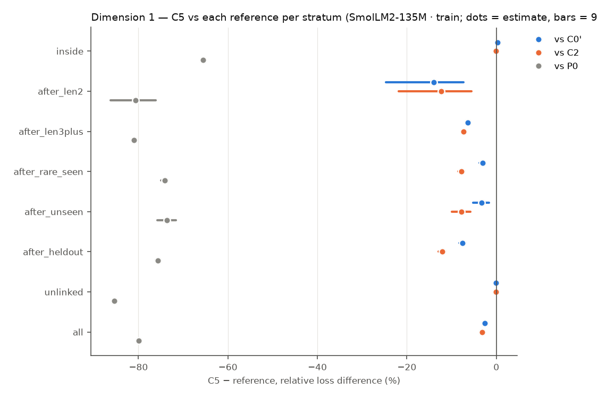
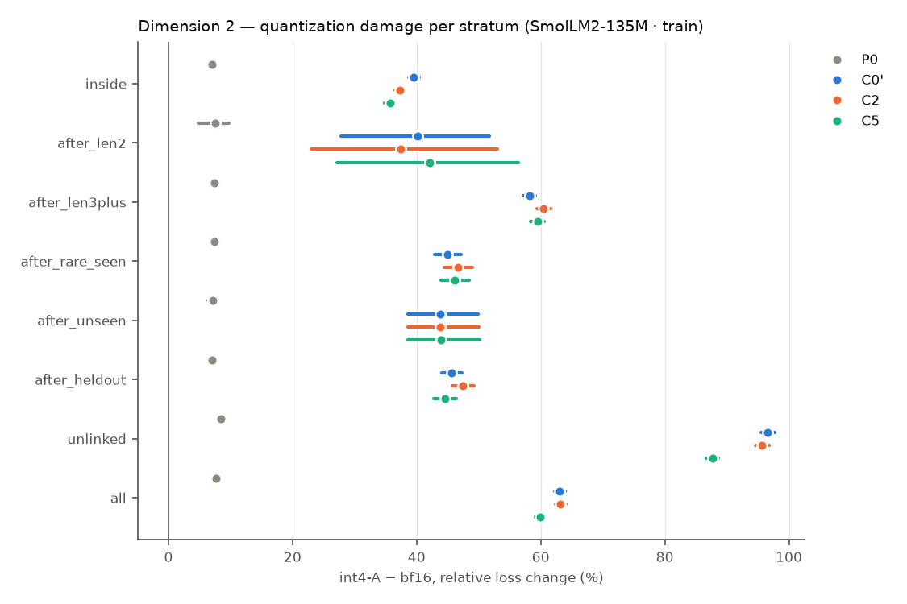
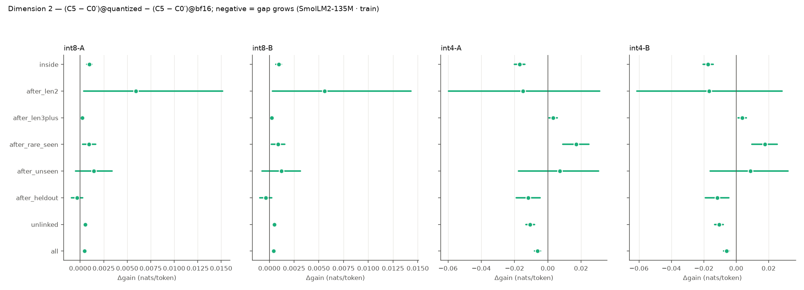
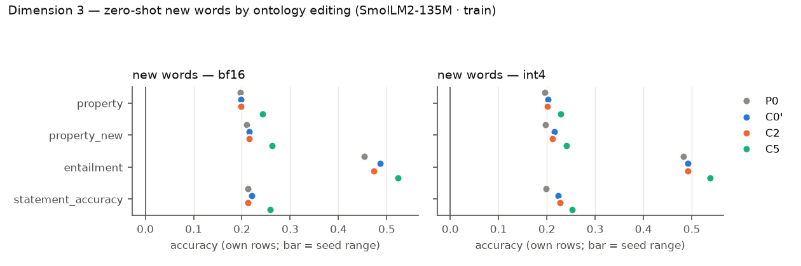
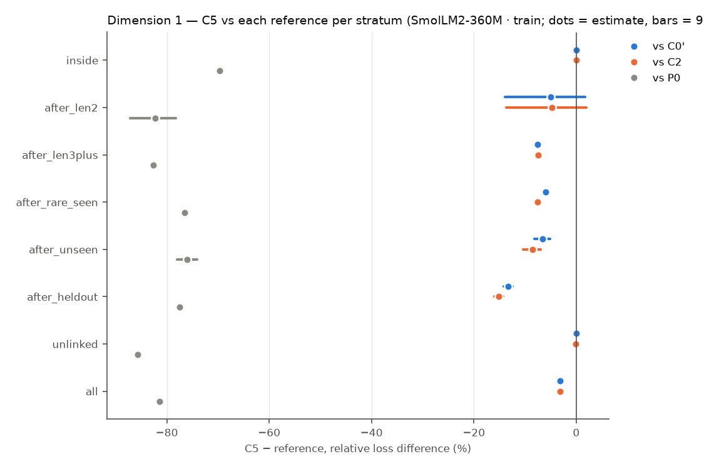
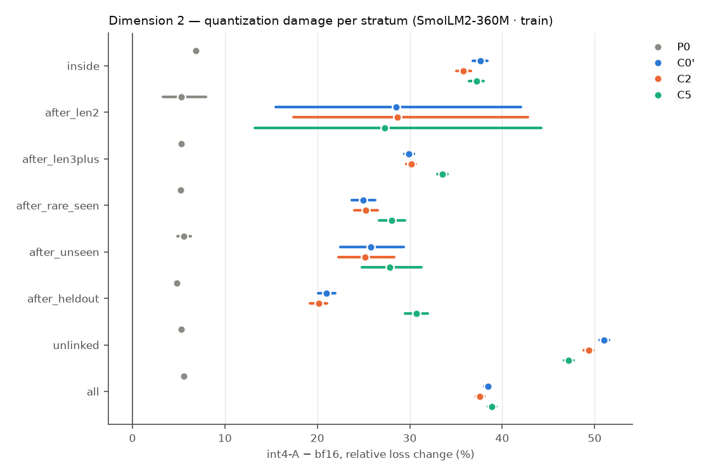
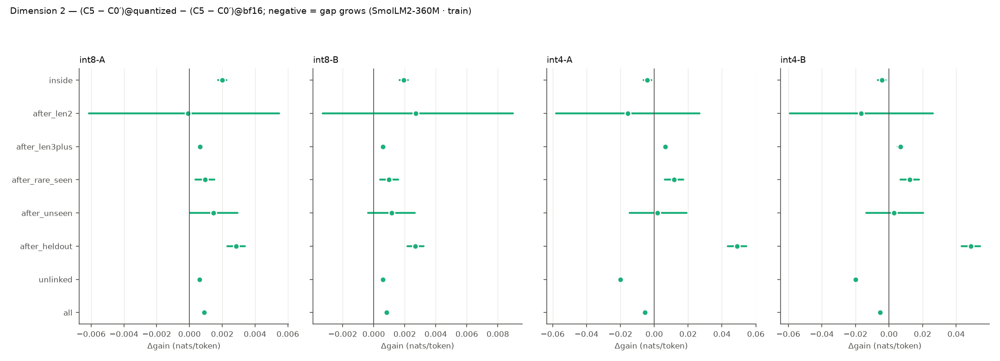
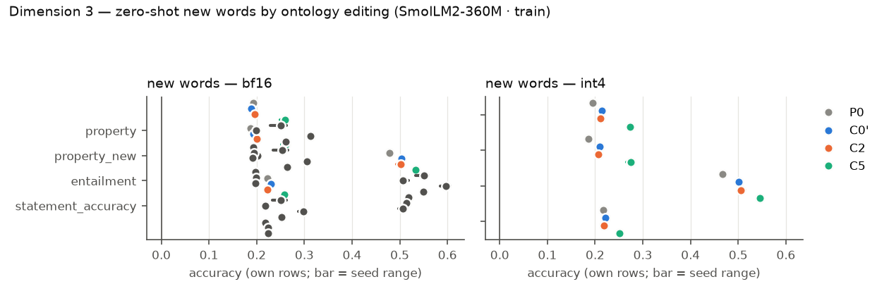

# R9 — retrofit × quantization (E9)

E9 asks three questions on pretrained hosts, all on one fixed test set: (1) does a VSA ontology channel trained jointly with the host improve it on long-token, rare and out-of-distribution words; (2) is the gap larger under weight quantization; (3) after training, can the model learn new or changed words zero-shot by editing the ontology alone? Models: **P0** the original host (evaluation only), **C0′** continued training without the channel, **C2** the same with a capacity-matched free per-concept table, **C5** the same with the attentive VSA channel. Loss differences are condition − reference (negative = lower loss), token-weighted and pooled over common seeds, with 95% cluster bootstraps over evaluation windows (10000 resamples); `*` = Holm-adjusted p < 0.05 within the family named in each table. P0 has no training randomness and pairs with every seed.

## SmolLM2-135M · train

Seeds: P0 [1]; C0' [1, 2, 3]; C2 [1, 2, 3]; C5 [1, 2, 3].

### Dimension 1 — C5 vs C0′, C2 and P0 (bf16)

Relative loss difference [95% CI] (Holm over the three references within each stratum):

| Stratum | Targets | C5 − C0′ | C5 − C2 | C5 − P0 | C2 − C0′ | C0′ − P0 |
|---|---:|---|---|---|---|---|
| inside (long-token words) | 859584 | +0.33% [+0.22, +0.45]* | +0.19% [+0.12, +0.26]* | -65.47% [-65.93, -65.01]* | +0.15% [+0.06, +0.23] | -65.59% [-66.04, -65.13] |
| after_len2 (long-token words) | 930 | -13.23% [-23.73, -6.93]* | -12.70% [-20.67, -7.43]* | -80.46% [-86.08, -75.87]* | -0.61% [-7.12, +4.47] | -77.48% [-82.16, -73.57] |
| after_len3plus (long-token words) | 1447566 | -6.58% [-6.82, -6.35]* | -7.52% [-7.74, -7.31]* | -81.02% [-81.26, -80.77]* | +1.01% [+0.85, +1.17] | -79.68% [-79.92, -79.43] |
| after_rare_seen (rare words) | 108909 | -3.10% [-3.71, -2.49]* | -7.88% [-8.57, -7.22]* | -74.16% [-74.91, -73.42]* | +5.19% [+4.77, +5.62] | -73.33% [-74.05, -72.61] |
| after_unseen (out of distribution) | 14721 | -3.83% [-5.43, -2.29]* | -8.03% [-9.91, -6.25]* | -73.78% [-75.82, -71.82]* | +4.57% [+3.63, +5.56] | -72.74% [-74.67, -70.91] |
| after_heldout (out of distribution) | 150369 | -9.17% [-9.97, -8.42]* | -13.55% [-14.39, -12.77]* | -76.07% [-76.63, -75.53]* | +5.07% [+4.76, +5.40] | -73.66% [-74.18, -73.13] |
| unlinked (locality) | 1142448 | -0.17% [-0.27, -0.08]* | -0.22% [-0.29, -0.15]* | -85.45% [-85.54, -85.36]* | +0.05% [-0.02, +0.11] | -85.43% [-85.52, -85.34] |
| all (locality) | 3142656 | -2.70% [-2.80, -2.59]* | -3.16% [-3.25, -3.07]* | -79.90% [-80.09, -79.70]* | +0.48% [+0.40, +0.56] | -79.34% [-79.54, -79.14] |

Absolute differences (nats/token):

| Stratum | C5 − C0′ | C5 − C2 | C5 − P0 |
|---|---|---|---|
| inside | +0.0039 [+0.0026, +0.0052]* | +0.0022 [+0.0014, +0.0030]* | -2.2131 [-2.2352, -2.1908]* |
| after_len2 | -0.0969 [-0.1521, -0.0576]* | -0.0924 [-0.1325, -0.0610]* | -2.6164 [-3.0502, -2.2363]* |
| after_len3plus | -0.0431 [-0.0447, -0.0415]* | -0.0497 [-0.0513, -0.0482]* | -2.6110 [-2.6231, -2.5986]* |
| after_rare_seen | -0.0280 [-0.0333, -0.0226]* | -0.0749 [-0.0809, -0.0689]* | -2.5120 [-2.5537, -2.4697]* |
| after_unseen | -0.0364 [-0.0502, -0.0223]* | -0.0797 [-0.0965, -0.0629]* | -2.5715 [-2.6753, -2.4708]* |
| after_heldout | -0.0820 [-0.0893, -0.0753]* | -0.1274 [-0.1353, -0.1201]* | -2.5837 [-2.6192, -2.5497]* |
| unlinked | -0.0009 [-0.0014, -0.0004]* | -0.0012 [-0.0015, -0.0008]* | -3.1124 [-3.1221, -3.1025]* |
| all | -0.0193 [-0.0201, -0.0185]* | -0.0227 [-0.0235, -0.0220]* | -2.7684 [-2.7785, -2.7583]* |

Probe differences (bf16): C5 − reference per subset, per seed (paired bootstrap over items):

| Reference | Seed | Probe | all | heldout | seen | unlinked |
|---|---:|---|---|---|---|---|
| C0' | 1 | lambada/accuracy | +0.005 [+0.002, +0.009] (n 5153) | — | — | +0.005 [+0.002, +0.009] (n 5153) |
| C0' | 1 | wic/probe_accuracy | +0.003 [-0.011, +0.017] (n 638) | — | — | +0.003 [-0.011, +0.017] (n 638) |
| C0' | 1 | card660/spearman_tied | +0.006 [+0.000, +0.012] (n 660) | — | — | +0.006 [+0.000, +0.012] (n 660) |
| C0' | 1 | rare_words/spearman_tied | +0.006 [+0.004, +0.009] (n 2034) | — | — | +0.006 [+0.004, +0.009] (n 2034) |
| C0' | 1 | wsd/probe_f1 | -0.002 [-0.004, +0.000] (n 7253) | — | — | -0.002 [-0.004, +0.000] (n 7253) |
| C0' | 1 | bless/pair_probe_macro_f1 | +0.001 [-0.003, +0.006] (n 4310) | — | — | +0.001 [-0.003, +0.006] (n 4310) |
| C0' | 1 | bless/prompt_auc | -0.004 [-0.005, -0.003] (n 14547) | — | — | -0.004 [-0.005, -0.003] (n 14547) |
| C0' | 1 | hyperlex/cosine_spearman | -0.004 [-0.006, -0.001] (n 2616) | — | — | -0.004 [-0.006, -0.001] (n 2616) |
| C0' | 2 | lambada/accuracy | +0.002 [-0.001, +0.005] (n 5153) | — | — | +0.002 [-0.001, +0.005] (n 5153) |
| C0' | 2 | wic/probe_accuracy | -0.008 [-0.024, +0.005] (n 638) | — | — | -0.008 [-0.024, +0.005] (n 638) |
| C0' | 2 | card660/spearman_tied | +0.002 [-0.003, +0.008] (n 660) | — | — | +0.002 [-0.003, +0.008] (n 660) |
| C0' | 2 | rare_words/spearman_tied | +0.007 [+0.004, +0.010] (n 2034) | — | — | +0.007 [+0.004, +0.010] (n 2034) |
| C0' | 2 | wsd/probe_f1 | -0.001 [-0.002, +0.001] (n 7253) | — | — | -0.001 [-0.002, +0.001] (n 7253) |
| C0' | 2 | bless/pair_probe_macro_f1 | -0.000 [-0.004, +0.004] (n 4310) | — | — | -0.000 [-0.004, +0.004] (n 4310) |
| C0' | 2 | bless/prompt_auc | -0.006 [-0.007, -0.005] (n 14547) | — | — | -0.006 [-0.007, -0.005] (n 14547) |
| C0' | 2 | hyperlex/cosine_spearman | -0.005 [-0.007, -0.002] (n 2616) | — | — | -0.005 [-0.007, -0.002] (n 2616) |
| C0' | 3 | lambada/accuracy | +0.002 [-0.001, +0.005] (n 5153) | — | — | +0.002 [-0.001, +0.005] (n 5153) |
| C0' | 3 | wic/probe_accuracy | -0.009 [-0.025, +0.006] (n 638) | — | — | -0.009 [-0.025, +0.006] (n 638) |
| C0' | 3 | card660/spearman_tied | +0.002 [-0.003, +0.008] (n 660) | — | — | +0.002 [-0.003, +0.008] (n 660) |
| C0' | 3 | rare_words/spearman_tied | +0.005 [+0.002, +0.008] (n 2034) | — | — | +0.005 [+0.002, +0.008] (n 2034) |
| C0' | 3 | wsd/probe_f1 | +0.000 [-0.002, +0.002] (n 7253) | — | — | +0.000 [-0.002, +0.002] (n 7253) |
| C0' | 3 | bless/pair_probe_macro_f1 | -0.000 [-0.003, +0.003] (n 4310) | — | — | -0.000 [-0.003, +0.003] (n 4310) |
| C0' | 3 | bless/prompt_auc | -0.007 [-0.008, -0.006] (n 14547) | — | — | -0.007 [-0.008, -0.006] (n 14547) |
| C0' | 3 | hyperlex/cosine_spearman | -0.002 [-0.004, +0.000] (n 2616) | — | — | -0.002 [-0.004, +0.000] (n 2616) |
| C2 | 1 | lambada/accuracy | +0.004 [+0.001, +0.006] (n 5153) | — | — | +0.004 [+0.001, +0.006] (n 5153) |
| C2 | 1 | wic/probe_accuracy | -0.002 [-0.014, +0.011] (n 638) | — | — | -0.002 [-0.014, +0.011] (n 638) |
| C2 | 1 | card660/spearman_tied | +0.005 [+0.001, +0.008] (n 660) | — | — | +0.005 [+0.001, +0.008] (n 660) |
| C2 | 1 | rare_words/spearman_tied | +0.004 [+0.002, +0.006] (n 2034) | — | — | +0.004 [+0.002, +0.006] (n 2034) |
| C2 | 1 | wsd/probe_f1 | -0.001 [-0.003, +0.000] (n 7253) | — | — | -0.001 [-0.003, +0.000] (n 7253) |
| C2 | 1 | bless/pair_probe_macro_f1 | +0.001 [-0.002, +0.005] (n 4310) | — | — | +0.001 [-0.002, +0.005] (n 4310) |
| C2 | 1 | bless/prompt_auc | +0.004 [+0.003, +0.004] (n 14547) | — | — | +0.004 [+0.003, +0.004] (n 14547) |
| C2 | 1 | hyperlex/cosine_spearman | -0.000 [-0.002, +0.002] (n 2616) | — | — | -0.000 [-0.002, +0.002] (n 2616) |
| C2 | 2 | lambada/accuracy | +0.002 [-0.000, +0.005] (n 5153) | — | — | +0.002 [-0.000, +0.005] (n 5153) |
| C2 | 2 | wic/probe_accuracy | -0.002 [-0.014, +0.011] (n 638) | — | — | -0.002 [-0.014, +0.011] (n 638) |
| C2 | 2 | card660/spearman_tied | -0.000 [-0.004, +0.003] (n 660) | — | — | -0.000 [-0.004, +0.003] (n 660) |
| C2 | 2 | rare_words/spearman_tied | +0.002 [+0.001, +0.004] (n 2034) | — | — | +0.002 [+0.001, +0.004] (n 2034) |
| C2 | 2 | wsd/probe_f1 | +0.000 [-0.001, +0.002] (n 7253) | — | — | +0.000 [-0.001, +0.002] (n 7253) |
| C2 | 2 | bless/pair_probe_macro_f1 | +0.000 [-0.003, +0.003] (n 4310) | — | — | +0.000 [-0.003, +0.003] (n 4310) |
| C2 | 2 | bless/prompt_auc | +0.001 [+0.000, +0.001] (n 14547) | — | — | +0.001 [+0.000, +0.001] (n 14547) |
| C2 | 2 | hyperlex/cosine_spearman | +0.000 [-0.001, +0.002] (n 2616) | — | — | +0.000 [-0.001, +0.002] (n 2616) |
| C2 | 3 | lambada/accuracy | +0.002 [-0.000, +0.005] (n 5153) | — | — | +0.002 [-0.000, +0.005] (n 5153) |
| C2 | 3 | wic/probe_accuracy | -0.003 [-0.016, +0.011] (n 638) | — | — | -0.003 [-0.016, +0.011] (n 638) |
| C2 | 3 | card660/spearman_tied | -0.000 [-0.004, +0.003] (n 660) | — | — | -0.000 [-0.004, +0.003] (n 660) |
| C2 | 3 | rare_words/spearman_tied | +0.000 [-0.002, +0.002] (n 2034) | — | — | +0.000 [-0.002, +0.002] (n 2034) |
| C2 | 3 | wsd/probe_f1 | +0.001 [-0.001, +0.002] (n 7253) | — | — | +0.001 [-0.001, +0.002] (n 7253) |
| C2 | 3 | bless/pair_probe_macro_f1 | +0.000 [-0.002, +0.003] (n 4310) | — | — | +0.000 [-0.002, +0.003] (n 4310) |
| C2 | 3 | bless/prompt_auc | +0.001 [+0.001, +0.001] (n 14547) | — | — | +0.001 [+0.001, +0.001] (n 14547) |
| C2 | 3 | hyperlex/cosine_spearman | -0.000 [-0.002, +0.002] (n 2616) | — | — | -0.000 [-0.002, +0.002] (n 2616) |
| P0 | 1 | lambada/accuracy | -0.003 [-0.009, +0.004] (n 5153) | — | — | -0.003 [-0.009, +0.004] (n 5153) |
| P0 | 1 | wic/probe_accuracy | +0.011 [-0.025, +0.047] (n 638) | — | — | +0.011 [-0.025, +0.047] (n 638) |
| P0 | 1 | card660/spearman_tied | -0.004 [-0.022, +0.013] (n 660) | — | — | -0.004 [-0.022, +0.013] (n 660) |
| P0 | 1 | rare_words/spearman_tied | +0.002 [-0.008, +0.014] (n 2034) | — | — | +0.002 [-0.008, +0.014] (n 2034) |
| P0 | 1 | wsd/probe_f1 | +0.000 [-0.004, +0.004] (n 7253) | — | — | +0.000 [-0.004, +0.004] (n 7253) |
| P0 | 1 | bless/pair_probe_macro_f1 | -0.002 [-0.009, +0.006] (n 4310) | — | — | -0.002 [-0.009, +0.006] (n 4310) |
| P0 | 1 | bless/prompt_auc | -0.013 [-0.016, -0.010] (n 14547) | — | — | -0.013 [-0.016, -0.010] (n 14547) |
| P0 | 1 | hyperlex/cosine_spearman | +0.021 [+0.012, +0.030] (n 2616) | — | — | +0.021 [+0.012, +0.030] (n 2616) |
| P0 | 2 | lambada/accuracy | -0.004 [-0.010, +0.003] (n 5153) | — | — | -0.004 [-0.010, +0.003] (n 5153) |
| P0 | 2 | wic/probe_accuracy | +0.005 [-0.030, +0.039] (n 638) | — | — | +0.005 [-0.030, +0.039] (n 638) |
| P0 | 2 | card660/spearman_tied | -0.007 [-0.025, +0.010] (n 660) | — | — | -0.007 [-0.025, +0.010] (n 660) |
| P0 | 2 | rare_words/spearman_tied | +0.002 [-0.009, +0.013] (n 2034) | — | — | +0.002 [-0.009, +0.013] (n 2034) |
| P0 | 2 | wsd/probe_f1 | +0.001 [-0.003, +0.005] (n 7253) | — | — | +0.001 [-0.003, +0.005] (n 7253) |
| P0 | 2 | bless/pair_probe_macro_f1 | -0.003 [-0.010, +0.005] (n 4310) | — | — | -0.003 [-0.010, +0.005] (n 4310) |
| P0 | 2 | bless/prompt_auc | -0.013 [-0.016, -0.010] (n 14547) | — | — | -0.013 [-0.016, -0.010] (n 14547) |
| P0 | 2 | hyperlex/cosine_spearman | +0.020 [+0.011, +0.029] (n 2616) | — | — | +0.020 [+0.011, +0.029] (n 2616) |
| P0 | 3 | lambada/accuracy | -0.004 [-0.011, +0.002] (n 5153) | — | — | -0.004 [-0.011, +0.002] (n 5153) |
| P0 | 3 | wic/probe_accuracy | +0.011 [-0.024, +0.045] (n 638) | — | — | +0.011 [-0.024, +0.045] (n 638) |
| P0 | 3 | card660/spearman_tied | -0.007 [-0.025, +0.010] (n 660) | — | — | -0.007 [-0.025, +0.010] (n 660) |
| P0 | 3 | rare_words/spearman_tied | +0.001 [-0.009, +0.013] (n 2034) | — | — | +0.001 [-0.009, +0.013] (n 2034) |
| P0 | 3 | wsd/probe_f1 | +0.002 [-0.002, +0.005] (n 7253) | — | — | +0.002 [-0.002, +0.005] (n 7253) |
| P0 | 3 | bless/pair_probe_macro_f1 | -0.003 [-0.010, +0.005] (n 4310) | — | — | -0.003 [-0.010, +0.005] (n 4310) |
| P0 | 3 | bless/prompt_auc | -0.014 [-0.017, -0.011] (n 14547) | — | — | -0.014 [-0.017, -0.011] (n 14547) |
| P0 | 3 | hyperlex/cosine_spearman | +0.021 [+0.012, +0.030] (n 2616) | — | — | +0.021 [+0.012, +0.030] (n 2616) |

### Dimension 2 — quantization damage and the gap under quantization

Quantization damage `variant − bf16`, relative [95% CI] (A = channel FP16, B = channel quantized; models without a channel have B = A):

| Stratum | Model | int8-A | int8-B | int4-A | int4-B |
|---|---|---|---|---|---|
| inside | P0 | +0.27% [+0.26, +0.28] | +0.27% [+0.26, +0.28] | +6.96% [+6.85, +7.07] | +6.96% [+6.85, +7.07] |
| inside | C0' | +0.22% [+0.19, +0.25] | +0.22% [+0.19, +0.25] | +39.21% [+38.35, +40.06] | +39.21% [+38.35, +40.06] |
| inside | C2 | +0.23% [+0.20, +0.26] | +0.23% [+0.21, +0.26] | +37.84% [+37.01, +38.67] | +37.83% [+37.01, +38.66] |
| inside | C5 | +0.30% [+0.28, +0.33] | +0.30% [+0.27, +0.33] | +37.63% [+36.80, +38.47] | +37.60% [+36.77, +38.43] |
| after_len2 | P0 | -0.39% [-0.64, -0.07] | -0.39% [-0.64, -0.07] | +7.48% [+4.74, +9.69] | +7.48% [+4.74, +9.69] |
| after_len2 | C0' | -0.65% [-2.64, +0.40] | -0.65% [-2.64, +0.40] | +40.60% [+28.50, +52.79] | +40.60% [+28.50, +52.79] |
| after_len2 | C2 | -0.21% [-1.47, +0.69] | -0.21% [-1.49, +0.76] | +40.11% [+26.03, +55.83] | +39.93% [+25.80, +55.45] |
| after_len2 | C5 | +0.19% [-0.96, +1.25] | +0.13% [-1.06, +1.21] | +44.44% [+30.66, +58.39] | +44.14% [+30.59, +58.12] |
| after_len3plus | P0 | -0.09% [-0.10, -0.08] | -0.09% [-0.10, -0.08] | +7.46% [+7.38, +7.55] | +7.46% [+7.38, +7.55] |
| after_len3plus | C0' | +0.22% [+0.19, +0.25] | +0.22% [+0.19, +0.25] | +58.07% [+57.12, +59.03] | +58.07% [+57.12, +59.03] |
| after_len3plus | C2 | +0.18% [+0.16, +0.21] | +0.18% [+0.15, +0.21] | +58.06% [+57.09, +59.06] | +58.14% [+57.17, +59.15] |
| after_len3plus | C5 | +0.28% [+0.25, +0.30] | +0.27% [+0.25, +0.30] | +62.69% [+61.59, +63.82] | +62.76% [+61.66, +63.89] |
| after_rare_seen | P0 | -0.12% [-0.15, -0.09] | -0.12% [-0.15, -0.09] | +7.41% [+7.15, +7.69] | +7.41% [+7.15, +7.69] |
| after_rare_seen | C0' | +0.18% [+0.10, +0.27] | +0.18% [+0.10, +0.27] | +44.87% [+42.86, +46.95] | +44.87% [+42.86, +46.95] |
| after_rare_seen | C2 | +0.11% [+0.03, +0.19] | +0.09% [+0.01, +0.17] | +44.63% [+42.67, +46.68] | +44.64% [+42.69, +46.70] |
| after_rare_seen | C5 | +0.30% [+0.21, +0.39] | +0.29% [+0.20, +0.38] | +48.25% [+46.06, +50.61] | +48.32% [+46.13, +50.69] |
| after_unseen | P0 | -0.16% [-0.24, -0.09] | -0.16% [-0.24, -0.09] | +7.15% [+6.39, +7.90] | +7.15% [+6.39, +7.90] |
| after_unseen | C0' | +0.12% [-0.10, +0.33] | +0.12% [-0.10, +0.33] | +43.33% [+38.31, +49.21] | +43.33% [+38.31, +49.21] |
| after_unseen | C2 | +0.13% [-0.06, +0.31] | +0.17% [-0.03, +0.36] | +42.11% [+37.39, +47.66] | +42.20% [+37.48, +47.75] |
| after_unseen | C5 | +0.28% [+0.05, +0.50] | +0.26% [+0.03, +0.48] | +45.85% [+40.51, +52.19] | +46.00% [+40.63, +52.36] |
| after_heldout | P0 | -0.25% [-0.28, -0.22] | -0.25% [-0.28, -0.22] | +7.04% [+6.80, +7.27] | +7.04% [+6.80, +7.27] |
| after_heldout | C0' | +0.15% [+0.08, +0.22] | +0.15% [+0.08, +0.22] | +45.46% [+43.88, +47.06] | +45.46% [+43.88, +47.06] |
| after_heldout | C2 | +0.12% [+0.05, +0.19] | +0.13% [+0.06, +0.20] | +45.12% [+43.58, +46.72] | +45.14% [+43.60, +46.74] |
| after_heldout | C5 | +0.13% [+0.06, +0.20] | +0.13% [+0.06, +0.19] | +48.59% [+46.76, +50.51] | +48.60% [+46.77, +50.52] |
| unlinked | P0 | -0.07% [-0.08, -0.06] | -0.07% [-0.08, -0.06] | +8.51% [+8.42, +8.59] | +8.51% [+8.42, +8.59] |
| unlinked | C0' | +1.22% [+1.15, +1.30] | +1.22% [+1.15, +1.30] | +96.71% [+95.60, +97.80] | +96.71% [+95.60, +97.80] |
| unlinked | C2 | +1.33% [+1.26, +1.41] | +1.34% [+1.26, +1.41] | +95.16% [+94.08, +96.22] | +95.12% [+94.04, +96.17] |
| unlinked | C5 | +1.32% [+1.24, +1.40] | +1.32% [+1.24, +1.40] | +94.88% [+93.82, +95.94] | +94.89% [+93.81, +95.95] |
| all | P0 | -0.01% [-0.02, -0.01] | -0.01% [-0.02, -0.01] | +7.70% [+7.64, +7.76] | +7.70% [+7.64, +7.76] |
| all | C0' | +0.49% [+0.46, +0.52] | +0.49% [+0.46, +0.52] | +62.95% [+62.14, +63.76] | +62.95% [+62.14, +63.76] |
| all | C2 | +0.50% [+0.47, +0.53] | +0.50% [+0.48, +0.53] | +62.15% [+61.34, +62.97] | +62.18% [+61.36, +62.99] |
| all | C5 | +0.57% [+0.54, +0.60] | +0.57% [+0.54, +0.59] | +63.81% [+62.99, +64.66] | +63.83% [+63.00, +64.67] |

Gap under quantization vs C0': gain = C5 − C0' at bf16 and quantized, `Δgain` = difference in differences (negative = the channel's advantage grows under quantization; Holm over references × variants within each stratum), retained = gain_q / gain_bf16:

| Stratum | Variant | gain bf16 | gain quantized | Δgain [95% CI] | retained |
|---|---|---|---|---|---|
| inside | int8-A | +0.0039 [+0.0026, +0.0052] | +0.0049 [+0.0036, +0.0062] | +0.0010 [+0.0007, +0.0013]* | 1.25 |
| inside | int8-B | +0.0039 [+0.0026, +0.0052] | +0.0048 [+0.0035, +0.0062] | +0.0009 [+0.0007, +0.0012]* | 1.24 |
| inside | int4-A | +0.0039 [+0.0026, +0.0052] | -0.0130 [-0.0162, -0.0098] | -0.0169 [-0.0201, -0.0138]* | -3.34 |
| inside | int4-B | +0.0039 [+0.0026, +0.0052] | -0.0134 [-0.0166, -0.0102] | -0.0173 [-0.0205, -0.0142]* | -3.45 |
| after_len2 | int8-A | -0.0969 [-0.1522, -0.0576] | -0.0909 [-0.1424, -0.0529] | +0.0059 [+0.0004, +0.0152] | 0.94 |
| after_len2 | int8-B | -0.0969 [-0.1522, -0.0576] | -0.0913 [-0.1430, -0.0533] | +0.0056 [+0.0003, +0.0143] | 0.94 |
| after_len2 | int4-A | -0.0969 [-0.1522, -0.0576] | -0.1118 [-0.1680, -0.0727] | -0.0150 [-0.0598, +0.0311] | 1.15 |
| after_len2 | int4-B | -0.0969 [-0.1522, -0.0576] | -0.1137 [-0.1688, -0.0749] | -0.0168 [-0.0613, +0.0282] | 1.17 |
| after_len3plus | int8-A | -0.0431 [-0.0447, -0.0415] | -0.0429 [-0.0445, -0.0413] | +0.0002 [+0.0001, +0.0004]* | 0.99 |
| after_len3plus | int8-B | -0.0431 [-0.0447, -0.0415] | -0.0429 [-0.0445, -0.0413] | +0.0002 [+0.0001, +0.0004]* | 0.99 |
| after_len3plus | int4-A | -0.0431 [-0.0447, -0.0415] | -0.0399 [-0.0427, -0.0371] | +0.0032 [+0.0007, +0.0057]* | 0.93 |
| after_len3plus | int4-B | -0.0431 [-0.0447, -0.0415] | -0.0395 [-0.0423, -0.0367] | +0.0036 [+0.0012, +0.0061]* | 0.92 |
| after_rare_seen | int8-A | -0.0280 [-0.0333, -0.0226] | -0.0271 [-0.0324, -0.0217] | +0.0009 [+0.0003, +0.0016]* | 0.97 |
| after_rare_seen | int8-B | -0.0280 [-0.0333, -0.0226] | -0.0271 [-0.0325, -0.0217] | +0.0009 [+0.0002, +0.0016]* | 0.97 |
| after_rare_seen | int4-A | -0.0280 [-0.0333, -0.0226] | -0.0110 [-0.0199, -0.0019] | +0.0171 [+0.0090, +0.0248]* | 0.39 |
| after_rare_seen | int4-B | -0.0280 [-0.0333, -0.0226] | -0.0104 [-0.0193, -0.0015] | +0.0176 [+0.0096, +0.0253]* | 0.37 |
| after_unseen | int8-A | -0.0364 [-0.0503, -0.0224] | -0.0350 [-0.0488, -0.0211] | +0.0014 [-0.0005, +0.0034] | 0.96 |
| after_unseen | int8-B | -0.0364 [-0.0503, -0.0224] | -0.0352 [-0.0491, -0.0213] | +0.0012 [-0.0007, +0.0031] | 0.97 |
| after_unseen | int4-A | -0.0364 [-0.0503, -0.0224] | -0.0291 [-0.0552, -0.0038] | +0.0073 [-0.0176, +0.0305] | 0.80 |
| after_unseen | int4-B | -0.0364 [-0.0503, -0.0224] | -0.0277 [-0.0537, -0.0024] | +0.0087 [-0.0161, +0.0320] | 0.76 |
| after_heldout | int8-A | -0.0820 [-0.0893, -0.0753] | -0.0823 [-0.0896, -0.0756] | -0.0003 [-0.0009, +0.0003] | 1.00 |
| after_heldout | int8-B | -0.0820 [-0.0893, -0.0753] | -0.0824 [-0.0896, -0.0757] | -0.0004 [-0.0010, +0.0002] | 1.00 |
| after_heldout | int4-A | -0.0820 [-0.0893, -0.0753] | -0.0939 [-0.1046, -0.0837] | -0.0119 [-0.0190, -0.0047]* | 1.14 |
| after_heldout | int4-B | -0.0820 [-0.0893, -0.0753] | -0.0938 [-0.1044, -0.0836] | -0.0118 [-0.0189, -0.0046]* | 1.14 |
| unlinked | int8-A | -0.0009 [-0.0014, -0.0004] | -0.0004 [-0.0009, +0.0001] | +0.0005 [+0.0004, +0.0007]* | 0.42 |
| unlinked | int8-B | -0.0009 [-0.0014, -0.0004] | -0.0004 [-0.0009, +0.0001] | +0.0005 [+0.0003, +0.0007]* | 0.45 |
| unlinked | int4-A | -0.0009 [-0.0014, -0.0004] | -0.0115 [-0.0141, -0.0089] | -0.0106 [-0.0132, -0.0080]* | 12.75 |
| unlinked | int4-B | -0.0009 [-0.0014, -0.0004] | -0.0114 [-0.0141, -0.0089] | -0.0105 [-0.0132, -0.0080]* | 12.72 |
| all | int8-A | -0.0193 [-0.0201, -0.0185] | -0.0188 [-0.0197, -0.0180] | +0.0004 [+0.0003, +0.0006]* | 0.98 |
| all | int8-B | -0.0193 [-0.0201, -0.0185] | -0.0189 [-0.0197, -0.0181] | +0.0004 [+0.0003, +0.0005]* | 0.98 |
| all | int4-A | -0.0193 [-0.0201, -0.0185] | -0.0254 [-0.0271, -0.0236] | -0.0061 [-0.0079, -0.0044]* | 1.32 |
| all | int4-B | -0.0193 [-0.0201, -0.0185] | -0.0253 [-0.0270, -0.0235] | -0.0060 [-0.0078, -0.0043]* | 1.31 |

Gap under quantization vs C2: gain = C5 − C2 at bf16 and quantized, `Δgain` = difference in differences (negative = the channel's advantage grows under quantization; Holm over references × variants within each stratum), retained = gain_q / gain_bf16:

| Stratum | Variant | gain bf16 | gain quantized | Δgain [95% CI] | retained |
|---|---|---|---|---|---|
| inside | int8-A | +0.0022 [+0.0014, +0.0030] | +0.0031 [+0.0022, +0.0039] | +0.0009 [+0.0007, +0.0011]* | 1.41 |
| inside | int8-B | +0.0022 [+0.0014, +0.0030] | +0.0030 [+0.0021, +0.0038] | +0.0008 [+0.0006, +0.0010]* | 1.36 |
| inside | int4-A | +0.0022 [+0.0014, +0.0030] | +0.0006 [-0.0013, +0.0026] | -0.0015 [-0.0034, +0.0004] | 0.29 |
| inside | int4-B | +0.0022 [+0.0014, +0.0030] | +0.0003 [-0.0016, +0.0022] | -0.0019 [-0.0037, -0.0000] | 0.13 |
| after_len2 | int8-A | -0.0924 [-0.1325, -0.0609] | -0.0897 [-0.1290, -0.0574] | +0.0027 [-0.0003, +0.0067] | 0.97 |
| after_len2 | int8-B | -0.0924 [-0.1325, -0.0609] | -0.0900 [-0.1295, -0.0567] | +0.0024 [-0.0008, +0.0066] | 0.97 |
| after_len2 | int4-A | -0.0924 [-0.1325, -0.0609] | -0.1020 [-0.1762, -0.0347] | -0.0096 [-0.0655, +0.0437] | 1.10 |
| after_len2 | int4-B | -0.0924 [-0.1325, -0.0609] | -0.1025 [-0.1754, -0.0363] | -0.0101 [-0.0648, +0.0413] | 1.11 |
| after_len3plus | int8-A | -0.0497 [-0.0513, -0.0482] | -0.0493 [-0.0508, -0.0477] | +0.0005 [+0.0003, +0.0006]* | 0.99 |
| after_len3plus | int8-B | -0.0497 [-0.0513, -0.0482] | -0.0492 [-0.0508, -0.0477] | +0.0005 [+0.0004, +0.0006]* | 0.99 |
| after_len3plus | int4-A | -0.0497 [-0.0513, -0.0482] | -0.0503 [-0.0525, -0.0481] | -0.0006 [-0.0023, +0.0012] | 1.01 |
| after_len3plus | int4-B | -0.0497 [-0.0513, -0.0482] | -0.0504 [-0.0526, -0.0482] | -0.0007 [-0.0024, +0.0010] | 1.01 |
| after_rare_seen | int8-A | -0.0749 [-0.0809, -0.0689] | -0.0733 [-0.0793, -0.0674] | +0.0016 [+0.0010, +0.0021]* | 0.98 |
| after_rare_seen | int8-B | -0.0749 [-0.0809, -0.0689] | -0.0732 [-0.0792, -0.0672] | +0.0017 [+0.0011, +0.0023]* | 0.98 |
| after_rare_seen | int4-A | -0.0749 [-0.0809, -0.0689] | -0.0766 [-0.0852, -0.0679] | -0.0017 [-0.0087, +0.0050] | 1.02 |
| after_rare_seen | int4-B | -0.0749 [-0.0809, -0.0689] | -0.0762 [-0.0847, -0.0675] | -0.0013 [-0.0082, +0.0054] | 1.02 |
| after_unseen | int8-A | -0.0798 [-0.0965, -0.0630] | -0.0785 [-0.0952, -0.0619] | +0.0013 [-0.0001, +0.0028] | 0.98 |
| after_unseen | int8-B | -0.0798 [-0.0965, -0.0630] | -0.0791 [-0.0958, -0.0624] | +0.0007 [-0.0008, +0.0022] | 0.99 |
| after_unseen | int4-A | -0.0798 [-0.0965, -0.0630] | -0.0792 [-0.1030, -0.0554] | +0.0006 [-0.0189, +0.0202] | 0.99 |
| after_unseen | int4-B | -0.0798 [-0.0965, -0.0630] | -0.0787 [-0.1027, -0.0550] | +0.0011 [-0.0187, +0.0210] | 0.99 |
| after_heldout | int8-A | -0.1274 [-0.1352, -0.1201] | -0.1275 [-0.1352, -0.1201] | -0.0001 [-0.0006, +0.0005] | 1.00 |
| after_heldout | int8-B | -0.1274 [-0.1352, -0.1201] | -0.1276 [-0.1354, -0.1202] | -0.0002 [-0.0007, +0.0003] | 1.00 |
| after_heldout | int4-A | -0.1274 [-0.1352, -0.1201] | -0.1567 [-0.1679, -0.1460] | -0.0293 [-0.0360, -0.0226]* | 1.23 |
| after_heldout | int4-B | -0.1274 [-0.1352, -0.1201] | -0.1568 [-0.1681, -0.1459] | -0.0294 [-0.0361, -0.0226]* | 1.23 |
| unlinked | int8-A | -0.0011 [-0.0015, -0.0008] | -0.0012 [-0.0016, -0.0008] | -0.0001 [-0.0002, +0.0001] | 1.06 |
| unlinked | int8-B | -0.0011 [-0.0015, -0.0008] | -0.0013 [-0.0017, -0.0009] | -0.0001 [-0.0003, -0.0000] | 1.11 |
| unlinked | int4-A | -0.0011 [-0.0015, -0.0008] | -0.0037 [-0.0050, -0.0024] | -0.0025 [-0.0039, -0.0013]* | 3.22 |
| unlinked | int4-B | -0.0011 [-0.0015, -0.0008] | -0.0034 [-0.0048, -0.0021] | -0.0023 [-0.0036, -0.0010]* | 3.01 |
| all | int8-A | -0.0227 [-0.0235, -0.0220] | -0.0224 [-0.0231, -0.0216] | +0.0004 [+0.0003, +0.0004]* | 0.98 |
| all | int8-B | -0.0227 [-0.0235, -0.0220] | -0.0224 [-0.0231, -0.0217] | +0.0003 [+0.0002, +0.0004]* | 0.99 |
| all | int4-A | -0.0227 [-0.0235, -0.0220] | -0.0253 [-0.0265, -0.0241] | -0.0026 [-0.0036, -0.0015]* | 1.11 |
| all | int4-B | -0.0227 [-0.0235, -0.0220] | -0.0253 [-0.0265, -0.0241] | -0.0026 [-0.0036, -0.0016]* | 1.11 |

Gap under quantization vs P0: gain = C5 − P0 at bf16 and quantized, `Δgain` = difference in differences (negative = the channel's advantage grows under quantization; Holm over references × variants within each stratum), retained = gain_q / gain_bf16:

| Stratum | Variant | gain bf16 | gain quantized | Δgain [95% CI] | retained |
|---|---|---|---|---|---|
| inside | int8-A | -2.2131 [-2.2352, -2.1908] | -2.2186 [-2.2407, -2.1962] | -0.0055 [-0.0060, -0.0050]* | 1.00 |
| inside | int8-B | -2.2131 [-2.2352, -2.1908] | -2.2186 [-2.2408, -2.1962] | -0.0055 [-0.0060, -0.0050]* | 1.00 |
| inside | int4-A | -2.2131 [-2.2352, -2.1908] | -2.0092 [-2.0296, -1.9889] | +0.2039 [+0.1967, +0.2111]* | 0.91 |
| inside | int4-B | -2.2131 [-2.2352, -2.1908] | -2.0096 [-2.0300, -1.9894] | +0.2035 [+0.1963, +0.2107]* | 0.91 |
| after_len2 | int8-A | -2.6163 [-3.0502, -2.2362] | -2.6026 [-3.0361, -2.2262] | +0.0138 [+0.0016, +0.0250] | 0.99 |
| after_len2 | int8-B | -2.6163 [-3.0502, -2.2362] | -2.6029 [-3.0363, -2.2267] | +0.0134 [+0.0012, +0.0246] | 0.99 |
| after_len2 | int4-A | -2.6163 [-3.0502, -2.2362] | -2.5772 [-3.0165, -2.1965] | +0.0391 [-0.0653, +0.1331] | 0.99 |
| after_len2 | int4-B | -2.6163 [-3.0502, -2.2362] | -2.5791 [-3.0190, -2.1975] | +0.0372 [-0.0665, +0.1306] | 0.99 |
| after_len3plus | int8-A | -2.6110 [-2.6231, -2.5986] | -2.6065 [-2.6187, -2.5941] | +0.0045 [+0.0042, +0.0048]* | 1.00 |
| after_len3plus | int8-B | -2.6110 [-2.6231, -2.5986] | -2.6065 [-2.6187, -2.5941] | +0.0045 [+0.0042, +0.0048]* | 1.00 |
| after_len3plus | int4-A | -2.6110 [-2.6231, -2.5986] | -2.4680 [-2.4795, -2.4562] | +0.1430 [+0.1389, +0.1475]* | 0.95 |
| after_len3plus | int4-B | -2.6110 [-2.6231, -2.5986] | -2.4675 [-2.4790, -2.4558] | +0.1435 [+0.1393, +0.1479]* | 0.95 |
| after_rare_seen | int8-A | -2.5120 [-2.5537, -2.4697] | -2.5054 [-2.5469, -2.4634] | +0.0066 [+0.0053, +0.0078]* | 1.00 |
| after_rare_seen | int8-B | -2.5120 [-2.5537, -2.4697] | -2.5054 [-2.5470, -2.4635] | +0.0065 [+0.0052, +0.0078]* | 1.00 |
| after_rare_seen | int4-A | -2.5120 [-2.5537, -2.4697] | -2.3407 [-2.3817, -2.2986] | +0.1713 [+0.1568, +0.1855]* | 0.93 |
| after_rare_seen | int4-B | -2.5120 [-2.5537, -2.4697] | -2.3402 [-2.3813, -2.2981] | +0.1718 [+0.1574, +0.1860]* | 0.93 |
| after_unseen | int8-A | -2.5716 [-2.6754, -2.4709] | -2.5634 [-2.6665, -2.4635] | +0.0082 [+0.0049, +0.0115]* | 1.00 |
| after_unseen | int8-B | -2.5716 [-2.6754, -2.4709] | -2.5636 [-2.6668, -2.4637] | +0.0080 [+0.0047, +0.0113]* | 1.00 |
| after_unseen | int4-A | -2.5716 [-2.6754, -2.4709] | -2.4020 [-2.5036, -2.3008] | +0.1696 [+0.1308, +0.2102]* | 0.93 |
| after_unseen | int4-B | -2.5716 [-2.6754, -2.4709] | -2.4006 [-2.5025, -2.2996] | +0.1710 [+0.1322, +0.2113]* | 0.93 |
| after_heldout | int8-A | -2.5837 [-2.6192, -2.5496] | -2.5742 [-2.6097, -2.5403] | +0.0095 [+0.0085, +0.0104]* | 1.00 |
| after_heldout | int8-B | -2.5837 [-2.6192, -2.5496] | -2.5743 [-2.6097, -2.5402] | +0.0095 [+0.0085, +0.0104]* | 1.00 |
| after_heldout | int4-A | -2.5837 [-2.6192, -2.5496] | -2.4278 [-2.4617, -2.3943] | +0.1559 [+0.1438, +0.1684]* | 0.94 |
| after_heldout | int4-B | -2.5837 [-2.6192, -2.5496] | -2.4277 [-2.4616, -2.3941] | +0.1560 [+0.1438, +0.1684]* | 0.94 |
| unlinked | int8-A | -3.1124 [-3.1221, -3.1025] | -3.1029 [-3.1126, -3.0929] | +0.0095 [+0.0090, +0.0101]* | 1.00 |
| unlinked | int8-B | -3.1124 [-3.1221, -3.1025] | -3.1029 [-3.1126, -3.0929] | +0.0095 [+0.0090, +0.0101]* | 1.00 |
| unlinked | int4-A | -3.1124 [-3.1221, -3.1025] | -2.9195 [-2.9305, -2.9081] | +0.1929 [+0.1882, +0.1977]* | 0.94 |
| unlinked | int4-B | -3.1124 [-3.1221, -3.1025] | -2.9195 [-2.9306, -2.9081] | +0.1929 [+0.1882, +0.1977]* | 0.94 |
| all | int8-A | -2.7684 [-2.7785, -2.7582] | -2.7640 [-2.7741, -2.7539] | +0.0044 [+0.0041, +0.0047]* | 1.00 |
| all | int8-B | -2.7684 [-2.7785, -2.7582] | -2.7640 [-2.7741, -2.7539] | +0.0044 [+0.0041, +0.0047]* | 1.00 |
| all | int4-A | -2.7684 [-2.7785, -2.7582] | -2.5908 [-2.6002, -2.5814] | +0.1775 [+0.1740, +0.1812]* | 0.94 |
| all | int4-B | -2.7684 [-2.7785, -2.7582] | -2.5907 [-2.6001, -2.5813] | +0.1777 [+0.1741, +0.1813]* | 0.94 |

> Single seed in at least one model: CIs cover evaluation windows only.

Probe damage int4 − bf16 per model (paired over items; all items / held-out / seen):

| Model | Seed | Probe | all | heldout | seen |
|---|---:|---|---|---|---|
| P0 | 1 | lambada/accuracy | -0.038 [-0.049, -0.027] | — | — |
| P0 | 1 | wic/probe_accuracy | +0.039 [-0.002, +0.080] | — | — |
| P0 | 1 | card660/spearman_tied | +0.018 [-0.022, +0.056] | — | — |
| P0 | 1 | rare_words/spearman_tied | -0.051 [-0.076, -0.029] | — | — |
| P0 | 1 | wsd/probe_f1 | -0.005 [-0.010, +0.001] | — | — |
| P0 | 1 | bless/pair_probe_macro_f1 | -0.020 [-0.030, -0.010] | — | — |
| P0 | 1 | bless/prompt_auc | -0.034 [-0.038, -0.029] | — | — |
| P0 | 1 | hyperlex/cosine_spearman | -0.019 [-0.038, -0.001] | — | — |
| C0' | 1 | lambada/accuracy | -0.008 [-0.019, +0.003] | — | — |
| C0' | 1 | wic/probe_accuracy | +0.013 [-0.031, +0.055] | — | — |
| C0' | 1 | card660/spearman_tied | +0.003 [-0.036, +0.040] | — | — |
| C0' | 1 | rare_words/spearman_tied | -0.056 [-0.080, -0.032] | — | — |
| C0' | 1 | wsd/probe_f1 | -0.005 [-0.010, +0.000] | — | — |
| C0' | 1 | bless/pair_probe_macro_f1 | -0.026 [-0.038, -0.014] | — | — |
| C0' | 1 | bless/prompt_auc | -0.039 [-0.044, -0.034] | — | — |
| C0' | 1 | hyperlex/cosine_spearman | -0.022 [-0.042, -0.003] | — | — |
| C0' | 2 | lambada/accuracy | -0.005 [-0.016, +0.006] | — | — |
| C0' | 2 | wic/probe_accuracy | +0.002 [-0.042, +0.042] | — | — |
| C0' | 2 | card660/spearman_tied | +0.001 [-0.037, +0.039] | — | — |
| C0' | 2 | rare_words/spearman_tied | -0.055 [-0.079, -0.031] | — | — |
| C0' | 2 | wsd/probe_f1 | -0.005 [-0.011, +0.000] | — | — |
| C0' | 2 | bless/pair_probe_macro_f1 | -0.025 [-0.036, -0.013] | — | — |
| C0' | 2 | bless/prompt_auc | -0.042 [-0.047, -0.037] | — | — |
| C0' | 2 | hyperlex/cosine_spearman | -0.025 [-0.046, -0.005] | — | — |
| C0' | 3 | lambada/accuracy | -0.010 [-0.021, +0.002] | — | — |
| C0' | 3 | wic/probe_accuracy | -0.002 [-0.042, +0.039] | — | — |
| C0' | 3 | card660/spearman_tied | +0.002 [-0.038, +0.039] | — | — |
| C0' | 3 | rare_words/spearman_tied | -0.057 [-0.080, -0.033] | — | — |
| C0' | 3 | wsd/probe_f1 | -0.006 [-0.012, -0.001] | — | — |
| C0' | 3 | bless/pair_probe_macro_f1 | -0.027 [-0.039, -0.015] | — | — |
| C0' | 3 | bless/prompt_auc | -0.040 [-0.045, -0.035] | — | — |
| C0' | 3 | hyperlex/cosine_spearman | -0.019 [-0.039, +0.001] | — | — |
| C2 | 1 | lambada/accuracy | -0.019 [-0.030, -0.008] | — | — |
| C2 | 1 | wic/probe_accuracy | -0.011 [-0.053, +0.030] | — | — |
| C2 | 1 | card660/spearman_tied | +0.006 [-0.030, +0.042] | — | — |
| C2 | 1 | rare_words/spearman_tied | -0.051 [-0.076, -0.028] | — | — |
| C2 | 1 | wsd/probe_f1 | -0.005 [-0.010, +0.001] | — | — |
| C2 | 1 | bless/pair_probe_macro_f1 | -0.020 [-0.031, -0.009] | — | — |
| C2 | 1 | bless/prompt_auc | -0.000 [-0.005, +0.004] | — | — |
| C2 | 1 | hyperlex/cosine_spearman | +0.004 [-0.016, +0.022] | — | — |
| C2 | 2 | lambada/accuracy | -0.010 [-0.022, +0.001] | — | — |
| C2 | 2 | wic/probe_accuracy | +0.008 [-0.036, +0.049] | — | — |
| C2 | 2 | card660/spearman_tied | +0.002 [-0.037, +0.039] | — | — |
| C2 | 2 | rare_words/spearman_tied | -0.060 [-0.087, -0.036] | — | — |
| C2 | 2 | wsd/probe_f1 | -0.006 [-0.011, -0.000] | — | — |
| C2 | 2 | bless/pair_probe_macro_f1 | -0.024 [-0.035, -0.012] | — | — |
| C2 | 2 | bless/prompt_auc | -0.002 [-0.007, +0.003] | — | — |
| C2 | 2 | hyperlex/cosine_spearman | +0.006 [-0.014, +0.025] | — | — |
| C2 | 3 | lambada/accuracy | -0.005 [-0.016, +0.006] | — | — |
| C2 | 3 | wic/probe_accuracy | +0.002 [-0.039, +0.042] | — | — |
| C2 | 3 | card660/spearman_tied | +0.010 [-0.027, +0.046] | — | — |
| C2 | 3 | rare_words/spearman_tied | -0.058 [-0.083, -0.035] | — | — |
| C2 | 3 | wsd/probe_f1 | -0.005 [-0.010, +0.001] | — | — |
| C2 | 3 | bless/pair_probe_macro_f1 | -0.024 [-0.036, -0.013] | — | — |
| C2 | 3 | bless/prompt_auc | -0.000 [-0.005, +0.004] | — | — |
| C2 | 3 | hyperlex/cosine_spearman | -0.001 [-0.021, +0.018] | — | — |
| C5 | 1 | lambada/accuracy | -0.020 [-0.032, -0.009] | — | — |
| C5 | 1 | wic/probe_accuracy | +0.014 [-0.028, +0.056] | — | — |
| C5 | 1 | card660/spearman_tied | -0.008 [-0.047, +0.028] | — | — |
| C5 | 1 | rare_words/spearman_tied | -0.069 [-0.094, -0.044] | — | — |
| C5 | 1 | wsd/probe_f1 | -0.006 [-0.011, +0.000] | — | — |
| C5 | 1 | bless/pair_probe_macro_f1 | -0.027 [-0.039, -0.016] | — | — |
| C5 | 1 | bless/prompt_auc | -0.005 [-0.010, +0.000] | — | — |
| C5 | 1 | hyperlex/cosine_spearman | -0.007 [-0.028, +0.012] | — | — |
| C5 | 2 | lambada/accuracy | -0.021 [-0.032, -0.010] | — | — |
| C5 | 2 | wic/probe_accuracy | -0.005 [-0.047, +0.039] | — | — |
| C5 | 2 | card660/spearman_tied | -0.016 [-0.055, +0.022] | — | — |
| C5 | 2 | rare_words/spearman_tied | -0.063 [-0.088, -0.038] | — | — |
| C5 | 2 | wsd/probe_f1 | -0.006 [-0.011, -0.000] | — | — |
| C5 | 2 | bless/pair_probe_macro_f1 | -0.023 [-0.035, -0.011] | — | — |
| C5 | 2 | bless/prompt_auc | -0.013 [-0.018, -0.008] | — | — |
| C5 | 2 | hyperlex/cosine_spearman | -0.010 [-0.031, +0.010] | — | — |
| C5 | 3 | lambada/accuracy | -0.015 [-0.027, -0.004] | — | — |
| C5 | 3 | wic/probe_accuracy | +0.003 [-0.039, +0.045] | — | — |
| C5 | 3 | card660/spearman_tied | -0.002 [-0.042, +0.035] | — | — |
| C5 | 3 | rare_words/spearman_tied | -0.071 [-0.097, -0.045] | — | — |
| C5 | 3 | wsd/probe_f1 | -0.005 [-0.010, +0.001] | — | — |
| C5 | 3 | bless/pair_probe_macro_f1 | -0.022 [-0.033, -0.010] | — | — |
| C5 | 3 | bless/prompt_auc | -0.001 [-0.006, +0.004] | — | — |
| C5 | 3 | hyperlex/cosine_spearman | -0.011 [-0.032, +0.008] | — | — |

Probe differences at int4 (variant A): C5 − reference per subset, per seed (paired bootstrap over items):

| Reference | Seed | Probe | all | heldout | seen | unlinked |
|---|---:|---|---|---|---|---|
| C0' | 1 | lambada/accuracy | -0.008 [-0.015, -0.000] (n 5153) | — | — | -0.008 [-0.015, -0.000] (n 5153) |
| C0' | 1 | wic/probe_accuracy | +0.005 [-0.020, +0.030] (n 638) | — | — | +0.005 [-0.020, +0.030] (n 638) |
| C0' | 1 | card660/spearman_tied | -0.005 [-0.023, +0.013] (n 660) | — | — | -0.005 [-0.023, +0.013] (n 660) |
| C0' | 1 | rare_words/spearman_tied | -0.006 [-0.016, +0.004] (n 2034) | — | — | -0.006 [-0.016, +0.004] (n 2034) |
| C0' | 1 | wsd/probe_f1 | -0.002 [-0.006, +0.001] (n 7253) | — | — | -0.002 [-0.006, +0.001] (n 7253) |
| C0' | 1 | bless/pair_probe_macro_f1 | -0.000 [-0.008, +0.008] (n 4310) | — | — | -0.000 [-0.008, +0.008] (n 4310) |
| C0' | 1 | bless/prompt_auc | +0.031 [+0.028, +0.033] (n 14547) | — | — | +0.031 [+0.028, +0.033] (n 14547) |
| C0' | 1 | hyperlex/cosine_spearman | +0.012 [+0.003, +0.020] (n 2616) | — | — | +0.012 [+0.003, +0.020] (n 2616) |
| C0' | 2 | lambada/accuracy | -0.014 [-0.020, -0.007] (n 5153) | — | — | -0.014 [-0.020, -0.007] (n 5153) |
| C0' | 2 | wic/probe_accuracy | -0.014 [-0.042, +0.014] (n 638) | — | — | -0.014 [-0.042, +0.014] (n 638) |
| C0' | 2 | card660/spearman_tied | -0.015 [-0.033, +0.002] (n 660) | — | — | -0.015 [-0.033, +0.002] (n 660) |
| C0' | 2 | rare_words/spearman_tied | -0.001 [-0.012, +0.009] (n 2034) | — | — | -0.001 [-0.012, +0.009] (n 2034) |
| C0' | 2 | wsd/probe_f1 | -0.001 [-0.005, +0.002] (n 7253) | — | — | -0.001 [-0.005, +0.002] (n 7253) |
| C0' | 2 | bless/pair_probe_macro_f1 | +0.001 [-0.008, +0.010] (n 4310) | — | — | +0.001 [-0.008, +0.010] (n 4310) |
| C0' | 2 | bless/prompt_auc | +0.023 [+0.020, +0.025] (n 14547) | — | — | +0.023 [+0.020, +0.025] (n 14547) |
| C0' | 2 | hyperlex/cosine_spearman | +0.011 [+0.002, +0.020] (n 2616) | — | — | +0.011 [+0.002, +0.020] (n 2616) |
| C0' | 3 | lambada/accuracy | -0.004 [-0.010, +0.003] (n 5153) | — | — | -0.004 [-0.010, +0.003] (n 5153) |
| C0' | 3 | wic/probe_accuracy | -0.005 [-0.030, +0.020] (n 638) | — | — | -0.005 [-0.030, +0.020] (n 638) |
| C0' | 3 | card660/spearman_tied | -0.001 [-0.018, +0.014] (n 660) | — | — | -0.001 [-0.018, +0.014] (n 660) |
| C0' | 3 | rare_words/spearman_tied | -0.009 [-0.020, +0.002] (n 2034) | — | — | -0.009 [-0.020, +0.002] (n 2034) |
| C0' | 3 | wsd/probe_f1 | +0.002 [-0.002, +0.005] (n 7253) | — | — | +0.002 [-0.002, +0.005] (n 7253) |
| C0' | 3 | bless/pair_probe_macro_f1 | +0.005 [-0.003, +0.013] (n 4310) | — | — | +0.005 [-0.003, +0.013] (n 4310) |
| C0' | 3 | bless/prompt_auc | +0.032 [+0.029, +0.034] (n 14547) | — | — | +0.032 [+0.029, +0.034] (n 14547) |
| C0' | 3 | hyperlex/cosine_spearman | +0.006 [-0.002, +0.014] (n 2616) | — | — | +0.006 [-0.002, +0.014] (n 2616) |
| C2 | 1 | lambada/accuracy | +0.003 [-0.004, +0.008] (n 5153) | — | — | +0.003 [-0.004, +0.008] (n 5153) |
| C2 | 1 | wic/probe_accuracy | +0.024 [+0.000, +0.047] (n 638) | — | — | +0.024 [+0.000, +0.047] (n 638) |
| C2 | 1 | card660/spearman_tied | -0.010 [-0.024, +0.004] (n 660) | — | — | -0.010 [-0.024, +0.004] (n 660) |
| C2 | 1 | rare_words/spearman_tied | -0.013 [-0.021, -0.005] (n 2034) | — | — | -0.013 [-0.021, -0.005] (n 2034) |
| C2 | 1 | wsd/probe_f1 | -0.002 [-0.006, +0.001] (n 7253) | — | — | -0.002 [-0.006, +0.001] (n 7253) |
| C2 | 1 | bless/pair_probe_macro_f1 | -0.006 [-0.013, +0.001] (n 4310) | — | — | -0.006 [-0.013, +0.001] (n 4310) |
| C2 | 1 | bless/prompt_auc | -0.001 [-0.003, +0.001] (n 14547) | — | — | -0.001 [-0.003, +0.001] (n 14547) |
| C2 | 1 | hyperlex/cosine_spearman | -0.011 [-0.017, -0.004] (n 2616) | — | — | -0.011 [-0.017, -0.004] (n 2616) |
| C2 | 2 | lambada/accuracy | -0.008 [-0.014, -0.002] (n 5153) | — | — | -0.008 [-0.014, -0.002] (n 5153) |
| C2 | 2 | wic/probe_accuracy | -0.014 [-0.038, +0.009] (n 638) | — | — | -0.014 [-0.038, +0.009] (n 638) |
| C2 | 2 | card660/spearman_tied | -0.018 [-0.031, -0.005] (n 660) | — | — | -0.018 [-0.031, -0.005] (n 660) |
| C2 | 2 | rare_words/spearman_tied | -0.000 [-0.009, +0.008] (n 2034) | — | — | -0.000 [-0.009, +0.008] (n 2034) |
| C2 | 2 | wsd/probe_f1 | +0.000 [-0.003, +0.003] (n 7253) | — | — | +0.000 [-0.003, +0.003] (n 7253) |
| C2 | 2 | bless/pair_probe_macro_f1 | +0.001 [-0.007, +0.008] (n 4310) | — | — | +0.001 [-0.007, +0.008] (n 4310) |
| C2 | 2 | bless/prompt_auc | -0.010 [-0.012, -0.009] (n 14547) | — | — | -0.010 [-0.012, -0.009] (n 14547) |
| C2 | 2 | hyperlex/cosine_spearman | -0.016 [-0.023, -0.009] (n 2616) | — | — | -0.016 [-0.023, -0.009] (n 2616) |
| C2 | 3 | lambada/accuracy | -0.008 [-0.014, -0.002] (n 5153) | — | — | -0.008 [-0.014, -0.002] (n 5153) |
| C2 | 3 | wic/probe_accuracy | -0.002 [-0.025, +0.020] (n 638) | — | — | -0.002 [-0.025, +0.020] (n 638) |
| C2 | 3 | card660/spearman_tied | -0.012 [-0.026, +0.002] (n 660) | — | — | -0.012 [-0.026, +0.002] (n 660) |
| C2 | 3 | rare_words/spearman_tied | -0.012 [-0.022, -0.003] (n 2034) | — | — | -0.012 [-0.022, -0.003] (n 2034) |
| C2 | 3 | wsd/probe_f1 | +0.001 [-0.002, +0.004] (n 7253) | — | — | +0.001 [-0.002, +0.004] (n 7253) |
| C2 | 3 | bless/pair_probe_macro_f1 | +0.002 [-0.005, +0.010] (n 4310) | — | — | +0.002 [-0.005, +0.010] (n 4310) |
| C2 | 3 | bless/prompt_auc | +0.000 [-0.002, +0.002] (n 14547) | — | — | +0.000 [-0.002, +0.002] (n 14547) |
| C2 | 3 | hyperlex/cosine_spearman | -0.010 [-0.016, -0.003] (n 2616) | — | — | -0.010 [-0.016, -0.003] (n 2616) |
| P0 | 1 | lambada/accuracy | +0.016 [+0.006, +0.025] (n 5153) | — | — | +0.016 [+0.006, +0.025] (n 5153) |
| P0 | 1 | wic/probe_accuracy | -0.014 [-0.052, +0.024] (n 638) | — | — | -0.014 [-0.052, +0.024] (n 638) |
| P0 | 1 | card660/spearman_tied | -0.031 [-0.064, +0.002] (n 660) | — | — | -0.031 [-0.064, +0.002] (n 660) |
| P0 | 1 | rare_words/spearman_tied | -0.015 [-0.033, +0.004] (n 2034) | — | — | -0.015 [-0.033, +0.004] (n 2034) |
| P0 | 1 | wsd/probe_f1 | -0.000 [-0.005, +0.004] (n 7253) | — | — | -0.000 [-0.005, +0.004] (n 7253) |
| P0 | 1 | bless/pair_probe_macro_f1 | -0.009 [-0.019, +0.001] (n 4310) | — | — | -0.009 [-0.019, +0.001] (n 4310) |
| P0 | 1 | bless/prompt_auc | +0.016 [+0.011, +0.020] (n 14547) | — | — | +0.016 [+0.011, +0.020] (n 14547) |
| P0 | 1 | hyperlex/cosine_spearman | +0.033 [+0.017, +0.049] (n 2616) | — | — | +0.033 [+0.017, +0.049] (n 2616) |
| P0 | 2 | lambada/accuracy | +0.014 [+0.004, +0.023] (n 5153) | — | — | +0.014 [+0.004, +0.023] (n 5153) |
| P0 | 2 | wic/probe_accuracy | -0.039 [-0.075, -0.003] (n 638) | — | — | -0.039 [-0.075, -0.003] (n 638) |
| P0 | 2 | card660/spearman_tied | -0.041 [-0.074, -0.008] (n 660) | — | — | -0.041 [-0.074, -0.008] (n 660) |
| P0 | 2 | rare_words/spearman_tied | -0.009 [-0.027, +0.009] (n 2034) | — | — | -0.009 [-0.027, +0.009] (n 2034) |
| P0 | 2 | wsd/probe_f1 | +0.000 [-0.004, +0.005] (n 7253) | — | — | +0.000 [-0.004, +0.005] (n 7253) |
| P0 | 2 | bless/pair_probe_macro_f1 | -0.006 [-0.016, +0.005] (n 4310) | — | — | -0.006 [-0.016, +0.005] (n 4310) |
| P0 | 2 | bless/prompt_auc | +0.007 [+0.003, +0.012] (n 14547) | — | — | +0.007 [+0.003, +0.012] (n 14547) |
| P0 | 2 | hyperlex/cosine_spearman | +0.029 [+0.012, +0.046] (n 2616) | — | — | +0.029 [+0.012, +0.046] (n 2616) |
| P0 | 3 | lambada/accuracy | +0.019 [+0.010, +0.028] (n 5153) | — | — | +0.019 [+0.010, +0.028] (n 5153) |
| P0 | 3 | wic/probe_accuracy | -0.025 [-0.063, +0.013] (n 638) | — | — | -0.025 [-0.063, +0.013] (n 638) |
| P0 | 3 | card660/spearman_tied | -0.027 [-0.058, +0.004] (n 660) | — | — | -0.027 [-0.058, +0.004] (n 660) |
| P0 | 3 | rare_words/spearman_tied | -0.018 [-0.036, +0.000] (n 2034) | — | — | -0.018 [-0.036, +0.000] (n 2034) |
| P0 | 3 | wsd/probe_f1 | +0.002 [-0.003, +0.006] (n 7253) | — | — | +0.002 [-0.003, +0.006] (n 7253) |
| P0 | 3 | bless/pair_probe_macro_f1 | -0.005 [-0.015, +0.005] (n 4310) | — | — | -0.005 [-0.015, +0.005] (n 4310) |
| P0 | 3 | bless/prompt_auc | +0.018 [+0.014, +0.023] (n 14547) | — | — | +0.018 [+0.014, +0.023] (n 14547) |
| P0 | 3 | hyperlex/cosine_spearman | +0.029 [+0.013, +0.045] (n 2616) | — | — | +0.029 [+0.013, +0.045] (n 2616) |

### General text (the track's `eval-general`: locality and general-text quantization damage)

C5 − reference at bf16 (locality, nats/token; positive = worse on general text) and its change under quantization (Δgain; negative = the gap grows; Holm over references × variants):

| Stratum | Reference | Variant | gain bf16 [95% CI] | Δgain [95% CI] |
|---|---|---|---|---|
| all | C0' | int8-A | -0.0007 [-0.0008, -0.0006] | -0.0002 [-0.0003, -0.0001]* |
| unlinked | C0' | int8-A | -0.0007 [-0.0008, -0.0006] | -0.0002 [-0.0003, -0.0001]* |
| all | C0' | int8-B | -0.0007 [-0.0008, -0.0006] | -0.0002 [-0.0003, -0.0001]* |
| unlinked | C0' | int8-B | -0.0007 [-0.0008, -0.0006] | -0.0002 [-0.0003, -0.0001]* |
| all | C0' | int4-A | -0.0007 [-0.0008, -0.0006] | +0.0004 [-0.0002, +0.0011] |
| unlinked | C0' | int4-A | -0.0007 [-0.0008, -0.0006] | +0.0004 [-0.0002, +0.0011] |
| all | C0' | int4-B | -0.0007 [-0.0008, -0.0006] | +0.0004 [-0.0002, +0.0011] |
| unlinked | C0' | int4-B | -0.0007 [-0.0008, -0.0006] | +0.0004 [-0.0002, +0.0011] |
| all | C2 | int8-A | -0.0002 [-0.0003, -0.0002] | -0.0001 [-0.0002, +0.0000] |
| unlinked | C2 | int8-A | -0.0002 [-0.0003, -0.0002] | -0.0001 [-0.0002, +0.0000] |
| all | C2 | int8-B | -0.0002 [-0.0003, -0.0002] | -0.0001 [-0.0002, +0.0000] |
| unlinked | C2 | int8-B | -0.0002 [-0.0003, -0.0002] | -0.0001 [-0.0002, +0.0000] |
| all | C2 | int4-A | -0.0002 [-0.0003, -0.0002] | -0.0013 [-0.0017, -0.0009]* |
| unlinked | C2 | int4-A | -0.0002 [-0.0003, -0.0002] | -0.0013 [-0.0017, -0.0009]* |
| all | C2 | int4-B | -0.0002 [-0.0003, -0.0002] | -0.0013 [-0.0017, -0.0009]* |
| unlinked | C2 | int4-B | -0.0002 [-0.0003, -0.0002] | -0.0013 [-0.0017, -0.0009]* |
| all | P0 | int8-A | +0.0027 [+0.0018, +0.0036] | -0.0003 [-0.0005, -0.0001]* |
| unlinked | P0 | int8-A | +0.0027 [+0.0018, +0.0036] | -0.0003 [-0.0005, -0.0001]* |
| all | P0 | int8-B | +0.0027 [+0.0018, +0.0036] | -0.0003 [-0.0005, -0.0001]* |
| unlinked | P0 | int8-B | +0.0027 [+0.0018, +0.0036] | -0.0003 [-0.0005, -0.0001]* |
| all | P0 | int4-A | +0.0027 [+0.0018, +0.0036] | -0.0034 [-0.0045, -0.0022]* |
| unlinked | P0 | int4-A | +0.0027 [+0.0018, +0.0036] | -0.0034 [-0.0045, -0.0022]* |
| all | P0 | int4-B | +0.0027 [+0.0018, +0.0036] | -0.0034 [-0.0045, -0.0022]* |
| unlinked | P0 | int4-B | +0.0027 [+0.0018, +0.0036] | -0.0034 [-0.0045, -0.0022]* |

Quantization damage on general text (relative):

| Model | int8-A | int8-B | int4-A | int4-B |
|---|---|---|---|---|
| P0 | +0.11% [+0.11, +0.12] | +0.11% [+0.11, +0.12] | +11.20% [+11.08, +11.33] | +11.20% [+11.08, +11.33] |
| C0' | +0.11% [+0.10, +0.12] | +0.11% [+0.10, +0.12] | +11.05% [+10.93, +11.18] | +11.05% [+10.93, +11.18] |
| C2 | +0.11% [+0.10, +0.11] | +0.11% [+0.10, +0.11] | +11.12% [+10.99, +11.25] | +11.12% [+10.99, +11.25] |
| C5 | +0.10% [+0.10, +0.11] | +0.10% [+0.10, +0.11] | +11.07% [+10.95, +11.20] | +11.07% [+10.95, +11.20] |

### Dimension 3 — zero-shot learning by ontology editing (no weight update)

**bf16** — new words (mean over linked items; `own` = the model's own rows: frame composed for C5, fallback row for C2, nothing for C0′/P0):

| Model | Seed | Source | property | property_new | entailment | paraphrase | statement_accuracy | statement_loss |
|---|---:|---|---:|---:|---:|---:|---:|---:|
| P0 | 1 | own | 0.197 | 0.210 | 0.453 | 0.443 | 0.212 | 9.080 |
| C0' | 1 | own | 0.198 | 0.215 | 0.487 | 0.420 | 0.220 | 5.421 |
| C0' | 2 | own | 0.195 | 0.211 | 0.478 | 0.415 | 0.217 | 5.420 |
| C0' | 3 | own | 0.196 | 0.212 | 0.482 | 0.404 | 0.220 | 5.419 |
| C2 | 1 | own | 0.198 | 0.215 | 0.473 | 0.411 | 0.212 | 5.604 |
| C2 | 1 | none | 0.199 | 0.215 | 0.473 | 0.407 | 0.217 | 5.612 |
| C2 | 1 | mean_row | 0.199 | 0.214 | 0.477 | 0.415 | 0.213 | 5.603 |
| C2 | 2 | own | 0.191 | 0.206 | 0.480 | 0.396 | 0.214 | 5.611 |
| C2 | 2 | none | 0.194 | 0.209 | 0.478 | 0.404 | 0.213 | 5.615 |
| C2 | 2 | mean_row | 0.192 | 0.206 | 0.482 | 0.406 | 0.214 | 5.609 |
| C2 | 3 | own | 0.200 | 0.215 | 0.477 | 0.409 | 0.213 | 5.587 |
| C2 | 3 | none | 0.201 | 0.217 | 0.477 | 0.407 | 0.216 | 5.592 |
| C2 | 3 | mean_row | 0.199 | 0.215 | 0.475 | 0.409 | 0.215 | 5.584 |
| C5 | 1 | own | 0.242 | 0.263 | 0.523 | 0.436 | 0.258 | 5.177 |
| C5 | 1 | none | 0.195 | 0.208 | 0.487 | 0.420 | 0.216 | 5.849 |
| C5 | 1 | mean_row | 0.192 | 0.209 | 0.482 | 0.435 | 0.215 | 5.287 |
| C5 | 1 | random_frame | 0.192 | 0.212 | 0.492 | 0.450 | 0.220 | 5.344 |
| C5 | 2 | own | 0.239 | 0.262 | 0.532 | 0.426 | 0.254 | 5.136 |
| C5 | 2 | none | 0.196 | 0.207 | 0.483 | 0.410 | 0.214 | 5.842 |
| C5 | 2 | mean_row | 0.190 | 0.207 | 0.485 | 0.448 | 0.212 | 5.291 |
| C5 | 2 | random_frame | 0.194 | 0.210 | 0.473 | 0.436 | 0.218 | 5.322 |
| C5 | 3 | own | 0.232 | 0.259 | 0.532 | 0.437 | 0.252 | 5.226 |
| C5 | 3 | none | 0.195 | 0.205 | 0.478 | 0.405 | 0.215 | 5.823 |
| C5 | 3 | mean_row | 0.190 | 0.206 | 0.485 | 0.442 | 0.211 | 5.306 |
| C5 | 3 | random_frame | 0.194 | 0.209 | 0.470 | 0.436 | 0.214 | 5.343 |

C5 own − C0' own (new words; paired over items, seed-averaged; Holm over tests):

| Test | Difference [95% CI] | n | p (Holm) |
|---|---|---:|---:|
| property | +0.042 [+0.028, +0.055]* | 1529 | 0.0016 |
| property_new | +0.048 [+0.033, +0.064]* | 1229 | 0.0016 |
| property_category | +0.016 [-0.013, +0.044] | 300 | 0.2916 |
| entailment | +0.047 [+0.020, +0.073]* | 600 | 0.0016 |
| paraphrase | +0.020 [-0.004, +0.044] | 1529 | 0.2124 |
| statement_accuracy | +0.036 [+0.022, +0.049]* | 1529 | 0.0016 |
| statement_margin | +0.131 [+0.100, +0.163]* | 1529 | 0.0016 |
| statement_loss | -0.240 [-0.280, -0.202]* | 1529 | 0.0016 |

C5 own − C2 own (new words; paired over items, seed-averaged; Holm over tests):

| Test | Difference [95% CI] | n | p (Holm) |
|---|---|---:|---:|
| property | +0.041 [+0.028, +0.055]* | 1529 | 0.0016 |
| property_new | +0.049 [+0.034, +0.064]* | 1229 | 0.0016 |
| property_category | +0.009 [-0.021, +0.038] | 300 | 0.5555 |
| entailment | +0.052 [+0.026, +0.079]* | 600 | 0.0016 |
| paraphrase | +0.028 [+0.005, +0.051]* | 1529 | 0.0352 |
| statement_accuracy | +0.042 [+0.029, +0.054]* | 1529 | 0.0016 |
| statement_margin | +0.142 [+0.111, +0.175]* | 1529 | 0.0016 |
| statement_loss | -0.421 [-0.462, -0.381]* | 1529 | 0.0016 |

C5 own − P0 own (new words; paired over items, seed-averaged; Holm over tests):

| Test | Difference [95% CI] | n | p (Holm) |
|---|---|---:|---:|
| property | +0.041 [+0.020, +0.061]* | 1529 | 0.0024 |
| property_new | +0.051 [+0.027, +0.075]* | 1229 | 0.0016 |
| property_category | -0.001 [-0.037, +0.035] | 300 | 1.0000 |
| entailment | +0.076 [+0.030, +0.121]* | 600 | 0.0084 |
| paraphrase | -0.010 [-0.040, +0.021] | 1529 | 1.0000 |
| statement_accuracy | +0.043 [+0.019, +0.066]* | 1529 | 0.0030 |
| statement_margin | +0.136 [+0.061, +0.213]* | 1529 | 0.0040 |
| statement_loss | -3.900 [-3.986, -3.817]* | 1529 | 0.0016 |

**bf16** — edits (ES/PS/NS after the edit; EM = change of log p(new) − log p(old)):

| Model | Seed | Subset | edits | ES before → after | EM [95% CI] | EM − control [95% CI] | PS | NS | score |
|---|---:|---|---:|---|---|---|---:|---:|---:|
| P0 (not editable) | 1 | all | 200 | 0.485 → 0.485 | +0.000 [+0.000, +0.000] | +0.000 [+0.000, +0.000] | 0.520 | 0.477 | 0.493 |
| P0 (not editable) | 1 | seen | 100 | 0.490 → 0.490 | +0.000 [+0.000, +0.000] | +0.000 [+0.000, +0.000] | 0.540 | 0.465 | 0.496 |
| P0 (not editable) | 1 | heldout | 100 | 0.480 → 0.480 | +0.000 [+0.000, +0.000] | +0.000 [+0.000, +0.000] | 0.500 | 0.490 | 0.490 |
| C0' (not editable) | 1 | all | 200 | 0.468 → 0.468 | +0.000 [+0.000, +0.000] | +0.000 [+0.000, +0.000] | 0.470 | 0.507 | 0.481 |
| C0' (not editable) | 1 | seen | 100 | 0.490 → 0.490 | +0.000 [+0.000, +0.000] | +0.000 [+0.000, +0.000] | 0.480 | 0.482 | 0.484 |
| C0' (not editable) | 1 | heldout | 100 | 0.445 → 0.445 | +0.000 [+0.000, +0.000] | +0.000 [+0.000, +0.000] | 0.460 | 0.532 | 0.476 |
| C0' (not editable) | 2 | all | 200 | 0.465 → 0.465 | +0.000 [+0.000, +0.000] | +0.000 [+0.000, +0.000] | 0.475 | 0.511 | 0.483 |
| C0' (not editable) | 2 | seen | 100 | 0.485 → 0.485 | +0.000 [+0.000, +0.000] | +0.000 [+0.000, +0.000] | 0.480 | 0.490 | 0.485 |
| C0' (not editable) | 2 | heldout | 100 | 0.445 → 0.445 | +0.000 [+0.000, +0.000] | +0.000 [+0.000, +0.000] | 0.470 | 0.532 | 0.480 |
| C0' (not editable) | 3 | all | 200 | 0.470 → 0.470 | +0.000 [+0.000, +0.000] | +0.000 [+0.000, +0.000] | 0.475 | 0.507 | 0.484 |
| C0' (not editable) | 3 | seen | 100 | 0.495 → 0.495 | +0.000 [+0.000, +0.000] | +0.000 [+0.000, +0.000] | 0.490 | 0.482 | 0.489 |
| C0' (not editable) | 3 | heldout | 100 | 0.445 → 0.445 | +0.000 [+0.000, +0.000] | +0.000 [+0.000, +0.000] | 0.460 | 0.532 | 0.476 |
| C2 (not editable) | 1 | all | 200 | 0.475 → 0.475 | +0.000 [+0.000, +0.000] | +0.000 [+0.000, +0.000] | 0.475 | 0.505 | 0.485 |
| C2 (not editable) | 1 | seen | 100 | 0.500 → 0.500 | +0.000 [+0.000, +0.000] | +0.000 [+0.000, +0.000] | 0.480 | 0.472 | 0.484 |
| C2 (not editable) | 1 | heldout | 100 | 0.450 → 0.450 | +0.000 [+0.000, +0.000] | +0.000 [+0.000, +0.000] | 0.470 | 0.537 | 0.483 |
| C2 (not editable) | 2 | all | 200 | 0.468 → 0.468 | +0.000 [+0.000, +0.000] | +0.000 [+0.000, +0.000] | 0.480 | 0.507 | 0.484 |
| C2 (not editable) | 2 | seen | 100 | 0.485 → 0.485 | +0.000 [+0.000, +0.000] | +0.000 [+0.000, +0.000] | 0.480 | 0.475 | 0.480 |
| C2 (not editable) | 2 | heldout | 100 | 0.450 → 0.450 | +0.000 [+0.000, +0.000] | +0.000 [+0.000, +0.000] | 0.480 | 0.540 | 0.487 |
| C2 (not editable) | 3 | all | 200 | 0.463 → 0.463 | +0.000 [+0.000, +0.000] | +0.000 [+0.000, +0.000] | 0.475 | 0.501 | 0.479 |
| C2 (not editable) | 3 | seen | 100 | 0.485 → 0.485 | +0.000 [+0.000, +0.000] | +0.000 [+0.000, +0.000] | 0.490 | 0.468 | 0.481 |
| C2 (not editable) | 3 | heldout | 100 | 0.440 → 0.440 | +0.000 [+0.000, +0.000] | +0.000 [+0.000, +0.000] | 0.460 | 0.535 | 0.475 |
| C5 | 1 | all | 200 | 0.438 → 0.495 | +0.888 [+0.709, +1.088] | +0.374 [+0.257, +0.500] | 0.470 | 0.530 | 0.497 |
| C5 | 1 | seen | 100 | 0.425 → 0.520 | +1.189 [+0.881, +1.523] | +0.496 [+0.303, +0.705] | 0.480 | 0.507 | 0.502 |
| C5 | 1 | heldout | 100 | 0.450 → 0.470 | +0.587 [+0.427, +0.752] | +0.252 [+0.122, +0.390] | 0.460 | 0.552 | 0.491 |
| C5 | 2 | all | 200 | 0.415 → 0.472 | +0.803 [+0.645, +0.987] | +0.337 [+0.242, +0.439] | 0.470 | 0.525 | 0.488 |
| C5 | 2 | seen | 100 | 0.400 → 0.485 | +1.027 [+0.754, +1.319] | +0.369 [+0.216, +0.538] | 0.480 | 0.492 | 0.486 |
| C5 | 2 | heldout | 100 | 0.430 → 0.460 | +0.578 [+0.425, +0.737] | +0.304 [+0.194, +0.421] | 0.460 | 0.557 | 0.488 |
| C5 | 3 | all | 200 | 0.420 → 0.482 | +1.021 [+0.826, +1.233] | +0.457 [+0.331, +0.589] | 0.475 | 0.524 | 0.493 |
| C5 | 3 | seen | 100 | 0.425 → 0.515 | +1.420 [+1.078, +1.786] | +0.537 [+0.335, +0.752] | 0.500 | 0.497 | 0.504 |
| C5 | 3 | heldout | 100 | 0.415 → 0.450 | +0.622 [+0.467, +0.781] | +0.377 [+0.221, +0.537] | 0.450 | 0.550 | 0.479 |

**bf16** — E5.4 contamination-free synthetic items (`own` source, linked concepts):

| Model | Seed | property | entailment | paraphrase |
|---|---:|---:|---:|---:|
| P0 | 1 | 0.315 | 0.540 | 0.328 |
| C0' | 1 | 0.327 | 0.570 | 0.307 |
| C0' | 2 | 0.328 | 0.569 | 0.306 |
| C0' | 3 | 0.325 | 0.567 | 0.302 |
| C2 | 1 | 0.328 | 0.562 | 0.330 |
| C2 | 2 | 0.330 | 0.574 | 0.334 |
| C2 | 3 | 0.329 | 0.564 | 0.324 |
| C5 | 1 | 0.436 | 0.646 | 0.358 |
| C5 | 2 | 0.441 | 0.668 | 0.367 |
| C5 | 3 | 0.437 | 0.665 | 0.369 |

C5 own − C0' own (E5.4): property +0.111 [+0.097, +0.126]*; entailment +0.091 [+0.072, +0.110]*; paraphrase +0.060 [+0.037, +0.083]*

C5 own − C2 own (E5.4): property +0.109 [+0.095, +0.123]*; entailment +0.093 [+0.075, +0.111]*; paraphrase +0.035 [+0.012, +0.059]*

C5 own − P0 own (E5.4): property +0.122 [+0.101, +0.144]*; entailment +0.120 [+0.092, +0.148]*; paraphrase +0.037 [+0.009, +0.065]*

**int4** — new words (mean over linked items; `own` = the model's own rows: frame composed for C5, fallback row for C2, nothing for C0′/P0):

| Model | Seed | Source | property | property_new | entailment | paraphrase | statement_accuracy | statement_loss |
|---|---:|---|---:|---:|---:|---:|---:|---:|
| P0 | 1 | own | 0.195 | 0.197 | 0.483 | 0.369 | 0.199 | 9.615 |
| C0' | 1 | own | 0.203 | 0.216 | 0.492 | 0.348 | 0.224 | 6.957 |
| C0' | 2 | own | 0.201 | 0.212 | 0.487 | 0.353 | 0.221 | 6.954 |
| C0' | 3 | own | 0.204 | 0.216 | 0.492 | 0.363 | 0.224 | 6.958 |
| C2 | 1 | own | 0.201 | 0.212 | 0.492 | 0.332 | 0.227 | 7.133 |
| C2 | 1 | none | 0.204 | 0.214 | 0.488 | 0.330 | 0.226 | 7.137 |
| C2 | 1 | mean_row | 0.201 | 0.210 | 0.492 | 0.328 | 0.224 | 7.132 |
| C2 | 2 | own | 0.198 | 0.208 | 0.497 | 0.332 | 0.224 | 7.152 |
| C2 | 2 | none | 0.196 | 0.206 | 0.492 | 0.331 | 0.224 | 7.155 |
| C2 | 2 | mean_row | 0.198 | 0.207 | 0.492 | 0.328 | 0.226 | 7.151 |
| C2 | 3 | own | 0.200 | 0.208 | 0.500 | 0.325 | 0.228 | 7.146 |
| C2 | 3 | none | 0.201 | 0.211 | 0.493 | 0.330 | 0.230 | 7.149 |
| C2 | 3 | mean_row | 0.202 | 0.212 | 0.497 | 0.325 | 0.228 | 7.146 |
| C5 | 1 | own | 0.228 | 0.240 | 0.538 | 0.366 | 0.252 | 6.885 |
| C5 | 1 | none | 0.199 | 0.207 | 0.488 | 0.363 | 0.235 | 7.303 |
| C5 | 1 | mean_row | 0.192 | 0.205 | 0.512 | 0.371 | 0.239 | 6.988 |
| C5 | 1 | random_frame | 0.193 | 0.198 | 0.522 | 0.390 | 0.228 | 6.996 |
| C5 | 2 | own | 0.234 | 0.248 | 0.528 | 0.367 | 0.254 | 6.850 |
| C5 | 2 | none | 0.198 | 0.210 | 0.497 | 0.384 | 0.232 | 7.347 |
| C5 | 2 | mean_row | 0.190 | 0.205 | 0.493 | 0.371 | 0.227 | 7.004 |
| C5 | 2 | random_frame | 0.197 | 0.209 | 0.497 | 0.370 | 0.233 | 6.989 |
| C5 | 3 | own | 0.216 | 0.225 | 0.513 | 0.369 | 0.247 | 6.884 |
| C5 | 3 | none | 0.195 | 0.203 | 0.498 | 0.351 | 0.237 | 7.310 |
| C5 | 3 | mean_row | 0.186 | 0.194 | 0.498 | 0.364 | 0.239 | 6.952 |
| C5 | 3 | random_frame | 0.198 | 0.206 | 0.508 | 0.383 | 0.235 | 6.958 |

C5 own − C0' own (new words; paired over items, seed-averaged; Holm over tests):

| Test | Difference [95% CI] | n | p (Holm) |
|---|---|---:|---:|
| property | +0.024 [+0.011, +0.036]* | 1529 | 0.0040 |
| property_new | +0.023 [+0.008, +0.038]* | 1229 | 0.0168 |
| property_category | +0.026 [-0.001, +0.053] | 300 | 0.1204 |
| entailment | +0.037 [+0.007, +0.066]* | 600 | 0.0432 |
| paraphrase | +0.013 [-0.011, +0.036] | 1529 | 0.2814 |
| statement_accuracy | +0.028 [+0.016, +0.041]* | 1529 | 0.0016 |
| statement_margin | +0.076 [+0.044, +0.109]* | 1529 | 0.0016 |
| statement_loss | -0.083 [-0.120, -0.045]* | 1529 | 0.0016 |

C5 own − C2 own (new words; paired over items, seed-averaged; Holm over tests):

| Test | Difference [95% CI] | n | p (Holm) |
|---|---|---:|---:|
| property | +0.026 [+0.015, +0.037]* | 1529 | 0.0016 |
| property_new | +0.028 [+0.016, +0.040]* | 1229 | 0.0016 |
| property_category | +0.018 [-0.007, +0.044] | 300 | 0.1638 |
| entailment | +0.031 [+0.007, +0.055]* | 600 | 0.0340 |
| paraphrase | +0.038 [+0.017, +0.057]* | 1529 | 0.0018 |
| statement_accuracy | +0.025 [+0.015, +0.034]* | 1529 | 0.0016 |
| statement_margin | +0.126 [+0.100, +0.155]* | 1529 | 0.0016 |
| statement_loss | -0.270 [-0.306, -0.236]* | 1529 | 0.0016 |

C5 own − P0 own (new words; paired over items, seed-averaged; Holm over tests):

| Test | Difference [95% CI] | n | p (Holm) |
|---|---|---:|---:|
| property | +0.031 [+0.013, +0.049]* | 1529 | 0.0050 |
| property_new | +0.041 [+0.020, +0.061]* | 1229 | 0.0016 |
| property_category | -0.009 [-0.047, +0.029] | 300 | 1.0000 |
| entailment | +0.043 [-0.002, +0.088] | 600 | 0.2608 |
| paraphrase | -0.002 [-0.030, +0.028] | 1529 | 1.0000 |
| statement_accuracy | +0.052 [+0.032, +0.073]* | 1529 | 0.0016 |
| statement_margin | +0.008 [-0.070, +0.084] | 1529 | 1.0000 |
| statement_loss | -2.742 [-2.838, -2.650]* | 1529 | 0.0016 |

**int4** — edits (ES/PS/NS after the edit; EM = change of log p(new) − log p(old)):

| Model | Seed | Subset | edits | ES before → after | EM [95% CI] | EM − control [95% CI] | PS | NS | score |
|---|---:|---|---:|---|---|---|---:|---:|---:|
| P0 (not editable) | 1 | all | 200 | 0.495 → 0.495 | +0.000 [+0.000, +0.000] | +0.000 [+0.000, +0.000] | 0.500 | 0.477 | 0.491 |
| P0 (not editable) | 1 | seen | 100 | 0.505 → 0.505 | +0.000 [+0.000, +0.000] | +0.000 [+0.000, +0.000] | 0.510 | 0.445 | 0.485 |
| P0 (not editable) | 1 | heldout | 100 | 0.485 → 0.485 | +0.000 [+0.000, +0.000] | +0.000 [+0.000, +0.000] | 0.490 | 0.510 | 0.495 |
| C0' (not editable) | 1 | all | 200 | 0.515 → 0.515 | +0.000 [+0.000, +0.000] | +0.000 [+0.000, +0.000] | 0.515 | 0.477 | 0.502 |
| C0' (not editable) | 1 | seen | 100 | 0.515 → 0.515 | +0.000 [+0.000, +0.000] | +0.000 [+0.000, +0.000] | 0.500 | 0.455 | 0.489 |
| C0' (not editable) | 1 | heldout | 100 | 0.515 → 0.515 | +0.000 [+0.000, +0.000] | +0.000 [+0.000, +0.000] | 0.530 | 0.500 | 0.515 |
| C0' (not editable) | 2 | all | 200 | 0.515 → 0.515 | +0.000 [+0.000, +0.000] | +0.000 [+0.000, +0.000] | 0.505 | 0.471 | 0.496 |
| C0' (not editable) | 2 | seen | 100 | 0.510 → 0.510 | +0.000 [+0.000, +0.000] | +0.000 [+0.000, +0.000] | 0.490 | 0.450 | 0.482 |
| C0' (not editable) | 2 | heldout | 100 | 0.520 → 0.520 | +0.000 [+0.000, +0.000] | +0.000 [+0.000, +0.000] | 0.520 | 0.492 | 0.510 |
| C0' (not editable) | 3 | all | 200 | 0.510 → 0.510 | +0.000 [+0.000, +0.000] | +0.000 [+0.000, +0.000] | 0.505 | 0.480 | 0.498 |
| C0' (not editable) | 3 | seen | 100 | 0.520 → 0.520 | +0.000 [+0.000, +0.000] | +0.000 [+0.000, +0.000] | 0.490 | 0.460 | 0.489 |
| C0' (not editable) | 3 | heldout | 100 | 0.500 → 0.500 | +0.000 [+0.000, +0.000] | +0.000 [+0.000, +0.000] | 0.520 | 0.500 | 0.506 |
| C2 (not editable) | 1 | all | 200 | 0.500 → 0.500 | +0.000 [+0.000, +0.000] | +0.000 [+0.000, +0.000] | 0.490 | 0.494 | 0.495 |
| C2 (not editable) | 1 | seen | 100 | 0.500 → 0.500 | +0.000 [+0.000, +0.000] | +0.000 [+0.000, +0.000] | 0.480 | 0.463 | 0.480 |
| C2 (not editable) | 1 | heldout | 100 | 0.500 → 0.500 | +0.000 [+0.000, +0.000] | +0.000 [+0.000, +0.000] | 0.500 | 0.525 | 0.508 |
| C2 (not editable) | 2 | all | 200 | 0.505 → 0.505 | +0.000 [+0.000, +0.000] | +0.000 [+0.000, +0.000] | 0.490 | 0.490 | 0.495 |
| C2 (not editable) | 2 | seen | 100 | 0.515 → 0.515 | +0.000 [+0.000, +0.000] | +0.000 [+0.000, +0.000] | 0.470 | 0.455 | 0.479 |
| C2 (not editable) | 2 | heldout | 100 | 0.495 → 0.495 | +0.000 [+0.000, +0.000] | +0.000 [+0.000, +0.000] | 0.510 | 0.525 | 0.510 |
| C2 (not editable) | 3 | all | 200 | 0.477 → 0.477 | +0.000 [+0.000, +0.000] | +0.000 [+0.000, +0.000] | 0.460 | 0.495 | 0.477 |
| C2 (not editable) | 3 | seen | 100 | 0.485 → 0.485 | +0.000 [+0.000, +0.000] | +0.000 [+0.000, +0.000] | 0.460 | 0.453 | 0.465 |
| C2 (not editable) | 3 | heldout | 100 | 0.470 → 0.470 | +0.000 [+0.000, +0.000] | +0.000 [+0.000, +0.000] | 0.460 | 0.537 | 0.487 |
| C5 | 1 | all | 200 | 0.465 → 0.495 | +0.744 [+0.584, +0.917] | +0.317 [+0.203, +0.436] | 0.475 | 0.492 | 0.487 |
| C5 | 1 | seen | 100 | 0.445 → 0.495 | +0.911 [+0.647, +1.205] | +0.362 [+0.188, +0.548] | 0.470 | 0.470 | 0.478 |
| C5 | 1 | heldout | 100 | 0.485 → 0.495 | +0.577 [+0.411, +0.740] | +0.272 [+0.119, +0.427] | 0.480 | 0.515 | 0.496 |
| C5 | 2 | all | 200 | 0.463 → 0.497 | +0.638 [+0.489, +0.806] | +0.331 [+0.228, +0.441] | 0.475 | 0.484 | 0.485 |
| C5 | 2 | seen | 100 | 0.430 → 0.490 | +0.852 [+0.600, +1.130] | +0.388 [+0.222, +0.555] | 0.470 | 0.465 | 0.475 |
| C5 | 2 | heldout | 100 | 0.495 → 0.505 | +0.423 [+0.290, +0.556] | +0.275 [+0.146, +0.397] | 0.480 | 0.502 | 0.496 |
| C5 | 3 | all | 200 | 0.470 → 0.495 | +0.867 [+0.694, +1.050] | +0.439 [+0.312, +0.569] | 0.495 | 0.485 | 0.492 |
| C5 | 3 | seen | 100 | 0.445 → 0.495 | +1.067 [+0.767, +1.383] | +0.483 [+0.291, +0.690] | 0.500 | 0.450 | 0.481 |
| C5 | 3 | heldout | 100 | 0.495 → 0.495 | +0.667 [+0.483, +0.873] | +0.395 [+0.213, +0.570] | 0.490 | 0.520 | 0.501 |

**int4** — E5.4 contamination-free synthetic items (`own` source, linked concepts):

| Model | Seed | property | entailment | paraphrase |
|---|---:|---:|---:|---:|
| P0 | 1 | 0.309 | 0.522 | 0.303 |
| C0' | 1 | 0.311 | 0.528 | 0.229 |
| C0' | 2 | 0.310 | 0.529 | 0.223 |
| C0' | 3 | 0.311 | 0.526 | 0.221 |
| C2 | 1 | 0.316 | 0.529 | 0.266 |
| C2 | 2 | 0.316 | 0.524 | 0.251 |
| C2 | 3 | 0.319 | 0.534 | 0.245 |
| C5 | 1 | 0.404 | 0.573 | 0.292 |
| C5 | 2 | 0.412 | 0.594 | 0.284 |
| C5 | 3 | 0.402 | 0.589 | 0.299 |

C5 own − C0' own (E5.4): property +0.095 [+0.082, +0.109]*; entailment +0.058 [+0.038, +0.078]*; paraphrase +0.067 [+0.047, +0.088]*

C5 own − C2 own (E5.4): property +0.089 [+0.075, +0.102]*; entailment +0.057 [+0.040, +0.074]*; paraphrase +0.038 [+0.019, +0.057]*

C5 own − P0 own (E5.4): property +0.097 [+0.078, +0.115]*; entailment +0.063 [+0.037, +0.090]*; paraphrase -0.011 [-0.037, +0.016]

### WP-PQ1 — filler vs non-filler targets after a term (copy concern)

`X_filler` = targets in the 8-token window after a span that belong to an alias of a filler of that span's ontology frame (starting after the span); `X_nonfiller` = the rest of `X` (`e9_rescore`, bf16). Relative loss difference C5 − reference [95% CI] (`*` = Holm over all filler / non-filler tests); filler share = fraction of the stratum's targets that are filler tokens; gain share = fraction of the summed loss difference carried by filler tokens.

| Stratum | Reference | targets | filler share | total | filler | non-filler | gain share on fillers |
|---|---|---:|---:|---|---|---|---:|
| after | C0' | 1448394 | 0.186 | -6.59% [-6.83, -6.36] | -11.04% [-11.47, -10.63]* | -2.60% [-2.85, -2.37]* | 0.791 |
| after | C2 | 1448394 | 0.186 | -7.52% [-7.74, -7.31] | -12.03% [-12.43, -11.64]* | -3.48% [-3.70, -3.26]* | 0.756 |
| after | P0 | 1448394 | 0.186 | -81.02% [-81.26, -80.77] | -77.48% [-77.93, -77.04]* | -83.17% [-83.38, -82.97]* | 0.363 |
| after_heldout | C0' | 150369 | 0.210 | -9.17% [-9.98, -8.43] | -5.01% [-5.73, -4.31]* | -14.59% [-16.01, -13.25]* | 0.309 |
| after_heldout | C2 | 150369 | 0.210 | -13.56% [-14.39, -12.78] | -11.05% [-11.89, -10.26]* | -16.94% [-18.30, -15.66]* | 0.468 |
| after_heldout | P0 | 150369 | 0.210 | -76.07% [-76.63, -75.53] | -66.22% [-67.09, -65.37]* | -83.18% [-83.70, -82.64]* | 0.365 |
| after_rare_seen | C0' | 108909 | 0.211 | -3.10% [-3.71, -2.50] | -4.44% [-5.32, -3.60]* | -1.06% [-1.86, -0.28]* | 0.865 |
| after_rare_seen | C2 | 108909 | 0.211 | -7.88% [-8.57, -7.22] | -10.19% [-11.19, -9.22]* | -4.27% [-5.03, -3.53]* | 0.789 |
| after_rare_seen | P0 | 108909 | 0.211 | -74.16% [-74.91, -73.42] | -63.25% [-64.37, -62.16]* | -82.02% [-82.68, -81.33]* | 0.357 |
| after_unseen | C0' | 14721 | 0.234 | -3.84% [-5.44, -2.30] | -5.28% [-7.53, -3.38]* | -0.91% [-3.21, +1.49] | 0.922 |
| after_unseen | C2 | 14721 | 0.234 | -8.03% [-9.92, -6.25] | -10.12% [-12.72, -7.85]* | -3.72% [-6.08, -1.44]* | 0.849 |
| after_unseen | P0 | 14721 | 0.234 | -73.78% [-75.82, -71.83] | -63.23% [-66.02, -60.57]* | -83.14% [-84.78, -81.43]* | 0.403 |
| after_len3plus | C0' | 1447566 | 0.186 | -6.59% [-6.83, -6.36] | -11.04% [-11.47, -10.63]* | -2.60% [-2.84, -2.36]* | 0.792 |
| after_len3plus | C2 | 1447566 | 0.186 | -7.52% [-7.74, -7.31] | -12.03% [-12.44, -11.64]* | -3.47% [-3.70, -3.26]* | 0.756 |
| after_len3plus | P0 | 1447566 | 0.186 | -81.02% [-81.26, -80.77] | -77.49% [-77.94, -77.04]* | -83.17% [-83.37, -82.97]* | 0.363 |

### WP-PQ1 — claim-B controls (quantizers, channel off, quantized embedding)

Absolute nats/token in the four cells, gap = candidate − reference, `DiD` = gap@q − gap@bf16 (negative = the advantage grows under quantization; `*` = Holm over quantizers within the stratum), `DiD off` = the same with the candidate's channel switched off at both precisions (the C5-trained host weights alone), `channel DiD` = (C5 − C5off)@q − (C5 − C5off)@bf16 (the channel's own contribution). `int4-A` = torchao RTN; `int4-rtn/hqq/nf4/gptq/awq` simulated (`evaluation.quantization`); `-emb` = input embedding quantized too. Paired window bootstraps, pooled over common seeds.

**C5 vs C0'**

| Stratum | n | q | ref bf16 | cand bf16 | ref q | cand q | gap bf16 | gap q | DiD [95% CI] | DiD off [95% CI] | channel DiD [95% CI] |
|---|---:|---|---:|---:|---:|---:|---|---|---|---|---|
| after_heldout | 150369 | int4-A | 0.8947 | 0.8126 | 1.3013 | 1.2074 | -0.0821 | -0.0939 | -0.0119 [-0.0190, -0.0047]* | -0.0332 [-0.0398, -0.0266] | +0.0213 [+0.0143, +0.0283] |
| after_heldout | 150369 | int4-hqq | 0.8947 | 0.8126 | 1.1221 | 1.0392 | -0.0821 | -0.0829 | -0.0008 [-0.0065, +0.0048] | n/a | n/a |
| after_heldout | 150369 | int4-nf4 | 0.8947 | 0.8126 | 1.0182 | 0.9715 | -0.0821 | -0.0467 | +0.0354 [+0.0311, +0.0398]* | n/a | n/a |
| after_heldout | 150369 | int4-gptq | 0.8947 | 0.8126 | 0.9574 | 0.9062 | -0.0821 | -0.0512 | +0.0309 [+0.0277, +0.0342]* | n/a | n/a |
| after_heldout | 150369 | int4-awq | 0.8947 | 0.8126 | 1.0431 | 0.9629 | -0.0821 | -0.0802 | +0.0018 [-0.0031, +0.0068] | n/a | n/a |
| after_heldout | 150369 | int4-A-emb | 0.8947 | 0.8126 | 1.3161 | 1.2242 | -0.0821 | -0.0920 | -0.0099 [-0.0174, -0.0025]* | n/a | n/a |
| after_rare_seen | 108909 | int4-A | 0.9034 | 0.8753 | 1.3087 | 1.2978 | -0.0280 | -0.0109 | +0.0171 [+0.0091, +0.0249]* | -0.0411 [-0.0493, -0.0331] | +0.0582 [+0.0506, +0.0659] |
| after_rare_seen | 108909 | int4-hqq | 0.9034 | 0.8753 | 1.1175 | 1.1070 | -0.0280 | -0.0105 | +0.0175 [+0.0118, +0.0232]* | n/a | n/a |
| after_rare_seen | 108909 | int4-nf4 | 0.9034 | 0.8753 | 1.0559 | 1.0341 | -0.0280 | -0.0219 | +0.0062 [+0.0018, +0.0106]* | n/a | n/a |
| after_rare_seen | 108909 | int4-gptq | 0.9034 | 0.8753 | 0.9852 | 0.9674 | -0.0280 | -0.0178 | +0.0103 [+0.0063, +0.0143]* | n/a | n/a |
| after_rare_seen | 108909 | int4-awq | 0.9034 | 0.8753 | 1.0606 | 1.0171 | -0.0280 | -0.0435 | -0.0155 [-0.0215, -0.0095]* | n/a | n/a |
| after_rare_seen | 108909 | int4-A-emb | 0.9034 | 0.8753 | 1.3240 | 1.3135 | -0.0280 | -0.0104 | +0.0176 [+0.0096, +0.0255]* | n/a | n/a |
| after_unseen | 14721 | int4-A | 0.9501 | 0.9137 | 1.3618 | 1.3325 | -0.0364 | -0.0293 | +0.0072 [-0.0177, +0.0305] | -0.0517 [-0.0764, -0.0292] | +0.0589 [+0.0383, +0.0799] |
| after_unseen | 14721 | int4-hqq | 0.9501 | 0.9137 | 1.1652 | 1.1466 | -0.0364 | -0.0186 | +0.0178 [+0.0020, +0.0335] | n/a | n/a |
| after_unseen | 14721 | int4-nf4 | 0.9501 | 0.9137 | 1.1088 | 1.0868 | -0.0364 | -0.0220 | +0.0145 [+0.0019, +0.0266] | n/a | n/a |
| after_unseen | 14721 | int4-gptq | 0.9501 | 0.9137 | 1.0289 | 1.0171 | -0.0364 | -0.0119 | +0.0246 [+0.0136, +0.0354]* | n/a | n/a |
| after_unseen | 14721 | int4-awq | 0.9501 | 0.9137 | 1.1173 | 1.0743 | -0.0364 | -0.0430 | -0.0065 [-0.0240, +0.0097] | n/a | n/a |
| after_unseen | 14721 | int4-A-emb | 0.9501 | 0.9137 | 1.3857 | 1.3547 | -0.0364 | -0.0310 | +0.0055 [-0.0193, +0.0292] | n/a | n/a |
| after_len3plus | 1447566 | int4-A | 0.6550 | 0.6118 | 1.0353 | 0.9954 | -0.0431 | -0.0399 | +0.0032 [+0.0007, +0.0057]* | -0.0323 [-0.0348, -0.0298] | +0.0356 [+0.0330, +0.0382] |
| after_len3plus | 1447566 | int4-hqq | 0.6550 | 0.6118 | 0.8550 | 0.8157 | -0.0431 | -0.0393 | +0.0038 [+0.0022, +0.0054]* | n/a | n/a |
| after_len3plus | 1447566 | int4-nf4 | 0.6550 | 0.6118 | 0.8098 | 0.7661 | -0.0431 | -0.0437 | -0.0005 [-0.0019, +0.0008] | n/a | n/a |
| after_len3plus | 1447566 | int4-gptq | 0.6550 | 0.6118 | 0.7272 | 0.6899 | -0.0431 | -0.0373 | +0.0058 [+0.0049, +0.0068]* | n/a | n/a |
| after_len3plus | 1447566 | int4-awq | 0.6550 | 0.6118 | 0.7956 | 0.7305 | -0.0431 | -0.0652 | -0.0220 [-0.0236, -0.0205]* | n/a | n/a |
| after_len3plus | 1447566 | int4-A-emb | 0.6550 | 0.6118 | 1.0501 | 1.0137 | -0.0431 | -0.0364 | +0.0068 [+0.0043, +0.0092]* | n/a | n/a |
| inside | 859584 | int4-A | 1.1632 | 1.1671 | 1.6193 | 1.6063 | +0.0039 | -0.0130 | -0.0169 [-0.0201, -0.0137]* | -0.0941 [-0.0972, -0.0911] | +0.0772 [+0.0748, +0.0797] |
| inside | 859584 | int4-hqq | 1.1632 | 1.1671 | 1.4136 | 1.4324 | +0.0039 | +0.0188 | +0.0150 [+0.0127, +0.0173]* | n/a | n/a |
| inside | 859584 | int4-nf4 | 1.1632 | 1.1671 | 1.3973 | 1.4107 | +0.0039 | +0.0134 | +0.0095 [+0.0077, +0.0114]* | n/a | n/a |
| inside | 859584 | int4-gptq | 1.1632 | 1.1671 | 1.3629 | 1.3508 | +0.0039 | -0.0121 | -0.0160 [-0.0180, -0.0139]* | n/a | n/a |
| inside | 859584 | int4-awq | 1.1632 | 1.1671 | 1.3967 | 1.3735 | +0.0039 | -0.0232 | -0.0271 [-0.0299, -0.0243]* | n/a | n/a |
| inside | 859584 | int4-A-emb | 1.1632 | 1.1671 | 1.6286 | 1.6245 | +0.0039 | -0.0041 | -0.0080 [-0.0115, -0.0046]* | n/a | n/a |
| unlinked | 1142448 | int4-A | 0.5307 | 0.5298 | 1.0440 | 1.0326 | -0.0009 | -0.0115 | -0.0106 [-0.0132, -0.0080]* | -0.0532 [-0.0558, -0.0507] | +0.0426 [+0.0413, +0.0439] |
| unlinked | 1142448 | int4-hqq | 0.5307 | 0.5298 | 0.8821 | 0.8725 | -0.0009 | -0.0096 | -0.0087 [-0.0099, -0.0077]* | n/a | n/a |
| unlinked | 1142448 | int4-nf4 | 0.5307 | 0.5298 | 0.8270 | 0.8192 | -0.0009 | -0.0078 | -0.0069 [-0.0078, -0.0060]* | n/a | n/a |
| unlinked | 1142448 | int4-gptq | 0.5307 | 0.5298 | 0.6041 | 0.5942 | -0.0009 | -0.0100 | -0.0091 [-0.0099, -0.0082]* | n/a | n/a |
| unlinked | 1142448 | int4-awq | 0.5307 | 0.5298 | 0.6226 | 0.6179 | -0.0009 | -0.0047 | -0.0038 [-0.0050, -0.0026]* | n/a | n/a |
| unlinked | 1142448 | int4-A-emb | 0.5307 | 0.5298 | 1.0699 | 1.0601 | -0.0009 | -0.0098 | -0.0089 [-0.0115, -0.0064]* | n/a | n/a |
| all | 3142656 | int4-A | 0.7158 | 0.6965 | 1.1664 | 1.1410 | -0.0193 | -0.0254 | -0.0061 [-0.0079, -0.0044]* | -0.0515 [-0.0532, -0.0498] | +0.0454 [+0.0439, +0.0469] |
| all | 3142656 | int4-hqq | 0.7158 | 0.6965 | 0.9823 | 0.9641 | -0.0193 | -0.0182 | +0.0011 [+0.0000, +0.0021] | n/a | n/a |
| all | 3142656 | int4-nf4 | 0.7158 | 0.6965 | 0.9401 | 0.9200 | -0.0193 | -0.0201 | -0.0009 [-0.0017, -0.0000] | n/a | n/a |
| all | 3142656 | int4-gptq | 0.7158 | 0.6965 | 0.8154 | 0.7918 | -0.0193 | -0.0237 | -0.0044 [-0.0051, -0.0036]* | n/a | n/a |
| all | 3142656 | int4-awq | 0.7158 | 0.6965 | 0.8588 | 0.8230 | -0.0193 | -0.0358 | -0.0165 [-0.0175, -0.0154]* | n/a | n/a |
| all | 3142656 | int4-A-emb | 0.7158 | 0.6965 | 1.1840 | 1.1623 | -0.0193 | -0.0217 | -0.0024 [-0.0042, -0.0007]* | n/a | n/a |

**C5 vs C2**

| Stratum | n | q | ref bf16 | cand bf16 | ref q | cand q | gap bf16 | gap q | DiD [95% CI] | DiD off [95% CI] | channel DiD [95% CI] |
|---|---:|---|---:|---:|---:|---:|---|---|---|---|---|
| after_heldout | 150369 | int4-A | 0.9400 | 0.8126 | 1.3642 | 1.2074 | -0.1274 | -0.1568 | -0.0293 [-0.0360, -0.0226]* | -0.0506 [-0.0553, -0.0459] | +0.0213 [+0.0143, +0.0283] |
| after_heldout | 150369 | int4-hqq | 0.9400 | 0.8126 | 1.2077 | 1.0392 | -0.1274 | -0.1685 | -0.0410 [-0.0457, -0.0366]* | n/a | n/a |
| after_heldout | 150369 | int4-nf4 | 0.9400 | 0.8126 | 1.0665 | 0.9715 | -0.1274 | -0.0950 | +0.0325 [+0.0287, +0.0364]* | n/a | n/a |
| after_heldout | 150369 | int4-gptq | 0.9400 | 0.8126 | 1.0221 | 0.9062 | -0.1274 | -0.1158 | +0.0116 [+0.0086, +0.0147]* | n/a | n/a |
| after_heldout | 150369 | int4-awq | 0.9400 | 0.8126 | 1.0867 | 0.9629 | -0.1274 | -0.1238 | +0.0036 [-0.0015, +0.0087] | n/a | n/a |
| after_heldout | 150369 | int4-A-emb | 0.9400 | 0.8126 | 1.3939 | 1.2242 | -0.1274 | -0.1697 | -0.0423 [-0.0493, -0.0352]* | n/a | n/a |
| after_rare_seen | 108909 | int4-A | 0.9503 | 0.8753 | 1.3744 | 1.2978 | -0.0749 | -0.0765 | -0.0016 [-0.0086, +0.0051] | -0.0598 [-0.0662, -0.0536] | +0.0582 [+0.0506, +0.0659] |
| after_rare_seen | 108909 | int4-hqq | 0.9503 | 0.8753 | 1.1986 | 1.1070 | -0.0749 | -0.0916 | -0.0167 [-0.0213, -0.0121]* | n/a | n/a |
| after_rare_seen | 108909 | int4-nf4 | 0.9503 | 0.8753 | 1.0968 | 1.0341 | -0.0749 | -0.0627 | +0.0122 [+0.0082, +0.0161]* | n/a | n/a |
| after_rare_seen | 108909 | int4-gptq | 0.9503 | 0.8753 | 1.0339 | 0.9674 | -0.0749 | -0.0665 | +0.0084 [+0.0050, +0.0118]* | n/a | n/a |
| after_rare_seen | 108909 | int4-awq | 0.9503 | 0.8753 | 1.1141 | 1.0171 | -0.0749 | -0.0970 | -0.0221 [-0.0269, -0.0173]* | n/a | n/a |
| after_rare_seen | 108909 | int4-A-emb | 0.9503 | 0.8753 | 1.3961 | 1.3135 | -0.0749 | -0.0826 | -0.0077 [-0.0147, -0.0007] | n/a | n/a |
| after_unseen | 14721 | int4-A | 0.9935 | 0.9137 | 1.4119 | 1.3325 | -0.0798 | -0.0793 | +0.0005 [-0.0191, +0.0201] | -0.0584 [-0.0767, -0.0411] | +0.0589 [+0.0383, +0.0799] |
| after_unseen | 14721 | int4-hqq | 0.9935 | 0.9137 | 1.2384 | 1.1466 | -0.0798 | -0.0918 | -0.0120 [-0.0242, +0.0005] | n/a | n/a |
| after_unseen | 14721 | int4-nf4 | 0.9935 | 0.9137 | 1.1479 | 1.0868 | -0.0798 | -0.0611 | +0.0187 [+0.0091, +0.0281]* | n/a | n/a |
| after_unseen | 14721 | int4-gptq | 0.9935 | 0.9137 | 1.0814 | 1.0171 | -0.0798 | -0.0643 | +0.0156 [+0.0061, +0.0250]* | n/a | n/a |
| after_unseen | 14721 | int4-awq | 0.9935 | 0.9137 | 1.1660 | 1.0743 | -0.0798 | -0.0917 | -0.0119 [-0.0258, +0.0015] | n/a | n/a |
| after_unseen | 14721 | int4-A-emb | 0.9935 | 0.9137 | 1.4372 | 1.3547 | -0.0798 | -0.0824 | -0.0026 [-0.0228, +0.0171] | n/a | n/a |
| after_len3plus | 1447566 | int4-A | 0.6616 | 0.6118 | 1.0457 | 0.9954 | -0.0497 | -0.0503 | -0.0005 [-0.0022, +0.0012] | -0.0361 [-0.0384, -0.0338] | +0.0356 [+0.0330, +0.0382] |
| after_len3plus | 1447566 | int4-hqq | 0.6616 | 0.6118 | 0.8842 | 0.8157 | -0.0497 | -0.0685 | -0.0187 [-0.0199, -0.0175]* | n/a | n/a |
| after_len3plus | 1447566 | int4-nf4 | 0.6616 | 0.6118 | 0.8111 | 0.7661 | -0.0497 | -0.0450 | +0.0048 [+0.0038, +0.0057]* | n/a | n/a |
| after_len3plus | 1447566 | int4-gptq | 0.6616 | 0.6118 | 0.7361 | 0.6899 | -0.0497 | -0.0461 | +0.0036 [+0.0028, +0.0044]* | n/a | n/a |
| after_len3plus | 1447566 | int4-awq | 0.6616 | 0.6118 | 0.7955 | 0.7305 | -0.0497 | -0.0651 | -0.0153 [-0.0166, -0.0140]* | n/a | n/a |
| after_len3plus | 1447566 | int4-A-emb | 0.6616 | 0.6118 | 1.0692 | 1.0137 | -0.0497 | -0.0556 | -0.0058 [-0.0076, -0.0041]* | n/a | n/a |
| inside | 859584 | int4-A | 1.1649 | 1.1671 | 1.6057 | 1.6063 | +0.0022 | +0.0006 | -0.0015 [-0.0034, +0.0004] | -0.0788 [-0.0811, -0.0765] | +0.0772 [+0.0748, +0.0797] |
| inside | 859584 | int4-hqq | 1.1649 | 1.1671 | 1.4167 | 1.4324 | +0.0022 | +0.0157 | +0.0136 [+0.0120, +0.0151]* | n/a | n/a |
| inside | 859584 | int4-nf4 | 1.1649 | 1.1671 | 1.3975 | 1.4107 | +0.0022 | +0.0132 | +0.0111 [+0.0099, +0.0123]* | n/a | n/a |
| inside | 859584 | int4-gptq | 1.1649 | 1.1671 | 1.3429 | 1.3508 | +0.0022 | +0.0079 | +0.0057 [+0.0040, +0.0074]* | n/a | n/a |
| inside | 859584 | int4-awq | 1.1649 | 1.1671 | 1.3929 | 1.3735 | +0.0022 | -0.0195 | -0.0217 [-0.0239, -0.0194]* | n/a | n/a |
| inside | 859584 | int4-A-emb | 1.1649 | 1.1671 | 1.6234 | 1.6245 | +0.0022 | +0.0011 | -0.0011 [-0.0030, +0.0008] | n/a | n/a |
| unlinked | 1142448 | int4-A | 0.5310 | 0.5298 | 1.0362 | 1.0326 | -0.0011 | -0.0037 | -0.0025 [-0.0038, -0.0013]* | -0.0452 [-0.0467, -0.0437] | +0.0426 [+0.0413, +0.0439] |
| unlinked | 1142448 | int4-hqq | 0.5310 | 0.5298 | 0.8964 | 0.8725 | -0.0011 | -0.0239 | -0.0227 [-0.0236, -0.0219]* | n/a | n/a |
| unlinked | 1142448 | int4-nf4 | 0.5310 | 0.5298 | 0.8023 | 0.8192 | -0.0011 | +0.0169 | +0.0180 [+0.0174, +0.0187]* | n/a | n/a |
| unlinked | 1142448 | int4-gptq | 0.5310 | 0.5298 | 0.5966 | 0.5942 | -0.0011 | -0.0024 | -0.0013 [-0.0019, -0.0007]* | n/a | n/a |
| unlinked | 1142448 | int4-awq | 0.5310 | 0.5298 | 0.6113 | 0.6179 | -0.0011 | +0.0066 | +0.0077 [+0.0069, +0.0086]* | n/a | n/a |
| unlinked | 1142448 | int4-A-emb | 0.5310 | 0.5298 | 1.0690 | 1.0601 | -0.0011 | -0.0089 | -0.0077 [-0.0091, -0.0064]* | n/a | n/a |
| all | 3142656 | int4-A | 0.7192 | 0.6965 | 1.1663 | 1.1410 | -0.0227 | -0.0253 | -0.0025 [-0.0036, -0.0015]* | -0.0480 [-0.0493, -0.0466] | +0.0454 [+0.0439, +0.0469] |
| all | 3142656 | int4-hqq | 0.7192 | 0.6965 | 1.0012 | 0.9641 | -0.0227 | -0.0372 | -0.0144 [-0.0152, -0.0136]* | n/a | n/a |
| all | 3142656 | int4-nf4 | 0.7192 | 0.6965 | 0.9316 | 0.9200 | -0.0227 | -0.0117 | +0.0110 [+0.0105, +0.0116]* | n/a | n/a |
| all | 3142656 | int4-gptq | 0.7192 | 0.6965 | 0.8128 | 0.7918 | -0.0227 | -0.0210 | +0.0017 [+0.0011, +0.0023]* | n/a | n/a |
| all | 3142656 | int4-awq | 0.7192 | 0.6965 | 0.8538 | 0.8230 | -0.0227 | -0.0308 | -0.0081 [-0.0089, -0.0072]* | n/a | n/a |
| all | 3142656 | int4-A-emb | 0.7192 | 0.6965 | 1.1917 | 1.1623 | -0.0227 | -0.0295 | -0.0068 [-0.0078, -0.0057]* | n/a | n/a |

**C5 vs P0**

| Stratum | n | q | ref bf16 | cand bf16 | ref q | cand q | gap bf16 | gap q | DiD [95% CI] | DiD off [95% CI] | channel DiD [95% CI] |
|---|---:|---|---:|---:|---:|---:|---|---|---|---|---|
| after_heldout | 150369 | int4-A | 3.3964 | 0.8126 | 3.6353 | 1.2074 | -2.5838 | -2.4279 | +0.1559 [+0.1438, +0.1684]* | +0.1346 [+0.1236, +0.1459] | +0.0213 [+0.0143, +0.0283] |
| after_heldout | 150369 | int4-hqq | 3.3964 | 0.8126 | 3.5974 | 1.0392 | -2.5838 | -2.5582 | +0.0256 [+0.0162, +0.0349]* | n/a | n/a |
| after_heldout | 150369 | int4-nf4 | 3.3964 | 0.8126 | 3.4678 | 0.9715 | -2.5838 | -2.4963 | +0.0874 [+0.0805, +0.0943]* | n/a | n/a |
| after_heldout | 150369 | int4-gptq | 3.3964 | 0.8126 | 3.4435 | 0.9062 | -2.5838 | -2.5373 | +0.0465 [+0.0403, +0.0526]* | n/a | n/a |
| after_heldout | 150369 | int4-awq | 3.3964 | 0.8126 | 3.4275 | 0.9629 | -2.5838 | -2.4646 | +0.1192 [+0.1122, +0.1264]* | n/a | n/a |
| after_heldout | 150369 | int4-A-emb | 3.3964 | 0.8126 | 3.6359 | 1.2242 | -2.5838 | -2.4118 | +0.1720 [+0.1589, +0.1852]* | n/a | n/a |
| after_rare_seen | 108909 | int4-A | 3.3873 | 0.8753 | 3.6385 | 1.2978 | -2.5120 | -2.3406 | +0.1713 [+0.1569, +0.1856]* | +0.1131 [+0.1001, +0.1260] | +0.0582 [+0.0506, +0.0659] |
| after_rare_seen | 108909 | int4-hqq | 3.3873 | 0.8753 | 3.5919 | 1.1070 | -2.5120 | -2.4849 | +0.0271 [+0.0170, +0.0374]* | n/a | n/a |
| after_rare_seen | 108909 | int4-nf4 | 3.3873 | 0.8753 | 3.4536 | 1.0341 | -2.5120 | -2.4195 | +0.0925 [+0.0836, +0.1016]* | n/a | n/a |
| after_rare_seen | 108909 | int4-gptq | 3.3873 | 0.8753 | 3.4297 | 0.9674 | -2.5120 | -2.4623 | +0.0497 [+0.0434, +0.0559]* | n/a | n/a |
| after_rare_seen | 108909 | int4-awq | 3.3873 | 0.8753 | 3.4274 | 1.0171 | -2.5120 | -2.4103 | +0.1017 [+0.0935, +0.1099]* | n/a | n/a |
| after_rare_seen | 108909 | int4-A-emb | 3.3873 | 0.8753 | 3.6398 | 1.3135 | -2.5120 | -2.3263 | +0.1857 [+0.1708, +0.2010]* | n/a | n/a |
| after_unseen | 14721 | int4-A | 3.4853 | 0.9137 | 3.7346 | 1.3325 | -2.5716 | -2.4021 | +0.1695 [+0.1308, +0.2101]* | +0.1106 [+0.0736, +0.1495] | +0.0589 [+0.0383, +0.0799] |
| after_unseen | 14721 | int4-hqq | 3.4853 | 0.9137 | 3.7024 | 1.1466 | -2.5716 | -2.5558 | +0.0158 [-0.0130, +0.0448] | n/a | n/a |
| after_unseen | 14721 | int4-nf4 | 3.4853 | 0.9137 | 3.5719 | 1.0868 | -2.5716 | -2.4851 | +0.0865 [+0.0641, +0.1100]* | n/a | n/a |
| after_unseen | 14721 | int4-gptq | 3.4853 | 0.9137 | 3.5223 | 1.0171 | -2.5716 | -2.5052 | +0.0664 [+0.0493, +0.0836]* | n/a | n/a |
| after_unseen | 14721 | int4-awq | 3.4853 | 0.9137 | 3.5324 | 1.0743 | -2.5716 | -2.4581 | +0.1135 [+0.0892, +0.1382]* | n/a | n/a |
| after_unseen | 14721 | int4-A-emb | 3.4853 | 0.9137 | 3.7350 | 1.3547 | -2.5716 | -2.3802 | +0.1914 [+0.1512, +0.2335]* | n/a | n/a |
| after_len3plus | 1447566 | int4-A | 3.2229 | 0.6118 | 3.4634 | 0.9954 | -2.6110 | -2.4680 | +0.1431 [+0.1389, +0.1475]* | +0.1075 [+0.1038, +0.1113] | +0.0356 [+0.0330, +0.0382] |
| after_len3plus | 1447566 | int4-hqq | 3.2229 | 0.6118 | 3.3987 | 0.8157 | -2.6110 | -2.5830 | +0.0280 [+0.0250, +0.0311]* | n/a | n/a |
| after_len3plus | 1447566 | int4-nf4 | 3.2229 | 0.6118 | 3.2895 | 0.7661 | -2.6110 | -2.5234 | +0.0876 [+0.0849, +0.0902]* | n/a | n/a |
| after_len3plus | 1447566 | int4-gptq | 3.2229 | 0.6118 | 3.2630 | 0.6899 | -2.6110 | -2.5731 | +0.0379 [+0.0362, +0.0397]* | n/a | n/a |
| after_len3plus | 1447566 | int4-awq | 3.2229 | 0.6118 | 3.2600 | 0.7305 | -2.6110 | -2.5295 | +0.0815 [+0.0793, +0.0838]* | n/a | n/a |
| after_len3plus | 1447566 | int4-A-emb | 3.2229 | 0.6118 | 3.4613 | 1.0137 | -2.6110 | -2.4476 | +0.1634 [+0.1590, +0.1679]* | n/a | n/a |
| inside | 859584 | int4-A | 3.3802 | 1.1671 | 3.6155 | 1.6063 | -2.2131 | -2.0092 | +0.2039 [+0.1968, +0.2111]* | +0.1267 [+0.1206, +0.1329] | +0.0772 [+0.0748, +0.0797] |
| inside | 859584 | int4-hqq | 3.3802 | 1.1671 | 3.4504 | 1.4324 | -2.2131 | -2.0180 | +0.1951 [+0.1894, +0.2008]* | n/a | n/a |
| inside | 859584 | int4-nf4 | 3.3802 | 1.1671 | 3.5081 | 1.4107 | -2.2131 | -2.0974 | +0.1157 [+0.1107, +0.1207]* | n/a | n/a |
| inside | 859584 | int4-gptq | 3.3802 | 1.1671 | 3.4541 | 1.3508 | -2.2131 | -2.1034 | +0.1097 [+0.1059, +0.1136]* | n/a | n/a |
| inside | 859584 | int4-awq | 3.3802 | 1.1671 | 3.4179 | 1.3735 | -2.2131 | -2.0445 | +0.1686 [+0.1643, +0.1730]* | n/a | n/a |
| inside | 859584 | int4-A-emb | 3.3802 | 1.1671 | 3.6076 | 1.6245 | -2.2131 | -1.9832 | +0.2299 [+0.2226, +0.2374]* | n/a | n/a |
| unlinked | 1142448 | int4-A | 3.6423 | 0.5298 | 3.9521 | 1.0326 | -3.1124 | -2.9195 | +0.1929 [+0.1882, +0.1977]* | +0.1503 [+0.1460, +0.1546] | +0.0426 [+0.0413, +0.0439] |
| unlinked | 1142448 | int4-hqq | 3.6423 | 0.5298 | 3.8081 | 0.8725 | -3.1124 | -2.9356 | +0.1768 [+0.1732, +0.1803]* | n/a | n/a |
| unlinked | 1142448 | int4-nf4 | 3.6423 | 0.5298 | 3.6844 | 0.8192 | -3.1124 | -2.8652 | +0.2472 [+0.2438, +0.2507]* | n/a | n/a |
| unlinked | 1142448 | int4-gptq | 3.6423 | 0.5298 | 3.7058 | 0.5942 | -3.1124 | -3.1117 | +0.0008 [-0.0008, +0.0023] | n/a | n/a |
| unlinked | 1142448 | int4-awq | 3.6423 | 0.5298 | 3.6981 | 0.6179 | -3.1124 | -3.0802 | +0.0322 [+0.0297, +0.0347]* | n/a | n/a |
| unlinked | 1142448 | int4-A-emb | 3.6423 | 0.5298 | 3.9515 | 1.0601 | -3.1124 | -2.8915 | +0.2210 [+0.2157, +0.2262]* | n/a | n/a |
| all | 3142656 | int4-A | 3.4649 | 0.6965 | 3.7318 | 1.1410 | -2.7684 | -2.5908 | +0.1776 [+0.1740, +0.1812]* | +0.1322 [+0.1292, +0.1352] | +0.0454 [+0.0439, +0.0469] |
| all | 3142656 | int4-hqq | 3.4649 | 0.6965 | 3.6174 | 0.9641 | -2.7684 | -2.6533 | +0.1150 [+0.1125, +0.1176]* | n/a | n/a |
| all | 3142656 | int4-nf4 | 3.4649 | 0.6965 | 3.5360 | 0.9200 | -2.7684 | -2.6160 | +0.1524 [+0.1501, +0.1546]* | n/a | n/a |
| all | 3142656 | int4-gptq | 3.4649 | 0.6965 | 3.5206 | 0.7918 | -2.7684 | -2.7289 | +0.0395 [+0.0382, +0.0409]* | n/a | n/a |
| all | 3142656 | int4-awq | 3.4649 | 0.6965 | 3.5089 | 0.8230 | -2.7684 | -2.6859 | +0.0825 [+0.0807, +0.0844]* | n/a | n/a |
| all | 3142656 | int4-A-emb | 3.4649 | 0.6965 | 3.7295 | 1.1623 | -2.7684 | -2.5673 | +0.2011 [+0.1972, +0.2051]* | n/a | n/a |

Rescored runs (`RUN/rescore`): P0 [1]; C0' [1, 2, 3]; C2 [1, 2, 3]; C5 [1, 2, 3].

### Figures

## SmolLM2-360M · train

Seeds: P0 [1]; C0' [1, 2, 3]; C2 [1, 2, 3]; C5 [1, 2, 3]; C5rf [1, 2, 3]; C5sh [1, 2, 3]; C5tr [1, 2, 3]; C5ut [1, 2, 3]; C6d [1, 2, 3]; C6g [1, 2, 3]; C6m [1, 2, 3].

### Dimension 1 — C5 vs C0′, C2 and P0 (bf16)

Relative loss difference [95% CI] (Holm over the three references within each stratum):

| Stratum | Targets | C5 − C0′ | C5 − C2 | C5 − P0 | C2 − C0′ | C0′ − P0 |
|---|---:|---|---|---|---|---|
| inside (long-token words) | 859584 | +0.04% [-0.05, +0.13] | +0.04% [-0.02, +0.11] | -69.69% [-70.12, -69.24]* | +0.00% [-0.06, +0.07] | -69.70% [-70.13, -69.26] |
| after_len2 (long-token words) | 930 | -4.97% [-13.97, +1.74] | -4.80% [-13.64, +1.92] | -82.26% [-87.18, -78.28]* | -0.18% [-3.97, +2.13] | -81.33% [-85.84, -77.76] |
| after_len3plus (long-token words) | 1447566 | -7.56% [-7.80, -7.32]* | -7.49% [-7.73, -7.27]* | -82.60% [-82.83, -82.38]* | -0.07% [-0.17, +0.03] | -81.18% [-81.41, -80.95] |
| after_rare_seen (rare words) | 108909 | -6.02% [-6.63, -5.43]* | -7.55% [-8.19, -6.92]* | -76.47% [-77.18, -75.76]* | +1.65% [+1.40, +1.90] | -74.97% [-75.66, -74.28] |
| after_unseen (out of distribution) | 14721 | -6.57% [-8.16, -5.12]* | -8.58% [-10.43, -6.90]* | -76.05% [-78.00, -74.08]* | +2.20% [+1.43, +3.03] | -74.36% [-76.24, -72.48] |
| after_heldout (out of distribution) | 150369 | -13.26% [-14.12, -12.44]* | -15.11% [-15.99, -14.28]* | -77.49% [-78.02, -76.96]* | +2.18% [+2.00, +2.36] | -74.05% [-74.55, -73.54] |
| unlinked (locality) | 1142448 | -0.03% [-0.09, +0.03] | -0.08% [-0.13, -0.03]* | -85.64% [-85.72, -85.55]* | +0.05% [+0.02, +0.09] | -85.63% [-85.72, -85.55] |
| all (locality) | 3142656 | -3.20% [-3.30, -3.10]* | -3.16% [-3.26, -3.07]* | -81.41% [-81.58, -81.22]* | -0.03% [-0.08, +0.01] | -80.79% [-80.97, -80.60] |

Absolute differences (nats/token):

| Stratum | C5 − C0′ | C5 − C2 | C5 − P0 |
|---|---|---|---|
| inside | +0.0005 [-0.0005, +0.0014] | +0.0004 [-0.0003, +0.0011] | -2.3533 [-2.3760, -2.3310]* |
| after_len2 | -0.0301 [-0.0664, +0.0114] | -0.0290 [-0.0675, +0.0116] | -2.6720 [-3.0907, -2.3198]* |
| after_len3plus | -0.0453 [-0.0468, -0.0438]* | -0.0449 [-0.0464, -0.0435]* | -2.6309 [-2.6430, -2.6186]* |
| after_rare_seen | -0.0502 [-0.0549, -0.0454]* | -0.0639 [-0.0691, -0.0588]* | -2.5451 [-2.5871, -2.5031]* |
| after_unseen | -0.0579 [-0.0699, -0.0460]* | -0.0772 [-0.0922, -0.0628]* | -2.6133 [-2.7211, -2.5099]* |
| after_heldout | -0.1151 [-0.1224, -0.1083]* | -0.1340 [-0.1418, -0.1268]* | -2.5924 [-2.6273, -2.5591]* |
| unlinked | -0.0002 [-0.0004, +0.0001] | -0.0004 [-0.0007, -0.0002]* | -3.0738 [-3.0821, -3.0651]* |
| all | -0.0211 [-0.0218, -0.0203]* | -0.0208 [-0.0215, -0.0202]* | -2.7915 [-2.8009, -2.7820]* |

Probe differences (bf16): C5 − reference per subset, per seed (paired bootstrap over items):

| Reference | Seed | Probe | all | heldout | seen | unlinked |
|---|---:|---|---|---|---|---|
| C0' | 1 | lambada/accuracy | +0.003 [+0.000, +0.005] (n 5153) | — | — | +0.003 [+0.000, +0.005] (n 5153) |
| C0' | 1 | wic/probe_accuracy | +0.002 [-0.011, +0.016] (n 638) | — | — | +0.002 [-0.011, +0.016] (n 638) |
| C0' | 1 | card660/spearman_tied | -0.002 [-0.006, +0.002] (n 660) | — | — | -0.002 [-0.006, +0.002] (n 660) |
| C0' | 1 | rare_words/spearman_tied | +0.001 [-0.000, +0.003] (n 2034) | — | — | +0.001 [-0.000, +0.003] (n 2034) |
| C0' | 1 | wsd/probe_f1 | -0.002 [-0.004, -0.000] (n 7253) | — | — | -0.002 [-0.004, -0.000] (n 7253) |
| C0' | 1 | bless/pair_probe_macro_f1 | +0.000 [-0.003, +0.004] (n 4310) | — | — | +0.000 [-0.003, +0.004] (n 4310) |
| C0' | 1 | bless/prompt_auc | -0.005 [-0.005, -0.005] (n 14547) | — | — | -0.005 [-0.005, -0.005] (n 14547) |
| C0' | 1 | hyperlex/cosine_spearman | -0.000 [-0.002, +0.001] (n 2616) | — | — | -0.000 [-0.002, +0.001] (n 2616) |
| C0' | 2 | lambada/accuracy | +0.000 [-0.003, +0.003] (n 5153) | — | — | +0.000 [-0.003, +0.003] (n 5153) |
| C0' | 2 | wic/probe_accuracy | -0.003 [-0.014, +0.008] (n 638) | — | — | -0.003 [-0.014, +0.008] (n 638) |
| C0' | 2 | card660/spearman_tied | -0.003 [-0.007, +0.000] (n 660) | — | — | -0.003 [-0.007, +0.000] (n 660) |
| C0' | 2 | rare_words/spearman_tied | -0.000 [-0.002, +0.001] (n 2034) | — | — | -0.000 [-0.002, +0.001] (n 2034) |
| C0' | 2 | wsd/probe_f1 | +0.000 [-0.002, +0.002] (n 7253) | — | — | +0.000 [-0.002, +0.002] (n 7253) |
| C0' | 2 | bless/pair_probe_macro_f1 | -0.001 [-0.004, +0.002] (n 4310) | — | — | -0.001 [-0.004, +0.002] (n 4310) |
| C0' | 2 | bless/prompt_auc | -0.002 [-0.002, -0.001] (n 14547) | — | — | -0.002 [-0.002, -0.001] (n 14547) |
| C0' | 2 | hyperlex/cosine_spearman | +0.001 [-0.001, +0.002] (n 2616) | — | — | +0.001 [-0.001, +0.002] (n 2616) |
| C0' | 3 | lambada/accuracy | +0.002 [-0.001, +0.005] (n 5153) | — | — | +0.002 [-0.001, +0.005] (n 5153) |
| C0' | 3 | wic/probe_accuracy | -0.013 [-0.025, -0.002] (n 638) | — | — | -0.013 [-0.025, -0.002] (n 638) |
| C0' | 3 | card660/spearman_tied | -0.001 [-0.005, +0.002] (n 660) | — | — | -0.001 [-0.005, +0.002] (n 660) |
| C0' | 3 | rare_words/spearman_tied | +0.001 [-0.001, +0.002] (n 2034) | — | — | +0.001 [-0.001, +0.002] (n 2034) |
| C0' | 3 | wsd/probe_f1 | -0.000 [-0.002, +0.002] (n 7253) | — | — | -0.000 [-0.002, +0.002] (n 7253) |
| C0' | 3 | bless/pair_probe_macro_f1 | -0.000 [-0.003, +0.003] (n 4310) | — | — | -0.000 [-0.003, +0.003] (n 4310) |
| C0' | 3 | bless/prompt_auc | -0.003 [-0.004, -0.003] (n 14547) | — | — | -0.003 [-0.004, -0.003] (n 14547) |
| C0' | 3 | hyperlex/cosine_spearman | -0.000 [-0.002, +0.001] (n 2616) | — | — | -0.000 [-0.002, +0.001] (n 2616) |
| C2 | 1 | lambada/accuracy | +0.004 [+0.001, +0.007] (n 5153) | — | — | +0.004 [+0.001, +0.007] (n 5153) |
| C2 | 1 | wic/probe_accuracy | +0.014 [+0.002, +0.027] (n 638) | — | — | +0.014 [+0.002, +0.027] (n 638) |
| C2 | 1 | card660/spearman_tied | +0.001 [-0.002, +0.003] (n 660) | — | — | +0.001 [-0.002, +0.003] (n 660) |
| C2 | 1 | rare_words/spearman_tied | +0.001 [-0.000, +0.002] (n 2034) | — | — | +0.001 [-0.000, +0.002] (n 2034) |
| C2 | 1 | wsd/probe_f1 | -0.000 [-0.002, +0.002] (n 7253) | — | — | -0.000 [-0.002, +0.002] (n 7253) |
| C2 | 1 | bless/pair_probe_macro_f1 | -0.001 [-0.003, +0.001] (n 4310) | — | — | -0.001 [-0.003, +0.001] (n 4310) |
| C2 | 1 | bless/prompt_auc | -0.001 [-0.001, -0.001] (n 14547) | — | — | -0.001 [-0.001, -0.001] (n 14547) |
| C2 | 1 | hyperlex/cosine_spearman | +0.000 [-0.001, +0.002] (n 2616) | — | — | +0.000 [-0.001, +0.002] (n 2616) |
| C2 | 2 | lambada/accuracy | -0.002 [-0.004, +0.001] (n 5153) | — | — | -0.002 [-0.004, +0.001] (n 5153) |
| C2 | 2 | wic/probe_accuracy | +0.008 [-0.003, +0.019] (n 638) | — | — | +0.008 [-0.003, +0.019] (n 638) |
| C2 | 2 | card660/spearman_tied | -0.000 [-0.003, +0.002] (n 660) | — | — | -0.000 [-0.003, +0.002] (n 660) |
| C2 | 2 | rare_words/spearman_tied | -0.001 [-0.002, +0.000] (n 2034) | — | — | -0.001 [-0.002, +0.000] (n 2034) |
| C2 | 2 | wsd/probe_f1 | -0.000 [-0.002, +0.001] (n 7253) | — | — | -0.000 [-0.002, +0.001] (n 7253) |
| C2 | 2 | bless/pair_probe_macro_f1 | -0.001 [-0.002, +0.001] (n 4310) | — | — | -0.001 [-0.002, +0.001] (n 4310) |
| C2 | 2 | bless/prompt_auc | +0.001 [+0.001, +0.002] (n 14547) | — | — | +0.001 [+0.001, +0.002] (n 14547) |
| C2 | 2 | hyperlex/cosine_spearman | +0.001 [-0.001, +0.002] (n 2616) | — | — | +0.001 [-0.001, +0.002] (n 2616) |
| C2 | 3 | lambada/accuracy | +0.002 [-0.001, +0.005] (n 5153) | — | — | +0.002 [-0.001, +0.005] (n 5153) |
| C2 | 3 | wic/probe_accuracy | -0.009 [-0.022, +0.003] (n 638) | — | — | -0.009 [-0.022, +0.003] (n 638) |
| C2 | 3 | card660/spearman_tied | -0.002 [-0.004, +0.001] (n 660) | — | — | -0.002 [-0.004, +0.001] (n 660) |
| C2 | 3 | rare_words/spearman_tied | -0.001 [-0.002, +0.001] (n 2034) | — | — | -0.001 [-0.002, +0.001] (n 2034) |
| C2 | 3 | wsd/probe_f1 | +0.000 [-0.002, +0.002] (n 7253) | — | — | +0.000 [-0.002, +0.002] (n 7253) |
| C2 | 3 | bless/pair_probe_macro_f1 | +0.001 [-0.001, +0.003] (n 4310) | — | — | +0.001 [-0.001, +0.003] (n 4310) |
| C2 | 3 | bless/prompt_auc | -0.000 [-0.001, +0.000] (n 14547) | — | — | -0.000 [-0.001, +0.000] (n 14547) |
| C2 | 3 | hyperlex/cosine_spearman | +0.000 [-0.001, +0.002] (n 2616) | — | — | +0.000 [-0.001, +0.002] (n 2616) |
| P0 | 1 | lambada/accuracy | +0.001 [-0.005, +0.007] (n 5153) | — | — | +0.001 [-0.005, +0.007] (n 5153) |
| P0 | 1 | wic/probe_accuracy | +0.013 [-0.017, +0.044] (n 638) | — | — | +0.013 [-0.017, +0.044] (n 638) |
| P0 | 1 | card660/spearman_tied | -0.015 [-0.033, +0.003] (n 660) | — | — | -0.015 [-0.033, +0.003] (n 660) |
| P0 | 1 | rare_words/spearman_tied | -0.007 [-0.016, +0.001] (n 2034) | — | — | -0.007 [-0.016, +0.001] (n 2034) |
| P0 | 1 | wsd/probe_f1 | +0.002 [-0.001, +0.005] (n 7253) | — | — | +0.002 [-0.001, +0.005] (n 7253) |
| P0 | 1 | bless/pair_probe_macro_f1 | +0.000 [-0.007, +0.007] (n 4310) | — | — | +0.000 [-0.007, +0.007] (n 4310) |
| P0 | 1 | bless/prompt_auc | -0.066 [-0.070, -0.061] (n 14547) | — | — | -0.066 [-0.070, -0.061] (n 14547) |
| P0 | 1 | hyperlex/cosine_spearman | -0.002 [-0.010, +0.007] (n 2616) | — | — | -0.002 [-0.010, +0.007] (n 2616) |
| P0 | 2 | lambada/accuracy | -0.002 [-0.008, +0.004] (n 5153) | — | — | -0.002 [-0.008, +0.004] (n 5153) |
| P0 | 2 | wic/probe_accuracy | +0.009 [-0.020, +0.038] (n 638) | — | — | +0.009 [-0.020, +0.038] (n 638) |
| P0 | 2 | card660/spearman_tied | -0.016 [-0.033, +0.002] (n 660) | — | — | -0.016 [-0.033, +0.002] (n 660) |
| P0 | 2 | rare_words/spearman_tied | -0.008 [-0.017, +0.001] (n 2034) | — | — | -0.008 [-0.017, +0.001] (n 2034) |
| P0 | 2 | wsd/probe_f1 | +0.004 [+0.000, +0.007] (n 7253) | — | — | +0.004 [+0.000, +0.007] (n 7253) |
| P0 | 2 | bless/pair_probe_macro_f1 | +0.001 [-0.006, +0.008] (n 4310) | — | — | +0.001 [-0.006, +0.008] (n 4310) |
| P0 | 2 | bless/prompt_auc | -0.064 [-0.069, -0.060] (n 14547) | — | — | -0.064 [-0.069, -0.060] (n 14547) |
| P0 | 2 | hyperlex/cosine_spearman | -0.001 [-0.010, +0.007] (n 2616) | — | — | -0.001 [-0.010, +0.007] (n 2616) |
| P0 | 3 | lambada/accuracy | -0.000 [-0.007, +0.006] (n 5153) | — | — | -0.000 [-0.007, +0.006] (n 5153) |
| P0 | 3 | wic/probe_accuracy | +0.005 [-0.025, +0.034] (n 638) | — | — | +0.005 [-0.025, +0.034] (n 638) |
| P0 | 3 | card660/spearman_tied | -0.015 [-0.032, +0.003] (n 660) | — | — | -0.015 [-0.032, +0.003] (n 660) |
| P0 | 3 | rare_words/spearman_tied | -0.008 [-0.017, +0.001] (n 2034) | — | — | -0.008 [-0.017, +0.001] (n 2034) |
| P0 | 3 | wsd/probe_f1 | +0.003 [-0.000, +0.006] (n 7253) | — | — | +0.003 [-0.000, +0.006] (n 7253) |
| P0 | 3 | bless/pair_probe_macro_f1 | +0.001 [-0.007, +0.008] (n 4310) | — | — | +0.001 [-0.007, +0.008] (n 4310) |
| P0 | 3 | bless/prompt_auc | -0.065 [-0.069, -0.061] (n 14547) | — | — | -0.065 [-0.069, -0.061] (n 14547) |
| P0 | 3 | hyperlex/cosine_spearman | -0.002 [-0.010, +0.007] (n 2616) | — | — | -0.002 [-0.010, +0.007] (n 2616) |

### Dimension 2 — quantization damage and the gap under quantization

Quantization damage `variant − bf16`, relative [95% CI] (A = channel FP16, B = channel quantized; models without a channel have B = A):

| Stratum | Model | int8-A | int8-B | int4-A | int4-B |
|---|---|---|---|---|---|
| inside | P0 | -0.06% [-0.07, -0.05] | -0.06% [-0.07, -0.05] | +6.85% [+6.74, +6.97] | +6.85% [+6.74, +6.97] |
| inside | C0' | -0.02% [-0.06, +0.01] | -0.02% [-0.06, +0.01] | +37.61% [+36.81, +38.42] | +37.61% [+36.81, +38.42] |
| inside | C2 | +0.19% [+0.15, +0.22] | +0.18% [+0.15, +0.21] | +35.81% [+35.05, +36.60] | +35.82% [+35.06, +36.61] |
| inside | C5 | +0.17% [+0.14, +0.20] | +0.17% [+0.14, +0.20] | +37.20% [+36.43, +37.99] | +37.18% [+36.41, +37.96] |
| after_len2 | P0 | -0.26% [-0.58, -0.01] | -0.26% [-0.58, -0.01] | +5.25% [+3.28, +7.95] | +5.25% [+3.28, +7.95] |
| after_len2 | C0' | +0.40% [-0.36, +1.41] | +0.40% [-0.36, +1.41] | +28.53% [+15.47, +42.00] | +28.53% [+15.47, +42.00] |
| after_len2 | C2 | +0.77% [-0.06, +2.00] | +0.39% [-0.20, +1.40] | +28.66% [+17.43, +42.76] | +28.81% [+17.56, +42.86] |
| after_len2 | C5 | +0.41% [-0.16, +1.42] | +0.89% [+0.18, +2.17] | +27.31% [+13.25, +44.21] | +27.12% [+13.23, +43.91] |
| after_len3plus | P0 | -0.15% [-0.16, -0.14] | -0.15% [-0.16, -0.14] | +5.27% [+5.20, +5.34] | +5.27% [+5.20, +5.34] |
| after_len3plus | C0' | +0.14% [+0.12, +0.17] | +0.14% [+0.12, +0.17] | +29.89% [+29.38, +30.41] | +29.89% [+29.38, +30.41] |
| after_len3plus | C2 | +0.21% [+0.18, +0.23] | +0.21% [+0.19, +0.23] | +30.15% [+29.63, +30.68] | +30.18% [+29.67, +30.71] |
| after_len3plus | C5 | +0.27% [+0.24, +0.30] | +0.26% [+0.24, +0.29] | +33.53% [+32.97, +34.10] | +33.55% [+32.98, +34.12] |
| after_rare_seen | P0 | -0.14% [-0.17, -0.11] | -0.14% [-0.17, -0.11] | +5.20% [+4.95, +5.45] | +5.20% [+4.95, +5.45] |
| after_rare_seen | C0' | +0.08% [-0.00, +0.16] | +0.08% [-0.00, +0.16] | +24.93% [+23.69, +26.25] | +24.93% [+23.69, +26.25] |
| after_rare_seen | C2 | +0.18% [+0.10, +0.25] | +0.16% [+0.09, +0.24] | +25.22% [+24.01, +26.52] | +25.21% [+24.01, +26.51] |
| after_rare_seen | C5 | +0.21% [+0.13, +0.28] | +0.21% [+0.13, +0.29] | +28.04% [+26.65, +29.49] | +28.12% [+26.73, +29.57] |
| after_unseen | P0 | -0.14% [-0.22, -0.06] | -0.14% [-0.22, -0.06] | +5.58% [+4.87, +6.32] | +5.58% [+4.87, +6.32] |
| after_unseen | C0' | -0.00% [-0.22, +0.23] | -0.00% [-0.22, +0.23] | +25.79% [+22.51, +29.33] | +25.79% [+22.51, +29.33] |
| after_unseen | C2 | +0.06% [-0.14, +0.27] | +0.09% [-0.12, +0.31] | +25.15% [+22.25, +28.33] | +25.07% [+22.17, +28.27] |
| after_unseen | C5 | +0.17% [-0.04, +0.40] | +0.14% [-0.09, +0.36] | +27.82% [+24.80, +31.24] | +27.97% [+24.92, +31.40] |
| after_heldout | P0 | -0.13% [-0.15, -0.11] | -0.13% [-0.15, -0.11] | +4.83% [+4.62, +5.04] | +4.83% [+4.62, +5.04] |
| after_heldout | C0' | +0.01% [-0.06, +0.07] | +0.01% [-0.06, +0.07] | +21.00% [+20.08, +21.91] | +21.00% [+20.08, +21.91] |
| after_heldout | C2 | +0.03% [-0.03, +0.09] | +0.05% [-0.01, +0.11] | +20.13% [+19.20, +21.04] | +20.15% [+19.23, +21.07] |
| after_heldout | C5 | +0.38% [+0.31, +0.46] | +0.37% [+0.29, +0.44] | +30.70% [+29.50, +31.92] | +30.67% [+29.48, +31.89] |
| unlinked | P0 | -0.18% [-0.19, -0.17] | -0.18% [-0.19, -0.17] | +5.31% [+5.24, +5.38] | +5.31% [+5.24, +5.38] |
| unlinked | C0' | +1.21% [+1.14, +1.28] | +1.21% [+1.14, +1.28] | +51.04% [+50.53, +51.55] | +51.04% [+50.53, +51.55] |
| unlinked | C2 | +1.29% [+1.22, +1.36] | +1.29% [+1.22, +1.36] | +49.35% [+48.84, +49.85] | +49.35% [+48.84, +49.85] |
| unlinked | C5 | +1.33% [+1.26, +1.40] | +1.32% [+1.25, +1.39] | +47.18% [+46.66, +47.69] | +47.16% [+46.65, +47.68] |
| all | P0 | -0.14% [-0.15, -0.14] | -0.14% [-0.15, -0.14] | +5.57% [+5.51, +5.63] | +5.57% [+5.51, +5.63] |
| all | C0' | +0.40% [+0.37, +0.42] | +0.40% [+0.37, +0.42] | +38.46% [+38.02, +38.90] | +38.46% [+38.02, +38.90] |
| all | C2 | +0.51% [+0.48, +0.53] | +0.51% [+0.48, +0.53] | +37.58% [+37.14, +38.02] | +37.60% [+37.16, +38.03] |
| all | C5 | +0.55% [+0.53, +0.58] | +0.54% [+0.52, +0.57] | +38.89% [+38.45, +39.32] | +38.88% [+38.44, +39.32] |

Gap under quantization vs C0': gain = C5 − C0' at bf16 and quantized, `Δgain` = difference in differences (negative = the channel's advantage grows under quantization; Holm over references × variants within each stratum), retained = gain_q / gain_bf16:

| Stratum | Variant | gain bf16 | gain quantized | Δgain [95% CI] | retained |
|---|---|---|---|---|---|
| inside | int8-A | +0.0005 [-0.0005, +0.0014] | +0.0025 [+0.0015, +0.0034] | +0.0020 [+0.0017, +0.0023]* | 5.30 |
| inside | int8-B | +0.0005 [-0.0005, +0.0014] | +0.0024 [+0.0015, +0.0033] | +0.0019 [+0.0017, +0.0022]* | 5.18 |
| inside | int4-A | +0.0005 [-0.0005, +0.0014] | -0.0036 [-0.0061, -0.0012] | -0.0040 [-0.0064, -0.0017]* | -7.71 |
| inside | int4-B | +0.0005 [-0.0005, +0.0014] | -0.0038 [-0.0063, -0.0015] | -0.0043 [-0.0067, -0.0020]* | -8.27 |
| after_len2 | int8-A | -0.0297 [-0.0661, +0.0121] | -0.0298 [-0.0670, +0.0144] | -0.0001 [-0.0061, +0.0055] | 1.00 |
| after_len2 | int8-B | -0.0297 [-0.0661, +0.0121] | -0.0270 [-0.0648, +0.0182] | +0.0027 [-0.0033, +0.0090] | 0.91 |
| after_len2 | int4-A | -0.0297 [-0.0661, +0.0121] | -0.0452 [-0.0950, +0.0186] | -0.0155 [-0.0579, +0.0266] | 1.52 |
| after_len2 | int4-B | -0.0297 [-0.0661, +0.0121] | -0.0463 [-0.0959, +0.0174] | -0.0166 [-0.0591, +0.0261] | 1.56 |
| after_len3plus | int8-A | -0.0453 [-0.0468, -0.0438] | -0.0447 [-0.0462, -0.0432] | +0.0006 [+0.0005, +0.0008]* | 0.99 |
| after_len3plus | int8-B | -0.0453 [-0.0468, -0.0438] | -0.0447 [-0.0462, -0.0432] | +0.0006 [+0.0005, +0.0007]* | 0.99 |
| after_len3plus | int4-A | -0.0453 [-0.0468, -0.0438] | -0.0387 [-0.0406, -0.0368] | +0.0066 [+0.0052, +0.0081]* | 0.85 |
| after_len3plus | int4-B | -0.0453 [-0.0468, -0.0438] | -0.0386 [-0.0406, -0.0367] | +0.0067 [+0.0053, +0.0081]* | 0.85 |
| after_rare_seen | int8-A | -0.0502 [-0.0550, -0.0455] | -0.0493 [-0.0540, -0.0445] | +0.0009 [+0.0004, +0.0015]* | 0.98 |
| after_rare_seen | int8-B | -0.0502 [-0.0550, -0.0455] | -0.0492 [-0.0540, -0.0445] | +0.0010 [+0.0004, +0.0016]* | 0.98 |
| after_rare_seen | int4-A | -0.0502 [-0.0550, -0.0455] | -0.0384 [-0.0455, -0.0314] | +0.0118 [+0.0063, +0.0173]* | 0.77 |
| after_rare_seen | int4-B | -0.0502 [-0.0550, -0.0455] | -0.0378 [-0.0448, -0.0307] | +0.0124 [+0.0069, +0.0180]* | 0.75 |
| after_unseen | int8-A | -0.0578 [-0.0697, -0.0459] | -0.0563 [-0.0682, -0.0446] | +0.0015 [+0.0000, +0.0029] | 0.97 |
| after_unseen | int8-B | -0.0578 [-0.0697, -0.0459] | -0.0566 [-0.0686, -0.0448] | +0.0011 [-0.0004, +0.0027] | 0.98 |
| after_unseen | int4-A | -0.0578 [-0.0697, -0.0459] | -0.0560 [-0.0751, -0.0366] | +0.0018 [-0.0146, +0.0190] | 0.97 |
| after_unseen | int4-B | -0.0578 [-0.0697, -0.0459] | -0.0547 [-0.0739, -0.0354] | +0.0030 [-0.0135, +0.0203] | 0.95 |
| after_heldout | int8-A | -0.1151 [-0.1224, -0.1083] | -0.1123 [-0.1195, -0.1056] | +0.0028 [+0.0023, +0.0034]* | 0.98 |
| after_heldout | int8-B | -0.1151 [-0.1224, -0.1083] | -0.1124 [-0.1196, -0.1057] | +0.0027 [+0.0022, +0.0032]* | 0.98 |
| after_heldout | int4-A | -0.1151 [-0.1224, -0.1083] | -0.0663 [-0.0730, -0.0598] | +0.0488 [+0.0434, +0.0544]* | 0.58 |
| after_heldout | int4-B | -0.1151 [-0.1224, -0.1083] | -0.0665 [-0.0732, -0.0600] | +0.0486 [+0.0431, +0.0542]* | 0.58 |
| unlinked | int8-A | -0.0001 [-0.0004, +0.0002] | +0.0005 [+0.0002, +0.0008] | +0.0006 [+0.0005, +0.0007]* | -3.59 |
| unlinked | int8-B | -0.0001 [-0.0004, +0.0002] | +0.0004 [+0.0001, +0.0007] | +0.0006 [+0.0005, +0.0007]* | -3.27 |
| unlinked | int4-A | -0.0001 [-0.0004, +0.0002] | -0.0201 [-0.0212, -0.0190] | -0.0200 [-0.0210, -0.0189]* | 148.11 |
| unlinked | int4-B | -0.0001 [-0.0004, +0.0002] | -0.0202 [-0.0213, -0.0191] | -0.0200 [-0.0211, -0.0190]* | 148.61 |
| all | int8-A | -0.0211 [-0.0218, -0.0203] | -0.0202 [-0.0209, -0.0195] | +0.0009 [+0.0008, +0.0010]* | 0.96 |
| all | int8-B | -0.0211 [-0.0218, -0.0203] | -0.0202 [-0.0209, -0.0195] | +0.0008 [+0.0007, +0.0009]* | 0.96 |
| all | int4-A | -0.0211 [-0.0218, -0.0203] | -0.0264 [-0.0276, -0.0254] | -0.0054 [-0.0063, -0.0045]* | 1.26 |
| all | int4-B | -0.0211 [-0.0218, -0.0203] | -0.0265 [-0.0276, -0.0254] | -0.0054 [-0.0064, -0.0045]* | 1.26 |

Gap under quantization vs C2: gain = C5 − C2 at bf16 and quantized, `Δgain` = difference in differences (negative = the channel's advantage grows under quantization; Holm over references × variants within each stratum), retained = gain_q / gain_bf16:

| Stratum | Variant | gain bf16 | gain quantized | Δgain [95% CI] | retained |
|---|---|---|---|---|---|
| inside | int8-A | +0.0004 [-0.0002, +0.0011] | +0.0003 [-0.0004, +0.0010] | -0.0001 [-0.0003, +0.0001] | 0.72 |
| inside | int8-B | +0.0004 [-0.0002, +0.0011] | +0.0003 [-0.0004, +0.0010] | -0.0002 [-0.0003, +0.0000] | 0.64 |
| inside | int4-A | +0.0004 [-0.0002, +0.0011] | +0.0148 [+0.0130, +0.0166] | +0.0144 [+0.0127, +0.0161]* | 34.98 |
| inside | int4-B | +0.0004 [-0.0002, +0.0011] | +0.0144 [+0.0127, +0.0162] | +0.0140 [+0.0123, +0.0157]* | 34.07 |
| after_len2 | int8-A | -0.0286 [-0.0670, +0.0122] | -0.0309 [-0.0684, +0.0108] | -0.0023 [-0.0060, +0.0012] | 1.08 |
| after_len2 | int8-B | -0.0286 [-0.0670, +0.0122] | -0.0258 [-0.0654, +0.0174] | +0.0028 [-0.0002, +0.0063] | 0.90 |
| after_len2 | int4-A | -0.0286 [-0.0670, +0.0122] | -0.0446 [-0.0825, +0.0066] | -0.0160 [-0.0565, +0.0168] | 1.56 |
| after_len2 | int4-B | -0.0286 [-0.0670, +0.0122] | -0.0466 [-0.0849, +0.0043] | -0.0180 [-0.0575, +0.0131] | 1.63 |
| after_len3plus | int8-A | -0.0449 [-0.0464, -0.0435] | -0.0446 [-0.0461, -0.0432] | +0.0003 [+0.0001, +0.0004]* | 0.99 |
| after_len3plus | int8-B | -0.0449 [-0.0464, -0.0435] | -0.0447 [-0.0462, -0.0433] | +0.0002 [+0.0001, +0.0003]* | 1.00 |
| after_len3plus | int4-A | -0.0449 [-0.0464, -0.0435] | -0.0397 [-0.0415, -0.0379] | +0.0052 [+0.0040, +0.0064]* | 0.88 |
| after_len3plus | int4-B | -0.0449 [-0.0464, -0.0435] | -0.0398 [-0.0416, -0.0381] | +0.0051 [+0.0038, +0.0063]* | 0.89 |
| after_rare_seen | int8-A | -0.0640 [-0.0691, -0.0588] | -0.0638 [-0.0689, -0.0587] | +0.0001 [-0.0004, +0.0006] | 1.00 |
| after_rare_seen | int8-B | -0.0640 [-0.0691, -0.0588] | -0.0637 [-0.0688, -0.0586] | +0.0003 [-0.0002, +0.0008] | 1.00 |
| after_rare_seen | int4-A | -0.0640 [-0.0691, -0.0588] | -0.0581 [-0.0651, -0.0511] | +0.0059 [+0.0010, +0.0108] | 0.91 |
| after_rare_seen | int4-B | -0.0640 [-0.0691, -0.0588] | -0.0574 [-0.0644, -0.0503] | +0.0066 [+0.0016, +0.0116]* | 0.90 |
| after_unseen | int8-A | -0.0771 [-0.0920, -0.0627] | -0.0762 [-0.0912, -0.0617] | +0.0009 [-0.0006, +0.0024] | 0.99 |
| after_unseen | int8-B | -0.0771 [-0.0920, -0.0627] | -0.0768 [-0.0918, -0.0624] | +0.0003 [-0.0011, +0.0018] | 1.00 |
| after_unseen | int4-A | -0.0771 [-0.0920, -0.0627] | -0.0744 [-0.0937, -0.0554] | +0.0027 [-0.0115, +0.0166] | 0.97 |
| after_unseen | int4-B | -0.0771 [-0.0920, -0.0627] | -0.0726 [-0.0917, -0.0536] | +0.0045 [-0.0097, +0.0187] | 0.94 |
| after_heldout | int8-A | -0.1341 [-0.1419, -0.1268] | -0.1314 [-0.1390, -0.1244] | +0.0026 [+0.0021, +0.0031]* | 0.98 |
| after_heldout | int8-B | -0.1341 [-0.1419, -0.1268] | -0.1317 [-0.1393, -0.1247] | +0.0023 [+0.0018, +0.0028]* | 0.98 |
| after_heldout | int4-A | -0.1341 [-0.1419, -0.1268] | -0.0814 [-0.0881, -0.0749] | +0.0526 [+0.0473, +0.0581]* | 0.61 |
| after_heldout | int4-B | -0.1341 [-0.1419, -0.1268] | -0.0818 [-0.0885, -0.0754] | +0.0522 [+0.0469, +0.0577]* | 0.61 |
| unlinked | int8-A | -0.0004 [-0.0006, -0.0001] | -0.0002 [-0.0005, +0.0001] | +0.0002 [+0.0001, +0.0003]* | 0.49 |
| unlinked | int8-B | -0.0004 [-0.0006, -0.0001] | -0.0003 [-0.0005, +0.0000] | +0.0001 [+0.0001, +0.0002]* | 0.64 |
| unlinked | int4-A | -0.0004 [-0.0006, -0.0001] | -0.0118 [-0.0125, -0.0110] | -0.0114 [-0.0121, -0.0106]* | 29.41 |
| unlinked | int4-B | -0.0004 [-0.0006, -0.0001] | -0.0118 [-0.0126, -0.0111] | -0.0114 [-0.0122, -0.0107]* | 29.59 |
| all | int8-A | -0.0208 [-0.0215, -0.0202] | -0.0207 [-0.0213, -0.0200] | +0.0002 [+0.0001, +0.0002]* | 0.99 |
| all | int8-B | -0.0208 [-0.0215, -0.0202] | -0.0207 [-0.0214, -0.0200] | +0.0001 [+0.0000, +0.0002]* | 0.99 |
| all | int4-A | -0.0208 [-0.0215, -0.0202] | -0.0203 [-0.0213, -0.0194] | +0.0005 [-0.0002, +0.0012] | 0.98 |
| all | int4-B | -0.0208 [-0.0215, -0.0202] | -0.0205 [-0.0215, -0.0196] | +0.0003 [-0.0004, +0.0010] | 0.98 |

Gap under quantization vs P0: gain = C5 − P0 at bf16 and quantized, `Δgain` = difference in differences (negative = the channel's advantage grows under quantization; Holm over references × variants within each stratum), retained = gain_q / gain_bf16:

| Stratum | Variant | gain bf16 | gain quantized | Δgain [95% CI] | retained |
|---|---|---|---|---|---|
| inside | int8-A | -2.3533 [-2.3760, -2.3310] | -2.3497 [-2.3722, -2.3273] | +0.0036 [+0.0032, +0.0041]* | 1.00 |
| inside | int8-B | -2.3533 [-2.3760, -2.3310] | -2.3497 [-2.3723, -2.3274] | +0.0036 [+0.0031, +0.0041]* | 1.00 |
| inside | int4-A | -2.3533 [-2.3760, -2.3310] | -2.2040 [-2.2259, -2.1816] | +0.1494 [+0.1419, +0.1567]* | 0.94 |
| inside | int4-B | -2.3533 [-2.3760, -2.3310] | -2.2042 [-2.2262, -2.1819] | +0.1491 [+0.1416, +0.1565]* | 0.94 |
| after_len2 | int8-A | -2.6715 [-3.0906, -2.3194] | -2.6606 [-3.0756, -2.3109] | +0.0109 [+0.0016, +0.0232] | 1.00 |
| after_len2 | int8-B | -2.6715 [-3.0906, -2.3194] | -2.6578 [-3.0723, -2.3094] | +0.0137 [+0.0035, +0.0265] | 0.99 |
| after_len2 | int4-A | -2.6715 [-3.0906, -2.3194] | -2.6846 [-3.0907, -2.3315] | -0.0131 [-0.1479, +0.1048] | 1.00 |
| after_len2 | int4-B | -2.6715 [-3.0906, -2.3194] | -2.6857 [-3.0905, -2.3341] | -0.0141 [-0.1489, +0.1030] | 1.01 |
| after_len3plus | int8-A | -2.6309 [-2.6430, -2.6186] | -2.6246 [-2.6367, -2.6123] | +0.0063 [+0.0060, +0.0066]* | 1.00 |
| after_len3plus | int8-B | -2.6309 [-2.6430, -2.6186] | -2.6246 [-2.6367, -2.6123] | +0.0063 [+0.0060, +0.0066]* | 1.00 |
| after_len3plus | int4-A | -2.6309 [-2.6430, -2.6186] | -2.6129 [-2.6248, -2.6006] | +0.0180 [+0.0149, +0.0213]* | 0.99 |
| after_len3plus | int4-B | -2.6309 [-2.6430, -2.6186] | -2.6128 [-2.6247, -2.6005] | +0.0181 [+0.0149, +0.0214]* | 0.99 |
| after_rare_seen | int8-A | -2.5451 [-2.5871, -2.5031] | -2.5387 [-2.5806, -2.4968] | +0.0064 [+0.0053, +0.0075]* | 1.00 |
| after_rare_seen | int8-B | -2.5451 [-2.5871, -2.5031] | -2.5387 [-2.5806, -2.4967] | +0.0065 [+0.0053, +0.0076]* | 1.00 |
| after_rare_seen | int4-A | -2.5451 [-2.5871, -2.5031] | -2.4986 [-2.5386, -2.4594] | +0.0465 [+0.0342, +0.0587]* | 0.98 |
| after_rare_seen | int4-B | -2.5451 [-2.5871, -2.5031] | -2.4980 [-2.5381, -2.4589] | +0.0471 [+0.0350, +0.0593]* | 0.98 |
| after_unseen | int8-A | -2.6131 [-2.7209, -2.5098] | -2.6070 [-2.7151, -2.5033] | +0.0061 [+0.0029, +0.0095]* | 1.00 |
| after_unseen | int8-B | -2.6131 [-2.7209, -2.5098] | -2.6073 [-2.7152, -2.5036] | +0.0058 [+0.0026, +0.0091]* | 1.00 |
| after_unseen | int4-A | -2.6131 [-2.7209, -2.5098] | -2.5758 [-2.6791, -2.4760] | +0.0373 [+0.0062, +0.0692] | 0.99 |
| after_unseen | int4-B | -2.6131 [-2.7209, -2.5098] | -2.5746 [-2.6780, -2.4752] | +0.0385 [+0.0074, +0.0705] | 0.99 |
| after_heldout | int8-A | -2.5924 [-2.6273, -2.5591] | -2.5852 [-2.6201, -2.5519] | +0.0072 [+0.0063, +0.0082]* | 1.00 |
| after_heldout | int8-B | -2.5924 [-2.6273, -2.5591] | -2.5853 [-2.6202, -2.5521] | +0.0071 [+0.0062, +0.0080]* | 1.00 |
| after_heldout | int4-A | -2.5924 [-2.6273, -2.5591] | -2.5227 [-2.5553, -2.4917] | +0.0697 [+0.0601, +0.0793]* | 0.97 |
| after_heldout | int4-B | -2.5924 [-2.6273, -2.5591] | -2.5229 [-2.5555, -2.4918] | +0.0695 [+0.0598, +0.0790]* | 0.97 |
| unlinked | int8-A | -3.0738 [-3.0821, -3.0650] | -3.0603 [-3.0686, -3.0517] | +0.0134 [+0.0130, +0.0139]* | 1.00 |
| unlinked | int8-B | -3.0738 [-3.0821, -3.0650] | -3.0604 [-3.0686, -3.0518] | +0.0134 [+0.0130, +0.0139]* | 1.00 |
| unlinked | int4-A | -3.0738 [-3.0821, -3.0650] | -3.0211 [-3.0296, -3.0124] | +0.0527 [+0.0493, +0.0559]* | 0.98 |
| unlinked | int4-B | -3.0738 [-3.0821, -3.0650] | -3.0212 [-3.0296, -3.0125] | +0.0526 [+0.0493, +0.0558]* | 0.98 |
| all | int8-A | -2.7915 [-2.8009, -2.7820] | -2.7831 [-2.7925, -2.7736] | +0.0084 [+0.0081, +0.0086]* | 1.00 |
| all | int8-B | -2.7915 [-2.8009, -2.7820] | -2.7831 [-2.7926, -2.7737] | +0.0083 [+0.0081, +0.0086]* | 1.00 |
| all | int4-A | -2.7915 [-2.8009, -2.7820] | -2.7344 [-2.7440, -2.7248] | +0.0571 [+0.0540, +0.0601]* | 0.98 |
| all | int4-B | -2.7915 [-2.8009, -2.7820] | -2.7345 [-2.7440, -2.7249] | +0.0570 [+0.0540, +0.0600]* | 0.98 |

> Single seed in at least one model: CIs cover evaluation windows only.

Probe damage int4 − bf16 per model (paired over items; all items / held-out / seen):

| Model | Seed | Probe | all | heldout | seen |
|---|---:|---|---|---|---|
| P0 | 1 | lambada/accuracy | -0.132 [-0.143, -0.121] | — | — |
| P0 | 1 | wic/probe_accuracy | +0.045 [+0.003, +0.086] | — | — |
| P0 | 1 | card660/spearman_tied | -0.018 [-0.052, +0.014] | — | — |
| P0 | 1 | rare_words/spearman_tied | -0.000 [-0.018, +0.018] | — | — |
| P0 | 1 | wsd/probe_f1 | +0.002 [-0.002, +0.007] | — | — |
| P0 | 1 | bless/pair_probe_macro_f1 | -0.008 [-0.019, +0.002] | — | — |
| P0 | 1 | bless/prompt_auc | +0.042 [+0.038, +0.046] | — | — |
| P0 | 1 | hyperlex/cosine_spearman | +0.014 [-0.001, +0.030] | — | — |
| C0' | 1 | lambada/accuracy | -0.129 [-0.140, -0.117] | — | — |
| C0' | 1 | wic/probe_accuracy | -0.002 [-0.042, +0.039] | — | — |
| C0' | 1 | card660/spearman_tied | -0.038 [-0.076, -0.002] | — | — |
| C0' | 1 | rare_words/spearman_tied | -0.012 [-0.031, +0.008] | — | — |
| C0' | 1 | wsd/probe_f1 | -0.002 [-0.007, +0.002] | — | — |
| C0' | 1 | bless/pair_probe_macro_f1 | -0.012 [-0.022, -0.001] | — | — |
| C0' | 1 | bless/prompt_auc | +0.082 [+0.077, +0.087] | — | — |
| C0' | 1 | hyperlex/cosine_spearman | +0.013 [-0.004, +0.030] | — | — |
| C0' | 2 | lambada/accuracy | -0.126 [-0.136, -0.114] | — | — |
| C0' | 2 | wic/probe_accuracy | -0.008 [-0.049, +0.033] | — | — |
| C0' | 2 | card660/spearman_tied | -0.040 [-0.078, -0.005] | — | — |
| C0' | 2 | rare_words/spearman_tied | -0.012 [-0.031, +0.008] | — | — |
| C0' | 2 | wsd/probe_f1 | -0.001 [-0.006, +0.003] | — | — |
| C0' | 2 | bless/pair_probe_macro_f1 | -0.015 [-0.025, -0.004] | — | — |
| C0' | 2 | bless/prompt_auc | +0.083 [+0.078, +0.088] | — | — |
| C0' | 2 | hyperlex/cosine_spearman | +0.016 [-0.001, +0.033] | — | — |
| C0' | 3 | lambada/accuracy | -0.130 [-0.141, -0.119] | — | — |
| C0' | 3 | wic/probe_accuracy | -0.016 [-0.056, +0.025] | — | — |
| C0' | 3 | card660/spearman_tied | -0.041 [-0.079, -0.006] | — | — |
| C0' | 3 | rare_words/spearman_tied | -0.014 [-0.033, +0.006] | — | — |
| C0' | 3 | wsd/probe_f1 | -0.001 [-0.005, +0.004] | — | — |
| C0' | 3 | bless/pair_probe_macro_f1 | -0.015 [-0.025, -0.004] | — | — |
| C0' | 3 | bless/prompt_auc | +0.081 [+0.076, +0.086] | — | — |
| C0' | 3 | hyperlex/cosine_spearman | +0.011 [-0.006, +0.028] | — | — |
| C2 | 1 | lambada/accuracy | -0.133 [-0.144, -0.121] | — | — |
| C2 | 1 | wic/probe_accuracy | -0.011 [-0.052, +0.028] | — | — |
| C2 | 1 | card660/spearman_tied | -0.035 [-0.072, +0.001] | — | — |
| C2 | 1 | rare_words/spearman_tied | -0.013 [-0.033, +0.007] | — | — |
| C2 | 1 | wsd/probe_f1 | +0.001 [-0.003, +0.006] | — | — |
| C2 | 1 | bless/pair_probe_macro_f1 | -0.014 [-0.025, -0.004] | — | — |
| C2 | 1 | bless/prompt_auc | +0.078 [+0.073, +0.083] | — | — |
| C2 | 1 | hyperlex/cosine_spearman | +0.017 [+0.001, +0.035] | — | — |
| C2 | 2 | lambada/accuracy | -0.147 [-0.158, -0.135] | — | — |
| C2 | 2 | wic/probe_accuracy | +0.002 [-0.042, +0.041] | — | — |
| C2 | 2 | card660/spearman_tied | -0.032 [-0.068, +0.003] | — | — |
| C2 | 2 | rare_words/spearman_tied | -0.012 [-0.031, +0.008] | — | — |
| C2 | 2 | wsd/probe_f1 | -0.001 [-0.005, +0.004] | — | — |
| C2 | 2 | bless/pair_probe_macro_f1 | -0.017 [-0.027, -0.007] | — | — |
| C2 | 2 | bless/prompt_auc | +0.086 [+0.081, +0.091] | — | — |
| C2 | 2 | hyperlex/cosine_spearman | +0.016 [-0.002, +0.034] | — | — |
| C2 | 3 | lambada/accuracy | -0.132 [-0.143, -0.120] | — | — |
| C2 | 3 | wic/probe_accuracy | -0.028 [-0.069, +0.011] | — | — |
| C2 | 3 | card660/spearman_tied | -0.034 [-0.071, +0.002] | — | — |
| C2 | 3 | rare_words/spearman_tied | -0.013 [-0.033, +0.007] | — | — |
| C2 | 3 | wsd/probe_f1 | +0.001 [-0.004, +0.006] | — | — |
| C2 | 3 | bless/pair_probe_macro_f1 | -0.011 [-0.022, +0.000] | — | — |
| C2 | 3 | bless/prompt_auc | +0.083 [+0.078, +0.088] | — | — |
| C2 | 3 | hyperlex/cosine_spearman | +0.013 [-0.005, +0.031] | — | — |
| C5 | 1 | lambada/accuracy | -0.134 [-0.144, -0.122] | — | — |
| C5 | 1 | wic/probe_accuracy | -0.016 [-0.056, +0.025] | — | — |
| C5 | 1 | card660/spearman_tied | -0.036 [-0.074, +0.001] | — | — |
| C5 | 1 | rare_words/spearman_tied | -0.013 [-0.034, +0.006] | — | — |
| C5 | 1 | wsd/probe_f1 | +0.001 [-0.004, +0.006] | — | — |
| C5 | 1 | bless/pair_probe_macro_f1 | -0.013 [-0.023, -0.002] | — | — |
| C5 | 1 | bless/prompt_auc | +0.064 [+0.060, +0.069] | — | — |
| C5 | 1 | hyperlex/cosine_spearman | +0.019 [+0.002, +0.037] | — | — |
| C5 | 2 | lambada/accuracy | -0.139 [-0.150, -0.127] | — | — |
| C5 | 2 | wic/probe_accuracy | -0.013 [-0.052, +0.027] | — | — |
| C5 | 2 | card660/spearman_tied | -0.031 [-0.069, +0.007] | — | — |
| C5 | 2 | rare_words/spearman_tied | -0.016 [-0.036, +0.004] | — | — |
| C5 | 2 | wsd/probe_f1 | -0.000 [-0.005, +0.004] | — | — |
| C5 | 2 | bless/pair_probe_macro_f1 | -0.014 [-0.025, -0.003] | — | — |
| C5 | 2 | bless/prompt_auc | +0.074 [+0.069, +0.079] | — | — |
| C5 | 2 | hyperlex/cosine_spearman | +0.017 [-0.001, +0.036] | — | — |
| C5 | 3 | lambada/accuracy | -0.139 [-0.150, -0.128] | — | — |
| C5 | 3 | wic/probe_accuracy | -0.002 [-0.044, +0.036] | — | — |
| C5 | 3 | card660/spearman_tied | -0.036 [-0.075, +0.003] | — | — |
| C5 | 3 | rare_words/spearman_tied | -0.009 [-0.029, +0.010] | — | — |
| C5 | 3 | wsd/probe_f1 | +0.001 [-0.004, +0.005] | — | — |
| C5 | 3 | bless/pair_probe_macro_f1 | -0.015 [-0.026, -0.004] | — | — |
| C5 | 3 | bless/prompt_auc | +0.076 [+0.072, +0.081] | — | — |
| C5 | 3 | hyperlex/cosine_spearman | +0.010 [-0.007, +0.028] | — | — |

Probe differences at int4 (variant A): C5 − reference per subset, per seed (paired bootstrap over items):

| Reference | Seed | Probe | all | heldout | seen | unlinked |
|---|---:|---|---|---|---|---|
| C0' | 1 | lambada/accuracy | -0.002 [-0.008, +0.003] (n 5153) | — | — | -0.002 [-0.008, +0.003] (n 5153) |
| C0' | 1 | wic/probe_accuracy | -0.013 [-0.036, +0.011] (n 638) | — | — | -0.013 [-0.036, +0.011] (n 638) |
| C0' | 1 | card660/spearman_tied | -0.000 [-0.017, +0.018] (n 660) | — | — | -0.000 [-0.017, +0.018] (n 660) |
| C0' | 1 | rare_words/spearman_tied | -0.001 [-0.008, +0.007] (n 2034) | — | — | -0.001 [-0.008, +0.007] (n 2034) |
| C0' | 1 | wsd/probe_f1 | +0.001 [-0.002, +0.004] (n 7253) | — | — | +0.001 [-0.002, +0.004] (n 7253) |
| C0' | 1 | bless/pair_probe_macro_f1 | -0.000 [-0.008, +0.007] (n 4310) | — | — | -0.000 [-0.008, +0.007] (n 4310) |
| C0' | 1 | bless/prompt_auc | -0.023 [-0.025, -0.021] (n 14547) | — | — | -0.023 [-0.025, -0.021] (n 14547) |
| C0' | 1 | hyperlex/cosine_spearman | +0.007 [-0.000, +0.014] (n 2616) | — | — | +0.007 [-0.000, +0.014] (n 2616) |
| C0' | 2 | lambada/accuracy | -0.013 [-0.018, -0.007] (n 5153) | — | — | -0.013 [-0.018, -0.007] (n 5153) |
| C0' | 2 | wic/probe_accuracy | -0.008 [-0.033, +0.017] (n 638) | — | — | -0.008 [-0.033, +0.017] (n 638) |
| C0' | 2 | card660/spearman_tied | +0.005 [-0.011, +0.022] (n 660) | — | — | +0.005 [-0.011, +0.022] (n 660) |
| C0' | 2 | rare_words/spearman_tied | -0.005 [-0.012, +0.003] (n 2034) | — | — | -0.005 [-0.012, +0.003] (n 2034) |
| C0' | 2 | wsd/probe_f1 | +0.001 [-0.002, +0.004] (n 7253) | — | — | +0.001 [-0.002, +0.004] (n 7253) |
| C0' | 2 | bless/pair_probe_macro_f1 | -0.001 [-0.008, +0.006] (n 4310) | — | — | -0.001 [-0.008, +0.006] (n 4310) |
| C0' | 2 | bless/prompt_auc | -0.011 [-0.013, -0.009] (n 14547) | — | — | -0.011 [-0.013, -0.009] (n 14547) |
| C0' | 2 | hyperlex/cosine_spearman | +0.002 [-0.005, +0.010] (n 2616) | — | — | +0.002 [-0.005, +0.010] (n 2616) |
| C0' | 3 | lambada/accuracy | -0.007 [-0.013, -0.001] (n 5153) | — | — | -0.007 [-0.013, -0.001] (n 5153) |
| C0' | 3 | wic/probe_accuracy | +0.002 [-0.022, +0.027] (n 638) | — | — | +0.002 [-0.022, +0.027] (n 638) |
| C0' | 3 | card660/spearman_tied | +0.003 [-0.014, +0.019] (n 660) | — | — | +0.003 [-0.014, +0.019] (n 660) |
| C0' | 3 | rare_words/spearman_tied | +0.005 [-0.003, +0.014] (n 2034) | — | — | +0.005 [-0.003, +0.014] (n 2034) |
| C0' | 3 | wsd/probe_f1 | +0.001 [-0.002, +0.004] (n 7253) | — | — | +0.001 [-0.002, +0.004] (n 7253) |
| C0' | 3 | bless/pair_probe_macro_f1 | -0.000 [-0.007, +0.007] (n 4310) | — | — | -0.000 [-0.007, +0.007] (n 4310) |
| C0' | 3 | bless/prompt_auc | -0.008 [-0.009, -0.006] (n 14547) | — | — | -0.008 [-0.009, -0.006] (n 14547) |
| C0' | 3 | hyperlex/cosine_spearman | -0.001 [-0.008, +0.006] (n 2616) | — | — | -0.001 [-0.008, +0.006] (n 2616) |
| C2 | 1 | lambada/accuracy | +0.003 [-0.002, +0.008] (n 5153) | — | — | +0.003 [-0.002, +0.008] (n 5153) |
| C2 | 1 | wic/probe_accuracy | +0.009 [-0.013, +0.030] (n 638) | — | — | +0.009 [-0.013, +0.030] (n 638) |
| C2 | 1 | card660/spearman_tied | -0.001 [-0.015, +0.012] (n 660) | — | — | -0.001 [-0.015, +0.012] (n 660) |
| C2 | 1 | rare_words/spearman_tied | +0.001 [-0.005, +0.007] (n 2034) | — | — | +0.001 [-0.005, +0.007] (n 2034) |
| C2 | 1 | wsd/probe_f1 | -0.001 [-0.003, +0.002] (n 7253) | — | — | -0.001 [-0.003, +0.002] (n 7253) |
| C2 | 1 | bless/pair_probe_macro_f1 | +0.001 [-0.005, +0.007] (n 4310) | — | — | +0.001 [-0.005, +0.007] (n 4310) |
| C2 | 1 | bless/prompt_auc | -0.015 [-0.016, -0.013] (n 14547) | — | — | -0.015 [-0.016, -0.013] (n 14547) |
| C2 | 1 | hyperlex/cosine_spearman | +0.002 [-0.002, +0.007] (n 2616) | — | — | +0.002 [-0.002, +0.007] (n 2616) |
| C2 | 2 | lambada/accuracy | +0.006 [+0.001, +0.011] (n 5153) | — | — | +0.006 [+0.001, +0.011] (n 5153) |
| C2 | 2 | wic/probe_accuracy | -0.006 [-0.025, +0.016] (n 638) | — | — | -0.006 [-0.025, +0.016] (n 638) |
| C2 | 2 | card660/spearman_tied | +0.000 [-0.012, +0.012] (n 660) | — | — | +0.000 [-0.012, +0.012] (n 660) |
| C2 | 2 | rare_words/spearman_tied | -0.005 [-0.011, +0.001] (n 2034) | — | — | -0.005 [-0.011, +0.001] (n 2034) |
| C2 | 2 | wsd/probe_f1 | -0.000 [-0.002, +0.002] (n 7253) | — | — | -0.000 [-0.002, +0.002] (n 7253) |
| C2 | 2 | bless/pair_probe_macro_f1 | +0.002 [-0.004, +0.008] (n 4310) | — | — | +0.002 [-0.004, +0.008] (n 4310) |
| C2 | 2 | bless/prompt_auc | -0.011 [-0.012, -0.010] (n 14547) | — | — | -0.011 [-0.012, -0.010] (n 14547) |
| C2 | 2 | hyperlex/cosine_spearman | +0.002 [-0.003, +0.007] (n 2616) | — | — | +0.002 [-0.003, +0.007] (n 2616) |
| C2 | 3 | lambada/accuracy | -0.006 [-0.011, -0.000] (n 5153) | — | — | -0.006 [-0.011, -0.000] (n 5153) |
| C2 | 3 | wic/probe_accuracy | +0.017 [-0.002, +0.038] (n 638) | — | — | +0.017 [-0.002, +0.038] (n 638) |
| C2 | 3 | card660/spearman_tied | -0.004 [-0.016, +0.008] (n 660) | — | — | -0.004 [-0.016, +0.008] (n 660) |
| C2 | 3 | rare_words/spearman_tied | +0.003 [-0.003, +0.009] (n 2034) | — | — | +0.003 [-0.003, +0.009] (n 2034) |
| C2 | 3 | wsd/probe_f1 | +0.000 [-0.002, +0.002] (n 7253) | — | — | +0.000 [-0.002, +0.002] (n 7253) |
| C2 | 3 | bless/pair_probe_macro_f1 | -0.003 [-0.009, +0.002] (n 4310) | — | — | -0.003 [-0.009, +0.002] (n 4310) |
| C2 | 3 | bless/prompt_auc | -0.007 [-0.008, -0.006] (n 14547) | — | — | -0.007 [-0.008, -0.006] (n 14547) |
| C2 | 3 | hyperlex/cosine_spearman | -0.002 [-0.008, +0.003] (n 2616) | — | — | -0.002 [-0.008, +0.003] (n 2616) |
| P0 | 1 | lambada/accuracy | -0.001 [-0.009, +0.008] (n 5153) | — | — | -0.001 [-0.009, +0.008] (n 5153) |
| P0 | 1 | wic/probe_accuracy | -0.049 [-0.083, -0.016] (n 638) | — | — | -0.049 [-0.083, -0.016] (n 638) |
| P0 | 1 | card660/spearman_tied | -0.034 [-0.062, -0.002] (n 660) | — | — | -0.034 [-0.062, -0.002] (n 660) |
| P0 | 1 | rare_words/spearman_tied | -0.020 [-0.036, -0.005] (n 2034) | — | — | -0.020 [-0.036, -0.005] (n 2034) |
| P0 | 1 | wsd/probe_f1 | +0.001 [-0.004, +0.005] (n 7253) | — | — | +0.001 [-0.004, +0.005] (n 7253) |
| P0 | 1 | bless/pair_probe_macro_f1 | -0.005 [-0.014, +0.005] (n 4310) | — | — | -0.005 [-0.014, +0.005] (n 4310) |
| P0 | 1 | bless/prompt_auc | -0.043 [-0.047, -0.038] (n 14547) | — | — | -0.043 [-0.047, -0.038] (n 14547) |
| P0 | 1 | hyperlex/cosine_spearman | +0.004 [-0.010, +0.017] (n 2616) | — | — | +0.004 [-0.010, +0.017] (n 2616) |
| P0 | 2 | lambada/accuracy | -0.009 [-0.017, -0.000] (n 5153) | — | — | -0.009 [-0.017, -0.000] (n 5153) |
| P0 | 2 | wic/probe_accuracy | -0.049 [-0.085, -0.014] (n 638) | — | — | -0.049 [-0.085, -0.014] (n 638) |
| P0 | 2 | card660/spearman_tied | -0.029 [-0.057, -0.001] (n 660) | — | — | -0.029 [-0.057, -0.001] (n 660) |
| P0 | 2 | rare_words/spearman_tied | -0.024 [-0.039, -0.009] (n 2034) | — | — | -0.024 [-0.039, -0.009] (n 2034) |
| P0 | 2 | wsd/probe_f1 | +0.001 [-0.003, +0.005] (n 7253) | — | — | +0.001 [-0.003, +0.005] (n 7253) |
| P0 | 2 | bless/pair_probe_macro_f1 | -0.005 [-0.015, +0.004] (n 4310) | — | — | -0.005 [-0.015, +0.004] (n 4310) |
| P0 | 2 | bless/prompt_auc | -0.032 [-0.037, -0.028] (n 14547) | — | — | -0.032 [-0.037, -0.028] (n 14547) |
| P0 | 2 | hyperlex/cosine_spearman | +0.001 [-0.012, +0.015] (n 2616) | — | — | +0.001 [-0.012, +0.015] (n 2616) |
| P0 | 3 | lambada/accuracy | -0.008 [-0.016, +0.001] (n 5153) | — | — | -0.008 [-0.016, +0.001] (n 5153) |
| P0 | 3 | wic/probe_accuracy | -0.042 [-0.078, -0.009] (n 638) | — | — | -0.042 [-0.078, -0.009] (n 638) |
| P0 | 3 | card660/spearman_tied | -0.033 [-0.061, -0.005] (n 660) | — | — | -0.033 [-0.061, -0.005] (n 660) |
| P0 | 3 | rare_words/spearman_tied | -0.017 [-0.034, -0.000] (n 2034) | — | — | -0.017 [-0.034, -0.000] (n 2034) |
| P0 | 3 | wsd/probe_f1 | +0.002 [-0.002, +0.006] (n 7253) | — | — | +0.002 [-0.002, +0.006] (n 7253) |
| P0 | 3 | bless/pair_probe_macro_f1 | -0.006 [-0.015, +0.003] (n 4310) | — | — | -0.006 [-0.015, +0.003] (n 4310) |
| P0 | 3 | bless/prompt_auc | -0.031 [-0.035, -0.026] (n 14547) | — | — | -0.031 [-0.035, -0.026] (n 14547) |
| P0 | 3 | hyperlex/cosine_spearman | -0.006 [-0.019, +0.007] (n 2616) | — | — | -0.006 [-0.019, +0.007] (n 2616) |

### General text (the track's `eval-general`: locality and general-text quantization damage)

C5 − reference at bf16 (locality, nats/token; positive = worse on general text) and its change under quantization (Δgain; negative = the gap grows; Holm over references × variants):

| Stratum | Reference | Variant | gain bf16 [95% CI] | Δgain [95% CI] |
|---|---|---|---|---|
| all | C0' | int8-A | -0.0004 [-0.0004, -0.0003] | -0.0000 [-0.0001, +0.0001] |
| unlinked | C0' | int8-A | -0.0004 [-0.0004, -0.0003] | -0.0000 [-0.0001, +0.0001] |
| all | C0' | int8-B | -0.0004 [-0.0004, -0.0003] | -0.0000 [-0.0001, +0.0001] |
| unlinked | C0' | int8-B | -0.0004 [-0.0004, -0.0003] | -0.0000 [-0.0001, +0.0001] |
| all | C0' | int4-A | -0.0004 [-0.0004, -0.0003] | +0.0013 [+0.0009, +0.0018]* |
| unlinked | C0' | int4-A | -0.0004 [-0.0004, -0.0003] | +0.0013 [+0.0009, +0.0018]* |
| all | C0' | int4-B | -0.0004 [-0.0004, -0.0003] | +0.0013 [+0.0009, +0.0018]* |
| unlinked | C0' | int4-B | -0.0004 [-0.0004, -0.0003] | +0.0013 [+0.0009, +0.0018]* |
| all | C2 | int8-A | -0.0001 [-0.0002, -0.0001] | -0.0000 [-0.0001, +0.0001] |
| unlinked | C2 | int8-A | -0.0001 [-0.0002, -0.0001] | -0.0000 [-0.0001, +0.0001] |
| all | C2 | int8-B | -0.0001 [-0.0002, -0.0001] | -0.0000 [-0.0001, +0.0001] |
| unlinked | C2 | int8-B | -0.0001 [-0.0002, -0.0001] | -0.0000 [-0.0001, +0.0001] |
| all | C2 | int4-A | -0.0001 [-0.0002, -0.0001] | +0.0011 [+0.0008, +0.0013]* |
| unlinked | C2 | int4-A | -0.0001 [-0.0002, -0.0001] | +0.0011 [+0.0008, +0.0013]* |
| all | C2 | int4-B | -0.0001 [-0.0002, -0.0001] | +0.0011 [+0.0008, +0.0013]* |
| unlinked | C2 | int4-B | -0.0001 [-0.0002, -0.0001] | +0.0011 [+0.0008, +0.0013]* |
| all | P0 | int8-A | -0.0084 [-0.0095, -0.0073] | +0.0001 [-0.0001, +0.0003] |
| unlinked | P0 | int8-A | -0.0084 [-0.0095, -0.0073] | +0.0001 [-0.0001, +0.0003] |
| all | P0 | int8-B | -0.0084 [-0.0095, -0.0073] | +0.0001 [-0.0001, +0.0003] |
| unlinked | P0 | int8-B | -0.0084 [-0.0095, -0.0073] | +0.0001 [-0.0001, +0.0003] |
| all | P0 | int4-A | -0.0084 [-0.0095, -0.0073] | +0.0000 [-0.0009, +0.0009] |
| unlinked | P0 | int4-A | -0.0084 [-0.0095, -0.0073] | +0.0000 [-0.0009, +0.0009] |
| all | P0 | int4-B | -0.0084 [-0.0095, -0.0073] | +0.0000 [-0.0009, +0.0009] |
| unlinked | P0 | int4-B | -0.0084 [-0.0095, -0.0073] | +0.0000 [-0.0009, +0.0009] |

Quantization damage on general text (relative):

| Model | int8-A | int8-B | int4-A | int4-B |
|---|---|---|---|---|
| P0 | +0.09% [+0.09, +0.10] | +0.09% [+0.09, +0.10] | +7.68% [+7.57, +7.78] | +7.68% [+7.57, +7.78] |
| C0' | +0.10% [+0.09, +0.11] | +0.10% [+0.09, +0.11] | +7.65% [+7.55, +7.76] | +7.65% [+7.55, +7.76] |
| C2 | +0.10% [+0.09, +0.11] | +0.10% [+0.09, +0.11] | +7.66% [+7.56, +7.77] | +7.66% [+7.56, +7.77] |
| C5 | +0.10% [+0.09, +0.10] | +0.10% [+0.09, +0.10] | +7.70% [+7.60, +7.81] | +7.70% [+7.60, +7.81] |

### Dimension 3 — zero-shot learning by ontology editing (no weight update)

**bf16** — new words (mean over linked items; `own` = the model's own rows: frame composed for C5, fallback row for C2, nothing for C0′/P0):

| Model | Seed | Source | property | property_new | entailment | paraphrase | statement_accuracy | statement_loss |
|---|---:|---|---:|---:|---:|---:|---:|---:|
| P0 | 1 | own | 0.193 | 0.188 | 0.478 | 0.388 | 0.223 | 8.478 |
| C0' | 1 | own | 0.188 | 0.190 | 0.512 | 0.319 | 0.231 | 4.549 |
| C0' | 2 | own | 0.187 | 0.190 | 0.498 | 0.322 | 0.230 | 4.550 |
| C0' | 3 | own | 0.192 | 0.196 | 0.500 | 0.321 | 0.231 | 4.548 |
| C2 | 1 | own | 0.194 | 0.201 | 0.493 | 0.344 | 0.223 | 4.597 |
| C2 | 1 | none | 0.193 | 0.197 | 0.505 | 0.337 | 0.226 | 4.595 |
| C2 | 1 | mean_row | 0.193 | 0.198 | 0.498 | 0.338 | 0.224 | 4.596 |
| C2 | 2 | own | 0.198 | 0.201 | 0.510 | 0.340 | 0.224 | 4.607 |
| C2 | 2 | none | 0.198 | 0.201 | 0.517 | 0.336 | 0.224 | 4.607 |
| C2 | 2 | mean_row | 0.195 | 0.199 | 0.507 | 0.334 | 0.225 | 4.608 |
| C2 | 3 | own | 0.195 | 0.199 | 0.505 | 0.326 | 0.221 | 4.583 |
| C2 | 3 | none | 0.194 | 0.199 | 0.498 | 0.328 | 0.221 | 4.584 |
| C2 | 3 | mean_row | 0.195 | 0.197 | 0.503 | 0.324 | 0.219 | 4.583 |
| C5 | 1 | own | 0.249 | 0.252 | 0.537 | 0.387 | 0.256 | 4.543 |
| C5 | 1 | none | 0.195 | 0.199 | 0.512 | 0.348 | 0.226 | 4.754 |
| C5 | 1 | mean_row | 0.196 | 0.199 | 0.495 | 0.367 | 0.218 | 4.646 |
| C5 | 1 | random_frame | 0.211 | 0.209 | 0.500 | 0.402 | 0.233 | 4.642 |
| C5 | 2 | own | 0.265 | 0.267 | 0.532 | 0.424 | 0.264 | 4.487 |
| C5 | 2 | none | 0.192 | 0.192 | 0.510 | 0.337 | 0.225 | 4.758 |
| C5 | 2 | mean_row | 0.205 | 0.203 | 0.470 | 0.383 | 0.220 | 4.615 |
| C5 | 2 | random_frame | 0.207 | 0.201 | 0.487 | 0.422 | 0.227 | 4.622 |
| C5 | 3 | own | 0.262 | 0.262 | 0.533 | 0.402 | 0.252 | 4.519 |
| C5 | 3 | none | 0.190 | 0.192 | 0.512 | 0.339 | 0.226 | 4.738 |
| C5 | 3 | mean_row | 0.205 | 0.208 | 0.493 | 0.380 | 0.213 | 4.631 |
| C5 | 3 | random_frame | 0.207 | 0.205 | 0.508 | 0.407 | 0.221 | 4.648 |
| C5rf | 1 | own | 0.228 | 0.234 | 0.533 | 0.352 | 0.232 | 4.567 |
| C5rf | 1 | none | 0.195 | 0.194 | 0.513 | 0.341 | 0.226 | 4.727 |
| C5rf | 1 | mean_row | 0.201 | 0.205 | 0.503 | 0.351 | 0.218 | 4.641 |
| C5rf | 1 | random_frame | 0.207 | 0.212 | 0.505 | 0.366 | 0.228 | 4.629 |
| C5rf | 2 | own | 0.263 | 0.265 | 0.560 | 0.426 | 0.262 | 4.509 |
| C5rf | 2 | none | 0.191 | 0.194 | 0.505 | 0.348 | 0.226 | 4.750 |
| C5rf | 2 | mean_row | 0.203 | 0.203 | 0.487 | 0.391 | 0.217 | 4.633 |
| C5rf | 2 | random_frame | 0.206 | 0.206 | 0.500 | 0.407 | 0.222 | 4.653 |
| C5rf | 3 | own | 0.263 | 0.263 | 0.558 | 0.408 | 0.258 | 4.492 |
| C5rf | 3 | none | 0.186 | 0.190 | 0.518 | 0.347 | 0.219 | 4.764 |
| C5rf | 3 | mean_row | 0.201 | 0.201 | 0.487 | 0.383 | 0.213 | 4.630 |
| C5rf | 3 | random_frame | 0.203 | 0.202 | 0.488 | 0.430 | 0.226 | 4.650 |
| C5sh | 1 | own | 0.201 | 0.203 | 0.503 | 0.353 | 0.222 | 4.633 |
| C5sh | 1 | none | 0.197 | 0.199 | 0.512 | 0.334 | 0.228 | 4.680 |
| C5sh | 1 | mean_row | 0.192 | 0.199 | 0.492 | 0.341 | 0.222 | 4.630 |
| C5sh | 1 | random_frame | 0.197 | 0.199 | 0.508 | 0.341 | 0.233 | 4.630 |
| C5sh | 2 | own | 0.198 | 0.201 | 0.500 | 0.337 | 0.215 | 4.635 |
| C5sh | 2 | none | 0.191 | 0.193 | 0.517 | 0.341 | 0.220 | 4.695 |
| C5sh | 2 | mean_row | 0.195 | 0.201 | 0.492 | 0.334 | 0.222 | 4.640 |
| C5sh | 2 | random_frame | 0.197 | 0.202 | 0.510 | 0.351 | 0.222 | 4.642 |
| C5sh | 3 | own | 0.196 | 0.203 | 0.518 | 0.349 | 0.218 | 4.645 |
| C5sh | 3 | none | 0.192 | 0.195 | 0.515 | 0.342 | 0.222 | 4.696 |
| C5sh | 3 | mean_row | 0.196 | 0.202 | 0.507 | 0.336 | 0.217 | 4.629 |
| C5sh | 3 | random_frame | 0.196 | 0.201 | 0.500 | 0.352 | 0.219 | 4.642 |
| C5tr | 1 | own | 0.312 | 0.310 | 0.600 | 0.477 | 0.288 | 4.501 |
| C5tr | 1 | none | 0.194 | 0.197 | 0.512 | 0.333 | 0.226 | 4.837 |
| C5tr | 1 | mean_row | 0.199 | 0.194 | 0.512 | 0.451 | 0.220 | 4.739 |
| C5tr | 1 | random_frame | 0.216 | 0.201 | 0.512 | 0.461 | 0.239 | 4.741 |
| C5tr | 2 | own | 0.316 | 0.303 | 0.605 | 0.468 | 0.302 | 4.487 |
| C5tr | 2 | none | 0.195 | 0.199 | 0.523 | 0.336 | 0.226 | 4.844 |
| C5tr | 2 | mean_row | 0.201 | 0.192 | 0.500 | 0.472 | 0.220 | 4.773 |
| C5tr | 2 | random_frame | 0.216 | 0.197 | 0.513 | 0.470 | 0.244 | 4.751 |
| C5tr | 3 | own | 0.312 | 0.302 | 0.585 | 0.472 | 0.303 | 4.466 |
| C5tr | 3 | none | 0.191 | 0.195 | 0.518 | 0.324 | 0.227 | 4.849 |
| C5tr | 3 | mean_row | 0.195 | 0.186 | 0.497 | 0.456 | 0.217 | 4.740 |
| C5tr | 3 | random_frame | 0.215 | 0.197 | 0.510 | 0.466 | 0.245 | 4.710 |
| C5ut | 1 | own | 0.259 | 0.261 | 0.552 | 0.409 | 0.247 | 4.564 |
| C5ut | 1 | none | 0.189 | 0.191 | 0.518 | 0.348 | 0.226 | 4.779 |
| C5ut | 1 | mean_row | 0.198 | 0.199 | 0.487 | 0.372 | 0.212 | 4.671 |
| C5ut | 1 | random_frame | 0.203 | 0.201 | 0.500 | 0.399 | 0.215 | 4.698 |
| C5ut | 2 | own | 0.263 | 0.267 | 0.547 | 0.419 | 0.257 | 4.516 |
| C5ut | 2 | none | 0.193 | 0.197 | 0.503 | 0.348 | 0.227 | 4.755 |
| C5ut | 2 | mean_row | 0.201 | 0.203 | 0.493 | 0.396 | 0.220 | 4.639 |
| C5ut | 2 | random_frame | 0.203 | 0.202 | 0.510 | 0.428 | 0.220 | 4.660 |
| C5ut | 3 | own | 0.262 | 0.262 | 0.550 | 0.411 | 0.252 | 4.547 |
| C5ut | 3 | none | 0.190 | 0.193 | 0.520 | 0.329 | 0.222 | 4.755 |
| C5ut | 3 | mean_row | 0.199 | 0.200 | 0.487 | 0.380 | 0.213 | 4.632 |
| C5ut | 3 | random_frame | 0.207 | 0.205 | 0.498 | 0.410 | 0.215 | 4.684 |
| C6d | 1 | own | 0.193 | 0.197 | 0.523 | 0.336 | 0.219 | 4.707 |
| C6d | 1 | none | 0.194 | 0.197 | 0.518 | 0.336 | 0.216 | 4.708 |
| C6d | 1 | mean_row | 0.191 | 0.196 | 0.507 | 0.344 | 0.216 | 4.703 |
| C6d | 2 | own | 0.192 | 0.196 | 0.515 | 0.339 | 0.218 | 4.702 |
| C6d | 2 | none | 0.191 | 0.195 | 0.508 | 0.341 | 0.217 | 4.701 |
| C6d | 2 | mean_row | 0.195 | 0.197 | 0.512 | 0.343 | 0.219 | 4.699 |
| C6d | 3 | own | 0.194 | 0.197 | 0.517 | 0.331 | 0.218 | 4.695 |
| C6d | 3 | none | 0.195 | 0.199 | 0.510 | 0.334 | 0.216 | 4.695 |
| C6d | 3 | mean_row | 0.195 | 0.200 | 0.517 | 0.336 | 0.214 | 4.691 |
| C6g | 1 | own | 0.196 | 0.201 | 0.517 | 0.327 | 0.226 | 4.679 |
| C6g | 1 | none | 0.193 | 0.198 | 0.523 | 0.322 | 0.225 | 4.679 |
| C6g | 1 | mean_row | 0.193 | 0.197 | 0.517 | 0.326 | 0.225 | 4.679 |
| C6g | 2 | own | 0.192 | 0.197 | 0.513 | 0.342 | 0.222 | 4.678 |
| C6g | 2 | none | 0.191 | 0.195 | 0.510 | 0.341 | 0.225 | 4.678 |
| C6g | 2 | mean_row | 0.193 | 0.198 | 0.513 | 0.339 | 0.224 | 4.679 |
| C6g | 3 | own | 0.193 | 0.197 | 0.512 | 0.319 | 0.223 | 4.677 |
| C6g | 3 | none | 0.193 | 0.198 | 0.505 | 0.333 | 0.224 | 4.678 |
| C6g | 3 | mean_row | 0.193 | 0.198 | 0.513 | 0.331 | 0.224 | 4.677 |
| C6m | 1 | own | 0.192 | 0.197 | 0.515 | 0.328 | 0.225 | 4.589 |
| C6m | 1 | none | 0.194 | 0.199 | 0.502 | 0.331 | 0.226 | 4.590 |
| C6m | 1 | mean_row | 0.193 | 0.198 | 0.502 | 0.330 | 0.224 | 4.588 |
| C6m | 2 | own | 0.190 | 0.195 | 0.498 | 0.328 | 0.225 | 4.609 |
| C6m | 2 | none | 0.190 | 0.195 | 0.508 | 0.333 | 0.228 | 4.609 |
| C6m | 2 | mean_row | 0.193 | 0.196 | 0.503 | 0.330 | 0.226 | 4.609 |
| C6m | 3 | own | 0.194 | 0.199 | 0.507 | 0.330 | 0.224 | 4.600 |
| C6m | 3 | none | 0.194 | 0.199 | 0.505 | 0.326 | 0.225 | 4.599 |
| C6m | 3 | mean_row | 0.195 | 0.201 | 0.503 | 0.331 | 0.220 | 4.599 |

C5 own − C0' own (new words; paired over items, seed-averaged; Holm over tests):

| Test | Difference [95% CI] | n | p (Holm) |
|---|---|---:|---:|
| property | +0.070 [+0.057, +0.083]* | 1529 | 0.0016 |
| property_new | +0.068 [+0.054, +0.082]* | 1229 | 0.0016 |
| property_category | +0.077 [+0.045, +0.110]* | 300 | 0.0016 |
| entailment | +0.031 [+0.003, +0.058] | 600 | 0.0528 |
| paraphrase | +0.084 [+0.061, +0.106]* | 1529 | 0.0016 |
| statement_accuracy | +0.027 [+0.014, +0.041]* | 1529 | 0.0016 |
| statement_margin | +0.038 [+0.008, +0.069]* | 1529 | 0.0366 |
| statement_loss | -0.033 [-0.063, -0.004] | 1529 | 0.0528 |

C5 own − C2 own (new words; paired over items, seed-averaged; Holm over tests):

| Test | Difference [95% CI] | n | p (Holm) |
|---|---|---:|---:|
| property | +0.063 [+0.051, +0.076]* | 1529 | 0.0016 |
| property_new | +0.060 [+0.046, +0.074]* | 1229 | 0.0016 |
| property_category | +0.077 [+0.047, +0.108]* | 300 | 0.0016 |
| entailment | +0.031 [+0.006, +0.057]* | 600 | 0.0176 |
| paraphrase | +0.068 [+0.046, +0.089]* | 1529 | 0.0016 |
| statement_accuracy | +0.035 [+0.022, +0.049]* | 1529 | 0.0016 |
| statement_margin | +0.041 [+0.011, +0.072]* | 1529 | 0.0148 |
| statement_loss | -0.079 [-0.110, -0.050]* | 1529 | 0.0016 |

C5 own − P0 own (new words; paired over items, seed-averaged; Holm over tests):

| Test | Difference [95% CI] | n | p (Holm) |
|---|---|---:|---:|
| property | +0.066 [+0.045, +0.088]* | 1529 | 0.0016 |
| property_new | +0.073 [+0.048, +0.097]* | 1229 | 0.0016 |
| property_category | +0.039 [-0.002, +0.081] | 300 | 0.1272 |
| entailment | +0.056 [+0.009, +0.101] | 600 | 0.0552 |
| paraphrase | +0.016 [-0.014, +0.046] | 1529 | 0.3058 |
| statement_accuracy | +0.034 [+0.010, +0.059]* | 1529 | 0.0280 |
| statement_margin | +0.168 [+0.089, +0.249]* | 1529 | 0.0016 |
| statement_loss | -3.962 [-4.049, -3.876]* | 1529 | 0.0016 |

**bf16** — edits (ES/PS/NS after the edit; EM = change of log p(new) − log p(old)):

| Model | Seed | Subset | edits | ES before → after | EM [95% CI] | EM − control [95% CI] | PS | NS | score |
|---|---:|---|---:|---|---|---|---:|---:|---:|
| P0 (not editable) | 1 | all | 200 | 0.482 → 0.482 | +0.000 [+0.000, +0.000] | +0.000 [+0.000, +0.000] | 0.505 | 0.495 | 0.494 |
| P0 (not editable) | 1 | seen | 100 | 0.500 → 0.500 | +0.000 [+0.000, +0.000] | +0.000 [+0.000, +0.000] | 0.530 | 0.458 | 0.494 |
| P0 (not editable) | 1 | heldout | 100 | 0.465 → 0.465 | +0.000 [+0.000, +0.000] | +0.000 [+0.000, +0.000] | 0.480 | 0.532 | 0.491 |
| C0' (not editable) | 1 | all | 200 | 0.453 → 0.453 | +0.000 [+0.000, +0.000] | +0.000 [+0.000, +0.000] | 0.475 | 0.531 | 0.484 |
| C0' (not editable) | 1 | seen | 100 | 0.455 → 0.455 | +0.000 [+0.000, +0.000] | +0.000 [+0.000, +0.000] | 0.480 | 0.527 | 0.486 |
| C0' (not editable) | 1 | heldout | 100 | 0.450 → 0.450 | +0.000 [+0.000, +0.000] | +0.000 [+0.000, +0.000] | 0.470 | 0.535 | 0.482 |
| C0' (not editable) | 2 | all | 200 | 0.448 → 0.448 | +0.000 [+0.000, +0.000] | +0.000 [+0.000, +0.000] | 0.470 | 0.532 | 0.481 |
| C0' (not editable) | 2 | seen | 100 | 0.455 → 0.455 | +0.000 [+0.000, +0.000] | +0.000 [+0.000, +0.000] | 0.470 | 0.527 | 0.482 |
| C0' (not editable) | 2 | heldout | 100 | 0.440 → 0.440 | +0.000 [+0.000, +0.000] | +0.000 [+0.000, +0.000] | 0.470 | 0.537 | 0.479 |
| C0' (not editable) | 3 | all | 200 | 0.455 → 0.455 | +0.000 [+0.000, +0.000] | +0.000 [+0.000, +0.000] | 0.465 | 0.529 | 0.481 |
| C0' (not editable) | 3 | seen | 100 | 0.455 → 0.455 | +0.000 [+0.000, +0.000] | +0.000 [+0.000, +0.000] | 0.460 | 0.525 | 0.478 |
| C0' (not editable) | 3 | heldout | 100 | 0.455 → 0.455 | +0.000 [+0.000, +0.000] | +0.000 [+0.000, +0.000] | 0.470 | 0.532 | 0.484 |
| C2 (not editable) | 1 | all | 200 | 0.453 → 0.453 | +0.000 [+0.000, +0.000] | +0.000 [+0.000, +0.000] | 0.465 | 0.530 | 0.480 |
| C2 (not editable) | 1 | seen | 100 | 0.455 → 0.455 | +0.000 [+0.000, +0.000] | +0.000 [+0.000, +0.000] | 0.460 | 0.525 | 0.478 |
| C2 (not editable) | 1 | heldout | 100 | 0.450 → 0.450 | +0.000 [+0.000, +0.000] | +0.000 [+0.000, +0.000] | 0.470 | 0.535 | 0.482 |
| C2 (not editable) | 2 | all | 200 | 0.448 → 0.448 | +0.000 [+0.000, +0.000] | +0.000 [+0.000, +0.000] | 0.465 | 0.531 | 0.479 |
| C2 (not editable) | 2 | seen | 100 | 0.445 → 0.445 | +0.000 [+0.000, +0.000] | +0.000 [+0.000, +0.000] | 0.460 | 0.532 | 0.476 |
| C2 (not editable) | 2 | heldout | 100 | 0.450 → 0.450 | +0.000 [+0.000, +0.000] | +0.000 [+0.000, +0.000] | 0.470 | 0.530 | 0.481 |
| C2 (not editable) | 3 | all | 200 | 0.453 → 0.453 | +0.000 [+0.000, +0.000] | +0.000 [+0.000, +0.000] | 0.455 | 0.529 | 0.476 |
| C2 (not editable) | 3 | seen | 100 | 0.455 → 0.455 | +0.000 [+0.000, +0.000] | +0.000 [+0.000, +0.000] | 0.440 | 0.517 | 0.469 |
| C2 (not editable) | 3 | heldout | 100 | 0.450 → 0.450 | +0.000 [+0.000, +0.000] | +0.000 [+0.000, +0.000] | 0.470 | 0.540 | 0.484 |
| C5 | 1 | all | 200 | 0.427 → 0.453 | +0.366 [+0.190, +0.595] | +0.131 [+0.022, +0.255] | 0.485 | 0.547 | 0.492 |
| C5 | 1 | seen | 100 | 0.400 → 0.455 | +0.693 [+0.341, +1.101] | +0.270 [+0.088, +0.474] | 0.470 | 0.547 | 0.488 |
| C5 | 1 | heldout | 100 | 0.455 → 0.450 | +0.039 [-0.049, +0.122] | -0.008 [-0.099, +0.077] | 0.500 | 0.547 | 0.496 |
| C5 | 2 | all | 200 | 0.440 → 0.475 | +0.393 [+0.220, +0.618] | +0.147 [+0.042, +0.278] | 0.485 | 0.545 | 0.500 |
| C5 | 2 | seen | 100 | 0.405 → 0.475 | +0.674 [+0.329, +1.074] | +0.230 [+0.035, +0.464] | 0.470 | 0.550 | 0.496 |
| C5 | 2 | heldout | 100 | 0.475 → 0.475 | +0.111 [+0.048, +0.174] | +0.064 [-0.004, +0.130] | 0.500 | 0.540 | 0.504 |
| C5 | 3 | all | 200 | 0.427 → 0.455 | +0.369 [+0.184, +0.591] | +0.138 [+0.027, +0.281] | 0.470 | 0.547 | 0.488 |
| C5 | 3 | seen | 100 | 0.400 → 0.445 | +0.652 [+0.294, +1.057] | +0.252 [+0.057, +0.504] | 0.450 | 0.547 | 0.477 |
| C5 | 3 | heldout | 100 | 0.455 → 0.465 | +0.085 [-0.018, +0.181] | +0.025 [-0.058, +0.103] | 0.490 | 0.547 | 0.499 |
| C5rf | 1 | all | 200 | 0.430 → 0.465 | +0.355 [+0.175, +0.585] | +0.119 [+0.004, +0.251] | 0.475 | 0.540 | 0.491 |
| C5rf | 1 | seen | 100 | 0.405 → 0.470 | +0.671 [+0.313, +1.103] | +0.244 [+0.057, +0.480] | 0.480 | 0.537 | 0.494 |
| C5rf | 1 | heldout | 100 | 0.455 → 0.460 | +0.040 [-0.076, +0.143] | -0.007 [-0.130, +0.094] | 0.470 | 0.542 | 0.488 |
| C5rf | 2 | all | 200 | 0.448 → 0.468 | +0.399 [+0.209, +0.652] | +0.130 [+0.025, +0.261] | 0.485 | 0.545 | 0.497 |
| C5rf | 2 | seen | 100 | 0.415 → 0.470 | +0.721 [+0.348, +1.147] | +0.212 [+0.023, +0.443] | 0.470 | 0.550 | 0.494 |
| C5rf | 2 | heldout | 100 | 0.480 → 0.465 | +0.076 [-0.020, +0.177] | +0.048 [-0.032, +0.129] | 0.500 | 0.540 | 0.500 |
| C5rf | 3 | all | 200 | 0.432 → 0.463 | +0.385 [+0.208, +0.610] | +0.151 [+0.052, +0.278] | 0.485 | 0.542 | 0.494 |
| C5rf | 3 | seen | 100 | 0.410 → 0.465 | +0.704 [+0.349, +1.105] | +0.249 [+0.065, +0.458] | 0.470 | 0.542 | 0.490 |
| C5rf | 3 | heldout | 100 | 0.455 → 0.460 | +0.067 [+0.000, +0.142] | +0.053 [-0.012, +0.115] | 0.500 | 0.542 | 0.499 |
| C5tr | 1 | all | 200 | 0.432 → 0.460 | +0.416 [+0.236, +0.653] | +0.164 [+0.054, +0.291] | 0.465 | 0.550 | 0.488 |
| C5tr | 1 | seen | 100 | 0.395 → 0.445 | +0.753 [+0.387, +1.164] | +0.334 [+0.146, +0.557] | 0.450 | 0.560 | 0.480 |
| C5tr | 1 | heldout | 100 | 0.470 → 0.475 | +0.079 [-0.000, +0.158] | -0.006 [-0.100, +0.079] | 0.480 | 0.540 | 0.497 |
| C5tr | 2 | all | 200 | 0.438 → 0.463 | +0.346 [+0.191, +0.552] | +0.116 [+0.017, +0.227] | 0.465 | 0.546 | 0.488 |
| C5tr | 2 | seen | 100 | 0.390 → 0.445 | +0.655 [+0.335, +1.011] | +0.263 [+0.108, +0.441] | 0.430 | 0.557 | 0.471 |
| C5tr | 2 | heldout | 100 | 0.485 → 0.480 | +0.037 [-0.037, +0.107] | -0.032 [-0.130, +0.057] | 0.500 | 0.535 | 0.504 |
| C5tr | 3 | all | 200 | 0.438 → 0.468 | +0.447 [+0.274, +0.680] | +0.214 [+0.098, +0.365] | 0.470 | 0.544 | 0.491 |
| C5tr | 3 | seen | 100 | 0.400 → 0.460 | +0.718 [+0.365, +1.140] | +0.354 [+0.134, +0.622] | 0.460 | 0.547 | 0.486 |
| C5tr | 3 | heldout | 100 | 0.475 → 0.475 | +0.176 [+0.095, +0.268] | +0.075 [-0.004, +0.163] | 0.480 | 0.540 | 0.497 |
| C5ut | 1 | all | 200 | 0.438 → 0.455 | +0.346 [+0.180, +0.562] | +0.138 [+0.046, +0.245] | 0.475 | 0.550 | 0.490 |
| C5ut | 1 | seen | 100 | 0.405 → 0.445 | +0.645 [+0.312, +1.026] | +0.227 [+0.068, +0.408] | 0.460 | 0.560 | 0.483 |
| C5ut | 1 | heldout | 100 | 0.470 → 0.465 | +0.047 [-0.013, +0.107] | +0.049 [-0.035, +0.143] | 0.490 | 0.540 | 0.496 |
| C5ut | 2 | all | 200 | 0.435 → 0.458 | +0.416 [+0.232, +0.648] | +0.176 [+0.052, +0.325] | 0.475 | 0.547 | 0.490 |
| C5ut | 2 | seen | 100 | 0.405 → 0.455 | +0.722 [+0.351, +1.136] | +0.285 [+0.067, +0.524] | 0.460 | 0.545 | 0.483 |
| C5ut | 2 | heldout | 100 | 0.465 → 0.460 | +0.111 [+0.027, +0.196] | +0.068 [-0.025, +0.161] | 0.490 | 0.550 | 0.497 |
| C5ut | 3 | all | 200 | 0.435 → 0.458 | +0.369 [+0.192, +0.595] | +0.152 [+0.041, +0.285] | 0.475 | 0.544 | 0.489 |
| C5ut | 3 | seen | 100 | 0.405 → 0.455 | +0.653 [+0.298, +1.046] | +0.288 [+0.088, +0.521] | 0.460 | 0.550 | 0.485 |
| C5ut | 3 | heldout | 100 | 0.465 → 0.460 | +0.085 [+0.014, +0.157] | +0.017 [-0.054, +0.089] | 0.490 | 0.537 | 0.494 |
| C6d (not editable) | 1 | all | 200 | 0.443 → 0.443 | +0.000 [+0.000, +0.000] | +0.000 [+0.000, +0.000] | 0.445 | 0.541 | 0.472 |
| C6d (not editable) | 1 | seen | 100 | 0.415 → 0.415 | +0.000 [+0.000, +0.000] | +0.000 [+0.000, +0.000] | 0.430 | 0.532 | 0.454 |
| C6d (not editable) | 1 | heldout | 100 | 0.470 → 0.470 | +0.000 [+0.000, +0.000] | +0.000 [+0.000, +0.000] | 0.460 | 0.550 | 0.490 |
| C6d (not editable) | 2 | all | 200 | 0.430 → 0.430 | +0.000 [+0.000, +0.000] | +0.000 [+0.000, +0.000] | 0.460 | 0.539 | 0.472 |
| C6d (not editable) | 2 | seen | 100 | 0.400 → 0.400 | +0.000 [+0.000, +0.000] | +0.000 [+0.000, +0.000] | 0.430 | 0.537 | 0.449 |
| C6d (not editable) | 2 | heldout | 100 | 0.460 → 0.460 | +0.000 [+0.000, +0.000] | +0.000 [+0.000, +0.000] | 0.490 | 0.540 | 0.495 |
| C6d (not editable) | 3 | all | 200 | 0.440 → 0.440 | +0.000 [+0.000, +0.000] | +0.000 [+0.000, +0.000] | 0.450 | 0.541 | 0.473 |
| C6d (not editable) | 3 | seen | 100 | 0.410 → 0.410 | +0.000 [+0.000, +0.000] | +0.000 [+0.000, +0.000] | 0.420 | 0.535 | 0.448 |
| C6d (not editable) | 3 | heldout | 100 | 0.470 → 0.470 | +0.000 [+0.000, +0.000] | +0.000 [+0.000, +0.000] | 0.480 | 0.547 | 0.497 |
| C6g (not editable) | 1 | all | 200 | 0.432 → 0.432 | +0.000 [+0.000, +0.000] | +0.000 [+0.000, +0.000] | 0.450 | 0.537 | 0.469 |
| C6g (not editable) | 1 | seen | 100 | 0.420 → 0.420 | +0.000 [+0.000, +0.000] | +0.000 [+0.000, +0.000] | 0.440 | 0.530 | 0.459 |
| C6g (not editable) | 1 | heldout | 100 | 0.445 → 0.445 | +0.000 [+0.000, +0.000] | +0.000 [+0.000, +0.000] | 0.460 | 0.545 | 0.480 |
| C6g (not editable) | 2 | all | 200 | 0.427 → 0.427 | +0.000 [+0.000, +0.000] | +0.000 [+0.000, +0.000] | 0.460 | 0.536 | 0.470 |
| C6g (not editable) | 2 | seen | 100 | 0.410 → 0.410 | +0.000 [+0.000, +0.000] | +0.000 [+0.000, +0.000] | 0.450 | 0.527 | 0.458 |
| C6g (not editable) | 2 | heldout | 100 | 0.445 → 0.445 | +0.000 [+0.000, +0.000] | +0.000 [+0.000, +0.000] | 0.470 | 0.545 | 0.483 |
| C6g (not editable) | 3 | all | 200 | 0.432 → 0.432 | +0.000 [+0.000, +0.000] | +0.000 [+0.000, +0.000] | 0.455 | 0.536 | 0.471 |
| C6g (not editable) | 3 | seen | 100 | 0.410 → 0.410 | +0.000 [+0.000, +0.000] | +0.000 [+0.000, +0.000] | 0.430 | 0.527 | 0.450 |
| C6g (not editable) | 3 | heldout | 100 | 0.455 → 0.455 | +0.000 [+0.000, +0.000] | +0.000 [+0.000, +0.000] | 0.480 | 0.545 | 0.491 |
| C6m (not editable) | 1 | all | 200 | 0.458 → 0.458 | +0.000 [+0.000, +0.000] | +0.000 [+0.000, +0.000] | 0.465 | 0.534 | 0.483 |
| C6m (not editable) | 1 | seen | 100 | 0.460 → 0.460 | +0.000 [+0.000, +0.000] | +0.000 [+0.000, +0.000] | 0.460 | 0.532 | 0.482 |
| C6m (not editable) | 1 | heldout | 100 | 0.455 → 0.455 | +0.000 [+0.000, +0.000] | +0.000 [+0.000, +0.000] | 0.470 | 0.535 | 0.484 |
| C6m (not editable) | 2 | all | 200 | 0.458 → 0.458 | +0.000 [+0.000, +0.000] | +0.000 [+0.000, +0.000] | 0.470 | 0.529 | 0.484 |
| C6m (not editable) | 2 | seen | 100 | 0.460 → 0.460 | +0.000 [+0.000, +0.000] | +0.000 [+0.000, +0.000] | 0.470 | 0.527 | 0.484 |
| C6m (not editable) | 2 | heldout | 100 | 0.455 → 0.455 | +0.000 [+0.000, +0.000] | +0.000 [+0.000, +0.000] | 0.470 | 0.530 | 0.483 |
| C6m (not editable) | 3 | all | 200 | 0.463 → 0.463 | +0.000 [+0.000, +0.000] | +0.000 [+0.000, +0.000] | 0.465 | 0.531 | 0.484 |
| C6m (not editable) | 3 | seen | 100 | 0.465 → 0.465 | +0.000 [+0.000, +0.000] | +0.000 [+0.000, +0.000] | 0.460 | 0.532 | 0.484 |
| C6m (not editable) | 3 | heldout | 100 | 0.460 → 0.460 | +0.000 [+0.000, +0.000] | +0.000 [+0.000, +0.000] | 0.470 | 0.530 | 0.485 |

**bf16** — E5.4 contamination-free synthetic items (`own` source, linked concepts):

| Model | Seed | property | entailment | paraphrase |
|---|---:|---:|---:|---:|
| P0 | 1 | 0.328 | 0.544 | 0.352 |
| C0' | 1 | 0.349 | 0.573 | 0.320 |
| C0' | 2 | 0.347 | 0.571 | 0.329 |
| C0' | 3 | 0.348 | 0.571 | 0.321 |
| C2 | 1 | 0.352 | 0.571 | 0.325 |
| C2 | 2 | 0.352 | 0.562 | 0.319 |
| C2 | 3 | 0.353 | 0.574 | 0.320 |
| C5 | 1 | 0.460 | 0.671 | 0.365 |
| C5 | 2 | 0.470 | 0.682 | 0.390 |
| C5 | 3 | 0.480 | 0.681 | 0.404 |
| C5rf | 1 | 0.449 | 0.668 | 0.362 |
| C5rf | 2 | 0.478 | 0.681 | 0.384 |
| C5rf | 3 | 0.477 | 0.688 | 0.367 |
| C5sh | 1 | 0.340 | 0.553 | 0.312 |
| C5sh | 2 | 0.341 | 0.573 | 0.322 |
| C5sh | 3 | 0.342 | 0.577 | 0.319 |
| C5tr | 1 | 0.508 | 0.700 | 0.419 |
| C5tr | 2 | 0.506 | 0.696 | 0.409 |
| C5tr | 3 | 0.500 | 0.700 | 0.409 |
| C5ut | 1 | 0.471 | 0.681 | 0.370 |
| C5ut | 2 | 0.478 | 0.693 | 0.383 |
| C5ut | 3 | 0.483 | 0.687 | 0.390 |
| C6d | 1 | 0.427 | 0.642 | 0.336 |
| C6d | 2 | 0.433 | 0.633 | 0.343 |
| C6d | 3 | 0.424 | 0.637 | 0.349 |
| C6g | 1 | 0.378 | 0.599 | 0.321 |
| C6g | 2 | 0.384 | 0.608 | 0.314 |
| C6g | 3 | 0.386 | 0.611 | 0.325 |
| C6m | 1 | 0.344 | 0.570 | 0.321 |
| C6m | 2 | 0.347 | 0.565 | 0.312 |
| C6m | 3 | 0.346 | 0.569 | 0.326 |

C5 own − C0' own (E5.4): property +0.122 [+0.108, +0.136]*; entailment +0.106 [+0.087, +0.125]*; paraphrase +0.063 [+0.040, +0.087]*

C5 own − C2 own (E5.4): property +0.118 [+0.103, +0.132]*; entailment +0.109 [+0.090, +0.127]*; paraphrase +0.065 [+0.042, +0.087]*

C5 own − P0 own (E5.4): property +0.142 [+0.121, +0.164]*; entailment +0.134 [+0.106, +0.162]*; paraphrase +0.034 [+0.004, +0.064]*

**int4** — new words (mean over linked items; `own` = the model's own rows: frame composed for C5, fallback row for C2, nothing for C0′/P0):

| Model | Seed | Source | property | property_new | entailment | paraphrase | statement_accuracy | statement_loss |
|---|---:|---|---:|---:|---:|---:|---:|---:|
| P0 | 1 | own | 0.195 | 0.186 | 0.467 | 0.423 | 0.217 | 8.735 |
| C0' | 1 | own | 0.214 | 0.211 | 0.503 | 0.327 | 0.222 | 5.521 |
| C0' | 2 | own | 0.214 | 0.210 | 0.503 | 0.320 | 0.222 | 5.542 |
| C0' | 3 | own | 0.212 | 0.210 | 0.498 | 0.316 | 0.221 | 5.559 |
| C2 | 1 | own | 0.209 | 0.206 | 0.500 | 0.334 | 0.219 | 5.493 |
| C2 | 1 | none | 0.208 | 0.205 | 0.492 | 0.331 | 0.216 | 5.494 |
| C2 | 1 | mean_row | 0.212 | 0.209 | 0.498 | 0.333 | 0.221 | 5.492 |
| C2 | 2 | own | 0.212 | 0.208 | 0.503 | 0.336 | 0.219 | 5.559 |
| C2 | 2 | none | 0.208 | 0.202 | 0.508 | 0.335 | 0.220 | 5.560 |
| C2 | 2 | mean_row | 0.207 | 0.201 | 0.500 | 0.334 | 0.217 | 5.559 |
| C2 | 3 | own | 0.211 | 0.206 | 0.515 | 0.350 | 0.219 | 5.531 |
| C2 | 3 | none | 0.211 | 0.206 | 0.517 | 0.347 | 0.218 | 5.533 |
| C2 | 3 | mean_row | 0.213 | 0.207 | 0.510 | 0.350 | 0.218 | 5.533 |
| C5 | 1 | own | 0.269 | 0.266 | 0.550 | 0.383 | 0.252 | 5.526 |
| C5 | 1 | none | 0.206 | 0.204 | 0.507 | 0.315 | 0.217 | 5.712 |
| C5 | 1 | mean_row | 0.209 | 0.203 | 0.502 | 0.375 | 0.213 | 5.668 |
| C5 | 1 | random_frame | 0.222 | 0.212 | 0.508 | 0.382 | 0.216 | 5.638 |
| C5 | 2 | own | 0.276 | 0.277 | 0.545 | 0.394 | 0.253 | 5.405 |
| C5 | 2 | none | 0.204 | 0.204 | 0.507 | 0.322 | 0.222 | 5.705 |
| C5 | 2 | mean_row | 0.219 | 0.213 | 0.535 | 0.407 | 0.220 | 5.598 |
| C5 | 2 | random_frame | 0.216 | 0.205 | 0.507 | 0.398 | 0.209 | 5.582 |
| C5 | 3 | own | 0.277 | 0.281 | 0.543 | 0.405 | 0.249 | 5.329 |
| C5 | 3 | none | 0.204 | 0.201 | 0.518 | 0.328 | 0.217 | 5.563 |
| C5 | 3 | mean_row | 0.210 | 0.205 | 0.510 | 0.404 | 0.209 | 5.521 |
| C5 | 3 | random_frame | 0.218 | 0.213 | 0.500 | 0.390 | 0.211 | 5.507 |

C5 own − C0' own (new words; paired over items, seed-averaged; Holm over tests):

| Test | Difference [95% CI] | n | p (Holm) |
|---|---|---:|---:|
| property | +0.060 [+0.046, +0.076]* | 1529 | 0.0016 |
| property_new | +0.065 [+0.048, +0.081]* | 1229 | 0.0016 |
| property_category | +0.043 [+0.012, +0.076]* | 300 | 0.0100 |
| entailment | +0.044 [+0.014, +0.075]* | 600 | 0.0100 |
| paraphrase | +0.073 [+0.049, +0.096]* | 1529 | 0.0016 |
| statement_accuracy | +0.030 [+0.015, +0.045]* | 1529 | 0.0016 |
| statement_margin | +0.081 [+0.036, +0.124]* | 1529 | 0.0016 |
| statement_loss | -0.121 [-0.162, -0.078]* | 1529 | 0.0016 |

C5 own − C2 own (new words; paired over items, seed-averaged; Holm over tests):

| Test | Difference [95% CI] | n | p (Holm) |
|---|---|---:|---:|
| property | +0.063 [+0.049, +0.077]* | 1529 | 0.0016 |
| property_new | +0.068 [+0.052, +0.084]* | 1229 | 0.0016 |
| property_category | +0.041 [+0.011, +0.071]* | 300 | 0.0138 |
| entailment | +0.040 [+0.013, +0.067]* | 600 | 0.0138 |
| paraphrase | +0.054 [+0.032, +0.077]* | 1529 | 0.0016 |
| statement_accuracy | +0.032 [+0.019, +0.046]* | 1529 | 0.0016 |
| statement_margin | +0.059 [+0.017, +0.101]* | 1529 | 0.0138 |
| statement_loss | -0.108 [-0.150, -0.066]* | 1529 | 0.0016 |

C5 own − P0 own (new words; paired over items, seed-averaged; Holm over tests):

| Test | Difference [95% CI] | n | p (Holm) |
|---|---|---:|---:|
| property | +0.079 [+0.058, +0.102]* | 1529 | 0.0016 |
| property_new | +0.089 [+0.064, +0.113]* | 1229 | 0.0016 |
| property_category | +0.042 [-0.004, +0.088] | 300 | 0.1950 |
| entailment | +0.079 [+0.029, +0.127]* | 600 | 0.0080 |
| paraphrase | -0.029 [-0.060, +0.002] | 1529 | 0.1950 |
| statement_accuracy | +0.034 [+0.011, +0.058]* | 1529 | 0.0152 |
| statement_margin | -0.034 [-0.120, +0.052] | 1529 | 0.4506 |
| statement_loss | -3.315 [-3.408, -3.223]* | 1529 | 0.0016 |

**int4** — edits (ES/PS/NS after the edit; EM = change of log p(new) − log p(old)):

| Model | Seed | Subset | edits | ES before → after | EM [95% CI] | EM − control [95% CI] | PS | NS | score |
|---|---:|---|---:|---|---|---|---:|---:|---:|
| P0 (not editable) | 1 | all | 200 | 0.470 → 0.470 | +0.000 [+0.000, +0.000] | +0.000 [+0.000, +0.000] | 0.480 | 0.505 | 0.485 |
| P0 (not editable) | 1 | seen | 100 | 0.470 → 0.470 | +0.000 [+0.000, +0.000] | +0.000 [+0.000, +0.000] | 0.500 | 0.472 | 0.480 |
| P0 (not editable) | 1 | heldout | 100 | 0.470 → 0.470 | +0.000 [+0.000, +0.000] | +0.000 [+0.000, +0.000] | 0.460 | 0.537 | 0.487 |
| C0' (not editable) | 1 | all | 200 | 0.472 → 0.472 | +0.000 [+0.000, +0.000] | +0.000 [+0.000, +0.000] | 0.465 | 0.516 | 0.484 |
| C0' (not editable) | 1 | seen | 100 | 0.475 → 0.475 | +0.000 [+0.000, +0.000] | +0.000 [+0.000, +0.000] | 0.480 | 0.482 | 0.479 |
| C0' (not editable) | 1 | heldout | 100 | 0.470 → 0.470 | +0.000 [+0.000, +0.000] | +0.000 [+0.000, +0.000] | 0.450 | 0.550 | 0.486 |
| C0' (not editable) | 2 | all | 200 | 0.480 → 0.480 | +0.000 [+0.000, +0.000] | +0.000 [+0.000, +0.000] | 0.475 | 0.519 | 0.490 |
| C0' (not editable) | 2 | seen | 100 | 0.480 → 0.480 | +0.000 [+0.000, +0.000] | +0.000 [+0.000, +0.000] | 0.480 | 0.482 | 0.481 |
| C0' (not editable) | 2 | heldout | 100 | 0.480 → 0.480 | +0.000 [+0.000, +0.000] | +0.000 [+0.000, +0.000] | 0.470 | 0.555 | 0.499 |
| C0' (not editable) | 3 | all | 200 | 0.480 → 0.480 | +0.000 [+0.000, +0.000] | +0.000 [+0.000, +0.000] | 0.465 | 0.514 | 0.485 |
| C0' (not editable) | 3 | seen | 100 | 0.485 → 0.485 | +0.000 [+0.000, +0.000] | +0.000 [+0.000, +0.000] | 0.470 | 0.477 | 0.477 |
| C0' (not editable) | 3 | heldout | 100 | 0.475 → 0.475 | +0.000 [+0.000, +0.000] | +0.000 [+0.000, +0.000] | 0.460 | 0.550 | 0.492 |
| C2 (not editable) | 1 | all | 200 | 0.482 → 0.482 | +0.000 [+0.000, +0.000] | +0.000 [+0.000, +0.000] | 0.475 | 0.520 | 0.492 |
| C2 (not editable) | 1 | seen | 100 | 0.500 → 0.500 | +0.000 [+0.000, +0.000] | +0.000 [+0.000, +0.000] | 0.480 | 0.485 | 0.488 |
| C2 (not editable) | 1 | heldout | 100 | 0.465 → 0.465 | +0.000 [+0.000, +0.000] | +0.000 [+0.000, +0.000] | 0.470 | 0.555 | 0.493 |
| C2 (not editable) | 2 | all | 200 | 0.470 → 0.470 | +0.000 [+0.000, +0.000] | +0.000 [+0.000, +0.000] | 0.460 | 0.516 | 0.481 |
| C2 (not editable) | 2 | seen | 100 | 0.475 → 0.475 | +0.000 [+0.000, +0.000] | +0.000 [+0.000, +0.000] | 0.460 | 0.485 | 0.473 |
| C2 (not editable) | 2 | heldout | 100 | 0.465 → 0.465 | +0.000 [+0.000, +0.000] | +0.000 [+0.000, +0.000] | 0.460 | 0.547 | 0.488 |
| C2 (not editable) | 3 | all | 200 | 0.492 → 0.492 | +0.000 [+0.000, +0.000] | +0.000 [+0.000, +0.000] | 0.475 | 0.524 | 0.496 |
| C2 (not editable) | 3 | seen | 100 | 0.515 → 0.515 | +0.000 [+0.000, +0.000] | +0.000 [+0.000, +0.000] | 0.500 | 0.475 | 0.496 |
| C2 (not editable) | 3 | heldout | 100 | 0.470 → 0.470 | +0.000 [+0.000, +0.000] | +0.000 [+0.000, +0.000] | 0.450 | 0.573 | 0.492 |
| C5 | 1 | all | 200 | 0.458 → 0.472 | +0.394 [+0.186, +0.652] | +0.127 [-0.023, +0.285] | 0.485 | 0.525 | 0.493 |
| C5 | 1 | seen | 100 | 0.440 → 0.480 | +0.803 [+0.403, +1.264] | +0.296 [+0.038, +0.557] | 0.490 | 0.502 | 0.491 |
| C5 | 1 | heldout | 100 | 0.475 → 0.465 | -0.015 [-0.171, +0.124] | -0.043 [-0.202, +0.095] | 0.480 | 0.547 | 0.495 |
| C5 | 2 | all | 200 | 0.460 → 0.490 | +0.395 [+0.195, +0.641] | +0.147 [+0.004, +0.306] | 0.470 | 0.535 | 0.497 |
| C5 | 2 | seen | 100 | 0.440 → 0.500 | +0.687 [+0.287, +1.115] | +0.249 [-0.002, +0.539] | 0.490 | 0.505 | 0.498 |
| C5 | 2 | heldout | 100 | 0.480 → 0.480 | +0.103 [-0.005, +0.213] | +0.044 [-0.063, +0.156] | 0.450 | 0.565 | 0.494 |
| C5 | 3 | all | 200 | 0.455 → 0.487 | +0.454 [+0.236, +0.714] | +0.165 [+0.034, +0.319] | 0.480 | 0.535 | 0.500 |
| C5 | 3 | seen | 100 | 0.430 → 0.490 | +0.845 [+0.425, +1.327] | +0.285 [+0.059, +0.540] | 0.500 | 0.505 | 0.498 |
| C5 | 3 | heldout | 100 | 0.480 → 0.485 | +0.064 [-0.061, +0.181] | +0.046 [-0.064, +0.159] | 0.460 | 0.565 | 0.500 |

**int4** — E5.4 contamination-free synthetic items (`own` source, linked concepts):

| Model | Seed | property | entailment | paraphrase |
|---|---:|---:|---:|---:|
| P0 | 1 | 0.329 | 0.546 | 0.326 |
| C0' | 1 | 0.342 | 0.580 | 0.338 |
| C0' | 2 | 0.342 | 0.580 | 0.342 |
| C0' | 3 | 0.340 | 0.580 | 0.326 |
| C2 | 1 | 0.345 | 0.585 | 0.342 |
| C2 | 2 | 0.348 | 0.574 | 0.354 |
| C2 | 3 | 0.344 | 0.573 | 0.356 |
| C5 | 1 | 0.443 | 0.631 | 0.379 |
| C5 | 2 | 0.451 | 0.640 | 0.374 |
| C5 | 3 | 0.450 | 0.649 | 0.349 |

C5 own − C0' own (E5.4): property +0.107 [+0.092, +0.122]*; entailment +0.060 [+0.042, +0.079]*; paraphrase +0.032 [+0.007, +0.056]*

C5 own − C2 own (E5.4): property +0.102 [+0.089, +0.117]*; entailment +0.063 [+0.045, +0.080]*; paraphrase +0.017 [-0.006, +0.040]

C5 own − P0 own (E5.4): property +0.119 [+0.098, +0.140]*; entailment +0.094 [+0.067, +0.122]*; paraphrase +0.041 [+0.011, +0.071]*

### WP-PQ1 — operator and specificity ablation of C5

Arms: **C5rf** fixed random orthogonal operators; **C5ut** untyped (no binding); **C5tr** translation x + r; **C5sh** shuffled frames. Same recipe, test set and parameters as the candidate otherwise.

Seeds: C5rf [1, 2, 3]; C5ut [1, 2, 3]; C5tr [1, 2, 3]; C5sh [1, 2, 3].

Relative loss difference [95% CI] (`*` = Holm over the arms within the stratum; negative C5 − arm = C5 better):

| Stratum | C5 − C5rf | C5 − C5ut | C5 − C5tr | C5 − C5sh | C5rf − C0′ | C5ut − C0′ | C5tr − C0′ | C5sh − C0′ |
|---|---|---|---|---|---|---|---|---|
| inside (long-token words) | -0.54% [-0.60, -0.48]* | -0.02% [-0.05, +0.01] | -0.03% [-0.08, +0.02] | +0.07% [+0.02, +0.12]* | +0.59% [+0.48, +0.69]* | +0.07% [-0.03, +0.16] | +0.07% [-0.04, +0.18] | -0.02% [-0.11, +0.06] |
| after_len2 (long-token words) | +3.65% [+1.37, +7.70]* | +2.23% [+0.16, +6.08] | +1.60% [-1.28, +4.82] | -5.46% [-15.32, +0.93] | -8.32% [-16.75, -3.10]* | -7.04% [-15.67, -1.67]* | -6.47% [-14.57, -0.36] | +0.52% [-4.29, +4.96] |
| after_len3plus (long-token words) | -1.05% [-1.14, -0.97]* | +0.11% [+0.05, +0.17]* | +2.08% [+1.97, +2.18]* | -7.58% [-7.81, -7.35]* | -6.58% [-6.78, -6.37]* | -7.66% [-7.90, -7.42]* | -9.44% [-9.71, -9.17]* | +0.02% [-0.13, +0.17] |
| after_rare_seen (rare words) | -0.27% [-0.47, -0.07]* | +0.05% [-0.15, +0.27] | +2.90% [+2.49, +3.33]* | -8.15% [-8.80, -7.50]* | -5.77% [-6.37, -5.20]* | -6.07% [-6.69, -5.47]* | -8.67% [-9.40, -7.97]* | +2.32% [+1.90, +2.74]* |
| after_unseen (out of distribution) | -0.32% [-0.79, +0.17] | +0.38% [-0.07, +0.87] | +2.68% [+1.81, +3.64]* | -8.94% [-10.74, -7.38]* | -6.28% [-7.79, -4.86]* | -6.93% [-8.58, -5.39]* | -9.01% [-10.88, -7.25]* | +2.60% [+1.62, +3.68]* |
| after_heldout (out of distribution) | -5.23% [-5.69, -4.79]* | +0.21% [-0.01, +0.44] | +4.78% [+4.32, +5.28]* | -17.03% [-17.92, -16.19]* | -8.48% [-9.05, -7.93]* | -13.44% [-14.35, -12.59]* | -17.22% [-18.31, -16.18]* | +4.55% [+4.18, +4.92]* |
| unlinked (locality) | +0.01% [-0.01, +0.03] | +0.00% [-0.02, +0.02] | -0.04% [-0.07, -0.01]* | -0.11% [-0.15, -0.07]* | -0.04% [-0.10, +0.01] | -0.03% [-0.09, +0.03] | +0.01% [-0.05, +0.08] | +0.08% [+0.03, +0.13]* |
| all (locality) | -0.59% [-0.64, -0.54]* | +0.04% [+0.01, +0.07]* | +0.79% [+0.74, +0.83]* | -3.19% [-3.29, -3.10]* | -2.63% [-2.71, -2.54]* | -3.24% [-3.34, -3.13]* | -3.96% [-4.07, -3.84]* | -0.01% [-0.07, +0.06] |

Absolute C5 − arm (nats/token):

| Stratum | C5rf | C5ut | C5tr | C5sh |
|---|---|---|---|---|
| inside | -0.0055 [-0.0062, -0.0049]* | -0.0002 [-0.0005, +0.0001] | -0.0003 [-0.0008, +0.0002] | +0.0007 [+0.0002, +0.0012]* |
| after_len2 | +0.0203 [+0.0063, +0.0399]* | +0.0126 [+0.0009, +0.0314] | +0.0091 [-0.0057, +0.0280] | -0.0333 [-0.0774, +0.0057] |
| after_len3plus | -0.0059 [-0.0064, -0.0054]* | +0.0006 [+0.0003, +0.0009]* | +0.0113 [+0.0107, +0.0119]* | -0.0454 [-0.0470, -0.0440]* |
| after_rare_seen | -0.0021 [-0.0037, -0.0005]* | +0.0004 [-0.0012, +0.0021] | +0.0221 [+0.0191, +0.0252]* | -0.0695 [-0.0746, -0.0643]* |
| after_unseen | -0.0026 [-0.0065, +0.0014] | +0.0031 [-0.0005, +0.0070] | +0.0215 [+0.0145, +0.0289]* | -0.0808 [-0.0945, -0.0682]* |
| after_heldout | -0.0415 [-0.0451, -0.0383]* | +0.0016 [-0.0001, +0.0033] | +0.0344 [+0.0314, +0.0376]* | -0.1546 [-0.1627, -0.1470]* |
| unlinked | +0.0001 [-0.0000, +0.0002] | +0.0000 [-0.0001, +0.0001] | -0.0002 [-0.0004, -0.0001]* | -0.0006 [-0.0008, -0.0003]* |
| all | -0.0038 [-0.0041, -0.0034]* | +0.0003 [+0.0001, +0.0004]* | +0.0050 [+0.0047, +0.0053]* | -0.0210 [-0.0217, -0.0203]* |

### WP-PQ1 — same-site row sources (vs C5)

Arms: **C6m** subtoken mean (FVT); **C6d** definition encoder; **C6g** TransE KG embedding: a frozen per-entry vector through a trained MLP projector (parameters matched to the candidate's dictionary plus projector), at the same site and gate; held-out terms get their vectors from the same source. `after_heldout` is the zero-shot comparison.

Seeds: C6m [1, 2, 3]; C6d [1, 2, 3]; C6g [1, 2, 3].

Relative loss difference [95% CI] (`*` = Holm over the arms within the stratum; negative C5 − arm = C5 better):

| Stratum | C5 − C6m | C5 − C6d | C5 − C6g | C6m − C0′ | C6d − C0′ | C6g − C0′ |
|---|---|---|---|---|---|---|
| inside (long-token words) | -0.06% [-0.12, +0.01] | -0.26% [-0.32, -0.20]* | -0.31% [-0.38, -0.25]* | +0.10% [+0.03, +0.16]* | +0.30% [+0.22, +0.39]* | +0.36% [+0.27, +0.45]* |
| after_len2 (long-token words) | -5.87% [-15.26, +1.47] | -6.07% [-13.75, +1.03] | -0.86% [-5.81, +3.84] | +0.95% [-4.03, +6.28] | +1.17% [-6.71, +8.85] | -4.15% [-10.50, -0.03] |
| after_len3plus (long-token words) | -7.51% [-7.75, -7.28]* | -3.83% [-4.02, -3.65]* | -6.10% [-6.32, -5.88]* | -0.05% [-0.14, +0.03] | -3.88% [-4.03, -3.73]* | -1.55% [-1.69, -1.42]* |
| after_rare_seen (rare words) | -6.86% [-7.49, -6.25]* | -2.76% [-3.26, -2.28]* | -5.28% [-5.83, -4.74]* | +0.90% [+0.65, +1.16]* | -3.35% [-3.80, -2.90]* | -0.78% [-1.12, -0.44]* |
| after_unseen (out of distribution) | -7.44% [-9.10, -5.89]* | -3.33% [-4.73, -1.97]* | -5.93% [-7.44, -4.55]* | +0.93% [+0.25, +1.69]* | -3.35% [-4.50, -2.30]* | -0.68% [-1.56, +0.17] |
| after_heldout (out of distribution) | -14.20% [-15.05, -13.39]* | -10.75% [-11.57, -9.97]* | -15.26% [-16.15, -14.42]* | +1.09% [+0.89, +1.30]* | -2.81% [-3.18, -2.45]* | +2.37% [+2.00, +2.72]* |
| unlinked (locality) | -0.08% [-0.13, -0.03]* | +0.02% [-0.02, +0.06] | -0.07% [-0.11, -0.02]* | +0.05% [+0.02, +0.09]* | -0.05% [-0.09, -0.00] | +0.04% [-0.01, +0.08] |
| all (locality) | -3.19% [-3.29, -3.09]* | -1.66% [-1.73, -1.58]* | -2.64% [-2.72, -2.55]* | -0.01% [-0.05, +0.04] | -1.57% [-1.64, -1.50]* | -0.58% [-0.64, -0.51]* |

Absolute C5 − arm (nats/token):

| Stratum | C6m | C6d | C6g |
|---|---|---|---|
| inside | -0.0006 [-0.0013, +0.0001] | -0.0027 [-0.0033, -0.0021]* | -0.0032 [-0.0039, -0.0026]* |
| after_len2 | -0.0359 [-0.0758, +0.0095] | -0.0372 [-0.0746, +0.0060] | -0.0050 [-0.0278, +0.0210] |
| after_len3plus | -0.0450 [-0.0465, -0.0435]* | -0.0221 [-0.0232, -0.0210]* | -0.0360 [-0.0374, -0.0346]* |
| after_rare_seen | -0.0577 [-0.0627, -0.0527]* | -0.0222 [-0.0262, -0.0184]* | -0.0437 [-0.0479, -0.0394]* |
| after_unseen | -0.0661 [-0.0789, -0.0535]* | -0.0284 [-0.0395, -0.0171]* | -0.0519 [-0.0636, -0.0407]* |
| after_heldout | -0.1246 [-0.1319, -0.1178]* | -0.0907 [-0.0979, -0.0841]* | -0.1356 [-0.1438, -0.1280]* |
| unlinked | -0.0004 [-0.0007, -0.0002]* | +0.0001 [-0.0001, +0.0003] | -0.0003 [-0.0006, -0.0001]* |
| all | -0.0210 [-0.0217, -0.0203]* | -0.0107 [-0.0113, -0.0102]* | -0.0173 [-0.0179, -0.0166]* |

### WP-PQ1 — filler vs non-filler targets after a term (copy concern)

`X_filler` = targets in the 8-token window after a span that belong to an alias of a filler of that span's ontology frame (starting after the span); `X_nonfiller` = the rest of `X` (`e9_rescore`, bf16). Relative loss difference C5 − reference [95% CI] (`*` = Holm over all filler / non-filler tests); filler share = fraction of the stratum's targets that are filler tokens; gain share = fraction of the summed loss difference carried by filler tokens.

| Stratum | Reference | targets | filler share | total | filler | non-filler | gain share on fillers |
|---|---|---:|---:|---|---|---|---:|
| after | C0' | 1448394 | 0.186 | -7.56% [-7.79, -7.32] | -12.50% [-12.92, -12.08]* | -3.49% [-3.75, -3.24]* | 0.747 |
| after | C2 | 1448394 | 0.186 | -7.49% [-7.72, -7.27] | -12.04% [-12.43, -11.65]* | -3.79% [-4.05, -3.53]* | 0.722 |
| after | P0 | 1448394 | 0.186 | -82.60% [-82.83, -82.38] | -80.61% [-81.03, -80.20]* | -83.84% [-84.03, -83.65]* | 0.374 |
| after | C5rf | 1448394 | 0.186 | -1.05% [-1.14, -0.96] | -0.92% [-1.03, -0.82]* | -1.14% [-1.26, -1.03]* | 0.375 |
| after | C5ut | 1448394 | 0.186 | +0.11% [+0.05, +0.17] | +0.55% [+0.45, +0.66]* | -0.22% [-0.29, -0.14]* | 2.139 |
| after | C5tr | 1448394 | 0.186 | +2.08% [+1.98, +2.19] | +2.92% [+2.73, +3.12]* | +1.46% [+1.34, +1.58]* | 0.596 |
| after | C5sh | 1448394 | 0.186 | -7.58% [-7.81, -7.35] | -12.48% [-12.89, -12.08]* | -3.55% [-3.79, -3.30]* | 0.743 |
| after | C6m | 1448394 | 0.186 | -7.51% [-7.75, -7.28] | -12.53% [-12.95, -12.13]* | -3.37% [-3.63, -3.12]* | 0.754 |
| after | C6d | 1448394 | 0.186 | -3.83% [-4.02, -3.65] | -5.62% [-5.89, -5.35]* | -2.46% [-2.68, -2.23]* | 0.638 |
| after | C6g | 1448394 | 0.186 | -6.10% [-6.31, -5.88] | -9.57% [-9.91, -9.25]* | -3.32% [-3.58, -3.07]* | 0.697 |
| after_heldout | C0' | 150369 | 0.210 | -13.26% [-14.12, -12.44] | -8.09% [-8.90, -7.33]* | -19.42% [-20.75, -18.10]* | 0.331 |
| after_heldout | C2 | 150369 | 0.210 | -15.11% [-16.00, -14.29] | -10.31% [-11.12, -9.57]* | -20.86% [-22.25, -19.52]* | 0.372 |
| after_heldout | P0 | 150369 | 0.210 | -77.49% [-78.02, -76.96] | -69.14% [-70.00, -68.31]* | -83.54% [-84.01, -83.05]* | 0.375 |
| after_heldout | C5rf | 150369 | 0.210 | -5.23% [-5.69, -4.79] | -2.74% [-3.09, -2.41]* | -8.40% [-9.17, -7.67]* | 0.294 |
| after_heldout | C5ut | 150369 | 0.210 | +0.21% [-0.02, +0.43] | +2.10% [+1.76, +2.46]* | -2.25% [-2.65, -1.87]* | 5.753 |
| after_heldout | C5tr | 150369 | 0.210 | +4.79% [+4.33, +5.29] | +3.71% [+3.13, +4.34]* | +6.29% [+5.69, +6.93]* | 0.451 |
| after_heldout | C5sh | 150369 | 0.210 | -17.03% [-17.92, -16.19] | -13.82% [-14.72, -12.97]* | -21.03% [-22.38, -19.72]* | 0.450 |
| after_heldout | C6m | 150369 | 0.210 | -14.20% [-15.05, -13.39] | -9.78% [-10.58, -9.03]* | -19.55% [-20.89, -18.23]* | 0.377 |
| after_heldout | C6d | 150369 | 0.210 | -10.76% [-11.58, -9.97] | -5.96% [-6.63, -5.33]* | -16.54% [-17.86, -15.26]* | 0.303 |
| after_heldout | C6g | 150369 | 0.210 | -15.26% [-16.16, -14.42] | -10.43% [-11.12, -9.78]* | -21.05% [-22.49, -19.63]* | 0.372 |
| after_rare_seen | C0' | 108909 | 0.211 | -6.02% [-6.63, -5.43] | -8.67% [-9.59, -7.81]* | -2.12% [-2.91, -1.39]* | 0.858 |
| after_rare_seen | C2 | 108909 | 0.211 | -7.55% [-8.19, -6.92] | -10.51% [-11.52, -9.56]* | -3.14% [-3.95, -2.37]* | 0.833 |
| after_rare_seen | P0 | 108909 | 0.211 | -76.47% [-77.18, -75.76] | -67.63% [-68.74, -66.53]* | -82.90% [-83.51, -82.26]* | 0.372 |
| after_rare_seen | C5rf | 108909 | 0.211 | -0.28% [-0.48, -0.08] | -0.39% [-0.65, -0.13]* | -0.12% [-0.39, +0.15] | 0.815 |
| after_rare_seen | C5ut | 108909 | 0.211 | +0.05% [-0.15, +0.27] | -0.00% [-0.27, +0.27] | +0.12% [-0.19, +0.44] | -0.001 |
| after_rare_seen | C5tr | 108909 | 0.211 | +2.90% [+2.49, +3.33] | +2.87% [+2.39, +3.37]* | +2.94% [+2.25, +3.68]* | 0.573 |
| after_rare_seen | C5sh | 108909 | 0.211 | -8.15% [-8.81, -7.51] | -11.87% [-12.95, -10.86]* | -2.49% [-3.14, -1.86]* | 0.879 |
| after_rare_seen | C6m | 108909 | 0.211 | -6.86% [-7.50, -6.26] | -9.82% [-10.80, -8.90]* | -2.46% [-3.25, -1.70]* | 0.856 |
| after_rare_seen | C6d | 108909 | 0.211 | -2.77% [-3.27, -2.29] | -3.88% [-4.55, -3.24]* | -1.19% [-1.95, -0.47]* | 0.821 |
| after_rare_seen | C6g | 108909 | 0.211 | -5.29% [-5.84, -4.74] | -7.52% [-8.35, -6.73]* | -2.04% [-2.78, -1.32]* | 0.843 |
| after_unseen | C0' | 14721 | 0.234 | -6.57% [-8.15, -5.13] | -8.96% [-11.34, -6.89]* | -1.91% [-3.82, -0.09] | 0.901 |
| after_unseen | C2 | 14721 | 0.234 | -8.58% [-10.43, -6.91] | -11.24% [-14.02, -8.84]* | -3.34% [-5.50, -1.36]* | 0.869 |
| after_unseen | P0 | 14721 | 0.234 | -76.05% [-78.00, -74.08] | -67.23% [-70.09, -64.37]* | -83.89% [-85.41, -82.28]* | 0.416 |
| after_unseen | C5rf | 14721 | 0.234 | -0.32% [-0.79, +0.17] | -0.55% [-1.20, +0.11] | +0.11% [-0.64, +0.82] | 1.119 |
| after_unseen | C5ut | 14721 | 0.234 | +0.35% [-0.10, +0.85] | +0.23% [-0.34, +0.86] | +0.57% [-0.16, +1.35] | 0.423 |
| after_unseen | C5tr | 14721 | 0.234 | +2.69% [+1.82, +3.65] | +2.79% [+1.72, +4.04]* | +2.52% [+1.16, +4.05]* | 0.666 |
| after_unseen | C5sh | 14721 | 0.234 | -8.93% [-10.73, -7.36] | -12.19% [-15.00, -9.76]* | -2.38% [-4.09, -0.80]* | 0.911 |
| after_unseen | C6m | 14721 | 0.234 | -7.43% [-9.10, -5.89] | -10.32% [-12.87, -8.07]* | -1.71% [-3.61, +0.03] | 0.923 |
| after_unseen | C6d | 14721 | 0.234 | -3.33% [-4.73, -1.97] | -4.95% [-6.75, -3.34]* | -0.26% [-2.29, +1.91] | 0.973 |
| after_unseen | C6g | 14721 | 0.234 | -5.93% [-7.43, -4.55] | -8.40% [-10.59, -6.47]* | -1.11% [-3.01, +0.63] | 0.936 |
| after_len3plus | C0' | 1447566 | 0.186 | -7.56% [-7.80, -7.32] | -12.50% [-12.93, -12.08]* | -3.49% [-3.75, -3.24]* | 0.747 |
| after_len3plus | C2 | 1447566 | 0.186 | -7.49% [-7.73, -7.27] | -12.04% [-12.43, -11.65]* | -3.79% [-4.05, -3.53]* | 0.722 |
| after_len3plus | P0 | 1447566 | 0.186 | -82.60% [-82.83, -82.38] | -80.61% [-81.03, -80.20]* | -83.84% [-84.03, -83.65]* | 0.374 |
| after_len3plus | C5rf | 1447566 | 0.186 | -1.05% [-1.14, -0.97] | -0.93% [-1.03, -0.82]* | -1.15% [-1.26, -1.03]* | 0.375 |
| after_len3plus | C5ut | 1447566 | 0.186 | +0.11% [+0.05, +0.17] | +0.55% [+0.45, +0.66]* | -0.22% [-0.29, -0.15]* | 2.162 |
| after_len3plus | C5tr | 1447566 | 0.186 | +2.08% [+1.98, +2.19] | +2.92% [+2.73, +3.12]* | +1.46% [+1.34, +1.58]* | 0.596 |
| after_len3plus | C5sh | 1447566 | 0.186 | -7.58% [-7.81, -7.35] | -12.48% [-12.89, -12.08]* | -3.55% [-3.79, -3.31]* | 0.743 |
| after_len3plus | C6m | 1447566 | 0.186 | -7.51% [-7.75, -7.28] | -12.53% [-12.95, -12.12]* | -3.37% [-3.63, -3.12]* | 0.754 |
| after_len3plus | C6d | 1447566 | 0.186 | -3.83% [-4.02, -3.65] | -5.62% [-5.88, -5.35]* | -2.45% [-2.68, -2.23]* | 0.638 |
| after_len3plus | C6g | 1447566 | 0.186 | -6.10% [-6.32, -5.88] | -9.58% [-9.91, -9.25]* | -3.33% [-3.59, -3.07]* | 0.697 |

### WP-PQ1 — claim-B controls (quantizers, channel off, quantized embedding)

Absolute nats/token in the four cells, gap = candidate − reference, `DiD` = gap@q − gap@bf16 (negative = the advantage grows under quantization; `*` = Holm over quantizers within the stratum), `DiD off` = the same with the candidate's channel switched off at both precisions (the C5-trained host weights alone), `channel DiD` = (C5 − C5off)@q − (C5 − C5off)@bf16 (the channel's own contribution). `int4-A` = torchao RTN; `int4-rtn/hqq/nf4/gptq/awq` simulated (`evaluation.quantization`); `-emb` = input embedding quantized too. Paired window bootstraps, pooled over common seeds.

**C5 vs C0'**

| Stratum | n | q | ref bf16 | cand bf16 | ref q | cand q | gap bf16 | gap q | DiD [95% CI] | DiD off [95% CI] | channel DiD [95% CI] |
|---|---:|---|---:|---:|---:|---:|---|---|---|---|---|
| after_heldout | 150369 | int4-A | 0.8682 | 0.7531 | 1.0506 | 0.9843 | -0.1151 | -0.0663 | +0.0488 [+0.0434, +0.0544]* | -0.0009 [-0.0052, +0.0034] | +0.0497 [+0.0438, +0.0557] |
| after_heldout | 150369 | int4-hqq | 0.8682 | 0.7531 | 0.9655 | 0.9050 | -0.1151 | -0.0605 | +0.0546 [+0.0497, +0.0596]* | n/a | n/a |
| after_heldout | 150369 | int4-nf4 | 0.8682 | 0.7531 | 0.9712 | 0.8888 | -0.1151 | -0.0824 | +0.0327 [+0.0281, +0.0373]* | n/a | n/a |
| after_heldout | 150369 | int4-gptq | 0.8682 | 0.7531 | 0.9255 | 0.8098 | -0.1151 | -0.1157 | -0.0006 [-0.0033, +0.0022] | n/a | n/a |
| after_heldout | 150369 | int4-awq | 0.8682 | 0.7531 | 0.9584 | 0.8686 | -0.1151 | -0.0898 | +0.0253 [+0.0213, +0.0294]* | n/a | n/a |
| after_heldout | 150369 | int4-A-emb | 0.8682 | 0.7531 | 1.0508 | 0.9788 | -0.1151 | -0.0720 | +0.0431 [+0.0379, +0.0483]* | n/a | n/a |
| after_rare_seen | 108909 | int4-A | 0.8332 | 0.7830 | 1.0409 | 1.0024 | -0.0502 | -0.0385 | +0.0117 [+0.0062, +0.0172]* | +0.0108 [+0.0052, +0.0164] | +0.0009 [-0.0051, +0.0069] |
| after_rare_seen | 108909 | int4-hqq | 0.8332 | 0.7830 | 0.9544 | 0.9298 | -0.0502 | -0.0246 | +0.0256 [+0.0205, +0.0308]* | n/a | n/a |
| after_rare_seen | 108909 | int4-nf4 | 0.8332 | 0.7830 | 0.9397 | 0.8938 | -0.0502 | -0.0459 | +0.0043 [+0.0001, +0.0085]* | n/a | n/a |
| after_rare_seen | 108909 | int4-gptq | 0.8332 | 0.7830 | 0.8889 | 0.8337 | -0.0502 | -0.0552 | -0.0050 [-0.0081, -0.0017]* | n/a | n/a |
| after_rare_seen | 108909 | int4-awq | 0.8332 | 0.7830 | 0.9102 | 0.8652 | -0.0502 | -0.0450 | +0.0052 [+0.0011, +0.0092]* | n/a | n/a |
| after_rare_seen | 108909 | int4-A-emb | 0.8332 | 0.7830 | 1.0402 | 0.9990 | -0.0502 | -0.0413 | +0.0089 [+0.0037, +0.0144]* | n/a | n/a |
| after_unseen | 14721 | int4-A | 0.8809 | 0.8230 | 1.1081 | 1.0524 | -0.0579 | -0.0557 | +0.0022 [-0.0143, +0.0193] | +0.0046 [-0.0091, +0.0186] | -0.0024 [-0.0189, +0.0139] |
| after_unseen | 14721 | int4-hqq | 0.8809 | 0.8230 | 1.0010 | 0.9643 | -0.0579 | -0.0367 | +0.0212 [+0.0074, +0.0358]* | n/a | n/a |
| after_unseen | 14721 | int4-nf4 | 0.8809 | 0.8230 | 0.9910 | 0.9358 | -0.0579 | -0.0551 | +0.0027 [-0.0086, +0.0140] | n/a | n/a |
| after_unseen | 14721 | int4-gptq | 0.8809 | 0.8230 | 0.9365 | 0.8740 | -0.0579 | -0.0625 | -0.0046 [-0.0136, +0.0040] | n/a | n/a |
| after_unseen | 14721 | int4-awq | 0.8809 | 0.8230 | 0.9571 | 0.9085 | -0.0579 | -0.0485 | +0.0094 [-0.0020, +0.0206] | n/a | n/a |
| after_unseen | 14721 | int4-A-emb | 0.8809 | 0.8230 | 1.1061 | 1.0509 | -0.0579 | -0.0553 | +0.0026 [-0.0142, +0.0200] | n/a | n/a |
| after_len3plus | 1447566 | int4-A | 0.5994 | 0.5541 | 0.7786 | 0.7399 | -0.0453 | -0.0387 | +0.0066 [+0.0052, +0.0081]* | +0.0058 [+0.0042, +0.0073] | +0.0009 [-0.0006, +0.0024] |
| after_len3plus | 1447566 | int4-hqq | 0.5994 | 0.5541 | 0.7052 | 0.6756 | -0.0453 | -0.0296 | +0.0157 [+0.0144, +0.0169]* | n/a | n/a |
| after_len3plus | 1447566 | int4-nf4 | 0.5994 | 0.5541 | 0.6982 | 0.6562 | -0.0453 | -0.0420 | +0.0033 [+0.0022, +0.0044]* | n/a | n/a |
| after_len3plus | 1447566 | int4-gptq | 0.5994 | 0.5541 | 0.6440 | 0.5958 | -0.0453 | -0.0482 | -0.0029 [-0.0036, -0.0021]* | n/a | n/a |
| after_len3plus | 1447566 | int4-awq | 0.5994 | 0.5541 | 0.6720 | 0.6268 | -0.0453 | -0.0451 | +0.0002 [-0.0009, +0.0012] | n/a | n/a |
| after_len3plus | 1447566 | int4-A-emb | 0.5994 | 0.5541 | 0.7805 | 0.7382 | -0.0453 | -0.0423 | +0.0030 [+0.0016, +0.0044]* | n/a | n/a |
| inside | 859584 | int4-A | 1.0233 | 1.0238 | 1.4082 | 1.4046 | +0.0005 | -0.0036 | -0.0041 [-0.0065, -0.0017]* | -0.0300 [-0.0324, -0.0277] | +0.0259 [+0.0245, +0.0275] |
| inside | 859584 | int4-hqq | 1.0233 | 1.0238 | 1.2872 | 1.3100 | +0.0005 | +0.0227 | +0.0223 [+0.0202, +0.0244]* | n/a | n/a |
| inside | 859584 | int4-nf4 | 1.0233 | 1.0238 | 1.2324 | 1.2225 | +0.0005 | -0.0099 | -0.0103 [-0.0119, -0.0087]* | n/a | n/a |
| inside | 859584 | int4-gptq | 1.0233 | 1.0238 | 1.1709 | 1.1665 | +0.0005 | -0.0044 | -0.0048 [-0.0067, -0.0029]* | n/a | n/a |
| inside | 859584 | int4-awq | 1.0233 | 1.0238 | 1.2094 | 1.1900 | +0.0005 | -0.0194 | -0.0199 [-0.0222, -0.0175]* | n/a | n/a |
| inside | 859584 | int4-A-emb | 1.0233 | 1.0238 | 1.4309 | 1.4270 | +0.0005 | -0.0039 | -0.0043 [-0.0069, -0.0018]* | n/a | n/a |
| unlinked | 1142448 | int4-A | 0.5156 | 0.5155 | 0.7788 | 0.7587 | -0.0001 | -0.0201 | -0.0200 [-0.0210, -0.0189]* | -0.0241 [-0.0252, -0.0231] | +0.0042 [+0.0035, +0.0048] |
| unlinked | 1142448 | int4-hqq | 0.5156 | 0.5155 | 0.8178 | 0.7786 | -0.0001 | -0.0393 | -0.0391 [-0.0399, -0.0384]* | n/a | n/a |
| unlinked | 1142448 | int4-nf4 | 0.5156 | 0.5155 | 0.6558 | 0.6530 | -0.0001 | -0.0029 | -0.0027 [-0.0033, -0.0022]* | n/a | n/a |
| unlinked | 1142448 | int4-gptq | 0.5156 | 0.5155 | 0.6884 | 0.6992 | -0.0001 | +0.0109 | +0.0110 [+0.0106, +0.0114]* | n/a | n/a |
| unlinked | 1142448 | int4-awq | 0.5156 | 0.5155 | 0.7066 | 0.5880 | -0.0001 | -0.1186 | -0.1185 [-0.1199, -0.1171]* | n/a | n/a |
| unlinked | 1142448 | int4-A-emb | 0.5156 | 0.5155 | 0.7844 | 0.7591 | -0.0001 | -0.0253 | -0.0251 [-0.0264, -0.0239]* | n/a | n/a |
| all | 3142656 | int4-A | 0.6587 | 0.6376 | 0.9120 | 0.8856 | -0.0211 | -0.0264 | -0.0054 [-0.0063, -0.0045]* | -0.0119 [-0.0129, -0.0110] | +0.0065 [+0.0057, +0.0073] |
| all | 3142656 | int4-hqq | 0.6587 | 0.6376 | 0.8699 | 0.8455 | -0.0211 | -0.0244 | -0.0034 [-0.0042, -0.0026]* | n/a | n/a |
| all | 3142656 | int4-nf4 | 0.6587 | 0.6376 | 0.7963 | 0.7735 | -0.0211 | -0.0228 | -0.0018 [-0.0025, -0.0011]* | n/a | n/a |
| all | 3142656 | int4-gptq | 0.6587 | 0.6376 | 0.7708 | 0.7515 | -0.0211 | -0.0193 | +0.0018 [+0.0012, +0.0023]* | n/a | n/a |
| all | 3142656 | int4-awq | 0.6587 | 0.6376 | 0.7983 | 0.7304 | -0.0211 | -0.0679 | -0.0468 [-0.0477, -0.0459]* | n/a | n/a |
| all | 3142656 | int4-A-emb | 0.6587 | 0.6376 | 0.9192 | 0.8894 | -0.0211 | -0.0298 | -0.0088 [-0.0097, -0.0078]* | n/a | n/a |

**C5 vs C2**

| Stratum | n | q | ref bf16 | cand bf16 | ref q | cand q | gap bf16 | gap q | DiD [95% CI] | DiD off [95% CI] | channel DiD [95% CI] |
|---|---:|---|---:|---:|---:|---:|---|---|---|---|---|
| after_heldout | 150369 | int4-A | 0.8872 | 0.7531 | 1.0657 | 0.9843 | -0.1341 | -0.0814 | +0.0526 [+0.0473, +0.0581]* | +0.0029 [-0.0006, +0.0063] | +0.0497 [+0.0438, +0.0557] |
| after_heldout | 150369 | int4-hqq | 0.8872 | 0.7531 | 0.9995 | 0.9050 | -0.1341 | -0.0946 | +0.0395 [+0.0347, +0.0444]* | n/a | n/a |
| after_heldout | 150369 | int4-nf4 | 0.8872 | 0.7531 | 0.9859 | 0.8888 | -0.1341 | -0.0971 | +0.0370 [+0.0328, +0.0412]* | n/a | n/a |
| after_heldout | 150369 | int4-gptq | 0.8872 | 0.7531 | 0.9379 | 0.8098 | -0.1341 | -0.1281 | +0.0060 [+0.0032, +0.0087]* | n/a | n/a |
| after_heldout | 150369 | int4-awq | 0.8872 | 0.7531 | 0.9785 | 0.8686 | -0.1341 | -0.1099 | +0.0242 [+0.0191, +0.0293]* | n/a | n/a |
| after_heldout | 150369 | int4-A-emb | 0.8872 | 0.7531 | 1.0657 | 0.9788 | -0.1341 | -0.0868 | +0.0472 [+0.0423, +0.0523]* | n/a | n/a |
| after_rare_seen | 108909 | int4-A | 0.8469 | 0.7830 | 1.0605 | 1.0024 | -0.0640 | -0.0582 | +0.0058 [+0.0009, +0.0107] | +0.0049 [+0.0003, +0.0095] | +0.0009 [-0.0051, +0.0069] |
| after_rare_seen | 108909 | int4-hqq | 0.8469 | 0.7830 | 0.9817 | 0.9298 | -0.0640 | -0.0519 | +0.0121 [+0.0075, +0.0165]* | n/a | n/a |
| after_rare_seen | 108909 | int4-nf4 | 0.8469 | 0.7830 | 0.9550 | 0.8938 | -0.0640 | -0.0611 | +0.0028 [-0.0006, +0.0062] | n/a | n/a |
| after_rare_seen | 108909 | int4-gptq | 0.8469 | 0.7830 | 0.8963 | 0.8337 | -0.0640 | -0.0625 | +0.0014 [-0.0014, +0.0042] | n/a | n/a |
| after_rare_seen | 108909 | int4-awq | 0.8469 | 0.7830 | 0.9364 | 0.8652 | -0.0640 | -0.0712 | -0.0073 [-0.0113, -0.0032]* | n/a | n/a |
| after_rare_seen | 108909 | int4-A-emb | 0.8469 | 0.7830 | 1.0586 | 0.9990 | -0.0640 | -0.0596 | +0.0043 [-0.0007, +0.0093] | n/a | n/a |
| after_unseen | 14721 | int4-A | 0.9003 | 0.8230 | 1.1266 | 1.0524 | -0.0772 | -0.0742 | +0.0030 [-0.0110, +0.0170] | +0.0054 [-0.0055, +0.0169] | -0.0024 [-0.0189, +0.0139] |
| after_unseen | 14721 | int4-hqq | 0.9003 | 0.8230 | 1.0330 | 0.9643 | -0.0772 | -0.0686 | +0.0086 [-0.0034, +0.0213] | n/a | n/a |
| after_unseen | 14721 | int4-nf4 | 0.9003 | 0.8230 | 1.0122 | 0.9358 | -0.0772 | -0.0764 | +0.0008 [-0.0089, +0.0111] | n/a | n/a |
| after_unseen | 14721 | int4-gptq | 0.9003 | 0.8230 | 0.9513 | 0.8740 | -0.0772 | -0.0773 | -0.0001 [-0.0099, +0.0098] | n/a | n/a |
| after_unseen | 14721 | int4-awq | 0.9003 | 0.8230 | 0.9960 | 0.9085 | -0.0772 | -0.0875 | -0.0102 [-0.0213, +0.0009] | n/a | n/a |
| after_unseen | 14721 | int4-A-emb | 0.9003 | 0.8230 | 1.1245 | 1.0509 | -0.0772 | -0.0736 | +0.0036 [-0.0105, +0.0180] | n/a | n/a |
| after_len3plus | 1447566 | int4-A | 0.5990 | 0.5541 | 0.7796 | 0.7399 | -0.0449 | -0.0397 | +0.0052 [+0.0040, +0.0064]* | +0.0043 [+0.0030, +0.0056] | +0.0009 [-0.0006, +0.0024] |
| after_len3plus | 1447566 | int4-hqq | 0.5990 | 0.5541 | 0.7139 | 0.6756 | -0.0449 | -0.0383 | +0.0066 [+0.0055, +0.0076]* | n/a | n/a |
| after_len3plus | 1447566 | int4-nf4 | 0.5990 | 0.5541 | 0.6973 | 0.6562 | -0.0449 | -0.0412 | +0.0037 [+0.0029, +0.0046]* | n/a | n/a |
| after_len3plus | 1447566 | int4-gptq | 0.5990 | 0.5541 | 0.6417 | 0.5958 | -0.0449 | -0.0459 | -0.0010 [-0.0016, -0.0003]* | n/a | n/a |
| after_len3plus | 1447566 | int4-awq | 0.5990 | 0.5541 | 0.6787 | 0.6268 | -0.0449 | -0.0519 | -0.0070 [-0.0081, -0.0060]* | n/a | n/a |
| after_len3plus | 1447566 | int4-A-emb | 0.5990 | 0.5541 | 0.7808 | 0.7382 | -0.0449 | -0.0426 | +0.0023 [+0.0011, +0.0035]* | n/a | n/a |
| inside | 859584 | int4-A | 1.0233 | 1.0238 | 1.3898 | 1.4046 | +0.0004 | +0.0148 | +0.0144 [+0.0126, +0.0161]* | -0.0116 [-0.0131, -0.0101] | +0.0259 [+0.0245, +0.0275] |
| inside | 859584 | int4-hqq | 1.0233 | 1.0238 | 1.3111 | 1.3100 | +0.0004 | -0.0011 | -0.0015 [-0.0029, +0.0000] | n/a | n/a |
| inside | 859584 | int4-nf4 | 1.0233 | 1.0238 | 1.2206 | 1.2225 | +0.0004 | +0.0019 | +0.0015 [+0.0005, +0.0025]* | n/a | n/a |
| inside | 859584 | int4-gptq | 1.0233 | 1.0238 | 1.1635 | 1.1665 | +0.0004 | +0.0030 | +0.0026 [+0.0010, +0.0042]* | n/a | n/a |
| inside | 859584 | int4-awq | 1.0233 | 1.0238 | 1.2029 | 1.1900 | +0.0004 | -0.0128 | -0.0133 [-0.0152, -0.0113]* | n/a | n/a |
| inside | 859584 | int4-A-emb | 1.0233 | 1.0238 | 1.4092 | 1.4270 | +0.0004 | +0.0178 | +0.0173 [+0.0156, +0.0191]* | n/a | n/a |
| unlinked | 1142448 | int4-A | 0.5159 | 0.5155 | 0.7705 | 0.7587 | -0.0004 | -0.0118 | -0.0114 [-0.0121, -0.0107]* | -0.0155 [-0.0163, -0.0148] | +0.0042 [+0.0035, +0.0048] |
| unlinked | 1142448 | int4-hqq | 0.5159 | 0.5155 | 0.7885 | 0.7786 | -0.0004 | -0.0100 | -0.0096 [-0.0101, -0.0091]* | n/a | n/a |
| unlinked | 1142448 | int4-nf4 | 0.5159 | 0.5155 | 0.6556 | 0.6530 | -0.0004 | -0.0026 | -0.0022 [-0.0026, -0.0019]* | n/a | n/a |
| unlinked | 1142448 | int4-gptq | 0.5159 | 0.5155 | 0.6912 | 0.6992 | -0.0004 | +0.0080 | +0.0084 [+0.0081, +0.0087]* | n/a | n/a |
| unlinked | 1142448 | int4-awq | 0.5159 | 0.5155 | 0.6348 | 0.5880 | -0.0004 | -0.0468 | -0.0464 [-0.0475, -0.0453]* | n/a | n/a |
| unlinked | 1142448 | int4-A-emb | 0.5159 | 0.5155 | 0.7743 | 0.7591 | -0.0004 | -0.0152 | -0.0148 [-0.0156, -0.0140]* | n/a | n/a |
| all | 3142656 | int4-A | 0.6585 | 0.6376 | 0.9059 | 0.8856 | -0.0208 | -0.0203 | +0.0005 [-0.0003, +0.0012] | -0.0060 [-0.0068, -0.0053] | +0.0065 [+0.0057, +0.0073] |
| all | 3142656 | int4-hqq | 0.6585 | 0.6376 | 0.8675 | 0.8455 | -0.0208 | -0.0220 | -0.0012 [-0.0018, -0.0005]* | n/a | n/a |
| all | 3142656 | int4-nf4 | 0.6585 | 0.6376 | 0.7933 | 0.7735 | -0.0208 | -0.0198 | +0.0011 [+0.0006, +0.0016]* | n/a | n/a |
| all | 3142656 | int4-gptq | 0.6585 | 0.6376 | 0.7695 | 0.7515 | -0.0208 | -0.0180 | +0.0029 [+0.0023, +0.0034]* | n/a | n/a |
| all | 3142656 | int4-awq | 0.6585 | 0.6376 | 0.7739 | 0.7304 | -0.0208 | -0.0435 | -0.0227 [-0.0235, -0.0219]* | n/a | n/a |
| all | 3142656 | int4-A-emb | 0.6585 | 0.6376 | 0.9115 | 0.8894 | -0.0208 | -0.0221 | -0.0012 [-0.0020, -0.0005]* | n/a | n/a |

**C5 vs P0**

| Stratum | n | q | ref bf16 | cand bf16 | ref q | cand q | gap bf16 | gap q | DiD [95% CI] | DiD off [95% CI] | channel DiD [95% CI] |
|---|---:|---|---:|---:|---:|---:|---|---|---|---|---|
| after_heldout | 150369 | int4-A | 3.3455 | 0.7531 | 3.5070 | 0.9843 | -2.5924 | -2.5227 | +0.0697 [+0.0600, +0.0793]* | +0.0200 [+0.0100, +0.0300] | +0.0497 [+0.0438, +0.0557] |
| after_heldout | 150369 | int4-hqq | 3.3455 | 0.7531 | 3.4401 | 0.9050 | -2.5924 | -2.5352 | +0.0572 [+0.0493, +0.0651]* | n/a | n/a |
| after_heldout | 150369 | int4-nf4 | 3.3455 | 0.7531 | 3.3707 | 0.8888 | -2.5924 | -2.4819 | +0.1105 [+0.1036, +0.1177]* | n/a | n/a |
| after_heldout | 150369 | int4-gptq | 3.3455 | 0.7531 | 3.3609 | 0.8098 | -2.5924 | -2.5511 | +0.0413 [+0.0366, +0.0460]* | n/a | n/a |
| after_heldout | 150369 | int4-awq | 3.3455 | 0.7531 | 3.4014 | 0.8686 | -2.5924 | -2.5328 | +0.0596 [+0.0537, +0.0658]* | n/a | n/a |
| after_heldout | 150369 | int4-A-emb | 3.3455 | 0.7531 | 3.5157 | 0.9788 | -2.5924 | -2.5369 | +0.0555 [+0.0464, +0.0647]* | n/a | n/a |
| after_rare_seen | 108909 | int4-A | 3.3281 | 0.7830 | 3.5011 | 1.0024 | -2.5451 | -2.4987 | +0.0464 [+0.0342, +0.0585]* | +0.0455 [+0.0328, +0.0583] | +0.0009 [-0.0051, +0.0069] |
| after_rare_seen | 108909 | int4-hqq | 3.3281 | 0.7830 | 3.4325 | 0.9298 | -2.5451 | -2.5027 | +0.0423 [+0.0331, +0.0516]* | n/a | n/a |
| after_rare_seen | 108909 | int4-nf4 | 3.3281 | 0.7830 | 3.3585 | 0.8938 | -2.5451 | -2.4647 | +0.0804 [+0.0725, +0.0883]* | n/a | n/a |
| after_rare_seen | 108909 | int4-gptq | 3.3281 | 0.7830 | 3.3535 | 0.8337 | -2.5451 | -2.5198 | +0.0253 [+0.0199, +0.0307]* | n/a | n/a |
| after_rare_seen | 108909 | int4-awq | 3.3281 | 0.7830 | 3.3780 | 0.8652 | -2.5451 | -2.5128 | +0.0323 [+0.0255, +0.0390]* | n/a | n/a |
| after_rare_seen | 108909 | int4-A-emb | 3.3281 | 0.7830 | 3.5059 | 0.9990 | -2.5451 | -2.5069 | +0.0382 [+0.0263, +0.0499]* | n/a | n/a |
| after_unseen | 14721 | int4-A | 3.4363 | 0.8230 | 3.6280 | 1.0524 | -2.6132 | -2.5756 | +0.0377 [+0.0066, +0.0696]* | +0.0401 [+0.0065, +0.0741] | -0.0024 [-0.0189, +0.0139] |
| after_unseen | 14721 | int4-hqq | 3.4363 | 0.8230 | 3.5391 | 0.9643 | -2.6132 | -2.5748 | +0.0385 [+0.0098, +0.0671]* | n/a | n/a |
| after_unseen | 14721 | int4-nf4 | 3.4363 | 0.8230 | 3.4505 | 0.9358 | -2.6132 | -2.5147 | +0.0985 [+0.0738, +0.1238]* | n/a | n/a |
| after_unseen | 14721 | int4-gptq | 3.4363 | 0.8230 | 3.4554 | 0.8740 | -2.6132 | -2.5814 | +0.0318 [+0.0187, +0.0450]* | n/a | n/a |
| after_unseen | 14721 | int4-awq | 3.4363 | 0.8230 | 3.4837 | 0.9085 | -2.6132 | -2.5752 | +0.0381 [+0.0200, +0.0564]* | n/a | n/a |
| after_unseen | 14721 | int4-A-emb | 3.4363 | 0.8230 | 3.6292 | 1.0509 | -2.6132 | -2.5783 | +0.0349 [+0.0032, +0.0679]* | n/a | n/a |
| after_len3plus | 1447566 | int4-A | 3.1850 | 0.5541 | 3.3528 | 0.7399 | -2.6309 | -2.6129 | +0.0180 [+0.0149, +0.0213]* | +0.0172 [+0.0139, +0.0204] | +0.0009 [-0.0006, +0.0024] |
| after_len3plus | 1447566 | int4-hqq | 3.1850 | 0.5541 | 3.2786 | 0.6756 | -2.6309 | -2.6030 | +0.0279 [+0.0254, +0.0305]* | n/a | n/a |
| after_len3plus | 1447566 | int4-nf4 | 3.1850 | 0.5541 | 3.2231 | 0.6562 | -2.6309 | -2.5670 | +0.0639 [+0.0616, +0.0661]* | n/a | n/a |
| after_len3plus | 1447566 | int4-gptq | 3.1850 | 0.5541 | 3.2068 | 0.5958 | -2.6309 | -2.6110 | +0.0199 [+0.0184, +0.0214]* | n/a | n/a |
| after_len3plus | 1447566 | int4-awq | 3.1850 | 0.5541 | 3.2287 | 0.6268 | -2.6309 | -2.6019 | +0.0290 [+0.0272, +0.0309]* | n/a | n/a |
| after_len3plus | 1447566 | int4-A-emb | 3.1850 | 0.5541 | 3.3617 | 0.7382 | -2.6309 | -2.6235 | +0.0074 [+0.0041, +0.0107]* | n/a | n/a |
| inside | 859584 | int4-A | 3.3771 | 1.0238 | 3.6086 | 1.4046 | -2.3533 | -2.2040 | +0.1493 [+0.1419, +0.1567]* | +0.1234 [+0.1163, +0.1303] | +0.0259 [+0.0245, +0.0275] |
| inside | 859584 | int4-hqq | 3.3771 | 1.0238 | 3.4907 | 1.3100 | -2.3533 | -2.1808 | +0.1726 [+0.1677, +0.1776]* | n/a | n/a |
| inside | 859584 | int4-nf4 | 3.3771 | 1.0238 | 3.4506 | 1.2225 | -2.3533 | -2.2280 | +0.1253 [+0.1209, +0.1296]* | n/a | n/a |
| inside | 859584 | int4-gptq | 3.3771 | 1.0238 | 3.3811 | 1.1665 | -2.3533 | -2.2146 | +0.1388 [+0.1355, +0.1421]* | n/a | n/a |
| inside | 859584 | int4-awq | 3.3771 | 1.0238 | 3.4294 | 1.1900 | -2.3533 | -2.2394 | +0.1140 [+0.1105, +0.1175]* | n/a | n/a |
| inside | 859584 | int4-A-emb | 3.3771 | 1.0238 | 3.6341 | 1.4270 | -2.3533 | -2.2071 | +0.1463 [+0.1385, +0.1541]* | n/a | n/a |
| unlinked | 1142448 | int4-A | 3.5893 | 0.5155 | 3.7798 | 0.7587 | -3.0738 | -3.0211 | +0.0527 [+0.0493, +0.0559]* | +0.0485 [+0.0452, +0.0517] | +0.0042 [+0.0035, +0.0048] |
| unlinked | 1142448 | int4-hqq | 3.5893 | 0.5155 | 3.7962 | 0.7786 | -3.0738 | -3.0177 | +0.0561 [+0.0530, +0.0590]* | n/a | n/a |
| unlinked | 1142448 | int4-nf4 | 3.5893 | 0.5155 | 3.7371 | 0.6530 | -3.0738 | -3.0841 | -0.0104 [-0.0123, -0.0084]* | n/a | n/a |
| unlinked | 1142448 | int4-gptq | 3.5893 | 0.5155 | 3.6595 | 0.6992 | -3.0738 | -2.9602 | +0.1135 [+0.1119, +0.1151]* | n/a | n/a |
| unlinked | 1142448 | int4-awq | 3.5893 | 0.5155 | 3.6602 | 0.5880 | -3.0738 | -3.0722 | +0.0016 [-0.0002, +0.0035] | n/a | n/a |
| unlinked | 1142448 | int4-A-emb | 3.5893 | 0.5155 | 3.7787 | 0.7591 | -3.0738 | -3.0196 | +0.0542 [+0.0508, +0.0574]* | n/a | n/a |
| all | 3142656 | int4-A | 3.4291 | 0.6376 | 3.6200 | 0.8856 | -2.7915 | -2.7344 | +0.0571 [+0.0540, +0.0601]* | +0.0505 [+0.0475, +0.0534] | +0.0065 [+0.0057, +0.0073] |
| all | 3142656 | int4-hqq | 3.4291 | 0.6376 | 3.5695 | 0.8455 | -2.7915 | -2.7240 | +0.0675 [+0.0652, +0.0697]* | n/a | n/a |
| all | 3142656 | int4-nf4 | 3.4291 | 0.6376 | 3.5147 | 0.7735 | -2.7915 | -2.7412 | +0.0502 [+0.0486, +0.0518]* | n/a | n/a |
| all | 3142656 | int4-gptq | 3.4291 | 0.6376 | 3.4651 | 0.7515 | -2.7915 | -2.7136 | +0.0779 [+0.0766, +0.0791]* | n/a | n/a |
| all | 3142656 | int4-awq | 3.4291 | 0.6376 | 3.4831 | 0.7304 | -2.7915 | -2.7527 | +0.0388 [+0.0373, +0.0402]* | n/a | n/a |
| all | 3142656 | int4-A-emb | 3.4291 | 0.6376 | 3.6284 | 0.8894 | -2.7915 | -2.7390 | +0.0525 [+0.0492, +0.0556]* | n/a | n/a |

Rescored runs (`RUN/rescore`): P0 [1]; C0' [1, 2, 3]; C2 [1, 2, 3]; C5 [1, 2, 3]; C5rf [1, 2, 3]; C5sh [1, 2, 3]; C5tr [1, 2, 3]; C5ut [1, 2, 3]; C6d [1, 2, 3]; C6g [1, 2, 3]; C6m [1, 2, 3].

### Figures

