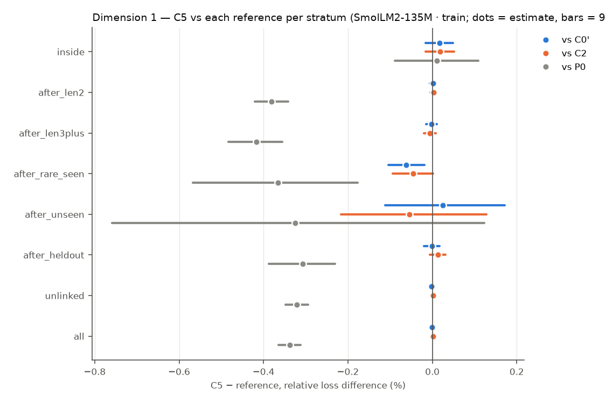
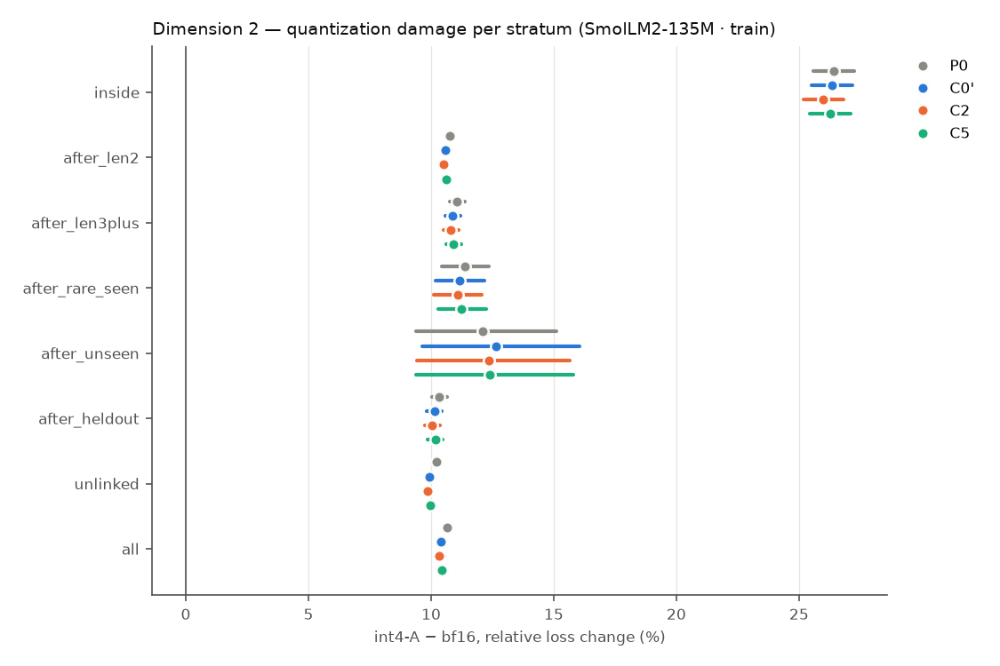
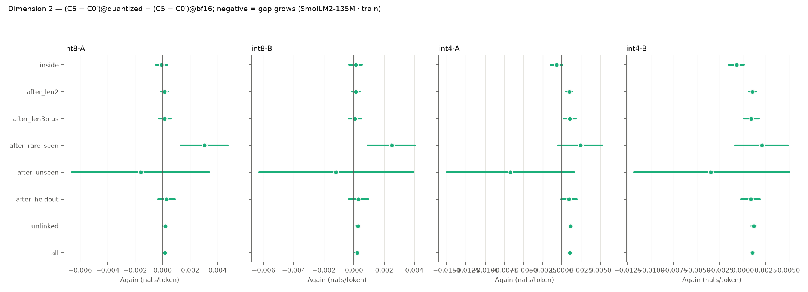
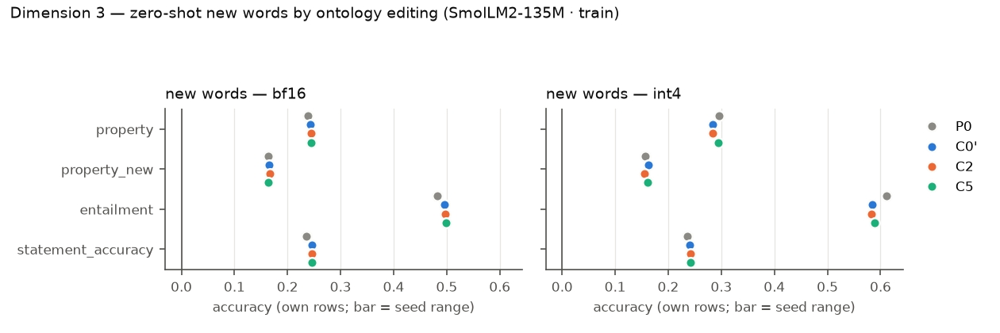
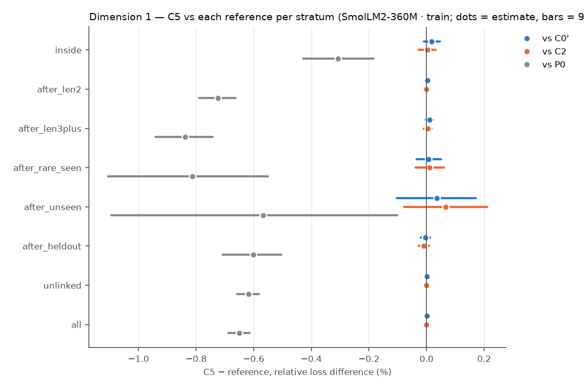
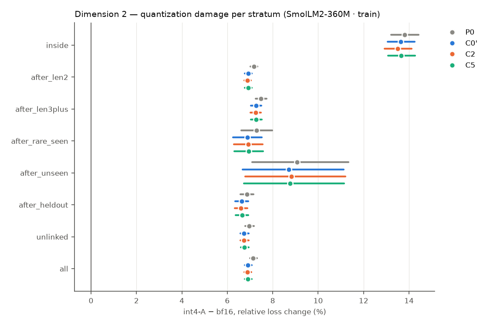
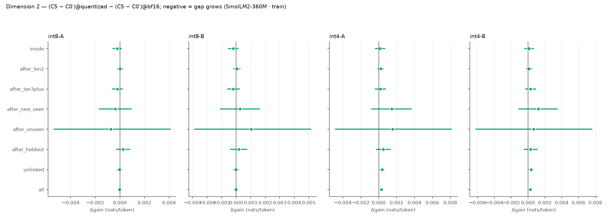
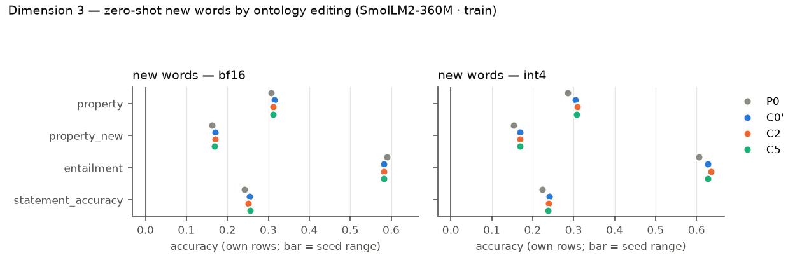

# R9 — retrofit × quantization (E9)

E9 asks three questions on pretrained hosts, all on one fixed test set: (1) does a VSA ontology channel trained jointly with the host improve it on long-token, rare and out-of-distribution words; (2) is the gap larger under weight quantization; (3) after training, can the model learn new or changed words zero-shot by editing the ontology alone? Models: **P0** the original host (evaluation only), **C0′** continued training without the channel, **C2** the same with a capacity-matched free per-concept table, **C5** the same with the attentive VSA channel. Loss differences are condition − reference (negative = lower loss), token-weighted and pooled over common seeds, with 95% cluster bootstraps over evaluation windows (10000 resamples); `*` = Holm-adjusted p < 0.05 within the family named in each table. P0 has no training randomness and pairs with every seed.

## SmolLM2-135M · train

Seeds: P0 [1]; C0' [1]; C2 [1]; C5 [1].

### Dimension 1 — C5 vs C0′, C2 and P0 (bf16)

> single seed: CIs cover evaluation windows or items only, not seed variance.

Relative loss difference [95% CI] (Holm over the three references within each stratum):

| Stratum | Targets | C5 − C0′ | C5 − C2 | C5 − P0 | C2 − C0′ | C0′ − P0 |
|---|---:|---|---|---|---|---|
| inside (long-token words) | 70221 | +0.02% [-0.02, +0.05] | +0.02% [-0.02, +0.05] | +0.01% [-0.09, +0.11] | -0.00% [-0.03, +0.03] | -0.01% [-0.11, +0.09] |
| after_len2 (long-token words) | 331810 | +0.00% [-0.01, +0.01] | +0.00% [-0.00, +0.01] | -0.38% [-0.42, -0.34]* | -0.00% [-0.01, +0.01] | -0.38% [-0.42, -0.34] |
| after_len3plus (long-token words) | 88781 | -0.00% [-0.02, +0.01] | -0.01% [-0.02, +0.01] | -0.42% [-0.48, -0.36]* | +0.00% [-0.01, +0.02] | -0.41% [-0.48, -0.35] |
| after_rare_seen (rare words) | 7742 | -0.06% [-0.10, -0.02]* | -0.05% [-0.09, +0.00] | -0.37% [-0.57, -0.18]* | -0.02% [-0.05, +0.02] | -0.30% [-0.51, -0.11] |
| after_unseen (out of distribution) | 836 | +0.02% [-0.11, +0.17] | -0.05% [-0.22, +0.13] | -0.33% [-0.76, +0.12] | +0.08% [-0.07, +0.23] | -0.35% [-0.74, +0.06] |
| after_heldout (out of distribution) | 49903 | -0.00% [-0.02, +0.02] | +0.01% [-0.01, +0.03] | -0.31% [-0.39, -0.23]* | -0.01% [-0.03, +0.00] | -0.31% [-0.39, -0.23] |
| unlinked (locality) | 624859 | -0.00% [-0.01, +0.00] | +0.00% [-0.00, +0.01] | -0.32% [-0.35, -0.29]* | -0.00% [-0.01, -0.00] | -0.32% [-0.35, -0.29] |
| all (locality) | 1047552 | -0.00% [-0.00, +0.00] | +0.00% [-0.00, +0.01] | -0.34% [-0.36, -0.31]* | -0.00% [-0.01, +0.00] | -0.34% [-0.36, -0.31] |

Absolute differences (nats/token):

| Stratum | C5 − C0′ | C5 − C2 | C5 − P0 |
|---|---|---|---|
| inside | +0.0002 [-0.0002, +0.0005] | +0.0002 [-0.0002, +0.0005] | +0.0001 [-0.0009, +0.0011] |
| after_len2 | +0.0000 [-0.0001, +0.0002] | +0.0001 [-0.0001, +0.0003] | -0.0102 [-0.0112, -0.0091]* |
| after_len3plus | -0.0001 [-0.0004, +0.0003] | -0.0002 [-0.0005, +0.0002] | -0.0112 [-0.0130, -0.0095]* |
| after_rare_seen | -0.0018 [-0.0030, -0.0006]* | -0.0013 [-0.0027, +0.0000] | -0.0105 [-0.0163, -0.0051]* |
| after_unseen | +0.0007 [-0.0033, +0.0050] | -0.0016 [-0.0062, +0.0038] | -0.0095 [-0.0224, +0.0035] |
| after_heldout | -0.0000 [-0.0005, +0.0005] | +0.0003 [-0.0002, +0.0008] | -0.0085 [-0.0107, -0.0063]* |
| unlinked | -0.0001 [-0.0002, +0.0001] | +0.0001 [-0.0001, +0.0002] | -0.0096 [-0.0104, -0.0088]* |
| all | -0.0000 [-0.0001, +0.0001] | +0.0000 [-0.0001, +0.0001] | -0.0094 [-0.0102, -0.0087]* |

Probe differences (bf16): C5 − reference per subset, per seed (paired bootstrap over items):

| Reference | Seed | Probe | all | heldout | seen | unlinked |
|---|---:|---|---|---|---|---|
| C0' | 1 | lambada/accuracy | -0.000 [-0.003, +0.003] (n 5153) | +0.000 [-0.043, +0.043] (n 69) | +0.000 [-0.010, +0.012] (n 513) | -0.000 [-0.003, +0.002] (n 4571) |
| C0' | 1 | wic/probe_accuracy | +0.002 [-0.013, +0.016] (n 638) | -0.031 [-0.094, +0.000] (n 32) | +0.012 [-0.012, +0.035] (n 173) | +0.000 [-0.016, +0.016] (n 433) |
| C0' | 1 | card660/spearman_tied | +0.002 [-0.003, +0.006] (n 660) | -0.007 [-0.035, +0.016] (n 34) | +0.004 [-0.004, +0.013] (n 328) | -0.002 [-0.008, +0.003] (n 298) |
| C0' | 1 | rare_words/spearman_tied | -0.001 [-0.003, +0.001] (n 2034) | -0.004 [-0.015, +0.007] (n 136) | -0.002 [-0.005, +0.001] (n 1113) | +0.000 [-0.002, +0.003] (n 785) |
| C0' | 1 | wsd/probe_f1 | +0.000 [-0.002, +0.002] (n 7253) | +0.000 [+0.000, +0.000] (n 75) | -0.004 [-0.010, +0.000] (n 515) | +0.000 [-0.002, +0.002] (n 6663) |
| C0' | 1 | bless/pair_probe_macro_f1 | -0.000 [-0.003, +0.003] (n 4310) | -0.007 [-0.023, +0.000] (n 95) | -0.001 [-0.007, +0.005] (n 1796) | +0.001 [-0.002, +0.004] (n 2419) |
| C0' | 1 | bless/prompt_auc | -0.001 [-0.001, -0.001] (n 14547) | -0.001 [-0.003, +0.002] (n 419) | -0.001 [-0.002, -0.000] (n 5133) | -0.001 [-0.001, -0.000] (n 8995) |
| C0' | 1 | hyperlex/cosine_spearman | +0.000 [-0.001, +0.002] (n 2616) | +0.006 [-0.013, +0.026] (n 77) | -0.004 [-0.012, +0.004] (n 436) | +0.001 [-0.000, +0.002] (n 2103) |
| C2 | 1 | lambada/accuracy | -0.001 [-0.004, +0.001] (n 5153) | +0.029 [+0.000, +0.072] (n 69) | -0.008 [-0.018, +0.000] (n 513) | -0.001 [-0.004, +0.002] (n 4571) |
| C2 | 1 | wic/probe_accuracy | +0.005 [-0.006, +0.016] (n 638) | -0.031 [-0.094, +0.000] (n 32) | +0.006 [-0.012, +0.029] (n 173) | +0.007 [-0.005, +0.021] (n 433) |
| C2 | 1 | card660/spearman_tied | +0.003 [-0.002, +0.008] (n 660) | -0.008 [-0.036, +0.012] (n 34) | +0.006 [-0.003, +0.016] (n 328) | -0.001 [-0.006, +0.003] (n 298) |
| C2 | 1 | rare_words/spearman_tied | -0.001 [-0.004, +0.001] (n 2034) | -0.004 [-0.018, +0.009] (n 136) | -0.002 [-0.006, +0.001] (n 1113) | -0.000 [-0.003, +0.003] (n 785) |
| C2 | 1 | wsd/probe_f1 | +0.001 [-0.001, +0.002] (n 7253) | +0.000 [+0.000, +0.000] (n 75) | -0.002 [-0.006, +0.000] (n 515) | +0.001 [-0.001, +0.003] (n 6663) |
| C2 | 1 | bless/pair_probe_macro_f1 | +0.002 [-0.001, +0.005] (n 4310) | -0.007 [-0.023, +0.000] (n 95) | +0.001 [-0.004, +0.007] (n 1796) | +0.003 [-0.000, +0.007] (n 2419) |
| C2 | 1 | bless/prompt_auc | -0.001 [-0.002, -0.001] (n 14547) | -0.001 [-0.004, +0.001] (n 419) | -0.002 [-0.003, -0.001] (n 5133) | -0.001 [-0.001, -0.000] (n 8995) |
| C2 | 1 | hyperlex/cosine_spearman | -0.000 [-0.002, +0.002] (n 2616) | +0.016 [-0.008, +0.049] (n 77) | -0.006 [-0.018, +0.006] (n 436) | +0.000 [-0.001, +0.001] (n 2103) |
| P0 | 1 | lambada/accuracy | +0.007 [+0.002, +0.013] (n 5153) | -0.014 [-0.072, +0.043] (n 69) | -0.012 [-0.029, +0.004] (n 513) | +0.010 [+0.004, +0.016] (n 4571) |
| P0 | 1 | wic/probe_accuracy | +0.013 [-0.016, +0.042] (n 638) | +0.062 [-0.062, +0.188] (n 32) | +0.029 [-0.023, +0.081] (n 173) | +0.002 [-0.035, +0.042] (n 433) |
| P0 | 1 | card660/spearman_tied | +0.004 [-0.009, +0.016] (n 660) | -0.019 [-0.125, +0.043] (n 34) | +0.006 [-0.012, +0.026] (n 328) | -0.002 [-0.020, +0.016] (n 298) |
| P0 | 1 | rare_words/spearman_tied | +0.003 [-0.005, +0.012] (n 2034) | -0.001 [-0.039, +0.044] (n 136) | -0.007 [-0.018, +0.004] (n 1113) | +0.020 [+0.005, +0.036] (n 785) |
| P0 | 1 | wsd/probe_f1 | +0.000 [-0.002, +0.004] (n 7253) | +0.000 [+0.000, +0.000] (n 75) | -0.004 [-0.010, +0.000] (n 515) | +0.001 [-0.003, +0.004] (n 6663) |
| P0 | 1 | bless/pair_probe_macro_f1 | +0.003 [-0.003, +0.009] (n 4310) | +0.001 [-0.001, +0.008] (n 95) | +0.004 [-0.005, +0.014] (n 1796) | +0.002 [-0.006, +0.011] (n 2419) |
| P0 | 1 | bless/prompt_auc | +0.008 [+0.006, +0.010] (n 14547) | -0.006 [-0.012, +0.000] (n 419) | +0.013 [+0.010, +0.017] (n 5133) | +0.005 [+0.003, +0.007] (n 8995) |
| P0 | 1 | hyperlex/cosine_spearman | +0.007 [+0.001, +0.014] (n 2616) | +0.021 [-0.030, +0.078] (n 77) | -0.004 [-0.020, +0.012] (n 436) | +0.010 [+0.003, +0.017] (n 2103) |

### Dimension 2 — quantization damage and the gap under quantization

Quantization damage `variant − bf16`, relative [95% CI] (A = channel FP16, B = channel quantized; models without a channel have B = A):

| Stratum | Model | int8-A | int8-B | int4-A | int4-B |
|---|---|---|---|---|---|
| inside | P0 | +0.54% [+0.47, +0.61] | +0.54% [+0.47, +0.61] | +26.40% [+25.59, +27.24] | +26.40% [+25.59, +27.24] |
| inside | C0' | +0.48% [+0.41, +0.54] | +0.48% [+0.41, +0.54] | +26.33% [+25.53, +27.18] | +26.33% [+25.53, +27.18] |
| inside | C2 | +0.48% [+0.41, +0.54] | +0.50% [+0.44, +0.57] | +25.97% [+25.17, +26.81] | +25.98% [+25.18, +26.81] |
| inside | C5 | +0.47% [+0.41, +0.54] | +0.49% [+0.42, +0.56] | +26.27% [+25.45, +27.11] | +26.27% [+25.46, +27.11] |
| after_len2 | P0 | +0.09% [+0.08, +0.10] | +0.09% [+0.08, +0.10] | +10.77% [+10.60, +10.95] | +10.77% [+10.60, +10.95] |
| after_len2 | C0' | +0.09% [+0.08, +0.11] | +0.09% [+0.08, +0.11] | +10.60% [+10.43, +10.77] | +10.60% [+10.43, +10.77] |
| after_len2 | C2 | +0.10% [+0.09, +0.11] | +0.10% [+0.09, +0.11] | +10.51% [+10.34, +10.68] | +10.51% [+10.34, +10.69] |
| after_len2 | C5 | +0.10% [+0.09, +0.11] | +0.10% [+0.09, +0.11] | +10.63% [+10.46, +10.81] | +10.64% [+10.47, +10.81] |
| after_len3plus | P0 | +0.09% [+0.07, +0.12] | +0.09% [+0.07, +0.12] | +11.06% [+10.75, +11.38] | +11.06% [+10.75, +11.38] |
| after_len3plus | C0' | +0.09% [+0.07, +0.12] | +0.09% [+0.07, +0.12] | +10.88% [+10.59, +11.19] | +10.88% [+10.59, +11.19] |
| after_len3plus | C2 | +0.10% [+0.08, +0.12] | +0.09% [+0.07, +0.11] | +10.81% [+10.51, +11.12] | +10.80% [+10.51, +11.12] |
| after_len3plus | C5 | +0.10% [+0.08, +0.12] | +0.09% [+0.07, +0.12] | +10.92% [+10.63, +11.24] | +10.92% [+10.62, +11.23] |
| after_rare_seen | P0 | +0.10% [+0.03, +0.17] | +0.10% [+0.03, +0.17] | +11.36% [+10.43, +12.37] | +11.36% [+10.43, +12.37] |
| after_rare_seen | C0' | +0.05% [-0.03, +0.12] | +0.05% [-0.03, +0.12] | +11.15% [+10.19, +12.16] | +11.15% [+10.19, +12.16] |
| after_rare_seen | C2 | +0.08% [+0.01, +0.15] | +0.09% [+0.01, +0.16] | +11.08% [+10.12, +12.08] | +11.10% [+10.14, +12.11] |
| after_rare_seen | C5 | +0.16% [+0.08, +0.23] | +0.14% [+0.06, +0.21] | +11.24% [+10.28, +12.25] | +11.23% [+10.27, +12.24] |
| after_unseen | P0 | +0.26% [+0.02, +0.48] | +0.26% [+0.02, +0.48] | +12.12% [+9.38, +15.11] | +12.12% [+9.38, +15.11] |
| after_unseen | C0' | +0.29% [+0.06, +0.50] | +0.29% [+0.06, +0.50] | +12.65% [+9.64, +16.05] | +12.65% [+9.64, +16.05] |
| after_unseen | C2 | +0.20% [-0.03, +0.43] | +0.11% [-0.11, +0.31] | +12.34% [+9.41, +15.65] | +12.32% [+9.43, +15.55] |
| after_unseen | C5 | +0.23% [-0.00, +0.45] | +0.24% [+0.02, +0.46] | +12.41% [+9.38, +15.78] | +12.52% [+9.48, +15.94] |
| after_heldout | P0 | +0.10% [+0.07, +0.13] | +0.10% [+0.07, +0.13] | +10.34% [+10.02, +10.67] | +10.34% [+10.02, +10.67] |
| after_heldout | C0' | +0.09% [+0.06, +0.12] | +0.09% [+0.06, +0.12] | +10.14% [+9.83, +10.45] | +10.14% [+9.83, +10.45] |
| after_heldout | C2 | +0.12% [+0.09, +0.14] | +0.11% [+0.08, +0.14] | +10.04% [+9.73, +10.35] | +10.04% [+9.73, +10.36] |
| after_heldout | C5 | +0.10% [+0.07, +0.13] | +0.10% [+0.07, +0.13] | +10.17% [+9.86, +10.49] | +10.17% [+9.86, +10.49] |
| unlinked | P0 | +0.12% [+0.11, +0.12] | +0.12% [+0.11, +0.12] | +10.22% [+10.10, +10.33] | +10.22% [+10.10, +10.33] |
| unlinked | C0' | +0.11% [+0.10, +0.12] | +0.11% [+0.10, +0.12] | +9.93% [+9.82, +10.04] | +9.93% [+9.82, +10.04] |
| unlinked | C2 | +0.12% [+0.11, +0.13] | +0.12% [+0.11, +0.13] | +9.87% [+9.76, +9.98] | +9.87% [+9.76, +9.98] |
| unlinked | C5 | +0.12% [+0.11, +0.13] | +0.12% [+0.11, +0.13] | +9.97% [+9.86, +10.08] | +9.97% [+9.86, +10.08] |
| all | P0 | +0.11% [+0.11, +0.12] | +0.11% [+0.11, +0.12] | +10.65% [+10.54, +10.77] | +10.65% [+10.54, +10.77] |
| all | C0' | +0.11% [+0.10, +0.12] | +0.11% [+0.10, +0.12] | +10.41% [+10.30, +10.52] | +10.41% [+10.30, +10.52] |
| all | C2 | +0.12% [+0.11, +0.12] | +0.12% [+0.11, +0.12] | +10.33% [+10.22, +10.45] | +10.33% [+10.22, +10.45] |
| all | C5 | +0.12% [+0.11, +0.12] | +0.12% [+0.11, +0.13] | +10.44% [+10.33, +10.56] | +10.45% [+10.33, +10.56] |

Gap under quantization vs C0': gain = C5 − C0' at bf16 and quantized, `Δgain` = difference in differences (negative = the channel's advantage grows under quantization; Holm over references × variants within each stratum), retained = gain_q / gain_bf16:

| Stratum | Variant | gain bf16 | gain quantized | Δgain [95% CI] | retained |
|---|---|---|---|---|---|
| inside | int8-A | +0.0001 [-0.0002, +0.0004] | +0.0000 [-0.0003, +0.0004] | -0.0001 [-0.0005, +0.0004] | 0.24 |
| inside | int8-B | +0.0001 [-0.0002, +0.0004] | +0.0002 [-0.0002, +0.0006] | +0.0001 [-0.0003, +0.0005] | 2.06 |
| inside | int4-A | +0.0001 [-0.0002, +0.0004] | -0.0006 [-0.0014, +0.0002] | -0.0007 [-0.0015, +0.0001] | -5.84 |
| inside | int4-B | +0.0001 [-0.0002, +0.0004] | -0.0006 [-0.0014, +0.0002] | -0.0007 [-0.0015, +0.0001] | -5.68 |
| after_len2 | int8-A | +0.0001 [-0.0001, +0.0003] | +0.0002 [-0.0000, +0.0004] | +0.0001 [-0.0001, +0.0004] | 3.06 |
| after_len2 | int8-B | +0.0001 [-0.0001, +0.0003] | +0.0002 [-0.0000, +0.0004] | +0.0001 [-0.0001, +0.0004] | 2.95 |
| after_len2 | int4-A | +0.0001 [-0.0001, +0.0003] | +0.0010 [+0.0006, +0.0014] | +0.0010 [+0.0005, +0.0014]* | 16.31 |
| after_len2 | int4-B | +0.0001 [-0.0001, +0.0003] | +0.0011 [+0.0007, +0.0015] | +0.0010 [+0.0006, +0.0015]* | 17.78 |
| after_len3plus | int8-A | -0.0000 [-0.0004, +0.0003] | +0.0001 [-0.0003, +0.0005] | +0.0001 [-0.0003, +0.0006] | -2.00 |
| after_len3plus | int8-B | -0.0000 [-0.0004, +0.0003] | +0.0000 [-0.0004, +0.0004] | +0.0001 [-0.0004, +0.0005] | -0.03 |
| after_len3plus | int4-A | -0.0000 [-0.0004, +0.0003] | +0.0010 [+0.0002, +0.0017] | +0.0010 [+0.0002, +0.0018] | -19.41 |
| after_len3plus | int4-B | -0.0000 [-0.0004, +0.0003] | +0.0009 [+0.0001, +0.0017] | +0.0009 [+0.0001, +0.0017] | -17.68 |
| after_rare_seen | int8-A | -0.0017 [-0.0029, -0.0004] | +0.0014 [-0.0001, +0.0029] | +0.0030 [+0.0013, +0.0047]* | -0.84 |
| after_rare_seen | int8-B | -0.0017 [-0.0029, -0.0004] | +0.0008 [-0.0006, +0.0022] | +0.0025 [+0.0009, +0.0040]* | -0.50 |
| after_rare_seen | int4-A | -0.0017 [-0.0029, -0.0004] | +0.0008 [-0.0019, +0.0034] | +0.0025 [-0.0005, +0.0053] | -0.48 |
| after_rare_seen | int4-B | -0.0017 [-0.0029, -0.0004] | +0.0004 [-0.0024, +0.0031] | +0.0021 [-0.0008, +0.0049] | -0.26 |
| after_unseen | int8-A | +0.0017 [-0.0027, +0.0063] | +0.0001 [-0.0045, +0.0048] | -0.0016 [-0.0066, +0.0034] | 0.03 |
| after_unseen | int8-B | +0.0017 [-0.0027, +0.0063] | +0.0005 [-0.0042, +0.0053] | -0.0012 [-0.0063, +0.0040] | 0.27 |
| after_unseen | int4-A | +0.0017 [-0.0027, +0.0063] | -0.0051 [-0.0118, +0.0020] | -0.0067 [-0.0150, +0.0016] | -3.07 |
| after_unseen | int4-B | +0.0017 [-0.0027, +0.0063] | -0.0018 [-0.0088, +0.0055] | -0.0035 [-0.0118, +0.0051] | -1.10 |
| after_heldout | int8-A | -0.0000 [-0.0006, +0.0005] | +0.0002 [-0.0003, +0.0007] | +0.0003 [-0.0003, +0.0009] | -4.51 |
| after_heldout | int8-B | -0.0000 [-0.0006, +0.0005] | +0.0002 [-0.0003, +0.0008] | +0.0003 [-0.0004, +0.0010] | -4.80 |
| after_heldout | int4-A | -0.0000 [-0.0006, +0.0005] | +0.0009 [-0.0001, +0.0019] | +0.0009 [-0.0001, +0.0020] | -18.03 |
| after_heldout | int4-B | -0.0000 [-0.0006, +0.0005] | +0.0008 [-0.0002, +0.0018] | +0.0009 [-0.0002, +0.0019] | -16.81 |
| unlinked | int8-A | -0.0000 [-0.0002, +0.0001] | +0.0001 [+0.0000, +0.0003] | +0.0002 [+0.0000, +0.0004] | -3.74 |
| unlinked | int8-B | -0.0000 [-0.0002, +0.0001] | +0.0002 [+0.0001, +0.0004] | +0.0003 [+0.0001, +0.0004]* | -5.78 |
| unlinked | int4-A | -0.0000 [-0.0002, +0.0001] | +0.0011 [+0.0008, +0.0014] | +0.0011 [+0.0009, +0.0014]* | -28.84 |
| unlinked | int4-B | -0.0000 [-0.0002, +0.0001] | +0.0011 [+0.0009, +0.0014] | +0.0012 [+0.0009, +0.0015]* | -29.77 |
| all | int8-A | -0.0000 [-0.0001, +0.0001] | +0.0001 [+0.0000, +0.0002] | +0.0002 [+0.0000, +0.0003] | -9.61 |
| all | int8-B | -0.0000 [-0.0001, +0.0001] | +0.0002 [+0.0001, +0.0003] | +0.0002 [+0.0001, +0.0003]* | -13.05 |
| all | int4-A | -0.0000 [-0.0001, +0.0001] | +0.0010 [+0.0008, +0.0012] | +0.0010 [+0.0008, +0.0012]* | -68.74 |
| all | int4-B | -0.0000 [-0.0001, +0.0001] | +0.0010 [+0.0008, +0.0012] | +0.0010 [+0.0008, +0.0013]* | -71.24 |

Gap under quantization vs C2: gain = C5 − C2 at bf16 and quantized, `Δgain` = difference in differences (negative = the channel's advantage grows under quantization; Holm over references × variants within each stratum), retained = gain_q / gain_bf16:

| Stratum | Variant | gain bf16 | gain quantized | Δgain [95% CI] | retained |
|---|---|---|---|---|---|
| inside | int8-A | +0.0001 [-0.0002, +0.0005] | +0.0001 [-0.0003, +0.0004] | -0.0001 [-0.0005, +0.0004] | 0.44 |
| inside | int8-B | +0.0001 [-0.0002, +0.0005] | -0.0000 [-0.0004, +0.0003] | -0.0001 [-0.0006, +0.0003] | -0.19 |
| inside | int4-A | +0.0001 [-0.0002, +0.0005] | +0.0032 [+0.0021, +0.0042] | +0.0031 [+0.0020, +0.0041]* | 27.28 |
| inside | int4-B | +0.0001 [-0.0002, +0.0005] | +0.0032 [+0.0021, +0.0042] | +0.0031 [+0.0019, +0.0042]* | 27.26 |
| after_len2 | int8-A | +0.0001 [-0.0001, +0.0003] | +0.0001 [-0.0001, +0.0003] | +0.0000 [-0.0002, +0.0003] | 1.09 |
| after_len2 | int8-B | +0.0001 [-0.0001, +0.0003] | +0.0000 [-0.0002, +0.0002] | -0.0001 [-0.0003, +0.0002] | 0.08 |
| after_len2 | int4-A | +0.0001 [-0.0001, +0.0003] | +0.0034 [+0.0029, +0.0040] | +0.0034 [+0.0028, +0.0039]* | 40.54 |
| after_len2 | int4-B | +0.0001 [-0.0001, +0.0003] | +0.0035 [+0.0030, +0.0040] | +0.0034 [+0.0029, +0.0040]* | 41.46 |
| after_len3plus | int8-A | -0.0002 [-0.0005, +0.0002] | -0.0001 [-0.0005, +0.0003] | +0.0000 [-0.0004, +0.0005] | 0.91 |
| after_len3plus | int8-B | -0.0002 [-0.0005, +0.0002] | -0.0000 [-0.0005, +0.0004] | +0.0001 [-0.0004, +0.0006] | 0.30 |
| after_len3plus | int4-A | -0.0002 [-0.0005, +0.0002] | +0.0029 [+0.0019, +0.0038] | +0.0030 [+0.0020, +0.0040]* | -18.57 |
| after_len3plus | int4-B | -0.0002 [-0.0005, +0.0002] | +0.0029 [+0.0019, +0.0038] | +0.0030 [+0.0020, +0.0040]* | -18.39 |
| after_rare_seen | int8-A | -0.0012 [-0.0026, +0.0001] | +0.0009 [-0.0007, +0.0024] | +0.0020 [+0.0004, +0.0038] | -0.73 |
| after_rare_seen | int8-B | -0.0012 [-0.0026, +0.0001] | +0.0002 [-0.0013, +0.0016] | +0.0014 [-0.0003, +0.0030] | -0.15 |
| after_rare_seen | int4-A | -0.0012 [-0.0026, +0.0001] | +0.0034 [-0.0001, +0.0068] | +0.0046 [+0.0010, +0.0082] | -2.90 |
| after_rare_seen | int4-B | -0.0012 [-0.0026, +0.0001] | +0.0025 [-0.0012, +0.0060] | +0.0036 [-0.0001, +0.0073] | -2.08 |
| after_unseen | int8-A | -0.0007 [-0.0055, +0.0050] | +0.0002 [-0.0046, +0.0052] | +0.0009 [-0.0036, +0.0053] | -0.32 |
| after_unseen | int8-B | -0.0007 [-0.0055, +0.0050] | +0.0033 [-0.0012, +0.0081] | +0.0040 [-0.0013, +0.0089] | -5.08 |
| after_unseen | int4-A | -0.0007 [-0.0055, +0.0050] | +0.0012 [-0.0063, +0.0090] | +0.0019 [-0.0069, +0.0107] | -1.85 |
| after_unseen | int4-B | -0.0007 [-0.0055, +0.0050] | +0.0051 [-0.0032, +0.0133] | +0.0058 [-0.0042, +0.0155] | -7.88 |
| after_heldout | int8-A | +0.0003 [-0.0002, +0.0008] | -0.0001 [-0.0006, +0.0004] | -0.0004 [-0.0010, +0.0002] | -0.33 |
| after_heldout | int8-B | +0.0003 [-0.0002, +0.0008] | +0.0001 [-0.0005, +0.0007] | -0.0002 [-0.0009, +0.0004] | 0.36 |
| after_heldout | int4-A | +0.0003 [-0.0002, +0.0008] | +0.0040 [+0.0028, +0.0053] | +0.0037 [+0.0024, +0.0050]* | 12.30 |
| after_heldout | int4-B | +0.0003 [-0.0002, +0.0008] | +0.0040 [+0.0027, +0.0052] | +0.0036 [+0.0023, +0.0049]* | 12.08 |
| unlinked | int8-A | +0.0001 [-0.0000, +0.0002] | +0.0001 [-0.0000, +0.0002] | +0.0000 [-0.0002, +0.0002] | 1.15 |
| unlinked | int8-B | +0.0001 [-0.0000, +0.0002] | +0.0002 [+0.0001, +0.0003] | +0.0001 [-0.0001, +0.0003] | 2.33 |
| unlinked | int4-A | +0.0001 [-0.0000, +0.0002] | +0.0030 [+0.0026, +0.0034] | +0.0029 [+0.0025, +0.0033]* | 35.79 |
| unlinked | int4-B | +0.0001 [-0.0000, +0.0002] | +0.0032 [+0.0028, +0.0035] | +0.0031 [+0.0027, +0.0035]* | 37.31 |
| all | int8-A | +0.0001 [-0.0000, +0.0002] | +0.0001 [-0.0000, +0.0002] | +0.0000 [-0.0001, +0.0002] | 1.40 |
| all | int8-B | +0.0001 [-0.0000, +0.0002] | +0.0001 [+0.0000, +0.0002] | +0.0001 [-0.0001, +0.0002] | 2.08 |
| all | int4-A | +0.0001 [-0.0000, +0.0002] | +0.0031 [+0.0028, +0.0035] | +0.0031 [+0.0028, +0.0034]* | 53.06 |
| all | int4-B | +0.0001 [-0.0000, +0.0002] | +0.0032 [+0.0029, +0.0035] | +0.0032 [+0.0028, +0.0035]* | 54.36 |

Gap under quantization vs P0: gain = C5 − P0 at bf16 and quantized, `Δgain` = difference in differences (negative = the channel's advantage grows under quantization; Holm over references × variants within each stratum), retained = gain_q / gain_bf16:

| Stratum | Variant | gain bf16 | gain quantized | Δgain [95% CI] | retained |
|---|---|---|---|---|---|
| inside | int8-A | +0.0000 [-0.0010, +0.0011] | -0.0007 [-0.0018, +0.0005] | -0.0007 [-0.0014, -0.0000] | -14.92 |
| inside | int8-B | +0.0000 [-0.0010, +0.0011] | -0.0005 [-0.0016, +0.0007] | -0.0005 [-0.0012, +0.0002] | -10.69 |
| inside | int4-A | +0.0000 [-0.0010, +0.0011] | -0.0013 [-0.0045, +0.0018] | -0.0014 [-0.0044, +0.0017] | -30.40 |
| inside | int4-B | +0.0000 [-0.0010, +0.0011] | -0.0013 [-0.0045, +0.0019] | -0.0014 [-0.0045, +0.0017] | -30.03 |
| after_len2 | int8-A | -0.0102 [-0.0112, -0.0091] | -0.0099 [-0.0110, -0.0089] | +0.0002 [-0.0001, +0.0006] | 0.98 |
| after_len2 | int8-B | -0.0102 [-0.0112, -0.0091] | -0.0099 [-0.0110, -0.0089] | +0.0002 [-0.0001, +0.0005] | 0.98 |
| after_len2 | int4-A | -0.0102 [-0.0112, -0.0091] | -0.0148 [-0.0165, -0.0131] | -0.0047 [-0.0061, -0.0033]* | 1.46 |
| after_len2 | int4-B | -0.0102 [-0.0112, -0.0091] | -0.0147 [-0.0164, -0.0131] | -0.0046 [-0.0060, -0.0032]* | 1.45 |
| after_len3plus | int8-A | -0.0112 [-0.0130, -0.0095] | -0.0111 [-0.0129, -0.0094] | +0.0001 [-0.0006, +0.0007] | 0.99 |
| after_len3plus | int8-B | -0.0112 [-0.0130, -0.0095] | -0.0112 [-0.0130, -0.0095] | -0.0000 [-0.0007, +0.0007] | 1.00 |
| after_len3plus | int4-A | -0.0112 [-0.0130, -0.0095] | -0.0160 [-0.0192, -0.0130] | -0.0048 [-0.0076, -0.0021]* | 1.43 |
| after_len3plus | int4-B | -0.0112 [-0.0130, -0.0095] | -0.0161 [-0.0193, -0.0131] | -0.0049 [-0.0076, -0.0022]* | 1.44 |
| after_rare_seen | int8-A | -0.0104 [-0.0162, -0.0050] | -0.0088 [-0.0148, -0.0031] | +0.0016 [-0.0007, +0.0040] | 0.84 |
| after_rare_seen | int8-B | -0.0104 [-0.0162, -0.0050] | -0.0093 [-0.0154, -0.0036] | +0.0011 [-0.0012, +0.0035] | 0.90 |
| after_rare_seen | int4-A | -0.0104 [-0.0162, -0.0050] | -0.0150 [-0.0249, -0.0053] | -0.0046 [-0.0139, +0.0048] | 1.45 |
| after_rare_seen | int4-B | -0.0104 [-0.0162, -0.0050] | -0.0154 [-0.0252, -0.0057] | -0.0050 [-0.0142, +0.0043] | 1.48 |
| after_unseen | int8-A | -0.0086 [-0.0213, +0.0043] | -0.0095 [-0.0231, +0.0034] | -0.0009 [-0.0067, +0.0050] | 1.11 |
| after_unseen | int8-B | -0.0086 [-0.0213, +0.0043] | -0.0091 [-0.0221, +0.0037] | -0.0005 [-0.0068, +0.0059] | 1.06 |
| after_unseen | int4-A | -0.0086 [-0.0213, +0.0043] | -0.0011 [-0.0296, +0.0281] | +0.0075 [-0.0213, +0.0377] | 0.12 |
| after_unseen | int4-B | -0.0086 [-0.0213, +0.0043] | +0.0022 [-0.0261, +0.0314] | +0.0108 [-0.0182, +0.0411] | -0.25 |
| after_heldout | int8-A | -0.0085 [-0.0107, -0.0064] | -0.0086 [-0.0108, -0.0064] | -0.0001 [-0.0009, +0.0008] | 1.01 |
| after_heldout | int8-B | -0.0085 [-0.0107, -0.0064] | -0.0085 [-0.0108, -0.0064] | -0.0001 [-0.0009, +0.0008] | 1.01 |
| after_heldout | int4-A | -0.0085 [-0.0107, -0.0064] | -0.0140 [-0.0178, -0.0103] | -0.0055 [-0.0089, -0.0022]* | 1.65 |
| after_heldout | int4-B | -0.0085 [-0.0107, -0.0064] | -0.0141 [-0.0179, -0.0103] | -0.0056 [-0.0090, -0.0023]* | 1.66 |
| unlinked | int8-A | -0.0095 [-0.0103, -0.0088] | -0.0095 [-0.0103, -0.0087] | +0.0001 [-0.0002, +0.0003] | 0.99 |
| unlinked | int8-B | -0.0095 [-0.0103, -0.0088] | -0.0094 [-0.0102, -0.0086] | +0.0002 [-0.0001, +0.0004] | 0.98 |
| unlinked | int4-A | -0.0095 [-0.0103, -0.0088] | -0.0179 [-0.0192, -0.0166] | -0.0083 [-0.0095, -0.0072]* | 1.88 |
| unlinked | int4-B | -0.0095 [-0.0103, -0.0088] | -0.0178 [-0.0191, -0.0166] | -0.0083 [-0.0094, -0.0072]* | 1.87 |
| all | int8-A | -0.0094 [-0.0102, -0.0087] | -0.0093 [-0.0101, -0.0086] | +0.0001 [-0.0001, +0.0003] | 0.99 |
| all | int8-B | -0.0094 [-0.0102, -0.0087] | -0.0093 [-0.0100, -0.0086] | +0.0001 [-0.0001, +0.0004] | 0.98 |
| all | int4-A | -0.0094 [-0.0102, -0.0087] | -0.0162 [-0.0173, -0.0151] | -0.0068 [-0.0077, -0.0058]* | 1.72 |
| all | int4-B | -0.0094 [-0.0102, -0.0087] | -0.0162 [-0.0172, -0.0151] | -0.0067 [-0.0076, -0.0058]* | 1.71 |

> Single seed in at least one model: CIs cover evaluation windows only.

Probe damage int4 − bf16 per model (paired over items; all items / held-out / seen):

| Model | Seed | Probe | all | heldout | seen |
|---|---:|---|---|---|---|
| P0 | 1 | lambada/accuracy | -0.038 [-0.049, -0.027] | -0.043 [-0.130, +0.043] | -0.084 [-0.119, -0.049] |
| P0 | 1 | wic/probe_accuracy | +0.039 [-0.002, +0.080] | +0.156 [-0.001, +0.344] | -0.012 [-0.081, +0.064] |
| P0 | 1 | card660/spearman_tied | +0.018 [-0.022, +0.056] | +0.069 [-0.052, +0.219] | -0.002 [-0.058, +0.049] |
| P0 | 1 | rare_words/spearman_tied | -0.051 [-0.076, -0.029] | -0.087 [-0.181, -0.002] | -0.059 [-0.091, -0.027] |
| P0 | 1 | wsd/probe_f1 | -0.005 [-0.010, +0.001] | +0.000 [-0.053, +0.053] | -0.002 [-0.014, +0.010] |
| P0 | 1 | bless/pair_probe_macro_f1 | -0.020 [-0.030, -0.010] | -0.024 [-0.091, +0.039] | -0.031 [-0.048, -0.015] |
| P0 | 1 | bless/prompt_auc | -0.034 [-0.038, -0.029] | -0.050 [-0.078, -0.026] | -0.049 [-0.057, -0.041] |
| P0 | 1 | hyperlex/cosine_spearman | -0.019 [-0.038, -0.001] | +0.020 [-0.096, +0.131] | -0.020 [-0.075, +0.039] |
| C0' | 1 | lambada/accuracy | -0.015 [-0.025, -0.004] | -0.058 [-0.145, +0.029] | -0.047 [-0.082, -0.010] |
| C0' | 1 | wic/probe_accuracy | +0.028 [-0.016, +0.069] | +0.062 [-0.125, +0.250] | -0.006 [-0.081, +0.075] |
| C0' | 1 | card660/spearman_tied | +0.020 [-0.019, +0.056] | +0.105 [-0.035, +0.268] | +0.004 [-0.047, +0.056] |
| C0' | 1 | rare_words/spearman_tied | -0.043 [-0.065, -0.021] | -0.025 [-0.099, +0.050] | -0.059 [-0.088, -0.028] |
| C0' | 1 | wsd/probe_f1 | -0.001 [-0.006, +0.004] | +0.013 [-0.027, +0.067] | -0.002 [-0.014, +0.010] |
| C0' | 1 | bless/pair_probe_macro_f1 | -0.017 [-0.028, -0.007] | -0.018 [-0.070, +0.033] | -0.030 [-0.048, -0.014] |
| C0' | 1 | bless/prompt_auc | -0.027 [-0.032, -0.023] | -0.042 [-0.085, -0.002] | -0.044 [-0.052, -0.036] |
| C0' | 1 | hyperlex/cosine_spearman | -0.020 [-0.038, -0.004] | +0.033 [-0.093, +0.149] | -0.030 [-0.081, +0.023] |
| C2 | 1 | lambada/accuracy | -0.015 [-0.026, -0.004] | +0.000 [-0.087, +0.087] | -0.045 [-0.080, -0.008] |
| C2 | 1 | wic/probe_accuracy | +0.011 [-0.033, +0.052] | +0.000 [-0.156, +0.156] | -0.069 [-0.139, +0.000] |
| C2 | 1 | card660/spearman_tied | +0.020 [-0.018, +0.059] | +0.121 [-0.023, +0.300] | +0.004 [-0.049, +0.058] |
| C2 | 1 | rare_words/spearman_tied | -0.040 [-0.061, -0.018] | -0.036 [-0.115, +0.042] | -0.050 [-0.079, -0.019] |
| C2 | 1 | wsd/probe_f1 | -0.001 [-0.007, +0.004] | +0.013 [-0.027, +0.067] | +0.002 [-0.010, +0.014] |
| C2 | 1 | bless/pair_probe_macro_f1 | -0.018 [-0.029, -0.007] | -0.018 [-0.070, +0.033] | -0.027 [-0.045, -0.010] |
| C2 | 1 | bless/prompt_auc | -0.027 [-0.031, -0.022] | -0.050 [-0.094, -0.011] | -0.044 [-0.052, -0.036] |
| C2 | 1 | hyperlex/cosine_spearman | -0.022 [-0.040, -0.006] | +0.024 [-0.098, +0.141] | -0.033 [-0.084, +0.019] |
| C5 | 1 | lambada/accuracy | -0.015 [-0.026, -0.004] | -0.043 [-0.145, +0.043] | -0.041 [-0.076, -0.004] |
| C5 | 1 | wic/probe_accuracy | +0.024 [-0.020, +0.064] | +0.062 [-0.094, +0.219] | -0.017 [-0.087, +0.058] |
| C5 | 1 | card660/spearman_tied | +0.022 [-0.015, +0.060] | +0.115 [-0.027, +0.295] | +0.007 [-0.042, +0.057] |
| C5 | 1 | rare_words/spearman_tied | -0.041 [-0.063, -0.019] | -0.019 [-0.089, +0.052] | -0.055 [-0.085, -0.024] |
| C5 | 1 | wsd/probe_f1 | -0.004 [-0.009, +0.002] | +0.013 [-0.027, +0.067] | +0.002 [-0.008, +0.012] |
| C5 | 1 | bless/pair_probe_macro_f1 | -0.017 [-0.028, -0.007] | -0.001 [-0.058, +0.056] | -0.028 [-0.047, -0.010] |
| C5 | 1 | bless/prompt_auc | -0.017 [-0.021, -0.012] | -0.036 [-0.076, +0.003] | -0.033 [-0.041, -0.026] |
| C5 | 1 | hyperlex/cosine_spearman | -0.019 [-0.037, -0.002] | +0.010 [-0.115, +0.125] | -0.026 [-0.077, +0.025] |

Probe differences at int4 (variant A): C5 − reference per subset, per seed (paired bootstrap over items):

| Reference | Seed | Probe | all | heldout | seen | unlinked |
|---|---:|---|---|---|---|---|
| C0' | 1 | lambada/accuracy | -0.001 [-0.005, +0.003] (n 5153) | +0.014 [+0.000, +0.043] (n 69) | +0.006 [-0.006, +0.018] (n 513) | -0.002 [-0.006, +0.002] (n 4571) |
| C0' | 1 | wic/probe_accuracy | -0.003 [-0.022, +0.016] (n 638) | -0.031 [-0.125, +0.062] (n 32) | +0.000 [-0.029, +0.029] (n 173) | -0.002 [-0.025, +0.023] (n 433) |
| C0' | 1 | card660/spearman_tied | +0.004 [-0.003, +0.012] (n 660) | +0.003 [-0.034, +0.050] (n 34) | +0.007 [-0.004, +0.019] (n 328) | -0.004 [-0.016, +0.008] (n 298) |
| C0' | 1 | rare_words/spearman_tied | +0.001 [-0.003, +0.005] (n 2034) | +0.002 [-0.016, +0.021] (n 136) | +0.002 [-0.005, +0.008] (n 1113) | +0.001 [-0.006, +0.009] (n 785) |
| C0' | 1 | wsd/probe_f1 | -0.002 [-0.005, -0.000] (n 7253) | +0.000 [+0.000, +0.000] (n 75) | +0.000 [-0.006, +0.006] (n 515) | -0.003 [-0.005, -0.000] (n 6663) |
| C0' | 1 | bless/pair_probe_macro_f1 | -0.000 [-0.005, +0.005] (n 4310) | +0.010 [+0.000, +0.034] (n 95) | +0.001 [-0.008, +0.010] (n 1796) | +0.000 [-0.006, +0.007] (n 2419) |
| C0' | 1 | bless/prompt_auc | +0.010 [+0.009, +0.011] (n 14547) | +0.006 [+0.001, +0.012] (n 419) | +0.010 [+0.008, +0.012] (n 5133) | +0.010 [+0.010, +0.012] (n 8995) |
| C0' | 1 | hyperlex/cosine_spearman | +0.001 [-0.002, +0.005] (n 2616) | -0.017 [-0.055, +0.019] (n 77) | +0.000 [-0.011, +0.010] (n 436) | +0.003 [-0.000, +0.006] (n 2103) |
| C2 | 1 | lambada/accuracy | -0.002 [-0.006, +0.002] (n 5153) | -0.014 [-0.058, +0.029] (n 69) | -0.004 [-0.018, +0.008] (n 513) | -0.002 [-0.006, +0.003] (n 4571) |
| C2 | 1 | wic/probe_accuracy | +0.017 [-0.005, +0.039] (n 638) | +0.031 [+0.000, +0.094] (n 32) | +0.058 [+0.012, +0.104] (n 173) | +0.000 [-0.025, +0.028] (n 433) |
| C2 | 1 | card660/spearman_tied | +0.005 [-0.005, +0.015] (n 660) | -0.015 [-0.060, +0.022] (n 34) | +0.009 [-0.006, +0.026] (n 328) | -0.002 [-0.016, +0.012] (n 298) |
| C2 | 1 | rare_words/spearman_tied | -0.003 [-0.009, +0.003] (n 2034) | +0.013 [-0.014, +0.040] (n 136) | -0.008 [-0.016, +0.001] (n 1113) | +0.001 [-0.009, +0.011] (n 785) |
| C2 | 1 | wsd/probe_f1 | -0.002 [-0.005, +0.001] (n 7253) | +0.000 [+0.000, +0.000] (n 75) | -0.002 [-0.006, +0.000] (n 515) | -0.002 [-0.005, +0.001] (n 6663) |
| C2 | 1 | bless/pair_probe_macro_f1 | +0.002 [-0.004, +0.008] (n 4310) | +0.010 [+0.000, +0.034] (n 95) | +0.000 [-0.010, +0.011] (n 1796) | +0.004 [-0.003, +0.012] (n 2419) |
| C2 | 1 | bless/prompt_auc | +0.009 [+0.008, +0.010] (n 14547) | +0.014 [+0.007, +0.022] (n 419) | +0.009 [+0.006, +0.011] (n 5133) | +0.009 [+0.008, +0.010] (n 8995) |
| C2 | 1 | hyperlex/cosine_spearman | +0.003 [-0.001, +0.007] (n 2616) | +0.002 [-0.050, +0.053] (n 77) | +0.001 [-0.012, +0.014] (n 436) | +0.004 [-0.001, +0.008] (n 2103) |
| P0 | 1 | lambada/accuracy | +0.030 [+0.022, +0.039] (n 5153) | -0.014 [-0.072, +0.029] (n 69) | +0.031 [+0.004, +0.058] (n 513) | +0.031 [+0.022, +0.039] (n 4571) |
| P0 | 1 | wic/probe_accuracy | -0.003 [-0.038, +0.033] (n 638) | -0.031 [-0.219, +0.156] (n 32) | +0.023 [-0.035, +0.081] (n 173) | -0.012 [-0.053, +0.030] (n 433) |
| P0 | 1 | card660/spearman_tied | +0.007 [-0.015, +0.029] (n 660) | +0.027 [-0.064, +0.139] (n 34) | +0.015 [-0.017, +0.052] (n 328) | -0.004 [-0.037, +0.028] (n 298) |
| P0 | 1 | rare_words/spearman_tied | +0.014 [-0.001, +0.029] (n 2034) | +0.067 [+0.006, +0.131] (n 136) | -0.003 [-0.022, +0.017] (n 1113) | +0.029 [+0.005, +0.055] (n 785) |
| P0 | 1 | wsd/probe_f1 | +0.001 [-0.002, +0.005] (n 7253) | +0.013 [+0.000, +0.040] (n 75) | +0.000 [-0.008, +0.008] (n 515) | +0.001 [-0.003, +0.006] (n 6663) |
| P0 | 1 | bless/pair_probe_macro_f1 | +0.006 [-0.003, +0.015] (n 4310) | +0.024 [-0.037, +0.087] (n 95) | +0.007 [-0.008, +0.023] (n 1796) | +0.004 [-0.006, +0.016] (n 2419) |
| P0 | 1 | bless/prompt_auc | +0.025 [+0.022, +0.028] (n 14547) | +0.008 [-0.011, +0.030] (n 419) | +0.029 [+0.024, +0.035] (n 5133) | +0.024 [+0.019, +0.028] (n 8995) |
| P0 | 1 | hyperlex/cosine_spearman | +0.007 [-0.005, +0.019] (n 2616) | +0.011 [-0.090, +0.121] (n 77) | -0.010 [-0.044, +0.021] (n 436) | +0.013 [-0.001, +0.026] (n 2103) |

### Dimension 3 — zero-shot learning by ontology editing (no weight update)

> Single seed: intervals cover items only, not seed variance.

**bf16** — new words (mean over linked items; `own` = the model's own rows: frame composed for C5, fallback row for C2, nothing for C0′/P0):

| Model | Seed | Source | property | property_new | entailment | paraphrase | statement_accuracy | statement_loss |
|---|---:|---|---:|---:|---:|---:|---:|---:|
| P0 | 1 | own | 0.238 | 0.163 | 0.482 | 0.450 | 0.236 | 8.722 |
| C0' | 1 | own | 0.243 | 0.165 | 0.496 | 0.455 | 0.246 | 8.654 |
| C2 | 1 | own | 0.244 | 0.167 | 0.497 | 0.467 | 0.246 | 8.660 |
| C2 | 1 | none | 0.243 | 0.166 | 0.494 | 0.472 | 0.245 | 8.659 |
| C2 | 1 | mean_row | 0.242 | 0.168 | 0.497 | 0.461 | 0.245 | 8.658 |
| C5 | 1 | own | 0.244 | 0.163 | 0.498 | 0.475 | 0.245 | 8.675 |
| C5 | 1 | none | 0.247 | 0.168 | 0.497 | 0.473 | 0.246 | 8.674 |
| C5 | 1 | mean_row | 0.245 | 0.170 | 0.495 | 0.476 | 0.245 | 8.673 |
| C5 | 1 | random_frame | 0.246 | 0.170 | 0.500 | 0.469 | 0.246 | 8.674 |

C5 own − C0' own (new words; paired over items, seed-averaged; Holm over tests):

| Test | Difference [95% CI] | n | p (Holm) |
|---|---|---:|---:|
| property | +0.001 [-0.005, +0.007] | 1001 | 1.0000 |
| property_new | -0.001 [-0.011, +0.009] | 401 | 1.0000 |
| property_category | +0.003 [-0.007, +0.011] | 600 | 1.0000 |
| entailment | +0.003 [-0.003, +0.008] | 600 | 1.0000 |
| paraphrase | +0.020 [+0.005, +0.035] | 1001 | 0.0864 |
| statement_accuracy | -0.000 [-0.003, +0.002] | 1001 | 1.0000 |
| statement_margin | -0.008 [-0.011, -0.004]* | 1001 | 0.0016 |
| statement_loss | +0.021 [+0.017, +0.024]* | 1001 | 0.0016 |

C5 own − C2 own (new words; paired over items, seed-averaged; Holm over tests):

| Test | Difference [95% CI] | n | p (Holm) |
|---|---|---:|---:|
| property | +0.000 [-0.006, +0.006] | 1001 | 1.0000 |
| property_new | -0.004 [-0.012, +0.005] | 401 | 1.0000 |
| property_category | +0.003 [-0.006, +0.011] | 600 | 1.0000 |
| entailment | +0.002 [-0.004, +0.007] | 600 | 1.0000 |
| paraphrase | +0.008 [-0.006, +0.022] | 1001 | 1.0000 |
| statement_accuracy | -0.001 [-0.004, +0.002] | 1001 | 1.0000 |
| statement_margin | -0.004 [-0.008, -0.001] | 1001 | 0.1820 |
| statement_loss | +0.015 [+0.012, +0.018]* | 1001 | 0.0016 |

C5 own − P0 own (new words; paired over items, seed-averaged; Holm over tests):

| Test | Difference [95% CI] | n | p (Holm) |
|---|---|---:|---:|
| property | +0.006 [-0.005, +0.017] | 1001 | 0.6299 |
| property_new | +0.000 [-0.019, +0.019] | 401 | 1.0000 |
| property_category | +0.010 [-0.005, +0.026] | 600 | 0.6137 |
| entailment | +0.017 [+0.004, +0.030] | 600 | 0.0680 |
| paraphrase | +0.025 [+0.000, +0.050] | 1001 | 0.2272 |
| statement_accuracy | +0.009 [+0.003, +0.016]* | 1001 | 0.0384 |
| statement_margin | +0.024 [+0.010, +0.037]* | 1001 | 0.0126 |
| statement_loss | -0.047 [-0.060, -0.036]* | 1001 | 0.0016 |

**bf16** — edits (ES/PS/NS after the edit; EM = change of log p(new) − log p(old)):

| Model | Seed | Subset | edits | ES before → after | EM [95% CI] | EM − control [95% CI] | PS | NS | score |
|---|---:|---|---:|---|---|---|---:|---:|---:|
| P0 (not editable) | 1 | all | 200 | 0.245 → 0.245 | +0.000 [+0.000, +0.000] | +0.000 [+0.000, +0.000] | 0.235 | 0.733 | 0.309 |
| P0 (not editable) | 1 | seen | 100 | 0.265 → 0.265 | +0.000 [+0.000, +0.000] | +0.000 [+0.000, +0.000] | 0.245 | 0.723 | 0.325 |
| P0 (not editable) | 1 | heldout | 100 | 0.225 → 0.225 | +0.000 [+0.000, +0.000] | +0.000 [+0.000, +0.000] | 0.225 | 0.743 | 0.293 |
| C0' (not editable) | 1 | all | 200 | 0.247 → 0.247 | +0.000 [+0.000, +0.000] | +0.000 [+0.000, +0.000] | 0.237 | 0.745 | 0.313 |
| C0' (not editable) | 1 | seen | 100 | 0.265 → 0.265 | +0.000 [+0.000, +0.000] | +0.000 [+0.000, +0.000] | 0.245 | 0.745 | 0.326 |
| C0' (not editable) | 1 | heldout | 100 | 0.230 → 0.230 | +0.000 [+0.000, +0.000] | +0.000 [+0.000, +0.000] | 0.230 | 0.745 | 0.299 |
| C2 (not editable) | 1 | all | 200 | 0.250 → 0.250 | +0.000 [+0.000, +0.000] | +0.000 [+0.000, +0.000] | 0.233 | 0.744 | 0.311 |
| C2 (not editable) | 1 | seen | 100 | 0.270 → 0.270 | +0.000 [+0.000, +0.000] | +0.000 [+0.000, +0.000] | 0.240 | 0.748 | 0.326 |
| C2 (not editable) | 1 | heldout | 100 | 0.230 → 0.230 | +0.000 [+0.000, +0.000] | +0.000 [+0.000, +0.000] | 0.225 | 0.740 | 0.296 |
| C5 | 1 | all | 200 | 0.253 → 0.253 | +0.008 [-0.017, +0.033] | +0.010 [-0.019, +0.038] | 0.235 | 0.744 | 0.314 |
| C5 | 1 | seen | 100 | 0.270 → 0.270 | +0.031 [-0.005, +0.067] | +0.019 [-0.015, +0.056] | 0.245 | 0.748 | 0.329 |
| C5 | 1 | heldout | 100 | 0.235 → 0.235 | -0.014 [-0.051, +0.021] | +0.001 [-0.044, +0.046] | 0.225 | 0.740 | 0.298 |

**bf16** — E5.4 contamination-free synthetic items (`own` source, linked concepts):

| Model | Seed | property | entailment | paraphrase |
|---|---:|---:|---:|---:|
| P0 | 1 | 0.195 | 0.439 | 0.445 |
| C0' | 1 | 0.189 | 0.440 | 0.441 |
| C2 | 1 | 0.186 | 0.437 | 0.443 |
| C5 | 1 | 0.189 | 0.440 | 0.446 |

C5 own − C0' own (E5.4): property +0.001 [-0.005, +0.006]; entailment +0.000 [-0.006, +0.006]; paraphrase +0.005 [-0.008, +0.018]

C5 own − C2 own (E5.4): property +0.003 [-0.003, +0.008]; entailment +0.003 [-0.003, +0.009]; paraphrase +0.003 [-0.010, +0.017]

C5 own − P0 own (E5.4): property -0.006 [-0.015, +0.003]; entailment +0.001 [-0.010, +0.012]; paraphrase +0.001 [-0.022, +0.023]

**int4** — new words (mean over linked items; `own` = the model's own rows: frame composed for C5, fallback row for C2, nothing for C0′/P0):

| Model | Seed | Source | property | property_new | entailment | paraphrase | statement_accuracy | statement_loss |
|---|---:|---|---:|---:|---:|---:|---:|---:|
| P0 | 1 | own | 0.295 | 0.157 | 0.612 | 0.543 | 0.236 | 9.291 |
| C0' | 1 | own | 0.284 | 0.163 | 0.585 | 0.514 | 0.240 | 9.233 |
| C2 | 1 | own | 0.284 | 0.156 | 0.583 | 0.514 | 0.241 | 9.237 |
| C2 | 1 | none | 0.286 | 0.161 | 0.582 | 0.521 | 0.242 | 9.237 |
| C2 | 1 | mean_row | 0.285 | 0.160 | 0.585 | 0.513 | 0.243 | 9.237 |
| C5 | 1 | own | 0.294 | 0.161 | 0.589 | 0.519 | 0.242 | 9.176 |
| C5 | 1 | none | 0.290 | 0.161 | 0.593 | 0.511 | 0.244 | 9.177 |
| C5 | 1 | mean_row | 0.289 | 0.160 | 0.593 | 0.522 | 0.241 | 9.177 |
| C5 | 1 | random_frame | 0.290 | 0.161 | 0.593 | 0.514 | 0.240 | 9.175 |

C5 own − C0' own (new words; paired over items, seed-averaged; Holm over tests):

| Test | Difference [95% CI] | n | p (Holm) |
|---|---|---:|---:|
| property | +0.010 [+0.001, +0.019] | 1001 | 0.1760 |
| property_new | -0.002 [-0.016, +0.010] | 401 | 1.0000 |
| property_category | +0.018 [+0.007, +0.031]* | 600 | 0.0252 |
| entailment | +0.004 [-0.008, +0.017] | 600 | 1.0000 |
| paraphrase | +0.005 [-0.015, +0.025] | 1001 | 1.0000 |
| statement_accuracy | +0.002 [-0.003, +0.008] | 1001 | 1.0000 |
| statement_margin | +0.043 [+0.034, +0.051]* | 1001 | 0.0016 |
| statement_loss | -0.056 [-0.063, -0.049]* | 1001 | 0.0016 |

C5 own − C2 own (new words; paired over items, seed-averaged; Holm over tests):

| Test | Difference [95% CI] | n | p (Holm) |
|---|---|---:|---:|
| property | +0.009 [-0.000, +0.019] | 1001 | 0.4236 |
| property_new | +0.005 [-0.010, +0.021] | 401 | 1.0000 |
| property_category | +0.013 [-0.001, +0.026] | 600 | 0.4236 |
| entailment | +0.006 [-0.007, +0.018] | 600 | 1.0000 |
| paraphrase | +0.005 [-0.016, +0.026] | 1001 | 1.0000 |
| statement_accuracy | +0.001 [-0.007, +0.008] | 1001 | 1.0000 |
| statement_margin | +0.040 [+0.027, +0.053]* | 1001 | 0.0016 |
| statement_loss | -0.061 [-0.073, -0.049]* | 1001 | 0.0016 |

C5 own − P0 own (new words; paired over items, seed-averaged; Holm over tests):

| Test | Difference [95% CI] | n | p (Holm) |
|---|---|---:|---:|
| property | -0.001 [-0.017, +0.014] | 1001 | 1.0000 |
| property_new | +0.004 [-0.019, +0.026] | 401 | 1.0000 |
| property_category | -0.005 [-0.027, +0.017] | 600 | 1.0000 |
| entailment | -0.022 [-0.043, -0.003] | 600 | 0.2076 |
| paraphrase | -0.024 [-0.056, +0.008] | 1001 | 0.7559 |
| statement_accuracy | +0.006 [-0.004, +0.017] | 1001 | 1.0000 |
| statement_margin | +0.059 [+0.023, +0.094]* | 1001 | 0.0140 |
| statement_loss | -0.115 [-0.144, -0.085]* | 1001 | 0.0016 |

**int4** — edits (ES/PS/NS after the edit; EM = change of log p(new) − log p(old)):

| Model | Seed | Subset | edits | ES before → after | EM [95% CI] | EM − control [95% CI] | PS | NS | score |
|---|---:|---|---:|---|---|---|---:|---:|---:|
| P0 (not editable) | 1 | all | 200 | 0.282 → 0.282 | +0.000 [+0.000, +0.000] | +0.000 [+0.000, +0.000] | 0.312 | 0.693 | 0.367 |
| P0 (not editable) | 1 | seen | 100 | 0.295 → 0.295 | +0.000 [+0.000, +0.000] | +0.000 [+0.000, +0.000] | 0.315 | 0.685 | 0.374 |
| P0 (not editable) | 1 | heldout | 100 | 0.270 → 0.270 | +0.000 [+0.000, +0.000] | +0.000 [+0.000, +0.000] | 0.310 | 0.700 | 0.359 |
| C0' (not editable) | 1 | all | 200 | 0.278 → 0.278 | +0.000 [+0.000, +0.000] | +0.000 [+0.000, +0.000] | 0.297 | 0.694 | 0.357 |
| C0' (not editable) | 1 | seen | 100 | 0.300 → 0.300 | +0.000 [+0.000, +0.000] | +0.000 [+0.000, +0.000] | 0.305 | 0.693 | 0.372 |
| C0' (not editable) | 1 | heldout | 100 | 0.255 → 0.255 | +0.000 [+0.000, +0.000] | +0.000 [+0.000, +0.000] | 0.290 | 0.695 | 0.341 |
| C2 (not editable) | 1 | all | 200 | 0.292 → 0.292 | +0.000 [+0.000, +0.000] | +0.000 [+0.000, +0.000] | 0.302 | 0.679 | 0.366 |
| C2 (not editable) | 1 | seen | 100 | 0.315 → 0.315 | +0.000 [+0.000, +0.000] | +0.000 [+0.000, +0.000] | 0.310 | 0.685 | 0.382 |
| C2 (not editable) | 1 | heldout | 100 | 0.270 → 0.270 | +0.000 [+0.000, +0.000] | +0.000 [+0.000, +0.000] | 0.295 | 0.672 | 0.350 |
| C5 | 1 | all | 200 | 0.285 → 0.280 | +0.010 [-0.020, +0.039] | +0.004 [-0.024, +0.032] | 0.300 | 0.688 | 0.359 |
| C5 | 1 | seen | 100 | 0.300 → 0.295 | +0.014 [-0.025, +0.056] | +0.002 [-0.035, +0.040] | 0.315 | 0.690 | 0.374 |
| C5 | 1 | heldout | 100 | 0.270 → 0.265 | +0.005 [-0.033, +0.047] | +0.007 [-0.037, +0.052] | 0.285 | 0.685 | 0.343 |

**int4** — E5.4 contamination-free synthetic items (`own` source, linked concepts):

| Model | Seed | property | entailment | paraphrase |
|---|---:|---:|---:|---:|
| P0 | 1 | 0.210 | 0.497 | 0.509 |
| C0' | 1 | 0.181 | 0.472 | 0.503 |
| C2 | 1 | 0.194 | 0.479 | 0.515 |
| C5 | 1 | 0.188 | 0.474 | 0.515 |

C5 own − C0' own (E5.4): property +0.006 [-0.002, +0.013]; entailment +0.002 [-0.008, +0.012]; paraphrase +0.012 [-0.006, +0.032]

C5 own − C2 own (E5.4): property -0.006 [-0.013, +0.001]; entailment -0.006 [-0.015, +0.004]; paraphrase +0.000 [-0.021, +0.022]

C5 own − P0 own (E5.4): property -0.023 [-0.037, -0.009]*; entailment -0.024 [-0.041, -0.007]*; paraphrase +0.006 [-0.024, +0.035]

### Figures

## SmolLM2-360M · train

Seeds: P0 [1]; C0' [1]; C2 [1]; C5 [1].

### Dimension 1 — C5 vs C0′, C2 and P0 (bf16)

> single seed: CIs cover evaluation windows or items only, not seed variance.

Relative loss difference [95% CI] (Holm over the three references within each stratum):

| Stratum | Targets | C5 − C0′ | C5 − C2 | C5 − P0 | C2 − C0′ | C0′ − P0 |
|---|---:|---|---|---|---|---|
| inside (long-token words) | 70221 | +0.02% [-0.01, +0.05] | +0.00% [-0.03, +0.03] | -0.31% [-0.43, -0.18]* | +0.02% [-0.01, +0.04] | -0.33% [-0.45, -0.20] |
| after_len2 (long-token words) | 331810 | +0.00% [-0.00, +0.01] | -0.00% [-0.01, +0.01] | -0.72% [-0.79, -0.66]* | +0.00% [-0.00, +0.01] | -0.73% [-0.79, -0.67] |
| after_len3plus (long-token words) | 88781 | +0.01% [-0.00, +0.02] | +0.00% [-0.01, +0.02] | -0.84% [-0.94, -0.74]* | +0.01% [-0.01, +0.02] | -0.85% [-0.95, -0.75] |
| after_rare_seen (rare words) | 7742 | +0.01% [-0.04, +0.05] | +0.01% [-0.04, +0.06] | -0.81% [-1.11, -0.55]* | -0.00% [-0.04, +0.04] | -0.82% [-1.11, -0.56] |
| after_unseen (out of distribution) | 836 | +0.04% [-0.10, +0.17] | +0.07% [-0.08, +0.21] | -0.57% [-1.09, -0.10] | -0.03% [-0.16, +0.10] | -0.60% [-1.11, -0.15] |
| after_heldout (out of distribution) | 49903 | -0.00% [-0.02, +0.01] | -0.01% [-0.03, +0.01] | -0.60% [-0.71, -0.50]* | +0.00% [-0.01, +0.02] | -0.60% [-0.70, -0.50] |
| unlinked (locality) | 624859 | +0.00% [-0.00, +0.00] | +0.00% [-0.00, +0.00] | -0.62% [-0.66, -0.58]* | +0.00% [-0.00, +0.00] | -0.62% [-0.66, -0.58] |
| all (locality) | 1047552 | +0.00% [-0.00, +0.01] | -0.00% [-0.00, +0.00] | -0.65% [-0.69, -0.61]* | +0.00% [-0.00, +0.01] | -0.65% [-0.69, -0.62] |

Absolute differences (nats/token):

| Stratum | C5 − C0′ | C5 − C2 | C5 − P0 |
|---|---|---|---|
| inside | +0.0002 [-0.0001, +0.0004] | +0.0000 [-0.0002, +0.0003] | -0.0028 [-0.0039, -0.0017]* |
| after_len2 | +0.0001 [-0.0001, +0.0002] | -0.0000 [-0.0002, +0.0001] | -0.0178 [-0.0194, -0.0163]* |
| after_len3plus | +0.0003 [-0.0001, +0.0006] | +0.0001 [-0.0002, +0.0004] | -0.0208 [-0.0233, -0.0184]* |
| after_rare_seen | +0.0002 [-0.0009, +0.0013] | +0.0003 [-0.0010, +0.0016] | -0.0214 [-0.0293, -0.0144]* |
| after_unseen | +0.0009 [-0.0028, +0.0044] | +0.0017 [-0.0021, +0.0055] | -0.0151 [-0.0291, -0.0027] |
| after_heldout | -0.0001 [-0.0005, +0.0003] | -0.0002 [-0.0007, +0.0002] | -0.0153 [-0.0180, -0.0128]* |
| unlinked | +0.0000 [-0.0001, +0.0001] | +0.0000 [-0.0001, +0.0001] | -0.0170 [-0.0180, -0.0160]* |
| all | +0.0001 [-0.0000, +0.0001] | -0.0000 [-0.0001, +0.0001] | -0.0168 [-0.0178, -0.0158]* |

Probe differences (bf16): C5 − reference per subset, per seed (paired bootstrap over items):

| Reference | Seed | Probe | all | heldout | seen | unlinked |
|---|---:|---|---|---|---|---|
| C0' | 1 | lambada/accuracy | +0.001 [-0.002, +0.003] (n 5153) | +0.000 [+0.000, +0.000] (n 69) | +0.008 [+0.002, +0.016] (n 513) | +0.000 [-0.003, +0.003] (n 4571) |
| C0' | 1 | wic/probe_accuracy | +0.000 [-0.009, +0.009] (n 638) | +0.000 [+0.000, +0.000] (n 32) | +0.006 [-0.012, +0.023] (n 173) | -0.002 [-0.014, +0.009] (n 433) |
| C0' | 1 | card660/spearman_tied | -0.000 [-0.004, +0.003] (n 660) | -0.010 [-0.060, +0.019] (n 34) | -0.001 [-0.006, +0.005] (n 328) | +0.003 [-0.001, +0.007] (n 298) |
| C0' | 1 | rare_words/spearman_tied | +0.001 [-0.001, +0.002] (n 2034) | +0.001 [-0.011, +0.012] (n 136) | +0.001 [-0.001, +0.003] (n 1113) | -0.000 [-0.002, +0.002] (n 785) |
| C0' | 1 | wsd/probe_f1 | -0.002 [-0.003, +0.000] (n 7253) | +0.000 [+0.000, +0.000] (n 75) | +0.000 [+0.000, +0.000] (n 515) | -0.002 [-0.004, +0.000] (n 6663) |
| C0' | 1 | bless/pair_probe_macro_f1 | -0.004 [-0.006, -0.001] (n 4310) | +0.000 [+0.000, +0.000] (n 95) | -0.005 [-0.011, -0.001] (n 1796) | -0.003 [-0.006, -0.000] (n 2419) |
| C0' | 1 | bless/prompt_auc | +0.001 [+0.001, +0.001] (n 14547) | +0.001 [-0.001, +0.004] (n 419) | +0.002 [+0.001, +0.002] (n 5133) | +0.000 [-0.000, +0.001] (n 8995) |
| C0' | 1 | hyperlex/cosine_spearman | -0.000 [-0.002, +0.001] (n 2616) | +0.000 [-0.014, +0.013] (n 77) | +0.000 [-0.005, +0.005] (n 436) | -0.000 [-0.002, +0.001] (n 2103) |
| C2 | 1 | lambada/accuracy | +0.001 [-0.002, +0.003] (n 5153) | +0.000 [+0.000, +0.000] (n 69) | +0.008 [-0.002, +0.018] (n 513) | -0.000 [-0.003, +0.003] (n 4571) |
| C2 | 1 | wic/probe_accuracy | -0.009 [-0.020, +0.002] (n 638) | +0.000 [+0.000, +0.000] (n 32) | +0.000 [-0.017, +0.017] (n 173) | -0.014 [-0.028, +0.000] (n 433) |
| C2 | 1 | card660/spearman_tied | -0.000 [-0.004, +0.004] (n 660) | -0.010 [-0.060, +0.019] (n 34) | -0.001 [-0.007, +0.006] (n 328) | +0.003 [-0.002, +0.009] (n 298) |
| C2 | 1 | rare_words/spearman_tied | -0.001 [-0.002, +0.001] (n 2034) | +0.000 [-0.011, +0.011] (n 136) | -0.001 [-0.003, +0.002] (n 1113) | -0.001 [-0.003, +0.001] (n 785) |
| C2 | 1 | wsd/probe_f1 | -0.001 [-0.002, +0.001] (n 7253) | +0.000 [+0.000, +0.000] (n 75) | +0.002 [+0.000, +0.006] (n 515) | -0.001 [-0.003, +0.001] (n 6663) |
| C2 | 1 | bless/pair_probe_macro_f1 | -0.000 [-0.002, +0.002] (n 4310) | +0.000 [+0.000, +0.000] (n 95) | -0.002 [-0.007, +0.004] (n 1796) | +0.000 [-0.002, +0.003] (n 2419) |
| C2 | 1 | bless/prompt_auc | -0.000 [-0.001, -0.000] (n 14547) | -0.000 [-0.002, +0.002] (n 419) | -0.001 [-0.001, -0.000] (n 5133) | -0.000 [-0.000, +0.000] (n 8995) |
| C2 | 1 | hyperlex/cosine_spearman | +0.001 [-0.000, +0.002] (n 2616) | -0.003 [-0.020, +0.010] (n 77) | +0.002 [-0.004, +0.008] (n 436) | +0.001 [-0.000, +0.002] (n 2103) |
| P0 | 1 | lambada/accuracy | +0.003 [-0.002, +0.008] (n 5153) | +0.000 [+0.000, +0.000] (n 69) | +0.012 [-0.006, +0.029] (n 513) | +0.002 [-0.003, +0.007] (n 4571) |
| P0 | 1 | wic/probe_accuracy | +0.022 [-0.003, +0.047] (n 638) | +0.094 [+0.000, +0.219] (n 32) | +0.035 [-0.006, +0.075] (n 173) | +0.012 [-0.021, +0.044] (n 433) |
| P0 | 1 | card660/spearman_tied | +0.005 [-0.007, +0.016] (n 660) | +0.065 [-0.007, +0.177] (n 34) | +0.006 [-0.009, +0.023] (n 328) | -0.001 [-0.021, +0.020] (n 298) |
| P0 | 1 | rare_words/spearman_tied | +0.002 [-0.004, +0.009] (n 2034) | +0.004 [-0.025, +0.028] (n 136) | -0.001 [-0.009, +0.008] (n 1113) | +0.009 [-0.001, +0.020] (n 785) |
| P0 | 1 | wsd/probe_f1 | +0.003 [+0.001, +0.006] (n 7253) | +0.000 [+0.000, +0.000] (n 75) | +0.002 [-0.004, +0.010] (n 515) | +0.003 [+0.000, +0.006] (n 6663) |
| P0 | 1 | bless/pair_probe_macro_f1 | -0.006 [-0.012, +0.000] (n 4310) | +0.000 [+0.000, +0.000] (n 95) | -0.009 [-0.019, +0.001] (n 1796) | -0.003 [-0.011, +0.004] (n 2419) |
| P0 | 1 | bless/prompt_auc | -0.001 [-0.002, +0.001] (n 14547) | -0.006 [-0.012, -0.001] (n 419) | -0.002 [-0.005, +0.000] (n 5133) | +0.001 [-0.001, +0.002] (n 8995) |
| P0 | 1 | hyperlex/cosine_spearman | -0.003 [-0.008, +0.002] (n 2616) | -0.027 [-0.079, +0.024] (n 77) | -0.011 [-0.026, +0.004] (n 436) | -0.001 [-0.007, +0.005] (n 2103) |

### Dimension 2 — quantization damage and the gap under quantization

Quantization damage `variant − bf16`, relative [95% CI] (A = channel FP16, B = channel quantized; models without a channel have B = A):

| Stratum | Model | int8-A | int8-B | int4-A | int4-B |
|---|---|---|---|---|---|
| inside | P0 | +0.30% [+0.24, +0.35] | +0.30% [+0.24, +0.35] | +13.80% [+13.21, +14.42] | +13.80% [+13.21, +14.42] |
| inside | C0' | +0.34% [+0.28, +0.40] | +0.34% [+0.28, +0.40] | +13.64% [+13.05, +14.25] | +13.64% [+13.05, +14.25] |
| inside | C2 | +0.32% [+0.26, +0.38] | +0.32% [+0.26, +0.38] | +13.50% [+12.92, +14.11] | +13.51% [+12.93, +14.12] |
| inside | C5 | +0.31% [+0.26, +0.38] | +0.32% [+0.26, +0.38] | +13.65% [+13.07, +14.27] | +13.65% [+13.07, +14.27] |
| after_len2 | P0 | +0.08% [+0.07, +0.09] | +0.08% [+0.07, +0.09] | +7.17% [+7.02, +7.33] | +7.17% [+7.02, +7.33] |
| after_len2 | C0' | +0.07% [+0.06, +0.08] | +0.07% [+0.06, +0.08] | +6.91% [+6.77, +7.07] | +6.91% [+6.77, +7.07] |
| after_len2 | C2 | +0.07% [+0.06, +0.08] | +0.07% [+0.06, +0.08] | +6.89% [+6.74, +7.04] | +6.89% [+6.75, +7.05] |
| after_len2 | C5 | +0.07% [+0.06, +0.08] | +0.07% [+0.06, +0.08] | +6.92% [+6.78, +7.08] | +6.92% [+6.77, +7.07] |
| after_len3plus | P0 | +0.08% [+0.06, +0.10] | +0.08% [+0.06, +0.10] | +7.48% [+7.25, +7.73] | +7.48% [+7.25, +7.73] |
| after_len3plus | C0' | +0.07% [+0.05, +0.09] | +0.07% [+0.05, +0.09] | +7.27% [+7.04, +7.50] | +7.27% [+7.04, +7.50] |
| after_len3plus | C2 | +0.06% [+0.04, +0.08] | +0.07% [+0.05, +0.09] | +7.25% [+7.02, +7.49] | +7.24% [+7.02, +7.48] |
| after_len3plus | C5 | +0.06% [+0.04, +0.08] | +0.06% [+0.04, +0.08] | +7.27% [+7.05, +7.51] | +7.28% [+7.05, +7.52] |
| after_rare_seen | P0 | +0.03% [-0.05, +0.10] | +0.03% [-0.05, +0.10] | +7.29% [+6.62, +7.98] | +7.29% [+6.62, +7.98] |
| after_rare_seen | C0' | +0.05% [-0.01, +0.12] | +0.05% [-0.01, +0.12] | +6.88% [+6.26, +7.52] | +6.88% [+6.26, +7.52] |
| after_rare_seen | C2 | +0.05% [-0.02, +0.12] | +0.05% [-0.02, +0.11] | +6.92% [+6.30, +7.56] | +6.91% [+6.28, +7.55] |
| after_rare_seen | C5 | +0.04% [-0.02, +0.10] | +0.06% [+0.01, +0.12] | +6.93% [+6.31, +7.57] | +6.93% [+6.31, +7.56] |
| after_unseen | P0 | +0.04% [-0.16, +0.24] | +0.04% [-0.16, +0.24] | +9.08% [+7.09, +11.34] | +9.08% [+7.09, +11.34] |
| after_unseen | C0' | -0.14% [-0.35, +0.08] | -0.14% [-0.35, +0.08] | +8.70% [+6.67, +11.13] | +8.70% [+6.67, +11.13] |
| after_unseen | C2 | -0.04% [-0.27, +0.19] | -0.06% [-0.28, +0.18] | +8.82% [+6.78, +11.20] | +8.79% [+6.78, +11.15] |
| after_unseen | C5 | -0.17% [-0.37, +0.02] | -0.10% [-0.29, +0.09] | +8.76% [+6.73, +11.14] | +8.72% [+6.71, +11.05] |
| after_heldout | P0 | +0.08% [+0.05, +0.11] | +0.08% [+0.05, +0.11] | +6.86% [+6.58, +7.16] | +6.86% [+6.58, +7.16] |
| after_heldout | C0' | +0.06% [+0.03, +0.09] | +0.06% [+0.03, +0.09] | +6.63% [+6.35, +6.92] | +6.63% [+6.35, +6.92] |
| after_heldout | C2 | +0.07% [+0.04, +0.09] | +0.07% [+0.04, +0.09] | +6.60% [+6.33, +6.89] | +6.62% [+6.34, +6.90] |
| after_heldout | C5 | +0.07% [+0.04, +0.10] | +0.07% [+0.04, +0.09] | +6.65% [+6.37, +6.93] | +6.64% [+6.36, +6.92] |
| unlinked | P0 | +0.07% [+0.06, +0.08] | +0.07% [+0.06, +0.08] | +6.95% [+6.79, +7.17] | +6.95% [+6.79, +7.17] |
| unlinked | C0' | +0.08% [+0.07, +0.09] | +0.08% [+0.07, +0.09] | +6.73% [+6.58, +6.93] | +6.73% [+6.58, +6.93] |
| unlinked | C2 | +0.08% [+0.07, +0.09] | +0.08% [+0.07, +0.09] | +6.73% [+6.57, +6.94] | +6.73% [+6.57, +6.94] |
| unlinked | C5 | +0.08% [+0.07, +0.08] | +0.08% [+0.07, +0.08] | +6.74% [+6.59, +6.95] | +6.74% [+6.59, +6.95] |
| all | P0 | +0.08% [+0.07, +0.08] | +0.08% [+0.07, +0.08] | +7.13% [+6.99, +7.31] | +7.13% [+6.99, +7.31] |
| all | C0' | +0.08% [+0.07, +0.09] | +0.08% [+0.07, +0.09] | +6.90% [+6.76, +7.07] | +6.90% [+6.76, +7.07] |
| all | C2 | +0.08% [+0.07, +0.09] | +0.08% [+0.08, +0.09] | +6.89% [+6.75, +7.06] | +6.89% [+6.75, +7.06] |
| all | C5 | +0.08% [+0.07, +0.08] | +0.08% [+0.07, +0.09] | +6.91% [+6.78, +7.08] | +6.91% [+6.77, +7.08] |

Gap under quantization vs C0': gain = C5 − C0' at bf16 and quantized, `Δgain` = difference in differences (negative = the channel's advantage grows under quantization; Holm over references × variants within each stratum), retained = gain_q / gain_bf16:

| Stratum | Variant | gain bf16 | gain quantized | Δgain [95% CI] | retained |
|---|---|---|---|---|---|
| inside | int8-A | +0.0001 [-0.0001, +0.0004] | -0.0001 [-0.0003, +0.0002] | -0.0002 [-0.0006, +0.0001] | -0.56 |
| inside | int8-B | +0.0001 [-0.0001, +0.0004] | -0.0001 [-0.0003, +0.0002] | -0.0002 [-0.0005, +0.0001] | -0.44 |
| inside | int4-A | +0.0001 [-0.0001, +0.0004] | +0.0003 [-0.0002, +0.0008] | +0.0002 [-0.0004, +0.0007] | 2.24 |
| inside | int4-B | +0.0001 [-0.0001, +0.0004] | +0.0003 [-0.0002, +0.0008] | +0.0002 [-0.0004, +0.0007] | 2.08 |
| after_len2 | int8-A | +0.0001 [-0.0001, +0.0002] | +0.0001 [-0.0001, +0.0003] | +0.0000 [-0.0002, +0.0002] | 1.20 |
| after_len2 | int8-B | +0.0001 [-0.0001, +0.0002] | +0.0001 [-0.0000, +0.0003] | +0.0001 [-0.0002, +0.0003] | 1.64 |
| after_len2 | int4-A | +0.0001 [-0.0001, +0.0002] | +0.0003 [+0.0000, +0.0006] | +0.0002 [-0.0001, +0.0005] | 3.61 |
| after_len2 | int4-B | +0.0001 [-0.0001, +0.0002] | +0.0002 [-0.0001, +0.0005] | +0.0001 [-0.0002, +0.0004] | 2.60 |
| after_len3plus | int8-A | +0.0002 [-0.0001, +0.0006] | +0.0000 [-0.0003, +0.0004] | -0.0002 [-0.0006, +0.0002] | 0.19 |
| after_len3plus | int8-B | +0.0002 [-0.0001, +0.0006] | +0.0001 [-0.0003, +0.0004] | -0.0002 [-0.0006, +0.0002] | 0.21 |
| after_len3plus | int4-A | +0.0002 [-0.0001, +0.0006] | +0.0004 [-0.0001, +0.0010] | +0.0002 [-0.0004, +0.0008] | 1.76 |
| after_len3plus | int4-B | +0.0002 [-0.0001, +0.0006] | +0.0005 [+0.0000, +0.0011] | +0.0003 [-0.0003, +0.0009] | 2.17 |
| after_rare_seen | int8-A | +0.0000 [-0.0011, +0.0011] | -0.0004 [-0.0015, +0.0007] | -0.0004 [-0.0017, +0.0009] | -19.81 |
| after_rare_seen | int8-B | +0.0000 [-0.0011, +0.0011] | +0.0003 [-0.0009, +0.0014] | +0.0003 [-0.0011, +0.0016] | 14.85 |
| after_rare_seen | int4-A | +0.0000 [-0.0011, +0.0011] | +0.0015 [-0.0005, +0.0034] | +0.0015 [-0.0008, +0.0037] | 80.60 |
| after_rare_seen | int4-B | +0.0000 [-0.0011, +0.0011] | +0.0013 [-0.0008, +0.0033] | +0.0012 [-0.0011, +0.0035] | 68.57 |
| after_unseen | int8-A | +0.0014 [-0.0025, +0.0050] | +0.0006 [-0.0027, +0.0040] | -0.0007 [-0.0054, +0.0041] | 0.46 |
| after_unseen | int8-B | +0.0014 [-0.0025, +0.0050] | +0.0024 [-0.0008, +0.0056] | +0.0010 [-0.0029, +0.0051] | 1.76 |
| after_unseen | int4-A | +0.0014 [-0.0025, +0.0050] | +0.0029 [-0.0024, +0.0082] | +0.0015 [-0.0049, +0.0081] | 2.13 |
| after_unseen | int4-B | +0.0014 [-0.0025, +0.0050] | +0.0020 [-0.0038, +0.0078] | +0.0007 [-0.0062, +0.0076] | 1.48 |
| after_heldout | int8-A | -0.0002 [-0.0006, +0.0003] | +0.0001 [-0.0004, +0.0006] | +0.0003 [-0.0003, +0.0008] | -0.63 |
| after_heldout | int8-B | -0.0002 [-0.0006, +0.0003] | +0.0000 [-0.0004, +0.0005] | +0.0002 [-0.0004, +0.0007] | -0.13 |
| after_heldout | int4-A | -0.0002 [-0.0006, +0.0003] | +0.0004 [-0.0004, +0.0011] | +0.0005 [-0.0003, +0.0013] | -2.25 |
| after_heldout | int4-B | -0.0002 [-0.0006, +0.0003] | +0.0002 [-0.0006, +0.0009] | +0.0003 [-0.0005, +0.0011] | -1.02 |
| unlinked | int8-A | +0.0000 [-0.0001, +0.0001] | -0.0000 [-0.0001, +0.0001] | -0.0000 [-0.0002, +0.0001] | -0.28 |
| unlinked | int8-B | +0.0000 [-0.0001, +0.0001] | +0.0000 [-0.0001, +0.0001] | -0.0000 [-0.0002, +0.0001] | 0.32 |
| unlinked | int4-A | +0.0000 [-0.0001, +0.0001] | +0.0004 [+0.0002, +0.0006] | +0.0004 [+0.0001, +0.0006]* | 12.07 |
| unlinked | int4-B | +0.0000 [-0.0001, +0.0001] | +0.0004 [+0.0002, +0.0006] | +0.0004 [+0.0001, +0.0006]* | 12.00 |
| all | int8-A | +0.0001 [-0.0000, +0.0001] | +0.0000 [-0.0001, +0.0001] | -0.0000 [-0.0002, +0.0001] | 0.53 |
| all | int8-B | +0.0001 [-0.0000, +0.0001] | +0.0000 [-0.0001, +0.0001] | -0.0000 [-0.0001, +0.0001] | 0.79 |
| all | int4-A | +0.0001 [-0.0000, +0.0001] | +0.0004 [+0.0002, +0.0005] | +0.0003 [+0.0001, +0.0005]* | 6.50 |
| all | int4-B | +0.0001 [-0.0000, +0.0001] | +0.0003 [+0.0002, +0.0005] | +0.0003 [+0.0001, +0.0005]* | 6.05 |

Gap under quantization vs C2: gain = C5 − C2 at bf16 and quantized, `Δgain` = difference in differences (negative = the channel's advantage grows under quantization; Holm over references × variants within each stratum), retained = gain_q / gain_bf16:

| Stratum | Variant | gain bf16 | gain quantized | Δgain [95% CI] | retained |
|---|---|---|---|---|---|
| inside | int8-A | -0.0000 [-0.0003, +0.0003] | -0.0000 [-0.0003, +0.0003] | -0.0000 [-0.0004, +0.0003] | 14.56 |
| inside | int8-B | -0.0000 [-0.0003, +0.0003] | -0.0000 [-0.0003, +0.0003] | -0.0000 [-0.0004, +0.0003] | 13.74 |
| inside | int4-A | -0.0000 [-0.0003, +0.0003] | +0.0014 [+0.0008, +0.0020] | +0.0014 [+0.0007, +0.0021]* | -838.71 |
| inside | int4-B | -0.0000 [-0.0003, +0.0003] | +0.0013 [+0.0006, +0.0019] | +0.0013 [+0.0006, +0.0020]* | -762.95 |
| after_len2 | int8-A | -0.0000 [-0.0002, +0.0001] | +0.0000 [-0.0002, +0.0002] | +0.0001 [-0.0001, +0.0003] | -0.91 |
| after_len2 | int8-B | -0.0000 [-0.0002, +0.0001] | -0.0000 [-0.0002, +0.0002] | +0.0000 [-0.0002, +0.0002] | 0.49 |
| after_len2 | int4-A | -0.0000 [-0.0002, +0.0001] | +0.0007 [+0.0003, +0.0011] | +0.0008 [+0.0004, +0.0012]* | -21.61 |
| after_len2 | int4-B | -0.0000 [-0.0002, +0.0001] | +0.0006 [+0.0002, +0.0010] | +0.0006 [+0.0002, +0.0010]* | -17.96 |
| after_len3plus | int8-A | +0.0001 [-0.0002, +0.0004] | +0.0002 [-0.0002, +0.0005] | +0.0000 [-0.0004, +0.0005] | 1.35 |
| after_len3plus | int8-B | +0.0001 [-0.0002, +0.0004] | -0.0002 [-0.0005, +0.0002] | -0.0003 [-0.0007, +0.0002] | -1.48 |
| after_len3plus | int4-A | +0.0001 [-0.0002, +0.0004] | +0.0007 [+0.0000, +0.0015] | +0.0006 [-0.0001, +0.0014] | 6.73 |
| after_len3plus | int4-B | +0.0001 [-0.0002, +0.0004] | +0.0010 [+0.0002, +0.0017] | +0.0008 [+0.0001, +0.0016] | 8.66 |
| after_rare_seen | int8-A | +0.0001 [-0.0012, +0.0014] | -0.0003 [-0.0016, +0.0010] | -0.0004 [-0.0019, +0.0011] | -4.03 |
| after_rare_seen | int8-B | +0.0001 [-0.0012, +0.0014] | +0.0005 [-0.0008, +0.0019] | +0.0005 [-0.0010, +0.0020] | 6.77 |
| after_rare_seen | int4-A | +0.0001 [-0.0012, +0.0014] | +0.0006 [-0.0019, +0.0030] | +0.0005 [-0.0023, +0.0032] | 7.04 |
| after_rare_seen | int4-B | +0.0001 [-0.0012, +0.0014] | +0.0006 [-0.0020, +0.0032] | +0.0005 [-0.0023, +0.0033] | 7.84 |
| after_unseen | int8-A | +0.0022 [-0.0017, +0.0060] | -0.0011 [-0.0050, +0.0027] | -0.0033 [-0.0083, +0.0015] | -0.52 |
| after_unseen | int8-B | +0.0022 [-0.0017, +0.0060] | +0.0010 [-0.0024, +0.0044] | -0.0012 [-0.0056, +0.0031] | 0.45 |
| after_unseen | int4-A | +0.0022 [-0.0017, +0.0060] | +0.0008 [-0.0064, +0.0083] | -0.0014 [-0.0098, +0.0070] | 0.35 |
| after_unseen | int4-B | +0.0022 [-0.0017, +0.0060] | +0.0005 [-0.0063, +0.0079] | -0.0016 [-0.0096, +0.0067] | 0.25 |
| after_heldout | int8-A | -0.0003 [-0.0007, +0.0002] | -0.0002 [-0.0006, +0.0003] | +0.0001 [-0.0005, +0.0007] | 0.64 |
| after_heldout | int8-B | -0.0003 [-0.0007, +0.0002] | -0.0003 [-0.0008, +0.0001] | -0.0000 [-0.0006, +0.0005] | 1.12 |
| after_heldout | int4-A | -0.0003 [-0.0007, +0.0002] | +0.0008 [-0.0001, +0.0017] | +0.0011 [+0.0001, +0.0020] | -2.71 |
| after_heldout | int4-B | -0.0003 [-0.0007, +0.0002] | +0.0002 [-0.0007, +0.0011] | +0.0005 [-0.0004, +0.0014] | -0.78 |
| unlinked | int8-A | +0.0000 [-0.0001, +0.0001] | -0.0001 [-0.0002, +0.0000] | -0.0001 [-0.0003, +0.0000] | -5.14 |
| unlinked | int8-B | +0.0000 [-0.0001, +0.0001] | -0.0001 [-0.0002, +0.0000] | -0.0001 [-0.0003, +0.0000] | -5.89 |
| unlinked | int4-A | +0.0000 [-0.0001, +0.0001] | +0.0004 [+0.0001, +0.0007] | +0.0004 [+0.0001, +0.0007] | 21.05 |
| unlinked | int4-B | +0.0000 [-0.0001, +0.0001] | +0.0004 [+0.0001, +0.0006] | +0.0004 [+0.0001, +0.0006] | 18.68 |
| all | int8-A | +0.0000 [-0.0001, +0.0001] | -0.0000 [-0.0001, +0.0001] | -0.0000 [-0.0002, +0.0001] | -8.34 |
| all | int8-B | +0.0000 [-0.0001, +0.0001] | -0.0001 [-0.0002, +0.0000] | -0.0001 [-0.0002, +0.0000] | -18.67 |
| all | int4-A | +0.0000 [-0.0001, +0.0001] | +0.0006 [+0.0004, +0.0008] | +0.0006 [+0.0003, +0.0008]* | 120.58 |
| all | int4-B | +0.0000 [-0.0001, +0.0001] | +0.0005 [+0.0003, +0.0007] | +0.0005 [+0.0003, +0.0007]* | 107.03 |

Gap under quantization vs P0: gain = C5 − P0 at bf16 and quantized, `Δgain` = difference in differences (negative = the channel's advantage grows under quantization; Holm over references × variants within each stratum), retained = gain_q / gain_bf16:

| Stratum | Variant | gain bf16 | gain quantized | Δgain [95% CI] | retained |
|---|---|---|---|---|---|
| inside | int8-A | -0.0028 [-0.0039, -0.0017] | -0.0027 [-0.0038, -0.0015] | +0.0002 [-0.0003, +0.0007] | 0.94 |
| inside | int8-B | -0.0028 [-0.0039, -0.0017] | -0.0026 [-0.0038, -0.0015] | +0.0002 [-0.0003, +0.0007] | 0.94 |
| inside | int4-A | -0.0028 [-0.0039, -0.0017] | -0.0045 [-0.0066, -0.0025] | -0.0017 [-0.0036, +0.0002] | 1.60 |
| inside | int4-B | -0.0028 [-0.0039, -0.0017] | -0.0045 [-0.0066, -0.0026] | -0.0017 [-0.0037, +0.0002] | 1.61 |
| after_len2 | int8-A | -0.0178 [-0.0195, -0.0163] | -0.0180 [-0.0196, -0.0165] | -0.0002 [-0.0005, +0.0001] | 1.01 |
| after_len2 | int8-B | -0.0178 [-0.0195, -0.0163] | -0.0179 [-0.0196, -0.0165] | -0.0001 [-0.0004, +0.0002] | 1.01 |
| after_len2 | int4-A | -0.0178 [-0.0195, -0.0163] | -0.0251 [-0.0270, -0.0232] | -0.0073 [-0.0084, -0.0062]* | 1.41 |
| after_len2 | int4-B | -0.0178 [-0.0195, -0.0163] | -0.0252 [-0.0271, -0.0233] | -0.0074 [-0.0084, -0.0063]* | 1.41 |
| after_len3plus | int8-A | -0.0208 [-0.0233, -0.0184] | -0.0212 [-0.0237, -0.0188] | -0.0004 [-0.0010, +0.0002] | 1.02 |
| after_len3plus | int8-B | -0.0208 [-0.0233, -0.0184] | -0.0212 [-0.0237, -0.0188] | -0.0004 [-0.0010, +0.0002] | 1.02 |
| after_len3plus | int4-A | -0.0208 [-0.0233, -0.0184] | -0.0274 [-0.0307, -0.0243] | -0.0067 [-0.0088, -0.0046]* | 1.32 |
| after_len3plus | int4-B | -0.0208 [-0.0233, -0.0184] | -0.0273 [-0.0306, -0.0242] | -0.0066 [-0.0087, -0.0045]* | 1.32 |
| after_rare_seen | int8-A | -0.0216 [-0.0295, -0.0147] | -0.0213 [-0.0295, -0.0139] | +0.0003 [-0.0017, +0.0023] | 0.98 |
| after_rare_seen | int8-B | -0.0216 [-0.0295, -0.0147] | -0.0206 [-0.0287, -0.0133] | +0.0010 [-0.0010, +0.0030] | 0.95 |
| after_rare_seen | int4-A | -0.0216 [-0.0295, -0.0147] | -0.0325 [-0.0437, -0.0223] | -0.0109 [-0.0185, -0.0033] | 1.50 |
| after_rare_seen | int4-B | -0.0216 [-0.0295, -0.0147] | -0.0327 [-0.0438, -0.0226] | -0.0111 [-0.0187, -0.0036] | 1.51 |
| after_unseen | int8-A | -0.0146 [-0.0287, -0.0024] | -0.0200 [-0.0349, -0.0067] | -0.0054 [-0.0117, +0.0003] | 1.37 |
| after_unseen | int8-B | -0.0146 [-0.0287, -0.0024] | -0.0182 [-0.0333, -0.0047] | -0.0036 [-0.0093, +0.0017] | 1.25 |
| after_unseen | int4-A | -0.0146 [-0.0287, -0.0024] | -0.0244 [-0.0462, -0.0025] | -0.0098 [-0.0320, +0.0131] | 1.67 |
| after_unseen | int4-B | -0.0146 [-0.0287, -0.0024] | -0.0253 [-0.0467, -0.0034] | -0.0107 [-0.0326, +0.0121] | 1.73 |
| after_heldout | int8-A | -0.0154 [-0.0180, -0.0129] | -0.0156 [-0.0183, -0.0130] | -0.0002 [-0.0010, +0.0005] | 1.01 |
| after_heldout | int8-B | -0.0154 [-0.0180, -0.0129] | -0.0156 [-0.0184, -0.0131] | -0.0003 [-0.0011, +0.0004] | 1.02 |
| after_heldout | int4-A | -0.0154 [-0.0180, -0.0129] | -0.0219 [-0.0255, -0.0184] | -0.0065 [-0.0092, -0.0039]* | 1.43 |
| after_heldout | int4-B | -0.0154 [-0.0180, -0.0129] | -0.0221 [-0.0257, -0.0186] | -0.0067 [-0.0094, -0.0041]* | 1.44 |
| unlinked | int8-A | -0.0170 [-0.0180, -0.0160] | -0.0169 [-0.0179, -0.0159] | +0.0001 [-0.0001, +0.0003] | 0.99 |
| unlinked | int8-B | -0.0170 [-0.0180, -0.0160] | -0.0169 [-0.0179, -0.0159] | +0.0001 [-0.0001, +0.0004] | 0.99 |
| unlinked | int4-A | -0.0170 [-0.0180, -0.0160] | -0.0239 [-0.0253, -0.0226] | -0.0069 [-0.0078, -0.0060]* | 1.41 |
| unlinked | int4-B | -0.0170 [-0.0180, -0.0160] | -0.0239 [-0.0253, -0.0226] | -0.0069 [-0.0078, -0.0060]* | 1.41 |
| all | int8-A | -0.0168 [-0.0177, -0.0158] | -0.0167 [-0.0177, -0.0158] | +0.0000 [-0.0001, +0.0002] | 1.00 |
| all | int8-B | -0.0168 [-0.0177, -0.0158] | -0.0167 [-0.0177, -0.0158] | +0.0001 [-0.0001, +0.0002] | 1.00 |
| all | int4-A | -0.0168 [-0.0177, -0.0158] | -0.0235 [-0.0247, -0.0224] | -0.0068 [-0.0075, -0.0061]* | 1.40 |
| all | int4-B | -0.0168 [-0.0177, -0.0158] | -0.0236 [-0.0248, -0.0224] | -0.0068 [-0.0075, -0.0061]* | 1.40 |

> Single seed in at least one model: CIs cover evaluation windows only.

Probe damage int4 − bf16 per model (paired over items; all items / held-out / seen):

| Model | Seed | Probe | all | heldout | seen |
|---|---:|---|---|---|---|
| P0 | 1 | lambada/accuracy | -0.132 [-0.143, -0.121] | -0.029 [-0.087, +0.015] | -0.090 [-0.123, -0.057] |
| P0 | 1 | wic/probe_accuracy | +0.045 [+0.003, +0.086] | -0.031 [-0.220, +0.156] | +0.069 [-0.006, +0.145] |
| P0 | 1 | card660/spearman_tied | -0.018 [-0.052, +0.014] | +0.011 [-0.198, +0.229] | +0.013 [-0.029, +0.052] |
| P0 | 1 | rare_words/spearman_tied | -0.000 [-0.018, +0.018] | +0.068 [-0.030, +0.167] | -0.014 [-0.041, +0.011] |
| P0 | 1 | wsd/probe_f1 | +0.002 [-0.002, +0.007] | +0.000 [+0.000, +0.000] | -0.004 [-0.014, +0.006] |
| P0 | 1 | bless/pair_probe_macro_f1 | -0.008 [-0.019, +0.002] | -0.069 [-0.170, +0.007] | -0.020 [-0.038, -0.003] |
| P0 | 1 | bless/prompt_auc | +0.042 [+0.038, +0.046] | +0.014 [-0.005, +0.034] | +0.027 [+0.018, +0.035] |
| P0 | 1 | hyperlex/cosine_spearman | +0.014 [-0.001, +0.030] | +0.071 [-0.041, +0.181] | +0.010 [-0.030, +0.051] |
| C0' | 1 | lambada/accuracy | -0.132 [-0.144, -0.121] | -0.029 [-0.072, +0.000] | -0.105 [-0.140, -0.072] |
| C0' | 1 | wic/probe_accuracy | -0.005 [-0.047, +0.036] | -0.031 [-0.188, +0.125] | +0.006 [-0.064, +0.075] |
| C0' | 1 | card660/spearman_tied | -0.012 [-0.046, +0.020] | -0.068 [-0.256, +0.122] | +0.012 [-0.034, +0.055] |
| C0' | 1 | rare_words/spearman_tied | -0.004 [-0.022, +0.013] | +0.072 [-0.016, +0.166] | -0.016 [-0.042, +0.007] |
| C0' | 1 | wsd/probe_f1 | -0.002 [-0.007, +0.003] | +0.000 [+0.000, +0.000] | -0.002 [-0.012, +0.008] |
| C0' | 1 | bless/pair_probe_macro_f1 | +0.002 [-0.008, +0.013] | -0.047 [-0.139, +0.025] | +0.001 [-0.017, +0.018] |
| C0' | 1 | bless/prompt_auc | +0.039 [+0.036, +0.043] | +0.024 [+0.007, +0.042] | +0.033 [+0.026, +0.040] |
| C0' | 1 | hyperlex/cosine_spearman | +0.009 [-0.005, +0.024] | +0.032 [-0.086, +0.146] | +0.018 [-0.023, +0.059] |
| C2 | 1 | lambada/accuracy | -0.135 [-0.146, -0.124] | -0.029 [-0.101, +0.043] | -0.103 [-0.136, -0.070] |
| C2 | 1 | wic/probe_accuracy | -0.022 [-0.061, +0.017] | -0.031 [-0.188, +0.125] | +0.006 [-0.064, +0.069] |
| C2 | 1 | card660/spearman_tied | -0.013 [-0.046, +0.019] | -0.045 [-0.252, +0.155] | +0.011 [-0.033, +0.053] |
| C2 | 1 | rare_words/spearman_tied | -0.001 [-0.018, +0.018] | +0.065 [-0.036, +0.165] | -0.009 [-0.034, +0.014] |
| C2 | 1 | wsd/probe_f1 | -0.002 [-0.006, +0.003] | +0.000 [+0.000, +0.000] | +0.000 [-0.012, +0.010] |
| C2 | 1 | bless/pair_probe_macro_f1 | +0.004 [-0.007, +0.014] | -0.046 [-0.144, +0.033] | +0.003 [-0.015, +0.021] |
| C2 | 1 | bless/prompt_auc | +0.037 [+0.034, +0.041] | +0.024 [+0.008, +0.041] | +0.032 [+0.025, +0.040] |
| C2 | 1 | hyperlex/cosine_spearman | +0.013 [-0.002, +0.028] | +0.058 [-0.055, +0.171] | +0.023 [-0.020, +0.065] |
| C5 | 1 | lambada/accuracy | -0.133 [-0.144, -0.122] | -0.043 [-0.101, +0.000] | -0.115 [-0.150, -0.082] |
| C5 | 1 | wic/probe_accuracy | -0.009 [-0.053, +0.034] | -0.031 [-0.188, +0.125] | -0.017 [-0.092, +0.052] |
| C5 | 1 | card660/spearman_tied | -0.016 [-0.050, +0.016] | -0.036 [-0.239, +0.177] | +0.005 [-0.042, +0.048] |
| C5 | 1 | rare_words/spearman_tied | -0.006 [-0.024, +0.013] | +0.065 [-0.033, +0.161] | -0.017 [-0.043, +0.007] |
| C5 | 1 | wsd/probe_f1 | -0.002 [-0.006, +0.003] | +0.000 [+0.000, +0.000] | +0.000 [-0.012, +0.012] |
| C5 | 1 | bless/pair_probe_macro_f1 | +0.003 [-0.007, +0.014] | -0.049 [-0.142, +0.023] | +0.002 [-0.017, +0.020] |
| C5 | 1 | bless/prompt_auc | +0.038 [+0.035, +0.042] | +0.024 [+0.008, +0.043] | +0.031 [+0.024, +0.039] |
| C5 | 1 | hyperlex/cosine_spearman | +0.013 [-0.002, +0.028] | +0.027 [-0.085, +0.137] | +0.023 [-0.019, +0.063] |

Probe differences at int4 (variant A): C5 − reference per subset, per seed (paired bootstrap over items):

| Reference | Seed | Probe | all | heldout | seen | unlinked |
|---|---:|---|---|---|---|---|
| C0' | 1 | lambada/accuracy | -0.000 [-0.004, +0.003] (n 5153) | -0.014 [-0.043, +0.000] (n 69) | -0.002 [-0.010, +0.006] (n 513) | +0.000 [-0.004, +0.004] (n 4571) |
| C0' | 1 | wic/probe_accuracy | -0.005 [-0.019, +0.011] (n 638) | +0.000 [+0.000, +0.000] (n 32) | -0.017 [-0.046, +0.012] (n 173) | +0.000 [-0.018, +0.021] (n 433) |
| C0' | 1 | card660/spearman_tied | -0.004 [-0.010, +0.002] (n 660) | +0.022 [-0.007, +0.067] (n 34) | -0.008 [-0.018, +0.001] (n 328) | -0.002 [-0.011, +0.006] (n 298) |
| C0' | 1 | rare_words/spearman_tied | -0.000 [-0.004, +0.003] (n 2034) | -0.006 [-0.026, +0.013] (n 136) | +0.000 [-0.004, +0.005] (n 1113) | -0.001 [-0.007, +0.004] (n 785) |
| C0' | 1 | wsd/probe_f1 | -0.002 [-0.003, +0.000] (n 7253) | +0.000 [+0.000, +0.000] (n 75) | +0.002 [-0.004, +0.010] (n 515) | -0.002 [-0.004, +0.000] (n 6663) |
| C0' | 1 | bless/pair_probe_macro_f1 | -0.003 [-0.006, +0.001] (n 4310) | -0.002 [-0.009, +0.000] (n 95) | -0.004 [-0.011, +0.002] (n 1796) | -0.002 [-0.006, +0.002] (n 2419) |
| C0' | 1 | bless/prompt_auc | -0.000 [-0.001, +0.000] (n 14547) | +0.002 [-0.000, +0.005] (n 419) | +0.000 [-0.001, +0.001] (n 5133) | -0.000 [-0.001, +0.000] (n 8995) |
| C0' | 1 | hyperlex/cosine_spearman | +0.003 [+0.001, +0.006] (n 2616) | -0.005 [-0.032, +0.020] (n 77) | +0.005 [-0.004, +0.014] (n 436) | +0.003 [+0.001, +0.006] (n 2103) |
| C2 | 1 | lambada/accuracy | +0.002 [-0.002, +0.006] (n 5153) | -0.014 [-0.072, +0.029] (n 69) | -0.004 [-0.018, +0.010] (n 513) | +0.003 [-0.001, +0.007] (n 4571) |
| C2 | 1 | wic/probe_accuracy | +0.003 [-0.013, +0.020] (n 638) | +0.000 [+0.000, +0.000] (n 32) | -0.023 [-0.052, +0.000] (n 173) | +0.014 [-0.007, +0.035] (n 433) |
| C2 | 1 | card660/spearman_tied | -0.003 [-0.012, +0.005] (n 660) | -0.001 [-0.061, +0.055] (n 34) | -0.007 [-0.020, +0.006] (n 328) | -0.002 [-0.014, +0.011] (n 298) |
| C2 | 1 | rare_words/spearman_tied | -0.006 [-0.010, -0.001] (n 2034) | +0.000 [-0.025, +0.029] (n 136) | -0.009 [-0.016, -0.002] (n 1113) | -0.004 [-0.010, +0.002] (n 785) |
| C2 | 1 | wsd/probe_f1 | -0.001 [-0.003, +0.001] (n 7253) | +0.000 [+0.000, +0.000] (n 75) | +0.002 [+0.000, +0.006] (n 515) | -0.001 [-0.003, +0.001] (n 6663) |
| C2 | 1 | bless/pair_probe_macro_f1 | -0.000 [-0.005, +0.004] (n 4310) | -0.003 [-0.034, +0.029] (n 95) | -0.002 [-0.010, +0.005] (n 1796) | +0.001 [-0.004, +0.006] (n 2419) |
| C2 | 1 | bless/prompt_auc | +0.000 [-0.000, +0.001] (n 14547) | +0.000 [-0.002, +0.004] (n 419) | -0.002 [-0.004, -0.001] (n 5133) | +0.002 [+0.001, +0.003] (n 8995) |
| C2 | 1 | hyperlex/cosine_spearman | +0.001 [-0.003, +0.004] (n 2616) | -0.033 [-0.071, -0.003] (n 77) | +0.002 [-0.008, +0.014] (n 436) | +0.001 [-0.003, +0.004] (n 2103) |
| P0 | 1 | lambada/accuracy | +0.002 [-0.005, +0.010] (n 5153) | -0.014 [-0.058, +0.029] (n 69) | -0.014 [-0.037, +0.012] (n 513) | +0.004 [-0.003, +0.012] (n 4571) |
| P0 | 1 | wic/probe_accuracy | -0.033 [-0.063, -0.003] (n 638) | +0.094 [-0.062, +0.250] (n 32) | -0.052 [-0.104, +0.000] (n 173) | -0.035 [-0.074, +0.002] (n 433) |
| P0 | 1 | card660/spearman_tied | +0.007 [-0.011, +0.025] (n 660) | +0.017 [-0.103, +0.136] (n 34) | -0.002 [-0.025, +0.021] (n 328) | +0.017 [-0.017, +0.051] (n 298) |
| P0 | 1 | rare_words/spearman_tied | -0.003 [-0.013, +0.008] (n 2034) | +0.001 [-0.053, +0.052] (n 136) | -0.004 [-0.019, +0.011] (n 1113) | -0.001 [-0.018, +0.015] (n 785) |
| P0 | 1 | wsd/probe_f1 | -0.001 [-0.004, +0.003] (n 7253) | +0.000 [+0.000, +0.000] (n 75) | +0.006 [+0.000, +0.014] (n 515) | -0.001 [-0.005, +0.003] (n 6663) |
| P0 | 1 | bless/pair_probe_macro_f1 | +0.006 [-0.000, +0.013] (n 4310) | +0.020 [-0.029, +0.067] (n 95) | +0.013 [+0.001, +0.026] (n 1796) | +0.002 [-0.007, +0.011] (n 2419) |
| P0 | 1 | bless/prompt_auc | -0.004 [-0.006, -0.002] (n 14547) | +0.004 [-0.004, +0.013] (n 419) | +0.002 [-0.002, +0.006] (n 5133) | -0.008 [-0.010, -0.006] (n 8995) |
| P0 | 1 | hyperlex/cosine_spearman | -0.004 [-0.013, +0.004] (n 2616) | -0.071 [-0.148, -0.003] (n 77) | +0.002 [-0.020, +0.026] (n 436) | -0.003 [-0.013, +0.006] (n 2103) |

### Dimension 3 — zero-shot learning by ontology editing (no weight update)

> Single seed: intervals cover items only, not seed variance.

**bf16** — new words (mean over linked items; `own` = the model's own rows: frame composed for C5, fallback row for C2, nothing for C0′/P0):

| Model | Seed | Source | property | property_new | entailment | paraphrase | statement_accuracy | statement_loss |
|---|---:|---|---:|---:|---:|---:|---:|---:|
| P0 | 1 | own | 0.308 | 0.162 | 0.589 | 0.557 | 0.242 | 8.420 |
| C0' | 1 | own | 0.315 | 0.170 | 0.583 | 0.568 | 0.255 | 8.445 |
| C2 | 1 | own | 0.311 | 0.170 | 0.582 | 0.576 | 0.251 | 8.442 |
| C2 | 1 | none | 0.312 | 0.173 | 0.583 | 0.575 | 0.252 | 8.442 |
| C2 | 1 | mean_row | 0.310 | 0.170 | 0.581 | 0.573 | 0.253 | 8.442 |
| C5 | 1 | own | 0.312 | 0.168 | 0.582 | 0.576 | 0.256 | 8.451 |
| C5 | 1 | none | 0.311 | 0.167 | 0.583 | 0.577 | 0.255 | 8.450 |
| C5 | 1 | mean_row | 0.311 | 0.162 | 0.585 | 0.580 | 0.254 | 8.450 |
| C5 | 1 | random_frame | 0.310 | 0.166 | 0.583 | 0.570 | 0.256 | 8.452 |

C5 own − C0' own (new words; paired over items, seed-averaged; Holm over tests):

| Test | Difference [95% CI] | n | p (Holm) |
|---|---|---:|---:|
| property | -0.003 [-0.008, +0.002] | 1001 | 1.0000 |
| property_new | -0.001 [-0.010, +0.007] | 401 | 1.0000 |
| property_category | -0.004 [-0.013, +0.003] | 600 | 1.0000 |
| entailment | -0.001 [-0.007, +0.005] | 600 | 1.0000 |
| paraphrase | +0.008 [-0.004, +0.020] | 1001 | 1.0000 |
| statement_accuracy | +0.001 [-0.001, +0.004] | 1001 | 1.0000 |
| statement_margin | -0.000 [-0.003, +0.002] | 1001 | 1.0000 |
| statement_loss | +0.006 [+0.004, +0.008]* | 1001 | 0.0016 |

C5 own − C2 own (new words; paired over items, seed-averaged; Holm over tests):

| Test | Difference [95% CI] | n | p (Holm) |
|---|---|---:|---:|
| property | +0.000 [-0.004, +0.006] | 1001 | 1.0000 |
| property_new | -0.001 [-0.009, +0.006] | 401 | 1.0000 |
| property_category | +0.002 [-0.006, +0.009] | 600 | 1.0000 |
| entailment | +0.000 [-0.005, +0.005] | 600 | 1.0000 |
| paraphrase | +0.000 [-0.012, +0.011] | 1001 | 1.0000 |
| statement_accuracy | +0.005 [+0.001, +0.009]* | 1001 | 0.0350 |
| statement_margin | +0.002 [-0.001, +0.005] | 1001 | 1.0000 |
| statement_loss | +0.009 [+0.006, +0.012]* | 1001 | 0.0016 |

C5 own − P0 own (new words; paired over items, seed-averaged; Holm over tests):

| Test | Difference [95% CI] | n | p (Holm) |
|---|---|---:|---:|
| property | +0.004 [-0.007, +0.015] | 1001 | 1.0000 |
| property_new | +0.006 [-0.014, +0.026] | 401 | 1.0000 |
| property_category | +0.003 [-0.012, +0.017] | 600 | 1.0000 |
| entailment | -0.007 [-0.019, +0.004] | 600 | 0.8999 |
| paraphrase | +0.019 [-0.008, +0.045] | 1001 | 0.8999 |
| statement_accuracy | +0.014 [+0.005, +0.023]* | 1001 | 0.0132 |
| statement_margin | +0.032 [+0.012, +0.051]* | 1001 | 0.0048 |
| statement_loss | +0.031 [+0.011, +0.052]* | 1001 | 0.0126 |

**bf16** — edits (ES/PS/NS after the edit; EM = change of log p(new) − log p(old)):

| Model | Seed | Subset | edits | ES before → after | EM [95% CI] | EM − control [95% CI] | PS | NS | score |
|---|---:|---|---:|---|---|---|---:|---:|---:|
| P0 (not editable) | 1 | all | 200 | 0.182 → 0.182 | +0.000 [+0.000, +0.000] | +0.000 [+0.000, +0.000] | 0.180 | 0.799 | 0.244 |
| P0 (not editable) | 1 | seen | 100 | 0.205 → 0.205 | +0.000 [+0.000, +0.000] | +0.000 [+0.000, +0.000] | 0.210 | 0.797 | 0.275 |
| P0 (not editable) | 1 | heldout | 100 | 0.160 → 0.160 | +0.000 [+0.000, +0.000] | +0.000 [+0.000, +0.000] | 0.150 | 0.800 | 0.212 |
| C0' (not editable) | 1 | all | 200 | 0.172 → 0.172 | +0.000 [+0.000, +0.000] | +0.000 [+0.000, +0.000] | 0.185 | 0.804 | 0.241 |
| C0' (not editable) | 1 | seen | 100 | 0.200 → 0.200 | +0.000 [+0.000, +0.000] | +0.000 [+0.000, +0.000] | 0.210 | 0.807 | 0.273 |
| C0' (not editable) | 1 | heldout | 100 | 0.145 → 0.145 | +0.000 [+0.000, +0.000] | +0.000 [+0.000, +0.000] | 0.160 | 0.800 | 0.208 |
| C2 (not editable) | 1 | all | 200 | 0.172 → 0.172 | +0.000 [+0.000, +0.000] | +0.000 [+0.000, +0.000] | 0.185 | 0.800 | 0.241 |
| C2 (not editable) | 1 | seen | 100 | 0.200 → 0.200 | +0.000 [+0.000, +0.000] | +0.000 [+0.000, +0.000] | 0.210 | 0.807 | 0.273 |
| C2 (not editable) | 1 | heldout | 100 | 0.145 → 0.145 | +0.000 [+0.000, +0.000] | +0.000 [+0.000, +0.000] | 0.160 | 0.792 | 0.208 |
| C5 | 1 | all | 200 | 0.172 → 0.177 | +0.004 [-0.011, +0.021] | +0.007 [-0.010, +0.024] | 0.182 | 0.804 | 0.243 |
| C5 | 1 | seen | 100 | 0.205 → 0.205 | +0.004 [-0.016, +0.027] | +0.012 [-0.011, +0.036] | 0.210 | 0.807 | 0.276 |
| C5 | 1 | heldout | 100 | 0.140 → 0.150 | +0.005 [-0.020, +0.031] | +0.002 [-0.023, +0.027] | 0.155 | 0.800 | 0.209 |

**bf16** — E5.4 contamination-free synthetic items (`own` source, linked concepts):

| Model | Seed | property | entailment | paraphrase |
|---|---:|---:|---:|---:|
| P0 | 1 | 0.195 | 0.474 | 0.482 |
| C0' | 1 | 0.199 | 0.475 | 0.509 |
| C2 | 1 | 0.197 | 0.474 | 0.502 |
| C5 | 1 | 0.196 | 0.475 | 0.512 |

C5 own − C0' own (E5.4): property -0.003 [-0.008, +0.003]; entailment -0.001 [-0.005, +0.004]; paraphrase +0.003 [-0.008, +0.015]

C5 own − C2 own (E5.4): property -0.001 [-0.006, +0.004]; entailment +0.001 [-0.004, +0.006]; paraphrase +0.010 [-0.003, +0.025]

C5 own − P0 own (E5.4): property +0.002 [-0.008, +0.011]; entailment +0.001 [-0.010, +0.012]; paraphrase +0.030 [+0.005, +0.056]

**int4** — new words (mean over linked items; `own` = the model's own rows: frame composed for C5, fallback row for C2, nothing for C0′/P0):

| Model | Seed | Source | property | property_new | entailment | paraphrase | statement_accuracy | statement_loss |
|---|---:|---|---:|---:|---:|---:|---:|---:|
| P0 | 1 | own | 0.285 | 0.153 | 0.606 | 0.528 | 0.224 | 8.627 |
| C0' | 1 | own | 0.304 | 0.168 | 0.628 | 0.532 | 0.240 | 8.721 |
| C2 | 1 | own | 0.308 | 0.170 | 0.636 | 0.551 | 0.239 | 8.689 |
| C2 | 1 | none | 0.311 | 0.172 | 0.632 | 0.550 | 0.238 | 8.688 |
| C2 | 1 | mean_row | 0.306 | 0.170 | 0.636 | 0.550 | 0.240 | 8.687 |
| C5 | 1 | own | 0.308 | 0.168 | 0.627 | 0.539 | 0.237 | 8.729 |
| C5 | 1 | none | 0.306 | 0.170 | 0.626 | 0.539 | 0.238 | 8.727 |
| C5 | 1 | mean_row | 0.306 | 0.171 | 0.621 | 0.539 | 0.237 | 8.728 |
| C5 | 1 | random_frame | 0.305 | 0.168 | 0.622 | 0.541 | 0.236 | 8.730 |

C5 own − C0' own (new words; paired over items, seed-averaged; Holm over tests):

| Test | Difference [95% CI] | n | p (Holm) |
|---|---|---:|---:|
| property | +0.003 [-0.003, +0.010] | 1001 | 1.0000 |
| property_new | +0.000 [-0.010, +0.010] | 401 | 1.0000 |
| property_category | +0.006 [-0.003, +0.015] | 600 | 1.0000 |
| entailment | -0.001 [-0.010, +0.008] | 600 | 1.0000 |
| paraphrase | +0.007 [-0.009, +0.023] | 1001 | 1.0000 |
| statement_accuracy | -0.003 [-0.008, +0.002] | 1001 | 1.0000 |
| statement_margin | -0.001 [-0.007, +0.005] | 1001 | 1.0000 |
| statement_loss | +0.008 [+0.003, +0.013]* | 1001 | 0.0160 |

C5 own − C2 own (new words; paired over items, seed-averaged; Holm over tests):

| Test | Difference [95% CI] | n | p (Holm) |
|---|---|---:|---:|
| property | -0.000 [-0.009, +0.008] | 1001 | 1.0000 |
| property_new | -0.001 [-0.015, +0.012] | 401 | 1.0000 |
| property_category | +0.000 [-0.012, +0.012] | 600 | 1.0000 |
| entailment | -0.008 [-0.020, +0.003] | 600 | 0.9695 |
| paraphrase | -0.012 [-0.032, +0.009] | 1001 | 1.0000 |
| statement_accuracy | -0.001 [-0.007, +0.004] | 1001 | 1.0000 |
| statement_margin | -0.023 [-0.031, -0.014]* | 1001 | 0.0016 |
| statement_loss | +0.041 [+0.034, +0.048]* | 1001 | 0.0016 |

C5 own − P0 own (new words; paired over items, seed-averaged; Holm over tests):

| Test | Difference [95% CI] | n | p (Holm) |
|---|---|---:|---:|
| property | +0.022 [+0.008, +0.036]* | 1001 | 0.0126 |
| property_new | +0.015 [-0.005, +0.036] | 401 | 0.3476 |
| property_category | +0.028 [+0.009, +0.046]* | 600 | 0.0252 |
| entailment | +0.022 [+0.003, +0.041] | 600 | 0.0984 |
| paraphrase | +0.011 [-0.020, +0.042] | 1001 | 0.5085 |
| statement_accuracy | +0.013 [+0.004, +0.023]* | 1001 | 0.0310 |
| statement_margin | +0.031 [+0.003, +0.059] | 1001 | 0.0984 |
| statement_loss | +0.102 [+0.076, +0.128]* | 1001 | 0.0016 |

**int4** — edits (ES/PS/NS after the edit; EM = change of log p(new) − log p(old)):

| Model | Seed | Subset | edits | ES before → after | EM [95% CI] | EM − control [95% CI] | PS | NS | score |
|---|---:|---|---:|---|---|---|---:|---:|---:|
| P0 (not editable) | 1 | all | 200 | 0.200 → 0.200 | +0.000 [+0.000, +0.000] | +0.000 [+0.000, +0.000] | 0.200 | 0.781 | 0.266 |
| P0 (not editable) | 1 | seen | 100 | 0.230 → 0.230 | +0.000 [+0.000, +0.000] | +0.000 [+0.000, +0.000] | 0.220 | 0.765 | 0.294 |
| P0 (not editable) | 1 | heldout | 100 | 0.170 → 0.170 | +0.000 [+0.000, +0.000] | +0.000 [+0.000, +0.000] | 0.180 | 0.797 | 0.236 |
| C0' (not editable) | 1 | all | 200 | 0.188 → 0.188 | +0.000 [+0.000, +0.000] | +0.000 [+0.000, +0.000] | 0.188 | 0.789 | 0.251 |
| C0' (not editable) | 1 | seen | 100 | 0.205 → 0.205 | +0.000 [+0.000, +0.000] | +0.000 [+0.000, +0.000] | 0.200 | 0.775 | 0.269 |
| C0' (not editable) | 1 | heldout | 100 | 0.170 → 0.170 | +0.000 [+0.000, +0.000] | +0.000 [+0.000, +0.000] | 0.175 | 0.802 | 0.234 |
| C2 (not editable) | 1 | all | 200 | 0.185 → 0.185 | +0.000 [+0.000, +0.000] | +0.000 [+0.000, +0.000] | 0.190 | 0.789 | 0.251 |
| C2 (not editable) | 1 | seen | 100 | 0.205 → 0.205 | +0.000 [+0.000, +0.000] | +0.000 [+0.000, +0.000] | 0.210 | 0.767 | 0.274 |
| C2 (not editable) | 1 | heldout | 100 | 0.165 → 0.165 | +0.000 [+0.000, +0.000] | +0.000 [+0.000, +0.000] | 0.170 | 0.810 | 0.228 |
| C5 | 1 | all | 200 | 0.198 → 0.193 | +0.004 [-0.011, +0.018] | +0.004 [-0.011, +0.020] | 0.193 | 0.785 | 0.257 |
| C5 | 1 | seen | 100 | 0.205 → 0.210 | +0.011 [-0.009, +0.030] | +0.005 [-0.018, +0.026] | 0.205 | 0.770 | 0.274 |
| C5 | 1 | heldout | 100 | 0.190 → 0.175 | -0.003 [-0.023, +0.017] | +0.003 [-0.018, +0.028] | 0.180 | 0.800 | 0.240 |

**int4** — E5.4 contamination-free synthetic items (`own` source, linked concepts):

| Model | Seed | property | entailment | paraphrase |
|---|---:|---:|---:|---:|
| P0 | 1 | 0.197 | 0.482 | 0.458 |
| C0' | 1 | 0.191 | 0.501 | 0.458 |
| C2 | 1 | 0.191 | 0.497 | 0.474 |
| C5 | 1 | 0.191 | 0.494 | 0.470 |

C5 own − C0' own (E5.4): property -0.001 [-0.008, +0.007]; entailment -0.007 [-0.015, +0.001]; paraphrase +0.012 [-0.005, +0.030]

C5 own − C2 own (E5.4): property -0.001 [-0.007, +0.006]; entailment -0.003 [-0.012, +0.005]; paraphrase -0.004 [-0.025, +0.015]

C5 own − P0 own (E5.4): property -0.007 [-0.020, +0.006]; entailment +0.012 [-0.003, +0.028]; paraphrase +0.012 [-0.018, +0.043]

### Figures

